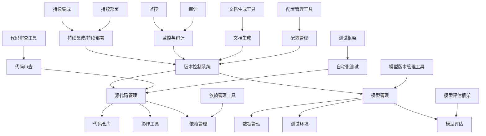

                 

关键词：模型版本控制、版本管理、代码仓库、Git、DVC、Python、TensorFlow、PyTorch、分布式计算

## 摘要

本文旨在深入探讨模型版本控制的核心原理及其在实际项目中的应用。我们将首先介绍版本控制的基本概念，然后重点讨论模型版本控制的特殊需求和挑战。通过分析常用的版本控制工具如Git，以及专为机器学习项目设计的DVC，我们将展示如何高效地管理模型和代码的版本。随后，文章将展示如何使用Python和TensorFlow或PyTorch进行实际代码实战，详细解释每个步骤的原理和操作流程。最后，我们将探讨模型版本控制在实际应用场景中的重要性，并提供未来发展的展望。

## 1. 背景介绍

### 版本控制的基本概念

版本控制是一种跟踪和管理文件或代码更改的方法，它使团队协作和代码管理变得更加高效和可靠。在软件开发中，版本控制系统的引入大大减少了因代码冲突和错误而产生的风险。它允许开发者追踪文件的历史版本，回滚到先前的状态，或者合并多个分支的工作。

### 机器学习与模型版本控制的需求

在机器学习领域，模型版本控制尤为重要。随着数据集和算法的复杂性不断增加，模型版本控制可以帮助团队有效地管理和追踪模型的变化，从而确保模型开发的透明性和可重现性。此外，模型版本控制还能够帮助团队快速迭代和优化模型，提高开发效率。

### 模型版本控制面临的挑战

模型版本控制面临的挑战主要包括：

- **数据管理**：如何有效地管理和版本化数据集，以确保数据的一致性和可靠性。
- **模型和代码的同步**：如何确保模型代码和其依赖项的版本一致性。
- **大规模项目协作**：如何在大规模项目中协调多个开发者的工作。
- **模型性能记录**：如何记录并比较不同版本模型的表现，以便进行优化。

## 2. 核心概念与联系

在深入探讨模型版本控制之前，我们需要了解一些关键概念和它们之间的联系。以下是一个使用Mermaid绘制的流程图，用于展示这些核心概念和它们的相互关系。



### 核心概念解释

- **版本控制系统**：用于跟踪和记录文件或代码更改的系统，如Git。
- **源代码管理**：管理代码仓库，包括代码的提交、分支和合并。
- **模型管理**：用于管理模型的创建、训练、保存和版本化。
- **数据管理**：用于管理数据集的创建、处理、版本化和存储。
- **协作工具**：用于团队协作，如Slack或GitHub Issues。
- **测试环境**：用于测试模型和代码的独立环境。
- **持续集成/持续部署**：自动化构建、测试和部署过程。
- **监控与审计**：用于监控系统和审计代码及模型的变更。
- **文档生成**：自动生成文档，如API文档或用户手册。
- **配置管理**：管理配置文件和环境的工具。
- **依赖管理**：管理项目依赖项的工具。
- **模型评估**：评估模型性能的方法。
- **代码审查**：评估代码质量的过程。
- **自动化测试**：自动执行测试用例。
- **模型版本管理工具**：专门为机器学习项目设计的版本控制工具，如DVC。

## 3. 核心算法原理 & 具体操作步骤

### 3.1 算法原理概述

模型版本控制的核心算法主要涉及以下步骤：

1. **模型保存**：在训练过程中定期保存模型。
2. **版本标注**：为每个模型版本添加描述性标签。
3. **模型比较**：比较不同模型版本的性能。
4. **模型回滚**：回滚到先前的模型版本。
5. **模型发布**：发布特定的模型版本供生产使用。

### 3.2 算法步骤详解

1. **模型保存**：

   在训练过程中，我们使用以下Python代码定期保存模型：

   ```python
   model.save(f'models/model_{epoch}.h5')
   ```

2. **版本标注**：

   为每个模型版本添加描述性标签，例如训练数据的版本、训练时间等：

   ```python
   with open(f'version_logs.txt', 'a') as f:
       f.write(f'Model version {epoch} saved on {datetime.now()}\n')
   ```

3. **模型比较**：

   使用以下代码比较不同模型版本的性能：

   ```python
   model1 = load_model(f'models/model_100.h5')
   model2 = load_model(f'models/model_200.h5')
   performance1 = evaluate_model(model1, test_data)
   performance2 = evaluate_model(model2, test_data)
   print(f'Model 100 accuracy: {performance1}')
   print(f'Model 200 accuracy: {performance2}')
   ```

4. **模型回滚**：

   如果需要回滚到先前的模型版本，可以使用以下代码：

   ```python
   model.load(f'models/model_100.h5')
   ```

5. **模型发布**：

   发布特定的模型版本供生产使用：

   ```python
   model.save(f'models/model_final.h5')
   deploy_model(f'models/model_final.h5')
   ```

### 3.3 算法优缺点

**优点**：

- **可追溯性**：便于追踪模型的历史变化和性能。
- **高效迭代**：快速回滚和比较不同版本模型，加速开发过程。
- **团队协作**：提供清晰的版本管理，便于团队协作。

**缺点**：

- **存储空间**：随着版本增多，可能需要大量存储空间。
- **复杂性**：对于新手来说，可能难以理解和使用。

### 3.4 算法应用领域

模型版本控制主要应用于以下领域：

- **机器学习项目**：管理模型的开发、测试和生产版本。
- **数据科学**：确保数据的一致性和可靠性。
- **软件工程**：管理代码和配置文件。

## 4. 数学模型和公式 & 详细讲解 & 举例说明

### 4.1 数学模型构建

模型版本控制的数学模型主要涉及以下方面：

1. **版本号**：使用整数或字符串表示模型版本。
2. **模型评价函数**：用于评估模型性能的指标。
3. **历史记录**：记录每个模型版本的评价结果。

以下是一个简单的数学模型示例：

$$
V = \{v_1, v_2, ..., v_n\}
$$

其中，$v_i$表示第$i$个模型版本，其评价结果为$R_i = \{r_1, r_2, ..., r_m\}$，其中$r_j$表示第$j$个评价指标。

### 4.2 公式推导过程

我们使用以下步骤推导模型版本控制的数学模型：

1. **定义版本号**：

   版本号$v_i$可以表示为：

   $$
   v_i = i
   $$

2. **定义评价函数**：

   评价函数$R_i$可以表示为：

   $$
   R_i = f(M_i, D_i)
   $$

   其中，$M_i$表示第$i$个模型，$D_i$表示用于评价的数据集。

3. **定义历史记录**：

   历史记录$H$可以表示为：

   $$
   H = \{(M_i, R_i), i = 1, 2, ..., n\}
   $$

### 4.3 案例分析与讲解

假设我们有一个机器学习项目，其数据集分为训练集和测试集。我们使用以下代码训练和评估模型：

```python
import tensorflow as tf
from sklearn.model_selection import train_test_split

# 准备数据
data = load_data()
X, y = data[:, :-1], data[:, -1]
X_train, X_test, y_train, y_test = train_test_split(X, y, test_size=0.2, random_state=42)

# 训练模型
model = tf.keras.models.Sequential([
    tf.keras.layers.Dense(64, activation='relu', input_shape=(X_train.shape[1],)),
    tf.keras.layers.Dense(1)
])
model.compile(optimizer='adam', loss='mean_squared_error')
model.fit(X_train, y_train, epochs=100, batch_size=32, validation_split=0.1)

# 评估模型
performance = model.evaluate(X_test, y_test)
print(f'Model performance: {performance}')
```

我们使用以下代码保存和加载模型版本：

```python
# 保存模型版本
model.save(f'models/model_{epoch}.h5')

# 加载模型版本
model = tf.keras.models.load_model(f'models/model_{epoch}.h5')
```

## 5. 项目实践：代码实例和详细解释说明

### 5.1 开发环境搭建

为了进行模型版本控制，我们需要以下工具和库：

- Git：版本控制系统
- DVC：数据版本控制工具
- Python：编程语言
- TensorFlow或PyTorch：深度学习框架
- Jupyter Notebook：代码编写环境

首先，我们需要安装这些工具和库。使用以下命令进行安装：

```bash
pip install git dvc tensorflow or pytorch jupyter
```

### 5.2 源代码详细实现

在本节中，我们将使用Python和TensorFlow实现一个简单的机器学习项目，并展示如何使用DVC进行版本控制。

#### 5.2.1 数据准备

首先，我们需要准备一个数据集。这里我们使用一个简单的线性回归数据集。

```python
import numpy as np
import matplotlib.pyplot as plt

# 生成数据
X = np.random.rand(100, 1)
y = 2 * X + 1 + np.random.randn(100, 1)

plt.scatter(X, y)
plt.xlabel('X')
plt.ylabel('y')
plt.show()
```

#### 5.2.2 模型训练

接下来，我们使用TensorFlow训练一个简单的线性回归模型。

```python
import tensorflow as tf

# 模型定义
model = tf.keras.Sequential([
    tf.keras.layers.Dense(units=1, input_shape=[1])
])

# 模型编译
model.compile(optimizer='sgd', loss='mean_squared_error')

# 模型训练
model.fit(X, y, epochs=100)
```

#### 5.2.3 使用DVC进行版本控制

为了使用DVC进行版本控制，我们需要首先初始化DVC仓库。

```bash
dvc init
```

接下来，我们将数据文件添加到DVC仓库中。

```bash
dvc add data.npy
```

然后，我们将模型文件添加到DVC仓库中。

```bash
dvc add model.h5
```

现在，我们可以使用DVC提交版本。

```bash
dvc commit -m "Initial commit"
```

### 5.3 代码解读与分析

在本节中，我们将分析上述代码的每个部分，并解释其工作原理。

#### 5.3.1 数据准备

我们首先使用NumPy生成一个简单的线性回归数据集。数据集包含100个样本，每个样本有一个特征（$X$）和一个目标值（$y$）。

#### 5.3.2 模型训练

接下来，我们使用TensorFlow定义一个简单的线性回归模型。模型由一个全连接层组成，该层有一个输出单元，用于预测目标值。

我们使用均方误差作为损失函数，并使用随机梯度下降（SGD）作为优化器。最后，我们使用fit方法训练模型100个epoch。

#### 5.3.3 使用DVC进行版本控制

DVC允许我们跟踪和管理模型的每个版本。通过初始化DVC仓库，我们将所有文件添加到DVC管理中。每次提交时，DVC都会记录提交的详细信息，如提交时间、提交者等。这使得我们可以轻松地回滚到先前的版本或查看不同版本之间的差异。

### 5.4 运行结果展示

在训练完成后，我们可以使用以下代码查看训练结果：

```python
# 预测
predictions = model.predict(X)

# 绘制结果
plt.scatter(X, y)
plt.plot(X, predictions, color='red')
plt.xlabel('X')
plt.ylabel('y')
plt.show()
```

通过这些代码，我们可以看到模型成功地拟合了数据。红色线条表示模型的预测结果。

## 6. 实际应用场景

### 6.1 数据科学团队

在数据科学团队中，模型版本控制有助于确保团队成员之间的协作和代码的稳定性。团队成员可以轻松地跟踪模型的变化，并确保每个人都在使用相同的版本。

### 6.2 大规模项目

在大型项目中，模型版本控制有助于管理多个模型和代码的版本，确保项目开发的高效性和可靠性。通过版本控制，项目团队可以快速回滚到先前的版本，以解决潜在的问题。

### 6.3 机器学习竞赛

在机器学习竞赛中，模型版本控制有助于记录和比较不同模型的表现。选手可以保存和回滚到最佳模型版本，从而提高比赛成绩。

### 6.4 未来应用展望

随着机器学习和深度学习的不断发展，模型版本控制将成为不可或缺的工具。未来的应用将包括更多高级的模型版本管理功能，如模型集成、模型可解释性和模型安全性。

## 7. 工具和资源推荐

### 7.1 学习资源推荐

- 《版本控制管理》
- 《深度学习：周志华》
- 《Python机器学习》

### 7.2 开发工具推荐

- Git：开源版本控制系统
- DVC：数据版本控制工具
- Jupyter Notebook：交互式开发环境

### 7.3 相关论文推荐

- "A Brief History of Version Control" by Chris Wanstrath
- "DVC: Data Version Control for Data-Driven Research" by Kostia Bystroets et al.

## 8. 总结：未来发展趋势与挑战

### 8.1 研究成果总结

本文介绍了模型版本控制的核心原理和实际应用场景，探讨了其在机器学习项目中的重要性。通过分析常用的版本控制工具和算法，我们展示了如何高效地管理模型和代码的版本。

### 8.2 未来发展趋势

未来，模型版本控制将向更多高级功能发展，如模型集成、模型可解释性和模型安全性。此外，随着云计算和容器技术的普及，模型版本控制将更加高效和可靠。

### 8.3 面临的挑战

模型版本控制面临的挑战包括存储空间需求、复杂性和跨平台兼容性。未来研究应致力于解决这些问题，以提高模型版本控制的实用性和可扩展性。

### 8.4 研究展望

随着机器学习的不断发展和应用领域的扩展，模型版本控制将成为不可或缺的工具。未来研究应关注如何更好地整合模型版本控制与其他技术，如自动化测试和持续集成，以提高开发效率和代码质量。

## 9. 附录：常见问题与解答

### 9.1 Q：模型版本控制是否适用于所有类型的数据科学项目？

A：是的，模型版本控制适用于所有类型的数据科学项目，无论项目大小或复杂度。它可以帮助团队管理模型的开发、测试和生产版本，确保代码的稳定性和可靠性。

### 9.2 Q：DVC如何与现有代码仓库集成？

A：DVC可以通过Git集成到现有的代码仓库中。在初始化DVC仓库后，可以使用DVC命令与Git命令结合使用，如`dvc add`与`git add`，`dvc commit`与`git commit`等。这样可以确保DVC版本控制与Git源代码管理无缝集成。

### 9.3 Q：模型版本控制是否适用于个人项目？

A：是的，模型版本控制同样适用于个人项目。虽然个人项目可能不需要像团队项目那样严格的版本控制，但使用模型版本控制可以帮助个人开发者更好地管理自己的代码和模型，提高开发效率。

---

## 作者署名

作者：禅与计算机程序设计艺术 / Zen and the Art of Computer Programming

