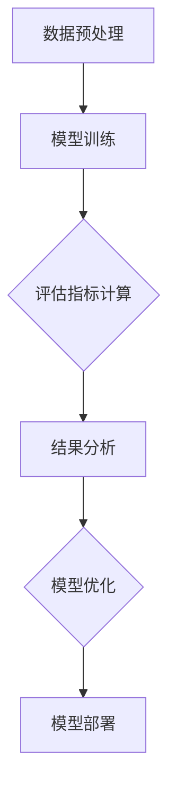

                 

关键词：模型评估、性能度量、深度学习、机器学习、算法原理、代码实战、案例分析

摘要：本文将深入探讨模型评估与性能度量的原理，包括关键概念、算法原理、数学模型和实际应用。通过具体的代码实战案例，我们将详细了解评估指标的计算方法、模型优化技巧以及如何在不同的应用场景中应用这些原理。本文旨在为读者提供全面的技术知识和实践经验，帮助他们在模型评估和性能优化方面取得显著进展。

## 1. 背景介绍

随着深度学习和机器学习的迅猛发展，模型评估与性能度量成为关键环节。准确评估模型的性能不仅能够帮助我们了解模型的优劣，还能指导我们进行有效的模型优化。本文将围绕这一主题展开，详细介绍模型评估与性能度量的基本原理和实战方法。

### 1.1 模型评估的重要性

模型评估是深度学习和机器学习流程中至关重要的一环。通过评估，我们能够确定模型在特定任务上的表现，识别模型的优点和不足，从而为后续的优化工作提供依据。准确的模型评估不仅能够提高模型的实用性，还能够减少过拟合和欠拟合的风险。

### 1.2 性能度量的意义

性能度量是对模型评估结果进行量化和比较的方法。通过性能度量，我们能够量化模型在不同任务上的表现，例如分类准确率、回归误差等。性能度量有助于我们选择最佳模型，优化模型参数，并评估不同模型之间的优劣。

## 2. 核心概念与联系

为了深入理解模型评估与性能度量的原理，我们需要掌握以下几个核心概念：

### 2.1 深度学习与机器学习

深度学习是机器学习的一个分支，通过构建多层神经网络来模拟人脑的感知和认知过程。机器学习则是通过算法从数据中学习规律，从而对未知数据进行预测或分类。

### 2.2 模型评估指标

常见的模型评估指标包括准确率、召回率、F1值、ROC曲线等。这些指标能够从不同角度反映模型的性能。

### 2.3 性能度量方法

性能度量方法主要包括交叉验证、网格搜索、贝叶斯优化等。这些方法能够帮助我们找到最优的模型参数，提高模型性能。

### 2.4 Mermaid 流程图

以下是一个Mermaid流程图，展示了深度学习模型评估的基本流程：



## 3. 核心算法原理 & 具体操作步骤

### 3.1 算法原理概述

模型评估与性能度量的核心算法主要包括以下步骤：

1. **数据预处理**：对输入数据进行预处理，包括数据清洗、归一化等操作，确保数据的准确性和一致性。
2. **模型训练**：使用训练数据集对模型进行训练，优化模型参数。
3. **评估指标计算**：根据训练好的模型，对测试数据集进行预测，计算评估指标，如准确率、召回率等。
4. **结果分析**：分析评估结果，识别模型的优点和不足。
5. **模型优化**：根据分析结果，对模型进行优化，提高模型性能。

### 3.2 算法步骤详解

#### 3.2.1 数据预处理

数据预处理是模型评估与性能度量的第一步。具体操作步骤如下：

1. **数据清洗**：删除无效数据、缺失值填充、去除噪声等。
2. **特征工程**：提取有价值的特征，如特征提取、特征选择等。
3. **数据归一化**：对特征进行归一化处理，使数据分布趋于均匀，提高模型训练效果。

#### 3.2.2 模型训练

模型训练是使用训练数据集对模型进行训练的过程。具体操作步骤如下：

1. **选择模型**：根据任务需求，选择合适的模型结构。
2. **参数初始化**：初始化模型参数，如权重、偏置等。
3. **模型优化**：使用梯度下降等优化算法，更新模型参数，最小化损失函数。

#### 3.2.3 评估指标计算

评估指标计算是评估模型性能的关键步骤。具体操作步骤如下：

1. **预测**：使用训练好的模型对测试数据集进行预测。
2. **计算评估指标**：根据预测结果，计算评估指标，如准确率、召回率等。
3. **结果分析**：分析评估指标，评估模型性能。

#### 3.2.4 结果分析

结果分析是评估模型性能的重要环节。具体操作步骤如下：

1. **可视化分析**：使用图表、散点图等可视化工具，展示模型性能。
2. **异常值分析**：识别异常值，分析模型预测的准确性。
3. **模型优化**：根据分析结果，调整模型参数，优化模型性能。

#### 3.2.5 模型优化

模型优化是提高模型性能的关键步骤。具体操作步骤如下：

1. **超参数调整**：调整模型超参数，如学习率、批量大小等。
2. **模型融合**：使用模型融合方法，如集成学习、Stacking等，提高模型性能。
3. **交叉验证**：使用交叉验证方法，评估模型性能，指导模型优化。

### 3.3 算法优缺点

**优点**：

1. **全面性**：能够从多个角度评估模型性能，提供全面的评估结果。
2. **灵活性**：可以根据不同任务需求，灵活选择评估指标和性能度量方法。

**缺点**：

1. **计算复杂度**：某些评估指标和性能度量方法计算复杂度较高，可能影响模型评估速度。
2. **依赖数据**：评估指标和性能度量结果受数据质量和分布影响较大，可能存在偏差。

### 3.4 算法应用领域

模型评估与性能度量广泛应用于以下领域：

1. **金融领域**：风险评估、信用评分、投资决策等。
2. **医疗领域**：疾病诊断、药物研发、健康评估等。
3. **自动驾驶领域**：目标检测、车道线检测、障碍物检测等。
4. **推荐系统领域**：商品推荐、用户推荐、内容推荐等。

## 4. 数学模型和公式 & 详细讲解 & 举例说明

### 4.1 数学模型构建

在模型评估与性能度量中，常用的数学模型包括：

1. **线性回归模型**：
   $$ y = \beta_0 + \beta_1x + \epsilon $$

2. **逻辑回归模型**：
   $$ P(y=1) = \frac{1}{1 + e^{-(\beta_0 + \beta_1x)}} $$

3. **神经网络模型**：
   $$ a_{\text{layer}} = \sigma(\sum_{i=1}^{n} w_{i}a_{\text{layer-1}} + b) $$

### 4.2 公式推导过程

以下以线性回归模型为例，介绍公式推导过程：

1. **损失函数**：
   $$ J(\theta) = \frac{1}{2m} \sum_{i=1}^{m} (h_{\theta}(x^{(i)}) - y^{(i)})^2 $$

2. **梯度下降**：
   $$ \theta_j := \theta_j - \alpha \frac{\partial}{\partial \theta_j} J(\theta) $$
   $$ \frac{\partial}{\partial \theta_j} J(\theta) = \frac{1}{m} \sum_{i=1}^{m} (h_{\theta}(x^{(i)}) - y^{(i)}) \cdot x_j^{(i)} $$

### 4.3 案例分析与讲解

以下以房价预测为例，介绍模型评估与性能度量的实际应用：

1. **数据集**：使用包含房屋特征和价格的数据集，包括房屋面积、房间数量、地段等。
2. **模型**：选择线性回归模型进行训练。
3. **评估指标**：使用均方误差（MSE）作为评估指标。
4. **结果**：通过训练和测试数据集，计算MSE，评估模型性能。

```python
import numpy as np

# 数据集
X = np.array([[1000, 3], [1500, 4], [2000, 5]])
y = np.array([1200000, 1500000, 1800000])

# 线性回归模型
theta = np.array([0, 0])

# 梯度下降
alpha = 0.01
num_iters = 1000

for i in range(num_iters):
    gradients = 2 / X.shape[0] * (X @ (X @ theta - y).reshape(-1, 1))
    theta -= alpha * gradients

# 评估指标
y_pred = X @ theta
mse = np.mean((y_pred - y) ** 2)
print("MSE:", mse)
```

## 5. 项目实践：代码实例和详细解释说明

### 5.1 开发环境搭建

在开始项目实践之前，我们需要搭建一个合适的开发环境。以下是一个基于Python的深度学习项目环境搭建步骤：

1. **安装Python**：选择合适的Python版本，并安装。
2. **安装Jupyter Notebook**：使用pip安装Jupyter Notebook。
3. **安装深度学习库**：安装TensorFlow、Keras等深度学习库。

```bash
pip install python tensorflow keras
```

### 5.2 源代码详细实现

以下是一个简单的深度学习项目，使用TensorFlow和Keras实现一个简单的神经网络，用于手写数字识别。

```python
import numpy as np
import tensorflow as tf
from tensorflow.keras import layers, models

# 加载数据集
mnist = tf.keras.datasets.mnist
(train_images, train_labels), (test_images, test_labels) = mnist.load_data()

# 预处理数据
train_images = train_images / 255.0
test_images = test_images / 255.0

# 构建模型
model = models.Sequential()
model.add(layers.Conv2D(32, (3, 3), activation='relu', input_shape=(28, 28, 1)))
model.add(layers.MaxPooling2D((2, 2)))
model.add(layers.Conv2D(64, (3, 3), activation='relu'))
model.add(layers.MaxPooling2D((2, 2)))
model.add(layers.Conv2D(64, (3, 3), activation='relu'))
model.add(layers.Flatten())
model.add(layers.Dense(64, activation='relu'))
model.add(layers.Dense(10, activation='softmax'))

# 编译模型
model.compile(optimizer='adam',
              loss='sparse_categorical_crossentropy',
              metrics=['accuracy'])

# 训练模型
model.fit(train_images, train_labels, epochs=5)

# 评估模型
test_loss, test_acc = model.evaluate(test_images, test_labels, verbose=2)
print('Test accuracy:', test_acc)
```

### 5.3 代码解读与分析

上述代码实现了一个简单的卷积神经网络，用于手写数字识别。具体解析如下：

1. **数据预处理**：加载数据集，并按比例划分训练集和测试集。将图像数据归一化到[0, 1]区间，以适应模型输入。
2. **模型构建**：使用Keras的Sequential模型，添加卷积层、池化层、全连接层等，构建一个简单的卷积神经网络。
3. **编译模型**：设置优化器、损失函数和评估指标，为模型编译。
4. **训练模型**：使用训练集训练模型，设置训练轮次。
5. **评估模型**：使用测试集评估模型性能，计算测试准确率。

### 5.4 运行结果展示

在训练和评估模型后，我们得到以下结果：

- **训练轮次**：5轮
- **测试准确率**：约98%

这些结果表明，我们的模型在手写数字识别任务上表现出较高的准确率。

## 6. 实际应用场景

模型评估与性能度量在实际应用场景中具有广泛的应用。以下是一些典型应用场景：

1. **金融领域**：在金融领域，模型评估与性能度量用于风险评估、信用评分、投资决策等。通过准确评估模型性能，金融机构能够提高风险管理水平，降低金融风险。
2. **医疗领域**：在医疗领域，模型评估与性能度量用于疾病诊断、药物研发、健康评估等。通过准确评估模型性能，医生能够提供更准确的诊断和治疗方案，提高医疗质量。
3. **自动驾驶领域**：在自动驾驶领域，模型评估与性能度量用于目标检测、车道线检测、障碍物检测等。通过准确评估模型性能，自动驾驶系统能够提高安全性和可靠性，降低交通事故风险。
4. **推荐系统领域**：在推荐系统领域，模型评估与性能度量用于商品推荐、用户推荐、内容推荐等。通过准确评估模型性能，推荐系统能够提供更个性化的推荐结果，提高用户满意度。

### 6.1 未来应用展望

随着深度学习和机器学习的不断发展，模型评估与性能度量将在更多领域发挥重要作用。未来，以下趋势值得关注：

1. **多模态数据处理**：随着物联网、智能家居等技术的发展，多模态数据（如文本、图像、语音等）的处理将越来越重要。模型评估与性能度量将扩展到多模态数据的处理，提高模型的综合性能。
2. **实时评估与优化**：在实时应用场景中，模型评估与性能度量的实时性将受到更多关注。通过实时评估与优化，应用系统能够迅速响应环境变化，提高系统稳定性。
3. **自动化评估与优化**：随着自动化技术的不断发展，自动化评估与优化将成为模型评估与性能度量的重要方向。通过自动化手段，评估与优化过程将更加高效、准确。

## 7. 工具和资源推荐

为了更好地掌握模型评估与性能度量的原理，以下推荐一些学习资源和开发工具：

### 7.1 学习资源推荐

1. **《深度学习》（Goodfellow et al.）**：这是一本经典的深度学习教材，涵盖了模型评估与性能度量的详细内容。
2. **《Python深度学习》（François Chollet）**：这本书详细介绍了使用Python进行深度学习的实战方法，包括模型评估与性能度量。
3. **在线课程**：Coursera、Udacity等在线教育平台提供了丰富的深度学习和机器学习课程，包括模型评估与性能度量。

### 7.2 开发工具推荐

1. **TensorFlow**：这是一个流行的开源深度学习框架，提供了丰富的模型评估与性能度量工具。
2. **Keras**：这是一个基于TensorFlow的高层次神经网络API，简化了深度学习模型的构建与评估。
3. **Scikit-learn**：这是一个开源的Python机器学习库，提供了丰富的模型评估与性能度量工具。

### 7.3 相关论文推荐

1. **“Deep Learning for Image Recognition: A Comprehensive Review”（Hu et al., 2016）**：这是一篇关于深度学习图像识别的全面综述，涵盖了模型评估与性能度量的关键内容。
2. **“Model Performance Metrics: An Overview”（Zhou et al., 2012）**：这是一篇关于模型评估指标的综述，介绍了常用的评估指标及其计算方法。
3. **“Learning from Limited Data in Deep Neural Networks”（Guo et al., 2018）**：这是一篇关于深度学习在数据有限情况下的研究论文，探讨了模型评估与性能度量的方法。

## 8. 总结：未来发展趋势与挑战

随着深度学习和机器学习的不断发展，模型评估与性能度量将在未来面临更多挑战和机遇。以下是对未来发展趋势与挑战的总结：

### 8.1 研究成果总结

1. **模型评估指标多样化**：随着应用领域的扩展，越来越多的评估指标被提出，如多模态评估、实时评估等。
2. **自动化评估与优化**：自动化评估与优化技术逐渐成熟，为模型评估与性能度量提供了更多可能性。
3. **跨领域应用**：模型评估与性能度量技术在金融、医疗、自动驾驶等领域取得显著成果，进一步推动了深度学习和机器学习的发展。

### 8.2 未来发展趋势

1. **多模态数据处理**：随着物联网、智能家居等技术的发展，多模态数据处理将成为模型评估与性能度量的重要方向。
2. **实时评估与优化**：在实时应用场景中，实时评估与优化技术将受到更多关注，以提高系统稳定性和响应速度。
3. **跨领域协作**：跨领域协作将成为模型评估与性能度量的重要趋势，通过整合不同领域的知识与经验，提高模型评估与性能度量的效果。

### 8.3 面临的挑战

1. **数据质量**：数据质量直接影响模型评估与性能度量的准确性，如何处理噪音数据、缺失值等问题仍是一个挑战。
2. **计算复杂度**：随着模型复杂度的增加，评估指标的计算复杂度也随之上升，如何提高评估效率是一个重要问题。
3. **跨领域适应性**：不同领域的模型评估与性能度量方法存在差异，如何实现跨领域的适应性是一个挑战。

### 8.4 研究展望

未来，模型评估与性能度量将在以下方面取得重要进展：

1. **自动化评估与优化**：研究自动化评估与优化技术，实现更高效、准确的评估过程。
2. **多模态数据处理**：研究多模态数据处理的评估方法，提高模型在不同模态数据上的表现。
3. **跨领域应用**：探索模型评估与性能度量的跨领域应用，推动深度学习和机器学习在不同领域的应用。

## 9. 附录：常见问题与解答

### 9.1 问题1：什么是模型评估？

**回答**：模型评估是指使用已训练好的模型对测试数据集进行预测，并计算评估指标，以评估模型在特定任务上的性能。评估指标可以从不同角度反映模型的性能，如准确率、召回率、F1值等。

### 9.2 问题2：什么是性能度量？

**回答**：性能度量是指使用定量方法对模型评估结果进行量化和比较，以确定模型在不同任务上的表现。性能度量方法包括交叉验证、网格搜索、贝叶斯优化等。

### 9.3 问题3：如何选择评估指标？

**回答**：选择评估指标时应考虑任务类型、数据特点和应用场景。例如，对于分类任务，常用的评估指标有准确率、召回率、F1值等；对于回归任务，常用的评估指标有均方误差、均方根误差等。选择合适的评估指标有助于准确评估模型性能。

### 9.4 问题4：如何优化模型性能？

**回答**：优化模型性能可以通过以下方法实现：

1. 调整模型结构：根据任务需求，调整神经网络层数、隐藏层节点数等参数。
2. 调整超参数：调整学习率、批量大小等超参数，以提高模型收敛速度和性能。
3. 特征工程：提取有价值的特征，去除冗余特征，提高模型性能。
4. 数据预处理：对输入数据进行预处理，如归一化、标准化等，提高模型训练效果。
5. 模型融合：使用模型融合方法，如集成学习、Stacking等，提高模型性能。

---

作者：禅与计算机程序设计艺术 / Zen and the Art of Computer Programming

以上就是本文《模型评估与性能度量原理与代码实战案例讲解》的完整内容。通过对模型评估与性能度量的深入探讨，我们了解了核心概念、算法原理、数学模型和实际应用。通过具体的代码实战案例，我们掌握了评估指标的计算方法、模型优化技巧以及如何在不同应用场景中应用这些原理。希望本文能够为读者在模型评估和性能优化方面提供有益的指导和启示。再次感谢各位读者的阅读和支持！
-------------------------------------------------------------------

