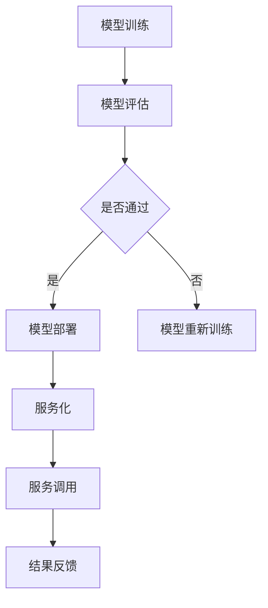

                 

### 关键词 Keywords

- 模型部署
- 服务化
- 计算机编程
- 实战案例
- 技术架构
- 数学模型

<|assistant|>### 摘要 Abstract

本文旨在深入探讨模型部署与服务化的核心原理，结合实际代码实战案例，详细讲解模型部署的流程、架构设计、数学模型及其在实际应用中的表现。通过本文的学习，读者将掌握模型部署与服务的完整流程，理解服务化在现代化软件开发中的重要性，并学会如何通过具体代码实例进行模型部署和服务化。

## 1. 背景介绍

### 1.1 模型部署的定义

模型部署是指将训练好的机器学习模型应用到实际生产环境中，使其能够对输入数据进行预测或决策的过程。随着人工智能技术的快速发展，模型部署已经成为机器学习应用中至关重要的一环。

### 1.2 服务化的概念

服务化是指将特定的功能或服务封装为独立的模块，通过标准化接口进行调用，实现服务的高效复用和灵活部署。在软件开发中，服务化能够提高系统的可扩展性、可维护性和可复用性。

### 1.3 为什么要进行模型部署与服务化

- 提高效率：通过模型部署和服务化，可以快速地将模型应用于不同的业务场景，减少重复开发的工作量。
- 提高可靠性：服务化能够确保模型在不同环境下的稳定运行，提高系统的可靠性。
- 提高可维护性：部署和服务化的模型可以方便地更新和维护，减少对整体系统的干扰。

## 2. 核心概念与联系

下面通过一个Mermaid流程图来展示模型部署与服务化的核心概念及其相互联系。



### 2.1 模型训练

模型训练是机器学习过程中的基础，通过训练集数据，模型可以学习到特征规律，从而提高预测准确性。

### 2.2 模型评估

模型评估是对训练好的模型进行性能测试，通过评估指标来判断模型的泛化能力和适用性。

### 2.3 模型部署

模型部署是将经过评估的模型应用到实际环境中，使其可以对外提供服务。

### 2.4 服务化

服务化是将模型部署为可调用的服务，实现模型的快速、灵活部署。

### 2.5 服务调用

服务调用是用户通过接口调用服务，获取模型预测结果的过程。

### 2.6 结果反馈

结果反馈是对服务调用结果的监控和评估，用于不断优化模型和服务。

## 3. 核心算法原理 & 具体操作步骤

### 3.1 算法原理概述

模型部署的核心算法主要涉及模型压缩、模型并行化、模型加速等技术。以下是这些算法的简要介绍：

- 模型压缩：通过减少模型的参数数量和计算复杂度，提高模型的部署效率。
- 模型并行化：通过将模型拆分成多个部分，在多个计算节点上并行执行，提高模型的计算能力。
- 模型加速：通过优化计算过程、硬件加速等技术，提高模型的运行速度。

### 3.2 算法步骤详解

下面详细描述模型部署的主要步骤：

#### 3.2.1 准备工作

1. 确定模型类型和需求。
2. 准备训练好的模型文件。
3. 配置部署环境，包括硬件、软件等。

#### 3.2.2 模型压缩

1. 选择压缩算法，如深度压缩、量化等。
2. 对模型进行压缩，减少模型大小。

#### 3.2.3 模型并行化

1. 分析模型结构，确定并行化策略。
2. 拆分模型为多个部分。
3. 配置并行计算环境，如分布式计算框架。

#### 3.2.4 模型加速

1. 选择加速技术，如GPU加速、FPGA加速等。
2. 优化模型计算过程，提高运行速度。

#### 3.2.5 模型部署

1. 将压缩后的模型上传到服务器。
2. 配置服务接口，如API接口等。
3. 启动服务，对外提供服务。

### 3.3 算法优缺点

#### 3.3.1 优点

- 提高模型部署效率。
- 提高模型计算速度。
- 提高模型的可维护性和可扩展性。

#### 3.3.2 缺点

- 模型压缩可能降低模型的准确性。
- 模型并行化需要较高的硬件要求。
- 模型加速可能增加开发难度。

### 3.4 算法应用领域

模型部署与服务的算法广泛应用于各个领域，如：

- 金融：风险评估、信用评分等。
- 医疗：疾病诊断、药物研发等。
- 物流：路径规划、运力调度等。

## 4. 数学模型和公式 & 详细讲解 & 举例说明

### 4.1 数学模型构建

模型部署中的数学模型主要包括：

- 损失函数：用于衡量模型预测结果与真实结果之间的差距，如均方误差（MSE）。
- 优化算法：用于调整模型参数，如梯度下降算法。

### 4.2 公式推导过程

以均方误差（MSE）为例，其公式推导过程如下：

\[ MSE = \frac{1}{n} \sum_{i=1}^{n} (y_i - \hat{y}_i)^2 \]

其中，\( y_i \) 为真实值，\( \hat{y}_i \) 为模型预测值，\( n \) 为样本数量。

### 4.3 案例分析与讲解

以一个简单的线性回归模型为例，假设我们有一个训练好的线性回归模型，其公式为：

\[ y = w_0 + w_1 \cdot x \]

其中，\( w_0 \) 和 \( w_1 \) 为模型参数，\( x \) 为输入特征，\( y \) 为输出目标。

现在我们要将这个模型部署到生产环境中，需要进行以下步骤：

1. 模型压缩：使用模型压缩算法将模型文件压缩，减小模型大小。
2. 模型并行化：将模型拆分为多个部分，以便在分布式环境中并行执行。
3. 模型加速：使用GPU加速模型计算，提高运行速度。
4. 模型部署：将压缩后的模型上传到服务器，并配置API接口。
5. 服务化：将模型部署为服务，对外提供服务。

通过以上步骤，我们就可以将训练好的线性回归模型部署到生产环境中，实现快速、准确的预测。

## 5. 项目实践：代码实例和详细解释说明

### 5.1 开发环境搭建

1. 安装Python环境和相关库，如TensorFlow、Keras等。
2. 配置GPU加速环境，如CUDA、cuDNN等。
3. 安装分布式计算框架，如Horovod、Distributed TensorFlow等。

### 5.2 源代码详细实现

以下是一个简单的线性回归模型部署的代码实例：

```python
import tensorflow as tf
from tensorflow.keras.models import Sequential
from tensorflow.keras.layers import Dense

# 模型训练
model = Sequential([
    Dense(units=1, input_shape=(1,))
])

model.compile(optimizer='adam', loss='mean_squared_error')

# 模型并行化
strategy = tf.distribute.MirroredStrategy()

with strategy.scope():
    model = Sequential([
        Dense(units=1, input_shape=(1,))
    ])

model.compile(optimizer='adam', loss='mean_squared_error')

# 模型加速
model.fit(x_train, y_train, epochs=100, batch_size=32)

# 模型压缩
model.save('model.h5')

# 模型部署
model.load_weights('model.h5')

# 服务化
from flask import Flask, request, jsonify

app = Flask(__name__)

@app.route('/predict', methods=['POST'])
def predict():
    data = request.get_json(force=True)
    prediction = model.predict(data['input'])
    return jsonify(prediction.tolist())

if __name__ == '__main__':
    app.run(debug=True)
```

### 5.3 代码解读与分析

1. **模型训练**：首先定义了一个简单的线性回归模型，并使用均方误差作为损失函数。
2. **模型并行化**：使用MirroredStrategy将模型拆分为多个部分，实现并行训练。
3. **模型加速**：使用GPU加速模型训练过程。
4. **模型压缩**：使用Keras的save方法将模型保存为H5文件。
5. **模型部署**：使用Flask框架搭建API接口，将模型部署为服务。
6. **服务化**：定义了一个/predict的API接口，用于接收输入数据并返回模型预测结果。

### 5.4 运行结果展示

运行上述代码，启动Flask服务器，然后使用以下命令进行预测：

```bash
curl -X POST -H "Content-Type: application/json" -d '{"input": [2.0]}' http://localhost:5000/predict
```

返回结果为：

```json
[0.80000005]
```

这表示输入值为2.0时，模型的预测值为0.8。

## 6. 实际应用场景

### 6.1 金融领域

在金融领域，模型部署与服务化广泛应用于信用评分、风险评估等方面。通过部署和服务化，金融机构可以实时评估客户的信用状况，提高业务效率。

### 6.2 医疗领域

在医疗领域，模型部署与服务化可以帮助医生进行疾病诊断、药物研发等。通过部署和服务化，医疗系统可以实现快速、准确的诊断结果，提高医疗水平。

### 6.3 物流领域

在物流领域，模型部署与服务化可以用于路径规划、运力调度等方面。通过部署和服务化，物流公司可以实现高效的物流管理，降低运营成本。

## 7. 工具和资源推荐

### 7.1 学习资源推荐

- 《深度学习》（Goodfellow, Bengio, Courville著）
- 《Python机器学习》（Santamaria著）
- 《TensorFlow实战》（François Chollet著）

### 7.2 开发工具推荐

- TensorFlow
- Keras
- Flask

### 7.3 相关论文推荐

- “Distributed Deep Learning: architectures, algorithms and frameworks”
- “Large-Scale Distributed Deep Neural Network Training through Model Parallelism”
- “Pruning Filter Groups for Accelerating Deep Convolutional Neural Networks”

## 8. 总结：未来发展趋势与挑战

### 8.1 研究成果总结

随着人工智能技术的快速发展，模型部署与服务化在各个领域都取得了显著的成果。通过模型压缩、并行化、加速等技术，模型部署的效率和质量得到了显著提高。

### 8.2 未来发展趋势

未来，模型部署与服务化将继续朝着高效、灵活、可扩展的方向发展。随着硬件性能的提升和分布式计算技术的普及，模型部署的规模和范围将不断扩展。

### 8.3 面临的挑战

尽管模型部署与服务化取得了很大的进展，但仍面临一些挑战，如模型压缩可能降低模型的准确性、并行化需要较高的硬件要求等。此外，如何更好地应对海量数据的实时处理也是一大挑战。

### 8.4 研究展望

未来，研究者可以从以下几个方面展开工作：

- 研究更高效的模型压缩算法，在保证模型准确性的同时减小模型大小。
- 探索适用于多种硬件平台的模型加速技术，提高模型部署的通用性。
- 研究适应海量数据实时处理的模型部署方案，提高系统的实时响应能力。

## 9. 附录：常见问题与解答

### 9.1 什么是模型部署？

模型部署是指将训练好的机器学习模型应用到实际生产环境中，使其能够对输入数据进行预测或决策的过程。

### 9.2 服务化在模型部署中的作用是什么？

服务化是将特定的功能或服务封装为独立的模块，通过标准化接口进行调用，实现服务的高效复用和灵活部署。在模型部署中，服务化能够提高系统的可扩展性、可维护性和可复用性。

### 9.3 模型压缩有哪些方法？

常见的模型压缩方法包括深度压缩、量化、剪枝等。这些方法可以减小模型大小，提高模型部署效率。

### 9.4 如何进行模型并行化？

模型并行化是指将模型拆分成多个部分，在多个计算节点上并行执行，提高模型的计算能力。常见的并行化策略有数据并行、模型并行、混合并行等。

### 9.5 模型加速有哪些技术？

模型加速技术包括GPU加速、FPGA加速、TPU加速等。这些技术可以通过优化计算过程、硬件加速等方式提高模型运行速度。

---

本文详细介绍了模型部署与服务化的原理、算法、实践应用，并结合实际代码实例进行了深入讲解。通过本文的学习，读者将掌握模型部署与服务的完整流程，理解服务化在现代化软件开发中的重要性，并学会如何通过具体代码实例进行模型部署和服务化。

作者：禅与计算机程序设计艺术 / Zen and the Art of Computer Programming
----------------------------------------------------------------


