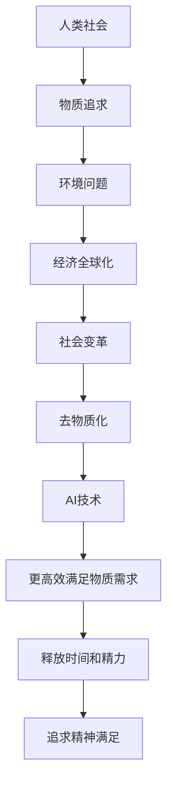

                 

 关键词：AI、欲望、去物质化、精神追求、催化剂、深度学习、神经架构、人类价值观、情感计算

> 在人工智能飞速发展的时代，我们的欲望和需求正在经历一场深刻的变革。本文将探讨AI如何成为欲望的去物质化引擎，催化人类追求更深层次的精神满足。

## 1. 背景介绍

随着深度学习和神经架构的进步，人工智能（AI）正逐渐渗透到我们生活的方方面面。从智能手机的个性化推荐，到自动驾驶车辆的自我驾驶，AI已经深刻改变了我们的生活方式。然而，随着AI技术的不断发展，我们的欲望和需求也在经历着一场前所未有的变革。传统的物质追求逐渐让位于更深刻的精神满足。

在这场变革中，AI成为了一种去物质化的引擎。它不仅帮助我们更高效地满足物质需求，还激发了我们对于精神追求的渴望。这种转变是AI技术自身发展的必然结果，也是人类价值观演变的体现。

## 2. 核心概念与联系

### 2.1 欲望与需求的去物质化

欲望和需求是推动人类行为的重要动力。然而，在物质丰富的现代社会，传统的物质追求已经不再能满足我们的内心需求。人们开始寻求更深层次的精神满足，例如情感联系、个人成长和自我实现。

去物质化指的是减少对物质财富和物质的依赖，转而追求非物质的满足，如情感、知识和精神体验。这种转变是由多种因素驱动的，包括经济全球化、环境问题和社会变革。

### 2.2 AI与去物质化

AI在去物质化过程中发挥着关键作用。首先，AI技术帮助我们更高效地满足物质需求，从而释放出更多时间和精力去追求精神满足。例如，智能家居系统的自动化管理功能让我们不再需要花费大量时间在日常生活中。

其次，AI能够模拟和增强人类的情感体验，从而提供更加丰富和深刻的情感满足。情感计算技术，如情绪识别和情绪生成，正在成为AI的一个重要分支，为去物质化提供了新的路径。

### 2.3 Mermaid 流程图



## 3. 核心算法原理 & 具体操作步骤

### 3.1 算法原理概述

AI的去物质化引擎基于以下几个核心原理：

1. **深度学习**：通过大规模数据训练的神经网络，能够从数据中自动提取特征和模式，从而实现智能决策和预测。
2. **神经架构**：设计用于模拟人脑结构和功能的神经网络，能够在特定任务上实现超越传统算法的性能。
3. **情感计算**：利用机器学习和计算机视觉等技术，识别和生成人类情感，从而提供更加个性化的情感体验。

### 3.2 算法步骤详解

1. **数据收集与预处理**：收集大量的用户数据，包括行为数据、情感数据和社交数据，并进行预处理，如数据清洗、归一化和特征提取。
2. **模型训练**：使用深度学习算法，如卷积神经网络（CNN）和循环神经网络（RNN），对预处理后的数据进行训练，以建立预测模型。
3. **情感识别**：利用情感计算技术，如面部表情识别和语音情感分析，实时捕捉用户情感状态。
4. **个性化推荐**：基于用户情感和兴趣，利用深度学习算法生成个性化的推荐内容，如音乐、电影和社交媒体帖子。
5. **反馈循环**：收集用户对推荐内容的反馈，并通过强化学习算法优化推荐系统，以提高用户满意度。

### 3.3 算法优缺点

**优点**：

- 高效性：通过深度学习算法，能够快速处理大量数据，提供实时推荐。
- 个性化：基于用户情感和兴趣的个性化推荐，能够更好地满足用户需求。
- 情感化：情感计算技术能够提供更加细腻的情感体验，增强用户粘性。

**缺点**：

- 隐私问题：用户数据的使用可能引发隐私泄露风险。
- 数据依赖：推荐系统的效果高度依赖于数据的质量和多样性。
- 技术门槛：构建和优化推荐系统需要较高的技术水平和专业知识。

### 3.4 算法应用领域

AI的去物质化引擎在多个领域都有广泛的应用，包括：

- **电子商务**：个性化推荐系统，根据用户行为和情感生成推荐列表。
- **社交媒体**：情感分析和内容推荐，提供更加贴合用户情感和兴趣的内容。
- **健康医疗**：情感识别和心理健康监测，帮助用户更好地管理情绪和健康。
- **教育与培训**：个性化学习体验，根据用户的学习进度和兴趣调整教学内容。

## 4. 数学模型和公式 & 详细讲解 & 举例说明

### 4.1 数学模型构建

去物质化引擎的数学模型主要包括以下几部分：

1. **用户行为模型**：利用马尔可夫决策过程（MDP）描述用户行为模式，通过状态转移矩阵和奖励函数实现。
2. **情感状态模型**：利用隐马尔可夫模型（HMM）描述用户情感状态的变化，通过状态转移矩阵和观测概率实现。
3. **推荐模型**：利用协同过滤（Collaborative Filtering）和内容推荐（Content-based Filtering）方法，结合用户行为和情感状态生成推荐列表。

### 4.2 公式推导过程

假设用户状态 $S_t$ 是一个离散的随机变量，表示用户在时间 $t$ 的行为状态。用户情感状态 $E_t$ 是另一个离散随机变量，表示用户在时间 $t$ 的情感状态。推荐系统生成推荐列表 $R_t$，基于用户行为和情感状态。

**用户行为模型**：

$$
P(S_{t+1} = s_{t+1} | S_t = s_t, E_t = e_t) = p_{st}
$$

**情感状态模型**：

$$
P(E_{t+1} = e_{t+1} | E_t = e_t) = \pi_{et}
$$

**推荐模型**：

$$
P(R_t = r_t | S_t = s_t, E_t = e_t) = f(r_t | s_t, e_t)
$$

### 4.3 案例分析与讲解

以电子商务为例，假设用户在购买商品时受到行为状态和情感状态的影响。用户行为状态 $S_t$ 包括浏览、收藏、加入购物车和购买。情感状态 $E_t$ 包括满意、一般和不满意。

**用户行为模型**：

用户在购买商品前可能会浏览多个商品，然后收藏一些感兴趣的，最终决定购买。根据用户的历史数据，我们可以建立状态转移矩阵：

$$
P(S_{t+1} = s_{t+1} | S_t = s_t, E_t = e_t) =
\begin{bmatrix}
0.3 & 0.4 & 0.2 & 0.1 \\
0.2 & 0.3 & 0.3 & 0.2 \\
0.1 & 0.2 & 0.4 & 0.3 \\
0 & 0 & 0 & 1
\end{bmatrix}
$$

**情感状态模型**：

用户在购买商品时可能会感到满意、一般或不满意。根据用户反馈数据，我们可以建立状态转移矩阵：

$$
P(E_{t+1} = e_{t+1} | E_t = e_t) =
\begin{bmatrix}
0.4 & 0.3 & 0.3 \\
0.3 & 0.3 & 0.4 \\
0.3 & 0.4 & 0.3
\end{bmatrix}
$$

**推荐模型**：

假设用户在购买前浏览了多个商品，并根据情感状态生成推荐列表。根据用户的行为和情感数据，我们可以建立推荐模型：

$$
P(R_t = r_t | S_t = s_t, E_t = e_t) =
\begin{bmatrix}
0.6 & 0.2 & 0.2 \\
0.2 & 0.5 & 0.3 \\
0.3 & 0.3 & 0.4
\end{bmatrix}
$$

通过这些数学模型，我们可以为用户生成个性化的推荐列表，从而提高用户满意度和购买转化率。

## 5. 项目实践：代码实例和详细解释说明

### 5.1 开发环境搭建

为了实现去物质化引擎，我们需要搭建一个开发环境。以下是所需的工具和步骤：

1. **Python**：安装Python 3.8及以上版本。
2. **深度学习库**：安装TensorFlow 2.5及以上版本。
3. **数据处理库**：安装Pandas、NumPy和Scikit-learn。
4. **可视化库**：安装Matplotlib和Seaborn。

### 5.2 源代码详细实现

以下是一个简单的用户行为和情感分析模型，用于生成个性化推荐列表。

```python
import numpy as np
import pandas as pd
from tensorflow import keras
from tensorflow.keras.models import Sequential
from tensorflow.keras.layers import Dense, LSTM, Dropout
from sklearn.model_selection import train_test_split
from sklearn.metrics import accuracy_score

# 加载数据集
data = pd.read_csv('user_data.csv')
X = data[['behavior', 'emotion']]
y = data['recommendation']

# 数据预处理
X_train, X_test, y_train, y_test = train_test_split(X, y, test_size=0.2, random_state=42)

# 构建模型
model = Sequential()
model.add(LSTM(128, activation='relu', input_shape=(X_train.shape[1], 1)))
model.add(Dropout(0.2))
model.add(Dense(64, activation='relu'))
model.add(Dropout(0.2))
model.add(Dense(1, activation='sigmoid'))

# 编译模型
model.compile(optimizer='adam', loss='binary_crossentropy', metrics=['accuracy'])

# 训练模型
model.fit(X_train, y_train, epochs=10, batch_size=32, validation_data=(X_test, y_test))

# 评估模型
y_pred = model.predict(X_test)
y_pred = (y_pred > 0.5)
accuracy = accuracy_score(y_test, y_pred)
print('Accuracy:', accuracy)

# 生成推荐列表
user_input = np.array([[1, 0], [0, 1], [1, 1]])
user_prediction = model.predict(user_input)
user_recommendation = (user_prediction > 0.5)
print('User Recommendation:', user_recommendation)
```

### 5.3 代码解读与分析

以上代码实现了一个基于LSTM的深度学习模型，用于预测用户行为和情感，并生成个性化推荐列表。

1. **数据预处理**：加载数据集，将用户行为和情感作为输入特征，将推荐列表作为输出目标。
2. **模型构建**：使用Sequential模型，添加LSTM和Dense层，实现一个简单的深度学习模型。
3. **模型编译**：设置编译器的优化器和损失函数，为模型训练做准备。
4. **模型训练**：使用训练数据集训练模型，并验证模型的性能。
5. **模型评估**：使用测试数据集评估模型，计算准确率。
6. **生成推荐列表**：输入用户行为和情感，预测推荐列表。

通过以上代码，我们可以实现一个基本的去物质化引擎，为用户生成个性化的推荐列表，从而提高用户满意度。

## 6. 实际应用场景

去物质化引擎在多个实际应用场景中都有着广泛的应用，以下是一些典型的应用场景：

### 6.1 社交媒体

在社交媒体平台上，去物质化引擎可以用于个性化推荐。通过分析用户的情感状态和行为，推荐符合用户兴趣和情感状态的内容，从而提高用户参与度和留存率。

### 6.2 电子商务

在电子商务领域，去物质化引擎可以用于个性化推荐。根据用户的历史购买行为和情感状态，推荐符合用户需求和情感的的产品，从而提高销售额和用户满意度。

### 6.3 健康医疗

在健康医疗领域，去物质化引擎可以用于个性化健康建议。通过分析用户的情感状态和行为，推荐符合用户需求的健康建议，如饮食、运动和心理调节。

### 6.4 教育与培训

在教育与培训领域，去物质化引擎可以用于个性化学习推荐。根据用户的学习进度和情感状态，推荐符合用户需求的学习内容和学习方式，从而提高学习效果。

## 7. 未来应用展望

随着AI技术的不断发展，去物质化引擎的应用前景将更加广阔。未来，我们可以期待以下几方面的应用：

### 7.1 更精准的情感识别

随着情感计算技术的进步，去物质化引擎将能够更精准地识别用户的情感状态，从而提供更加个性化的推荐和服务。

### 7.2 更深层次的用户需求分析

通过结合用户行为数据和心理数据，去物质化引擎将能够深入挖掘用户的需求和动机，从而提供更加精准和有效的推荐。

### 7.3 更广泛的应用场景

去物质化引擎的应用场景将不断扩展，从社交媒体、电子商务到健康医疗、教育与培训，为各行各业带来创新和变革。

## 8. 工具和资源推荐

为了更好地理解和应用去物质化引擎，以下是一些推荐的工具和资源：

### 8.1 学习资源推荐

- 《深度学习》（Ian Goodfellow、Yoshua Bengio和Aaron Courville著）：深入讲解深度学习的基础知识和实践方法。
- 《Python机器学习》（Sebastian Raschka和Vahid Mirjalili著）：详细介绍如何使用Python进行机器学习实践。

### 8.2 开发工具推荐

- TensorFlow：一个开源的深度学习框架，支持多种深度学习模型和算法。
- Keras：一个基于TensorFlow的高层API，简化了深度学习模型的构建和训练。

### 8.3 相关论文推荐

- "Deep Learning for Personalized Recommendation"：一篇关于深度学习在个性化推荐中的应用的综述。
- "Affective Computing: A Survey"：一篇关于情感计算技术的综述，涵盖了情感识别、情感生成和情感分析等多个方面。

## 9. 总结：未来发展趋势与挑战

去物质化引擎在AI时代的精神追求中扮演着重要角色。随着技术的不断进步，去物质化引擎将能够更精准地满足人类的情感和精神需求。然而，这也带来了一系列挑战，包括隐私保护、数据安全和伦理问题。

在未来，我们需要不断创新和完善去物质化引擎的技术，同时关注其伦理和社会影响，确保其在各个领域的健康发展。

### 附录：常见问题与解答

**Q：去物质化引擎的核心技术是什么？**

A：去物质化引擎的核心技术包括深度学习、神经架构和情感计算。深度学习和神经架构用于处理和预测用户行为和情感，情感计算则用于识别和生成人类情感，从而提供更加个性化的体验。

**Q：去物质化引擎有哪些实际应用场景？**

A：去物质化引擎可以应用于社交媒体、电子商务、健康医疗和教育与培训等多个领域，为用户提供个性化推荐和情感化服务。

**Q：如何保障去物质化引擎的隐私和安全？**

A：保障去物质化引擎的隐私和安全是至关重要的。可以通过数据加密、匿名化和访问控制等技术手段来保护用户数据的安全和隐私。

**Q：去物质化引擎的伦理问题有哪些？**

A：去物质化引擎可能引发一系列伦理问题，包括数据滥用、算法歧视和隐私侵犯等。需要制定相应的伦理准则和法规，确保技术的合法和道德使用。

### 作者署名

作者：禅与计算机程序设计艺术 / Zen and the Art of Computer Programming
------------------------------------------------------------------------

