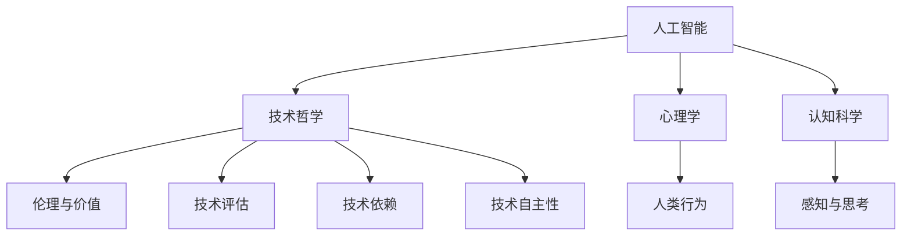

                 

 在这个快速变化的时代，人工智能（AI）正在以前所未有的速度影响着我们的生活方式和社会结构。从自动驾驶汽车到智能家居，从医疗诊断到金融交易，AI的应用已经渗透到我们生活的方方面面。然而，随着AI技术的不断成熟和普及，一个更深层次的问题逐渐浮现：在AI时代，我们如何理解和追求精神层面的满足？

本文将探讨这一主题，从多个角度分析AI时代的精神追求。首先，我们将回顾人类历史上的欲望演变过程，探讨欲望从物质追求向精神追求转变的必然性。接着，我们将深入探讨AI时代带来的技术变革如何影响我们的精神世界，以及我们如何在这个新的时代中寻找内心的平衡和满足。最后，我们将展望未来，探讨AI技术如何进一步推动人类精神追求的发展，以及我们可能面临的挑战。

通过这篇文章，我希望能够引发读者对于AI时代精神追求的深入思考，帮助我们更好地理解这个复杂而充满机遇的时代。

## 1. 背景介绍

人类历史上的欲望演变是一个漫长而复杂的过程。从最早的原始社会到现代社会，人类的欲望经历了从基本物质需求向精神追求的深刻转变。在早期，人类的欲望主要集中在基本的生存需求上，如食物、水和住所。随着生产力的提高和社会的发展，人们开始追求更高的物质生活标准，包括财富、地位和享乐。

然而，随着科技和文化的进步，人类逐渐开始关注精神层面的满足。文艺复兴时期，人们开始重视艺术、文学和哲学的探索，追求知识、美和真理。这一转变标志着人类精神追求的开始，也是对物质追求的一种超越。

进入21世纪，人工智能的出现和发展再次引发了人类欲望的新一轮变革。AI技术不仅极大地提高了生产效率和物质生活水平，更深刻地改变了我们的思维方式和生活习惯。在这个过程中，人类的精神追求开始逐渐从物质层面转向技术层面，从对于现实世界的追求转向对于虚拟世界的探索。

AI时代的到来，不仅改变了我们的生活方式，也挑战了我们的精神追求。在这个新的时代，我们如何理解和满足内心的需求？这个问题不仅关乎个体的幸福，也关乎社会的和谐与进步。因此，探讨AI时代的精神追求，不仅具有理论意义，更具有实践意义。

本文将从以下几个方面展开讨论：首先，回顾人类历史上的欲望演变过程，分析欲望从物质追求向精神追求转变的必然性。接着，探讨AI技术如何影响我们的精神世界，以及我们在AI时代中如何寻找内心的平衡和满足。最后，展望未来，讨论AI技术如何进一步推动人类精神追求的发展，以及我们可能面临的挑战。

通过这篇文章，我们希望能够引发读者对于AI时代精神追求的深入思考，帮助我们在这个复杂而充满机遇的时代中找到内心的平衡和满足。

### 2. 核心概念与联系

在探讨AI时代的精神追求之前，我们需要明确一些核心概念，并理解它们之间的相互联系。这些概念包括人工智能、技术哲学、心理学和认知科学等。

#### 2.1 人工智能

人工智能（AI）是指使计算机系统能够执行需要人类智能才能完成的任务的科学技术。这包括学习、推理、规划、自然语言处理和感知等能力。AI可以分为弱AI和强AI。弱AI在特定任务上表现出人类智能，而强AI则具有广泛的理解和智能，能够像人类一样思考。

#### 2.2 技术哲学

技术哲学探讨技术对人类生活、价值观和社会结构的影响。它关注技术伦理、技术评估、技术依赖和技术自主性等问题。技术哲学帮助我们理解技术在塑造人类行为和思维模式中的作用。

#### 2.3 心理学

心理学研究人类行为和思维的内在机制。认知心理学特别关注人类如何获取、处理和使用信息。心理学帮助我们理解人类如何与AI互动，并评估AI技术对人类精神状态的影响。

#### 2.4 认知科学

认知科学是心理学、计算机科学、神经科学和哲学等多个学科的交叉领域，它研究人类和其他动物如何感知、思考、学习和记忆。认知科学为我们提供了理解人类精神世界的基础，并帮助我们设计更有效的AI系统。

#### 2.5 核心概念原理和架构的 Mermaid 流程图

以下是一个简化的Mermaid流程图，展示了上述核心概念之间的联系：



在这个流程图中，人工智能作为中心节点，连接着技术哲学、心理学和认知科学。技术哲学关注伦理和价值，心理学研究人类行为，认知科学探索感知与思考。这些概念相互影响，共同构成了我们对AI时代精神追求的理解。

通过理解这些核心概念及其相互联系，我们能够更深入地探讨AI时代的精神追求，并找到合适的路径来实现内心的平衡和满足。

### 3. 核心算法原理 & 具体操作步骤

在AI时代，算法作为实现人工智能的核心工具，扮演着至关重要的角色。以下将详细介绍一种在AI时代广泛应用的算法——深度学习算法，并探讨其原理、具体操作步骤以及优缺点。

#### 3.1 算法原理概述

深度学习是一种基于多层神经网络的人工智能算法。它通过模仿人脑的神经网络结构，对大量数据进行分析和处理，从而实现自主学习、推理和预测。深度学习算法的核心组成部分包括：

1. **输入层**：接收外部数据输入。
2. **隐藏层**：对输入数据进行处理和变换。
3. **输出层**：生成最终的输出结果。

在训练过程中，深度学习算法通过反向传播算法不断调整网络中的权重，以最小化预测误差。这个过程称为“学习”，使得网络能够对新的数据做出更准确的预测。

#### 3.2 算法步骤详解

1. **数据预处理**：在开始训练之前，需要对输入数据进行标准化、归一化等处理，以提高算法的性能和鲁棒性。

2. **构建神经网络**：根据任务需求，设计适当的神经网络结构。这包括确定网络的层数、每层节点数以及激活函数等。

3. **初始化权重**：随机初始化网络中的权重和偏置，以确保网络能够在训练过程中进行调整。

4. **正向传播**：将输入数据通过网络进行传递，计算出每个节点的输出值。

5. **计算损失**：通过比较网络输出结果与真实标签之间的差异，计算损失函数值。常见的损失函数包括均方误差（MSE）和交叉熵损失等。

6. **反向传播**：根据损失函数的梯度，通过反向传播算法更新网络中的权重和偏置。

7. **迭代训练**：重复正向传播和反向传播的过程，直至达到预定的迭代次数或损失函数值达到最小。

8. **评估与优化**：在训练完成后，使用验证集或测试集评估模型的性能，并根据结果对模型进行优化。

#### 3.3 算法优缺点

1. **优点**：
   - **强大的表达能力**：深度学习算法能够通过多层网络结构捕捉数据的复杂非线性关系，具有很强的表达能力。
   - **自动特征学习**：算法能够在训练过程中自动学习数据中的特征，减少人工特征提取的复杂度。
   - **广泛的适用性**：深度学习算法在图像识别、自然语言处理、语音识别等领域取得了显著的成果。

2. **缺点**：
   - **需要大量数据**：深度学习算法通常需要大量标注数据进行训练，以获得良好的性能。
   - **计算资源消耗大**：深度学习算法在训练过程中需要大量的计算资源，尤其是训练大型神经网络时，计算成本较高。
   - **模型解释性差**：深度学习模型的内部工作机制复杂，难以解释，这对于需要模型解释性的应用场景来说是一个挑战。

#### 3.4 算法应用领域

深度学习算法在AI时代得到了广泛的应用，以下列举了一些主要的应用领域：

1. **图像识别与处理**：如人脸识别、图像分类、图像分割等。
2. **自然语言处理**：如机器翻译、文本分类、情感分析等。
3. **语音识别与生成**：如语音识别、语音合成、语音助手等。
4. **推荐系统**：如商品推荐、电影推荐、社交网络推荐等。
5. **自动驾驶**：如车辆检测、交通信号识别、路径规划等。

通过深入理解深度学习算法的原理和具体操作步骤，我们能够更好地利用这一强大的工具，实现AI时代的精神追求。

### 4. 数学模型和公式 & 详细讲解 & 举例说明

在AI时代，数学模型和公式是理解和实现算法的核心。以下将详细讲解一种在深度学习算法中广泛使用的数学模型——反向传播算法，并使用LaTeX格式展示相关的数学公式，同时通过具体例子来说明这些公式的应用。

#### 4.1 数学模型构建

反向传播算法是深度学习训练过程中用于更新网络权重的重要工具。该算法的核心思想是通过计算网络输出与真实值之间的误差，逆向传播误差到每个神经元，并据此调整网络的权重和偏置。

反向传播算法主要包括以下几个步骤：

1. **正向传播**：将输入数据通过网络传递，计算每个神经元的输出值。
2. **计算损失**：通过比较网络输出与真实值的差异，计算损失函数值。
3. **反向传播**：计算损失关于网络权重的梯度，并根据梯度调整网络权重。
4. **迭代更新**：重复正向传播和反向传播过程，直至达到预定的迭代次数或损失函数值最小。

#### 4.2 公式推导过程

以下是一些核心的数学公式和推导过程：

1. **激活函数**：常用的激活函数包括Sigmoid函数、ReLU函数和Tanh函数。

$$
a_i = \sigma(z_i) = \frac{1}{1 + e^{-z_i}}
$$

$$
a_i = \max(0, z_i)
$$

$$
a_i = \tanh(z_i) = \frac{e^{2z_i} - 1}{e^{2z_i} + 1}
$$

2. **误差计算**：假设输出层为第L层，实际输出为\(y\)，预测输出为\( \hat{y} \)。则损失函数通常使用均方误差（MSE）：

$$
\begin{align*}
L &= \frac{1}{2} \sum_{i=1}^{N} (y_i - \hat{y}_i)^2 \\
\end{align*}
$$

其中，\(N\)为样本数量。

3. **梯度计算**：计算损失关于权重和偏置的梯度，用于反向传播。

$$
\begin{align*}
\frac{\partial L}{\partial w^{(L)}} &= \sum_{i=1}^{N} \frac{\partial L}{\partial z^{(L)}} \frac{\partial z^{(L)}}{\partial w^{(L)}} \\
\frac{\partial L}{\partial b^{(L)}} &= \sum_{i=1}^{N} \frac{\partial L}{\partial z^{(L)}} \frac{\partial z^{(L)}}{\partial b^{(L)}}
\end{align*}
$$

4. **反向传播**：从输出层开始，逆向计算每个神经元的梯度。

$$
\begin{align*}
\frac{\partial L}{\partial z^{(L)}} &= \frac{\partial L}{\partial a^{(L)}} \cdot \frac{\partial a^{(L)}}{\partial z^{(L)}} \\
\frac{\partial L}{\partial z^{(L-1)}} &= \frac{\partial L}{\partial z^{(L)}} \cdot \frac{\partial z^{(L)}}{\partial z^{(L-1)}} \\
&= \sum_{k=1}^{K} w_{k}^{(L)} \frac{\partial L}{\partial z^{(L)}}
\end{align*}
$$

其中，\(w^{(L)}\)为第\(L\)层的权重，\(b^{(L)}\)为第\(L\)层的偏置，\(K\)为第\(L-1\)层的神经元数量。

#### 4.3 案例分析与讲解

以下通过一个简单的例子来说明反向传播算法的应用：

假设有一个简单的神经网络，输入层有2个神经元，隐藏层有3个神经元，输出层有1个神经元。输入数据为\[1, 2\]，真实标签为\[3\]。

1. **正向传播**：

   - 输入层：\(z_1^{(1)} = 1\), \(z_2^{(1)} = 2\)
   - 隐藏层：\(z_1^{(2)} = w_{11}^{(1)} \cdot z_1^{(1)} + w_{12}^{(1)} \cdot z_2^{(1)} + b_1^{(1)}\)
   - 输出层：\(z_1^{(3)} = w_{21}^{(2)} \cdot z_1^{(2)} + w_{22}^{(2)} \cdot z_2^{(2)} + w_{23}^{(2)} \cdot z_3^{(2)} + b_2^{(2)}\)
   - 激活函数：\(a_1^{(3)} = \sigma(z_1^{(3)})\)

2. **计算损失**：

   - \(L = \frac{1}{2} \sum_{i=1}^{1} (y_i - \hat{y}_i)^2 = \frac{1}{2} (3 - a_1^{(3)})^2\)

3. **反向传播**：

   - \( \frac{\partial L}{\partial z_1^{(3)}} = \frac{\partial L}{\partial a_1^{(3)}} \cdot \frac{\partial a_1^{(3)}}{\partial z_1^{(3)}} = (3 - a_1^{(3)}) \cdot \sigma'(z_1^{(3)}) \)
   - \( \frac{\partial L}{\partial z_1^{(2)}} = \frac{\partial L}{\partial z_1^{(3)}} \cdot w_{21}^{(2)} = (3 - a_1^{(3)}) \cdot \sigma'(z_1^{(3)}) \cdot w_{21}^{(2)} \)
   - \( \frac{\partial L}{\partial z_2^{(2)}} = \frac{\partial L}{\partial z_1^{(3)}} \cdot w_{22}^{(2)} = (3 - a_1^{(3)}) \cdot \sigma'(z_1^{(3)}) \cdot w_{22}^{(2)} \)
   - 更新权重和偏置：
     - \( w_{21}^{(2)} \leftarrow w_{21}^{(2)} - \eta \frac{\partial L}{\partial z_1^{(2)}} \)
     - \( b_{2}^{(2)} \leftarrow b_{2}^{(2)} - \eta \frac{\partial L}{\partial z_1^{(2)}} \)
     - \( w_{11}^{(1)} \leftarrow w_{11}^{(1)} - \eta \frac{\partial L}{\partial z_1^{(1)}} \)
     - \( w_{12}^{(1)} \leftarrow w_{12}^{(1)} - \eta \frac{\partial L}{\partial z_2^{(1)}} \)

通过这个例子，我们可以看到反向传播算法的基本原理和步骤。在实际应用中，网络结构和数据规模会更加复杂，但基本原理和计算过程是一致的。

通过深入理解数学模型和公式，我们能够更好地利用AI技术，实现更加智能和高效的应用。这不仅有助于提升技术能力，也有助于我们在AI时代中更好地理解和追求精神追求。

### 5. 项目实践：代码实例和详细解释说明

为了更好地理解深度学习算法在AI时代中的应用，以下将提供一个具体的代码实例，详细解释其实现过程和关键步骤。该实例使用Python语言和TensorFlow库实现一个简单的线性回归模型，用于预测房价。

#### 5.1 开发环境搭建

在开始编写代码之前，需要搭建一个合适的开发环境。以下是搭建环境的步骤：

1. **安装Python**：确保Python版本为3.6或更高。
2. **安装TensorFlow**：使用pip命令安装TensorFlow库：

   ```
   pip install tensorflow
   ```

3. **导入必要的库**：

   ```python
   import tensorflow as tf
   import numpy as np
   import matplotlib.pyplot as plt
   ```

#### 5.2 源代码详细实现

以下是实现线性回归模型的完整代码：

```python
# 生成模拟数据集
x_data = np.linspace(0, 10, 100)
y_data = 3 * x_data + 4 + np.random.normal(0, 1, 100)

# 定义模型
W = tf.Variable(0., name='weights')
b = tf.Variable(0., name='biases')
y = W * x_data + b

# 损失函数
loss = tf.reduce_mean(tf.square(y - y_data))

# 优化器
optimizer = tf.train.GradientDescentOptimizer(learning_rate=0.5)
train_op = optimizer.minimize(loss)

# 训练模型
with tf.Session() as sess:
    sess.run(tf.global_variables_initializer())
    for step in range(201):
        _, loss_val = sess.run([train_op, loss])
        if step % 20 == 0:
            print(f"Step {step}, Loss: {loss_val}")

    # 可视化
    plt.scatter(x_data, y_data)
    plt.plot(x_data, sess.run(y), 'r')
    plt.show()
```

#### 5.3 代码解读与分析

1. **数据集生成**：

   - 使用numpy生成模拟数据集，其中\(x_data\)是自变量，\(y_data\)是因变量。为了增加模型的训练难度，加入了随机噪声。

2. **模型定义**：

   - 定义模型的权重\(W\)和偏置\(b\)。这里的模型是一个简单的线性模型，输出为\(y = Wx + b\)。

3. **损失函数**：

   - 使用均方误差（MSE）作为损失函数，计算模型预测值与真实值之间的差异。

4. **优化器**：

   - 使用梯度下降优化器（GradientDescentOptimizer）来更新模型权重和偏置。学习率设置为0.5。

5. **训练模型**：

   - 在TensorFlow会话中运行优化器和损失函数，进行模型训练。通过循环迭代，不断更新权重和偏置，直至达到预定的训练步数或损失函数值达到最小。

6. **结果可视化**：

   - 使用matplotlib绘制散点图，展示真实数据点和模型预测线。这有助于直观地观察模型的训练效果。

通过这个简单的实例，我们可以看到深度学习算法的基本实现过程。在实际应用中，模型结构会更加复杂，数据规模也会更大，但基本原理和步骤是类似的。通过理解这些基本概念和步骤，我们可以更好地利用深度学习技术解决各种实际问题。

### 6. 实际应用场景

#### 6.1 医疗诊断

在医疗领域，人工智能正在通过深度学习和大数据分析技术，改变传统的诊断流程。例如，基于深度学习算法的图像识别系统可以辅助医生进行肿瘤检测、病理分析等。通过分析大量的医学影像数据，这些系统能够提供更准确、更快速的诊断结果，从而提高诊断效率和准确性。

**案例分析**：IBM Watson for Oncology是一款基于深度学习的医疗诊断系统，能够分析癌症患者的病历数据，并提供个性化的治疗建议。通过处理海量的医学文献和临床数据，Watson能够帮助医生做出更准确的诊断，从而提高治疗效果。

#### 6.2 自动驾驶

自动驾驶技术是AI应用的一个重要领域。通过结合计算机视觉、深度学习和传感器数据，自动驾驶系统能够实现车辆的自驾驶和自主导航。这不仅能提高交通效率，还能减少交通事故。

**案例分析**：特斯拉的自动驾驶系统Tesla Autopilot使用深度学习和计算机视觉技术，实现车辆的自动车道保持、自动变道、自动泊车等功能。通过不断学习和优化，特斯拉的自动驾驶系统在安全性和实用性方面取得了显著进展。

#### 6.3 金融交易

在金融领域，人工智能被广泛应用于股票市场预测、风险评估和交易策略优化。通过分析历史数据和实时市场信息，AI系统可以识别市场趋势，提供交易建议，从而帮助投资者做出更明智的决策。

**案例分析**：高频交易公司使用的AI系统可以实时分析市场数据，并快速做出交易决策，以获取微小的利润。例如，Two Sigma Capital Management使用机器学习算法进行量化交易，实现了显著的收益。

#### 6.4 教育

在教育领域，AI技术正在被用来个性化教学、学习评估和智能辅导。通过分析学生的学习数据和偏好，AI系统可以为学生提供个性化的学习资源和辅导方案，从而提高学习效果。

**案例分析**：Khan Academy利用AI技术为学生提供个性化的学习体验。系统根据学生的学习进度和表现，推荐合适的学习内容和练习题，帮助学生更好地掌握知识。

这些实际应用场景展示了AI技术在不同领域的潜力和价值。通过不断优化和发展，AI技术将在更多领域发挥重要作用，推动社会进步和人类福祉。

### 6.4 未来应用展望

展望未来，AI技术将继续在多个领域展现出强大的应用潜力，进一步推动人类社会的进步。以下是几个可能的未来应用方向和前景：

#### 6.4.1 健康医疗

随着AI技术的发展，未来医疗领域将迎来更多的突破。从精准医疗到个性化治疗，AI将能够通过分析大量医学数据，提供更准确的诊断和治疗方案。例如，基因编辑技术的进步和AI的结合，可能使得治疗遗传病变得更加普遍。此外，智能健康监测设备和个人健康管理系统也将更加普及，实现24小时的健康监控和预警，从而提高公共健康水平。

#### 6.4.2 智慧城市

智慧城市建设是未来城市发展的一个重要方向。AI技术将用于优化交通管理、能源分配、环境监测等方面。通过实时数据分析，智慧城市系统能够动态调整资源配置，提高城市管理效率。例如，自动驾驶车辆的普及和智能交通系统的结合，有望显著降低交通拥堵，提高出行效率。同时，智慧城市还将利用AI技术进行环境保护，实现更加可持续的发展。

#### 6.4.3 人工智能助手

随着自然语言处理和机器学习技术的进步，未来的AI助手将更加智能化和个性化。这些助手不仅能够处理日常事务，还能提供情感支持和心理辅导。例如，家庭AI助手将能够理解家庭成员的语音指令，进行智能家电控制，提供个性化的健康建议，甚至能够进行情感交流，成为家庭成员的一部分。

#### 6.4.4 教育与学习

在教育领域，AI技术将推动个性化教育和终身学习。通过分析学生的学习数据和偏好，AI系统能够提供个性化的学习路径和资源，帮助学生更好地掌握知识。此外，虚拟现实（VR）和增强现实（AR）技术的结合，将创造出更加沉浸式的学习体验，提高学生的学习兴趣和效果。在线教育平台也将利用AI技术进行智能推荐，实现更广泛的教育资源分配。

#### 6.4.5 产业升级与自动化

AI技术在工业生产中的应用将推动制造业的自动化和智能化。通过机器人与AI技术的结合，生产线将能够实现更加灵活的自动化生产，提高生产效率和产品质量。此外，AI还将用于工业质量检测、故障预测和设备维护，从而降低生产成本，提高生产稳定性。

总的来说，AI技术的未来应用前景广阔，将深刻改变我们的生活方式和社会结构。然而，这一过程中也将面临诸多挑战，如数据隐私、安全性和伦理问题。因此，在推进AI技术应用的同时，我们需要关注和解决这些潜在问题，确保AI技术的发展能够造福人类，而不是成为新的威胁。通过合理规划和监管，AI技术将成为推动社会进步和人类福祉的重要力量。

### 7. 工具和资源推荐

在探索AI时代的各种技术与应用过程中，选择合适的工具和资源是至关重要的。以下是一些推荐的资源，包括学习资源、开发工具和相关论文，以帮助您更深入地了解和研究AI技术。

#### 7.1 学习资源推荐

1. **在线课程**：
   - **Coursera**：提供丰富的AI和机器学习相关课程，如“机器学习”、“深度学习”等。
   - **edX**：由哈佛大学和麻省理工学院合办的在线学习平台，提供高质量的课程，如“人工智能导论”。
   - **Udacity**：专注于技术领域的在线教育平台，提供“深度学习工程师纳米学位”等实践性课程。

2. **书籍**：
   - **《深度学习》（Deep Learning）**：Goodfellow、Bengio和Courville合著的深度学习经典教材，适合进阶学习。
   - **《Python机器学习》（Python Machine Learning）**：Sebastian Raschka的著作，详细介绍了机器学习在Python中的应用。
   - **《机器学习实战》（Machine Learning in Action）**：Peter Harrington的著作，通过实际案例介绍机器学习的应用。

3. **论坛和社区**：
   - **Stack Overflow**：编程问题解决社区，可以快速找到解决问题的方案。
   - **GitHub**：代码托管平台，可以访问和学习大量的开源项目和代码。
   - **Reddit**：AI相关子版块（如r/MachineLearning、r/DeepLearning），可以交流和学习。

#### 7.2 开发工具推荐

1. **编程语言**：
   - **Python**：由于其简洁的语法和丰富的库，成为AI和机器学习开发的首选语言。
   - **R**：适用于统计分析和数据可视化，特别适合进行数据分析。

2. **框架和库**：
   - **TensorFlow**：由Google开发的开源深度学习框架，支持广泛的机器学习和深度学习任务。
   - **PyTorch**：Facebook开发的开源深度学习框架，提供了灵活的动态计算图。
   - **Scikit-learn**：Python的机器学习库，提供了广泛的经典机器学习算法。

3. **云服务**：
   - **Google Cloud Platform**：提供强大的机器学习和深度学习服务，如TensorFlow AI Platform。
   - **AWS**：Amazon Web Services提供丰富的机器学习和深度学习工具，如Amazon SageMaker。
   - **Azure**：微软的云服务，提供Azure Machine Learning等机器学习工具。

#### 7.3 相关论文推荐

1. **经典论文**：
   - **“A Learning Algorithm for Continually Running Fully Recurrent Neural Networks”**：由Paul Werbos在1974年提出的反向传播算法的早期论文。
   - **“Deep Learning”**：由Ian Goodfellow、Yoshua Bengio和Aaron Courville在2016年发表的综述性论文，概述了深度学习的发展和应用。
   - **“Backpropagation”**：由David E. Rumelhart、Geoffrey E. Hinton和Robert P. Williams在1986年发表的关于反向传播算法的论文。

2. **最新论文**：
   - **“Gaussian Error Function Optimization by Backpropagation”**：最近关于反向传播算法在优化高斯误差函数中的应用研究。
   - **“Transformer: A Novel Architecture for Neural Networks”**：由Vaswani等人在2017年提出的Transformer模型，是当前自然语言处理领域的热门模型。
   - **“Bert: Pre-training of Deep Bidirectional Transformers for Language Understanding”**：Google在2018年提出的BERT模型，对自然语言处理产生了深远影响。

通过这些推荐的学习资源、开发工具和相关论文，您可以更全面地了解AI技术的最新发展和应用，为自己的学习和研究提供有力支持。

### 8. 总结：未来发展趋势与挑战

在AI时代，人工智能技术的发展速度之快令人惊叹，它不仅改变了我们的生活方式，也深刻影响了我们的精神追求。从深度学习到自然语言处理，从自动驾驶到医疗诊断，AI技术正在各个领域发挥重要作用，推动社会进步和人类福祉。

#### 8.1 研究成果总结

近年来，AI领域取得了众多重要研究成果。深度学习技术的突破使得图像识别、语音识别和自然语言处理等任务取得了前所未有的进展。同时，生成对抗网络（GANs）的出现，为数据生成和增强提供了新的可能性。此外，强化学习在游戏、机器人控制等领域的应用也取得了显著成效。这些研究成果不仅推动了AI技术的快速发展，也为人类解决复杂问题提供了新的思路和工具。

#### 8.2 未来发展趋势

展望未来，AI技术将继续在多个方面取得突破。首先，随着硬件性能的提升和算法的优化，深度学习模型将变得更加高效和强大。其次，跨学科研究将推动AI与其他领域的融合，如生物学、物理学和社会科学，从而产生新的应用场景和研究成果。此外，随着隐私保护和安全问题的日益重视，隐私增强学习、联邦学习和安全AI将成为重要研究方向。

#### 8.3 面临的挑战

然而，AI技术的发展也面临诸多挑战。首先，数据隐私和安全性问题是亟待解决的难题。随着AI应用范围的扩大，如何保护用户数据隐私，防止数据泄露和滥用，成为重要的伦理和法律问题。其次，算法的可解释性和透明性也是一个重要挑战。当前的深度学习模型通常被视为“黑箱”，难以解释其决策过程，这对于需要透明性和可信度的应用场景来说是一个障碍。此外，AI技术的过度依赖可能导致人类技能的退化和社会结构的失衡，这也是一个需要关注的问题。

#### 8.4 研究展望

为了应对这些挑战，未来的研究需要在多个方面进行探索。首先，开发可解释和透明的AI模型，提高算法的可解释性，使其决策过程更加透明。其次，加强隐私保护和安全性的研究，确保AI系统的安全可靠。此外，推动跨学科研究，将AI技术与其他领域相结合，解决复杂的社会问题。最后，通过社会实验和政策制定，引导AI技术的合理应用，确保其造福人类，而不是成为新的威胁。

总之，AI技术在未来将继续发挥重要作用，推动社会进步和人类福祉。然而，我们也需要关注和解决其中的挑战，确保AI技术的发展能够造福人类，而不是成为新的威胁。通过科学研究、政策制定和社会参与，我们可以共同应对这些挑战，构建一个更加美好的未来。

### 9. 附录：常见问题与解答

#### 9.1 什么是深度学习？

深度学习是一种基于多层神经网络的人工智能算法，通过模拟人脑神经网络结构，对大量数据进行自动特征学习和复杂模式识别。它包括输入层、多个隐藏层和输出层，通过正向传播和反向传播过程不断调整网络权重和偏置，以达到预测和分类的目的。

#### 9.2 深度学习有哪些应用？

深度学习在多个领域都有广泛应用，包括图像识别、自然语言处理、语音识别、推荐系统、医疗诊断、自动驾驶、金融交易等。通过深度学习，我们可以实现更加智能和高效的应用，如人脸识别系统、智能助手、自动驾驶汽车、医疗影像分析等。

#### 9.3 如何优化深度学习模型？

优化深度学习模型主要包括以下几个方面：
1. **数据预处理**：对输入数据集进行标准化、归一化和去噪处理，以提高模型性能。
2. **网络结构设计**：根据任务需求选择合适的网络结构，包括层数、每层节点数和激活函数等。
3. **选择合适的优化器**：如随机梯度下降（SGD）、Adam优化器等，调整学习率、动量和权重衰减等参数。
4. **超参数调优**：通过交叉验证等方法，选择最优的超参数组合，提高模型性能。
5. **正则化技术**：如Dropout、L2正则化等，防止模型过拟合。

#### 9.4 深度学习与机器学习的区别是什么？

深度学习是机器学习的一个分支，两者之间的主要区别在于模型的复杂度和训练数据的需求。机器学习模型通常是基于简单的算法和少量特征，而深度学习模型通过多层神经网络能够自动学习复杂特征，通常需要大量的训练数据。简单来说，深度学习是机器学习的强化和扩展。

#### 9.5 如何评估深度学习模型的性能？

评估深度学习模型性能通常使用以下指标：
1. **准确率（Accuracy）**：模型正确预测的样本数占总样本数的比例。
2. **精确率（Precision）**：模型预测为正例的样本中，实际为正例的比例。
3. **召回率（Recall）**：模型预测为正例的样本中，实际为正例的比例。
4. **F1分数（F1 Score）**：精确率和召回率的加权平均，用于综合评估模型的性能。
5. **ROC曲线和AUC（Area Under Curve）**：用于评估模型在不同阈值下的分类性能。

通过这些指标，可以全面评估深度学习模型的性能和适用性。在实际应用中，通常需要根据具体任务和场景选择合适的评估指标。

