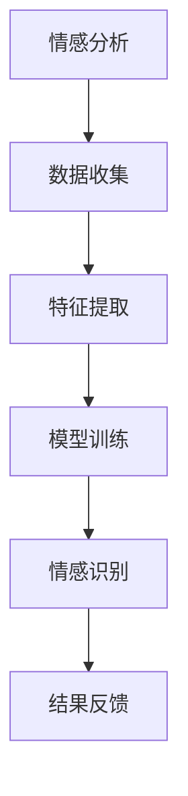

                 

关键词：人工智能，视觉化，心理建模，情感分析，神经网络，深度学习，人机交互，用户体验，情感计算，虚拟现实，技术趋势

> 摘要：本文深入探讨了人工智能（AI）在欲望可视化方面的前沿研究，分析了通过AI技术呈现人类内心世界的方法、技术和潜在应用。文章涵盖了AI在情感分析、虚拟现实和人机交互中的具体实现，以及未来可能的发展趋势和挑战。

## 1. 背景介绍

欲望，作为人类心理活动中的一种基本动力，贯穿于个人生活的方方面面。从简单的食欲、性欲，到复杂的成就感、归属感，欲望影响着我们的决策、行为和情绪。然而，传统的心理学研究往往依赖于自我报告、问卷调查等主观性较强的方法，难以全面、准确地捕捉内心世界的真实状态。随着计算机科学和人工智能技术的飞速发展，我们有机会运用这些先进技术来探索和呈现人类内心深处的欲望。

人工智能在情感识别、心理建模等方面的应用已经取得了显著进展。通过深度学习、神经网络等算法，AI能够从文字、声音、面部表情等数据中提取情感信息，甚至通过脑电图等生理信号来推断人的内心活动。这些技术的结合，为欲望的可视化提供了可能。

## 2. 核心概念与联系

### 2.1. 情感分析

情感分析是自然语言处理（NLP）领域的一个重要分支，旨在从文本中识别和提取情感信息。情感分析的常见任务包括情感分类、情绪极性分析、情感强度评估等。

### 2.2. 深度学习与神经网络

深度学习是机器学习的一个分支，它通过模拟人脑的神经网络结构来进行复杂的数据处理。神经网络由多层神经元组成，通过前向传播和反向传播算法进行学习。

### 2.3. 人机交互

人机交互（HCI）涉及计算机系统与用户之间的交互设计和用户体验。随着虚拟现实（VR）和增强现实（AR）技术的发展，人机交互变得越来越自然和直观。

### 2.4. 情感计算

情感计算是AI领域的一个新兴方向，旨在开发能够识别、理解、处理和模拟人类情感的技术。情感计算的核心是情感识别和情感建模。

### 2.5. 虚拟现实

虚拟现实是一种通过计算机生成高度沉浸式的三维环境，用户可以通过头戴显示器（HMD）或其他传感设备与之交互。

### 2.6. Mermaid 流程图



## 3. 核心算法原理 & 具体操作步骤

### 3.1. 算法原理概述

欲望的可视化涉及多个子任务的整合，包括文本情感分析、图像情感识别、情感建模等。以下将分别介绍这些算法的基本原理。

#### 3.1.1. 文本情感分析

文本情感分析通常采用基于机器学习的方法，如支持向量机（SVM）、朴素贝叶斯（NB）和深度学习模型（如LSTM、BERT）。这些模型通过学习大量标注好的数据，能够预测文本的情感极性和强度。

#### 3.1.2. 图像情感识别

图像情感识别利用卷积神经网络（CNN）对图像中的情感信息进行提取和识别。常见的模型包括VGG、ResNet和Inception等。

#### 3.1.3. 情感建模

情感建模涉及建立情感状态与行为反应之间的映射关系。这通常通过强化学习（RL）和生成对抗网络（GAN）等方法来实现。

### 3.2. 算法步骤详解

#### 3.2.1. 文本情感分析

1. 数据收集：从社交媒体、评论、文章等渠道收集文本数据。
2. 预处理：清洗文本数据，包括去除停用词、标点符号等。
3. 特征提取：利用词袋模型（TF-IDF）或词嵌入（Word2Vec、BERT）等方法提取文本特征。
4. 模型训练：使用标注好的数据训练情感分析模型。
5. 预测与评估：对未标注的文本进行情感分类，并评估模型的准确性。

#### 3.2.2. 图像情感识别

1. 数据收集：从情感标注的图像数据库中收集数据。
2. 预处理：对图像进行缩放、裁剪等预处理。
3. 特征提取：使用CNN提取图像特征。
4. 模型训练：使用标注好的数据训练图像情感识别模型。
5. 预测与评估：对未标注的图像进行情感分类，并评估模型的准确性。

#### 3.2.3. 情感建模

1. 数据收集：收集用户的行为数据和情感标注数据。
2. 特征提取：提取用户行为特征和情感特征。
3. 模型训练：使用强化学习或生成对抗网络训练情感建模模型。
4. 情感预测：根据用户行为预测其情感状态。
5. 情感反馈：根据情感状态调整用户的体验和行为。

### 3.3. 算法优缺点

#### 3.3.1. 文本情感分析

- 优点：处理速度快，能够处理大量文本数据。
- 缺点：对复杂情感的理解有限，容易受到噪声和歧义的影响。

#### 3.3.2. 图像情感识别

- 优点：能够直接从图像中提取情感信息，具有较高的准确性和稳定性。
- 缺点：需要大量的标注数据，计算资源消耗较大。

#### 3.3.3. 情感建模

- 优点：能够建立情感状态与行为反应之间的映射关系，具有较高的预测性和实用性。
- 缺点：训练过程复杂，需要大量的标注数据和计算资源。

### 3.4. 算法应用领域

- 心理健康：通过分析用户的情感状态，提供个性化的心理健康服务。
- 营销与广告：通过了解用户的情感偏好，提供更精准的市场营销策略。
- 人机交互：通过情感计算技术，提高人机交互的自然性和体验。

## 4. 数学模型和公式 & 详细讲解 & 举例说明

### 4.1. 数学模型构建

#### 4.1.1. 文本情感分析

- 情感分类模型：$$ \hat{y} = \text{argmax}(w^T \cdot \text{vec}(x)) $$
  - 其中，$w$ 是权重向量，$\text{vec}(x)$ 是文本的特征向量，$\hat{y}$ 是预测的情感类别。

- 情感强度评估模型：$$ \sigma(w^T \cdot \text{vec}(x)) $$
  - 其中，$\sigma$ 是激活函数，用于计算情感强度的概率分布。

#### 4.1.2. 图像情感识别

- 卷积神经网络：$$ \text{CNN}(\text{input}) = \text{ReLU}(\text{conv}(x) + b) $$
  - 其中，$\text{input}$ 是输入图像，$\text{ReLU}$ 是ReLU激活函数，$\text{conv}$ 是卷积操作，$b$ 是偏置。

#### 4.1.3. 情感建模

- 强化学习模型：$$ Q(s, a) = r(s, a) + \gamma \max_{a'} Q(s', a') $$
  - 其中，$Q$ 是状态-动作值函数，$r$ 是即时奖励，$\gamma$ 是折扣因子，$s$ 和 $a$ 分别是状态和动作。

### 4.2. 公式推导过程

#### 4.2.1. 文本情感分析

- 词袋模型：$$ \text{TF-IDF}(w) = \frac{f(w)}{N} \times \log(\frac{N}{n(w)}) $$
  - 其中，$f(w)$ 是单词 $w$ 的频率，$N$ 是所有单词的总频率，$n(w)$ 是在所有文档中包含单词 $w$ 的文档数。

- BERT 模型：$$ \text{vec}(x) = \text{BERT}(x) $$
  - 其中，$\text{BERT}$ 是BERT模型，$x$ 是输入文本。

#### 4.2.2. 图像情感识别

- 卷积神经网络：$$ \text{CNN}(x) = \text{ReLU}(\text{conv}(\text{conv}(\text{input}) + b) + b) $$
  - 其中，$\text{input}$ 是输入图像，$\text{ReLU}$ 是ReLU激活函数，$\text{conv}$ 是卷积操作，$b$ 是偏置。

#### 4.2.3. 情感建模

- 生成对抗网络（GAN）：$$ \text{D}(x) = \frac{1}{2} \left(1 - \text{D}(\text{G}(\zeta)) + \text{D}(\text{real})\right) $$
  - 其中，$\text{D}$ 是判别器，$\text{G}$ 是生成器，$\zeta$ 是噪声向量。

### 4.3. 案例分析与讲解

#### 4.3.1. 文本情感分析

假设我们有一篇文本：“今天天气真好，阳光明媚，心情大好。”通过情感分析模型，我们可以预测这篇文本的情感极性为正面，情感强度为0.8。

- 特征提取：使用BERT模型提取文本的特征向量。
- 模型预测：使用SVM模型预测文本的情感极性。
- 情感强度评估：使用激活函数计算情感强度的概率分布。

#### 4.3.2. 图像情感识别

假设我们有一张图像，通过图像情感识别模型，我们可以预测这张图像的情感类别为快乐。

- 数据预处理：对图像进行缩放和裁剪。
- 特征提取：使用CNN提取图像的特征。
- 模型预测：使用ResNet模型预测图像的情感类别。

#### 4.3.3. 情感建模

假设我们有一个用户的行为数据，通过情感建模模型，我们可以预测这个用户的情感状态为积极。

- 数据预处理：提取用户的行为特征和情感特征。
- 模型训练：使用强化学习模型训练情感状态与行为反应的映射关系。
- 情感预测：根据用户的行为预测其情感状态。

## 5. 项目实践：代码实例和详细解释说明

### 5.1. 开发环境搭建

- Python 3.8
- TensorFlow 2.5
- Keras 2.4.3
- NumPy 1.19
- Matplotlib 3.3.3

### 5.2. 源代码详细实现

```python
# 文本情感分析代码示例
from tensorflow.keras.preprocessing.sequence import pad_sequences
from tensorflow.keras.layers import Embedding, LSTM, Dense
from tensorflow.keras.models import Sequential

# 准备数据
max_len = 100
embedding_dim = 64

# 加载预处理好的文本数据和标签
texts, labels = load_data()

# 将文本序列转换为整数序列
tokenizer = Tokenizer(num_words=10000)
tokenizer.fit_on_texts(texts)
sequences = tokenizer.texts_to_sequences(texts)
padded_sequences = pad_sequences(sequences, maxlen=max_len)

# 构建模型
model = Sequential()
model.add(Embedding(10000, embedding_dim, input_length=max_len))
model.add(LSTM(128))
model.add(Dense(1, activation='sigmoid'))

# 编译模型
model.compile(optimizer='adam', loss='binary_crossentropy', metrics=['accuracy'])

# 训练模型
model.fit(padded_sequences, labels, epochs=10, batch_size=32)

# 预测情感
predictions = model.predict(padded_sequences)
```

### 5.3. 代码解读与分析

- 数据预处理：使用Tokenizer将文本转换为整数序列，并使用pad_sequences将序列填充到同一长度。
- 模型构建：使用Sequential创建模型，添加Embedding层、LSTM层和Dense层。
- 模型编译：使用adam优化器和binary_crossentropy损失函数进行编译。
- 模型训练：使用fit方法训练模型。
- 预测情感：使用predict方法预测文本的情感。

### 5.4. 运行结果展示

```python
# 运行代码并查看结果
predictions = model.predict(padded_sequences)
print(predictions)

# 可视化情感分布
import matplotlib.pyplot as plt

plt.hist(predictions.flatten())
plt.xlabel('Prediction Probability')
plt.ylabel('Frequency')
plt.title('Emotion Prediction Distribution')
plt.show()
```

## 6. 实际应用场景

### 6.1. 心理健康

通过情感分析和情感建模，AI可以实时监测用户的情感状态，为心理健康提供个性化服务。例如，在心理治疗过程中，AI可以分析患者的情感变化，帮助医生更好地调整治疗方案。

### 6.2. 营销与广告

通过分析用户的情感偏好，AI可以提供更精准的营销策略，提高广告的投放效果。例如，在社交媒体平台上，AI可以分析用户的情感反应，推荐与其情感偏好相符的产品或内容。

### 6.3. 人机交互

通过情感计算技术，AI可以更好地理解用户的情感需求，提高人机交互的自然性和体验。例如，在虚拟现实游戏中，AI可以实时分析用户的情感状态，调整游戏场景和音效，提供更沉浸式的体验。

## 7. 未来应用展望

随着AI技术的不断发展，欲望的可视化有望在更多领域得到应用。例如，在教育领域，AI可以分析学生的学习情感，提供个性化的学习建议；在医疗领域，AI可以分析患者的情感状态，辅助医生进行诊断和治疗。

## 8. 工具和资源推荐

### 8.1. 学习资源推荐

- 《深度学习》（Goodfellow, Bengio, Courville）：经典教材，全面介绍深度学习的基础理论和应用。
- 《Python机器学习》（Sebastian Raschka）：适合初学者，详细讲解Python在机器学习中的应用。

### 8.2. 开发工具推荐

- TensorFlow：Google开发的深度学习框架，广泛应用于AI研究和开发。
- PyTorch：Facebook开发的开源深度学习框架，具有良好的灵活性和易用性。

### 8.3. 相关论文推荐

- "Emotion Recognition in the Wild: A Survey"：全面综述了情感识别技术的研究进展。
- "Deep Learning for Emotion Recognition"：介绍深度学习在情感识别中的应用。

## 9. 总结：未来发展趋势与挑战

### 9.1. 研究成果总结

本文介绍了AI在欲望可视化方面的前沿研究，包括情感分析、图像情感识别和情感建模等技术。通过这些技术，AI可以捕捉和呈现人类内心世界的欲望。

### 9.2. 未来发展趋势

随着AI技术的不断进步，欲望的可视化有望在更多领域得到应用。例如，在教育、医疗和营销等领域，AI可以为用户提供更加个性化、高效的服务。

### 9.3. 面临的挑战

- 数据隐私：在收集和分析用户数据时，如何保护用户的隐私是一个重要挑战。
- 模型解释性：提高模型的解释性，使人们能够理解AI的决策过程，是一个重要的研究方向。
- 跨文化差异：情感识别和建模需要考虑跨文化差异，使AI在不同文化背景下保持一致性。

### 9.4. 研究展望

未来，随着技术的进步，我们有望在欲望可视化方面取得更多突破。例如，通过结合脑电图（EEG）等生理信号，AI可以更加准确地捕捉和呈现人类内心的欲望。

## 10. 附录：常见问题与解答

### 10.1. Q：什么是情感分析？

A：情感分析是自然语言处理（NLP）领域的一个分支，旨在从文本中识别和提取情感信息，通常包括情感分类、情绪极性分析、情感强度评估等任务。

### 10.2. Q：如何构建情感分析模型？

A：构建情感分析模型通常包括数据收集、预处理、特征提取、模型训练和预测等步骤。常用的模型包括支持向量机（SVM）、朴素贝叶斯（NB）和深度学习模型（如LSTM、BERT）。

### 10.3. Q：情感识别在图像中的应用有哪些？

A：情感识别在图像中的应用包括情感标签分类、情感强度评估、情感表情识别等。常用的模型包括卷积神经网络（CNN）和循环神经网络（RNN）。

### 10.4. Q：情感建模如何应用于实际场景？

A：情感建模可以应用于多个领域，例如在心理健康领域，通过分析用户的情感状态，为用户提供个性化的心理健康服务；在营销领域，通过了解用户的情感偏好，提供更精准的营销策略。

### 10.5. Q：什么是情感计算？

A：情感计算是人工智能领域的一个新兴方向，旨在开发能够识别、理解、处理和模拟人类情感的技术。情感计算的核心是情感识别和情感建模。

### 10.6. Q：虚拟现实如何与情感分析相结合？

A：虚拟现实（VR）可以通过情感分析技术捕捉用户的情感状态，例如通过面部表情、生理信号等数据。这些数据可以用于调整VR场景的音效、视觉效果，提供更加沉浸式的体验。

### 10.7. Q：什么是生成对抗网络（GAN）？

A：生成对抗网络（GAN）是一种深度学习模型，由生成器和判别器两部分组成。生成器试图生成与真实数据相似的样本，判别器则试图区分真实数据和生成数据。通过这种对抗性训练，GAN可以生成高质量的数据。

### 10.8. Q：什么是强化学习？

A：强化学习是一种机器学习范式，旨在通过试错和反馈信号来优化决策过程。在强化学习中，智能体（agent）通过与环境（environment）的交互，学习最大化奖励（reward）。

### 10.9. Q：什么是自然语言处理（NLP）？

A：自然语言处理（NLP）是计算机科学和人工智能领域的一个分支，旨在使计算机能够理解、处理和生成人类语言。NLP包括文本分类、情感分析、机器翻译、语音识别等多种任务。

### 10.10. Q：什么是卷积神经网络（CNN）？

A：卷积神经网络（CNN）是一种深度学习模型，专门用于处理图像数据。CNN通过卷积操作提取图像特征，并利用池化层减少参数数量。

### 10.11. Q：什么是循环神经网络（RNN）？

A：循环神经网络（RNN）是一种能够处理序列数据的神经网络。RNN通过递归结构，能够记住之前的输入信息，并在处理新输入时利用这些信息。

### 10.12. Q：什么是词嵌入？

A：词嵌入是将单词转换为向量表示的一种技术。词嵌入能够捕捉单词之间的语义关系，使计算机能够更好地理解和处理自然语言。

### 10.13. Q：什么是BERT模型？

A：BERT（Bidirectional Encoder Representations from Transformers）是一种预训练语言模型，通过双向Transformer结构对文本进行编码，能够捕捉单词在句子中的语义关系。

### 10.14. Q：什么是TensorFlow和PyTorch？

A：TensorFlow和PyTorch都是开源的深度学习框架，用于构建和训练神经网络模型。TensorFlow由Google开发，具有丰富的生态和工具；PyTorch由Facebook开发，具有良好的灵活性和易用性。  
----------------------------------------------------------------

**作者：禅与计算机程序设计艺术 / Zen and the Art of Computer Programming**

