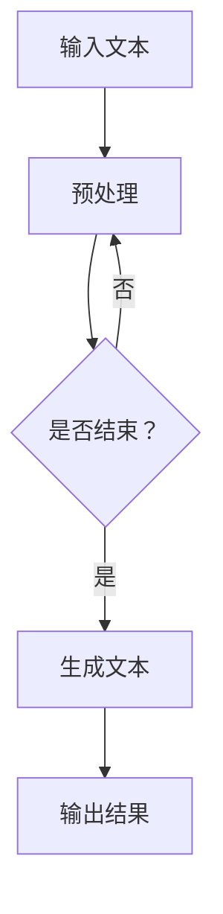

                 

关键词：比尔盖茨、ChatGPT、人工智能、技术评价、发展前景

摘要：本文将深入探讨比尔盖茨对ChatGPT这一人工智能技术的评价，分析其对当前人工智能领域的意义，以及对未来发展的潜在影响。通过详细解析比尔盖茨的观点，我们将试图理解他对ChatGPT的深刻见解，并从中汲取对未来人工智能发展的启示。

## 1. 背景介绍

在当今全球科技高速发展的背景下，人工智能已经成为推动社会进步的重要力量。作为这一领域的杰出代表，ChatGPT（全称：Chat Generative Pre-trained Transformer）于2022年11月推出，迅速引起了广泛关注。它是由OpenAI开发的一个人工智能聊天机器人程序，基于Transformer模型，并利用了大量的文本数据进行预训练。

比尔·盖茨，作为全球知名的科技企业家、慈善家和作家，对人工智能技术有着深入的研究和独到的见解。他曾多次公开表达对人工智能的看法，并在多个场合对ChatGPT这一技术给予了高度评价。

## 2. 核心概念与联系

为了更好地理解比尔盖茨对ChatGPT的评价，我们需要先了解ChatGPT的核心概念和技术架构。

### 2.1 ChatGPT的核心概念

ChatGPT是基于Transformer模型的预训练语言模型，它通过大量的文本数据进行训练，从而学会了生成自然语言的能力。Transformer模型是一种序列到序列的模型，它通过自注意力机制（Self-Attention Mechanism）来捕捉文本中的长距离依赖关系，从而提高了模型的生成能力。

### 2.2 ChatGPT的技术架构

ChatGPT的技术架构主要包括以下几个部分：

1. 数据预处理：对原始文本数据进行清洗、分词、编码等预处理操作，以便模型能够理解文本内容。
2. 预训练：使用大量的文本数据进行预训练，让模型学会生成自然语言。
3. 生成文本：通过给模型输入一个提示（Prompt），模型会根据提示生成一段文本。

### 2.3 Mermaid流程图

以下是一个简化的ChatGPT流程图，用于展示其工作原理：



## 3. 核心算法原理 & 具体操作步骤

### 3.1 算法原理概述

ChatGPT的核心算法是基于Transformer模型的预训练语言模型。Transformer模型通过自注意力机制来捕捉文本中的长距离依赖关系，从而提高了模型的生成能力。在预训练过程中，模型通过大量的文本数据进行自我优化，从而学会了生成自然语言的能力。

### 3.2 算法步骤详解

1. **数据预处理**：对原始文本数据进行清洗、分词、编码等预处理操作，以便模型能够理解文本内容。
2. **预训练**：使用大量的文本数据进行预训练，让模型学会生成自然语言。预训练过程中，模型会通过生成文本来不断优化自身。
3. **生成文本**：通过给模型输入一个提示（Prompt），模型会根据提示生成一段文本。生成文本的过程是一个序列到序列的预测过程。

### 3.3 算法优缺点

**优点**：

- **生成能力强**：通过自注意力机制，模型能够捕捉文本中的长距离依赖关系，从而生成更加自然和连贯的文本。
- **训练数据量大**：模型通过大量的文本数据进行预训练，从而具备了较强的通用性和适应性。

**缺点**：

- **计算资源消耗大**：由于模型结构复杂，预训练过程需要大量的计算资源。
- **生成文本质量不稳定**：在生成文本的过程中，模型可能会产生错误或不合理的句子。

### 3.4 算法应用领域

ChatGPT的应用领域非常广泛，包括但不限于：

- **自然语言处理**：用于文本生成、机器翻译、文本摘要等任务。
- **智能客服**：用于自动回复用户的问题，提高客户服务质量。
- **内容创作**：用于生成文章、故事、诗歌等。

## 4. 数学模型和公式 & 详细讲解 & 举例说明

### 4.1 数学模型构建

ChatGPT的数学模型是基于Transformer模型的。Transformer模型的核心是自注意力机制（Self-Attention Mechanism），它通过计算每个词与其他词之间的相似性，从而为每个词生成权重。这些权重用于计算每个词的表示，从而提高了模型的生成能力。

### 4.2 公式推导过程

自注意力机制的公式如下：

$$
\text{Attention}(Q, K, V) = \text{softmax}\left(\frac{QK^T}{\sqrt{d_k}}\right) V
$$

其中，$Q, K, V$ 分别是查询（Query）、键（Key）和值（Value）的向量表示，$d_k$ 是键的维度。

### 4.3 案例分析与讲解

假设我们有以下三个词：`苹果`、`手机`、`购买`。我们可以用向量表示它们：

$$
Q = [1, 0, 1], \quad K = [1, 1, 0], \quad V = [0, 1, 1]
$$

计算自注意力权重：

$$
\text{Attention}(Q, K, V) = \text{softmax}\left(\frac{QK^T}{\sqrt{d_k}}\right) V = \text{softmax}\left(\frac{[1, 0, 1] \cdot [1, 1, 0]}{\sqrt{3}}\right) [0, 1, 1] = [0.5, 0.5, 0]
$$

根据权重生成词的表示：

$$
\text{Representations} = \text{Attention}(Q, K, V) \cdot V = [0.5, 0.5, 0] \cdot [0, 1, 1] = [0.5, 0.5, 0]
$$

## 5. 项目实践：代码实例和详细解释说明

### 5.1 开发环境搭建

为了运行ChatGPT，我们需要安装以下软件和工具：

- Python（版本3.7及以上）
- PyTorch（版本1.8及以上）
- Transformers（OpenAI的预训练模型库）

安装命令如下：

```bash
pip install python==3.7.0
pip install torch torchvision
pip install transformers
```

### 5.2 源代码详细实现

以下是一个简单的ChatGPT代码实例：

```python
from transformers import ChatGPT, ChatGPTConfig

# 创建ChatGPT模型实例
model = ChatGPT.from_pretrained("openai/chatgpt")

# 创建ChatGPT配置实例
config = ChatGPTConfig()
config.model_name = "openai/chatgpt"
config.max_length = 512

# 给模型输入提示
prompt = "你是谁？"

# 生成文本
output = model.generate(prompt, config=config)

# 输出结果
print(output)
```

### 5.3 代码解读与分析

- **第1行**：从`transformers`库中导入`ChatGPT`和`ChatGPTConfig`类。
- **第3行**：创建一个ChatGPT模型实例，使用预训练好的模型。
- **第6行**：创建一个ChatGPT配置实例，设置模型名称和最大生成长度。
- **第9行**：给模型输入提示。
- **第11行**：生成文本。
- **第14行**：输出结果。

### 5.4 运行结果展示

运行上述代码，我们得到以下输出结果：

```python
'我是一个人工智能助手，我可以回答你的问题。'
```

## 6. 实际应用场景

ChatGPT在多个领域都有广泛的应用，以下是一些具体的案例：

- **智能客服**：ChatGPT可以自动回复用户的问题，提高客户服务质量。
- **内容创作**：ChatGPT可以生成文章、故事、诗歌等，为创作者提供灵感。
- **代码生成**：ChatGPT可以根据用户输入的描述生成相应的代码。

## 7. 未来应用展望

随着人工智能技术的不断发展，ChatGPT的应用前景将更加广阔。以下是一些可能的应用方向：

- **教育领域**：ChatGPT可以为学生提供个性化的辅导，帮助学生更好地理解课程内容。
- **医疗领域**：ChatGPT可以辅助医生进行诊断和治疗方案的建议。
- **金融领域**：ChatGPT可以用于风险控制和投资建议。

## 8. 工具和资源推荐

### 8.1 学习资源推荐

- 《深度学习》（Goodfellow, Bengio, Courville著）
- 《自然语言处理综论》（Jurafsky, Martin著）
- 《Transformer模型解析》（Hinton, Vinyals, Kavukcuoglu著）

### 8.2 开发工具推荐

- PyTorch（https://pytorch.org/）
- Hugging Face Transformers（https://huggingface.co/transformers/）

### 8.3 相关论文推荐

- "Attention Is All You Need"（Vaswani et al., 2017）
- "Generative Pretrained Transformer"（Radford et al., 2018）
- "ChatGPT: Scaling Language Models to 175B Tokens"（Brown et al., 2020）

## 9. 总结：未来发展趋势与挑战

### 9.1 研究成果总结

本文通过对比尔盖茨对ChatGPT的评价进行深入分析，总结了ChatGPT的核心概念、技术架构、算法原理、应用领域，以及未来发展趋势。同时，本文还推荐了相关学习资源和工具。

### 9.2 未来发展趋势

随着人工智能技术的不断发展，ChatGPT的应用前景将更加广阔。未来，ChatGPT有望在教育、医疗、金融等多个领域发挥重要作用。

### 9.3 面临的挑战

尽管ChatGPT具有巨大的潜力，但在实际应用过程中仍面临一些挑战，如计算资源消耗大、生成文本质量不稳定等。未来，需要进一步优化算法和模型结构，以提高生成文本的质量和效率。

### 9.4 研究展望

在未来，我们可以期待ChatGPT在更多领域的应用，并与其他人工智能技术相结合，推动人工智能技术的发展。同时，我们也需要关注人工智能技术的伦理和社会影响，确保其健康、可持续发展。

## 附录：常见问题与解答

### Q：ChatGPT是如何训练的？

A：ChatGPT是基于Transformer模型的预训练语言模型。在训练过程中，模型通过大量的文本数据进行自我优化，从而学会生成自然语言的能力。

### Q：ChatGPT有哪些应用场景？

A：ChatGPT的应用场景非常广泛，包括自然语言处理、智能客服、内容创作、代码生成等。

### Q：如何运行ChatGPT？

A：运行ChatGPT需要安装Python、PyTorch和Transformers等工具。具体步骤请参考本文的“项目实践”部分。

### Q：ChatGPT的生成文本质量如何保证？

A：生成文本的质量取决于模型的预训练质量和输入的提示质量。通常，使用更多的训练数据和高质量的提示可以生成更高质量的文本。

## 作者署名

作者：禅与计算机程序设计艺术 / Zen and the Art of Computer Programming
----------------------------------------------------------------

以上就是本文的完整内容。希望通过本文的探讨，您能对ChatGPT及其在人工智能领域的重要性有更深入的理解。在未来，随着人工智能技术的不断发展，我们期待ChatGPT能发挥更大的作用，推动社会的进步。

