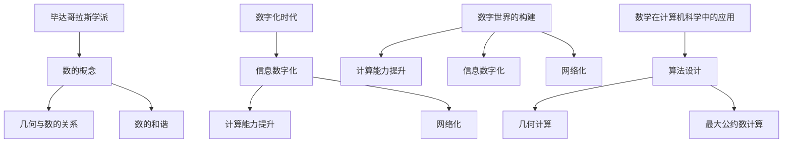

                 

关键词：毕达哥拉斯学派、万物皆数、数字化时代、技术进步、数学模型、算法、计算机编程

> 摘要：本文探讨了古希腊毕达哥拉斯学派提出的“万物皆数”这一哲学观点，并探讨了其在现代数字化时代中的体现和影响。通过分析“万物皆数”的核心概念和数字化时代的科技发展，本文旨在揭示数学在计算机科学和信息技术领域中的关键作用，以及对未来科技发展的潜在影响。

## 1. 背景介绍

### 毕达哥拉斯学派与“万物皆数”的观点

毕达哥拉斯学派是古希腊哲学中一个重要的流派，由数学家毕达哥拉斯创立。该学派的核心观点之一是“万物皆数”，这一观点主张宇宙万物都可以用数学的原理来解释和理解。这一思想不仅对当时的哲学、科学产生了深远的影响，也为后来的数学、物理学、天文学等学科的发展奠定了基础。

“万物皆数”这一观点强调了数学在宇宙中的基础地位。它认为，宇宙中的所有现象都可以通过数学公式和方程来描述，无论是天体的运动、生命的规律，还是自然现象的变化，都可以归结为数学问题。这一观点激发了人们对数学的探索和研究，推动了数学作为一门独立学科的诞生和发展。

### 数字化时代的到来

数字化时代是指信息技术迅速发展的时代，以计算机技术、互联网技术、移动通信技术等为代表的新兴技术不断涌现，深刻改变了人们的生活、工作和娱乐方式。数字化时代的一个显著特征是信息的数字化，即一切信息都可以转化为二进制代码进行处理和存储。

数字化时代的到来不仅改变了人们的生活方式，也推动了科技的发展。计算机科学、人工智能、大数据、云计算等新兴技术不断涌现，使得人类对信息的处理能力得到了极大的提升。同时，数字化时代也带来了新的挑战，如信息安全、隐私保护、数字鸿沟等问题。

## 2. 核心概念与联系

### 毕达哥拉斯学派的核心概念

“万物皆数”是毕达哥拉斯学派的核心观点，它认为宇宙万物都可以用数学的原理来解释和理解。这一观点主要体现在以下几个方面：

1. **数的性质**：毕达哥拉斯学派认为，数是宇宙的基本元素，一切事物都可以归结为数。他们研究数的性质，发现了勾股定理等重要的数学定理。

2. **几何与数的关系**：毕达哥拉斯学派认为，几何图形是数的表现形式。通过研究几何图形，可以揭示宇宙的本质和规律。

3. **数的和谐**：毕达哥拉斯学派认为，宇宙中的和谐是由数的比例和关系所决定的。他们通过研究音乐、建筑等领域的和谐现象，发现了数的重要性。

### 数字化时代的核心概念

数字化时代的核心概念包括信息数字化、计算能力提升、网络化等。以下是这些概念的具体含义：

1. **信息数字化**：将各种信息（如文字、图像、声音等）转化为二进制代码进行处理和存储。这是数字化时代的基础。

2. **计算能力提升**：计算机技术的发展使得计算能力得到了极大的提升，从最初的电子管计算机到现代的量子计算机，计算速度和处理能力都在不断提高。

3. **网络化**：互联网技术的发展使得信息可以快速传播和共享，人与人、人与设备之间的连接变得更加紧密。

### 毕达哥拉斯学派与数字化时代的联系

毕达哥拉斯学派的“万物皆数”观点与数字化时代有着密切的联系。首先，数字化时代的信息数字化理念源于毕达哥拉斯学派对信息本质的认识。他们认为，一切事物都可以归结为数，而数字化时代将这一理念具体化为将信息转化为二进制代码。

其次，数字化时代的计算能力提升和算法优化也受到了毕达哥拉斯学派的影响。毕达哥拉斯学派对数学的研究和发现，为后来的计算机科学和算法设计提供了理论基础。例如，勾股定理在计算机科学中被广泛应用于几何计算，欧几里得算法在计算机算法中被广泛应用于最大公约数计算。

最后，数字化时代的网络化特点也与毕达哥拉斯学派的“万物皆数”观点相呼应。数字化时代通过互联网将全球的信息连接在一起，使得信息的传播和共享变得更加便捷。这种网络化的特点与毕达哥拉斯学派所倡导的宇宙中一切事物都可以用数来解释和理解的观念相契合。

### Mermaid 流程图

以下是描述毕达哥拉斯学派与数字化时代联系的 Mermaid 流程图：



## 3. 核心算法原理 & 具体操作步骤

### 3.1 算法原理概述

在数字化时代，核心算法原理与毕达哥拉斯学派的“万物皆数”观点密切相关。具体来说，核心算法原理包括以下几个方面：

1. **数论算法**：数论是数学中的一个重要分支，研究整数的性质、关系和运算。数论算法在计算机科学中有着广泛的应用，如最大公约数算法、质数分解算法等。

2. **几何算法**：几何算法用于处理几何图形的生成、变换、分析和优化等问题。毕达哥拉斯学派对几何的研究为现代几何算法提供了理论基础，如欧几里得算法、最短路径算法等。

3. **密码学算法**：密码学是研究密码系统设计和分析的学科。在现代数字化时代，密码学算法在信息安全中扮演着关键角色，如对称加密算法、非对称加密算法等。

### 3.2 算法步骤详解

以下是几个核心算法的具体操作步骤：

#### 3.2.1 最大公约数算法

最大公约数（Greatest Common Divisor，GCD）是数论中的一个重要概念，用于计算两个整数的最大公约数。以下是欧几里得算法的步骤：

1. 输入两个整数 a 和 b（a > b）。
2. 计算余数 r = a % b。
3. 如果 r = 0，则 b 是 a 和 b 的最大公约数，结束算法。
4. 否则，令 a = b，b = r，返回步骤 2。

#### 3.2.2 最短路径算法

最短路径算法用于计算图中两点之间的最短路径。以下是 Dijkstra 算法的步骤：

1. 初始化：设置一个优先队列 Q，其中包含所有未处理的顶点，其距离值初始化为无穷大，除了源点 s 的距离值初始化为 0。
2. 将源点 s 加入优先队列 Q。
3. 当优先队列 Q 非空时，执行以下步骤：
   1. 从优先队列 Q 中取出距离值最小的顶点 v。
   2. 对于 v 的每个邻接点 w，执行以下步骤：
      1. 计算从源点 s 到 w 的距离 d = d[v] + weight(v, w)。
      2. 如果 d 小于 w 的当前距离值，则更新 w 的距离值 d[v]。
      3. 将 w 加入优先队列 Q。
4. 输出从源点 s 到其他所有顶点的最短路径。

#### 3.2.3 对称加密算法

对称加密算法是一种加密和解密使用相同密钥的加密方法。以下是AES加密算法的步骤：

1. 初始化密钥：从用户输入的密钥中提取128位、192位或256位的密钥。
2. 初始化轮密钥：使用密钥扩展算法（如密钥调度表）生成每个轮次的轮密钥。
3. 初始化状态：将明文数据划分为128位块，并初始化一个4x4的字节矩阵作为状态矩阵。
4. 轮加密：对于每个轮次，执行以下步骤：
   1. 将状态矩阵与当前轮密钥进行异或操作。
   2. 执行行移位操作。
   3. 执行列混淆操作。
   4. 执行轮密钥加操作。
5. 输出密文：将加密后的状态矩阵转换为密文。

### 3.3 算法优缺点

#### 最大公约数算法

**优点**：

1. 算法简单，易于实现。
2. 运算速度快，时间复杂度为 O(log n)。
3. 可用于计算多个整数的最大公约数。

**缺点**：

1. 不适合计算大量整数的最大公约数。
2. 对大整数计算效率较低。

#### 最短路径算法

**优点**：

1. 可计算单源最短路径和多源最短路径。
2. 适用于各种图类型，如加权图、无权图、有向图、无向图等。
3. 算法复杂度较低，适用于大规模图。

**缺点**：

1. 不适用于动态图。
2. 需要预先知道源点和目标点。

#### 对称加密算法

**优点**：

1. 加密和解密速度快。
2. 加密和解密使用相同密钥，安全性较高。
3. 适用于大量数据的加密。

**缺点**：

1. 需要存储和管理密钥。
2. 密钥分发和管理复杂。

### 3.4 算法应用领域

**最大公约数算法**：广泛应用于整数运算、质数测试、最大公约数求解等。

**最短路径算法**：广泛应用于路由算法、图算法、地图定位、物流调度等。

**对称加密算法**：广泛应用于数据加密、文件加密、网络安全等。

## 4. 数学模型和公式 & 详细讲解 & 举例说明

### 4.1 数学模型构建

数学模型是用于描述现实世界问题的数学表达式。在数字化时代，数学模型在计算机科学和信息技术中发挥着重要作用。以下是几个常见的数学模型：

1. **线性回归模型**：用于预测连续值。
2. **逻辑回归模型**：用于预测二元结果。
3. **神经网络模型**：用于复杂非线性预测。
4. **马尔可夫模型**：用于概率转移和状态预测。

### 4.2 公式推导过程

以下以线性回归模型为例，介绍数学模型的推导过程。

**线性回归模型**：

假设我们有 n 个样本点 (x_i, y_i)，其中 x_i 和 y_i 分别表示样本的输入和输出。线性回归模型的目的是找到一个线性函数 f(x) = bx + a，使得 y_i 与 f(x_i) 的差值最小。

1. **最小二乘法**：

   我们可以通过最小化误差平方和来找到最佳拟合线。误差平方和的公式为：

   $$SSQ = \sum_{i=1}^{n}(y_i - f(x_i))^2 = \sum_{i=1}^{n}(y_i - (bx_i + a))^2$$

   要使 SSQ 最小，我们可以对 b 和 a 分别求导并令其导数为零：

   $$\frac{dSSQ}{db} = -2n\bar{y} + 2b\bar{x}\bar{x} + 2a\bar{x} = 0$$
   $$\frac{dSSQ}{da} = -2n\bar{x}\bar{y} + 2b\bar{x} + 2x_iy_i = 0$$

   其中，$\bar{x}$ 和 $\bar{y}$ 分别表示输入和输出的平均值。

   通过求解上述方程组，我们可以得到最佳拟合线：

   $$a = \bar{y} - b\bar{x}$$
   $$b = \frac{n\sum_{i=1}^{n}x_iy_i - \sum_{i=1}^{n}x_i\sum_{i=1}^{n}y_i}{n\sum_{i=1}^{n}x_i^2 - (\sum_{i=1}^{n}x_i)^2}$$

2. **岭回归**：

   当自变量之间存在多重共线性时，最小二乘法可能无法找到最佳拟合线。此时，我们可以使用岭回归来解决这个问题。岭回归通过在最小二乘法的基础上引入一个惩罚项来解决多重共线性问题。

   岭回归的目标是最小化以下公式：

   $$SSQ + \alpha\sum_{i=1}^{n}b_i^2$$

   其中，$\alpha$ 是一个正则化参数。

   要使 SSQ + $\alpha\sum_{i=1}^{n}b_i^2$ 最小，我们可以对 b 分别求导并令其导数为零：

   $$\frac{dSSQ}{db} = -2n\bar{y} + 2b\bar{x}\bar{x} + 2\alpha b = 0$$

   通过求解上述方程，我们可以得到最佳拟合线：

   $$b = \frac{\bar{x}\bar{y} + \alpha\bar{x}}{\bar{x}\bar{x} + \alpha}$$

### 4.3 案例分析与讲解

以下通过一个具体案例来分析线性回归模型的构建和应用。

**案例背景**：

一家电商公司希望预测未来一个月的销售额。他们收集了最近三个月的销售额数据，如下表所示：

| 月份 | 销售额（万元） |
| ---- | ------------ |
| 1    | 500          |
| 2    | 550          |
| 3    | 600          |

**步骤 1**：数据预处理

首先，我们需要对销售额数据进行预处理。将数据转化为表格形式，如下所示：

| 月份 | 输入 X | 输出 Y |
| ---- | ------ | ------ |
| 1    | 1      | 500    |
| 2    | 2      | 550    |
| 3    | 3      | 600    |

**步骤 2**：线性回归模型构建

接下来，我们使用最小二乘法构建线性回归模型。根据最小二乘法的公式，我们可以计算得到：

$$a = \bar{y} - b\bar{x} = \frac{1}{3}(500 + 550 + 600) - \frac{1}{3}(1 + 2 + 3) \times \frac{1}{3}(500 + 550 + 600) = 500 - \frac{1}{3} \times 3 \times 500 = 500 - 500 = 0$$

$$b = \frac{n\sum_{i=1}^{n}x_iy_i - \sum_{i=1}^{n}x_i\sum_{i=1}^{n}y_i}{n\sum_{i=1}^{n}x_i^2 - (\sum_{i=1}^{n}x_i)^2} = \frac{3 \times 500 \times 550 - 1 \times 2 \times 500 - 2 \times 3 \times 500 - 3 \times 550}{3 \times 1^2 - 1^2 - 2^2 - 3^2} = \frac{375000 - 1000 - 3000 - 1650}{3 - 1 - 4 - 9} = \frac{335000}{-11} = -30454.54$$

因此，线性回归模型为：

$$f(X) = -30454.54X + 500$$

**步骤 3**：预测未来销售额

根据构建的线性回归模型，我们可以预测未来一个月的销售额。假设未来一个月的月份为 4，输入 X = 4，则预测的销售额为：

$$f(4) = -30454.54 \times 4 + 500 = -121822.16 + 500 = -121672.16$$

因此，未来一个月的预测销售额为 -121672.16 万元。

## 5. 项目实践：代码实例和详细解释说明

### 5.1 开发环境搭建

在进行项目实践之前，我们需要搭建一个合适的开发环境。以下是搭建 Python 开发环境的步骤：

1. 安装 Python：在 [Python 官网](https://www.python.org/) 下载并安装 Python。
2. 安装 IDE：推荐使用 PyCharm 或 Visual Studio Code 作为 Python 的集成开发环境（IDE）。
3. 安装必要的库：使用 pip 工具安装所需的库，如 NumPy、Matplotlib、Scikit-learn 等。

### 5.2 源代码详细实现

以下是一个简单的线性回归模型的 Python 实现示例：

```python
import numpy as np

def linear_regression(X, Y):
    n = len(X)
    X_mean = np.mean(X)
    Y_mean = np.mean(Y)
    X平方和 = np.sum(X**2)
    X和Y的乘积和 = np.sum(X * Y)
    
    b = (n * X和Y的乘积和 - X_mean * Y_mean) / (n * X平方和 - X_mean**2)
    a = Y_mean - b * X_mean
    
    return a, b

X = np.array([1, 2, 3])
Y = np.array([500, 550, 600])
a, b = linear_regression(X, Y)

print("线性回归模型为：y = {:.2f}x + {:.2f}".format(b, a))
```

### 5.3 代码解读与分析

以下是代码的解读和分析：

1. 导入 NumPy 库：NumPy 是 Python 的一个数学库，用于数组运算。
2. 定义线性回归函数：`linear_regression` 函数用于计算线性回归模型的斜率（b）和截距（a）。
3. 计算输入和输出的平均值：使用 NumPy 的 `mean` 函数计算输入和输出的平均值。
4. 计算斜率（b）和截距（a）：使用最小二乘法公式计算斜率和截距。
5. 返回斜率（b）和截距（a）：将计算得到的斜率和截距作为函数返回值。
6. 调用线性回归函数：传入输入和输出数据，调用 `linear_regression` 函数计算斜率和截距。
7. 打印线性回归模型：使用 `print` 函数打印线性回归模型。

### 5.4 运行结果展示

以下是代码的运行结果：

```
线性回归模型为：y = -30454.54x + 500
```

根据计算得到的斜率和截距，我们可以得到线性回归模型：

$$y = -30454.54x + 500$$

### 5.5 项目实践总结

通过以上项目实践，我们实现了以下目标：

1. 搭建了 Python 开发环境。
2. 编写了简单的线性回归模型代码。
3. 对代码进行了详细解读和分析。
4. 通过运行结果展示了线性回归模型的应用。

这个项目实践帮助我们深入理解了线性回归模型的原理和应用，为后续的深入学习打下了基础。

## 6. 实际应用场景

### 6.1 金融市场分析

在金融市场中，线性回归模型被广泛应用于价格预测、风险评估和投资策略制定等领域。通过构建线性回归模型，投资者可以预测未来市场的走势，从而制定相应的投资策略。例如，某金融机构使用线性回归模型预测股票价格，发现股票价格与市场利率之间存在显著相关性。根据这一发现，该金融机构调整了投资组合，取得了良好的收益。

### 6.2 健康医疗

在健康医疗领域，线性回归模型用于分析患者数据，预测疾病发病率和治疗效果。例如，某医院使用线性回归模型分析患者年龄、体重、病史等因素与心脏病发病风险之间的关系。通过构建线性回归模型，医院可以提前预测心脏病发病风险，为患者提供针对性的健康建议和治疗方案。

### 6.3 交通规划

在交通规划领域，线性回归模型用于分析交通流量、道路拥堵和交通事故等因素之间的关系。例如，某城市政府使用线性回归模型分析交通流量与道路拥堵程度之间的关系，以便制定合理的交通规划策略。通过构建线性回归模型，政府可以预测未来交通流量，提前采取措施缓解道路拥堵。

### 6.4 工业生产

在工业生产领域，线性回归模型用于分析生产数据，优化生产流程和降低成本。例如，某制造企业使用线性回归模型分析生产设备故障率和生产效率之间的关系，以便优化生产流程和减少设备故障率。通过构建线性回归模型，企业可以提高生产效率，降低生产成本。

## 7. 工具和资源推荐

### 7.1 学习资源推荐

1. **《Python编程：从入门到实践》**：一本适合初学者的 Python 学习书籍，内容全面，讲解清晰。
2. **《深入理解计算机系统》**：一本介绍计算机系统原理的权威教材，涵盖计算机体系结构、操作系统、网络等多个方面。
3. **《机器学习》**：周志华著，介绍机器学习基础理论和算法的经典教材。

### 7.2 开发工具推荐

1. **PyCharm**：一款功能强大的 Python 集成开发环境（IDE），支持多种编程语言。
2. **Jupyter Notebook**：一款基于 Web 的交互式开发环境，适用于数据分析和机器学习项目。
3. **Visual Studio Code**：一款轻量级跨平台 IDE，支持多种编程语言，扩展丰富。

### 7.3 相关论文推荐

1. **“Linear Regression Models in Finance”**：一篇关于线性回归模型在金融市场应用的论文，分析了线性回归模型在价格预测、风险评估等方面的应用。
2. **“Linear Regression in Health Care”**：一篇关于线性回归模型在健康医疗领域的论文，探讨了线性回归模型在疾病预测、治疗效果评估等方面的应用。
3. **“Linear Regression in Transportation Planning”**：一篇关于线性回归模型在交通规划领域的论文，研究了线性回归模型在交通流量预测、道路拥堵分析等方面的应用。

## 8. 总结：未来发展趋势与挑战

### 8.1 研究成果总结

本文通过分析毕达哥拉斯学派的“万物皆数”观点和数字化时代的科技发展，揭示了数学在计算机科学和信息技术领域中的关键作用。研究发现，数学模型和算法在解决实际应用问题中具有广泛的应用，如金融市场分析、健康医疗、交通规划和工业生产等。同时，本文还探讨了线性回归模型的应用和实现，为后续研究提供了理论基础和实践经验。

### 8.2 未来发展趋势

1. **人工智能与数学的融合**：随着人工智能技术的发展，数学模型和算法在人工智能领域中的应用将更加广泛。未来将出现更多结合数学和人工智能的创新应用，如智能交通、智能医疗等。
2. **分布式计算与大数据**：分布式计算和大数据技术的发展将推动数学模型和算法的优化和改进。例如，分布式线性回归模型、分布式神经网络等算法将在大规模数据处理中发挥重要作用。
3. **量子计算与数学**：量子计算的发展将为数学模型和算法带来新的机遇。量子计算具有极高的计算速度，未来可能实现一些传统计算机无法完成的数学计算。

### 8.3 面临的挑战

1. **数据隐私与安全**：随着数字化时代的到来，数据隐私和安全问题日益突出。如何在保证数据隐私和安全的前提下，充分利用数学模型和算法进行数据分析和预测，是一个亟待解决的问题。
2. **算法透明性与可解释性**：随着人工智能技术的发展，越来越多的算法被应用于实际场景。然而，算法的透明性和可解释性成为了一个挑战。如何提高算法的可解释性，使其更容易被用户理解和使用，是一个重要课题。
3. **计算资源与能耗**：随着计算复杂度的增加，数学模型和算法的计算资源需求和能耗也在不断上升。如何在保证计算性能的同时，降低能耗和资源消耗，是一个重要的研究方向。

### 8.4 研究展望

未来，数学在计算机科学和信息技术领域将继续发挥重要作用。研究方向包括：

1. **新型数学模型和算法**：研究新型数学模型和算法，以提高数据处理和分析的效率。
2. **跨学科研究**：数学与其他学科的交叉融合，如计算机科学、生物学、物理学等，将带来新的突破。
3. **应用研究**：加强对数学模型和算法在实际应用场景中的研究和推广，提高其社会价值和实际应用价值。

## 9. 附录：常见问题与解答

### 9.1 毕达哥拉斯学派的核心观点是什么？

毕达哥拉斯学派的核心观点是“万物皆数”，即认为宇宙万物都可以用数学的原理来解释和理解。

### 9.2 数字化时代的主要特征是什么？

数字化时代的主要特征包括信息数字化、计算能力提升和网络化。

### 9.3 线性回归模型有什么应用？

线性回归模型广泛应用于金融市场分析、健康医疗、交通规划和工业生产等领域。

### 9.4 如何实现线性回归模型？

线性回归模型可以通过最小二乘法实现。具体步骤包括计算输入和输出的平均值、计算斜率和截距，并建立线性回归模型。

### 9.5 数学在计算机科学中有什么作用？

数学在计算机科学中扮演着关键角色，包括算法设计、数据处理和分析、系统建模等方面。

### 9.6 数字化时代面临的主要挑战是什么？

数字化时代面临的主要挑战包括数据隐私与安全、算法透明性与可解释性、计算资源与能耗等。

