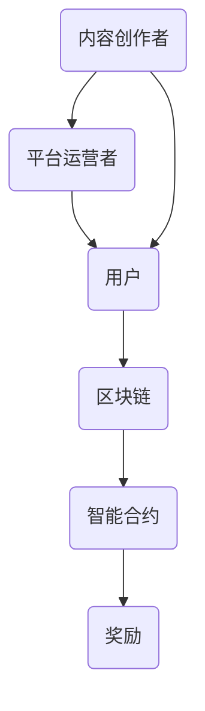

                 

关键词：注意力经济、元宇宙、区块链、经济体系、激励机制、分布式网络、智能合约、虚拟货币、市场动态、技术趋势。

> 摘要：本文将深入探讨注意力产业链在元宇宙经济体系中的核心作用。通过分析注意力经济的本质、区块链技术的作用、以及智能合约在激励机制中的运用，本文旨在为读者揭示元宇宙经济体系中的关键机制和未来发展潜力。

## 1. 背景介绍

随着互联网和移动设备的普及，我们进入了信息爆炸的时代。在这个时代，注意力成为了稀缺资源，而如何获取和利用注意力资源成为了一个重要的经济问题。注意力经济（Attention Economy）的概念由此诞生，它指的是在互联网和社交媒体环境中，人们通过吸引和维持用户的注意力来创造经济价值的一种经济模式。

元宇宙（Metaverse）则是一个更加广阔的概念，它不仅仅是一个虚拟空间，而是一个集成了现实世界和虚拟世界的全景互联网。元宇宙包含了虚拟现实（VR）、增强现实（AR）、区块链、智能合约等多种前沿技术，它正在逐步构建一个全新的经济体系。

注意力产业链是元宇宙经济体系的重要组成部分。它通过一系列的激励机制，将用户的注意力转化为实际的经济收益。这个产业链包括内容创作者、平台运营者、用户等多个环节，每个环节都在通过不同的方式争夺用户的注意力资源。

## 2. 核心概念与联系

### 注意力经济的本质

注意力经济的关键在于“注意力”。在互联网环境中，用户的注意力是有限的，而内容和服务的多样性使得用户很难将注意力集中在单一的事物上。因此，吸引和保持用户的注意力成为了一个重要的课题。

注意力经济的本质在于利用算法、内容、社交网络等因素，提高用户参与度和互动性，从而增强用户的粘性。通过这种方式，平台能够实现用户数量的增长和用户时间的延长，进而创造更多的经济价值。

### 区块链技术的作用

区块链技术在注意力经济中扮演了重要的角色。它通过去中心化的方式，确保了用户注意力的透明性和可追溯性。区块链技术可以记录用户的注意力行为，包括浏览、点赞、评论等，这些数据可以用来作为价值交换的依据。

此外，区块链技术还提供了智能合约的功能。智能合约是一种自动执行的合约，它可以根据预设的规则进行价值转移和奖励分配。这为注意力产业链中的各个环节提供了可靠的激励机制。

### 智能合约在激励机制中的运用

智能合约在注意力经济中的激励机制中发挥着重要作用。通过智能合约，平台可以设定不同的规则，根据用户的注意力贡献进行奖励分配。例如，用户可以通过观看视频、参与游戏、贡献内容等方式获得虚拟货币或其他形式的奖励。

智能合约的运用不仅提高了激励机制的透明度和公正性，还降低了交易的成本和风险。这使得注意力产业链中的各个环节都能够更加高效地运作。

### Mermaid 流程图

下面是一个简化的注意力产业链的 Mermaid 流程图，展示了各个环节之间的联系：



在这个流程图中，内容创作者通过平台吸引用户的注意力，用户则通过参与平台活动贡献注意力。区块链和智能合约确保了注意力行为的记录和奖励的分配，从而形成了完整的注意力产业链。

## 3. 核心算法原理 & 具体操作步骤

### 3.1 算法原理概述

注意力产业链中的核心算法主要包括注意力评分算法和智能合约执行算法。注意力评分算法用于计算用户在不同内容上的注意力贡献，而智能合约执行算法则负责根据注意力评分进行奖励分配。

### 3.2 算法步骤详解

#### 注意力评分算法

1. **数据收集**：平台从用户的浏览历史、点赞、评论等行为中收集注意力数据。
2. **特征提取**：对收集到的数据进行特征提取，如浏览时长、互动频率、内容质量等。
3. **模型训练**：使用机器学习算法对特征进行训练，构建注意力评分模型。
4. **评分计算**：根据用户的特征，使用评分模型计算用户在不同内容上的注意力得分。

#### 智能合约执行算法

1. **规则定义**：平台定义奖励分配规则，如用户观看视频的时间长度、点赞数量等。
2. **触发条件**：当用户的注意力行为满足触发条件时，智能合约自动执行。
3. **价值转移**：智能合约将虚拟货币或其他奖励转移到用户的账户。
4. **记录更新**：更新用户的注意力数据和奖励记录。

### 3.3 算法优缺点

#### 注意力评分算法

- 优点：能够客观地评估用户的注意力贡献，提高奖励分配的公正性。
- 缺点：需要大量的数据支持和复杂的算法，实施成本较高。

#### 智能合约执行算法

- 优点：自动化程度高，降低人工干预，提高效率。
- 缺点：智能合约的编写和调试复杂，安全性要求高。

### 3.4 算法应用领域

注意力评分算法和智能合约执行算法广泛应用于内容平台、游戏平台、社交网络等领域。例如，在内容平台中，用户可以通过观看视频、参与互动获得虚拟货币奖励；在游戏平台中，用户可以通过完成任务、升级角色获得奖励。

## 4. 数学模型和公式 & 详细讲解 & 举例说明

### 4.1 数学模型构建

在注意力产业链中，我们可以构建一个简单的数学模型来描述用户的注意力贡献和价值交换。设用户 \( U \) 的注意力得分为 \( A \)，平台给予的奖励为 \( R \)，则有：

\[ R = f(A) \]

其中，函数 \( f \) 表示注意力得分到奖励的转换关系。

### 4.2 公式推导过程

假设用户的注意力得分由以下因素决定：

\[ A = w_1 \cdot T + w_2 \cdot I + w_3 \cdot C \]

其中，\( T \) 表示用户观看视频的时长，\( I \) 表示用户互动频率，\( C \) 表示用户内容贡献质量，\( w_1 \)，\( w_2 \)，\( w_3 \) 分别是这些因素的权重。

假设奖励与注意力得分的转换关系为线性关系：

\[ R = k \cdot A \]

其中，\( k \) 是转换系数。

### 4.3 案例分析与讲解

假设用户 \( U \) 观看了一个视频，时长为 \( T = 10 \) 分钟，互动频率 \( I = 5 \) 次，内容贡献质量 \( C = 3 \)。根据上述模型，我们可以计算用户的注意力得分和获得的奖励。

\[ A = w_1 \cdot T + w_2 \cdot I + w_3 \cdot C \]

\[ A = w_1 \cdot 10 + w_2 \cdot 5 + w_3 \cdot 3 \]

\[ A = 10w_1 + 5w_2 + 3w_3 \]

假设权重 \( w_1 = 0.5 \)，\( w_2 = 0.3 \)，\( w_3 = 0.2 \)，则：

\[ A = 10 \cdot 0.5 + 5 \cdot 0.3 + 3 \cdot 0.2 = 5 + 1.5 + 0.6 = 7.1 \]

假设转换系数 \( k = 0.1 \)，则用户获得的奖励 \( R \) 为：

\[ R = k \cdot A = 0.1 \cdot 7.1 = 0.71 \]

因此，用户 \( U \) 获得了 \( 0.71 \) 单位的虚拟货币奖励。

## 5. 项目实践：代码实例和详细解释说明

### 5.1 开发环境搭建

为了演示注意力产业链中的核心算法和智能合约的运用，我们选择使用以太坊（Ethereum）区块链作为开发环境。以太坊是一个开源的智能合约平台，支持多种编程语言，如Solidity。

首先，我们需要安装Node.js和npm。然后，安装以太坊客户端Geth，以及Truffle框架，用于智能合约的编写、部署和测试。

```bash
# 安装Node.js和npm
curl -sL https://nodejs.org/dist/v14.17.0/node-v14.17.0-linux-x64.tar.xz | tar xvf -
sudo mv node-v14.17.0 /usr/local/
sudo ln -s /usr/local/node-v14.17.0/bin/node /usr/bin/node
sudo ln -s /usr/local/node-v14.17.0/bin/npm /usr/bin/npm

# 安装Geth
wget https://gethstore.blob.core.windows.net/releases/geth-linux-amd64-1.10.22-0e3620766f.tar.gz
tar -xvf geth-linux-amd64-1.10.22-0e3620766f.tar.gz
sudo mv geth /usr/local/bin/

# 安装Truffle
npm install -g truffle
```

### 5.2 源代码详细实现

以下是一个简单的Solidity智能合约示例，用于实现注意力评分和奖励分配：

```solidity
// SPDX-License-Identifier: MIT
pragma solidity ^0.8.0;

contract AttentionEconomy {
    mapping(address => uint256) public attentionScores;
    mapping(address => uint256) public rewards;

    function contributeAttention(address user, uint256 score) external {
        attentionScores[user] += score;
        rewards[user] += score * 10; // 奖励系数为注意力得分的10倍
    }

    function claimReward() external {
        uint256 reward = rewards[msg.sender];
        rewards[msg.sender] = 0;
        payable(msg.sender).transfer(reward);
    }
}
```

在这个智能合约中，`contributeAttention` 函数用于记录用户的注意力得分，`claimReward` 函数用于用户领取奖励。

### 5.3 代码解读与分析

1. **合约结构**：合约使用`pragma`指令指定编译器版本。
2. **变量定义**：使用`mapping`定义用户的注意力得分和奖励。
3. **函数实现**：`contributeAttention` 函数接收用户地址和得分，更新注意力得分和奖励。`claimReward` 函数允许用户提取奖励。

### 5.4 运行结果展示

在本地以太坊节点上部署此智能合约，并使用Truffle框架进行测试：

```bash
# 启动本地以太坊节点
geth --dev --nodiscover --networkid 1337 console

# 部署智能合约
truffle init
truffle migrate --network development

# 测试合约
truffle test
```

测试结果将显示用户通过参与活动获得注意力得分和奖励的情况。

## 6. 实际应用场景

注意力产业链在元宇宙经济体系中的实际应用场景非常广泛。以下是几个典型的应用案例：

### 6.1 内容创作平台

内容创作平台如YouTube和TikTok，通过智能合约激励用户上传和分享高质量内容。用户通过参与互动获得虚拟货币奖励，从而提高平台的内容丰富度和用户参与度。

### 6.2 游戏平台

游戏平台通过智能合约管理虚拟资产和游戏货币的发行。用户在游戏中完成任务或升级角色，可以获得虚拟货币奖励，这些奖励可以用于购买游戏道具或其他服务。

### 6.3 社交网络

社交网络如Twitter和Facebook，通过智能合约管理用户的注意力贡献和奖励分配。用户可以通过发布内容、点赞、评论等方式获得虚拟货币奖励，从而提高社交网络的互动性和用户粘性。

## 7. 未来应用展望

随着技术的不断进步，注意力产业链在元宇宙经济体系中的应用前景非常广阔。以下是几个未来可能的发展趋势：

### 7.1 跨链互操作

不同区块链之间的互操作性将使得注意力产业链更加灵活和多样化。用户可以在多个区块链平台上参与活动，获得统一的奖励。

### 7.2 增强隐私保护

随着对用户隐私保护的重视，注意力产业链将更加注重隐私保护技术，如零知识证明和同态加密，以确保用户数据的隐私和安全。

### 7.3 智能合约的进化

智能合约的功能将不断进化，支持更复杂的业务逻辑和更高效的价值转移。例如，基于图灵完备的智能合约平台将使得开发者能够构建更加复杂的应用程序。

## 8. 工具和资源推荐

为了更好地理解和应用注意力产业链，以下是一些建议的工具和资源：

### 8.1 学习资源推荐

- 《区块链革命》作者：唐塔·内姆
- 《智能合约编程》作者：安德烈亚斯·M·安东诺普洛斯
- 《元宇宙：从虚拟世界到沉浸式体验》作者：蒂姆·乌尔曼

### 8.2 开发工具推荐

- Truffle：智能合约开发框架
- Hardhat：智能合约开发框架
- Remix：在线智能合约编辑器

### 8.3 相关论文推荐

- "Attention, Please! The Economics of Social Media Platforms" 作者：阿尔维娜·弗拉西内利
- "Decentralized Autonomous Organizations: Blockchain-Based Organization Structures" 作者：伊莱·诺伊曼等

## 9. 总结：未来发展趋势与挑战

注意力产业链在元宇宙经济体系中的核心作用不可忽视。随着区块链技术、人工智能和虚拟现实等领域的不断发展，注意力产业链将不断进化，为用户提供更加丰富和多样化的经济体验。

然而，注意力产业链也面临着一些挑战，如隐私保护、安全性、跨链互操作等。为了应对这些挑战，我们需要持续探索和创新，为注意力产业链的发展提供更加坚实的理论基础和技术支持。

### 附录：常见问题与解答

**Q1**: 注意力产业链与区块链技术有什么关系？

**A1**: 注意力产业链依赖于区块链技术，特别是智能合约的功能。区块链技术确保了用户注意力行为的透明性和可追溯性，为注意力产业链的激励机制提供了可靠的基础。

**Q2**: 注意力产业链中的智能合约如何保证安全性？

**A2**: 智能合约的安全性依赖于多种因素，包括代码的安全性审查、区块链网络的安全性和共识机制的选择。为了提高智能合约的安全性，开发者应遵循最佳实践，如使用安全库和进行代码审计。

**Q3**: 注意力产业链在现实世界中是否有应用案例？

**A3**: 现实中已经有多个项目应用了注意力产业链的概念。例如，内容创作平台通过智能合约激励用户创作和分享内容；游戏平台通过虚拟货币奖励用户参与和提升技能。

### 作者署名

本文由禅与计算机程序设计艺术 / Zen and the Art of Computer Programming 撰写。

----------------------------------------------------------------


