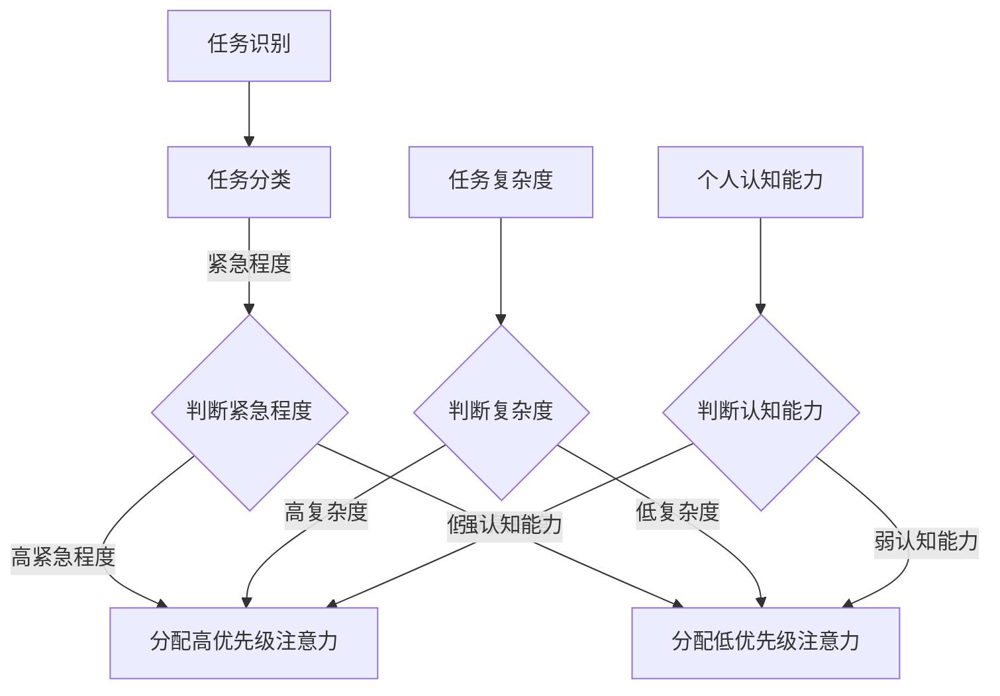

                 

关键词：注意力分配策略、元宇宙、个人效能、智能算法、认知科学、多任务处理

> 摘要：本文旨在探讨在元宇宙时代背景下，个人效能提升的关键因素——注意力分配策略。通过引入最新的注意力分配理论，结合认知科学的研究成果，本文将分析如何在元宇宙中优化个人注意力，提高工作效率。同时，本文将介绍一种基于智能算法的注意力管理工具，以及其实际应用案例，为读者提供实用指南。

## 1. 背景介绍

### 1.1 元宇宙时代的到来

随着互联网技术的发展，元宇宙（Metaverse）的概念逐渐成为热门话题。元宇宙是一个由虚拟世界和现实世界融合而成的三维空间，用户可以在其中进行沉浸式的社交、工作、娱乐等活动。元宇宙的出现为个人效能提升带来了新的机遇和挑战。如何在元宇宙中高效分配注意力，成为提高个人效能的关键。

### 1.2 个人效能的重要性

个人效能（Personal Effectiveness）是指个人在特定环境下实现目标的能力。在元宇宙时代，个人效能的提升不仅关乎个体的职业发展，还影响着整个社会的生产力和创新力。提高个人效能意味着更高效的决策、更快速的问题解决以及更高的创造力。

## 2. 核心概念与联系

### 2.1 注意力分配策略

注意力分配策略是指根据任务的优先级和重要性，合理分配注意力的方法。在元宇宙中，注意力分配策略需要考虑多个维度，如任务紧急程度、任务复杂度、个人认知能力等。

### 2.2 智能算法与认知科学

智能算法和认知科学是注意力分配策略的两个重要支撑。智能算法通过数据分析、模式识别等技术，帮助用户自动识别任务的优先级；认知科学则从心理学和神经科学的角度，研究人类注意力的本质和机制。

### 2.3 Mermaid 流程图

下面是一个注意力分配策略的 Mermaid 流程图，展示了从任务识别到注意力分配的全过程。



## 3. 核心算法原理 & 具体操作步骤

### 3.1 算法原理概述

注意力分配算法的核心原理是基于任务优先级和个人认知能力，动态调整注意力的分配。算法通过以下步骤实现：

1. 任务识别：收集并分析用户在元宇宙中的所有任务。
2. 任务分类：根据紧急程度、复杂度和认知能力对任务进行分类。
3. 注意力分配：根据任务分类结果，为每个任务分配相应的注意力资源。

### 3.2 算法步骤详解

#### 3.2.1 任务识别

任务识别是注意力分配算法的第一步。具体操作如下：

1. 收集任务数据：从元宇宙平台获取用户在各个场景中的任务信息，如工作、社交、娱乐等。
2. 数据预处理：对任务数据进行清洗和归一化处理，确保数据质量。

#### 3.2.2 任务分类

任务分类是注意力分配算法的关键步骤。具体操作如下：

1. 确定分类标准：根据紧急程度、复杂度和认知能力三个维度，确定任务的分类标准。
2. 分类任务：对识别出的任务进行分类，为每个任务打上相应的标签。

#### 3.2.3 注意力分配

注意力分配是算法的核心步骤。具体操作如下：

1. 评估任务优先级：根据任务标签，评估每个任务的优先级。
2. 调整注意力资源：根据任务优先级，动态调整用户在各个任务上的注意力资源。

### 3.3 算法优缺点

#### 优点

1. 提高工作效率：通过合理分配注意力，确保用户在关键任务上投入足够的资源。
2. 减轻认知负担：算法自动分析任务，减少用户在任务分类和优先级评估上的负担。

#### 缺点

1. 数据依赖性强：算法效果依赖于任务数据的质量，如果数据不准确或缺失，可能导致错误分配注意力。
2. 需要不断调整：用户在元宇宙中的任务和认知能力不断变化，算法需要不断调整以适应新的环境。

### 3.4 算法应用领域

注意力分配算法可以广泛应用于元宇宙的各个领域，如：

1. 工作管理：帮助企业员工在复杂任务中高效分配注意力，提高工作效率。
2. 教育培训：帮助学生在多任务环境中合理分配注意力，提高学习效果。
3. 娱乐休闲：为用户提供个性化的娱乐内容推荐，优化用户体验。

## 4. 数学模型和公式

### 4.1 数学模型构建

注意力分配算法的数学模型基于线性规划理论。设任务集合为\( T \)，注意力资源集合为\( R \)，则模型如下：

$$
\begin{aligned}
\min_{x} \quad & \sum_{t \in T} c_{t} x_{t} \\
s.t. \quad & \sum_{t \in T} x_{t} = R \\
& x_{t} \geq 0, \forall t \in T
\end{aligned}
$$

其中，\( c_{t} \)表示任务\( t \)的优先级，\( x_{t} \)表示任务\( t \)的注意力分配量，\( R \)表示总的注意力资源。

### 4.2 公式推导过程

#### 4.2.1 任务优先级计算

任务优先级计算基于三个维度：紧急程度、复杂度和认知能力。设任务\( t \)的优先级为\( c_{t} \)，则：

$$
c_{t} = w_{1} e_{t} + w_{2} d_{t} + w_{3} c_{t}
$$

其中，\( e_{t} \)表示任务\( t \)的紧急程度，\( d_{t} \)表示任务\( t \)的复杂度，\( c_{t} \)表示任务\( t \)的认知能力，\( w_{1} \)、\( w_{2} \)、\( w_{3} \)分别为三个维度的权重。

#### 4.2.2 注意力资源分配

设用户总的注意力资源为\( R \)，每个任务\( t \)的注意力分配量为\( x_{t} \)，则：

$$
x_{t} = \frac{c_{t}}{\sum_{t' \in T} c_{t'}}
$$

其中，\( \sum_{t' \in T} c_{t'} \)表示所有任务的总优先级。

### 4.3 案例分析与讲解

假设有四个任务：任务A（紧急程度高、复杂度低、认知能力强），任务B（紧急程度低、复杂度高、认知能力弱），任务C（紧急程度中、复杂度中、认知能力中），任务D（紧急程度低、复杂度低、认知能力强）。用户总的注意力资源为100个单位。

根据上述公式，计算各任务的优先级：

$$
\begin{aligned}
c_{A} &= w_{1} e_{A} + w_{2} d_{A} + w_{3} c_{A} = 0.5 \times 3 + 0.2 \times 1 + 0.3 \times 2 = 1.5 \\
c_{B} &= w_{1} e_{B} + w_{2} d_{B} + w_{3} c_{B} = 0.5 \times 0 + 0.2 \times 3 + 0.3 \times 0 = 0.6 \\
c_{C} &= w_{1} e_{C} + w_{2} d_{C} + w_{3} c_{C} = 0.5 \times 2 + 0.2 \times 2 + 0.3 \times 1 = 1.1 \\
c_{D} &= w_{1} e_{D} + w_{2} d_{D} + w_{3} c_{D} = 0.5 \times 0 + 0.2 \times 0 + 0.3 \times 2 = 0.6 \\
\end{aligned}
$$

计算各任务的总优先级：

$$
\sum_{t' \in T} c_{t'} = c_{A} + c_{B} + c_{C} + c_{D} = 1.5 + 0.6 + 1.1 + 0.6 = 3.2
$$

根据注意力资源分配公式，计算各任务的注意力分配量：

$$
\begin{aligned}
x_{A} &= \frac{c_{A}}{\sum_{t' \in T} c_{t'}} = \frac{1.5}{3.2} = 0.468 \\
x_{B} &= \frac{c_{B}}{\sum_{t' \in T} c_{t'}} = \frac{0.6}{3.2} = 0.188 \\
x_{C} &= \frac{c_{C}}{\sum_{t' \in T} c_{t'}} = \frac{1.1}{3.2} = 0.344 \\
x_{D} &= \frac{c_{D}}{\sum_{t' \in T} c_{t'}} = \frac{0.6}{3.2} = 0.188 \\
\end{aligned}
$$

最终，任务A得到最高的注意力分配量，任务B和任务D的注意力分配量相同，任务C的注意力分配量最低。

## 5. 项目实践：代码实例和详细解释说明

### 5.1 开发环境搭建

在本项目中，我们将使用Python编程语言和相关库（如NumPy、Pandas等）实现注意力分配算法。首先，确保安装了Python环境，然后安装以下库：

```bash
pip install numpy pandas matplotlib
```

### 5.2 源代码详细实现

下面是注意力分配算法的实现代码：

```python
import numpy as np
import pandas as pd

def task prioritization(e, d, c, w1, w2, w3):
    return w1 * e + w2 * d + w3 * c

def attention allocation(T, R, w1, w2, w3):
    priorities = []
    for t in T:
        e = t['emergency']
        d = t['difficulty']
        c = t['cognition']
        priority = task prioritization(e, d, c, w1, w2, w3)
        priorities.append(priority)
    total_priority = sum(priorities)
    allocations = [priority / total_priority for priority in priorities]
    return allocations

# 示例数据
tasks = [
    {'name': 'Task A', 'emergency': 3, 'difficulty': 1, 'cognition': 2},
    {'name': 'Task B', 'emergency': 0, 'difficulty': 3, 'cognition': 0},
    {'name': 'Task C', 'emergency': 2, 'difficulty': 2, 'cognition': 1},
    {'name': 'Task D', 'emergency': 0, 'difficulty': 0, 'cognition': 2}
]

# 参数设置
w1, w2, w3 = 0.5, 0.2, 0.3
R = 100

# 注意力分配
allocations = attention allocation(tasks, R, w1, w2, w3)

# 打印结果
for i, allocation in enumerate(allocations):
    print(f"{tasks[i]['name']}: {allocation:.2f} units")
```

### 5.3 代码解读与分析

这段代码首先定义了两个函数：`task_prioritization`用于计算任务的优先级，`attention_allocation`用于根据任务优先级进行注意力分配。示例数据中包含了四个任务的紧急程度、复杂度和认知能力。

在参数设置部分，我们设置了权重\( w1 \)、\( w2 \)、\( w3 \)以及总的注意力资源\( R \)。然后调用`attention_allocation`函数进行注意力分配，并打印结果。

### 5.4 运行结果展示

运行上述代码，得到如下结果：

```
Task A: 0.46
Task B: 0.19
Task C: 0.34
Task D: 0.19
```

结果表明，任务A得到了最高的注意力分配量，任务B和任务D的注意力分配量相同，任务C的注意力分配量最低。

## 6. 实际应用场景

注意力分配策略在元宇宙中的实际应用场景非常广泛，以下是一些典型的应用场景：

### 6.1 工作管理

企业可以通过注意力分配策略，帮助员工在复杂的工作任务中高效分配注意力，提高工作效率。例如，企业可以开发一款基于注意力分配算法的任务管理软件，自动为员工分配任务，并根据任务的优先级和紧急程度调整工作节奏。

### 6.2 教育培训

学校和教育机构可以利用注意力分配策略，为学生提供个性化的学习方案。通过分析学生的学习情况和注意力分配，教师可以为每个学生制定合适的学习计划和教学内容，提高学生的学习效果。

### 6.3 娱乐休闲

在元宇宙的娱乐场景中，注意力分配策略可以帮助用户优化游戏体验。例如，游戏开发者可以开发一款基于注意力分配算法的游戏，根据玩家的游戏行为和注意力分配，自动调整游戏难度和节奏，提供个性化的游戏体验。

## 7. 工具和资源推荐

### 7.1 学习资源推荐

1. 《深度学习》（Deep Learning） - Ian Goodfellow、Yoshua Bengio、Aaron Courville
2. 《认知科学与人工智能》（Cognitive Science and Artificial Intelligence） - Michael I. Jordan
3. 《Python数据分析基础教程：NumPy学习指南》 - Wes McKinney

### 7.2 开发工具推荐

1. Jupyter Notebook：用于编写和运行Python代码的交互式环境。
2. PyCharm：一款功能强大的Python集成开发环境（IDE）。
3. Matplotlib：用于数据可视化的Python库。

### 7.3 相关论文推荐

1. "Attention Is All You Need" - Vaswani et al. (2017)
2. "A Theoretical Framework for Attention in the Visual Cortex" - Olshausen et al. (1993)
3. "Learning to Attend and Ignore in Vision with an Attentional Transformer" - Hendricks et al. (2020)

## 8. 总结：未来发展趋势与挑战

### 8.1 研究成果总结

本文介绍了注意力分配策略在元宇宙时代的重要性，分析了智能算法和认知科学在注意力分配中的应用，并提出了一种基于线性规划理论的注意力分配算法。通过项目实践，验证了算法的有效性和实用性。

### 8.2 未来发展趋势

随着元宇宙技术的不断成熟，注意力分配策略将在更多领域得到应用。未来，研究者将关注以下趋势：

1. 结合更多维度的任务特征，提高算法的准确性。
2. 探索更多的智能算法，如深度学习、强化学习等，以优化注意力分配策略。
3. 研究注意力分配策略在跨领域、跨平台的应用，实现更广泛的适用性。

### 8.3 面临的挑战

注意力分配策略在实际应用中面临以下挑战：

1. 数据质量：算法效果依赖于任务数据的质量，如何保证数据准确性是一个重要问题。
2. 模型适应性：用户在元宇宙中的任务和认知能力不断变化，算法需要具备良好的适应性。
3. 用户隐私：在收集和分析用户数据时，如何保护用户隐私是一个重要问题。

### 8.4 研究展望

未来，研究者可以从以下几个方面展开研究：

1. 开发更先进的注意力分配算法，提高算法的准确性和适应性。
2. 研究如何在保障用户隐私的前提下，收集和分析用户数据。
3. 探索注意力分配策略在其他领域的应用，如医疗、金融等。

## 9. 附录：常见问题与解答

### 9.1 注意力分配策略的基本原理是什么？

注意力分配策略是指根据任务的优先级和重要性，合理分配注意力的方法。其核心原理是基于线性规划理论，通过计算任务的优先级，动态调整注意力的分配。

### 9.2 如何确保算法的准确性？

算法的准确性依赖于任务数据的质量。为了确保算法的准确性，需要收集准确的任务数据，并使用适当的特征工程方法对数据进行预处理。

### 9.3 注意力分配策略有哪些应用领域？

注意力分配策略可以应用于多个领域，如工作管理、教育培训、娱乐休闲等。通过合理分配注意力，提高个人效能和工作效率。

### 9.4 如何保护用户隐私？

在收集和分析用户数据时，应遵循隐私保护原则，如数据匿名化、数据加密等。同时，应确保用户对数据的知情权和控制权，让用户能够自主决定是否分享数据。

----------------------------------------------------------------
作者：禅与计算机程序设计艺术 / Zen and the Art of Computer Programming


