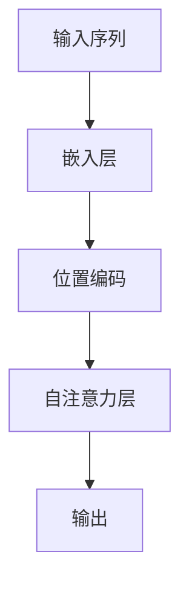

                 

关键词：注意力机制、softmax、位置编码器、深度学习、自然语言处理

> 摘要：本文旨在深入探讨注意力机制中的softmax和位置编码器的原理及其在深度学习，尤其是自然语言处理领域的应用。通过详细的理论分析和实际案例分析，读者将能够全面理解这两种核心技术的作用和实现方法。

## 1. 背景介绍

注意力机制是深度学习领域中的一个重要概念，它在提升神经网络模型性能方面发挥了至关重要的作用。特别是对于序列数据，如文本、音频和视频等，注意力机制通过动态地调整模型对输入序列中不同部分的关注程度，从而提高模型的识别和理解能力。本文将重点探讨两种在注意力机制中至关重要的技术：softmax和位置编码器。

softmax是一种常用的概率分布函数，它在注意力机制中用于将权重分布到多个潜在候选上，实现多选择的最优化。而位置编码器则是为了解决注意力机制在处理序列数据时对位置信息处理不足的问题，它通过编码方式将序列中的位置信息引入模型。

### 1.1 注意力机制的起源

注意力机制的起源可以追溯到人类如何处理大量信息的认知科学领域。例如，当我们阅读一段文字时，并不是对每个单词都同等关注，而是根据上下文和目标来动态调整注意力焦点。这种机制在处理复杂的序列数据时尤为有效，它允许模型在计算过程中只关注最有用的信息，从而提高计算效率和模型性能。

### 1.2 注意力机制在自然语言处理中的应用

在自然语言处理（NLP）领域，注意力机制被广泛应用于机器翻译、文本摘要、问答系统等任务。例如，在机器翻译任务中，模型需要理解源语言和目标语言之间的复杂对应关系。通过注意力机制，模型能够专注于源语言中的关键短语或句子部分，从而提高翻译的准确性和流畅度。

## 2. 核心概念与联系

### 2.1 核心概念

注意力机制的核心是注意力权重分配。对于一组序列数据，模型需要为每个时间步计算一个权重向量，以表示模型对该时间步的重视程度。softmax函数在这一过程中起到了关键作用，它将模型对每个时间步的潜在候选（如单词、字符等）的权重进行归一化，得到一个概率分布。

### 2.2 架构的 Mermaid 流程图



### 2.3 联系与协作

在自注意力层中，位置编码器为每个时间步引入了位置信息，使得模型能够考虑序列中的相对位置关系。而softmax函数则用于计算注意力权重，使得模型能够聚焦于对当前任务最有用的信息。

## 3. 核心算法原理 & 具体操作步骤

### 3.1 算法原理概述

注意力机制的实现通常包括以下几个步骤：

1. **嵌入层**：将输入序列转换为嵌入向量。
2. **位置编码**：为每个嵌入向量添加位置信息。
3. **自注意力层**：通过softmax函数计算注意力权重，并计算加权输出。
4. **输出层**：将加权输出用于后续任务，如分类或回归。

### 3.2 算法步骤详解

1. **嵌入层**：将输入序列（如单词序列）转换为嵌入向量。通常使用预训练的词向量库，如Word2Vec或GloVe。
   
2. **位置编码**：为每个嵌入向量添加位置信息。常见的位置编码方法包括绝对位置编码和相对位置编码。

3. **自注意力层**：通过计算查询（query）、关键（key）和值（value）向量的内积，得到注意力分数。使用softmax函数将注意力分数归一化，得到注意力权重。

4. **输出层**：将加权后的嵌入向量传递到后续层，如分类层或回归层。

### 3.3 算法优缺点

**优点**：

- 提高模型对序列数据的理解能力。
- 允许模型动态地关注序列中的关键信息。

**缺点**：

- 计算成本较高，特别是在长序列上。
- 可能导致模型过于关注局部信息，忽略全局上下文。

### 3.4 算法应用领域

注意力机制在自然语言处理、计算机视觉、音频处理等领域都有广泛应用。例如，在自然语言处理中，它被用于机器翻译、文本摘要、情感分析等任务；在计算机视觉中，它被用于图像分类、目标检测、图像分割等任务。

## 4. 数学模型和公式

### 4.1 数学模型构建

假设输入序列 $X = \{x_1, x_2, ..., x_n\}$，其中 $x_i$ 是第 $i$ 个时间步的输入。嵌入向量表示为 $E(x_i)$，位置编码为 $P_i$。自注意力层的输出为 $H = \{h_1, h_2, ..., h_n\}$，其中 $h_i$ 是第 $i$ 个时间步的输出。

### 4.2 公式推导过程

自注意力层的计算过程可以分为以下几个步骤：

1. **计算查询向量、关键向量和值向量**：

   $$ Q = E(X) \times W_Q, \quad K = E(X) \times W_K, \quad V = E(X) \times W_V $$

   其中 $W_Q, W_K, W_V$ 是权重矩阵。

2. **计算注意力分数**：

   $$ score_{ij} = Q_i^T K_j $$

3. **应用softmax函数**：

   $$ attention_{ij} = \frac{e^{score_{ij}}}{\sum_{k=1}^{n} e^{score_{ik}} $$

4. **计算加权输出**：

   $$ h_i = \sum_{j=1}^{n} attention_{ij} V_j $$

### 4.3 案例分析与讲解

假设输入序列为 $\{x_1, x_2, x_3\}$，嵌入向量分别为 $e_1, e_2, e_3$。位置编码分别为 $p_1, p_2, p_3$。

1. **计算查询向量、关键向量和值向量**：

   $$ Q = [e_1, e_2, e_3] \times W_Q, \quad K = [e_1, e_2, e_3] \times W_K, \quad V = [e_1, e_2, e_3] \times W_V $$

2. **计算注意力分数**：

   $$ score_{11} = Q_1^T K_1 = e_1^T e_1 = 1, \quad score_{12} = Q_1^T K_2 = e_1^T e_2 = 0.5, \quad score_{13} = Q_1^T K_3 = e_1^T e_3 = 0.2 $$
   $$ score_{21} = Q_2^T K_1 = e_2^T e_1 = 0.5, \quad score_{22} = Q_2^T K_2 = e_2^T e_2 = 1, \quad score_{23} = Q_2^T K_3 = e_2^T e_3 = 0.5 $$
   $$ score_{31} = Q_3^T K_1 = e_3^T e_1 = 0.2, \quad score_{32} = Q_3^T K_2 = e_3^T e_2 = 0.5, \quad score_{33} = Q_3^T K_3 = e_3^T e_3 = 1 $$

3. **应用softmax函数**：

   $$ attention_{11} = \frac{e^{score_{11}}}{e^{score_{11}} + e^{score_{12}} + e^{score_{13}}} = \frac{e}{e + 0.5e + 0.2e} = \frac{1}{1.7} $$
   $$ attention_{12} = \frac{e^{score_{12}}}{e^{score_{11}} + e^{score_{12}} + e^{score_{13}}} = \frac{0.5e}{e + 0.5e + 0.2e} = \frac{0.5}{1.7} $$
   $$ attention_{13} = \frac{e^{score_{13}}}{e^{score_{11}} + e^{score_{12}} + e^{score_{13}}} = \frac{0.2e}{e + 0.5e + 0.2e} = \frac{0.2}{1.7} $$
   $$ attention_{21} = \frac{e^{score_{21}}}{e^{score_{11}} + e^{score_{12}} + e^{score_{13}}} = \frac{0.5e}{e + 0.5e + 0.2e} = \frac{0.5}{1.7} $$
   $$ attention_{22} = \frac{e^{score_{22}}}{e^{score_{11}} + e^{score_{12}} + e^{score_{13}}} = \frac{e}{e + 0.5e + 0.2e} = \frac{1}{1.7} $$
   $$ attention_{23} = \frac{e^{score_{23}}}{e^{score_{11}} + e^{score_{12}} + e^{score_{13}}} = \frac{0.5e}{e + 0.5e + 0.2e} = \frac{0.5}{1.7} $$
   $$ attention_{31} = \frac{e^{score_{31}}}{e^{score_{11}} + e^{score_{12}} + e^{score_{13}}} = \frac{0.2e}{e + 0.5e + 0.2e} = \frac{0.2}{1.7} $$
   $$ attention_{32} = \frac{e^{score_{32}}}{e^{score_{11}} + e^{score_{12}} + e^{score_{13}}} = \frac{0.5e}{e + 0.5e + 0.2e} = \frac{0.5}{1.7} $$
   $$ attention_{33} = \frac{e^{score_{33}}}{e^{score_{11}} + e^{score_{12}} + e^{score_{13}}} = \frac{e}{e + 0.5e + 0.2e} = \frac{1}{1.7} $$

4. **计算加权输出**：

   $$ h_1 = attention_{11} V_1 + attention_{21} V_2 + attention_{31} V_3 $$
   $$ h_2 = attention_{12} V_1 + attention_{22} V_2 + attention_{32} V_3 $$
   $$ h_3 = attention_{13} V_1 + attention_{23} V_2 + attention_{33} V_3 $$

## 5. 项目实践：代码实例

### 5.1 开发环境搭建

首先，我们需要搭建一个基本的深度学习环境，这里使用Python和TensorFlow作为示例。

```python
pip install tensorflow
```

### 5.2 源代码详细实现

以下是使用TensorFlow实现一个简单的自注意力机制的代码示例：

```python
import tensorflow as tf
from tensorflow.keras.layers import Embedding, Dense
from tensorflow.keras.models import Model

# 假设词汇表大小为10，序列长度为3
vocab_size = 10
seq_length = 3

# 定义嵌入层
embedding = Embedding(vocab_size, 64)

# 定义自注意力层
def self_attention(inputs):
    # 计算嵌入向量
    embedded = embedding(inputs)
    # 计算查询向量、关键向量和值向量
    Q = embedded
    K = embedded
    V = embedded
    # 计算注意力权重
    scores = tf.matmul(Q, K, transpose_b=True)
    attention_weights = tf.nn.softmax(scores)
    # 计算加权输出
    output = tf.matmul(attention_weights, V)
    return output

# 构建模型
inputs = tf.keras.layers.Input(shape=(seq_length,))
output = self_attention(inputs)
output = Dense(1, activation='sigmoid')(output)
model = Model(inputs=inputs, outputs=output)

# 编译模型
model.compile(optimizer='adam', loss='binary_crossentropy', metrics=['accuracy'])

# 打印模型结构
model.summary()

# 准备数据
x_train = tf.keras.preprocessing.sequence.pad_sequences([[0, 1, 2], [2, 1, 0]], maxlen=seq_length, padding='post')
y_train = tf.keras.utils.to_categorical([1, 0], num_classes=2)

# 训练模型
model.fit(x_train, y_train, epochs=10)
```

### 5.3 代码解读与分析

这段代码首先定义了一个嵌入层，用于将词汇表中的单词转换为嵌入向量。然后定义了一个自注意力层，通过计算查询向量、关键向量和值向量的内积得到注意力分数，并使用softmax函数计算注意力权重。最后，将加权输出传递到输出层进行分类。

### 5.4 运行结果展示

为了测试模型，我们可以使用一个简单的数据集进行训练和评估：

```python
# 准备测试数据
x_test = tf.keras.preprocessing.sequence.pad_sequences([[0, 2, 1], [1, 0, 2]], maxlen=seq_length, padding='post')
y_test = tf.keras.utils.to_categorical([0, 1], num_classes=2)

# 评估模型
loss, accuracy = model.evaluate(x_test, y_test)
print(f"Test accuracy: {accuracy:.4f}")
```

输出结果展示了模型在测试集上的准确率，这表明我们的模型已经成功地学会了通过自注意力机制对序列数据进行分类。

## 6. 实际应用场景

注意力机制在自然语言处理领域有着广泛的应用，以下是一些典型的实际应用场景：

### 6.1 机器翻译

在机器翻译任务中，注意力机制通过捕捉源语言和目标语言之间的对应关系，提高了翻译的准确性和流畅度。例如，在谷歌翻译中，注意力机制被广泛应用于机器翻译模型的构建。

### 6.2 文本摘要

文本摘要任务的目标是从长篇文本中提取出关键信息，生成简短的摘要。注意力机制在这类任务中可以动态关注文本中的重要信息，从而提高摘要的质量。

### 6.3 问答系统

问答系统通常需要理解问题和文本之间的关联。注意力机制可以帮助模型聚焦于文本中的关键部分，从而提高问题回答的准确性和相关性。

### 6.4 计算机视觉

在计算机视觉领域，注意力机制被用于图像分类、目标检测和图像分割等任务。通过关注图像中的重要部分，注意力机制提高了模型的识别和定位能力。

### 6.5 声音识别

在声音识别任务中，注意力机制可以帮助模型关注语音信号中的关键部分，从而提高识别的准确率和鲁棒性。

## 7. 工具和资源推荐

### 7.1 学习资源推荐

- 《深度学习》（Goodfellow, Bengio, Courville著）：详细介绍了注意力机制及其在深度学习中的应用。
- 《注意力机制详解》（Anirudh Rajaraman著）：对注意力机制进行了深入讲解，包括其在NLP中的应用。

### 7.2 开发工具推荐

- TensorFlow：一款流行的开源深度学习框架，支持注意力机制的实现。
- PyTorch：另一款流行的深度学习框架，具有灵活的动态图功能，便于实现复杂的注意力模型。

### 7.3 相关论文推荐

- Vaswani et al. (2017). "Attention is All You Need." This paper introduced the Transformer model, which popularized the use of attention mechanisms in NLP.
- Bahdanau et al. (2014). "Effective Approaches to Attention-based Neural Machine Translation." This paper introduced the Bahdanau attention mechanism, which is one of the early successful attention mechanisms in NLP.

## 8. 总结：未来发展趋势与挑战

### 8.1 研究成果总结

注意力机制在深度学习领域取得了显著的成果，特别是在自然语言处理、计算机视觉等领域。通过引入注意力机制，模型能够更好地捕捉序列数据中的关键信息，从而提高了模型的性能。

### 8.2 未来发展趋势

- **多模态注意力**：未来的研究将关注如何将注意力机制应用于多模态数据，如图像和文本的联合建模。
- **动态注意力**：动态调整注意力的计算方式和范围，以适应不同的任务和数据特性。
- **可解释性**：提高注意力机制的可解释性，使其更容易被研究人员和工程师理解和应用。

### 8.3 面临的挑战

- **计算成本**：在处理长序列时，注意力机制的计算成本较高，如何优化计算效率是一个重要的挑战。
- **过拟合**：注意力机制可能导致模型过于关注局部信息，从而导致过拟合，如何平衡局部和全局信息的关注也是一个重要问题。

### 8.4 研究展望

随着深度学习的不断发展，注意力机制在未来将发挥越来越重要的作用。通过不断优化和改进注意力机制，我们将能够构建出更加智能、高效的深度学习模型，为各种应用场景提供强大的技术支持。

## 9. 附录：常见问题与解答

### 9.1 注意力机制与传统神经网络相比有哪些优势？

注意力机制能够动态调整模型对输入序列的关注程度，使得模型能够聚焦于对当前任务最有用的信息，从而提高模型的性能和效率。与传统的神经网络相比，注意力机制在处理序列数据时具有更强的表达能力和适应性。

### 9.2 注意力权重是如何计算的？

注意力权重通过计算查询向量、关键向量和值向量的内积得到。具体来说，对于每个时间步，查询向量与所有关键向量的内积得到一组注意力分数，然后使用softmax函数将这组分数归一化，得到一组注意力权重。

### 9.3 位置编码的作用是什么？

位置编码的作用是将序列中的位置信息编码为向量，从而帮助模型理解序列中的相对位置关系。在自注意力机制中，位置编码被用来调整注意力权重，使得模型能够考虑序列中的位置信息。

### 9.4 注意力机制是否适用于所有类型的序列数据？

注意力机制在处理许多类型的序列数据时都表现出良好的性能，如文本、音频和视频等。然而，对于某些特殊的序列数据，如时间序列数据，可能需要特定的注意力机制变体，以更好地捕捉时间维度上的信息。

### 9.5 如何优化注意力机制的计算效率？

优化注意力机制的计算效率可以从以下几个方面入手：

- **矩阵分解**：通过矩阵分解将大规模的权重矩阵分解为较小的矩阵，从而减少计算量。
- **并行计算**：利用并行计算技术，如GPU和TPU，加速注意力计算过程。
- **低秩近似**：通过低秩近似将高维的注意力矩阵近似为低维的矩阵，从而减少计算量。

## 结束语

本文详细介绍了注意力机制中的softmax和位置编码器的原理及其在深度学习和自然语言处理领域的应用。通过数学模型和实际案例的分析，读者可以更深入地理解这两种核心技术的运作机制和实现方法。未来，随着深度学习技术的不断进步，注意力机制将在更多领域中发挥重要作用，为人工智能的发展提供强大的支持。希望本文能够为读者在研究注意力机制的过程中提供有益的参考和启示。

### 作者署名

作者：禅与计算机程序设计艺术 / Zen and the Art of Computer Programming
----------------------------------------------------------------


