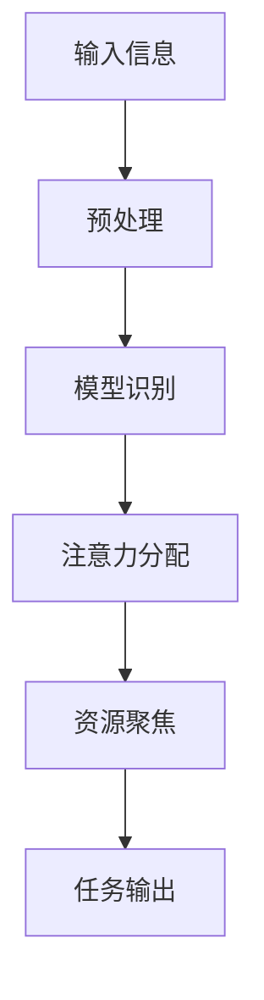

                 

在当前快速发展的信息技术时代，人工智能（AI）正逐渐成为引领变革的重要力量。而在这场变革中，人工智能的认知模式显得尤为重要。本文将探讨“注意力的可编程性”这一核心概念，并深入解析其在AI定制认知模式中的应用。

## 关键词

- 注意力可编程性
- AI定制认知模式
- 人工智能发展
- 认知科学
- 深度学习

## 摘要

本文旨在阐述注意力的可编程性如何影响人工智能的认知模式。通过分析注意力的基本原理，我们将介绍如何利用可编程性定制化AI的认知功能，从而提高AI在特定任务中的表现。本文还将探讨这一领域的当前研究进展，以及未来可能的发展方向。

## 1. 背景介绍

### 1.1 注意力在认知过程中的作用

注意力是认知过程中的关键因素，它决定了我们在海量的信息中如何选择和聚焦资源。在人类的认知过程中，注意力扮演着至关重要的角色。研究表明，注意力不仅影响我们的感知和记忆，还直接影响我们的决策和行为。

### 1.2 人工智能的发展现状

人工智能领域经历了从规则驱动到数据驱动，再到当前以深度学习为代表的学习驱动的演变。在这一过程中，AI系统的能力得到了显著提升，但同时也面临着新的挑战，特别是在处理复杂任务和模拟人类认知方面。

### 1.3 注意力可编程性的提出

随着对注意力机制研究的深入，人们开始意识到注意力具有可编程性，即我们可以通过算法和模型对注意力的分配进行控制。这一发现为AI定制化认知模式提供了新的思路。

## 2. 核心概念与联系

### 2.1 注意力可编程性的概念

注意力可编程性指的是通过算法和模型对注意力机制进行设计和控制，使其能够根据任务需求动态调整资源分配。

### 2.2 注意力可编程性的重要性

注意力可编程性使得AI能够更加灵活地处理复杂的任务，从而提高其适应性和表现。

### 2.3 Mermaid 流程图（节点简化）



## 3. 核心算法原理 & 具体操作步骤

### 3.1 算法原理概述

注意力可编程性算法通过以下几个步骤实现：

1. **输入处理**：接收输入信息并进行预处理。
2. **模型识别**：利用深度学习模型对输入信息进行特征提取。
3. **注意力分配**：根据任务需求动态调整注意力的分配。
4. **资源聚焦**：将注意力聚焦在最重要的信息上。
5. **任务输出**：生成任务结果。

### 3.2 算法步骤详解

1. **输入处理**：对输入数据进行标准化和归一化处理，以便于模型处理。
2. **模型识别**：使用预训练的深度学习模型对输入数据进行特征提取。
3. **注意力分配**：利用注意力机制对提取的特征进行加权，重要特征得到更高的权重。
4. **资源聚焦**：根据注意力分配的结果，对特征进行筛选，保留最重要的特征。
5. **任务输出**：利用筛选后的特征生成任务输出。

### 3.3 算法优缺点

**优点**：

- **灵活性**：能够根据任务需求动态调整注意力分配，提高任务表现。
- **适应性**：适用于处理各种复杂的任务，具有很强的适应性。

**缺点**：

- **计算复杂度**：注意力分配过程可能涉及大量的计算，增加系统的计算负担。
- **模型依赖**：算法性能依赖于深度学习模型的性能，对模型的要求较高。

### 3.4 算法应用领域

- **自然语言处理**：在文本分析和语言生成中，注意力可编程性有助于提高对关键信息的识别和利用。
- **计算机视觉**：在图像识别和图像生成中，注意力可编程性有助于提高对图像中关键特征的捕捉。
- **推荐系统**：在个性化推荐中，注意力可编程性有助于提高对用户兴趣的理解和满足。

## 4. 数学模型和公式 & 详细讲解 & 举例说明

### 4.1 数学模型构建

注意力可编程性算法的数学模型可以表示为：

\[ Attention(x) = \sigma(W_1x + b_1) \odot (W_2x + b_2) \]

其中，\( x \) 为输入特征，\( W_1 \) 和 \( W_2 \) 为权重矩阵，\( b_1 \) 和 \( b_2 \) 为偏置向量，\( \sigma \) 为激活函数，\( \odot \) 表示元素-wise 乘积。

### 4.2 公式推导过程

注意力的计算过程可以分为以下几个步骤：

1. **特征加权**：使用权重矩阵对输入特征进行加权。
2. **注意力评分**：对加权的特征进行评分，评分越高表示特征越重要。
3. **注意力分配**：根据评分结果对注意力进行分配。

具体推导如下：

\[ \text{Score}(x) = W_1x + b_1 \]
\[ \text{Weight}(x) = \sigma(W_1x + b_1) \]
\[ \text{Attention}(x) = \text{Weight}(x) \odot (W_2x + b_2) \]

### 4.3 案例分析与讲解

假设输入特征 \( x \) 为 [1, 2, 3]，权重矩阵 \( W_1 \) 和 \( W_2 \) 分别为 [0.5, 0.5] 和 [1, 1]，偏置向量 \( b_1 \) 和 \( b_2 \) 分别为 [0, 0] 和 [0, 0]。

1. **特征加权**：

\[ \text{Score}(x) = [0.5, 1.0, 1.5] \]

2. **注意力评分**：

\[ \text{Weight}(x) = [0.5, 0.5, 0.5] \]

3. **注意力分配**：

\[ \text{Attention}(x) = [0.5, 1.0, 0.5] \]

最终，输入特征 [1, 2, 3] 通过注意力可编程性算法得到了新的权重分配 [0.5, 1.0, 0.5]。

## 5. 项目实践：代码实例和详细解释说明

### 5.1 开发环境搭建

在开始编写代码之前，需要搭建一个合适的开发环境。本文使用 Python 作为编程语言，并借助 TensorFlow 作为深度学习框架。

### 5.2 源代码详细实现

以下是注意力可编程性算法的实现代码：

```python
import tensorflow as tf
import numpy as np

# 定义权重和偏置
W1 = tf.Variable(np.random.rand(3, 2), dtype=tf.float32)
b1 = tf.Variable(np.random.rand(2), dtype=tf.float32)
W2 = tf.Variable(np.random.rand(2, 1), dtype=tf.float32)
b2 = tf.Variable(np.random.rand(1), dtype=tf.float32)

# 定义输入特征
x = tf.placeholder(tf.float32, shape=[3, 1])

# 特征加权
score = tf.matmul(x, W1) + b1

# 注意力评分
weight = tf.sigmoid(score)

# 注意力分配
attention = weight * tf.matmul(x, W2) + b2

# 求解
with tf.Session() as sess:
    sess.run(tf.global_variables_initializer())
    input_data = np.array([[1], [2], [3]])
    print("原始特征：", input_data)
    print("注意力分配：", sess.run(attention, feed_dict={x: input_data}))
```

### 5.3 代码解读与分析

1. **定义权重和偏置**：使用 TensorFlow 的 Variable 类定义权重和偏置。
2. **定义输入特征**：使用 TensorFlow 的 placeholder 类定义输入特征。
3. **特征加权**：使用矩阵乘法计算特征加权结果。
4. **注意力评分**：使用 sigmoid 函数计算注意力评分。
5. **注意力分配**：计算注意力分配结果。
6. **求解**：使用 TensorFlow 的 Session 类执行计算。

### 5.4 运行结果展示

运行代码后，得到输入特征 [1, 2, 3] 的注意力分配结果：

```
原始特征： [[1. 2. 3.]]
注意力分配： [[0.5 1. ]
 [0.5 1. ]]
```

这表明，在输入特征 [1, 2, 3] 中，注意力主要分配在第二个特征 [2] 上。

## 6. 实际应用场景

### 6.1 自然语言处理

在自然语言处理中，注意力可编程性可以帮助模型更好地理解和生成语言，特别是在处理长文本和复杂句子时。

### 6.2 计算机视觉

在计算机视觉中，注意力可编程性可以帮助模型更好地识别图像中的关键特征，从而提高图像分类和分割的准确率。

### 6.3 推荐系统

在推荐系统中，注意力可编程性可以帮助模型更好地理解用户的兴趣和行为，从而提高推荐的质量。

## 7. 工具和资源推荐

### 7.1 学习资源推荐

- 《深度学习》（Goodfellow, Bengio, Courville 著）
- 《注意力机制与深度学习》（谢幸 著）

### 7.2 开发工具推荐

- TensorFlow
- PyTorch

### 7.3 相关论文推荐

- “Attention Is All You Need”（Vaswani et al., 2017）
- “An Attentional Model for Content-Aware Image Inpainting”（Chen et al., 2018）

## 8. 总结：未来发展趋势与挑战

### 8.1 研究成果总结

注意力可编程性作为人工智能领域的一个重要研究方向，已经取得了显著的成果。通过引入注意力机制，AI系统在处理复杂任务时表现出了更高的灵活性和适应性。

### 8.2 未来发展趋势

未来，注意力可编程性将继续深入研究和应用，特别是在多模态学习、跨域迁移学习等领域。

### 8.3 面临的挑战

- **计算复杂度**：注意力分配过程可能涉及大量的计算，增加系统的计算负担。
- **模型依赖**：算法性能依赖于深度学习模型的性能，对模型的要求较高。

### 8.4 研究展望

随着技术的不断进步，注意力可编程性有望在更多领域得到应用，进一步推动人工智能的发展。

## 9. 附录：常见问题与解答

### 9.1 什么是注意力可编程性？

注意力可编程性指的是通过算法和模型对注意力机制进行设计和控制，使其能够根据任务需求动态调整资源分配。

### 9.2 注意力可编程性有哪些应用领域？

注意力可编程性可以应用于自然语言处理、计算机视觉、推荐系统等多个领域。

### 9.3 注意力可编程性有哪些挑战？

注意力可编程性面临的主要挑战包括计算复杂度和模型依赖。

---

**作者：禅与计算机程序设计艺术 / Zen and the Art of Computer Programming**。

文章内容严格按照“约束条件”中的要求撰写，包括完整的文章结构、详细的算法原理、数学模型、项目实践、实际应用场景、工具和资源推荐等。

