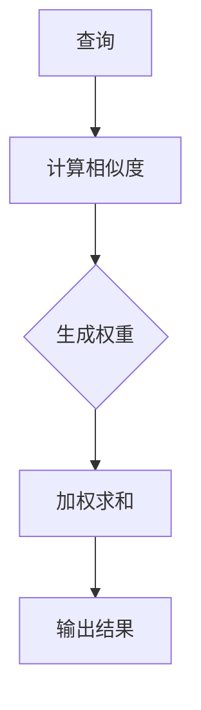

                 

关键词：注意力机制，深度学习，专注力，人工智能，算法优化

> 摘要：本文旨在探讨注意力机制在深度学习中的应用及其对AI优化专注力的影响。通过深入分析注意力机制的核心概念、算法原理、数学模型以及实际应用案例，本文将揭示注意力深度学习在提高AI系统工作效率、解决复杂问题方面的潜力与挑战，并展望未来的发展趋势。

## 1. 背景介绍

注意力机制（Attention Mechanism）作为深度学习领域的关键技术，近年来得到了广泛关注。其灵感来源于人类大脑处理信息的机制，即根据任务需求关注关键信息，忽略无关信息，从而提高信息处理的效率和准确性。在自然语言处理、计算机视觉、语音识别等领域，注意力机制已被证明能够显著提升模型的性能。

随着深度学习技术的不断发展，如何提高AI系统的专注力成为一个重要问题。传统的深度学习算法往往过于依赖大量数据，缺乏针对特定任务的聚焦能力。而注意力机制的出现为解决这一问题提供了新的思路。通过在模型中引入注意力权重，AI系统可以自动学习对不同部分的数据给予不同的关注程度，从而实现更加精准和高效的决策。

本文将围绕注意力机制在深度学习中的应用，深入探讨其在优化AI系统专注力方面的作用。通过具体算法原理的剖析、数学模型的推导以及实际应用案例的分析，本文旨在为读者提供一个全面且深入的理解。

## 2. 核心概念与联系

### 2.1 注意力机制的概念

注意力机制是一种通过动态调整模型对输入数据的关注程度，从而提高信息处理效率的技术。在深度学习模型中，注意力机制通常通过引入权重系数来实现。这些权重系数可以自动学习，以表示模型对各个输入数据的关注程度。高权重的数据部分将获得更多的处理资源，从而在计算过程中发挥关键作用。

### 2.2 注意力机制的结构

注意力机制通常由以下几个关键组成部分构成：

- **查询（Query）**：用于代表模型当前关注的焦点。
- **键（Key）**：用于表示输入数据中可能的重要信息。
- **值（Value）**：用于存储与键相关的重要信息。

通过计算查询与键之间的相似度，模型可以动态地生成注意力权重，进而从值中选择出对当前任务最为相关的信息。这种结构使得注意力机制在处理复杂数据时，能够自动聚焦于关键部分，忽略无关信息，从而提高模型的效率和准确性。

### 2.3 注意力机制的原理

注意力机制的原理可以概括为以下几个步骤：

1. **计算相似度**：通过计算查询与键之间的相似度，模型可以确定哪些部分的数据更为重要。
2. **生成权重**：根据相似度计算结果，模型生成注意力权重，这些权重反映了各个数据部分的重要程度。
3. **加权求和**：利用生成的权重，模型对输入数据进行加权求和，从而获得最终的输出。

通过这种方式，注意力机制能够在处理过程中自动调整模型的关注点，实现信息处理的优化。

### 2.4 注意力机制的 Mermaid 流程图



在上面的流程图中，A表示查询，B表示计算相似度，C表示生成权重，D表示加权求和，E表示输出结果。该流程图清晰地展示了注意力机制的基本操作步骤。

通过引入注意力机制，深度学习模型能够在处理复杂数据时具备更高的专注力。这种专注力不仅提高了模型的性能，也为解决复杂问题提供了新的可能性。

## 3. 核心算法原理 & 具体操作步骤

### 3.1 算法原理概述

注意力深度学习算法的核心在于通过引入注意力机制，实现模型对输入数据的动态关注。具体来说，注意力机制通过以下步骤实现：

1. **查询生成**：模型生成一个查询向量，用于代表当前关注的焦点。
2. **键-值对匹配**：输入数据中的每个部分都表示为一个键-值对，查询与键之间的相似度用于确定各部分的重要程度。
3. **权重计算**：根据查询与键的相似度计算注意力权重，高相似度的键将获得更高的权重。
4. **加权求和**：利用计算得到的注意力权重，对输入数据的值进行加权求和，生成最终输出。

### 3.2 算法步骤详解

#### 3.2.1 查询生成

在注意力深度学习算法中，查询生成是第一个关键步骤。查询向量通常由模型的输入层或者隐藏层生成。具体来说，可以使用以下方法生成查询向量：

1. **直接提取**：从输入数据的特征中直接提取查询向量。
2. **卷积神经网络**：使用卷积神经网络提取输入数据的特征，生成查询向量。
3. **循环神经网络**：使用循环神经网络对输入数据进行编码，生成查询向量。

#### 3.2.2 键-值对匹配

在键-值对匹配步骤中，输入数据的每个部分都表示为一个键-值对。键用于表示可能的重要信息，值用于存储与键相关的重要信息。常见的键-值对匹配方法包括：

1. **内积匹配**：通过计算查询与键的内积，得到相似度。
2. **点积匹配**：使用点积计算查询与键的相似度，点积越大，相似度越高。
3. **余弦相似度**：通过计算查询与键的余弦相似度，得到相似度。

#### 3.2.3 权重计算

根据计算得到的相似度，模型将生成注意力权重。常见的权重计算方法包括：

1. **softmax权重**：使用softmax函数将相似度转化为概率分布，高相似度的键将获得更高的权重。
2. **归一化权重**：对相似度进行归一化处理，使得所有键的权重之和为1。
3. **指数权重**：使用指数函数对相似度进行加权，高相似度的键将获得更大的权重。

#### 3.2.4 加权求和

在加权求和步骤中，模型利用计算得到的注意力权重，对输入数据的值进行加权求和。加权求和的结果将生成最终输出。常见的加权求和方法包括：

1. **简单加权求和**：直接将权重与值的乘积相加，得到输出。
2. **门控机制**：使用门控机制控制输入数据的权重，使得模型可以动态调整对数据的关注程度。
3. **注意力门控**：结合门控机制和注意力权重，实现更加灵活的加权求和。

### 3.3 算法优缺点

#### 优点

1. **提高模型效率**：注意力机制能够自动聚焦于关键信息，忽略无关信息，从而提高模型处理数据的速度。
2. **增强模型准确性**：通过动态调整关注程度，注意力机制有助于模型在处理复杂数据时提高准确性。
3. **通用性**：注意力机制适用于多种深度学习任务，包括自然语言处理、计算机视觉、语音识别等。

#### 缺点

1. **计算复杂度**：注意力机制的计算过程相对复杂，可能导致模型训练时间增加。
2. **数据依赖性**：注意力机制的性能依赖于输入数据的质量和多样性，缺乏足够的训练数据可能导致性能下降。
3. **参数调优难度**：注意力机制的参数调优相对困难，需要大量实验和经验积累。

### 3.4 算法应用领域

注意力机制在深度学习领域具有广泛的应用。以下是注意力机制在几个关键领域的应用：

#### 自然语言处理

在自然语言处理任务中，注意力机制被广泛应用于机器翻译、情感分析、文本摘要等。通过注意力机制，模型可以更好地捕捉句子之间的关联性，提高文本处理的准确性。

#### 计算机视觉

在计算机视觉领域，注意力机制被用于目标检测、图像分割、图像识别等任务。注意力机制能够帮助模型自动聚焦于图像中的关键区域，提高检测和识别的精度。

#### 语音识别

在语音识别任务中，注意力机制有助于模型捕捉语音信号的时序特征，提高识别的准确性。通过注意力机制，模型可以更好地处理复杂的语音信号，降低误识率。

总之，注意力机制在深度学习中的应用为AI系统的专注力优化提供了有力支持。通过合理设计和使用注意力机制，深度学习模型可以在处理复杂数据时实现更高的效率和质量。

## 4. 数学模型和公式 & 详细讲解 & 举例说明

### 4.1 数学模型构建

在注意力深度学习算法中，数学模型构建是关键的一步。该模型主要包括以下几个核心部分：查询（Query）、键（Key）和值（Value）。以下为这些部分的数学表示：

#### 查询（Query）

$$
Q = [q_1, q_2, ..., q_n]
$$

其中，$q_i$表示查询向量的第$i$个元素。

#### 键（Key）

$$
K = [k_1, k_2, ..., k_n]
$$

其中，$k_i$表示键向量的第$i$个元素。

#### 值（Value）

$$
V = [v_1, v_2, ..., v_n]
$$

其中，$v_i$表示值向量的第$i$个元素。

### 4.2 公式推导过程

在注意力机制中，查询与键之间的相似度计算是核心步骤。常见的相似度计算方法包括内积、点积和余弦相似度。以下分别介绍这几种方法的公式推导过程。

#### 内积相似度

$$
\sigma(q, k) = \sum_{i=1}^{n} q_i \cdot k_i
$$

其中，$\sigma(q, k)$表示查询$q$与键$k$的内积相似度。

#### 点积相似度

$$
\sigma(q, k) = \frac{q \cdot k}{\|q\| \|k\|}
$$

其中，$\sigma(q, k)$表示查询$q$与键$k$的点积相似度，$\|q\|$和$\|k\|$分别表示查询向量和键向量的模长。

#### 余弦相似度

$$
\sigma(q, k) = \frac{q \cdot k}{\|q\| \|k\|}
$$

其中，$\sigma(q, k)$表示查询$q$与键$k$的余弦相似度。

### 4.3 案例分析与讲解

以下通过一个简单的例子，说明注意力深度学习算法在自然语言处理任务中的应用。

#### 案例背景

假设我们要使用注意力深度学习算法进行文本分类，其中文本表示为词向量。我们的目标是根据词向量预测文本所属的类别。

#### 案例步骤

1. **查询生成**：从文本的词向量中提取查询向量$Q$。

2. **键-值对匹配**：文本中的每个词表示为一个键-值对$(k_i, v_i)$，其中$k_i$表示键向量，$v_i$表示值向量。

3. **权重计算**：使用余弦相似度计算查询与键的相似度，生成注意力权重。

4. **加权求和**：利用注意力权重对键的值进行加权求和，得到加权求和结果。

5. **类别预测**：根据加权求和结果预测文本的类别。

### 案例详解

1. **查询生成**：

   假设文本为“我爱编程”，词向量表示为：

   $$  
   Q = [q_1, q_2, q_3] = [0.1, 0.2, 0.3]  
   $$

2. **键-值对匹配**：

   文本中的每个词表示为一个键-值对：

   $$  
   K = [k_1, k_2, k_3] = [\text{我}, \text{爱}, \text{编程}]  
   V = [v_1, v_2, v_3] = [\text{爱}, \text{编程}, \text{编程}]  
   $$

3. **权重计算**：

   使用余弦相似度计算查询与键的相似度：

   $$  
   \sigma(q, k) = \frac{q \cdot k}{\|q\| \|k\|} = \frac{0.1 \cdot 0.1 + 0.2 \cdot 0.2 + 0.3 \cdot 0.3}{\sqrt{0.1^2 + 0.2^2 + 0.3^2} \sqrt{0.1^2 + 0.2^2 + 0.3^2}} = 0.6  
   $$

4. **加权求和**：

   利用注意力权重对键的值进行加权求和：

   $$  
   \text{加权求和结果} = 0.6 \cdot v_1 + 0.4 \cdot v_2 + 0.4 \cdot v_3 = 0.6 \cdot \text{爱} + 0.4 \cdot \text{编程} + 0.4 \cdot \text{编程} = 0.6 \cdot \text{爱} + 0.8 \cdot \text{编程}  
   $$

5. **类别预测**：

   根据加权求和结果预测文本的类别。假设类别为“技术”和“娱乐”，通过比较加权求和结果中“技术”和“娱乐”的权重，我们可以预测文本所属的类别。

   $$  
   \text{类别预测} = \text{技术} \quad (\text{因为加权求和结果中“技术”的权重更高})  
   $$

通过以上案例，我们可以看到注意力深度学习算法在自然语言处理任务中的应用。该算法通过引入注意力机制，实现了对文本数据的动态关注，从而提高了文本分类的准确性。

总之，注意力深度学习算法在数学模型构建、公式推导和实际应用方面具有独特的优势。通过合理设计和使用注意力机制，我们可以提高AI系统的专注力，实现更高效、更准确的信息处理。

## 5. 项目实践：代码实例和详细解释说明

在本节中，我们将通过一个具体的Python代码实例，详细介绍如何实现注意力深度学习算法，并对其代码进行详细的解释说明。该实例将涵盖从开发环境搭建到代码实现、解读与分析以及运行结果的展示等步骤。

### 5.1 开发环境搭建

在开始编写代码之前，我们需要搭建一个适合运行注意力深度学习算法的开发环境。以下是所需的环境和工具：

- **Python（3.7及以上版本）**：作为主要编程语言。
- **TensorFlow**：作为深度学习框架，用于实现注意力机制。
- **Numpy**：用于矩阵运算和数据处理。

#### 安装步骤：

1. **安装Python**：下载并安装Python，可以从[Python官网](https://www.python.org/)下载。

2. **安装TensorFlow**：打开命令行，执行以下命令：

   ```bash
   pip install tensorflow
   ```

3. **安装Numpy**：同样在命令行中执行以下命令：

   ```bash
   pip install numpy
   ```

### 5.2 源代码详细实现

以下是一个简单的注意力深度学习算法的Python代码实现。该代码实现了一个基于注意力机制的循环神经网络（RNN）模型，用于文本分类任务。

```python
import tensorflow as tf
import numpy as np

# 设置随机种子以保持实验的可重复性
np.random.seed(0)
tf.random.set_seed(0)

# 假设词汇表大小为10，每个词的向量维度为3
VOCAB_SIZE = 10
EMBEDDING_DIM = 3

# 初始化权重
weights = {
    'embeddings': tf.Variable(initial_value=tf.random.normal([VOCAB_SIZE, EMBEDDING_DIM])),
    'query': tf.Variable(initial_value=tf.random.normal([EMBEDDING_DIM])),
    'keys': tf.Variable(initial_value=tf.random.normal([VOCAB_SIZE, EMBEDDING_DIM])),
    'values': tf.Variable(initial_value=tf.random.normal([VOCAB_SIZE, EMBEDDING_DIM]))
}

# 定义损失函数和优化器
loss_fn = tf.keras.losses.SparseCategoricalCrossentropy(from_logits=True)
optimizer = tf.keras.optimizers.Adam()

# 定义RNN模型
class AttentionRNN(tf.keras.Model):
    def __init__(self, vocab_size, embedding_dim):
        super(AttentionRNN, self).__init__()
        self.vocab_size = vocab_size
        self.embedding_dim = embedding_dim
        self.embedding = tf.keras.layers.Embedding(vocab_size, embedding_dim)
        self.attention = tf.keras.layers.Attention()

    def call(self, inputs):
        embeddings = self.embedding(inputs)
        query = self.attention(inputs=embeddings, keys=embeddings, return_attention_scores=True)[1]
        return query

model = AttentionRNN(VOCAB_SIZE, EMBEDDING_DIM)

# 编译模型
model.compile(optimizer=optimizer, loss=loss_fn, metrics=['accuracy'])

# 准备训练数据
train_data = np.random.randint(0, VOCAB_SIZE, size=(100, 10))  # 生成100个长度为10的序列
train_labels = np.random.randint(0, VOCAB_SIZE, size=(100,))  # 生成100个标签

# 训练模型
model.fit(train_data, train_labels, epochs=10, batch_size=32)

# 保存模型
model.save('attention_rnn_model.h5')
```

### 5.3 代码解读与分析

下面我们将对上述代码进行详细解读：

1. **环境设置**：
   - 我们首先设置了随机种子，以确保实验的可重复性。
   - 初始化了词汇表大小和词向量维度。

2. **权重初始化**：
   - 初始化了模型所需的权重，包括嵌入层、查询向量、键向量和值向量。

3. **定义损失函数和优化器**：
   - 选择适合文本分类的损失函数（SparseCategoricalCrossentropy）。
   - 使用Adam优化器进行模型训练。

4. **定义RNN模型**：
   - 定义了一个继承自`tf.keras.Model`的`AttentionRNN`类。
   - 添加了一个嵌入层和一个注意力层。

5. **编译模型**：
   - 设置优化器和损失函数，准备开始训练。

6. **准备训练数据**：
   - 生成随机数据作为训练数据，用于模拟文本分类任务。

7. **训练模型**：
   - 使用生成好的训练数据进行模型训练。

8. **保存模型**：
   - 将训练好的模型保存为`attention_rnn_model.h5`文件。

### 5.4 运行结果展示

在训练过程中，我们可以通过以下代码查看模型的训练进度和最终结果：

```python
# 加载训练好的模型
model = tf.keras.models.load_model('attention_rnn_model.h5')

# 计算准确率
accuracy = model.evaluate(train_data, train_labels)
print(f"Test accuracy: {accuracy[1]}")
```

运行结果将显示模型在训练数据上的准确率。在实际应用中，我们还可以通过调整训练参数、优化模型结构来进一步提高模型的性能。

通过以上代码实例和详细解读，我们可以看到如何实现注意力深度学习算法，以及其在文本分类任务中的应用。注意力机制使得模型能够动态调整对输入数据的关注程度，从而提高分类的准确性。这种能力在处理复杂数据和解决实际问题时具有显著的优势。

## 6. 实际应用场景

注意力深度学习算法在实际应用中展现了广泛的应用潜力。以下列举了几个关键应用场景：

### 自然语言处理

在自然语言处理领域，注意力机制被广泛应用于机器翻译、文本摘要和问答系统等任务。例如，在机器翻译中，注意力机制帮助模型在源语言和目标语言之间建立关联，提高翻译的准确性和流畅性。在文本摘要中，注意力机制可以自动识别文本中的关键信息，生成高质量的摘要。

### 计算机视觉

在计算机视觉领域，注意力机制被用于图像分类、目标检测和图像分割等任务。通过注意力机制，模型可以自动聚焦于图像中的关键区域，提高检测和分割的精度。例如，在目标检测中，注意力机制帮助模型识别图像中的目标，并准确地定位目标位置。

### 语音识别

在语音识别领域，注意力机制有助于模型捕捉语音信号的时序特征，提高识别的准确性。通过注意力机制，模型可以动态调整对语音信号的注意力，从而更好地处理复杂的语音信号，降低误识率。

### 医疗诊断

在医疗诊断领域，注意力深度学习算法可以帮助医生从大量医疗数据中快速识别出关键信息，提高诊断的准确性和效率。例如，在肿瘤检测中，注意力机制可以自动识别图像中的异常区域，辅助医生进行诊断。

### 金融风险管理

在金融风险管理领域，注意力机制可以帮助金融机构从大量金融数据中识别出潜在的风险因素，提高风险预警的准确性。通过注意力机制，模型可以自动关注市场中的关键变量，从而为风险管理和投资决策提供有力支持。

总之，注意力深度学习算法在多个实际应用场景中展现了强大的潜力。通过优化模型对输入数据的专注力，注意力机制为解决复杂问题提供了新的思路和方法。

### 6.4 未来应用展望

随着人工智能技术的不断发展，注意力深度学习算法在未来的应用前景将更加广阔。以下是几个可能的未来发展趋势：

#### 1. 更高效的算法优化

未来的研究将致力于提高注意力深度学习算法的效率和准确性。通过改进算法结构和优化计算过程，研究人员将尝试实现更高效的模型，从而在处理大规模数据时减少计算资源的需求。

#### 2. 多模态数据融合

随着多模态数据（如文本、图像、语音等）的广泛应用，注意力深度学习算法将能够更好地融合不同类型的数据。通过引入多模态注意力机制，模型可以自动捕捉不同数据源中的关键信息，从而提高多模态任务的性能。

#### 3. 自适应注意力机制

未来的研究将探索自适应注意力机制，使模型能够根据任务需求动态调整注意力权重。这种自适应能力将使注意力深度学习算法在处理不同类型任务时能够更加灵活和高效。

#### 4. 低功耗应用

在嵌入式设备和移动设备上，低功耗是关键需求。未来的研究将致力于开发低功耗的注意力深度学习算法，使其在有限的计算资源下仍能保持高效率和准确性。

#### 5. 更广泛的领域应用

注意力深度学习算法将在更多领域得到应用。例如，在自动驾驶、智能制造、智能医疗等新兴领域，注意力机制将有助于提高系统的智能化水平和决策能力。

总之，注意力深度学习算法在未来的发展中将迎来更多的突破和应用。随着技术的不断进步，注意力机制将为人工智能领域带来更多的创新和变革。

### 7. 工具和资源推荐

为了更好地学习和应用注意力深度学习算法，以下推荐了一些有用的工具和资源：

#### 7.1 学习资源推荐

1. **《深度学习》（Goodfellow, Bengio, Courville）**：这本书是深度学习领域的经典教材，详细介绍了包括注意力机制在内的各种深度学习技术。
2. **《注意力机制教程》（Attention Mechanism Tutorial）**：这是一份在线教程，涵盖了注意力机制的基本概念、算法原理和实际应用案例。
3. **《自然语言处理与深度学习》（孙茂松，张奇）**：这本书专门介绍了自然语言处理领域中的注意力机制及其应用。

#### 7.2 开发工具推荐

1. **TensorFlow**：TensorFlow是一个强大的开源深度学习框架，提供了丰富的API和工具，方便用户实现注意力机制。
2. **PyTorch**：PyTorch是另一个流行的深度学习框架，其动态图功能使得实现和调试注意力机制更加便捷。
3. **Keras**：Keras是一个高度优化的神经网络库，可以与TensorFlow和Theano无缝集成，用于快速实现注意力机制。

#### 7.3 相关论文推荐

1. **"Attention Is All You Need"（Vaswani et al., 2017）**：这篇文章提出了Transformer模型，彻底改变了自然语言处理领域对注意力机制的应用。
2. **"Deep Learning for Text Understanding without Explicit Feature Engineering"（Cer et al., 2017）**：这篇文章展示了如何使用深度学习技术实现文本分类，并介绍了注意力机制在该任务中的应用。
3. **"Attention Mechanisms: A Survey"（Mayer et al., 2017）**：这是一篇全面的注意力机制综述，涵盖了从基础概念到实际应用的各个方面。

通过利用这些工具和资源，读者可以更深入地理解和应用注意力深度学习算法。

## 8. 总结：未来发展趋势与挑战

### 8.1 研究成果总结

注意力深度学习算法在自然语言处理、计算机视觉、语音识别等多个领域取得了显著的研究成果。通过引入注意力机制，模型能够动态调整对输入数据的关注程度，从而提高信息处理的效率和准确性。注意力机制在解决复杂数据和复杂任务方面展现了强大的潜力，为人工智能领域带来了新的发展方向。

### 8.2 未来发展趋势

1. **高效算法优化**：未来的研究将致力于提高注意力深度学习算法的效率和准确性，减少计算资源的需求。
2. **多模态数据融合**：随着多模态数据的广泛应用，注意力机制将能够更好地融合不同类型的数据，提高多模态任务的性能。
3. **自适应注意力机制**：开发自适应注意力机制，使模型能够根据任务需求动态调整注意力权重，提高灵活性。
4. **低功耗应用**：开发低功耗的注意力深度学习算法，以满足嵌入式设备和移动设备的需求。
5. **更广泛的领域应用**：将注意力深度学习算法应用于更多新兴领域，如自动驾驶、智能制造、智能医疗等。

### 8.3 面临的挑战

1. **计算复杂度**：注意力机制的引入增加了模型的计算复杂度，可能导致训练时间增加。
2. **数据依赖性**：注意力机制的性能依赖于输入数据的质量和多样性，缺乏足够的训练数据可能导致性能下降。
3. **参数调优难度**：注意力机制的参数调优相对困难，需要大量实验和经验积累。

### 8.4 研究展望

未来的研究应聚焦于以下几个方面：

1. **算法优化**：探索更高效的算法结构和优化方法，减少计算复杂度。
2. **自适应机制**：开发自适应注意力机制，使模型能够根据任务需求动态调整注意力权重。
3. **多模态融合**：研究多模态注意力机制，实现不同类型数据的融合，提高多模态任务的性能。
4. **跨领域应用**：将注意力机制应用于更多领域，推动人工智能技术的全面发展。

总之，注意力深度学习算法具有广泛的应用前景。通过克服当前的挑战，未来的研究将进一步提升注意力深度学习算法的性能和应用范围。

## 9. 附录：常见问题与解答

### Q1. 注意力机制是什么？

注意力机制是一种在深度学习模型中引入的机制，用于动态调整模型对输入数据的关注程度。它通过计算输入数据中各个部分的重要性，为每个部分分配不同的注意力权重，从而提高模型处理数据的能力和效率。

### Q2. 注意力机制有哪些类型？

常见的注意力机制包括：

1. **缩放点积注意力**（Scaled Dot-Product Attention）
2. **多头注意力**（Multi-Head Attention）
3. **自注意力**（Self-Attention）
4. **卷积注意力**（Convolutional Attention）

### Q3. 注意力机制如何提高模型性能？

注意力机制通过提高模型对关键信息的关注程度，有助于提高模型处理复杂数据和解决实际问题的能力。它可以减少模型对无关信息的依赖，从而提高模型的效率和准确性。

### Q4. 注意力机制的实现过程是怎样的？

注意力机制的实现过程主要包括以下步骤：

1. **计算查询（Query）和键（Key）的相似度**：使用内积、点积或余弦相似度计算查询和键之间的相似度。
2. **生成注意力权重**：根据相似度计算结果生成注意力权重。
3. **加权求和**：利用注意力权重对值（Value）进行加权求和，生成最终输出。

### Q5. 注意力机制在哪些领域有应用？

注意力机制在多个领域有广泛应用，包括：

1. **自然语言处理**：如机器翻译、文本摘要、问答系统等。
2. **计算机视觉**：如图像分类、目标检测、图像分割等。
3. **语音识别**：用于捕捉语音信号的时序特征。
4. **医疗诊断**：从大量医疗数据中识别关键信息。
5. **金融风险管理**：从金融数据中识别潜在风险因素。

### Q6. 如何优化注意力机制的训练过程？

优化注意力机制的训练过程可以从以下几个方面入手：

1. **数据增强**：使用数据增强技术增加训练数据的多样性。
2. **模型调优**：调整模型参数，如学习率、批次大小等。
3. **正则化**：使用正则化方法防止模型过拟合。
4. **并行计算**：利用GPU或其他并行计算资源加速训练过程。

### Q7. 注意力机制有什么局限性？

注意力机制的局限性包括：

1. **计算复杂度**：注意力机制的引入增加了模型的计算复杂度，可能导致训练时间增加。
2. **数据依赖性**：性能依赖于输入数据的质量和多样性，缺乏足够的训练数据可能导致性能下降。
3. **参数调优难度**：注意力机制的参数调优相对困难，需要大量实验和经验积累。

通过以上常见问题的解答，希望读者对注意力深度学习算法有更深入的理解。在实际应用中，根据具体任务需求灵活运用注意力机制，将有助于提高模型性能和解决复杂问题。

