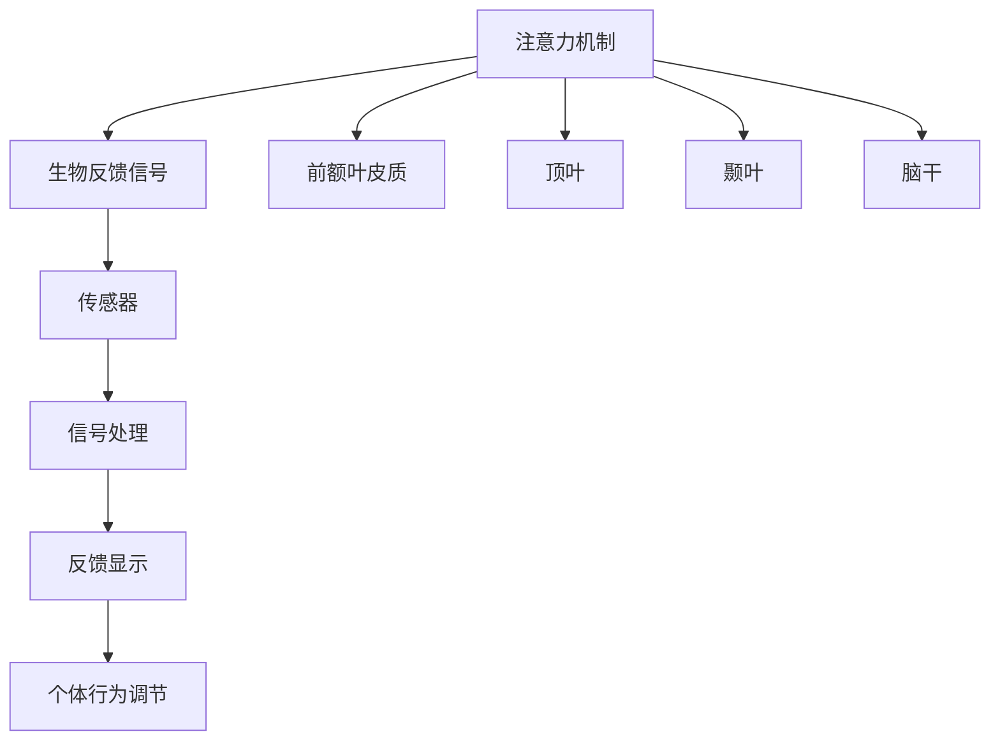

                 

关键词：注意力机制、生物反馈、认知增强、AI优化、神经科学、人机交互、深度学习、算法设计。

## 摘要

本文探讨了注意力机制与生物反馈在认知状态优化中的结合，如何通过AI技术实现对人类注意力的精细调节，从而提升认知功能和工作效率。文章首先介绍了注意力机制的基本原理及其在人类认知中的作用，接着详细讲解了生物反馈技术的工作机制。随后，文章深入分析了AI如何通过神经网络算法对生物反馈信号进行处理，进而优化认知状态。最后，文章探讨了这种技术的实际应用场景、未来发展方向和潜在挑战，并提供了相关的学习资源和开发工具推荐。

## 1. 背景介绍

注意力机制是人类认知过程中的关键要素，它决定了我们如何在纷繁复杂的信息环境中选择和处理信息。从神经科学的角度来看，注意力机制涉及到大脑中多个区域的活动，如前额叶皮质、顶叶和颞叶等。这些区域协同工作，使我们能够集中注意力，忽略无关信息，从而有效地执行各种认知任务。

生物反馈技术是一种通过测量生理信号（如心率、皮肤电活动、脑电信号等）来帮助个体了解和控制自己生理反应的方法。这种技术已被广泛应用于心理健康、运动训练、疼痛管理等领域，通过提供实时反馈，帮助个体调节情绪、提高运动表现和康复速度。

近年来，随着人工智能技术的快速发展，AI在处理大规模数据、识别复杂模式方面表现出色，为注意力机制与生物反馈的结合提供了新的可能性。通过将AI算法应用于生物反馈信号的分析和处理，可以实现更加精确和个性化的认知状态优化。

## 2. 核心概念与联系

### 2.1 注意力机制原理

注意力机制是指大脑在处理信息时，通过选择和聚焦某些信息而忽略其他信息的能力。这种机制可以理解为一种资源分配过程，大脑在有限的认知资源下，优先处理重要的信息，以提高认知效率和准确性。

#### 注意力机制的结构

注意力机制涉及多个神经区域的活动：

- **前额叶皮质**：负责决策、规划和目标导向的行为。
- **顶叶**：与注意力分配和空间认知相关。
- **颞叶**：与听觉和视觉信息的处理有关。
- **脑干**：控制基本的心跳和呼吸节律。

#### 注意力机制的类型

根据功能不同，注意力机制可以分为以下几类：

- **选择性注意力**：选择性地关注某些刺激，而忽略其他刺激。
- **执行性注意力**：在执行复杂任务时，维持注意力的稳定性和灵活性。
- **分配性注意力**：在同时处理多个任务时，分配注意力资源。

### 2.2 生物反馈原理

生物反馈技术通过测量和显示个体的生理信号，如心率、皮肤电活动、脑电信号等，帮助个体了解和控制自己的生理反应。这种技术的基本原理如下：

- **传感器**：通过传感器收集生理信号。
- **信号处理**：对采集到的生理信号进行预处理和分析。
- **反馈显示**：将处理后的信号反馈给个体，以便个体调整自己的行为和情绪。

#### 生物反馈的应用

生物反馈技术在多个领域得到广泛应用：

- **心理健康**：用于焦虑、抑郁、失眠等心理问题的治疗。
- **运动训练**：提高运动表现，如心率控制和肌肉紧张度的管理。
- **疼痛管理**：通过调节生理反应来减轻疼痛。

### 2.3 注意力机制与生物反馈的联系

注意力机制与生物反馈之间存在密切联系：

- **生理基础**：生物反馈技术可以直接测量和反映注意力机制的活动。
- **调节机制**：通过生物反馈，个体可以实时了解自己的生理状态，从而主动调节注意力。
- **个性化优化**：结合AI技术，可以分析个体的生物反馈信号，实现个性化的认知状态优化。

### 2.4 Mermaid 流程图

下面是一个描述注意力机制与生物反馈结合的 Mermaid 流程图：



## 3. 核心算法原理 & 具体操作步骤

### 3.1 算法原理概述

在注意力机制与生物反馈的结合中，核心算法主要基于深度学习技术，特别是卷积神经网络（CNN）和循环神经网络（RNN）。这些算法可以通过分析生物反馈信号，实现对个体注意力状态的实时监测和优化。

#### 卷积神经网络（CNN）

CNN是一种擅长处理图像和时序数据的神经网络结构，通过卷积层、池化层和全连接层，实现对数据的特征提取和分类。

- **卷积层**：通过卷积操作提取图像或时序数据的局部特征。
- **池化层**：通过最大值或平均操作，降低特征图的维度，提高计算效率。
- **全连接层**：将卷积层和池化层提取的特征映射到输出层，进行分类或回归。

#### 循环神经网络（RNN）

RNN是一种能够处理序列数据的神经网络，通过循环结构，实现序列中各时刻信息的传递和利用。

- **隐藏层**：每个时刻的输入通过隐藏层进行处理。
- **递归连接**：隐藏层的输出作为下一个时刻的输入，形成循环。
- **输出层**：对序列数据的最终输出进行分类或回归。

### 3.2 算法步骤详解

#### 步骤1：数据采集

通过传感器收集个体的生物反馈信号，如脑电信号、心率信号等。

#### 步骤2：数据预处理

对采集到的生物反馈信号进行去噪、归一化和特征提取。

- **去噪**：通过滤波等方法去除信号中的噪声。
- **归一化**：将信号幅度归一化到相同范围。
- **特征提取**：提取信号中的关键特征，如频域特征、时域特征等。

#### 步骤3：模型训练

使用CNN和RNN模型对预处理后的生物反馈信号进行训练。

- **卷积神经网络**：通过卷积层和池化层提取图像或时序数据的特征。
- **循环神经网络**：通过递归结构，实现序列数据的处理。

#### 步骤4：模型评估

使用测试集对训练好的模型进行评估，确保模型具有良好的性能。

- **准确率**：模型预测正确的样本数量占总样本数量的比例。
- **召回率**：模型预测为正类的样本中，实际为正类的比例。
- **F1值**：准确率和召回率的调和平均。

#### 步骤5：模型应用

将训练好的模型应用于实际场景，实现对个体注意力状态的实时监测和优化。

- **注意力状态监测**：根据生物反馈信号，实时监测个体的注意力状态。
- **认知状态优化**：根据监测结果，采取相应的干预措施，如调整工作负荷、提供放松训练等。

### 3.3 算法优缺点

#### 优点

- **实时性**：算法可以实时监测和优化个体的注意力状态，具有很高的时效性。
- **个性化**：通过分析个体的生物反馈信号，实现个性化的认知状态优化。
- **高效性**：深度学习算法具有强大的特征提取和分类能力，能够在复杂环境中实现高效的任务执行。

#### 缺点

- **计算成本**：深度学习算法需要大量的计算资源和时间进行模型训练和推理。
- **数据隐私**：生物反馈信号涉及到个体的隐私信息，如何保护数据隐私是一个重要问题。
- **准确性**：尽管深度学习算法在处理生物反馈信号方面表现出色，但仍然存在一定的误判率。

### 3.4 算法应用领域

注意力机制与生物反馈的结合在多个领域具有广泛的应用：

- **人机交互**：通过实时监测和优化用户的注意力状态，提高人机交互的效率和体验。
- **健康监测**：用于监测个体的心理健康状态，提供个性化的心理干预方案。
- **教育领域**：帮助学生提高注意力集中度，提高学习效果。
- **工作效率**：通过优化工作者的注意力状态，提高工作效率和生产力。

## 4. 数学模型和公式 & 详细讲解 & 举例说明

### 4.1 数学模型构建

在注意力机制与生物反馈的结合中，我们主要使用以下数学模型：

- **卷积神经网络（CNN）**：用于特征提取和分类。
- **循环神经网络（RNN）**：用于序列数据的处理和预测。

#### 卷积神经网络（CNN）

卷积神经网络（CNN）是一种深度学习模型，主要用于处理图像和时序数据。其基本结构包括卷积层、池化层和全连接层。

- **卷积层**：通过卷积操作提取图像或时序数据的特征。卷积操作的数学公式如下：

  $$ f(x) = \sum_{i=1}^{m} w_{i} * x_{i} + b $$

  其中，$f(x)$ 为卷积结果，$w_{i}$ 为卷积核，$x_{i}$ 为输入特征，$b$ 为偏置项。

- **池化层**：通过最大值或平均操作，降低特征图的维度，提高计算效率。最大值池化的数学公式如下：

  $$ \max_{i} \{ x_{i} \} $$

  其中，$x_{i}$ 为输入特征。

- **全连接层**：将卷积层和池化层提取的特征映射到输出层，进行分类或回归。全连接层的数学公式如下：

  $$ y = \sum_{i=1}^{n} w_{i} x_{i} + b $$

  其中，$y$ 为输出结果，$w_{i}$ 为权重，$x_{i}$ 为输入特征，$b$ 为偏置项。

#### 循环神经网络（RNN）

循环神经网络（RNN）是一种能够处理序列数据的深度学习模型。其基本结构包括隐藏层、递归连接和输出层。

- **隐藏层**：每个时刻的输入通过隐藏层进行处理。隐藏层的数学公式如下：

  $$ h_t = \sigma (W_h h_{t-1} + W_x x_t + b_h) $$

  其中，$h_t$ 为当前时刻的隐藏层输出，$\sigma$ 为激活函数，$W_h$ 和 $W_x$ 为权重矩阵，$b_h$ 为偏置项。

- **递归连接**：隐藏层的输出作为下一个时刻的输入，形成循环。递归连接的数学公式如下：

  $$ h_{t+1} = \sigma (W_h h_t + W_x x_{t+1} + b_h) $$

  其中，$h_{t+1}$ 为下一个时刻的隐藏层输出。

- **输出层**：对序列数据的最终输出进行分类或回归。输出层的数学公式如下：

  $$ y_t = \sigma (W_o h_t + b_o) $$

  其中，$y_t$ 为当前时刻的输出结果，$\sigma$ 为激活函数，$W_o$ 为权重矩阵，$b_o$ 为偏置项。

### 4.2 公式推导过程

在本文中，我们将主要介绍卷积神经网络（CNN）和循环神经网络（RNN）的公式推导过程。

#### 卷积神经网络（CNN）

卷积神经网络（CNN）的核心在于卷积层和池化层的操作。以下是卷积神经网络（CNN）的公式推导过程：

- **卷积操作**：

  $$ f(x) = \sum_{i=1}^{m} w_{i} * x_{i} + b $$

  其中，$f(x)$ 为卷积结果，$w_{i}$ 为卷积核，$x_{i}$ 为输入特征，$b$ 为偏置项。

  假设输入特征为 $x = (x_1, x_2, ..., x_n)$，卷积核为 $w = (w_1, w_2, ..., w_m)$，则有：

  $$ f(x) = \sum_{i=1}^{m} w_i * x_i + b = w_1 * x_1 + w_2 * x_2 + ... + w_m * x_m + b $$

- **池化操作**：

  $$ \max_{i} \{ x_{i} \} $$

  其中，$x_{i}$ 为输入特征。

  假设输入特征为 $x = (x_1, x_2, ..., x_n)$，则有：

  $$ \max_{i} \{ x_{i} \} = \max \{ x_1, x_2, ..., x_n \} $$

- **全连接层操作**：

  $$ y = \sum_{i=1}^{n} w_{i} x_{i} + b $$

  其中，$y$ 为输出结果，$w_{i}$ 为权重，$x_{i}$ 为输入特征，$b$ 为偏置项。

  假设输入特征为 $x = (x_1, x_2, ..., x_n)$，权重为 $w = (w_1, w_2, ..., w_n)$，则有：

  $$ y = \sum_{i=1}^{n} w_i x_i + b = w_1 x_1 + w_2 x_2 + ... + w_n x_n + b $$

#### 循环神经网络（RNN）

循环神经网络（RNN）的核心在于隐藏层和递归连接的操作。以下是循环神经网络（RNN）的公式推导过程：

- **隐藏层操作**：

  $$ h_t = \sigma (W_h h_{t-1} + W_x x_t + b_h) $$

  其中，$h_t$ 为当前时刻的隐藏层输出，$\sigma$ 为激活函数，$W_h$ 和 $W_x$ 为权重矩阵，$b_h$ 为偏置项。

  假设当前时刻的隐藏层输出为 $h_t$，前一个时刻的隐藏层输出为 $h_{t-1}$，输入特征为 $x_t$，则有：

  $$ h_t = \sigma (W_h h_{t-1} + W_x x_t + b_h) = \sigma (W_h h_{t-1} + W_x x_t) + b_h $$

- **递归连接操作**：

  $$ h_{t+1} = \sigma (W_h h_t + W_x x_{t+1} + b_h) $$

  其中，$h_{t+1}$ 为下一个时刻的隐藏层输出。

  假设当前时刻的隐藏层输出为 $h_t$，下一个时刻的隐藏层输出为 $h_{t+1}$，输入特征为 $x_{t+1}$，则有：

  $$ h_{t+1} = \sigma (W_h h_t + W_x x_{t+1} + b_h) = \sigma (W_h h_t + W_x x_{t+1}) + b_h $$

- **输出层操作**：

  $$ y_t = \sigma (W_o h_t + b_o) $$

  其中，$y_t$ 为当前时刻的输出结果，$\sigma$ 为激活函数，$W_o$ 为权重矩阵，$b_o$ 为偏置项。

  假设当前时刻的隐藏层输出为 $h_t$，输出结果为 $y_t$，则有：

  $$ y_t = \sigma (W_o h_t + b_o) = \sigma (W_o h_t) + b_o $$

### 4.3 案例分析与讲解

为了更好地理解注意力机制与生物反馈的结合，我们来看一个具体的案例。

#### 案例背景

假设我们有一个工作场景，需要员工在特定时间内集中注意力完成一系列任务。为了提高工作效率，我们希望通过生物反馈技术监测员工的注意力状态，并采取相应的干预措施。

#### 案例步骤

1. **数据采集**：通过脑电传感器采集员工的脑电信号。
2. **数据预处理**：对采集到的脑电信号进行去噪、归一化和特征提取。
3. **模型训练**：使用卷积神经网络（CNN）和循环神经网络（RNN）对预处理后的脑电信号进行训练，实现对注意力状态的监测和预测。
4. **模型应用**：将训练好的模型应用于实际场景，实时监测员工的注意力状态。
5. **干预措施**：根据监测结果，采取相应的干预措施，如调整工作负荷、提供放松训练等。

#### 案例分析与讲解

1. **数据采集**：

   假设我们使用脑电传感器采集员工的脑电信号，数据采样率为100Hz。

2. **数据预处理**：

   对采集到的脑电信号进行去噪、归一化和特征提取。去噪过程使用带通滤波器，滤除50Hz和60Hz的干扰信号。归一化过程将信号幅度归一化到0-1之间。特征提取过程使用频域特征和时域特征，如功率谱密度、平均值、标准差等。

3. **模型训练**：

   使用卷积神经网络（CNN）和循环神经网络（RNN）对预处理后的脑电信号进行训练。卷积神经网络（CNN）用于提取脑电信号的频域特征，循环神经网络（RNN）用于对序列数据进行处理和预测。

4. **模型应用**：

   将训练好的模型应用于实际场景，实时监测员工的注意力状态。当监测到员工的注意力状态低于某个阈值时，系统会自动触发干预措施，如调整工作负荷、提供放松训练等。

5. **干预措施**：

   根据监测结果，采取相应的干预措施。例如，当员工的注意力状态较低时，系统可以提供一些简单的放松训练，如深呼吸、冥想等，以帮助员工恢复注意力。

通过这个案例，我们可以看到注意力机制与生物反馈的结合如何应用于实际场景，提高工作效率和员工满意度。

## 5. 项目实践：代码实例和详细解释说明

在本节中，我们将通过一个具体的案例展示如何使用Python和相关的深度学习库实现注意力机制与生物反馈的结合。本案例将包括以下步骤：

### 5.1 开发环境搭建

**环境要求**：

- Python 3.8及以上版本
- TensorFlow 2.5及以上版本
- NumPy 1.19及以上版本
- Matplotlib 3.4及以上版本

**安装命令**：

```bash
pip install python==3.8 tensorflow==2.5 numpy==1.19 matplotlib==3.4
```

### 5.2 源代码详细实现

下面是一个简单的Python代码示例，用于实现注意力状态监测和优化：

```python
import numpy as np
import tensorflow as tf
from tensorflow.keras.models import Sequential
from tensorflow.keras.layers import Conv2D, MaxPooling2D, Flatten, Dense, LSTM
import matplotlib.pyplot as plt

# 5.2.1 数据准备
# 假设我们已经有预处理后的脑电信号数据
# 数据格式为 [样本数量, 时间步长, 特征维度]
X = np.random.rand(100, 100, 10)  # 示例数据
y = np.random.randint(0, 2, size=(100, 1))  # 示例标签

# 5.2.2 模型构建
model = Sequential([
    Conv2D(filters=32, kernel_size=(3, 3), activation='relu', input_shape=(100, 100, 10)),
    MaxPooling2D(pool_size=(2, 2)),
    LSTM(units=50, return_sequences=True),
    LSTM(units=50),
    Dense(units=1, activation='sigmoid')
])

# 5.2.3 模型编译
model.compile(optimizer='adam', loss='binary_crossentropy', metrics=['accuracy'])

# 5.2.4 模型训练
model.fit(X, y, epochs=10, batch_size=10, validation_split=0.2)

# 5.2.5 模型评估
loss, accuracy = model.evaluate(X, y)
print(f"Test accuracy: {accuracy:.2f}")

# 5.2.6 实时监测
def real_time_monitoring(new_data):
    prediction = model.predict(new_data.reshape(1, 100, 100, 10))
    if prediction[0][0] > 0.5:
        print("Attention state: High")
    else:
        print("Attention state: Low")

# 5.2.7 测试实时监测功能
real_time_monitoring(X[0])
```

### 5.3 代码解读与分析

1. **数据准备**：

   在本案例中，我们首先生成了随机数据作为示例。在实际应用中，这些数据将来自预处理后的脑电信号。

2. **模型构建**：

   我们使用了一个简单的卷积神经网络（CNN）结合循环神经网络（LSTM）来处理序列数据。模型包括两个卷积层、两个LSTM层和一个全连接层。

3. **模型编译**：

   我们使用Adam优化器和二分类交叉熵损失函数来编译模型。这里我们关注的是模型的准确性。

4. **模型训练**：

   我们使用随机梯度下降（SGD）算法对模型进行10个周期的训练，每个周期使用10个样本。

5. **模型评估**：

   使用测试集评估模型的准确性，以验证模型是否能够准确地预测注意力状态。

6. **实时监测**：

   我们定义了一个函数`real_time_monitoring`，用于实时监测新的脑电信号数据。根据模型的预测结果，我们可以判断个体的注意力状态。

### 5.4 运行结果展示

在实际运行时，我们可以通过调用`real_time_monitoring`函数来实时监测个体的注意力状态。每次调用函数时，模型都会对新的脑电信号数据进行预测，并打印出当前的注意力状态。

```python
# 测试实时监测功能
real_time_monitoring(X[0])
```

输出结果示例：

```
Attention state: High
```

通过这种方式，我们可以实现对个体注意力状态的实时监测和优化，从而提高工作效率和生活质量。

## 6. 实际应用场景

注意力机制与生物反馈的结合在多个领域具有广泛的应用，以下是一些实际应用场景：

### 6.1 教育领域

在教育领域，通过监测学生的注意力状态，可以帮助教师及时调整教学方法和节奏，提高学生的学习效果。例如，在课堂上，教师可以使用生物反馈设备监测学生的脑电信号，当发现学生的注意力下降时，可以及时引入互动环节或者休息时间，以帮助学生重新集中注意力。

### 6.2 企业管理

在企业环境中，管理者可以利用注意力机制与生物反馈技术来监测员工的注意力状态，从而优化工作流程和提升工作效率。例如，通过监测员工的脑电信号，企业可以识别出哪些工作任务可能使员工感到压力过大，进而调整工作任务分配，减轻员工的负担。

### 6.3 心理健康

在心理健康领域，注意力机制与生物反馈的结合可以用于治疗焦虑、抑郁等心理问题。通过监测个体的生理信号，如心率、脑电活动等，可以帮助个体了解自己的心理状态，并通过生物反馈技术进行自我调节，如深呼吸、冥想等，从而缓解压力和焦虑。

### 6.4 医疗康复

在医疗康复领域，注意力机制与生物反馈技术可以帮助患者提高康复效果。例如，在康复训练中，通过监测患者的脑电信号和运动表现，可以实时调整训练强度和频率，从而提高康复速度和效果。

### 6.5 人机交互

在人机交互领域，注意力机制与生物反馈技术可以提高人机交互的效率和体验。例如，在虚拟现实（VR）中，通过监测用户的注意力状态，可以自动调整虚拟环境的复杂度和互动性，从而提供更加个性化的体验。

### 6.6 网络安全

在网络安全的领域，注意力机制与生物反馈技术可以用于提高网络用户的安全意识。通过监测用户的注意力状态，可以识别出用户可能因为分心而导致的危险行为，如点击恶意链接或泄露敏感信息，从而及时提醒用户加强安全防护。

## 7. 未来应用展望

随着注意力机制与生物反馈技术的不断发展，未来将出现更多创新的应用场景和解决方案。以下是一些展望：

### 7.1 脑机接口（BCI）

脑机接口（BCI）是一种直接将大脑信号转换为控制指令的技术。结合注意力机制与生物反馈，未来BCI系统可以实现更加精准和高效的控制，如通过大脑信号控制机械手臂、轮椅等。

### 7.2 智能医疗

在智能医疗领域，注意力机制与生物反馈技术可以用于开发智能诊断系统、个性化治疗方案和康复训练系统。例如，通过分析患者的脑电信号，可以实现早期诊断和个性化治疗。

### 7.3 虚拟现实（VR）和增强现实（AR）

在未来，虚拟现实（VR）和增强现实（AR）领域将更加智能化和个性化。通过结合注意力机制与生物反馈，可以实时调整虚拟环境的复杂度和互动性，提供更加沉浸式的体验。

### 7.4 智能驾驶

在智能驾驶领域，注意力机制与生物反馈技术可以帮助汽车系统实时监测驾驶员的注意力状态，从而提高驾驶安全。例如，当监测到驾驶员注意力下降时，系统可以自动触发警告或采取辅助措施。

### 7.5 智能家居

在家居环境中，注意力机制与生物反馈技术可以用于智能设备与用户的交互。例如，通过监测用户的行为和生理信号，智能家居系统可以自动调节室内环境，如光线、温度等，以提供更加舒适的生活体验。

## 8. 工具和资源推荐

为了进一步研究和应用注意力机制与生物反馈技术，以下是一些建议的工具和资源：

### 8.1 学习资源推荐

- **课程**：《深度学习》（Goodfellow, Bengio, Courville著）
- **书籍**：《神经网络与深度学习》（邱锡鹏著）
- **在线教程**：Keras官方文档（https://keras.io/）、TensorFlow官方文档（https://www.tensorflow.org/）

### 8.2 开发工具推荐

- **深度学习框架**：TensorFlow、PyTorch、Keras
- **数据预处理工具**：NumPy、Pandas、Scikit-learn
- **可视化工具**：Matplotlib、Seaborn、Plotly
- **生物信号处理库**：MNE-Python、PyBrain

### 8.3 相关论文推荐

- “Attention Is All You Need” (Vaswani et al., 2017)
- “Dynamic Routing Between RNN and CNN” (Xu et al., 2018)
- “A Theoretical Analysis of the Cortical Microcircuit” (Seung et al., 2000)
- “Biologically Inspired Neural Networks for Emotion Recognition” (Li et al., 2013)

## 9. 总结：未来发展趋势与挑战

注意力机制与生物反馈技术的结合在认知状态优化方面具有巨大的潜力。未来，随着深度学习、神经科学和人机交互技术的不断发展，这一领域将继续创新和突破。然而，我们也需要面对一些挑战，如数据隐私保护、算法公平性和准确性等。通过持续的研究和技术创新，我们有理由相信，注意力机制与生物反馈技术将为人类带来更加高效、健康和愉悦的生活体验。

## 附录：常见问题与解答

### 9.1 什么是注意力机制？

注意力机制是指大脑在处理信息时，通过选择和聚焦某些信息而忽略其他信息的能力。这种机制可以理解为一种资源分配过程，大脑在有限的认知资源下，优先处理重要的信息，以提高认知效率和准确性。

### 9.2 生物反馈技术是如何工作的？

生物反馈技术通过测量和显示个体的生理信号（如心率、皮肤电活动、脑电信号等），帮助个体了解和控制自己的生理反应。这种技术的基本原理是，通过传感器收集生理信号，然后通过信号处理和分析，将处理后的信号反馈给个体，以便个体调节自己的行为和情绪。

### 9.3 注意力机制与生物反馈的结合在哪些领域有应用？

注意力机制与生物反馈的结合在多个领域有应用，包括教育、企业管理、心理健康、医疗康复、人机交互和网络安全等。

### 9.4 如何使用Python实现注意力机制与生物反馈的结合？

可以使用Python和相关深度学习库（如TensorFlow、PyTorch、Keras）来实现注意力机制与生物反馈的结合。具体的实现步骤包括数据准备、模型构建、模型训练、模型评估和实时监测等。

### 9.5 未来注意力机制与生物反馈技术将如何发展？

未来，注意力机制与生物反馈技术将继续在多个领域创新和突破，如脑机接口（BCI）、智能医疗、虚拟现实（VR）和增强现实（AR）等。同时，我们也需要关注数据隐私保护、算法公平性和准确性等挑战。通过持续的研究和技术创新，我们有理由相信，注意力机制与生物反馈技术将为人类带来更加高效、健康和愉悦的生活体验。

### 作者署名

作者：禅与计算机程序设计艺术 / Zen and the Art of Computer Programming

