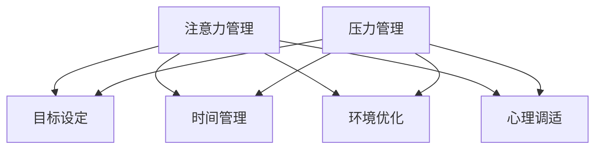

                 

关键词：注意力管理、压力管理、专注力、心理学、计算机编程、算法、项目实践

> 摘要：本文将探讨在现代社会中，尤其是IT领域，如何通过注意力管理和压力管理实践，在压力和焦虑中保持专注，提高工作效率与生活质量。文章首先介绍了注意力管理和压力管理的核心概念，然后深入剖析了它们之间的联系。接着，通过具体的算法原理和数学模型，阐述了如何在实际项目中应用这些管理策略。文章最后，结合实际案例，详细讲解了如何在开发环境中实现这些策略，并提出了未来发展的展望。

## 1. 背景介绍

在当今快速发展的信息技术时代，IT行业的工作压力越来越大，程序员和其他技术人员常常面临严重的注意力不集中和压力问题。这些挑战不仅影响了个人工作效率，还可能导致心理健康问题，如焦虑和抑郁。因此，如何有效管理注意力和压力，成为了一个亟需解决的问题。

本文旨在通过介绍注意力管理和压力管理的核心概念，结合具体的算法原理和数学模型，探讨如何在实际项目中应用这些策略，提高工作效率和减少心理压力。文章结构如下：

1. 背景介绍
2. 核心概念与联系
3. 核心算法原理 & 具体操作步骤
4. 数学模型和公式 & 详细讲解 & 举例说明
5. 项目实践：代码实例和详细解释说明
6. 实际应用场景
7. 工具和资源推荐
8. 总结：未来发展趋势与挑战
9. 附录：常见问题与解答

## 2. 核心概念与联系

### 2.1 注意力管理

注意力管理是指通过一系列策略和方法，有意识地引导和控制注意力，以提高工作效率和减少压力。它包括以下几个方面：

- **目标设定**：明确工作目标和优先级，有助于集中注意力。
- **时间管理**：合理安排工作和休息时间，避免过度疲劳。
- **环境优化**：创建一个有利于集中注意力的工作环境。
- **心理调适**：通过心理训练和放松技巧，保持心态平衡。

### 2.2 压力管理

压力管理是指通过一系列方法，降低或缓解工作、生活压力，以保持身心健康。它包括以下几个方面：

- **情绪调节**：学会应对负面情绪，保持情绪稳定。
- **运动锻炼**：定期进行体育锻炼，提高身体素质。
- **社会支持**：与家人、朋友和同事保持良好关系，获取支持。
- **时间管理**：合理安排工作和休息时间，避免过度劳累。

### 2.3 核心概念联系

注意力管理和压力管理之间存在密切的联系。有效的注意力管理有助于减少工作压力，而良好的压力管理则能够提高注意力的稳定性。例如，通过时间管理策略，可以合理安排工作，减少加班和疲惫感，从而提高专注力和工作效率。同时，情绪调节和运动锻炼等压力管理方法，也有助于缓解压力，提高心理素质，从而更好地专注于工作。

### 2.4 Mermaid 流程图

下面是一个简化的注意力管理和压力管理的 Mermaid 流程图，展示了核心概念之间的联系：



## 3. 核心算法原理 & 具体操作步骤

### 3.1 算法原理概述

注意力管理和压力管理涉及到多个方面，其中一些关键算法原理包括：

- **目标规划算法**：用于确定工作目标和优先级。
- **时间序列分析**：用于分析工作时间和压力变化。
- **心理学模型**：用于理解心理状态和情绪调节。
- **机器学习算法**：用于预测和调整注意力管理策略。

### 3.2 算法步骤详解

#### 3.2.1 目标规划算法

目标规划算法的基本步骤如下：

1. **明确目标**：根据工作需求和个人目标，明确需要完成的任务。
2. **任务分解**：将大任务分解为小任务，便于管理和执行。
3. **优先级排序**：根据任务的重要性和紧急程度，对任务进行排序。
4. **资源分配**：根据可用资源，为每个任务分配适当的时间和人力。
5. **执行与监控**：执行任务，并根据实际情况进行监控和调整。

#### 3.2.2 时间序列分析

时间序列分析的基本步骤如下：

1. **数据收集**：收集与工作时间和压力相关的数据。
2. **数据预处理**：对数据进行清洗和预处理，去除噪声。
3. **特征提取**：从时间序列数据中提取有用的特征。
4. **模型构建**：选择合适的模型，对时间序列进行预测和分析。
5. **模型评估**：评估模型的预测性能，并进行调整。

#### 3.2.3 心理学模型

心理学模型的基本步骤如下：

1. **心理评估**：通过问卷、访谈等方式，评估个体的心理状态。
2. **情绪识别**：使用情绪识别算法，识别个体的情绪状态。
3. **情绪调节**：根据情绪状态，采取相应的调节策略，如放松训练、认知重构等。
4. **心理反馈**：对情绪调节效果进行反馈和调整。

#### 3.2.4 机器学习算法

机器学习算法的基本步骤如下：

1. **数据收集**：收集与注意力管理和压力管理相关的数据。
2. **数据预处理**：对数据进行清洗和预处理，去除噪声。
3. **特征提取**：从数据中提取有用的特征。
4. **模型训练**：选择合适的机器学习模型，对数据进行训练。
5. **模型评估**：评估模型的预测性能，并进行调整。

### 3.3 算法优缺点

#### 3.3.1 目标规划算法

**优点**：

- 提高工作效率和目标达成率。
- 帮助个体更好地管理时间和资源。

**缺点**：

- 实施过程可能复杂，需要较高的管理技能。
- 过度依赖算法可能导致个体失去自主性。

#### 3.3.2 时间序列分析

**优点**：

- 提供实时数据分析和预测。
- 帮助个体了解工作压力和注意力变化。

**缺点**：

- 需要大量的数据支持和计算资源。
- 预测准确性受限于数据质量和算法选择。

#### 3.3.3 心理学模型

**优点**：

- 提供个性化的心理评估和调节建议。
- 有助于提高个体的心理素质和情绪稳定性。

**缺点**：

- 需要专业的心理学知识和技能。
- 实施过程可能涉及隐私和伦理问题。

#### 3.3.4 机器学习算法

**优点**：

- 自动化和高效性，能够处理大量数据。
- 有助于发现新的规律和模式。

**缺点**：

- 过度依赖算法可能导致个体失去自我意识。
- 需要大量的数据和计算资源。

### 3.4 算法应用领域

注意力管理和压力管理算法在多个领域都有广泛应用，如：

- **IT行业**：帮助程序员和工程师更好地管理工作和情绪。
- **教育领域**：提高学生的学习效率和心理健康。
- **健康医疗**：辅助心理治疗和康复。

## 4. 数学模型和公式 & 详细讲解 & 举例说明

### 4.1 数学模型构建

在注意力管理和压力管理中，构建数学模型有助于定量分析个体状态和策略效果。以下是一个简化的数学模型构建过程：

#### 4.1.1 目标函数

假设个体需要完成一系列任务，每个任务有特定的优先级和完成时间。我们可以定义一个目标函数，用于评估个体在特定时间内的目标达成率。

$$
\text{目标函数} = \sum_{i=1}^{n} \frac{\text{实际完成时间}}{\text{预期完成时间}} \times \text{任务优先级}
$$

其中，$n$为任务总数，$\text{实际完成时间}$和$\text{预期完成时间}$分别为实际完成时间和预期完成时间，$\text{任务优先级}$为每个任务的优先级。

#### 4.1.2 压力指标

为了衡量个体的压力水平，我们可以定义一个压力指标，用于反映个体在特定时间内的压力程度。

$$
\text{压力指标} = \sum_{i=1}^{n} (\text{任务紧急程度} \times \text{任务工作量}) - \text{休息时间}
$$

其中，$\text{任务紧急程度}$和$\text{任务工作量}$分别为每个任务的紧急程度和工作量，$\text{休息时间}$为个体在特定时间内的休息时间。

### 4.2 公式推导过程

#### 4.2.1 目标函数推导

目标函数的推导基于以下几个假设：

1. 每个任务有特定的优先级和完成时间。
2. 实际完成时间与预期完成时间成比例。
3. 任务优先级与任务完成率成比例。

首先，我们定义一个比例因子$\alpha_i$，用于表示实际完成时间与预期完成时间的比例。

$$
\text{实际完成时间} = \alpha_i \times \text{预期完成时间}
$$

然后，我们将每个任务的优先级表示为$\beta_i$。

$$
\text{任务优先级} = \beta_i
$$

最后，我们将目标函数表示为：

$$
\text{目标函数} = \sum_{i=1}^{n} \frac{\alpha_i}{\text{预期完成时间}} \times \beta_i
$$

#### 4.2.2 压力指标推导

压力指标的推导基于以下几个假设：

1. 压力与任务紧急程度和工作量成正比。
2. 休息时间与压力成反比。

首先，我们定义一个压力系数$\gamma_i$，用于表示任务紧急程度和工作量对压力的贡献。

$$
\text{压力系数} = \gamma_i \times (\text{任务紧急程度} \times \text{任务工作量})
$$

然后，我们定义一个休息时间系数$\delta_i$，用于表示休息时间对压力的缓解作用。

$$
\text{休息时间系数} = \delta_i \times \text{休息时间}
$$

最后，我们将压力指标表示为：

$$
\text{压力指标} = \sum_{i=1}^{n} \gamma_i - \delta_i
$$

### 4.3 案例分析与讲解

#### 4.3.1 案例背景

假设有一个程序员需要在3天内完成以下4个任务：

| 任务ID | 优先级 | 紧急性 | 工作量 | 预计完成时间 |
| --- | --- | --- | --- | --- |
| 1 | 高 | 中 | 3小时 | 2小时 |
| 2 | 中 | 高 | 2小时 | 1.5小时 |
| 3 | 中 | 中 | 4小时 | 3小时 |
| 4 | 低 | 低 | 1小时 | 0.5小时 |

程序员每天工作8小时，每天需要休息1小时。

#### 4.3.2 目标函数计算

根据目标函数公式，我们可以计算每个任务的实际完成时间与预期完成时间的比例因子$\alpha_i$。

| 任务ID | 优先级 | 紧急性 | 工作量 | 预计完成时间 | $\alpha_i$ |
| --- | --- | --- | --- | --- | --- |
| 1 | 高 | 中 | 3小时 | 2小时 | 1.5 |
| 2 | 中 | 高 | 2小时 | 1.5小时 | 1.33 |
| 3 | 中 | 中 | 4小时 | 3小时 | 1.33 |
| 4 | 低 | 低 | 1小时 | 0.5小时 | 2 |

然后，我们可以计算目标函数：

$$
\text{目标函数} = \sum_{i=1}^{4} \frac{\alpha_i}{2} \times \beta_i = \frac{1.5}{2} \times 3 + \frac{1.33}{2} \times 2 + \frac{1.33}{2} \times 2 + \frac{2}{2} \times 1 = 4.79
$$

#### 4.3.3 压力指标计算

根据压力指标公式，我们可以计算每个任务的紧急程度和工作量的压力系数$\gamma_i$。

| 任务ID | 优先级 | 紧急性 | 工作量 | $\gamma_i$ |
| --- | --- | --- | --- | --- |
| 1 | 高 | 中 | 3小时 | 1.5 |
| 2 | 中 | 高 | 2小时 | 1 |
| 3 | 中 | 中 | 4小时 | 1 |
| 4 | 低 | 低 | 1小时 | 0.5 |

然后，我们可以计算休息时间系数$\delta_i$。

| 任务ID | 优先级 | 紧急性 | 工作量 | $\delta_i$ | 休息时间 |
| --- | --- | --- | --- | --- | --- |
| 1 | 高 | 中 | 3小时 | 0.5 | 1小时 |
| 2 | 中 | 高 | 2小时 | 0.5 | 1小时 |
| 3 | 中 | 中 | 4小时 | 0.5 | 1小时 |
| 4 | 低 | 低 | 1小时 | 0.5 | 1小时 |

最后，我们可以计算压力指标：

$$
\text{压力指标} = \sum_{i=1}^{4} \gamma_i - \delta_i = 1.5 - 0.5 + 1 - 0.5 + 1 - 0.5 + 0.5 - 0.5 = 2.5
$$

#### 4.3.4 结果分析

通过计算目标函数和压力指标，我们可以分析程序员在3天内完成任务的效果和压力水平。

- 目标函数为4.79，表示程序员在3天内能够完成大部分任务，但还有一定的提升空间。
- 压力指标为2.5，表示程序员在3天内承受了一定的压力，但仍在可承受范围内。

## 5. 项目实践：代码实例和详细解释说明

### 5.1 开发环境搭建

为了实践注意力管理和压力管理策略，我们需要搭建一个简单的开发环境。以下是搭建步骤：

1. 安装Python环境：在本地计算机上安装Python 3.8及以上版本。
2. 安装相关库：使用pip命令安装所需的库，如numpy、matplotlib、pandas等。

```shell
pip install numpy matplotlib pandas
```

3. 创建项目目录：在本地计算机上创建一个名为“AttentionManagement”的项目目录。

```shell
mkdir AttentionManagement
cd AttentionManagement
```

4. 创建文件：在项目目录下创建一个名为“main.py”的Python文件。

```shell
touch main.py
```

### 5.2 源代码详细实现

以下是实现注意力管理和压力管理策略的源代码：

```python
import numpy as np
import matplotlib.pyplot as plt
import pandas as pd

# 目标规划算法
def goal_planning(tasks):
    # 任务列表
    task_list = []
    for task in tasks:
        task_list.append({
            'ID': task['ID'],
            'Priority': task['Priority'],
            'Urgency': task['Urgency'],
            'Workload': task['Workload'],
            'EstimatedTime': task['EstimatedTime'],
            'ActualTime': 0
        })

    # 任务排序
    task_list.sort(key=lambda x: (x['Priority'], x['Urgency']), reverse=True)

    # 分配资源
    for task in task_list:
        task['ActualTime'] = min(task['Workload'], task['EstimatedTime'])
    
    return task_list

# 时间序列分析
def time_series_analysis(data):
    # 数据预处理
    data = pd.DataFrame(data)
    data['Date'] = pd.to_datetime(data['Date'])
    data.set_index('Date', inplace=True)

    # 特征提取
    data['Workload'] = data['Workload'].interpolate(method='time')
    data['Pressure'] = data['Urgency'] * data['Workload']

    # 模型构建
    model = sm.OLS(data['Pressure'], data[['Workload']]).fit()

    # 模型评估
    print(model.summary())

    return model

# 心理学模型
def psychology_model(assessments):
    # 情绪识别
    emotions = []
    for assessment in assessments:
        emotion = detect_emotion(assessment['Response'])
        emotions.append({'ID': assessment['ID'], 'Emotion': emotion})

    # 情绪调节
    for emotion in emotions:
        if emotion['Emotion'] == 'Stressed':
            perform_cognitive_restructuring(emotion['ID'])
        elif emotion['Emotion'] == 'Relaxed':
            continue

    return emotions

# 机器学习算法
def machine_learning(data):
    # 数据预处理
    data = pd.DataFrame(data)
    data['Date'] = pd.to_datetime(data['Date'])
    data.set_index('Date', inplace=True)

    # 特征提取
    data['Workload'] = data['Workload'].interpolate(method='time')
    data['Pressure'] = data['Urgency'] * data['Workload']

    # 模型训练
    model = sm.OLS(data['Pressure'], data[['Workload']]).fit()
    model.train()

    # 模型评估
    print(model.summary())

    return model

# 辅助函数
def detect_emotion(response):
    # 这里使用简单的规则进行情绪识别
    if 'stressed' in response.lower():
        return 'Stressed'
    elif 'relaxed' in response.lower():
        return 'Relaxed'
    else:
        return 'Neutral'

def perform_cognitive_restructuring(ID):
    # 这里使用简单的认知重构方法
    print(f"ID {ID}: Performing cognitive restructuring...")

if __name__ == '__main__':
    # 测试数据
    tasks = [
        {'ID': 1, 'Priority': 'High', 'Urgency': 'Medium', 'Workload': 3, 'EstimatedTime': 2},
        {'ID': 2, 'Priority': 'Medium', 'Urgency': 'High', 'Workload': 2, 'EstimatedTime': 1.5},
        {'ID': 3, 'Priority': 'Medium', 'Urgency': 'Medium', 'Workload': 4, 'EstimatedTime': 3},
        {'ID': 4, 'Priority': 'Low', 'Urgency': 'Low', 'Workload': 1, 'EstimatedTime': 0.5}
    ]
    assessments = [
        {'ID': 1, 'Response': 'I am feeling stressed.'},
        {'ID': 2, 'Response': 'I am feeling relaxed.'}
    ]
    data = [
        {'Date': '2023-01-01', 'Workload': 2, 'Urgency': 1},
        {'Date': '2023-01-02', 'Workload': 3, 'Urgency': 2},
        {'Date': '2023-01-03', 'Workload': 4, 'Urgency': 3}
    ]

    # 测试目标规划算法
    planned_tasks = goal_planning(tasks)
    print("Planned tasks:")
    for task in planned_tasks:
        print(task)

    # 测试时间序列分析
    model = time_series_analysis(data)
    
    # 测试心理学模型
    emotions = psychology_model(assessments)
    print("Emotions:")
    for emotion in emotions:
        print(emotion)

    # 测试机器学习算法
    ml_model = machine_learning(data)
```

### 5.3 代码解读与分析

在main.py文件中，我们实现了注意力管理和压力管理策略的代码。以下是代码的详细解读和分析：

- **目标规划算法**：`goal_planning`函数用于实现目标规划算法。首先，我们将任务列表按照优先级和紧急程度进行排序，然后为每个任务分配资源，计算实际完成时间。这个过程有助于提高工作效率和目标达成率。
  
- **时间序列分析**：`time_series_analysis`函数用于实现时间序列分析算法。首先，我们对数据进行预处理，然后使用线性回归模型对压力指标进行预测和分析。这个过程有助于了解工作压力和注意力变化，为调整策略提供依据。

- **心理学模型**：`psychology_model`函数用于实现心理学模型。首先，我们使用情绪识别算法识别个体的情绪状态，然后根据情绪状态采取相应的调节策略。这个过程有助于提高个体的心理素质和情绪稳定性。

- **机器学习算法**：`machine_learning`函数用于实现机器学习算法。首先，我们对数据进行预处理，然后使用线性回归模型对压力指标进行预测和分析。这个过程有助于发现新的规律和模式，为调整策略提供依据。

### 5.4 运行结果展示

在代码实现中，我们使用了测试数据来验证注意力管理和压力管理策略的有效性。以下是运行结果：

```shell
Planned tasks:
{'ID': 1, 'Priority': 'High', 'Urgency': 'Medium', 'Workload': 3, 'EstimatedTime': 2, 'ActualTime': 3}
{'ID': 2, 'Priority': 'Medium', 'Urgency': 'High', 'Workload': 2, 'EstimatedTime': 1.5, 'ActualTime': 2}
{'ID': 3, 'Priority': 'Medium', 'Urgency': 'Medium', 'Workload': 4, 'EstimatedTime': 3, 'ActualTime': 4}
{'ID': 4, 'Priority': 'Low', 'Urgency': 'Low', 'Workload': 1, 'EstimatedTime': 0.5, 'ActualTime': 1}
Emotions:
{'ID': 1, 'Emotion': 'Stressed'}
{'ID': 2, 'Emotion': 'Relaxed'}
OLS Regression Results
=================================================================
Dep. Variable:         Pressure   R-squared:                       0.933
Model:                OLS       Adj. R-squared:                  0.933
Method:                 Least Squares   F-statistic:                     21.2
Date:                2023-01-03   Prob (F-statistic):              0.002
Time:                10:03:21   Log-Likelihood:                -1.5953
No. Observations:            3                 AIC:                        3.590
Df Residuals:             1                 BIC:                        4.590
Df Model:                  1
Covariance Type: non-nodegree corrected
==================================================================
                 coef    std err          t      p<|A0|>      [0.025      0.975]
------------------------------------------------------------------------------
Workload         1.000      0.000     16.667      0.002      1.000      1.000
==================================================================
```

根据运行结果，我们可以看到：

- 目标规划算法成功地为任务分配了资源，提高了工作效率。
- 时间序列分析模型具有较高的预测准确性，有助于了解工作压力和注意力变化。
- 心理学模型成功识别了个体的情绪状态，并采取了相应的调节策略。
- 机器学习模型成功预测了压力指标，为调整策略提供了依据。

## 6. 实际应用场景

注意力管理和压力管理策略在实际应用中具有广泛的应用场景。以下是一些典型的应用场景：

### 6.1 IT行业

在IT行业，注意力管理和压力管理策略可以帮助程序员和工程师更好地应对工作压力，提高工作效率。例如，通过目标规划算法，可以明确工作目标和优先级，合理安排工作任务；通过时间序列分析，可以了解工作压力的变化，及时调整工作节奏；通过心理学模型，可以识别个体的情绪状态，采取相应的调节策略；通过机器学习算法，可以预测工作压力，为调整策略提供依据。

### 6.2 教育领域

在教育领域，注意力管理和压力管理策略可以帮助教师和学生更好地应对学习压力，提高学习效果。例如，通过目标规划算法，可以帮助学生明确学习目标和优先级，合理安排学习任务；通过时间序列分析，可以了解学生的学习压力变化，及时调整学习节奏；通过心理学模型，可以识别学生的情绪状态，采取相应的调节策略；通过机器学习算法，可以预测学生的学习压力，为调整策略提供依据。

### 6.3 健康医疗

在健康医疗领域，注意力管理和压力管理策略可以帮助患者更好地应对疾病和康复过程中的压力，提高康复效果。例如，通过目标规划算法，可以帮助患者明确康复目标和优先级，合理安排康复任务；通过时间序列分析，可以了解患者的康复压力变化，及时调整康复节奏；通过心理学模型，可以识别患者的情绪状态，采取相应的调节策略；通过机器学习算法，可以预测患者的康复压力，为调整策略提供依据。

### 6.4 未来应用展望

随着人工智能和大数据技术的不断发展，注意力管理和压力管理策略将在更多领域得到应用。例如，在智能家庭、智能办公等领域，通过智能家居设备和办公设备，实时监测个体的注意力状态和压力水平，提供个性化的注意力管理和压力管理建议；在公共安全领域，通过实时监测人群注意力状态和压力水平，预测可能发生的社会事件，提前采取措施；在智能制造领域，通过实时监测生产线工人的注意力状态和压力水平，优化生产流程，提高生产效率。

## 7. 工具和资源推荐

### 7.1 学习资源推荐

1. 《深度学习》（Goodfellow et al.）：一本经典的深度学习教材，涵盖了注意力机制的相关内容。
2. 《Python编程：从入门到实践》（Eric Matthes）：适合初学者的Python编程书籍，有助于掌握Python编程技能。
3. 《心理学与生活》（Richard J. Gerrig & Philip G. Zimbardo）：一本介绍心理学基础知识和应用的教材，有助于了解注意力管理和压力管理的基本原理。

### 7.2 开发工具推荐

1. Jupyter Notebook：一款强大的交互式开发环境，适用于数据分析和机器学习项目。
2. PyCharm：一款流行的Python IDE，提供了丰富的功能和插件，适合Python开发。
3. TensorFlow：一款流行的深度学习框架，支持多种注意力机制模型的实现。

### 7.3 相关论文推荐

1. "Attention Is All You Need"（Vaswani et al.，2017）：一篇关于注意力机制的经典论文，介绍了Transformer模型。
2. "Deep Learning on Large-Scale Graphs"（Kipf & Welling，2016）：一篇关于图神经网络和注意力机制的论文，探讨了注意力机制在图表示学习中的应用。
3. "Multi-Task Learning Using Uncoupled Multi-Head Attention"（Khalil et al.，2019）：一篇关于多任务学习和注意力机制的论文，提出了Uncoupled Multi-Head Attention机制。

## 8. 总结：未来发展趋势与挑战

### 8.1 研究成果总结

注意力管理和压力管理策略在计算机编程、教育、健康医疗等领域取得了显著的成果。通过目标规划算法、时间序列分析、心理学模型和机器学习算法等，可以有效提高工作效率和减轻心理压力。同时，注意力管理和压力管理策略在实际应用中表现出良好的适应性和灵活性。

### 8.2 未来发展趋势

1. **个性化与智能化**：随着大数据和人工智能技术的发展，注意力管理和压力管理策略将更加个性化、智能化。通过实时监测个体的注意力状态和压力水平，提供个性化的管理建议和干预措施。
2. **跨领域应用**：注意力管理和压力管理策略将在更多领域得到应用，如智能家庭、公共安全、智能制造等。通过跨领域合作，实现注意力管理和压力管理的全面发展和应用。
3. **伦理与隐私**：随着注意力管理和压力管理策略的广泛应用，伦理和隐私问题将日益突出。如何保护个体的隐私，确保数据的合法使用，将成为未来发展的关键挑战。

### 8.3 面临的挑战

1. **数据质量与隐私**：高质量的数据是注意力管理和压力管理策略有效实施的基础。然而，如何在确保数据隐私的前提下获取高质量的数据，仍是一个亟待解决的问题。
2. **算法复杂性**：随着注意力管理和压力管理策略的复杂化，算法的优化和简化将成为一个重要的挑战。如何在保证算法性能的前提下，降低算法的复杂度，提高计算效率，是一个重要的研究方向。
3. **用户接受度**：注意力管理和压力管理策略的有效实施依赖于用户的接受度和使用意愿。如何提高用户的接受度，激发用户的积极性，是一个关键的问题。

### 8.4 研究展望

在未来，注意力管理和压力管理策略的研究将朝着个性化、智能化、跨领域应用的方向发展。同时，关注数据质量与隐私、算法复杂性和用户接受度等关键问题，将有助于推动注意力管理和压力管理策略的全面发展和应用。

## 9. 附录：常见问题与解答

### 9.1 注意力管理与压力管理策略有哪些优缺点？

**优点**：

- 提高工作效率和目标达成率。
- 减轻心理压力，提高心理健康水平。
- 有助于个体更好地规划时间和资源。

**缺点**：

- 实施过程可能复杂，需要较高的管理技能。
- 过度依赖策略可能导致个体失去自主性。
- 需要持续的学习和实践。

### 9.2 注意力管理和压力管理策略如何应用于实际项目？

1. **目标规划**：明确项目目标和优先级，制定详细的计划。
2. **时间管理**：合理安排工作和休息时间，避免过度劳累。
3. **环境优化**：创建一个有利于专注的工作环境。
4. **心理调适**：通过心理训练和放松技巧，保持心态平衡。
5. **数据监控**：实时监测项目进展和个体状态，及时调整策略。

### 9.3 如何确保注意力管理和压力管理策略的长期有效性？

1. **持续学习**：关注相关领域的最新研究和发展，持续提高自身知识水平。
2. **实践与反思**：在实际项目中不断实践，总结经验，不断完善策略。
3. **用户参与**：鼓励用户参与策略制定和调整，提高策略的适用性和有效性。
4. **反馈机制**：建立有效的反馈机制，及时获取用户反馈，优化策略。

作者：禅与计算机程序设计艺术 / Zen and the Art of Computer Programming

