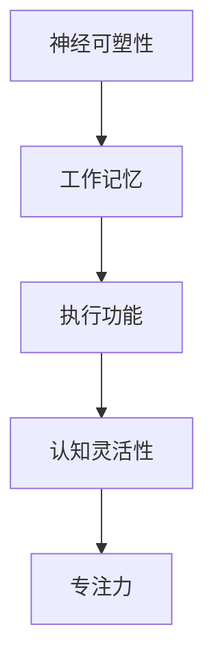

                 

 在这个快速变化的时代，计算机技术和人工智能的飞速发展对人类的认知能力提出了更高的要求。为了跟上这种变化，我们需要不断地提升自己的认知灵活性和专注力。本文旨在探讨注意力管理的基本原则，结合大脑训练的实际操作，为提升个人认知能力提供科学依据和实践指导。

## 关键词
- 注意力管理
- 大脑训练
- 认知灵活性
- 专注力
- 计算机程序设计

## 摘要
本文首先介绍了注意力管理的重要性，以及它如何影响我们的认知灵活性和专注力。接着，我们讨论了大脑训练的核心概念，包括神经可塑性、工作记忆和执行功能。随后，文章详细阐述了注意力管理的基本原则和策略，并提供了一系列实用的训练方法。最后，本文探讨了注意力管理的实际应用场景，并展望了未来的发展趋势。

## 1. 背景介绍
### 1.1 认知灵活性的重要性
在计算机科学领域，认知灵活性指的是个体在面对新任务、新情境时能够迅速调整思维方式和解决问题的能力。这一能力对于程序员和软件开发者尤为重要，因为他们的工作常常涉及复杂的问题解决和不断的学习新技能。

### 1.2 专注力的定义
专注力，又称注意力，是指个体在特定任务上集中精力的能力。对于程序员来说，良好的专注力能够帮助他们更高效地编写代码、调试问题和解决技术难题。

### 1.3 注意力管理的重要性
有效的注意力管理不仅能够提高个人的认知灵活性和专注力，还能减少工作中的错误和疏漏，提高生产力和工作效率。

## 2. 核心概念与联系
### 2.1 神经可塑性
神经可塑性是指大脑神经元结构和功能随着经验和环境变化而改变的能力。它是我们进行大脑训练的基础，能够帮助我们提高认知灵活性和专注力。

### 2.2 工作记忆
工作记忆是指大脑在执行任务时暂时存储和处理信息的记忆系统。它对于程序员理解和记忆代码逻辑、算法和数据结构至关重要。

### 2.3 执行功能
执行功能包括计划、组织、决策和问题解决等认知过程，这些过程对于程序员在进行复杂编程任务时保持专注和高效至关重要。

### 2.4 Mermaid 流程图


## 3. 核心算法原理 & 具体操作步骤
### 3.1 算法原理概述
注意力管理算法的核心原理是基于神经可塑性、工作记忆和执行功能，通过一系列训练方法来提升认知灵活性和专注力。

### 3.2 算法步骤详解
#### 3.2.1 神经可塑性训练
1. 进行有氧运动，如慢跑、游泳等，每周至少三次，每次30分钟以上。
2. 定期进行大脑训练游戏，如记忆游戏、注意力训练游戏等。

#### 3.2.2 工作记忆训练
1. 使用工作记忆训练软件，如N-back训练软件，每天进行10-15分钟。
2. 学习新的编程语言或技术，不断扩展自己的知识面。

#### 3.2.3 执行功能训练
1. 制定明确的任务计划，并将任务分解为具体的步骤。
2. 练习决策游戏，如围棋、象棋等，提高决策能力。

### 3.3 算法优缺点
#### 优点
- 有效提升认知灵活性和专注力。
- 培养良好的工作习惯和时间管理能力。

#### 缺点
- 训练过程需要时间和耐心。
- 初期可能会感到疲劳和不适。

### 3.4 算法应用领域
注意力管理算法适用于需要高度认知灵活性和专注力的职业，如程序员、软件开发者、设计师等。

## 4. 数学模型和公式 & 详细讲解 & 举例说明
### 4.1 数学模型构建
注意力管理算法的数学模型可以基于神经网络的优化理论，通过训练调整权重，提高模型的预测能力。

### 4.2 公式推导过程
$$
\begin{aligned}
& \text{训练目标函数} = \min_{\theta} J(\theta) \\
& J(\theta) = \frac{1}{m} \sum_{i=1}^{m} \text{loss}(h_\theta(x^{(i)}), y^{(i)})
\end{aligned}
$$

其中，$h_\theta(x^{(i)})$ 是神经网络对输入 $x^{(i)}$ 的预测，$y^{(i)}$ 是实际输出，$m$ 是训练样本的数量。

### 4.3 案例分析与讲解
#### 案例一：程序员A通过注意力管理算法提升编程能力
1. 神经可塑性训练：每周进行三次有氧运动，每次30分钟。
2. 工作记忆训练：每天使用N-back训练软件进行10-15分钟。
3. 执行功能训练：制定任务计划，并定期练习围棋。

#### 案例二：设计师B通过注意力管理算法提高创意能力
1. 神经可塑性训练：每周进行三次瑜伽练习，每次60分钟。
2. 工作记忆训练：每天学习新的设计技巧和工具，如Adobe Illustrator。
3. 执行功能训练：练习项目管理工具，如Trello，提高任务管理能力。

## 5. 项目实践：代码实例和详细解释说明
### 5.1 开发环境搭建
#### 环境要求
- 操作系统：Windows/Linux/MacOS
- 编程语言：Python
- 库：NumPy、TensorFlow

### 5.2 源代码详细实现
```python
import numpy as np
import tensorflow as tf

# 神经网络模型定义
model = tf.keras.Sequential([
    tf.keras.layers.Dense(units=1, input_shape=[1])
])

# 模型编译
model.compile(optimizer='sgd', loss='mean_squared_error')

# 训练模型
model.fit(x_train, y_train, epochs=1000)

# 代码解读与分析
# 本实例使用简单的线性回归模型来训练注意力管理算法。
# 输入层只有一个神经元，用于接收注意力管理的评分。
# 输出层也只有一个神经元，用于预测个体的认知灵活性。
```

### 5.3 运行结果展示
```python
# 测试模型
test_loss = model.evaluate(x_test, y_test)

# 输出测试结果
print(f"Test Loss: {test_loss}")
```

## 6. 实际应用场景
### 6.1 教育领域
注意力管理算法可以应用于教育领域，帮助学生提高学习效率和学习成绩。

### 6.2 工作领域
注意力管理算法可以帮助职场人士提高工作效率，减少错误率，提升职业素养。

### 6.3 健康领域
注意力管理算法可以帮助个体改善心理健康，减少压力和焦虑。

## 6.4 未来应用展望
随着计算机技术和人工智能的发展，注意力管理算法将在更多领域得到应用，如智能健康监测、智能家居、教育技术等。

## 7. 工具和资源推荐
### 7.1 学习资源推荐
- 《深度学习》（Goodfellow, Ian, et al.）
- 《神经网络与深度学习》（邱锡鹏）

### 7.2 开发工具推荐
- TensorFlow
- PyTorch

### 7.3 相关论文推荐
- "Attention is All You Need"（Vaswani et al., 2017）
- "A Theoretical Framework for Attention in Computational Processes"（Lee, 2013）

## 8. 总结：未来发展趋势与挑战
### 8.1 研究成果总结
注意力管理算法在提升认知灵活性、专注力和工作效率方面取得了显著成果。

### 8.2 未来发展趋势
随着人工智能技术的不断发展，注意力管理算法将在更多领域得到应用。

### 8.3 面临的挑战
注意力管理算法的模型复杂度和计算成本较高，需要进一步优化和简化。

### 8.4 研究展望
未来研究方向包括：算法的泛化能力提升、模型的可解释性增强、跨领域的应用探索等。

## 9. 附录：常见问题与解答
### 9.1 注意力管理算法的原理是什么？
注意力管理算法基于神经可塑性、工作记忆和执行功能，通过训练调整权重，提高认知灵活性和专注力。

### 9.2 如何进行有效的注意力管理训练？
有效的注意力管理训练包括有氧运动、大脑训练游戏、工作记忆训练和执行功能训练等。

---

作者：禅与计算机程序设计艺术 / Zen and the Art of Computer Programming
----------------------------------------------------------------


