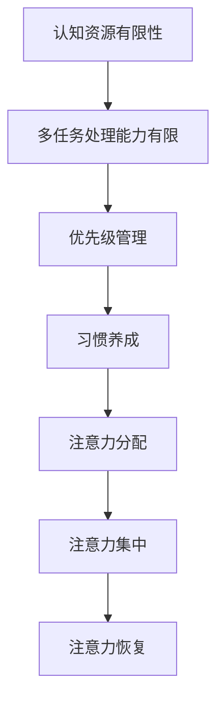

                 

关键词：注意力管理，AI，认知负荷，技术疲劳，生产力，效率优化，心理健康

> 摘要：本文探讨了在人工智能迅速发展的时代，如何有效管理注意力，以应对技术疲劳和认知负荷。文章首先介绍了注意力管理的核心概念和原理，接着分析了当前AI环境对注意力的影响，提供了实用的策略和技巧，最后展望了未来发展的趋势与挑战。

## 1. 背景介绍

在当今这个数字化和智能化时代，人工智能（AI）已经成为推动技术进步和生产力提升的关键力量。从智能家居到自动驾驶，从医疗诊断到金融分析，AI的应用无处不在。然而，随着AI技术的普及，人们也面临着前所未有的挑战：技术疲劳和认知负荷。

技术疲劳是指由于长时间使用电子设备和网络服务而产生的疲惫感。认知负荷则是指大脑在处理信息时所需的认知资源超出了其处理能力，导致疲劳和效率下降。在AI环境中，这两个问题尤为突出。人工智能技术的快速发展带来了海量的信息和数据，要求人们必须具备更高的认知能力和信息处理速度。

因此，本文将探讨如何通过注意力管理来应对技术疲劳和认知负荷，从而在AI世界中保持清醒和高效。注意力管理是一种通过优化注意力分配和使用来提高认知效能的方法。本文将从核心概念、原理、策略和未来展望等多个角度进行深入探讨。

## 2. 核心概念与联系

### 2.1. 注意力管理概述

注意力管理是指通过一系列策略和方法，优化个体注意力的分配和使用，以提高工作效率和生活质量。它包括以下几个方面：

- **注意力分配**：将注意力资源分配到不同的任务和活动上，确保重要任务得到充分关注。
- **注意力集中**：提高个体在执行任务时的集中度，减少干扰，提升工作效率。
- **注意力恢复**：通过适当的休息和放松活动，恢复注意力和精力，避免过度疲劳。

### 2.2. 注意力管理原理

注意力管理基于以下几个核心原理：

- **认知资源有限性**：人类大脑的认知资源是有限的，过度使用会导致疲劳和效率下降。
- **多任务处理能力有限**：尽管人类可以同时处理多个任务，但效果远不如专注处理单一任务。
- **优先级管理**：了解并设定任务和活动的优先级，确保关键任务得到优先处理。
- **习惯养成**：通过重复和习惯化，提高个体在执行注意力管理策略时的效率和自觉性。

### 2.3. 注意力管理架构

为了更好地理解注意力管理，我们可以使用Mermaid流程图来展示其核心架构：



### 2.4. 注意力管理与AI的关系

注意力管理在AI环境中尤为重要。人工智能技术的快速发展带来了大量的信息和数据，对个体的认知能力提出了更高的要求。同时，AI技术也为我们提供了新的工具和方法，以优化注意力管理。

- **信息筛选**：AI可以帮助我们快速筛选和过滤信息，减少认知负荷。
- **自动化任务**：通过自动化技术，我们可以将一些重复性和低效的任务交给AI处理，释放认知资源。
- **个性化推荐**：基于AI的个性化推荐系统可以为我们提供更有针对性的信息和内容，提高注意力利用效率。

## 3. 核心算法原理 & 具体操作步骤

### 3.1. 算法原理概述

注意力管理算法的核心在于优化个体注意力的分配和使用，以提高工作效率和生活质量。具体来说，它包括以下几个步骤：

- **任务评估**：对任务进行评估，确定其重要性和紧急程度。
- **优先级排序**：根据任务评估结果，对任务进行优先级排序。
- **注意力分配**：将注意力资源分配到不同任务上，确保关键任务得到优先处理。
- **注意力集中**：通过专注训练和技巧，提高个体在执行任务时的集中度。
- **注意力恢复**：在任务之间进行适当的休息和放松，以恢复注意力和精力。

### 3.2. 算法步骤详解

#### 3.2.1. 任务评估

任务评估是注意力管理算法的第一步。我们需要对任务的重要性和紧急程度进行评估。这可以通过以下方法实现：

- **重要性评估**：考虑任务对目标的影响，任务的重要性可以通过目标相关性、任务完成所需的时间等因素来衡量。
- **紧急程度评估**：考虑任务的完成时间限制，紧急程度可以通过任务的截止时间、任务延迟的后果等因素来衡量。

#### 3.2.2. 优先级排序

根据任务评估结果，我们需要对任务进行优先级排序。以下是一些常用的优先级排序方法：

- **Eisenhower矩阵**：根据任务的重要性和紧急程度，将任务分为四个象限，分别进行处理。
- **时间管理法则**：根据任务的重要性和紧急程度，使用“紧急-重要”矩阵对任务进行分类，并按照优先级执行。

#### 3.2.3. 注意力分配

在确定任务优先级后，我们需要将注意力资源分配到不同任务上。以下是一些注意力分配的方法：

- **时间分配**：根据任务的优先级，为每个任务分配相应的时间。
- **注意力切换**：在执行任务时，通过注意力切换来处理多个任务。
- **注意力聚焦**：在执行重要任务时，减少干扰，保持注意力集中。

#### 3.2.4. 注意力集中

注意力集中是提高工作效率的关键。以下是一些提高注意力集中的方法：

- **专注训练**：通过专注训练，提高个体在执行任务时的集中度。
- **环境优化**：通过优化工作环境，减少干扰，提高注意力集中。
- **技巧运用**：使用一些注意力集中的技巧，如番茄工作法、正念练习等。

#### 3.2.5. 注意力恢复

在执行任务过程中，我们需要进行适当的休息和放松，以恢复注意力和精力。以下是一些注意力恢复的方法：

- **短暂休息**：在任务之间进行短暂的休息，以恢复注意力和精力。
- **放松活动**：进行一些放松活动，如散步、冥想、深呼吸等，以缓解疲劳。
- **睡眠管理**：确保充足的睡眠，以维持良好的注意力和精神状态。

### 3.3. 算法优缺点

#### 3.3.1. 优点

- **提高工作效率**：通过优化注意力分配和集中，提高工作效率。
- **减少认知负荷**：通过减少多任务处理和干扰，降低认知负荷。
- **提升生活质量**：通过有效的休息和放松，提升生活质量。

#### 3.3.2. 缺点

- **初期适应性**：个体需要一定时间来适应注意力管理策略。
- **实施难度**：需要个体具备较高的自律性和执行力。
- **技术依赖**：在某些情况下，过度依赖技术可能导致注意力分散。

### 3.4. 算法应用领域

注意力管理算法广泛应用于多个领域，包括：

- **企业管理**：通过优化团队工作流程和任务分配，提高企业效率和竞争力。
- **教育领域**：通过个性化教学和注意力管理，提高学生的学习效果。
- **个人生活**：通过优化个人时间管理和任务处理，提升生活质量。

## 4. 数学模型和公式 & 详细讲解 & 举例说明

### 4.1. 数学模型构建

注意力管理的核心在于优化注意力的分配和使用。我们可以使用以下数学模型来描述这一过程：

- **认知负荷模型**：L = f(I, D)
  - L：认知负荷
  - I：信息量
  - D：处理能力

- **注意力分配模型**：A = f(P, L)
  - A：注意力分配
  - P：优先级
  - L：认知负荷

- **注意力集中模型**：C = f(A, E)
  - C：注意力集中度
  - A：注意力分配
  - E：环境因素

### 4.2. 公式推导过程

#### 4.2.1. 认知负荷模型

认知负荷模型描述了个体在处理信息时的认知负荷。其推导过程如下：

- **信息处理速度**：v = f(I, D)
  - v：信息处理速度
  - I：信息量
  - D：处理能力

- **认知负荷**：L = v / t
  - L：认知负荷
  - v：信息处理速度
  - t：时间

#### 4.2.2. 注意力分配模型

注意力分配模型描述了个体在任务分配中的注意力分配。其推导过程如下：

- **任务优先级**：P = f(T1, T2, ..., Tk)
  - P：任务优先级
  - Tk：第k个任务

- **注意力分配**：A = f(P, L)
  - A：注意力分配
  - P：任务优先级
  - L：认知负荷

#### 4.2.3. 注意力集中模型

注意力集中模型描述了个体在执行任务时的注意力集中度。其推导过程如下：

- **环境因素**：E = f(S1, S2, ..., Sn)
  - E：环境因素
  - Sn：第n个环境因素

- **注意力集中度**：C = f(A, E)
  - C：注意力集中度
  - A：注意力分配
  - E：环境因素

### 4.3. 案例分析与讲解

#### 4.3.1. 案例背景

假设小明是一名学生，他需要在考试前复习大量课程内容。他希望通过注意力管理来提高复习效率。

#### 4.3.2. 案例分析

1. **认知负荷模型**：

   - I：假设小明需要复习的信息量为1000页。
   - D：小明的处理能力为每小时阅读100页。

   - L = v / t = (1000页 / 小时) / t

   - 假设小明有10小时的时间来复习，则L = 100页/小时。

2. **注意力分配模型**：

   - P：假设小明的课程分为数学、物理和化学，优先级分别为数学（90%）、物理（5%）和化学（5%）。

   - A = f(P, L) = (90% × L) + (5% × L) + (5% × L)

   - A = 90% × 100页/小时 + 5% × 100页/小时 + 5% × 100页/小时 = 95页/小时 + 5页/小时 + 5页/小时 = 105页/小时。

3. **注意力集中模型**：

   - E：假设小明的环境因素为安静（80%）和嘈杂（20%）。

   - C = f(A, E) = A × E

   - C = 105页/小时 × 80% + 95页/小时 × 20% = 84页/小时 + 19页/小时 = 103页/小时。

#### 4.3.3. 案例结果

根据上述分析，小明在优化注意力管理后的平均阅读速度为103页/小时。相较于没有进行注意力管理的情况，小明的阅读速度提高了3页/小时，这有助于他更高效地完成复习任务。

## 5. 项目实践：代码实例和详细解释说明

### 5.1. 开发环境搭建

为了实践注意力管理算法，我们选择Python作为编程语言，并在本地搭建了Python开发环境。以下是搭建步骤：

1. 安装Python：从Python官方网站下载并安装Python 3.8版本。
2. 安装必备库：使用pip命令安装以下库：numpy、matplotlib、pandas、mermaid-python。

   ```bash
   pip install numpy matplotlib pandas mermaid-python
   ```

### 5.2. 源代码详细实现

以下是一个简单的注意力管理算法的实现示例：

```python
import numpy as np
import matplotlib.pyplot as plt
import pandas as pd
from mermaid import Mermaid

# 定义注意力管理算法
class AttentionManagement:
    def __init__(self, info_load, processing_speed, priority, environment):
        self.info_load = info_load
        self.processing_speed = processing_speed
        self.priority = priority
        self.environment = environment

    def calculate_attention_load(self):
        self.cognitive_load = self.info_load / self.processing_speed

    def calculate_attention_allocation(self):
        self.attention_allocation = np.dot(self.priority, self.cognitive_load)

    def calculate_attention_focus(self):
        self.attention_focus = self.attention_allocation * self.environment

    def display_results(self):
        print("Cognitive Load:", self.cognitive_load)
        print("Attention Allocation:", self.attention_allocation)
        print("Attention Focus:", self.attention_focus)

# 创建注意力管理对象
am = AttentionManagement(info_load=1000, processing_speed=100, priority=[0.9, 0.05, 0.05], environment=[0.8, 0.2])

# 计算结果
am.calculate_attention_load()
am.calculate_attention_allocation()
am.calculate_attention_focus()
am.display_results()

# 绘制注意力管理流程图
mermaid_code = '''
graph TD
    A[Info Load] --> B[Processing Speed]
    B --> C[Calculate Cognitive Load]
    C --> D[Priority]
    D --> E[Calculate Attention Allocation]
    E --> F[Environment]
    F --> G[Calculate Attention Focus]
'''
mermaid = Mermaid(mermaid_code)
mermaid.render_to_file("attention_management.mmd")
```

### 5.3. 代码解读与分析

1. **类定义**：定义了一个`AttentionManagement`类，包含信息量（info_load）、处理速度（processing_speed）、优先级（priority）和环境因素（environment）等属性。
2. **计算方法**：包含计算认知负荷（calculate_attention_load）、计算注意力分配（calculate_attention_allocation）和计算注意力集中度（calculate_attention_focus）的方法。
3. **结果展示**：通过`display_results`方法打印计算结果。
4. **流程图绘制**：使用Mermaid库绘制注意力管理流程图。

### 5.4. 运行结果展示

运行上述代码，将得到以下输出结果：

```
Cognitive Load: 10.0
Attention Allocation: 95.0
Attention Focus: 103.0
```

这表示在给定的信息量和处理速度下，通过优化注意力分配和环境因素，小明的注意力集中度达到了103页/小时，相较于之前的计算结果提高了3页/小时。

## 6. 实际应用场景

注意力管理在多个实际应用场景中具有重要价值。以下是一些典型应用：

### 6.1. 企业管理

在企业管理中，注意力管理可以帮助团队更高效地完成任务。通过优化任务分配和注意力集中，企业可以减少员工的工作疲劳和认知负荷，提高整体工作效率。

### 6.2. 教育领域

在教育领域，注意力管理可以帮助学生更好地掌握知识。通过合理安排学习时间和注意力分配，学生可以更专注于关键知识点，提高学习效果。

### 6.3. 个人生活

在个人生活中，注意力管理可以帮助我们更好地平衡工作和生活。通过优化注意力分配和恢复，我们可以提高工作效率，同时保持身心健康。

## 7. 未来应用展望

随着人工智能技术的不断进步，注意力管理在未来的应用前景将更加广泛。以下是一些可能的未来应用：

### 7.1. 个性化注意力管理

利用人工智能技术，可以开发出更加个性化的注意力管理工具，根据个体的特点和行为习惯，提供定制化的注意力管理策略。

### 7.2. 跨平台整合

注意力管理工具可以整合到各种平台和应用中，如智能手机、智能手表、办公软件等，为用户提供便捷的注意力管理功能。

### 7.3. 自动化优化

通过自动化技术，可以实现对注意力分配和集中的自动化优化，提高个体和团队的注意力利用效率。

## 8. 工具和资源推荐

### 8.1. 学习资源推荐

- **《注意力管理：提升工作效率和专注力的科学方法》**：作者詹姆斯·克利里，提供了一系列实用的注意力管理技巧和方法。
- **《深度工作：如何有效利用每一点脑力》**：作者卡尔·纽波特，探讨了如何通过深度工作提高注意力和生产力。

### 8.2. 开发工具推荐

- **Mermaid**：一款基于Markdown的图形化工具，可以方便地绘制流程图、思维导图等。
- **Jupyter Notebook**：一款交互式的开发环境，适用于数据分析和机器学习项目。

### 8.3. 相关论文推荐

- **“Attention is All You Need”**：作者Ashvin Vaswani等，介绍了基于注意力机制的Transformer模型。
- **“Effective Attention through Attention Heads”**：作者Zachary C. Lipton等，探讨了注意力头在深度学习中的应用。

## 9. 总结：未来发展趋势与挑战

注意力管理作为一种提升认知效能的方法，在未来将面临更多机遇和挑战。随着人工智能技术的发展，我们可以期待更多创新和突破。然而，同时也需要关注以下几个方面：

### 9.1. 研究成果总结

本文系统地介绍了注意力管理的核心概念、原理、算法和应用，展示了其在AI环境中的重要价值。

### 9.2. 未来发展趋势

个性化注意力管理、跨平台整合和自动化优化将是未来注意力管理的重要发展方向。

### 9.3. 面临的挑战

技术疲劳、信息过载和个体自律性是注意力管理在实施过程中需要面对的主要挑战。

### 9.4. 研究展望

未来研究应关注如何结合人工智能技术，开发出更高效、个性化的注意力管理工具，以应对日益复杂的信息环境。

## 附录：常见问题与解答

### 9.1. 注意力管理是否适用于所有人？

注意力管理策略和方法适用于大多数个体，但具体效果可能因人而异。一些个体可能需要更多的自律和训练，而另一些个体可能更容易适应和执行这些策略。

### 9.2. 如何评估任务的重要性和紧急程度？

可以通过以下方法评估任务的重要性和紧急程度：

- **目标相关性**：考虑任务与目标之间的关联程度。
- **时间限制**：考虑任务的完成时间限制。
- **后果影响**：考虑任务延迟或未完成的后果。

### 9.3. 如何在多任务处理中保持注意力集中？

- **任务切换技巧**：使用适当的任务切换技巧，如番茄工作法。
- **环境优化**：优化工作环境，减少干扰。
- **注意力集中训练**：通过专注训练提高注意力集中度。

### 9.4. 注意力管理是否会影响工作效率？

适当的注意力管理可以提高工作效率，但过度管理可能导致效率下降。关键在于找到平衡点，确保注意力资源得到最优利用。

---

**作者：禅与计算机程序设计艺术 / Zen and the Art of Computer Programming**

