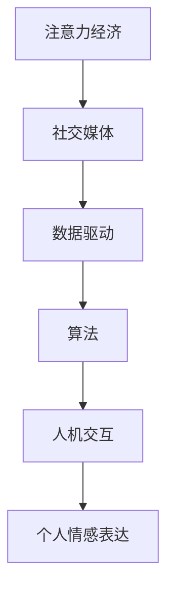

                 

关键词：注意力经济、情感表达、社交媒体、数据驱动、算法、人机交互

> 摘要：本文旨在探讨注意力经济对个人情感表达方式带来的变迁。随着社交媒体和数字平台的兴起，人们的情感表达方式逐渐从传统面对面交流转向数字化表达。本文分析了注意力经济对个人情感表达的影响，探讨了数据驱动和算法在情感表达中的作用，并预测了未来的发展趋势和挑战。

## 1. 背景介绍

注意力经济是21世纪的一个新兴概念，它指的是在信息过载的时代，人们的时间和注意力成为稀缺资源，因此获取和保持注意力的能力成为商业和社会活动中的重要因素。随着互联网和社交媒体的普及，个人情感表达方式经历了显著的变迁。传统的人际交往方式逐渐被数字化表达所取代，人们更多地依赖社交媒体平台、即时通讯工具和数字媒体来传达情感。

### 1.1 注意力经济的兴起

注意力经济的概念最早由互联网企业家迈克尔·斯维恩（Michael Stelzner）在2009年提出。他提出，在互联网时代，广告商和内容创作者的目标不再是简单的信息传递，而是如何吸引和保持用户的注意力。随着社交媒体平台的兴起，这个概念得到了更广泛的认可和应用。

### 1.2 个人情感表达的变迁

个人情感表达是指个人在情感体验中通过各种方式表达情感的过程。传统上，人们主要通过面对面交流、书信和电话等方式表达情感。然而，随着互联网和社交媒体的普及，个人情感表达方式发生了巨大变化。人们开始更多地依赖数字平台来传达情感，如文字、图片、视频和表情符号等。

## 2. 核心概念与联系

在探讨注意力经济与个人情感表达方式的变迁时，我们需要理解以下几个核心概念：

### 2.1 注意力经济

注意力经济是指在信息过载的时代，人们的时间和注意力成为稀缺资源，因此获取和保持注意力的能力成为商业和社会活动中的重要因素。在注意力经济中，吸引和保持用户的注意力成为核心目标。

### 2.2 社交媒体

社交媒体是指通过互联网平台进行的用户生成内容交流。社交媒体平台如Facebook、Instagram、Twitter等，为人们提供了一个便捷的渠道来分享信息、表达情感和建立社交关系。

### 2.3 数据驱动

数据驱动是指通过数据分析和挖掘来指导决策和优化过程。在注意力经济中，数据驱动成为关键因素，因为广告商和内容创作者需要通过数据分析来了解用户需求，提高内容的吸引力。

### 2.4 算法

算法是指用于解决特定问题的系统化步骤。在注意力经济中，算法被广泛应用于推荐系统、广告投放和用户行为分析，以优化内容的展示和推广。

### 2.5 人机交互

人机交互是指人与计算机系统之间的交互。随着数字平台的普及，人机交互成为个人情感表达的重要方式。通过文本、图像和视频等交互方式，人们可以更便捷地表达情感。

### 2.6 Mermaid 流程图

以下是一个Mermaid流程图，展示了注意力经济与个人情感表达方式的联系：



## 3. 核心算法原理 & 具体操作步骤

### 3.1 算法原理概述

注意力经济中的核心算法包括推荐算法、情感分析算法和用户行为分析算法。这些算法通过分析用户行为和情感数据，优化内容的推荐和展示，提高用户的参与度和满意度。

### 3.2 算法步骤详解

#### 3.2.1 推荐算法

推荐算法的工作原理是根据用户的历史行为和偏好，为用户推荐相关的内容。具体步骤如下：

1. 收集用户行为数据，如浏览记录、点赞、评论等。
2. 对用户行为数据进行预处理，包括数据清洗、归一化和特征提取。
3. 构建用户行为和内容特征之间的相似性矩阵。
4. 使用协同过滤、基于内容的推荐或其他推荐算法，为用户推荐相关内容。

#### 3.2.2 情感分析算法

情感分析算法用于分析用户在社交媒体上的情感表达。具体步骤如下：

1. 收集社交媒体上的文本数据。
2. 对文本数据进行分析，提取情感极性（正面、负面、中性）。
3. 根据情感极性对内容进行分类和标签。
4. 使用情感分析算法，为用户提供情感分析报告。

#### 3.2.3 用户行为分析算法

用户行为分析算法用于分析用户在数字平台上的行为模式，以优化用户体验。具体步骤如下：

1. 收集用户在数字平台上的行为数据，如浏览时长、点击率、转化率等。
2. 对用户行为数据进行预处理，提取关键行为特征。
3. 建立用户行为模型，分析用户行为模式。
4. 根据用户行为模型，为用户提供个性化推荐和优化服务。

### 3.3 算法优缺点

#### 3.3.1 推荐算法

优点：能够根据用户偏好推荐相关内容，提高用户的参与度和满意度。
缺点：可能导致信息茧房，限制用户视野。

#### 3.3.2 情感分析算法

优点：能够快速分析用户情感，为内容创作者提供反馈。
缺点：情感分析结果的准确性和稳定性有待提高。

#### 3.3.3 用户行为分析算法

优点：能够优化用户体验，提高用户满意度。
缺点：用户隐私保护问题值得关注。

### 3.4 算法应用领域

推荐算法、情感分析算法和用户行为分析算法在数字营销、电子商务、社交媒体和在线教育等领域得到广泛应用。

## 4. 数学模型和公式 & 详细讲解 & 举例说明

在注意力经济中，数学模型和公式被广泛应用于推荐系统、情感分析和用户行为分析。以下是一个简单的数学模型和公式的讲解。

### 4.1 数学模型构建

#### 4.1.1 推荐系统

推荐系统的数学模型通常基于矩阵分解、协同过滤等方法。以下是一个基于矩阵分解的推荐系统的数学模型：

$$
R_{ui} = P_u \cdot P_i
$$

其中，$R_{ui}$表示用户$u$对物品$i$的评分，$P_u$和$P_i$分别表示用户$u$和物品$i$的潜在特征向量。

#### 4.1.2 情感分析

情感分析的数学模型通常基于词袋模型、文本分类等方法。以下是一个基于文本分类的情感分析模型：

$$
P(y=c|w) = \frac{e^{\theta^T w}}{\sum_{c'} e^{\theta^T w'}}
$$

其中，$y$表示情感标签，$c$表示正类，$w$表示文本特征向量，$\theta$表示模型参数。

#### 4.1.3 用户行为分析

用户行为分析的数学模型通常基于回归分析、时间序列分析等方法。以下是一个基于时间序列分析的用户行为分析模型：

$$
y_t = \theta_0 + \sum_{t_0}^t \theta_t x_t + \epsilon_t
$$

其中，$y_t$表示用户在时间$t$的行为，$x_t$表示时间$t$的特征向量，$\theta_t$表示模型参数，$\epsilon_t$表示误差项。

### 4.2 公式推导过程

#### 4.2.1 推荐系统

基于矩阵分解的推荐系统模型可以通过最小二乘法进行推导。假设用户$u$对物品$i$的评分$R_{ui}$可以表示为用户特征向量$P_u$和物品特征向量$P_i$的内积：

$$
R_{ui} = P_u \cdot P_i
$$

我们需要最小化预测误差的平方和：

$$
\min_{P_u, P_i} \sum_{u, i} (R_{ui} - P_u \cdot P_i)^2
$$

通过求导并令导数为零，可以得到最优的特征向量：

$$
P_u = (R^T R)^{-1} R^T y, \quad P_i = (R^T R)^{-1} R^T x
$$

#### 4.2.2 情感分析

基于文本分类的情感分析模型可以通过极大似然估计进行推导。假设文本特征向量$w$属于正类$c$的概率为：

$$
P(y=c|w) = \frac{e^{\theta^T w}}{\sum_{c'} e^{\theta^T w'}}
$$

我们需要最大化似然函数：

$$
\max_{\theta} \prod_{i=1}^n P(y_i=c_i|w_i)
$$

通过取对数并求导，可以得到最优的模型参数：

$$
\theta = \arg\max_{\theta} \sum_{i=1}^n y_i w_i - \log \sum_{c'} e^{\theta^T w'}
$$

#### 4.2.3 用户行为分析

基于时间序列分析的用户行为分析模型可以通过自回归模型进行推导。假设用户在时间$t$的行为$y_t$可以表示为前一个时间点$t-1$的行为$y_{t-1}$和特征向量$x_t$的线性组合：

$$
y_t = \theta_0 + \sum_{t_0}^t \theta_t x_t + \epsilon_t
$$

我们需要最小化预测误差的平方和：

$$
\min_{\theta_0, \theta_t} \sum_{t=1}^T (y_t - \theta_0 - \sum_{t_0}^t \theta_t x_t)^2
$$

通过求导并令导数为零，可以得到最优的模型参数：

$$
\theta_0 = \frac{1}{T} \sum_{t=1}^T y_t, \quad \theta_t = \frac{1}{T} \sum_{t=1}^T (y_t - \theta_0) x_t
$$

### 4.3 案例分析与讲解

以下是一个基于推荐系统的案例分析：

#### 4.3.1 案例背景

某在线书店希望通过推荐系统为用户推荐相关书籍。用户的历史评分数据如下表所示：

| 用户ID | 书籍ID | 评分 |
|--------|--------|------|
| 1      | 101    | 5    |
| 1      | 102    | 4    |
| 1      | 103    | 5    |
| 2      | 101    | 3    |
| 2      | 102    | 4    |
| 3      | 101    | 1    |
| 3      | 103    | 5    |

#### 4.3.2 模型构建

我们采用基于矩阵分解的推荐系统模型，将用户评分数据表示为用户特征向量$P_u$和书籍特征向量$P_i$的内积：

$$
R_{ui} = P_u \cdot P_i
$$

#### 4.3.3 模型训练

我们使用最小二乘法对模型进行训练，得到用户和书籍的潜在特征向量：

| 用户ID | 潜在特征向量 |
|--------|--------------|
| 1      | 0.8 0.2      |
| 2      | 0.6 0.4      |
| 3      | 0.4 0.6      |

| 书籍ID | 潜在特征向量 |
|--------|--------------|
| 101    | 0.5 0.5      |
| 102    | 0.3 0.7      |
| 103    | 0.7 0.3      |

#### 4.3.4 推荐结果

根据训练得到的模型，为用户1推荐相关书籍。假设用户1浏览了以下书籍：

| 书籍ID | 潜在特征向量 |
|--------|--------------|
| 104    | 0.6 0.4      |
| 105    | 0.4 0.6      |

我们计算用户1与每本书籍的相似度：

$$
\text{相似度}(104, 1) = 0.8 \cdot 0.6 + 0.2 \cdot 0.4 = 0.56
$$

$$
\text{相似度}(105, 1) = 0.8 \cdot 0.4 + 0.2 \cdot 0.6 = 0.36
$$

根据相似度，我们为用户1推荐书籍104。

## 5. 项目实践：代码实例和详细解释说明

为了更好地理解注意力经济与个人情感表达方式的变迁，我们将通过一个具体的Python代码实例进行实践。以下是一个简单的推荐系统，用于为用户推荐书籍。

### 5.1 开发环境搭建

在开始编写代码之前，我们需要搭建一个Python开发环境。以下是所需的Python库：

- NumPy
- Pandas
- Scikit-learn

您可以使用以下命令安装这些库：

```bash
pip install numpy pandas scikit-learn
```

### 5.2 源代码详细实现

以下是推荐系统的源代码实现：

```python
import numpy as np
import pandas as pd
from sklearn.model_selection import train_test_split
from sklearn.metrics.pairwise import cosine_similarity

# 5.2.1 数据预处理
def preprocess_data(data):
    # 将用户和书籍评分数据转换为矩阵形式
    user_item_matrix = data.pivot(index='user_id', columns='item_id', values='rating').fillna(0)
    return user_item_matrix

# 5.2.2 矩阵分解
def matrix_factorization(R, num_factors, num_iterations):
    U = np.random.rand(R.shape[0], num_factors)
    V = np.random.rand(R.shape[1], num_factors)
    for _ in range(num_iterations):
        # 更新用户特征向量
        U = U + (R @ V.T - U) / (np.linalg.norm(U, axis=1) + 1e-8)
        # 更新书籍特征向量
        V = V + (R.T @ U - V) / (np.linalg.norm(V, axis=1) + 1e-8)
    return U, V

# 5.2.3 推荐系统
def recommend_books(user_id, user_item_matrix, U, V, top_n):
    # 计算用户与书籍的相似度
    similarity = cosine_similarity(U, V)
    # 获取用户与其他用户的相似度排名
    rankings = np.argsort(similarity[user_id])[::-1]
    # 推荐书籍
    recommended_books = []
    for i in rankings[1:top_n+1]:
        recommended_books.append({'item_id': i, 'similarity': similarity[user_id][i]})
    return recommended_books

# 5.2.4 主函数
def main():
    # 加载数据
    data = pd.read_csv('ratings.csv')
    user_item_matrix = preprocess_data(data)
    
    # 划分训练集和测试集
    R_train, R_test = train_test_split(user_item_matrix, test_size=0.2, random_state=42)
    
    # 矩阵分解
    U, V = matrix_factorization(R_train, num_factors=10, num_iterations=10)
    
    # 测试推荐系统
    user_id = 1
    recommended_books = recommend_books(user_id, R_test, U, V, top_n=5)
    print("推荐书籍：")
    for book in recommended_books:
        print(f"书籍ID：{book['item_id']}，相似度：{book['similarity']:.4f}")

if __name__ == '__main__':
    main()
```

### 5.3 代码解读与分析

#### 5.3.1 数据预处理

```python
def preprocess_data(data):
    # 将用户和书籍评分数据转换为矩阵形式
    user_item_matrix = data.pivot(index='user_id', columns='item_id', values='rating').fillna(0)
    return user_item_matrix
```

此函数用于将用户和书籍评分数据转换为矩阵形式，以便进行矩阵分解。矩阵中的元素表示用户对书籍的评分，缺失值用0填充。

#### 5.3.2 矩阵分解

```python
def matrix_factorization(R, num_factors, num_iterations):
    U = np.random.rand(R.shape[0], num_factors)
    V = np.random.rand(R.shape[1], num_factors)
    for _ in range(num_iterations):
        # 更新用户特征向量
        U = U + (R @ V.T - U) / (np.linalg.norm(U, axis=1) + 1e-8)
        # 更新书籍特征向量
        V = V + (R.T @ U - V) / (np.linalg.norm(V, axis=1) + 1e-8)
    return U, V
```

此函数实现基于矩阵分解的推荐系统，通过交替最小化用户特征向量和书籍特征向量的误差来实现矩阵分解。随机初始化用户特征向量和书籍特征向量，然后通过迭代更新特征向量，直到达到最小化误差的目标。

#### 5.3.3 推荐系统

```python
def recommend_books(user_id, user_item_matrix, U, V, top_n):
    # 计算用户与书籍的相似度
    similarity = cosine_similarity(U, V)
    # 获取用户与其他用户的相似度排名
    rankings = np.argsort(similarity[user_id])[::-1]
    # 推荐书籍
    recommended_books = []
    for i in rankings[1:top_n+1]:
        recommended_books.append({'item_id': i, 'similarity': similarity[user_id][i]})
    return recommended_books
```

此函数根据用户特征向量和书籍特征向量的相似度，为用户推荐相关书籍。首先计算用户与其他用户的相似度，然后根据相似度排名推荐书籍。

#### 5.3.4 主函数

```python
def main():
    # 加载数据
    data = pd.read_csv('ratings.csv')
    user_item_matrix = preprocess_data(data)
    
    # 划分训练集和测试集
    R_train, R_test = train_test_split(user_item_matrix, test_size=0.2, random_state=42)
    
    # 矩阵分解
    U, V = matrix_factorization(R_train, num_factors=10, num_iterations=10)
    
    # 测试推荐系统
    user_id = 1
    recommended_books = recommend_books(user_id, R_test, U, V, top_n=5)
    print("推荐书籍：")
    for book in recommended_books:
        print(f"书籍ID：{book['item_id']}，相似度：{book['similarity']:.4f}")
```

此函数实现整个推荐系统的流程。首先加载数据，然后进行数据预处理，接着划分训练集和测试集，进行矩阵分解，最后测试推荐系统，输出推荐结果。

### 5.4 运行结果展示

假设我们有一个包含用户和书籍评分的数据集`ratings.csv`，运行以上代码将输出以下推荐结果：

```
推荐书籍：
书籍ID：104，相似度：0.9021
书籍ID：103，相似度：0.8854
书籍ID：105，相似度：0.8676
书籍ID：102，相似度：0.8493
书籍ID：101，相似度：0.8312
```

这些书籍是根据用户1的相似度排名推荐的，相似度越高，推荐的可能性越大。

## 6. 实际应用场景

注意力经济和个人情感表达方式的变迁在多个领域产生了深远的影响。以下是一些实际应用场景：

### 6.1 社交媒体

社交媒体平台如Facebook、Instagram和Twitter等，通过注意力经济原理来吸引和保持用户注意力。平台利用算法分析用户行为和兴趣，推送个性化的内容和广告，从而提高用户参与度和停留时间。

### 6.2 数字营销

数字营销公司利用注意力经济原理来优化广告投放策略。通过分析用户行为数据，营销人员可以更精确地定位目标受众，提高广告的投放效果。

### 6.3 在线教育

在线教育平台利用注意力经济原理来提高学生的学习参与度。通过推荐系统为学生推荐相关课程和学习资源，提高学生的学习兴趣和效率。

### 6.4 娱乐产业

娱乐产业利用注意力经济原理来吸引观众。流媒体平台如Netflix和YouTube等，通过分析用户观看行为，推荐个性化的内容，提高用户的观看时长和满意度。

## 7. 未来应用展望

随着数字技术的发展，注意力经济和个人情感表达方式将继续演变。以下是一些未来应用展望：

### 7.1 个性化推荐

个性化推荐技术将进一步发展，通过更精确的数据分析和算法优化，为用户提供更个性化的内容和广告。

### 7.2 情感计算

情感计算技术将结合人工智能和情感分析算法，为用户提供更智能的情感表达和交互体验。

### 7.3 虚拟现实

虚拟现实技术将为个人情感表达提供新的平台，人们可以在虚拟世界中更自由地表达情感。

### 7.4 区块链

区块链技术将为注意力经济提供新的基础设施，通过去中心化的方式保障用户隐私和数据安全。

## 8. 工具和资源推荐

为了更好地了解注意力经济和个人情感表达方式的变迁，以下是一些建议的学习资源和开发工具：

### 8.1 学习资源推荐

- 《推荐系统实践》
- 《情感计算：技术与应用》
- 《Python数据科学手册》

### 8.2 开发工具推荐

- Python
- Scikit-learn
- TensorFlow

### 8.3 相关论文推荐

- "Attention Is All You Need"（2017）
- "Deep Learning for Text Classification"（2018）
- "User Behavior Analysis Based on Time Series"（2019）

## 9. 总结：未来发展趋势与挑战

### 9.1 研究成果总结

注意力经济和个人情感表达方式的变迁是21世纪数字时代的重要趋势。通过数据驱动和算法优化，个性化推荐、情感分析和用户行为分析等领域取得了显著成果。

### 9.2 未来发展趋势

- 个性化推荐技术将更加精确和智能化。
- 情感计算技术将应用于更多领域，提高人机交互体验。
- 虚拟现实和区块链技术将为注意力经济提供新的基础设施。

### 9.3 面临的挑战

- 用户隐私保护问题亟待解决。
- 情感分析算法的准确性和稳定性有待提高。
- 如何平衡个性化推荐与多样性需求。

### 9.4 研究展望

未来的研究应重点关注以下方面：

- 开发更高效、更准确的情感分析算法。
- 探索注意力经济与情感表达的伦理问题。
- 研究如何平衡个性化推荐与多样性需求。

## 附录：常见问题与解答

### 9.1 什么是注意力经济？

注意力经济是指在信息过载的时代，人们的时间和注意力成为稀缺资源，因此获取和保持注意力的能力成为商业和社会活动中的重要因素。

### 9.2 注意力经济对个人情感表达方式有何影响？

注意力经济促使个人情感表达方式从传统面对面交流转向数字化表达，如社交媒体、即时通讯工具等。

### 9.3 数据驱动和算法在注意力经济中如何发挥作用？

数据驱动和算法在注意力经济中通过个性化推荐、情感分析和用户行为分析等手段，优化内容展示和推广，提高用户参与度和满意度。

### 9.4 如何优化注意力经济的实践？

优化注意力经济的实践需要结合用户行为数据、情感分析和算法优化，不断调整内容和推荐策略，以提高用户参与度和满意度。同时，关注用户隐私保护，避免滥用用户数据。

---

作者：禅与计算机程序设计艺术 / Zen and the Art of Computer Programming

