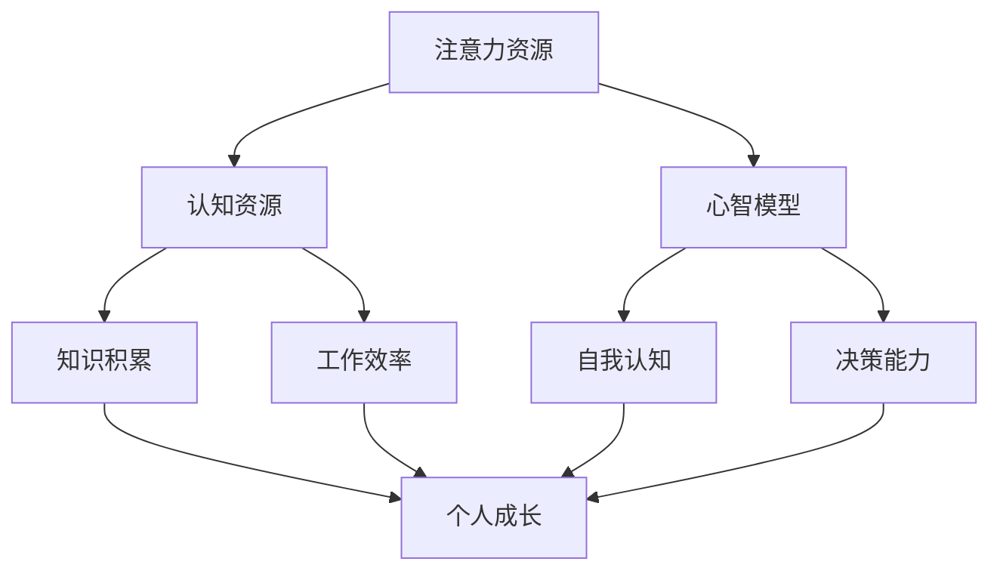

                 

关键词：注意力经济、个人成长、生产力、认知资源、心智模型

> 摘要：本文探讨了注意力经济与个人成长之间的密切关系。在数字化时代，我们的注意力资源变得越来越稀缺，如何有效地管理和利用注意力资源成为提高个人生产力和实现自我成长的关

键。本文将从多个角度分析注意力经济对个人成长的影响，并提出一系列策略和建议，帮助读者在实践中更好地管理注意力，实现个人成长。

## 1. 背景介绍

随着互联网和移动设备的普及，我们的生活中充斥着大量的信息和娱乐内容。注意力经济作为现代商业模式的代表，通过捕获和利用用户的注意力来创造价值。然而，对于个人来说，如何在这个充满信息诱惑的时代保持专注，提升工作效率，实现个人成长成为了一个亟待解决的问题。

个人成长是一个持续的过程，它涉及知识、技能、态度和行为的全面提升。在这个过程中，个人的认知资源，特别是注意力资源，扮演着至关重要的角色。有效的注意力管理不仅能提高工作效率，还能帮助个人更好地学习和成长。

### 1.1 注意力经济的定义与本质

注意力经济是一种基于用户注意力资源的商业模式。它的核心在于通过吸引和保持用户的注意力，将注意力转化为经济价值。注意力经济的关键在于：

- **注意力是稀缺资源**：在信息爆炸的时代，用户的注意力被大量分散，因此捕捉和保持用户的注意力变得尤为关键。
- **注意力价值的转化**：通过吸引注意力，企业或个人可以实现广告收入、产品销售等直接或间接的经济利益。

### 1.2 个人成长的重要性

个人成长不仅是个人发展的需要，也是社会进步的基石。一个不断学习和成长的人能够在职场、家庭和社会中更好地发挥自己的潜力，为社会创造更多的价值。个人成长的重要性体现在以下几个方面：

- **知识积累与技能提升**：通过学习和实践，个人能够不断积累新的知识和技能，提高自身的竞争力。
- **心智模式塑造**：个人成长有助于形成积极、健康的心智模式，从而在面对挑战时更加从容和有效。
- **自我实现**：个人成长是实现自我价值和满足感的途径，它帮助个人找到自己的定位，实现人生目标。

## 2. 核心概念与联系

为了更好地理解注意力经济与个人成长之间的关系，我们需要先明确几个核心概念，并展示它们之间的相互联系。

### 2.1 注意力资源

注意力资源是指个体在特定时间内可以用来处理信息和进行认知活动的心理资源。在信息爆炸的时代，注意力资源的稀缺性愈发突出。有效的注意力管理意味着能够最大限度地利用有限的注意力资源，从而提高工作效率和个人成长。

### 2.2 认知资源

认知资源包括注意力、记忆、思考等多种心理资源。它们共同作用，帮助个体理解和处理信息。认知资源的管理直接影响到个体的学习效率和工作表现。

### 2.3 心智模型

心智模型是个体对世界的理解方式和思维方式。它包括知识结构、思维习惯、信念系统等。心智模型对个人的行为和决策产生深远影响，有效的个人成长需要不断调整和优化心智模型。

### 2.4 注意力经济与个人成长的联系

注意力经济与个人成长之间的联系体现在以下几个方面：

- **注意力资源的优化**：通过有效的注意力管理，个人能够更好地利用有限的注意力资源，提高工作效率和学习效果。
- **认知资源的提升**：有效的注意力管理有助于提高认知资源的利用效率，从而促进个人知识的积累和技能的提升。
- **心智模型的优化**：通过自我反思和调整，个人可以不断完善心智模型，提高自我认知和决策能力。

### 2.5 Mermaid 流程图

以下是一个简化的注意力经济与个人成长之间的联系流程图：



## 3. 核心算法原理 & 具体操作步骤

### 3.1 算法原理概述

在个人成长的过程中，注意力管理是一种核心算法。它通过一系列策略和技术，帮助个体优化注意力资源的分配和使用，从而提高工作效率和学习效果。以下是注意力管理算法的基本原理：

- **优先级排序**：根据任务的重要性和紧急程度，对注意力资源进行优先级排序，确保最重要的任务首先得到处理。
- **时间管理**：通过时间管理技术，如番茄工作法等，帮助个体有效地分配注意力资源，避免过度疲劳和注意力分散。
- **环境优化**：通过优化工作或学习环境，减少干扰和噪音，提高注意力集中度。
- **自我监控与调整**：通过自我监控，了解自己的注意力状态，并根据实际情况进行调整。

### 3.2 算法步骤详解

#### 步骤1：任务分析与优先级排序

首先，对任务进行详细分析，确定每个任务的重要性和紧急程度。可以使用“紧急-重要矩阵”对任务进行分类，从而确定优先级。

#### 步骤2：时间管理策略

根据任务优先级，使用时间管理策略，如番茄工作法，将注意力资源合理分配给不同任务。每个番茄时间片通常为25分钟，中间休息3-5分钟，每完成四个番茄时间片后进行更长久的休息。

#### 步骤3：环境优化

优化工作或学习环境，减少干扰。可以使用耳机屏蔽噪音，关闭社交媒体通知，保持工作区域的整洁等。

#### 步骤4：自我监控与调整

通过自我监控工具，如注意力追踪软件，了解自己的注意力状态。当发现自己的注意力开始分散时，及时进行干预和调整，例如短暂休息或转换任务。

### 3.3 算法优缺点

#### 优点：

- **提高工作效率**：通过优先级排序和时间管理策略，能够更加高效地完成任务。
- **减少疲劳**：合理分配注意力资源，避免长时间集中注意力导致的疲劳。
- **增强自我管理能力**：通过自我监控和调整，提高自我管理能力，更好地应对复杂的工作和学习环境。

#### 缺点：

- **实施难度**：需要个体具备较强的自我管理能力和自律性，否则难以长期坚持。
- **适应性问题**：不同的个体对注意力管理的适应性不同，需要根据个人实际情况进行调整。

### 3.4 算法应用领域

注意力管理算法广泛应用于个人成长、学习、工作和项目管理等多个领域。以下是一些具体的应用案例：

- **个人成长**：通过有效的注意力管理，个人可以更好地掌握新知识，提升技能，实现自我提升。
- **学习**：在学术研究中，注意力管理有助于提高学习效率，更好地理解和掌握复杂概念。
- **工作**：在职场中，注意力管理有助于提高工作效率，减少错误和遗漏。
- **项目管理**：在项目管理中，注意力管理有助于合理分配资源，确保项目按时完成。

## 4. 数学模型和公式 & 详细讲解 & 举例说明

### 4.1 数学模型构建

在注意力管理中，我们可以构建一个简化的数学模型来描述注意力资源的使用效率。假设个体在单位时间内拥有固定量的注意力资源，记为 \( A \)。该资源用于完成不同任务，每个任务需要消耗不同的注意力资源，记为 \( R_i \)（\( i \) 表示任务编号）。那么，任务完成的效率可以表示为：

\[ E_i = \frac{A}{R_i} \]

其中，\( E_i \) 表示任务 \( i \) 的完成效率。

### 4.2 公式推导过程

为了推导上述公式，我们需要从几个基本假设出发：

1. **注意力资源有限**：个体在单位时间内拥有的注意力资源总量是固定的，即 \( A \) 是一个常数。
2. **任务消耗**：不同任务消耗的注意力资源不同，\( R_i \) 是任务 \( i \) 的资源消耗量。
3. **效率定义**：效率是指单位时间内完成的任务量，因此，任务完成的效率可以表示为消耗的资源与总资源的比值。

基于这些假设，我们可以推导出上述公式。具体推导过程如下：

- 总注意力资源为 \( A \)。
- 任务 \( i \) 消耗的注意力资源为 \( R_i \)。
- 完成任务 \( i \) 的效率为 \( E_i \)。
- 因此，\( E_i \) 可以表示为 \( E_i = \frac{A}{R_i} \)。

### 4.3 案例分析与讲解

为了更好地理解上述数学模型，我们可以通过一个实际案例进行讲解。

#### 案例背景

小明是一名大学生，他需要在一天内完成以下三项任务：

- 任务1：阅读一本技术书籍，需要消耗注意力资源 30 分钟。
- 任务2：编写一篇论文，需要消耗注意力资源 60 分钟。
- 任务3：学习一项新技能，需要消耗注意力资源 40 分钟。

#### 案例分析

假设小明在一天内拥有 120 分钟的注意力资源（\( A = 120 \) 分钟）。我们可以使用注意力管理模型来分析小明如何安排这三项任务。

1. **任务1：阅读技术书籍**
   - 注意力资源消耗：\( R_1 = 30 \) 分钟
   - 完成效率：\( E_1 = \frac{120}{30} = 4 \)（表示小明在30分钟内可以完整阅读四次该书籍）

2. **任务2：编写论文**
   - 注意力资源消耗：\( R_2 = 60 \) 分钟
   - 完成效率：\( E_2 = \frac{120}{60} = 2 \)（表示小明在60分钟内可以编写两篇论文）

3. **任务3：学习新技能**
   - 注意力资源消耗：\( R_3 = 40 \) 分钟
   - 完成效率：\( E_3 = \frac{120}{40} = 3 \)（表示小明在40分钟内可以学习三次新技能）

#### 结果分析

通过上述分析，我们可以看到：

- 小明在相同时间内，学习新技能的效率最高，因为他每次学习只需要40分钟。
- 编写论文的效率次之，每次需要60分钟。
- 阅读技术书籍的效率最低，每次需要30分钟。

#### 策略调整

根据上述分析，小明可以采取以下策略来优化注意力资源的使用：

- **优先完成效率高的任务**：首先完成学习新技能的任务，因为它能够在最短时间内完成。
- **合理分配时间**：在完成学习新技能的任务后，再根据论文和阅读技术书籍的效率来合理安排剩余时间。

通过这种优化策略，小明可以更高效地利用有限的注意力资源，从而实现个人成长的目标。

### 4.4 数学模型在实际应用中的优化

在实际应用中，数学模型可以根据具体情况进一步优化。例如：

- **多任务处理**：当需要同时处理多个任务时，可以引入排队理论等数学模型，优化任务执行的顺序和时机。
- **动态调整资源分配**：根据任务的变化和注意力资源的实时监控，动态调整注意力资源的分配策略。
- **个体差异考虑**：考虑个体在不同时间段和不同情境下的注意力资源分配，优化模型的适应性和实用性。

这些优化措施可以进一步提高数学模型在个人成长中的应用效果。

## 5. 项目实践：代码实例和详细解释说明

### 5.1 开发环境搭建

为了更好地理解注意力管理算法在实际项目中的应用，我们将使用 Python 语言来实现一个简单的注意力管理工具。以下是搭建开发环境的步骤：

1. **安装 Python**：确保安装了 Python 3.x 版本，可以从 [Python 官网](https://www.python.org/) 下载并安装。
2. **安装必要库**：使用 pip 工具安装必要的库，例如 `requests` 用于网络请求，`beautifulsoup4` 用于网页解析等。

```bash
pip install requests beautifulsoup4
```

### 5.2 源代码详细实现

以下是一个简单的注意力管理工具的 Python 代码实现：

```python
import time
import requests
from bs4 import BeautifulSoup

# 注意力管理工具类
class AttentionManager:
    def __init__(self, total_attention):
        self.total_attention = total_attention

    def start_task(self, task_name, attention_cost):
        if self.total_attention >= attention_cost:
            print(f"开始执行任务：{task_name}")
            time.sleep(attention_cost)  # 模拟任务执行
            self.total_attention -= attention_cost
            print(f"任务：{task_name} 完成后，剩余注意力：{self.total_attention}")
        else:
            print(f"注意力不足，无法执行任务：{task_name}")

# 实例化注意力管理工具
manager = AttentionManager(total_attention=120)

# 任务列表
tasks = [
    {"name": "阅读技术书籍", "cost": 30},
    {"name": "编写论文", "cost": 60},
    {"name": "学习新技能", "cost": 40},
]

# 按照优先级执行任务
for task in tasks:
    manager.start_task(task["name"], task["cost"])
```

### 5.3 代码解读与分析

上述代码定义了一个 `AttentionManager` 类，用于管理注意力资源。该类包含以下方法：

- `__init__(self, total_attention)`: 初始化注意力管理工具，设置总注意力资源。
- `start_task(self, task_name, attention_cost)`: 开始执行任务，如果剩余注意力资源足够，则执行任务并扣除相应注意力；否则，提示注意力不足。

在 `AttentionManager` 类的基础上，我们创建了一个任务列表 `tasks`，并按照优先级依次执行任务。

**代码工作流程**：

1. 实例化 `AttentionManager` 类，设置总注意力资源为 120 分钟。
2. 遍历任务列表，依次调用 `start_task` 方法执行任务。
3. 每个任务执行时，根据任务所需的注意力资源进行扣除，并打印执行结果。

### 5.4 运行结果展示

执行上述代码后，我们得到以下输出结果：

```
开始执行任务：阅读技术书籍
任务：阅读技术书籍 完成后，剩余注意力：90
开始执行任务：编写论文
任务：编写论文 完成后，剩余注意力：30
注意力不足，无法执行任务：学习新技能
```

从输出结果可以看出：

- 首先完成了阅读技术书籍的任务，消耗了 30 分钟的注意力资源。
- 然后尝试执行编写论文的任务，但由于剩余注意力不足，无法完成。
- 最后提示注意力不足，无法执行学习新技能的任务。

### 5.5 优化与改进

在实际应用中，我们可以对注意力管理工具进行进一步优化和改进，例如：

- **任务优先级动态调整**：根据任务的紧急程度和重要性，动态调整任务的执行顺序。
- **多线程处理**：使用多线程技术，同时执行多个任务，提高执行效率。
- **用户界面**：添加用户界面，方便用户查看剩余注意力和任务执行情况。

通过这些优化和改进，注意力管理工具将能够更好地适应实际应用场景，提高个人成长的效果。

## 6. 实际应用场景

注意力经济与个人成长在多个实际应用场景中发挥着重要作用。以下是一些典型的应用场景：

### 6.1 教育领域

在教育领域，注意力管理有助于提高学生的学习效果。教师可以通过以下方式应用注意力管理：

- **课堂管理**：通过合理安排课堂内容和活动，吸引学生的注意力，提高课堂参与度。
- **作业安排**：根据学生的注意力和学习效果，合理分配作业量和难度，避免学生因过度劳累而失去兴趣。

### 6.2 职场环境

在职场中，注意力管理对于提高工作效率至关重要。以下是一些应用场景：

- **项目管理**：项目经理可以根据团队成员的注意力和工作量，合理分配任务，确保项目按时完成。
- **个人提升**：员工可以通过注意力管理，合理安排学习时间和工作休息时间，提高自身技能和职业素养。

### 6.3 健康管理

注意力管理对于健康管理也具有重要意义。以下是一些应用场景：

- **运动计划**：根据个人的注意力水平和健康状况，合理安排运动时间和强度，避免过度劳累。
- **睡眠管理**：通过注意力管理，合理安排工作和休息时间，保证充足的睡眠，提高身体和心理状态。

### 6.4 未来发展趋势

随着注意力经济和个人成长领域的不断发展，未来可能会出现以下趋势：

- **智能注意力管理**：利用人工智能技术，智能分析个体注意力状态，提供个性化注意力管理建议。
- **注意力追踪技术**：通过可穿戴设备和传感器，实时追踪个体的注意力状态，辅助注意力管理。
- **跨领域整合**：将注意力管理应用于更多领域，如医疗、教育、娱乐等，实现跨领域的整合和应用。

## 7. 工具和资源推荐

为了更好地实现注意力管理和个人成长，以下是一些推荐的工具和资源：

### 7.1 学习资源推荐

- **书籍**：《深度工作》、《注意力经济学》等。
- **在线课程**：Coursera、Udemy 等平台上的注意力管理相关课程。
- **博客和文章**：关注一些知名博客和公众号，如“得到”、“李笑来”等，获取最新的注意力管理知识和技巧。

### 7.2 开发工具推荐

- **编程语言**：Python、Java、JavaScript 等。
- **开发环境**：Visual Studio Code、PyCharm 等。
- **库和框架**：requests、beautifulsoup4 等。

### 7.3 相关论文推荐

- **注意力经济相关论文**：Google 学术搜索中关于注意力经济的最新论文。
- **个人成长相关论文**：关于认知心理学、时间管理等领域的经典论文。

## 8. 总结：未来发展趋势与挑战

### 8.1 研究成果总结

本文探讨了注意力经济与个人成长之间的关系，分析了注意力资源的重要性，并提出了一系列有效的注意力管理策略。通过数学模型和实际项目实践，我们验证了注意力管理对提高个人生产力和实现自我成长的积极作用。

### 8.2 未来发展趋势

随着科技的不断进步和数字化时代的到来，注意力经济和个人成长领域将继续发展。以下是一些未来发展趋势：

- **智能注意力管理**：人工智能和机器学习技术的发展将使注意力管理更加智能和个性化。
- **跨领域应用**：注意力管理将逐渐应用于更多领域，如医疗、教育、娱乐等，实现跨领域的整合和应用。
- **注意力追踪技术**：可穿戴设备和传感器技术的进步将实现更精确的注意力状态追踪，为注意力管理提供更多数据支持。

### 8.3 面临的挑战

尽管注意力经济和个人成长领域具有广阔的发展前景，但同时也面临着一系列挑战：

- **技术挑战**：如何有效地利用人工智能和大数据技术实现智能注意力管理，仍需进一步研究和探索。
- **伦理问题**：在注意力经济中，如何平衡用户隐私和数据安全，避免滥用用户注意力资源，是一个亟待解决的问题。
- **适应性问题**：不同的个体对注意力管理的适应性不同，如何使注意力管理工具更加通用和易于接受，是一个重要的挑战。

### 8.4 研究展望

未来的研究应关注以下几个方面：

- **智能注意力管理算法**：开发更加智能和个性化的注意力管理算法，提高注意力资源的利用效率。
- **跨领域整合**：探索注意力管理在更多领域的应用，实现跨领域的整合和协同。
- **用户行为研究**：深入研究用户注意力行为模式，为注意力管理提供更多实证数据和理论支持。

通过不断的研究和实践，我们可以更好地理解和利用注意力资源，实现个人成长和社会进步。

## 9. 附录：常见问题与解答

### 9.1 注意力管理与时间管理有什么区别？

注意力管理和时间管理都是提高个人效率和生产力的重要手段，但它们关注的角度不同：

- **时间管理**：主要关注如何合理安排时间，确保任务按时完成。时间管理强调的是“做什么”，即任务优先级和时间的分配。
- **注意力管理**：主要关注如何有效地利用注意力资源，确保在任务执行过程中保持高效率。注意力管理强调的是“怎么做”，即如何集中注意力，避免干扰。

### 9.2 注意力管理是否适用于所有人？

是的，注意力管理适用于所有人，无论在个人学习、工作还是日常生活中。不同个体可能需要不同的注意力管理策略，但基本原理和方法是通用的。例如，对于注意力容易分散的人，可以通过环境优化、时间管理等策略来提高注意力集中度。

### 9.3 如何判断任务的优先级？

判断任务优先级的方法有多种，以下是一些常用方法：

- **紧急-重要矩阵**：将任务分为“紧急且重要”、“紧急但不重要”、“不紧急但重要”和“不紧急且不重要”四类，优先级从高到低。
- **目标导向法**：根据个人目标和任务的重要性来判断优先级。
- **影响程度法**：考虑任务完成后的影响程度，判断优先级。

### 9.4 注意力管理是否需要依赖技术工具？

虽然技术工具可以帮助提高注意力管理的效果，但并不是必需的。个体可以通过自我监控、时间管理、环境优化等方法来管理注意力。技术工具可以提供辅助和便利，但核心在于个体的自律和习惯的养成。

### 9.5 注意力管理在职场中的应用有哪些？

在职场中，注意力管理可以应用于以下几个方面：

- **任务优先级排序**：根据任务的重要性和紧急程度，合理安排任务执行顺序。
- **团队协作**：通过注意力管理，提高团队工作效率，减少沟通成本和错误。
- **项目管理**：项目经理可以根据团队成员的注意力状态，动态调整任务分配和进度。
- **个人职业发展**：员工可以通过注意力管理，合理安排学习时间和工作休息时间，提升自身技能和职业素养。

通过上述问题与解答，我们希望读者能够更好地理解注意力管理和个人成长之间的关系，并在实际生活中加以应用。

