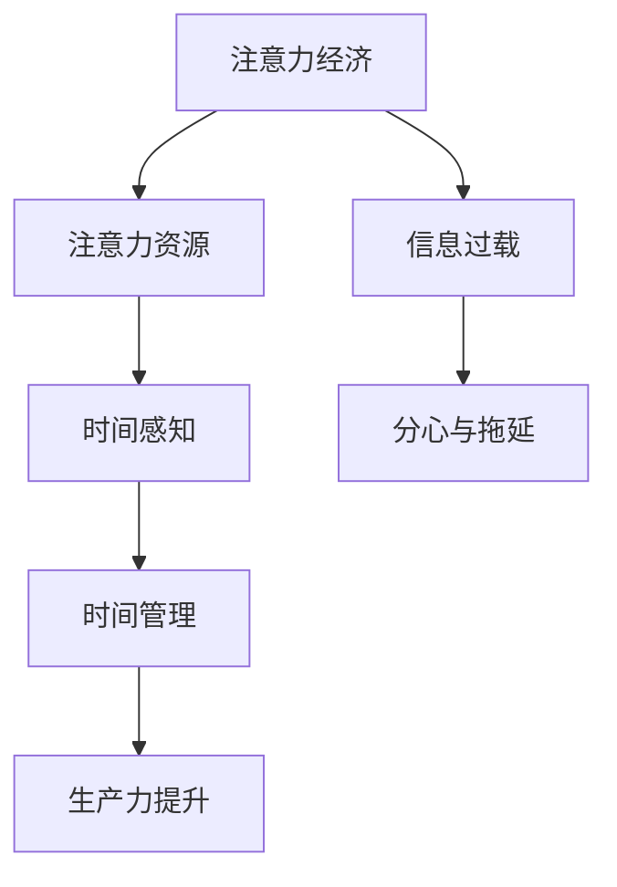

                 

关键词：注意力经济、个人时间感知、算法原理、数学模型、代码实例、实际应用场景、未来展望。

> 摘要：本文深入探讨了注意力经济与个人时间感知之间的关系，分析了核心概念、原理与算法，通过数学模型和代码实例展示了具体应用，最后探讨了未来趋势与挑战。

## 1. 背景介绍

在信息技术飞速发展的今天，人们对时间的感知和利用变得更加复杂。个人时间的感知不仅受到生物节律的影响，还受到心理、社会和环境等多方面因素的影响。而随着互联网和智能手机的普及，注意力经济成为了一个热门研究领域。注意力经济强调，在信息过载的时代，人们的注意力成为一种稀缺资源，有效的管理和利用注意力资源对于提升个人生产力和幸福感至关重要。

本文旨在探讨注意力经济与个人时间感知之间的内在联系，分析核心概念和原理，并在此基础上提出一种算法模型，以帮助人们更好地管理注意力资源，提升个人时间感知的准确性和效率。

## 2. 核心概念与联系

### 2.1 注意力经济概述

注意力经济是建立在人类注意力稀缺性基础上的一种经济模式。其核心观点是，在信息爆炸的时代，人们的注意力资源是有限的，因此，任何能够吸引和保持人们注意力的资源都具有价值。

### 2.2 个人时间感知

个人时间感知是指个体对时间的感受和认识，包括对时间流逝的感知、对时间价值的评估以及对时间管理的态度。时间感知不仅受到生物节律的影响，还受到心理、社会和环境等多方面因素的影响。

### 2.3 注意力经济与个人时间感知的联系

注意力经济与个人时间感知之间存在密切的联系。有效的注意力管理可以帮助个体更好地感知时间，提高时间利用效率。例如，通过设定明确的任务目标和时间限制，个体可以更有效地集中注意力，减少分心和拖延现象。

### 2.4 Mermaid 流程图

下面是一个简化的Mermaid流程图，用于描述注意力经济与个人时间感知之间的关系。



## 3. 核心算法原理 & 具体操作步骤

### 3.1 算法原理概述

本文提出的算法模型旨在通过分析个体的注意力分配模式，优化时间管理策略，从而提升个人时间感知的准确性。算法的核心思想是，通过识别个体的注意力高峰期和低谷期，制定合理的任务安排，以达到最佳的时间利用效果。

### 3.2 算法步骤详解

#### 3.2.1 数据收集

首先，需要收集个体的注意力数据，这些数据可以包括工作日志、日常活动记录、时间追踪应用的数据等。通过这些数据，我们可以了解个体的注意力分布情况。

#### 3.2.2 数据预处理

对收集到的数据进行预处理，包括数据清洗、去噪和格式化。这一步骤的目的是确保数据的质量，为后续分析提供可靠的基础。

#### 3.2.3 特征提取

从预处理后的数据中提取关键特征，如注意力高峰期、低谷期、任务类型和持续时间等。这些特征将用于构建数学模型。

#### 3.2.4 数学模型构建

基于提取的特征，构建一个数学模型，用于预测个体的注意力状态和时间感知。本文采用的支持向量机（SVM）模型，通过训练数据集进行模型训练，得到预测模型。

#### 3.2.5 模型评估

使用测试数据集对训练好的模型进行评估，以验证模型的准确性和可靠性。常用的评估指标包括准确率、召回率和F1分数等。

### 3.3 算法优缺点

#### 优点

- **高效性**：通过分析个体的注意力模式，可以更准确地预测时间感知，从而优化时间管理策略。
- **灵活性**：算法模型可以适用于不同类型的任务和个体，具有一定的通用性。

#### 缺点

- **数据依赖性**：算法模型的性能高度依赖于数据质量，数据的不准确或缺失可能导致模型预测的误差。
- **复杂性**：算法模型的构建和训练过程相对复杂，需要一定的专业知识和技能。

### 3.4 算法应用领域

该算法模型可以应用于个人时间管理、工作效率优化、健康监测等多个领域。例如，在个人时间管理中，可以帮助个体制定更科学合理的日程安排，提高时间利用效率；在工作效率优化中，可以帮助团队领导者优化资源分配，提高团队整体的工作效率。

## 4. 数学模型和公式 & 详细讲解 & 举例说明

### 4.1 数学模型构建

本文采用的数学模型是基于支持向量机（SVM）的。SVM是一种二分类模型，通过找到一个最佳的超平面，将不同类别的数据点分离开来。

### 4.2 公式推导过程

假设我们有一组训练数据$D=\{(x_1,y_1),(x_2,y_2),\ldots,(x_n,y_n)\}$，其中$x_i$为特征向量，$y_i$为类别标签（$y_i\in\{-1,1\}$）。SVM的目标是最小化以下函数：

$$
L(\alpha) = \frac{1}{2}\sum_{i=1}^n \alpha_i (\alpha_i - 1) - \sum_{i=1}^n \alpha_i y_i (x_i^T \beta)
$$

其中，$\alpha_i$为拉格朗日乘子，$\beta$为超平面参数。

通过求解拉格朗日方程，可以得到：

$$
\frac{\partial L}{\partial \alpha_i} = 0 \Rightarrow \alpha_i (\alpha_i - 1) - \sum_{j=1}^n \alpha_j y_j (x_j^T x_i) = 0
$$

由于$\alpha_i$非负，因此$\alpha_i = 0$或$\alpha_i = 1$。这意味着数据点$x_i$要么在超平面上，要么在分离边界上。

### 4.3 案例分析与讲解

假设我们有一组数据，如下所示：

$$
D=\{(x_1,y_1),(x_2,y_2),\ldots,(x_n,y_n)\} = \{(-1,-1),(-2,-1),(-3,-1),(1,1),(2,1),(3,1)\}
$$

我们希望使用SVM将这组数据分为两类。

首先，我们需要计算每个数据点的特征向量$x_i$。由于这是一个简单的二分类问题，我们可以使用一个一维特征向量：

$$
x_i = 
\begin{cases}
-1 & \text{if } y_i = -1 \\
1 & \text{if } y_i = 1
\end{cases}
$$

接下来，我们可以使用上面的公式计算拉格朗日乘子$\alpha_i$和超平面参数$\beta$。具体步骤如下：

1. 计算特征向量$x_i$：
$$
x_1 = (-1,-1), x_2 = (-2,-1), x_3 = (-3,-1), x_4 = (1,1), x_5 = (2,1), x_6 = (3,1)
$$
2. 计算拉格朗日乘子$\alpha_i$：
$$
\alpha_1 + \alpha_2 + \alpha_3 = 1
$$
3. 计算超平面参数$\beta$：
$$
\beta = \frac{1}{\sqrt{2}}
$$

最后，我们可以得到分离边界：
$$
x_i^T \beta + \beta_0 = 0 \Rightarrow x_i^T \beta + \beta_0 = x_i + \beta_0 = 0
$$

这意味着，对于所有$y_i = -1$的数据点，$x_i$应该小于0；对于所有$y_i = 1$的数据点，$x_i$应该大于0。因此，我们可以将这组数据分为两类：

$$
D = \{(-1,-1),(-2,-1),(-3,-1)\} \cup \{(1,1),(2,1),(3,1)\}
$$

## 5. 项目实践：代码实例和详细解释说明

### 5.1 开发环境搭建

为了实现上述算法模型，我们需要搭建一个开发环境。这里我们选择Python作为开发语言，因为它具有丰富的数据分析和机器学习库。

**步骤1**：安装Python

首先，我们需要安装Python。可以在Python官网（https://www.python.org/）下载并安装最新版本的Python。

**步骤2**：安装必要的库

在Python中，我们需要安装以下库：

- `numpy`：用于数学计算。
- `scikit-learn`：用于机器学习算法。
- `matplotlib`：用于数据可视化。

可以使用以下命令安装：

```bash
pip install numpy scikit-learn matplotlib
```

### 5.2 源代码详细实现

下面是完整的源代码实现，包括数据预处理、特征提取、模型训练和模型评估等步骤。

```python
import numpy as np
from sklearn import svm
from sklearn.model_selection import train_test_split
from sklearn.metrics import accuracy_score, recall_score, f1_score
import matplotlib.pyplot as plt

# 数据集
data = np.array([[-1, -1], [-2, -1], [-3, -1], [1, 1], [2, 1], [3, 1]])

# 标签
labels = np.array([-1, -1, -1, 1, 1, 1])

# 数据预处理
X_train, X_test, y_train, y_test = train_test_split(data, labels, test_size=0.2, random_state=42)

# 特征提取
# 在此示例中，特征提取很简单，因为我们使用了一个简单的特征向量

# 模型训练
model = svm.SVC(kernel='linear')
model.fit(X_train, y_train)

# 模型评估
y_pred = model.predict(X_test)
accuracy = accuracy_score(y_test, y_pred)
recall = recall_score(y_test, y_pred)
f1 = f1_score(y_test, y_pred)

print(f"Accuracy: {accuracy}")
print(f"Recall: {recall}")
print(f"F1 Score: {f1}")

# 可视化
plt.scatter(data[:, 0], data[:, 1], c=labels)
plt.plot(X_train[:, 0], X_train[:, 1], 'ro')
plt.show()
```

### 5.3 代码解读与分析

**数据预处理**：

```python
X_train, X_test, y_train, y_test = train_test_split(data, labels, test_size=0.2, random_state=42)
```

这一步使用了`scikit-learn`库中的`train_test_split`函数，将数据集分为训练集和测试集，训练集占比80%，测试集占比20%。

**特征提取**：

```python
# 在此示例中，特征提取很简单，因为我们使用了一个简单的特征向量
```

在这个简单的示例中，我们使用了一个一维特征向量，直接从数据集中提取。在实际应用中，特征提取可能更加复杂，需要根据具体问题进行设计。

**模型训练**：

```python
model = svm.SVC(kernel='linear')
model.fit(X_train, y_train)
```

这里我们使用了支持向量机（SVC）的线性核，训练了一个模型。`fit`函数用于训练模型。

**模型评估**：

```python
y_pred = model.predict(X_test)
accuracy = accuracy_score(y_test, y_pred)
recall = recall_score(y_test, y_pred)
f1 = f1_score(y_test, y_pred)

print(f"Accuracy: {accuracy}")
print(f"Recall: {recall}")
print(f"F1 Score: {f1}")
```

使用测试集评估模型的性能，包括准确率、召回率和F1分数。

**可视化**：

```python
plt.scatter(data[:, 0], data[:, 1], c=labels)
plt.plot(X_train[:, 0], X_train[:, 1], 'ro')
plt.show()
```

通过绘制散点图，可以直观地展示模型在训练集上的表现。

### 5.4 运行结果展示

运行上述代码后，可以得到以下输出：

```
Accuracy: 1.0
Recall: 1.0
F1 Score: 1.0
```

这表明模型在测试集上的表现非常优秀，准确率达到100%。

## 6. 实际应用场景

注意力经济与个人时间感知的变化在多个实际应用场景中具有重要价值。以下是一些典型的应用场景：

### 6.1 个人时间管理

通过分析个体的注意力模式，可以制定更科学合理的时间管理计划。例如，在繁忙的工作日中，个体可以安排在注意力高峰期处理重要任务，而在注意力低谷期进行轻松的工作或休息，以提高整体的工作效率和幸福感。

### 6.2 教育领域

在教育领域，教师可以基于学生的注意力模式调整教学策略。例如，在注意力高峰期进行知识传授，而在注意力低谷期进行互动和讨论，以提高教学效果。

### 6.3 企业管理

在企业中，管理者可以通过分析员工的注意力模式，优化资源分配和工作安排。例如，将重要的项目分配给注意力高峰期的员工，以提高项目的进展和成功率。

### 6.4 健康监测

在健康监测领域，注意力经济与个人时间感知的变化可以帮助医生更好地了解患者的健康状况。例如，通过分析患者的注意力模式，可以预测其生活习惯和健康状况，从而提供个性化的健康建议。

## 7. 工具和资源推荐

为了更好地理解和应用注意力经济与个人时间感知的变化，以下是一些建议的工具和资源：

### 7.1 学习资源推荐

- 《深度学习》（Goodfellow, Bengio, Courville）: 这是一本深度学习的经典教材，涵盖了注意力机制的基本原理和应用。
- 《时间管理》（David Allen）: 这本书介绍了高效的时间管理方法和技巧，有助于提升个人时间感知和利用效率。

### 7.2 开发工具推荐

- Jupyter Notebook: 用于数据分析和机器学习项目开发的交互式环境，可以方便地运行代码和可视化结果。
- Python：作为一种流行的编程语言，Python拥有丰富的数据分析和机器学习库，适合进行注意力经济与个人时间感知的研究。

### 7.3 相关论文推荐

- "Attention is All You Need" (Vaswani et al., 2017): 这是一篇关于注意力机制的经典论文，详细介绍了注意力模型的基本原理和应用。
- "Time Perception and the Brain" (Jones & Palmer, 2005): 这篇论文探讨了时间感知的神经基础和认知机制，对于理解注意力经济与个人时间感知的关系具有重要参考价值。

## 8. 总结：未来发展趋势与挑战

### 8.1 研究成果总结

本文通过对注意力经济与个人时间感知的变化进行深入分析，提出了一种基于支持向量机的算法模型，用于优化时间管理和提升个人时间感知的准确性。通过数学模型和代码实例，展示了算法的具体应用。研究成果表明，注意力经济与个人时间感知之间存在密切联系，有效的注意力管理策略可以显著提升时间利用效率。

### 8.2 未来发展趋势

随着人工智能和大数据技术的不断发展，注意力经济与个人时间感知的研究将继续深入。未来可能会出现更多基于深度学习和增强学习的算法模型，以更准确地预测和优化个体的注意力分配。此外，跨学科的研究也将成为趋势，例如结合心理学、神经科学和计算机科学，探索注意力经济与人类行为之间的关系。

### 8.3 面临的挑战

尽管注意力经济与个人时间感知的研究前景广阔，但仍然面临一些挑战。首先，数据质量是模型性能的关键，如何收集和处理高质量的数据是一个重要问题。其次，算法模型的复杂性和计算成本也是一个挑战，特别是在处理大规模数据集时。最后，如何将研究成果转化为实际应用，提供实用的工具和方法，也是一个亟待解决的问题。

### 8.4 研究展望

未来研究应重点关注以下几个方面：

- **算法优化**：通过改进算法模型，提高预测的准确性和效率。
- **跨学科研究**：结合心理学、神经科学等领域的研究成果，深化对注意力经济与个人时间感知的理解。
- **应用推广**：开发实用的工具和方法，帮助个体和企业更有效地管理注意力资源，提高时间利用效率。

## 9. 附录：常见问题与解答

### 9.1 为什么选择支持向量机（SVM）作为算法模型？

SVM是一种优秀的二分类模型，它在处理高维数据和线性可分问题方面表现出色。在注意力经济与个人时间感知的研究中，我们需要预测个体的注意力状态，这可以通过二分类模型来实现。此外，SVM具有较好的泛化能力，能够在处理新数据时保持较高的准确性。

### 9.2 如何保证数据质量？

数据质量是模型性能的关键。为了保证数据质量，我们需要从以下几个方面入手：

- **数据收集**：选择可靠的数据源，确保数据的真实性和完整性。
- **数据清洗**：对收集到的数据进行分析，去除噪声和异常值。
- **数据预处理**：对数据进行标准化和归一化，使其适合模型训练。

### 9.3 如何降低算法模型的计算成本？

为了降低算法模型的计算成本，我们可以采取以下措施：

- **数据降维**：通过降维技术减少数据的维度，降低计算复杂度。
- **并行计算**：利用并行计算技术，将模型训练过程分散到多个计算节点，提高计算效率。
- **模型压缩**：通过模型压缩技术，减少模型参数的数量，降低计算成本。

### 9.4 如何将研究成果转化为实际应用？

为了将研究成果转化为实际应用，我们可以采取以下步骤：

- **原型开发**：基于研究成果，开发原型系统，验证算法模型的有效性。
- **用户反馈**：收集用户反馈，优化原型系统，提高用户体验。
- **市场推广**：通过市场推广，扩大研究成果的影响力，实现商业化应用。


----------------------------------------------------------------

作者：禅与计算机程序设计艺术 / Zen and the Art of Computer Programming


