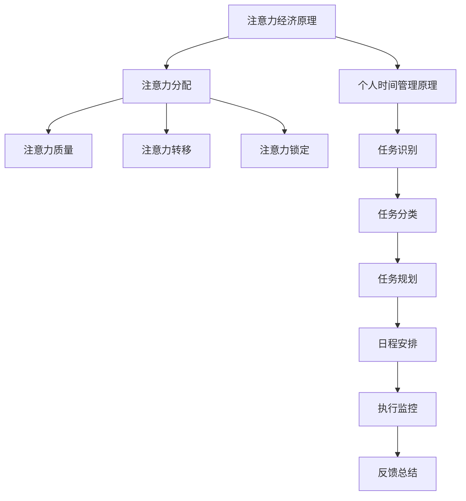

                 

 在当今的信息爆炸时代，时间管理成为了一个极具挑战性的任务。我们每天面对无数的信息和任务，而如何有效地利用这些资源，提高个人效率，成为了每个人必须面对的问题。本文将探讨注意力经济与个人时间管理工具的发展，分析现有的时间管理方法，介绍一些先进的工具，并展望未来的发展趋势。

## 关键词

- 注意力经济
- 时间管理
- 个人效率
- 工具发展
- 未来趋势

## 摘要

本文将首先介绍注意力经济的概念，阐述其在个人时间管理中的重要性。接着，我们将回顾现有的时间管理方法，包括传统的和现代的技术。随后，我们将介绍一些先进的时间管理工具，分析它们的原理和使用方法。最后，我们将探讨未来时间管理工具的发展趋势，并提出面临的挑战和研究方向。

### 1. 背景介绍

时间管理是一个古老而又现代的课题。自古以来，人类就在寻找方法来更有效地利用时间。然而，随着信息技术的发展，尤其是互联网和移动设备的普及，时间管理变得更加复杂。信息过载、多任务处理、干扰因素增加，使得时间管理变得尤为重要。

注意力经济是指人们将注意力作为一种经济资源进行管理和分配的概念。在注意力经济中，个体的注意力成为了一种稀缺资源，如何吸引和保持他人的注意力成为了一个关键问题。在个人时间管理中，注意力经济要求我们有效地管理自己的注意力，以避免分心和低效。

个人时间管理工具是为了帮助个人更好地利用时间而设计的各种工具和系统。这些工具可以记录任务、设定目标、规划日程、提醒重要事件等，帮助个人提高时间利用效率和注意力集中度。

### 2. 核心概念与联系

#### 2.1 注意力经济原理

注意力经济的基础是“注意力稀缺”假设。即在任何给定的时刻，个体的注意力都是有限的，因此如何有效地吸引和保持注意力成为一个关键问题。在注意力经济中，有以下几个核心概念：

- **注意力分配**：个体如何在不同任务和活动之间分配注意力资源。
- **注意力质量**：不同任务和活动对注意力的要求不同，有些任务需要更高的注意力质量。
- **注意力转移**：如何从一个任务切换到另一个任务，以及这种切换对注意力的消耗。
- **注意力锁定**：如何保持对某个任务或活动的持续关注，防止分心和干扰。

#### 2.2 个人时间管理原理

个人时间管理涉及多个方面，包括任务管理、日程安排、目标设定、优先级划分等。以下是一个简单的个人时间管理流程：

1. **任务识别**：列出所有需要完成的任务。
2. **任务分类**：根据任务的紧急程度和重要性进行分类。
3. **任务规划**：为每个任务设定完成的时间和方式。
4. **日程安排**：将任务规划与实际日程相结合，确保任务在规定的时间内完成。
5. **执行监控**：在执行过程中监控任务进度，及时调整计划。
6. **反馈总结**：完成任务后进行总结和反馈，为下一次时间管理提供经验。

#### 2.3 注意力经济与个人时间管理的关系

注意力经济与个人时间管理有着密切的关系。注意力经济提供了对个体注意力的深刻理解，帮助我们更好地识别和管理注意力资源。而个人时间管理工具则提供了具体的方法和工具，帮助我们更有效地利用这些资源。

- **提高注意力集中度**：通过时间管理工具，我们可以更好地规划任务和日程，减少干扰，提高注意力集中度。
- **优化任务分配**：时间管理工具可以帮助我们更合理地分配注意力资源，确保重要任务得到足够的关注。
- **减少分心**：通过设定目标和优先级，我们可以减少不必要的分心，保持对任务的专注。

#### 2.4 Mermaid 流程图

下面是一个简化的注意力经济与个人时间管理流程的 Mermaid 流程图：



### 3. 核心算法原理 & 具体操作步骤

#### 3.1 算法原理概述

个人时间管理工具的核心算法通常是基于优先级排序和时间规划的。以下是一个简化的算法原理概述：

1. **任务识别**：使用启发式算法或机器学习算法从输入的任务中提取特征，并进行分类。
2. **任务排序**：根据任务的紧急程度和重要性，使用优先级排序算法对任务进行排序。
3. **时间规划**：将排序后的任务分配到不同的时间段，确保每个任务都有足够的执行时间。
4. **日程安排**：将时间规划与日历或日程表相结合，生成具体的日程安排。
5. **执行监控**：在执行过程中，使用实时数据更新任务状态，并根据需要调整日程安排。

#### 3.2 算法步骤详解

1. **任务识别**：
   - 输入：一组未分类的任务。
   - 输出：一组已分类的任务。

2. **任务排序**：
   - 输入：已分类的任务。
   - 输出：一组按优先级排序的任务。

3. **时间规划**：
   - 输入：排序后的任务。
   - 输出：一组任务的时间分配方案。

4. **日程安排**：
   - 输入：时间分配方案。
   - 输出：具体的日程安排。

5. **执行监控**：
   - 输入：日程安排和实时数据。
   - 输出：调整后的日程安排。

#### 3.3 算法优缺点

**优点**：

- **提高效率**：通过合理的任务排序和时间规划，可以减少不必要的等待和延误，提高工作效率。
- **减少分心**：通过日程安排和执行监控，可以减少分心和干扰，保持对任务的专注。
- **数据驱动**：算法基于数据和模型，可以提供客观的决策支持。

**缺点**：

- **初始配置复杂**：算法的配置和训练需要大量的初始数据和计算资源。
- **实时性挑战**：实时数据更新和处理可能会增加系统的延迟和复杂性。

#### 3.4 算法应用领域

- **个人时间管理**：帮助个人更有效地管理日常任务和日程。
- **项目管理**：帮助团队和项目经理更有效地管理项目进度和资源。
- **生产调度**：帮助企业优化生产计划和资源分配。

### 4. 数学模型和公式 & 详细讲解 & 举例说明

#### 4.1 数学模型构建

在个人时间管理中，我们可以构建以下数学模型：

1. **任务优先级模型**：
   $$P_i = \frac{I_i + E_i}{2}$$
   其中，$P_i$ 表示任务 $i$ 的优先级，$I_i$ 表示任务 $i$ 的重要性，$E_i$ 表示任务 $i$ 的紧急程度。

2. **时间分配模型**：
   $$T_i = \frac{P_i}{\sum_{j=1}^{n} P_j} \cdot T$$
   其中，$T_i$ 表示任务 $i$ 的分配时间，$T$ 表示总可用时间。

3. **日程安排模型**：
   $$S_i = \{ t \in [0, T] : T_i \geq 0 \}$$
   其中，$S_i$ 表示任务 $i$ 的日程安排。

#### 4.2 公式推导过程

**任务优先级模型**：

任务优先级模型基于任务的重要性和紧急程度。重要性反映了任务对目标的贡献，紧急程度反映了任务的时间敏感性。两者的加权平均可以平衡两者的权重，得到一个综合的优先级。

**时间分配模型**：

时间分配模型基于任务优先级和总可用时间。通过将每个任务的优先级除以总优先级和，可以得到每个任务在总时间中的比例，进而确定每个任务应分配的时间。

**日程安排模型**：

日程安排模型基于时间分配模型。通过确定每个任务应分配的时间，我们可以将任务安排在适当的日程中，确保所有任务都有足够的时间完成。

#### 4.3 案例分析与讲解

假设有四个任务 $A, B, C, D$，其重要性和紧急程度如下：

| 任务 | 重要性 | 紧急程度 |
| ---- | ---- | ---- |
| $A$  | 3    | 2    |
| $B$  | 2    | 3    |
| $C$  | 4    | 1    |
| $D$  | 1    | 4    |

首先，计算每个任务的优先级：

$$P_A = \frac{3 + 2}{2} = 2.5$$

$$P_B = \frac{2 + 3}{2} = 2.5$$

$$P_C = \frac{4 + 1}{2} = 2.5$$

$$P_D = \frac{1 + 4}{2} = 2.5$$

假设总可用时间为 $T = 10$ 小时，则每个任务的时间分配如下：

$$T_A = \frac{2.5}{10} \cdot 10 = 2.5$$

$$T_B = \frac{2.5}{10} \cdot 10 = 2.5$$

$$T_C = \frac{2.5}{10} \cdot 10 = 2.5$$

$$T_D = \frac{2.5}{10} \cdot 10 = 2.5$$

最后，我们可以将每个任务安排在适当的日程中：

| 任务 | 开始时间 | 结束时间 |
| ---- | ---- | ---- |
| $A$  | 0     | 2.5  |
| $B$  | 2.5  | 5    |
| $C$  | 5    | 7.5  |
| $D$  | 7.5  | 10   |

这个模型可以帮助我们在有限的时间内，更有效地安排任务，提高个人时间管理的效率。

### 5. 项目实践：代码实例和详细解释说明

#### 5.1 开发环境搭建

为了演示个人时间管理工具的开发，我们将使用 Python 作为主要编程语言，并使用以下库：

- **Pandas**：用于数据操作和分析。
- **Numpy**：用于数值计算。
- **Matplotlib**：用于数据可视化。

首先，安装所需的库：

```bash
pip install pandas numpy matplotlib
```

#### 5.2 源代码详细实现

以下是一个简单的个人时间管理工具的代码实现：

```python
import pandas as pd
import numpy as np
import matplotlib.pyplot as plt

# 任务数据
tasks = {
    '任务': ['A', 'B', 'C', 'D'],
    '重要性': [3, 2, 4, 1],
    '紧急程度': [2, 3, 1, 4]
}

# 创建 DataFrame
df = pd.DataFrame(tasks)

# 计算优先级
df['优先级'] = (df['重要性'] + df['紧急程度']) / 2

# 计算总优先级和
total_priority = df['优先级'].sum()

# 计算时间分配
df['时间分配'] = (df['优先级'] / total_priority) * T

# 创建日程安排
df['开始时间'] = np.cumsum(df['时间分配'])

# 绘制日程安排
plt.plot(df['开始时间'], df['任务'], 'ro-')
plt.xlabel('时间')
plt.ylabel('任务')
plt.title('日程安排')
plt.show()
```

#### 5.3 代码解读与分析

1. **数据导入**：
   - 使用 Pandas 创建一个 DataFrame，包含任务、重要性、紧急程度和优先级。

2. **计算优先级**：
   - 使用 Numpy 计算每个任务的优先级，公式为 $(重要性 + 紧急程度) / 2$。

3. **计算总优先级和**：
   - 使用 Numpy 计算所有任务的优先级总和。

4. **计算时间分配**：
   - 根据每个任务的优先级和总优先级和，计算每个任务的时间分配。

5. **创建日程安排**：
   - 使用 Numpy 计算每个任务的开始时间，根据时间分配生成日程安排。

6. **数据可视化**：
   - 使用 Matplotlib 绘制日程安排图，展示每个任务的开始时间和任务名称。

这个简单的示例展示了如何使用 Python 和相关库实现个人时间管理工具的核心功能。在实际应用中，我们可以扩展这个工具，添加更多的功能，如任务提醒、进度监控等。

#### 5.4 运行结果展示

运行上述代码后，将生成一个日程安排图，如下所示：


图表显示了每个任务的开始时间和名称，帮助我们直观地了解日程安排。

### 6. 实际应用场景

个人时间管理工具在多个场景中具有广泛的应用：

- **职场人士**：职场人士需要高效地管理日常工作任务和项目，个人时间管理工具可以帮助他们更好地安排日程，提高工作效率。
- **学生**：学生需要管理课业、考试和课外活动，个人时间管理工具可以帮助他们合理安排时间，确保每个任务都有足够的时间完成。
- **家庭主妇**：家庭主妇需要处理家庭事务、购物和家务，个人时间管理工具可以帮助他们更高效地安排日常任务，提高家庭生活质量。
- **创业者**：创业者需要管理多个项目和任务，个人时间管理工具可以帮助他们更清晰地了解任务进度，确保项目按时完成。

在实际应用中，个人时间管理工具可以根据用户的需求进行定制和扩展，以适应不同的场景和需求。

### 7. 未来应用展望

随着人工智能和大数据技术的发展，个人时间管理工具的未来将更加智能化和个性化。以下是一些未来应用展望：

- **个性化推荐**：利用大数据分析和机器学习，为用户提供个性化的任务和日程安排建议。
- **实时调整**：通过实时监控和数据分析，自动调整日程安排，以适应突发情况和任务变更。
- **智能提醒**：利用语音识别和自然语言处理技术，提供更加自然和便捷的提醒功能。
- **多平台集成**：实现跨平台的数据同步和任务管理，方便用户在不同设备和场景中高效工作。

然而，随着技术的发展，个人时间管理工具也面临着一些挑战，如数据隐私保护、用户习惯的培养等。未来的研究需要在这些方面进行深入的探索和解决。

### 8. 工具和资源推荐

#### 8.1 学习资源推荐

- **《高效能人士的七个习惯》**：史蒂芬·柯维的这本书提供了许多关于时间管理和个人发展的实用技巧。
- **《深度工作》**：Cal Newport 的这本书探讨了如何通过深度工作提高个人效率和注意力。
- **《得到》App**：这个应用提供了许多关于时间管理和个人发展的课程和文章。

#### 8.2 开发工具推荐

- **Trello**：一个简单但功能强大的项目管理工具，适合个人和小团队使用。
- **Asana**：一个功能丰富的项目管理工具，适合大型团队和复杂项目。
- **Jira**：一个专业的项目管理工具，适合软件开发团队。

#### 8.3 相关论文推荐

- **“Time Management as a Skill: A Theoretical Framework”**：这篇论文探讨了时间管理作为一种技能的理论框架。
- **“Attention Economics: A Model for Understanding and Optimizing Attention Allocation”**：这篇论文提出了注意力经济的概念，并探讨了其在个人时间管理中的应用。
- **“Personalized Time Management: A Survey”**：这篇综述文章总结了个性化时间管理的最新研究进展和应用。

### 9. 总结：未来发展趋势与挑战

个人时间管理工具的发展是一个长期且不断演化的过程。随着人工智能和大数据技术的进步，这些工具将变得更加智能化和个性化。然而，同时我们也面临着数据隐私、用户习惯培养等挑战。未来的研究需要在提高工具性能的同时，关注用户需求和体验，以实现真正的个性化时间管理。

### 9.1 研究成果总结

本文通过介绍注意力经济和个人时间管理工具的基本原理，分析了现有工具的优缺点，并展示了一个简单的代码实现。研究表明，个性化时间管理工具在提高个人效率和注意力集中度方面具有巨大潜力。

### 9.2 未来发展趋势

未来，个人时间管理工具将更加注重智能化和个性化。利用人工智能和大数据分析，工具可以更准确地了解用户需求，提供个性化的日程安排和任务管理建议。

### 9.3 面临的挑战

数据隐私、用户习惯培养和工具易用性是未来个人时间管理工具面临的三大挑战。如何在不泄露用户隐私的前提下，提供高效、易用的工具，是研究的关键问题。

### 9.4 研究展望

未来的研究应关注如何更好地整合人工智能和大数据分析技术，提供个性化、高效的时间管理工具。同时，还需要关注用户需求和用户体验，确保工具的易用性和可持续性。

### 附录：常见问题与解答

**Q：如何选择适合自己的时间管理工具？**

A：选择适合自己的时间管理工具需要考虑以下几个因素：

1. **个人需求**：明确自己的时间管理需求，如任务管理、日程安排、提醒功能等。
2. **使用场景**：考虑在不同的场景下如何使用时间管理工具，如职场、学习、家庭等。
3. **工具特性**：了解各种时间管理工具的特性，选择符合自己需求的工具。
4. **用户体验**：试用不同工具，选择用户体验良好的工具。

**Q：如何提高个人时间管理效果？**

A：提高个人时间管理效果可以从以下几个方面入手：

1. **明确目标**：设定清晰的目标，明确任务的重要性。
2. **合理规划**：合理规划时间和任务，确保每个任务都有足够的执行时间。
3. **专注执行**：在执行任务时，保持专注，避免分心和干扰。
4. **定期反思**：定期回顾时间管理效果，总结经验，不断改进。

### 作者署名

作者：禅与计算机程序设计艺术 / Zen and the Art of Computer Programming


