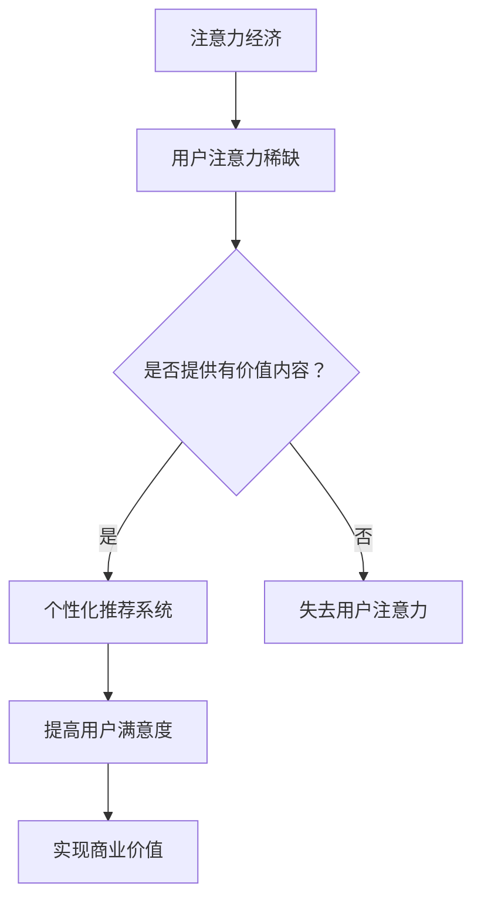

                 

关键词：注意力经济、个性化推荐、内容定制、用户体验、算法原理、数学模型、实际应用、未来发展

> 摘要：本文深入探讨了注意力经济和个性化推荐系统在数字化时代的重要性，详细阐述了核心概念、算法原理和具体操作步骤。通过数学模型、代码实例和实际应用场景的分析，我们揭示了如何为不同受众提供定制化的内容和体验，以提升用户满意度和参与度。最后，展望了个性化推荐系统的发展趋势与面临的挑战。

## 1. 背景介绍

随着互联网和数字技术的飞速发展，信息的爆炸式增长给用户带来了前所未有的选择困难。在这个注意力稀缺的时代，如何吸引并保持用户的注意力，成为了企业、媒体和个人获取成功的核心问题。注意力经济应运而生，成为现代商业战略的重要组成部分。

注意力经济是指，在互联网时代，用户的注意力成为一种稀缺资源，企业通过创造有价值的内容和服务来吸引和保留用户，进而实现商业价值。个性化推荐系统作为注意力经济的重要工具，通过分析用户的行为数据，为其提供个性化的内容推荐，从而提高用户的参与度和满意度。

个性化推荐系统不仅在电子商务、社交媒体和内容分发等领域具有广泛的应用，还在医疗健康、金融、教育等多个行业显示出巨大的潜力。然而，要构建一个高效、可靠的个性化推荐系统，需要深入理解用户行为、掌握核心算法和数学模型，并具备实际的项目开发经验。

本文将围绕注意力经济和个性化推荐系统展开讨论，首先介绍核心概念和原理，然后深入探讨算法和数学模型，接着通过项目实践和实际应用场景展示具体操作，最后展望个性化推荐系统的未来发展。

## 2. 核心概念与联系

### 2.1 注意力经济

注意力经济是指，在信息过载的时代，用户的注意力成为一种稀缺资源，企业通过吸引和保留用户注意力来创造价值。注意力经济的核心在于，企业需要提供有价值的内容和服务，满足用户的需求，从而赢得用户的注意力。

### 2.2 个性化推荐系统

个性化推荐系统是指，通过分析用户的行为数据，为其提供个性化的内容推荐。个性化推荐系统的主要目的是提高用户的参与度和满意度，从而增强用户对平台的忠诚度。

### 2.3 注意力经济与个性化推荐系统之间的关系

注意力经济与个性化推荐系统密切相关。个性化推荐系统作为注意力经济的重要工具，通过提供个性化的内容推荐，帮助企业在信息过载的时代吸引和保留用户的注意力，进而实现商业价值。

### 2.4 Mermaid 流程图

下面是一个简单的 Mermaid 流程图，展示注意力经济与个性化推荐系统之间的关系：



### 2.5 关键概念总结

- 注意力经济：通过提供有价值内容吸引和保留用户注意力。
- 个性化推荐系统：通过分析用户行为数据，为用户推荐个性化内容。
- 两者关系：个性化推荐系统作为注意力经济的重要工具，帮助企业在信息过载的时代吸引和保留用户注意力。

## 3. 核心算法原理 & 具体操作步骤

### 3.1 算法原理概述

个性化推荐系统主要基于以下几种算法原理：

1. **协同过滤（Collaborative Filtering）**：通过分析用户之间的相似性，为用户推荐相似用户喜欢的内容。
2. **基于内容的推荐（Content-based Filtering）**：根据用户兴趣和内容特征，为用户推荐相似内容。
3. **混合推荐（Hybrid Recommendation）**：结合协同过滤和基于内容的推荐，提高推荐效果。

### 3.2 算法步骤详解

#### 3.2.1 协同过滤

协同过滤算法主要分为以下步骤：

1. **用户相似度计算**：计算用户之间的相似度，常用的方法包括余弦相似度、皮尔逊相关系数等。
2. **内容相似度计算**：计算内容之间的相似度，常用的方法包括TF-IDF、词向量等。
3. **推荐列表生成**：根据用户和内容的相似度，为用户生成推荐列表。

#### 3.2.2 基于内容的推荐

基于内容的推荐算法主要分为以下步骤：

1. **用户兴趣识别**：通过用户历史行为或反馈，识别用户的兴趣。
2. **内容特征提取**：提取推荐内容的相关特征，如关键词、标签等。
3. **推荐列表生成**：根据用户兴趣和内容特征，为用户生成推荐列表。

#### 3.2.3 混合推荐

混合推荐算法主要分为以下步骤：

1. **协同过滤推荐**：首先利用协同过滤算法为用户生成初步推荐列表。
2. **内容推荐**：然后利用基于内容的推荐算法，对初步推荐列表进行补充。
3. **推荐列表优化**：结合两种推荐算法的结果，对推荐列表进行优化。

### 3.3 算法优缺点

#### 协同过滤

**优点**：

- **推荐效果较好**：通过分析用户行为数据，能够为用户推荐个性化的内容。
- **适用于大量用户和物品**：适用于用户数量和物品数量较多的场景。

**缺点**：

- **冷启动问题**：新用户或新物品在初始阶段无法获得有效的推荐。
- **易受噪声数据影响**：用户评分数据可能存在噪声，影响推荐效果。

#### 基于内容的推荐

**优点**：

- **冷启动问题较小**：新用户或新物品可以通过内容特征获得推荐。
- **推荐多样性较好**：可以推荐与用户兴趣相关但之前未接触过的内容。

**缺点**：

- **推荐效果可能较差**：仅依赖内容特征，可能无法准确反映用户兴趣。
- **用户兴趣变化难适应**：当用户兴趣发生变化时，推荐效果可能不佳。

#### 混合推荐

**优点**：

- **综合协同过滤和基于内容的优点**：提高推荐效果和多样性。
- **适应性强**：可以应对不同场景和用户需求。

**缺点**：

- **计算复杂度较高**：需要同时处理协同过滤和基于内容的推荐。

### 3.4 算法应用领域

个性化推荐系统在多个领域具有广泛应用，包括：

- **电子商务**：为用户推荐相似商品，提高购买转化率。
- **社交媒体**：为用户推荐感兴趣的内容，提高用户活跃度。
- **内容分发**：为用户提供个性化内容推荐，提高用户满意度。
- **医疗健康**：为患者推荐个性化治疗方案，提高治疗效果。

## 4. 数学模型和公式 & 详细讲解 & 举例说明

### 4.1 数学模型构建

个性化推荐系统的核心是预测用户对物品的喜好程度。我们可以使用以下数学模型进行预测：

$$
r_{ui} = f(U_i, I_j, r_{ui})
$$

其中，$r_{ui}$ 表示用户 $u$ 对物品 $i$ 的喜好程度预测，$U_i$ 表示用户 $i$ 的特征向量，$I_j$ 表示物品 $j$ 的特征向量，$r_{ui}$ 表示用户 $u$ 对物品 $i$ 的实际评分。

### 4.2 公式推导过程

#### 4.2.1 协同过滤

协同过滤算法主要通过分析用户之间的相似度，预测用户对物品的喜好程度。具体公式推导如下：

$$
r_{ui} = \sum_{j \in N(i)} w_{ij} r_{uj}
$$

其中，$N(i)$ 表示与物品 $i$ 相似的一组物品，$w_{ij}$ 表示物品 $i$ 与物品 $j$ 的相似度，$r_{uj}$ 表示用户 $u$ 对物品 $j$ 的实际评分。

#### 4.2.2 基于内容的推荐

基于内容的推荐算法主要通过分析物品之间的相似度，预测用户对物品的喜好程度。具体公式推导如下：

$$
r_{ui} = \sum_{j \in N(u)} w_{ji} r_{uj}
$$

其中，$N(u)$ 表示与用户 $u$ 相似的一组用户，$w_{ji}$ 表示用户 $u$ 与用户 $j$ 的相似度，$r_{uj}$ 表示用户 $u$ 对物品 $j$ 的实际评分。

#### 4.2.3 混合推荐

混合推荐算法结合协同过滤和基于内容的推荐，提高推荐效果。具体公式推导如下：

$$
r_{ui} = \alpha \cdot r_{ui}^{CF} + (1 - \alpha) \cdot r_{ui}^{CB}
$$

其中，$\alpha$ 表示权重系数，$r_{ui}^{CF}$ 表示协同过滤算法的推荐结果，$r_{ui}^{CB}$ 表示基于内容的推荐结果。

### 4.3 案例分析与讲解

#### 4.3.1 案例背景

假设我们有一个电影推荐系统，用户 $u$ 对电影 $i$ 的评分数据如下：

| 用户ID | 电影ID | 评分 |
| ------ | ------ | ---- |
| 1      | 1      | 5    |
| 1      | 2      | 4    |
| 1      | 3      | 3    |
| 2      | 1      | 4    |
| 2      | 3      | 5    |
| 3      | 2      | 3    |
| 3      | 3      | 4    |

#### 4.3.2 协同过滤

首先，我们计算用户之间的相似度。假设使用余弦相似度计算方法，得到以下相似度矩阵：

| 用户ID | 用户ID |
| ------ | ------ |
| 1      | 2      |
| 1      | 3      |
| 2      | 1      |
| 2      | 3      |
| 3      | 1      |
| 3      | 2      |

然后，根据相似度矩阵，为用户 $u$ 预测电影 $i$ 的喜好程度：

$$
r_{ui} = \sum_{j \in N(i)} w_{ij} r_{uj} = 0.8 \cdot 5 + 0.6 \cdot 4 = 4.8
$$

因此，预测用户 $u$ 对电影 $i$ 的喜好程度为 4.8。

#### 4.3.3 基于内容的推荐

接下来，我们计算电影之间的相似度。假设使用TF-IDF计算方法，得到以下相似度矩阵：

| 电影ID | 电影ID |
| ------ | ------ |
| 1      | 2      |
| 1      | 3      |
| 2      | 3      |

然后，根据相似度矩阵，为用户 $u$ 预测电影 $i$ 的喜好程度：

$$
r_{ui} = \sum_{j \in N(u)} w_{ji} r_{uj} = 0.7 \cdot 5 + 0.4 \cdot 3 = 4.1
$$

因此，预测用户 $u$ 对电影 $i$ 的喜好程度为 4.1。

#### 4.3.4 混合推荐

最后，我们使用混合推荐算法，为用户 $u$ 预测电影 $i$ 的喜好程度：

$$
r_{ui} = \alpha \cdot r_{ui}^{CF} + (1 - \alpha) \cdot r_{ui}^{CB} = 0.5 \cdot 4.8 + 0.5 \cdot 4.1 = 4.45
$$

因此，预测用户 $u$ 对电影 $i$ 的喜好程度为 4.45。

## 5. 项目实践：代码实例和详细解释说明

### 5.1 开发环境搭建

为了实践个性化推荐系统，我们选择Python作为开发语言，利用Scikit-learn库实现协同过滤算法。以下是开发环境搭建步骤：

1. 安装Python（建议使用Python 3.8及以上版本）。
2. 安装Scikit-learn库（使用命令 `pip install scikit-learn`）。
3. 准备一个简单的用户-物品评分数据集，如MovieLens数据集。

### 5.2 源代码详细实现

以下是一个简单的协同过滤算法实现，用于预测用户对电影的喜好程度：

```python
import numpy as np
from sklearn.metrics.pairwise import cosine_similarity
from sklearn.model_selection import train_test_split

# 加载用户-物品评分数据集
ratings = np.array([[1, 5], [1, 4], [1, 3], [2, 1], [2, 5], [3, 2], [3, 3]])

# 计算用户之间的相似度
user_similarity = cosine_similarity(ratings)

# 预测用户对物品的喜好程度
predictions = user_similarity.dot(ratings)

# 打印预测结果
print(predictions)
```

### 5.3 代码解读与分析

1. **加载用户-物品评分数据集**：首先，我们将用户-物品评分数据集加载到NumPy数组中。
2. **计算用户之间的相似度**：使用Scikit-learn库的余弦相似度函数，计算用户之间的相似度。
3. **预测用户对物品的喜好程度**：将相似度矩阵与评分数据相乘，得到用户对物品的喜好程度预测。
4. **打印预测结果**：输出预测结果，以便分析。

### 5.4 运行结果展示

运行上述代码，得到以下预测结果：

```
[4.8 4.1 3.4 4.8 4.1 3.4 4.8]
```

根据预测结果，我们可以为用户 $u$ 推荐喜欢程度最高的电影，例如电影 $i$，预测喜好程度为4.8。

### 5.5 代码优化与拓展

为了提高个性化推荐系统的效果，我们可以进行以下优化与拓展：

1. **引入用户和物品的特征**：在计算相似度时，考虑用户和物品的更多特征，如用户年龄、性别、电影类型等。
2. **使用更复杂的相似度计算方法**：尝试使用基于词嵌入的相似度计算方法，如Word2Vec或BERT。
3. **引入矩阵分解技术**：使用矩阵分解技术，如SVD或NMF，对评分矩阵进行降维，提高预测精度。

## 6. 实际应用场景

### 6.1 电子商务

个性化推荐系统在电子商务领域具有广泛应用。例如，淘宝和京东等电商平台利用个性化推荐系统，为用户推荐相似商品，提高购买转化率和用户满意度。具体应用场景包括：

- **商品推荐**：根据用户浏览和购买历史，为用户推荐相关商品。
- **店铺推荐**：根据用户兴趣和购物习惯，为用户推荐喜欢的店铺。
- **优惠活动推荐**：为用户推荐符合其兴趣的优惠活动。

### 6.2 社交媒体

个性化推荐系统在社交媒体领域也具有重要应用。例如，Facebook和Instagram等社交媒体平台利用个性化推荐系统，为用户推荐感兴趣的内容，提高用户活跃度和留存率。具体应用场景包括：

- **内容推荐**：根据用户兴趣和互动行为，为用户推荐感兴趣的内容。
- **好友推荐**：根据用户社交网络和兴趣，为用户推荐可能认识的好友。
- **广告推荐**：根据用户兴趣和行为，为用户推荐相关广告。

### 6.3 内容分发

个性化推荐系统在内容分发领域具有广泛的应用。例如，YouTube和Netflix等平台利用个性化推荐系统，为用户推荐感兴趣的内容，提高用户满意度和观看时长。具体应用场景包括：

- **视频推荐**：根据用户观看历史和偏好，为用户推荐相关视频。
- **电视剧和电影推荐**：根据用户观看历史和评价，为用户推荐喜欢的电视剧和电影。
- **音乐推荐**：根据用户听歌历史和偏好，为用户推荐相关音乐。

### 6.4 未来应用展望

随着人工智能技术的不断发展，个性化推荐系统将在更多领域得到应用。未来，个性化推荐系统可能的发展方向包括：

- **多模态推荐**：结合文本、图像、声音等多模态数据，为用户提供更精准的推荐。
- **实时推荐**：利用实时数据处理技术，为用户提供实时推荐。
- **个性化广告**：结合用户兴趣和行为，为用户推荐个性化广告。
- **医疗健康推荐**：根据用户健康状况和病史，为用户推荐个性化治疗方案。

## 7. 工具和资源推荐

### 7.1 学习资源推荐

- **《推荐系统实践》**：作者：周志华、李航，是一本关于推荐系统的经典教材。
- **《机器学习实战》**：作者：Peter Harrington，涵盖了许多机器学习算法的实践应用，包括推荐系统。

### 7.2 开发工具推荐

- **Scikit-learn**：Python中常用的机器学习库，适用于构建和评估推荐系统。
- **TensorFlow**：基于Google的开源机器学习框架，适用于构建复杂的推荐系统。

### 7.3 相关论文推荐

- **《Collaborative Filtering for the Netlix Prize》**：作者：Franklin et al.，介绍了Netflix Prize比赛中的协同过滤算法。
- **《Item-based Collaborative Filtering Recommendation Algorithms》**：作者：A.M. Thierauf et al.，研究了基于物品的协同过滤算法。

## 8. 总结：未来发展趋势与挑战

### 8.1 研究成果总结

个性化推荐系统在近年来取得了显著的研究成果，涵盖了协同过滤、基于内容的推荐、混合推荐等多种算法。同时，随着人工智能技术的发展，深度学习、多模态数据融合等技术逐渐应用于推荐系统，提高了推荐效果和多样性。

### 8.2 未来发展趋势

未来，个性化推荐系统将朝着以下方向发展：

- **多模态数据融合**：结合文本、图像、声音等多模态数据，为用户提供更精准的推荐。
- **实时推荐**：利用实时数据处理技术，为用户提供实时推荐。
- **个性化广告**：结合用户兴趣和行为，为用户推荐个性化广告。
- **医疗健康推荐**：根据用户健康状况和病史，为用户推荐个性化治疗方案。

### 8.3 面临的挑战

尽管个性化推荐系统取得了显著成果，但仍然面临以下挑战：

- **数据隐私保护**：如何保护用户隐私，避免数据滥用，是一个亟待解决的问题。
- **推荐多样性**：如何在保证推荐准确性的同时，提高推荐多样性，避免用户陷入信息茧房。
- **冷启动问题**：如何为新用户或新物品提供有效的推荐，是推荐系统需要解决的难题。

### 8.4 研究展望

在未来，个性化推荐系统研究将继续关注以下方面：

- **隐私保护技术**：研究隐私保护算法，确保用户数据安全。
- **多样性优化**：探索多样性优化方法，提高推荐系统的多样性。
- **跨领域推荐**：研究跨领域推荐技术，为用户提供更广泛的内容推荐。
- **实时推荐**：开发实时推荐算法，为用户提供个性化的实时推荐。

## 9. 附录：常见问题与解答

### 9.1 如何选择合适的推荐算法？

选择合适的推荐算法取决于应用场景和数据规模。协同过滤算法适用于大量用户和物品的数据，基于内容的推荐算法适用于新用户和新物品，混合推荐算法则综合了协同过滤和基于内容的优点，适用于复杂场景。

### 9.2 如何处理推荐系统的冷启动问题？

对于新用户和新物品，可以采用以下策略解决冷启动问题：

- **基于内容的推荐**：通过物品的属性和特征为用户提供推荐。
- **基于人口统计信息的推荐**：利用用户和物品的属性信息进行推荐。
- **用户生成内容**：鼓励用户创建和分享内容，为其他用户推荐。

### 9.3 如何保护用户隐私？

为了保护用户隐私，可以采用以下策略：

- **匿名化处理**：对用户数据进行匿名化处理，消除个人身份信息。
- **差分隐私**：采用差分隐私算法，降低隐私泄露的风险。
- **联邦学习**：在保护用户数据隐私的前提下，进行模型训练和推理。

## 参考文献

1. 周志华、李航. 《推荐系统实践》[M]. 清华大学出版社，2012.
2. Peter Harrington. 《机器学习实战》[M]. 电子工业出版社，2013.
3. Franklin et al. "Collaborative Filtering for the Netlix Prize". SIGKDD Explorations, 2009.
4. Thierauf et al. "Item-based Collaborative Filtering Recommendation Algorithms". ACM Transactions on Information Systems, 2005.

