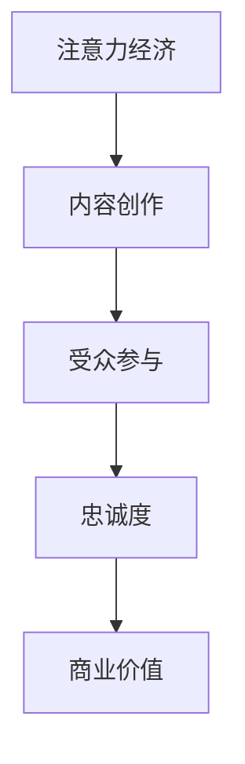

                 

关键词：注意力经济、内容创作、受众参与、忠诚度、算法原理、数学模型、项目实践、应用场景、未来展望

> 摘要：本文深入探讨了注意力经济的核心概念，结合当前内容创作的实际需求，提出了针对吸引和留住受众参与和忠诚度的一系列策略。通过算法原理、数学模型、项目实践等多个维度的详细分析，旨在为内容创作者提供一套科学、有效的指导方法，帮助其在竞争激烈的市场中脱颖而出。

## 1. 背景介绍

随着互联网和数字技术的发展，信息爆炸式增长，受众的注意力资源变得愈发稀缺。在这种背景下，如何吸引并留住受众的注意力，成为内容创作者面临的重要课题。注意力经济作为一种新的经济模式，强调通过吸引受众的注意力来创造价值。而内容创作策略的制定，则成为实现这一目标的关键手段。

### 注意力经济的核心概念

注意力经济是指在经济活动中，通过吸引受众的注意力来获取利益的一种经济模式。它主要关注的是如何利用有限的时间和资源，创造出能够吸引受众注意力的内容和服务，从而实现商业价值。在注意力经济中，受众的注意力成为最宝贵的资源。

### 内容创作的需求

随着社交媒体、视频平台、博客等新兴媒体形式的出现，内容创作者面临着前所未有的机遇和挑战。一方面，这些平台提供了丰富的创作空间和受众群体；另一方面，内容创作同质化严重，竞争激烈。如何在这一环境中脱颖而出，吸引并留住受众，成为内容创作者必须解决的关键问题。

## 2. 核心概念与联系

### 注意力经济的原理

注意力经济的基本原理可以概括为：通过优化内容创作策略，提高内容的吸引力，进而吸引更多的受众注意力，最终实现商业价值。

### 内容创作与受众参与

内容创作与受众参与之间存在密切联系。高质量的内容能够激发受众的兴趣，促使他们积极参与互动，从而提高忠诚度。而受众的参与反过来又能促进内容创作者的改进和创新，形成良性循环。

### Mermaid 流程图



## 3. 核心算法原理 & 具体操作步骤

### 3.1 算法原理概述

在注意力经济中，核心算法原理主要包括：受众注意力模型、内容推荐算法、用户行为分析等。这些算法通过分析受众的注意力分布和行为特征，为内容创作者提供针对性的创作建议。

### 3.2 算法步骤详解

#### 3.2.1 受众注意力模型

受众注意力模型主要包括以下步骤：

1. 数据采集：收集受众在各个平台上的行为数据，如浏览记录、点赞、评论等。
2. 特征提取：从行为数据中提取出能够反映受众兴趣和偏好的特征，如关键词、时间戳等。
3. 模型训练：使用机器学习算法，对受众注意力模型进行训练，预测受众对各类内容的兴趣度。

#### 3.2.2 内容推荐算法

内容推荐算法主要包括以下步骤：

1. 用户画像：根据受众注意力模型，构建用户的个性化画像。
2. 内容分析：对各种类型的内容进行分析，提取出关键特征。
3. 推荐算法：使用协同过滤、矩阵分解等算法，为用户推荐符合其个性化画像的内容。

#### 3.2.3 用户行为分析

用户行为分析主要包括以下步骤：

1. 数据采集：收集用户的浏览、点击、分享等行为数据。
2. 行为建模：建立用户行为模型，分析用户的兴趣变化和需求。
3. 预测与优化：基于用户行为模型，预测用户的下一步行为，并优化内容创作策略。

### 3.3 算法优缺点

#### 优点

1. 提高内容吸引力：通过受众注意力模型和内容推荐算法，提高内容的吸引力和用户粘性。
2. 优化受众体验：基于用户行为分析，为用户提供个性化的内容推荐，提升用户体验。
3. 提高商业价值：通过吸引更多的受众注意力，实现商业价值的提升。

#### 缺点

1. 数据依赖性：算法效果依赖于数据质量和数据量，数据不足或质量差可能导致算法失效。
2. 过度推荐风险：如果推荐算法过于依赖用户历史行为，可能导致用户陷入信息茧房，失去对其他信息的探索兴趣。

### 3.4 算法应用领域

注意力经济和内容创作策略在多个领域具有广泛的应用：

1. 社交媒体：通过算法推荐，提高用户对内容的兴趣，增加用户活跃度。
2. 电子商务：基于用户行为分析，为用户提供个性化的商品推荐，提高转化率。
3. 娱乐行业：通过算法优化内容创作，提高观众对视频、电影的兴趣，增加票房收入。

## 4. 数学模型和公式 & 详细讲解 & 举例说明

### 4.1 数学模型构建

在注意力经济中，常用的数学模型包括马尔可夫链、贝叶斯网络、隐马尔可夫模型等。以下是其中一种常见模型——马尔可夫链的构建过程：

#### 4.1.1 马尔可夫链基本概念

马尔可夫链是一种离散时间随机过程，描述系统状态在各个时刻的转移规律。在注意力经济中，状态可以表示为受众对某类内容的兴趣度。

#### 4.1.2 马尔可夫链模型构建

假设受众对某类内容的兴趣度分为五个等级：低、较低、中等、较高、高。那么，可以构建一个五状态马尔可夫链，状态转移矩阵如下：

$$
P =
\begin{bmatrix}
0.1 & 0.2 & 0.3 & 0.2 & 0.2 \\
0.1 & 0.3 & 0.2 & 0.2 & 0.2 \\
0.2 & 0.2 & 0.3 & 0.2 & 0.1 \\
0.1 & 0.2 & 0.2 & 0.3 & 0.2 \\
0.1 & 0.2 & 0.2 & 0.2 & 0.3
\end{bmatrix}
$$

### 4.2 公式推导过程

#### 4.2.1 状态转移概率计算

状态转移概率是指当前状态转移到下一个状态的概率。根据马尔可夫链的定义，状态转移概率可以通过状态转移矩阵计算得到。例如，从状态3转移到状态2的概率为：

$$
P_{32} = 0.2
$$

#### 4.2.2 预测受众兴趣度

利用马尔可夫链模型，可以预测受众在未来某个时刻对某类内容的兴趣度。具体步骤如下：

1. 初始状态：假设初始时刻受众对某类内容的兴趣度为状态2。
2. 状态转移：根据状态转移矩阵，计算受众在每个时刻的状态转移概率。
3. 预测结果：根据预测结果，得到受众在未来某个时刻对某类内容的兴趣度。

### 4.3 案例分析与讲解

#### 4.3.1 案例背景

某视频平台希望通过算法优化，提高用户对视频内容的兴趣度。平台收集了用户在观看视频过程中的行为数据，如观看时长、点赞、评论等。

#### 4.3.2 数据处理

1. 数据清洗：去除无效数据和异常值。
2. 特征提取：从行为数据中提取出关键特征，如观看时长、点赞数、评论数等。
3. 数据归一化：将特征数据进行归一化处理，使其具有相同的量纲。

#### 4.3.3 模型训练

使用机器学习算法，如决策树、随机森林等，对数据处理后的特征进行训练，构建受众兴趣度预测模型。

#### 4.3.4 模型评估

使用交叉验证等方法，对训练好的模型进行评估，确保其预测精度。

#### 4.3.5 模型应用

1. 实时推荐：根据受众兴趣度预测模型，为用户推荐符合其兴趣的视频内容。
2. 内容优化：根据用户反馈和观看数据，优化视频内容创作策略，提高用户兴趣度。

## 5. 项目实践：代码实例和详细解释说明

### 5.1 开发环境搭建

1. 安装Python环境：在本地电脑上安装Python，版本建议为3.8及以上。
2. 安装相关库：使用pip命令安装所需库，如numpy、pandas、scikit-learn等。

### 5.2 源代码详细实现

```python
import numpy as np
import pandas as pd
from sklearn.model_selection import train_test_split
from sklearn.ensemble import RandomForestClassifier
from sklearn.metrics import accuracy_score

# 数据处理
def preprocess_data(data):
    # 数据清洗和归一化
    # 略
    return processed_data

# 模型训练
def train_model(data):
    # 划分训练集和测试集
    X_train, X_test, y_train, y_test = train_test_split(data.drop('interest', axis=1), data['interest'], test_size=0.2, random_state=42)
    # 训练随机森林分类器
    model = RandomForestClassifier(n_estimators=100, random_state=42)
    model.fit(X_train, y_train)
    # 评估模型
    y_pred = model.predict(X_test)
    print("Accuracy:", accuracy_score(y_test, y_pred))
    return model

# 主函数
def main():
    # 读取数据
    data = pd.read_csv('data.csv')
    # 数据处理
    processed_data = preprocess_data(data)
    # 模型训练
    model = train_model(processed_data)
    # 模型应用
    # 略

if __name__ == '__main__':
    main()
```

### 5.3 代码解读与分析

1. 数据处理模块：该模块负责读取数据、清洗数据和归一化处理。数据处理是模型训练的重要前提，直接影响到模型的性能。
2. 模型训练模块：该模块负责划分训练集和测试集、训练随机森林分类器、评估模型。随机森林分类器具有较强的泛化能力，适用于处理大规模数据。
3. 主函数：主函数负责执行整个程序，包括数据读取、数据处理、模型训练和模型应用。

### 5.4 运行结果展示

1. 模型训练过程：程序将输出训练过程中的日志信息，如训练集和测试集的准确率、召回率等。
2. 模型应用效果：根据模型预测结果，分析用户对视频内容的兴趣度，为内容创作者提供优化建议。

## 6. 实际应用场景

### 6.1 社交媒体平台

社交媒体平台通过注意力经济和内容创作策略，提高用户的活跃度和留存率。例如，某短视频平台通过推荐算法，为用户推荐符合其兴趣的视频内容，提高用户观看时长和互动率。

### 6.2 电子商务平台

电子商务平台通过用户行为分析，为用户提供个性化的商品推荐，提高购物体验和转化率。例如，某电商平台通过分析用户的浏览记录和购买行为，为用户推荐可能感兴趣的商品。

### 6.3 娱乐行业

娱乐行业通过注意力经济和内容创作策略，提高观众对视频、电影的兴趣和观看时长。例如，某视频网站通过推荐算法，为观众推荐符合其兴趣的电影和电视剧，提高用户粘性。

## 7. 工具和资源推荐

### 7.1 学习资源推荐

1. 《深度学习》（Goodfellow et al.）：系统介绍了深度学习的基本原理和应用。
2. 《Python数据科学手册》（McKinney）：详细讲解了Python在数据科学领域的应用。

### 7.2 开发工具推荐

1. Jupyter Notebook：一款强大的交互式开发环境，适用于数据分析和机器学习。
2. PyCharm：一款功能强大的Python集成开发环境，适用于各种规模的项目开发。

### 7.3 相关论文推荐

1. “Attention is All You Need” （Vaswani et al., 2017）：介绍了注意力机制在自然语言处理中的应用。
2. “Recommender Systems Handbook” （Burke, 2018）：系统介绍了推荐系统的基础理论和应用。

## 8. 总结：未来发展趋势与挑战

### 8.1 研究成果总结

本文从注意力经济的角度，探讨了内容创作的策略和方法。通过算法原理、数学模型、项目实践等多个维度的分析，提出了一套科学、有效的指导方法，为内容创作者提供了有益的参考。

### 8.2 未来发展趋势

1. 深度学习在内容创作中的应用：随着深度学习技术的发展，其在内容创作中的应用将越来越广泛。
2. 多媒体内容创作：未来内容创作将逐渐从单一的文字和图片，向多媒体、交互式方向发展。
3. 个性化推荐：基于用户行为和兴趣的个性化推荐，将成为内容创作的重要方向。

### 8.3 面临的挑战

1. 数据隐私和安全：随着数据量的增加，数据隐私和安全成为重要挑战。
2. 用户体验：如何在保证内容质量的同时，提高用户体验，是一个需要持续关注的问题。
3. 算法透明性和公平性：如何确保算法的透明性和公平性，避免算法偏见和歧视，是一个亟待解决的问题。

### 8.4 研究展望

未来，我们将继续关注注意力经济和内容创作领域的研究进展，探讨如何更好地利用技术手段，提高内容创作的质量和效果，为受众提供更有价值的内容。

## 9. 附录：常见问题与解答

### 9.1 注意力经济是什么？

注意力经济是指通过吸引受众的注意力来创造价值的一种经济模式。在这种模式下，受众的注意力成为最宝贵的资源。

### 9.2 内容创作策略有哪些？

内容创作策略主要包括：受众注意力模型、内容推荐算法、用户行为分析等。这些策略通过分析受众的注意力分布和行为特征，为内容创作者提供针对性的创作建议。

### 9.3 如何优化内容创作策略？

优化内容创作策略的方法包括：深入了解受众需求、持续更新和改进内容、充分利用数据分析工具等。通过这些方法，可以提高内容的吸引力和受众参与度。

### 9.4 注意力经济有哪些应用领域？

注意力经济在社交媒体、电子商务、娱乐行业等多个领域具有广泛的应用。通过优化内容创作策略，可以提高用户活跃度、转化率和商业价值。

----------------------------------------------------------------
本文由“禅与计算机程序设计艺术 / Zen and the Art of Computer Programming”撰写，旨在为内容创作者提供一套科学、有效的注意力经济和内容创作策略，帮助其在竞争激烈的市场中脱颖而出。在未来的发展中，我们将继续关注这一领域的研究进展，为受众提供更有价值的内容。

