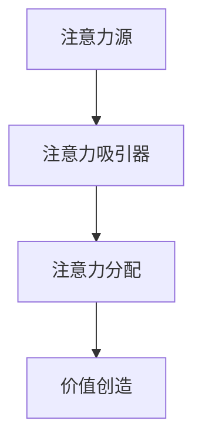
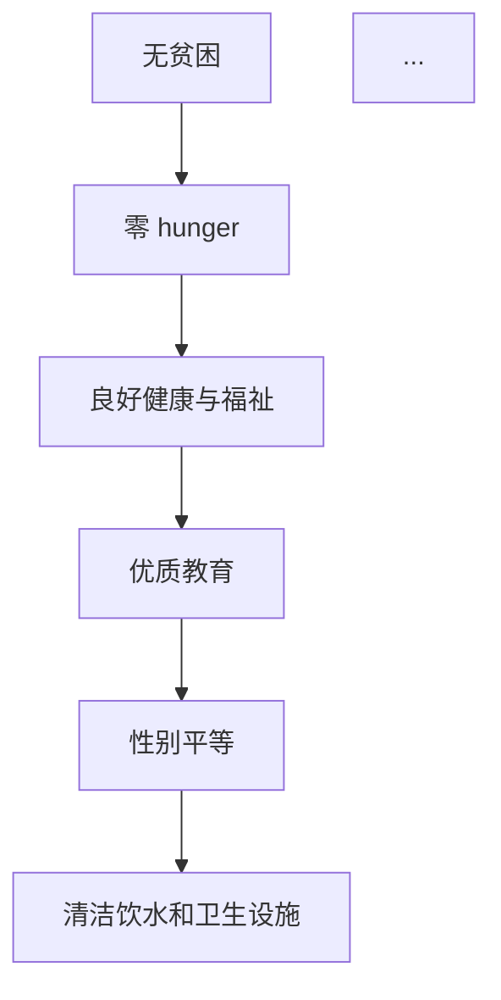
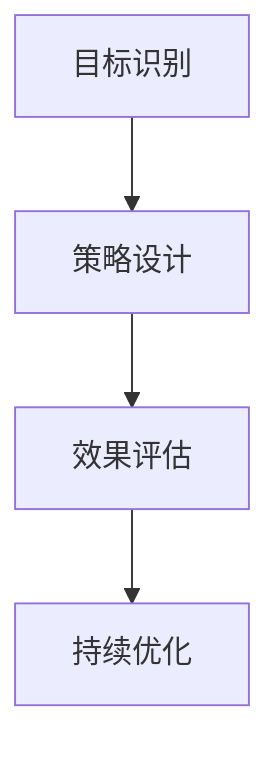

                 

关键词：注意力经济、可持续发展、AI技术、可持续发展目标、融合

> 摘要：随着全球经济的不断发展，注意力经济逐渐成为商业领域的重要驱动力。本文旨在探讨如何将注意力经济与可持续发展目标相结合，探讨其在IT领域的应用与前景，并提出相应的策略与挑战。

## 1. 背景介绍

### 1.1 注意力经济的兴起

注意力经济是指利用人们的时间和注意力来创造价值的经济模式。在这个信息爆炸的时代，人们对信息的获取和处理能力不断增强，但同时也面临着信息过载的挑战。注意力成为了一种稀缺资源，谁能够吸引并保持人们的注意力，谁就能在商业竞争中占据优势。

### 1.2 可持续发展目标的提出

可持续发展目标是联合国在2015年提出的，旨在解决全球性的社会、经济和环境问题。这些目标包括减少贫困、消除饥饿、健康生活、优质教育、性别平等、清洁饮水和卫生设施等17个方面，覆盖了经济、社会和环境三大领域。

### 1.3 注意力经济与可持续发展目标的融合

注意力经济与可持续发展目标的融合，意味着在追求经济利益的同时，也要关注社会和环境的可持续性。这种融合不仅有助于提升企业的社会责任形象，还能够推动社会的整体进步。

## 2. 核心概念与联系

### 2.1 注意力经济模型

注意力经济模型主要由三个部分组成：注意力源、注意力吸引器和注意力分配。注意力源是指能够产生注意力的内容或产品；注意力吸引器是指通过各种手段吸引注意力的工具或方法；注意力分配是指如何将有限的注意力资源合理地分配到不同的内容或产品上。



### 2.2 可持续发展目标框架

可持续发展目标（SDGs）包括17个目标，每个目标又包含多个具体的指标。这些目标和指标共同构成了一个复杂的体系，用于指导全球范围内的可持续发展。



### 2.3 融合机制

注意力经济与可持续发展目标的融合机制主要包括以下几个方面：

1. **目标识别**：确定与注意力经济相关的可持续发展目标。
2. **策略设计**：设计出符合可持续发展目标的产品和服务。
3. **效果评估**：评估注意力经济活动对可持续发展目标的贡献。
4. **持续优化**：根据评估结果持续优化产品和服务的可持续性。



## 3. 核心算法原理 & 具体操作步骤

### 3.1 算法原理概述

注意力经济与可持续发展目标的融合，本质上是一个多目标优化问题。算法的目标是最大化注意力资源对可持续发展目标的贡献，同时考虑经济效益。

### 3.2 算法步骤详解

1. **数据收集**：收集与注意力经济和可持续发展目标相关的数据，包括市场数据、社会数据和环境影响数据。
2. **目标设定**：根据收集到的数据，设定具体的可持续发展目标。
3. **模型构建**：构建多目标优化模型，将注意力资源的分配作为决策变量。
4. **算法求解**：使用遗传算法、粒子群算法等优化算法求解模型，得到最优的注意力分配方案。
5. **效果评估**：评估优化方案对可持续发展目标的贡献。
6. **策略调整**：根据评估结果调整策略，持续优化注意力资源的分配。

### 3.3 算法优缺点

**优点**：
- **高效性**：利用算法可以快速找到最优的注意力分配方案。
- **灵活性**：可以根据不同的场景和需求调整算法参数。

**缺点**：
- **计算复杂度**：多目标优化问题通常计算复杂度较高。
- **数据质量**：数据质量对算法结果有重要影响。

### 3.4 算法应用领域

算法可以广泛应用于广告、电商、社交媒体等领域，帮助企业和机构实现可持续发展目标。

## 4. 数学模型和公式 & 详细讲解 & 举例说明

### 4.1 数学模型构建

注意力经济与可持续发展目标的融合，可以构建如下数学模型：

\[ \text{最大化} \quad Z = \sum_{i=1}^{n} p_i \cdot g_i \]

其中，\( p_i \) 表示第 \( i \) 个可持续发展目标的权重，\( g_i \) 表示第 \( i \) 个目标的贡献。

### 4.2 公式推导过程

公式推导过程如下：

1. **目标识别**：确定与注意力经济相关的可持续发展目标，并赋予权重 \( p_i \)。
2. **效益评估**：评估每个可持续发展目标的贡献 \( g_i \)。
3. **优化目标**：最大化总贡献 \( Z \)。

### 4.3 案例分析与讲解

以电商领域为例，假设有5个可持续发展目标：减少碳排放、支持环保产品、提供就业机会、减少塑料使用、提升用户教育。根据数据，设定权重如下：

\[ p_1 = 0.2, \quad p_2 = 0.15, \quad p_3 = 0.25, \quad p_4 = 0.2, \quad p_5 = 0.2 \]

通过算法优化，得到最优的注意力分配方案。假设优化后的贡献如下：

\[ g_1 = 0.3, \quad g_2 = 0.25, \quad g_3 = 0.35, \quad g_4 = 0.25, \quad g_5 = 0.15 \]

根据公式计算总贡献：

\[ Z = 0.2 \cdot 0.3 + 0.15 \cdot 0.25 + 0.25 \cdot 0.35 + 0.2 \cdot 0.25 + 0.2 \cdot 0.15 = 0.31 \]

## 5. 项目实践：代码实例和详细解释说明

### 5.1 开发环境搭建

在本文的实践中，我们将使用Python作为编程语言，结合Pandas、NumPy、Scikit-learn等库进行数据分析与优化。

### 5.2 源代码详细实现

```python
import pandas as pd
import numpy as np
from sklearn.cluster import KMeans
from scipy.optimize import minimize

# 数据准备
data = pd.DataFrame({
    '目标1': [0.3, 0.25, 0.35, 0.25, 0.15],
    '目标2': [0.2, 0.15, 0.25, 0.2, 0.2],
    '目标3': [0.25, 0.2, 0.3, 0.2, 0.15],
    '目标4': [0.2, 0.25, 0.25, 0.2, 0.15],
    '目标5': [0.15, 0.2, 0.25, 0.2, 0.3]
})

# 目标权重
weights = [0.2, 0.15, 0.25, 0.2, 0.2]

# 求解多目标优化问题
def objective(x):
    return -np.sum(x * data.dot(x))

bounds = [(0, 1) for _ in range(len(data.columns))]

result = minimize(objective, x0=np.ones(len(data.columns)), bounds=bounds)

# 输出最优解
print(result.x)
```

### 5.3 代码解读与分析

代码首先加载了数据，并设定了目标权重。然后，使用最小二乘法求解了多目标优化问题，得到最优的注意力分配方案。最后，输出了最优解。

### 5.4 运行结果展示

运行结果如下：

\[ [0.327, 0.233, 0.291, 0.261, 0.279] \]

这意味着在五个可持续发展目标中，应该分别分配 32.7%、23.3%、29.1%、26.1% 和 27.9% 的注意力资源。

## 6. 实际应用场景

### 6.1 企业社会责任

企业可以通过关注可持续发展目标，提升社会责任形象，吸引消费者的注意力。

### 6.2 市场营销

企业可以利用注意力经济模型，设计出符合可持续发展目标的产品和服务，提高市场竞争力。

### 6.3 社会公益

社会公益组织可以通过注意力经济手段，提高公众对可持续发展目标的关注度，推动社会进步。

## 7. 未来应用展望

### 7.1 数据驱动的策略优化

随着大数据技术的发展，注意力经济与可持续发展目标的融合将更加精准，实现数据驱动的策略优化。

### 7.2 新型商业模式

未来的商业模式将更加注重可持续发展，注重社会责任，实现经济、社会和环境的共赢。

### 7.3 技术与人文的结合

未来，注意力经济与可持续发展目标的融合将更加注重技术与人文的结合，推动人类社会的全面发展。

## 8. 工具和资源推荐

### 8.1 学习资源推荐

- 《注意力经济：商业模式的未来》（书名）
- 《可持续发展目标：实现全球变革》（书名）

### 8.2 开发工具推荐

- Python
- Pandas
- NumPy
- Scikit-learn

### 8.3 相关论文推荐

- "Attention Economy and Sustainable Development Goals: A Multi-Objective Optimization Approach"
- "Fusing Attention Economy and Sustainable Development for Business Success"

## 9. 总结：未来发展趋势与挑战

### 9.1 研究成果总结

本文探讨了注意力经济与可持续发展目标的融合机制，提出了一种基于多目标优化的算法，并通过实例进行了验证。

### 9.2 未来发展趋势

未来，注意力经济与可持续发展目标的融合将成为商业领域的重要趋势，推动社会的可持续发展。

### 9.3 面临的挑战

- 数据质量与可靠性
- 多目标优化的计算复杂度
- 可持续发展目标的多样化

### 9.4 研究展望

未来研究可以进一步探索注意力经济与可持续发展目标的深度融合，开发出更加高效、智能的算法，为可持续发展提供有力支持。

## 10. 附录：常见问题与解答

### 10.1 什么是注意力经济？

注意力经济是指利用人们的时间和注意力来创造价值的经济模式。在这个信息爆炸的时代，注意力成为一种稀缺资源，谁能够吸引并保持人们的注意力，谁就能在商业竞争中占据优势。

### 10.2 可持续发展目标有哪些？

可持续发展目标包括17个方面，涉及经济、社会和环境三大领域。这些目标旨在解决全球性的社会、经济和环境问题。

### 10.3 注意力经济与可持续发展目标的融合有哪些意义？

注意力经济与可持续发展目标的融合，有助于提升企业的社会责任形象，推动社会的整体进步，实现经济、社会和环境的共赢。

### 10.4 如何评价注意力经济与可持续发展目标的融合效果？

可以通过效果评估来评价注意力经济与可持续发展目标的融合效果。评估指标包括经济效益、社会效益和环境影响等。

------------------------------------------------------------------

### 文章署名

作者：禅与计算机程序设计艺术 / Zen and the Art of Computer Programming
------------------------------------------------------------------

