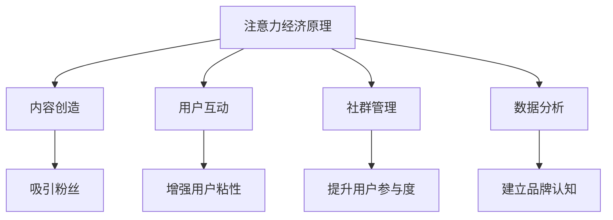

                 

关键词：注意力经济、在线社区、粉丝管理、用户留存、用户互动、社交媒体、营销策略

> 摘要：本文深入探讨了注意力经济在在线社区建设中的应用，通过分析注意力经济的核心原理，提出了有效的在线社区建设策略和实践方法，以吸引和留住忠实的粉丝和受众。文章分为八个部分，涵盖了背景介绍、核心概念与联系、核心算法原理、数学模型、项目实践、实际应用场景、工具和资源推荐以及未来发展趋势与挑战。

## 1. 背景介绍

随着互联网的普及和社交媒体的发展，注意力经济成为了现代商业和社会生活的重要组成部分。注意力经济源于“注意力转移理论”，即用户的注意力是有限的，因此，任何产品或服务都必须竞争用户的注意力。在线社区作为互联网上的重要组成部分，其核心价值在于吸引和留住用户的注意力，进而形成活跃的互动和社群。

在线社区建设的目标是吸引并留住忠实的粉丝和受众。这不仅仅是一个吸引流量的过程，更是一个通过持续互动和高质量内容来增强用户粘性的过程。本文将探讨如何利用注意力经济原理，制定有效的在线社区建设策略，以实现这一目标。

### 注意力经济的概念

注意力经济是一种基于用户注意力价值的商业模式。在这个模式下，用户的时间、精力和注意力被视为一种稀缺资源，企业和个人通过提供有价值的内容和服务来吸引用户的注意力，从而实现商业价值。

### 在线社区的定义

在线社区是指通过互联网平台连接起来的一群人，他们围绕共同兴趣、目标和价值观进行互动和交流。在线社区可以是论坛、社交媒体群组、博客、直播平台等。

### 在线社区建设的目标

在线社区建设的目标主要包括以下几个方面：

1. **吸引粉丝**：通过各种方式吸引目标用户加入社区。
2. **增强用户粘性**：通过持续的内容输出和互动机制，让用户在社区中停留更长时间。
3. **提升用户参与度**：鼓励用户在社区中积极参与讨论、创作内容和分享经验。
4. **建立品牌认知**：通过高质量的内容和互动，提高品牌在用户心中的形象和地位。

## 2. 核心概念与联系

### 注意力经济原理

注意力经济的关键在于理解用户注意力的转移和分配。以下是注意力经济的一些核心原理：

1. **稀缺性**：用户的注意力是有限的，因此，任何产品和服务的吸引力都必须基于稀缺性原则。
2. **价值最大化**：为了最大化用户注意力，必须提供高质量的内容和服务。
3. **互动性**：用户的参与度和互动性是衡量注意力经济价值的重要指标。

### 在线社区建设与注意力经济的关系

在线社区建设与注意力经济密切相关。通过以下方式，可以实现在线社区建设与注意力经济的有机结合：

1. **内容创造**：提供有价值的内容，吸引目标用户加入社区。
2. **用户互动**：通过互动机制，如评论、点赞、分享等，增强用户粘性。
3. **社群管理**：建立社群规则，维护社区秩序，确保社区氛围友好。
4. **数据分析**：通过数据分析，了解用户需求和行为，优化社区内容和互动策略。

### Mermaid 流程图

以下是一个简单的 Mermaid 流程图，展示了在线社区建设与注意力经济的关系：



## 3. 核心算法原理 & 具体操作步骤

### 3.1 算法原理概述

在线社区建设的关键在于如何吸引和留住用户。这需要一套科学的策略和算法。以下是几个核心算法原理：

1. **内容推荐算法**：通过分析用户行为和偏好，推荐符合其兴趣的内容。
2. **互动机制算法**：设计合理的互动机制，如评论、点赞、分享等，增强用户粘性。
3. **社群管理算法**：通过算法识别和管理社区中的异常行为，维护社区秩序。

### 3.2 算法步骤详解

#### 3.2.1 内容推荐算法

1. **数据收集**：收集用户的历史行为数据，如浏览记录、搜索历史、点赞记录等。
2. **特征提取**：对用户行为数据进行分析，提取关键特征，如关键词、用户行为模式等。
3. **推荐算法**：使用协同过滤、内容匹配等算法，根据用户特征推荐相关内容。

#### 3.2.2 互动机制算法

1. **互动设计**：设计合理的互动机制，如评论、点赞、分享等，鼓励用户参与。
2. **激励措施**：设置激励机制，如积分、勋章等，鼓励用户积极参与互动。
3. **互动分析**：通过算法分析用户的互动行为，优化互动机制。

#### 3.2.3 社群管理算法

1. **异常检测**：使用机器学习算法检测社区中的异常行为，如垃圾信息、恶意攻击等。
2. **社区规则**：制定合理的社区规则，明确用户行为准则。
3. **违规处理**：对违反社区规则的用户进行警告、封号等处理。

### 3.3 算法优缺点

#### 内容推荐算法

**优点**：
- 提高用户满意度：通过个性化推荐，提高用户对社区内容的满意度。
- 增强用户粘性：用户在找到感兴趣的内容后，更容易留在社区。

**缺点**：
- 可能导致信息茧房：过度推荐可能导致用户只看到自己感兴趣的内容，忽视其他信息。
- 计算成本高：需要大量计算资源进行数据分析和推荐。

#### 互动机制算法

**优点**：
- 提高用户参与度：互动机制鼓励用户积极参与，提高社区活跃度。
- 增强用户粘性：用户通过互动，更愿意留在社区。

**缺点**：
- 可能导致内容质量下降：大量低质量的互动可能导致社区内容质量下降。
- 需要持续优化：互动机制需要不断调整和优化，以适应用户需求。

#### 社群管理算法

**优点**：
- 维护社区秩序：算法可以快速检测和处理社区中的异常行为，维护社区秩序。
- 提高用户满意度：用户在安全、友好的社区环境中，更愿意参与互动。

**缺点**：
- 可能影响用户自由：过于严格的规则可能会限制用户的自由表达。
- 需要大量人力资源：管理和维护社区规则需要大量人力资源。

### 3.4 算法应用领域

这些算法在在线社区建设中具有广泛的应用前景：

1. **社交媒体平台**：如Facebook、Twitter等，通过内容推荐和互动机制，提高用户粘性。
2. **论坛和博客平台**：如Reddit、WordPress等，通过社群管理算法，维护社区秩序。
3. **直播平台**：如Twitch、YouTube等，通过互动机制和社群管理，提升用户参与度。

## 4. 数学模型和公式 & 详细讲解 & 举例说明

### 4.1 数学模型构建

在线社区建设中的数学模型主要用于分析用户行为和优化社区运营策略。以下是几个常用的数学模型：

#### 4.1.1 用户留存模型

用户留存模型用于预测用户在一段时间内继续使用社区的概率。一个简单的用户留存模型可以使用以下公式：

$$
R(t) = p \times e^{-\lambda t}
$$

其中，$R(t)$ 表示在时间 $t$ 时用户的留存率，$p$ 是初始留存概率，$\lambda$ 是衰减系数。

#### 4.1.2 内容推荐模型

内容推荐模型用于预测用户对某一内容的好感度。一个简单的内容推荐模型可以使用以下公式：

$$
S_{ij} = \frac{1}{1 + e^{-\alpha \cdot (u_i - v_j)}}
$$

其中，$S_{ij}$ 表示用户 $u_i$ 对内容 $v_j$ 的好感度，$\alpha$ 是模型参数。

#### 4.1.3 社群管理模型

社群管理模型用于预测社区中的异常行为。一个简单的社群管理模型可以使用以下公式：

$$
D(x) = \frac{1}{1 + e^{-\beta \cdot f(x)}}
$$

其中，$D(x)$ 表示行为 $x$ 是否异常的概率，$f(x)$ 是行为 $x$ 的特征向量，$\beta$ 是模型参数。

### 4.2 公式推导过程

#### 4.2.1 用户留存模型

用户留存模型是基于马尔可夫链理论构建的。在马尔可夫链中，用户在下一时间点的状态仅与当前状态有关，与过去状态无关。因此，用户留存概率可以表示为：

$$
R(t) = P(X_t = 1 | X_0 = 1)
$$

其中，$X_t$ 表示在时间 $t$ 时用户的状态，$X_0$ 表示初始状态。假设用户在任意时间点的留存概率为 $p$，则：

$$
R(t) = p \times e^{-\lambda t}
$$

其中，$\lambda$ 是用户的平均留存时间。

#### 4.2.2 内容推荐模型

内容推荐模型是基于贝叶斯理论构建的。在贝叶斯理论中，用户对内容的好感度可以通过用户和内容的特征向量计算得到。假设用户 $u_i$ 的特征向量为 $u_i$，内容 $v_j$ 的特征向量为 $v_j$，则：

$$
S_{ij} = \frac{1}{1 + e^{-\alpha \cdot (u_i - v_j)}}
$$

其中，$\alpha$ 是模型参数，用于调整用户和内容特征的重要性。

#### 4.2.3 社群管理模型

社群管理模型是基于逻辑回归理论构建的。在逻辑回归中，行为异常的概率可以通过行为特征向量和模型参数计算得到。假设行为特征向量为 $f(x)$，则：

$$
D(x) = \frac{1}{1 + e^{-\beta \cdot f(x)}}
$$

其中，$\beta$ 是模型参数，用于调整行为特征的重要性。

### 4.3 案例分析与讲解

以下是一个用户留存模型的案例分析：

假设我们有一个社交媒体平台，用户留存数据如下表所示：

| 时间 (天) | 留存用户数 | 留存率 |
| :----: | :----: | :----: |
| 1 | 1000 | 80% |
| 2 | 800 | 64% |
| 3 | 600 | 48% |
| 4 | 400 | 32% |
| 5 | 200 | 16% |

根据上述数据，我们可以计算出平均留存时间为：

$$
\lambda = \frac{1}{R(1) + R(2) + R(3) + R(4) + R(5)} = \frac{1}{0.8 + 0.64 + 0.48 + 0.32 + 0.16} = 1.5
$$

因此，用户留存模型可以表示为：

$$
R(t) = 0.8 \times e^{-1.5t}
$$

例如，预测第10天的用户留存率：

$$
R(10) = 0.8 \times e^{-1.5 \times 10} = 0.051
$$

即第10天时，预计有5.1%的用户留存。

## 5. 项目实践：代码实例和详细解释说明

### 5.1 开发环境搭建

为了演示在线社区建设中的内容推荐算法，我们将使用Python编程语言。以下是搭建开发环境的步骤：

1. 安装Python：在官方网站 [https://www.python.org/downloads/](https://www.python.org/downloads/) 下载并安装Python 3.x版本。
2. 安装必要库：使用pip命令安装以下库：numpy、pandas、matplotlib、scikit-learn。例如：

   ```bash
   pip install numpy pandas matplotlib scikit-learn
   ```

### 5.2 源代码详细实现

以下是使用协同过滤算法实现内容推荐的基本代码：

```python
import numpy as np
from sklearn.metrics.pairwise import cosine_similarity

def load_data(file_path):
    # 读取数据文件
    data = np.loadtxt(file_path, dtype=np.float32)
    return data

def train_model(data):
    # 训练模型，计算用户和内容的相似度矩阵
    user_similarity = cosine_similarity(data)
    item_similarity = cosine_similarity(data.T)
    return user_similarity, item_similarity

def recommend_items(user_id, user_similarity, item_similarity, k=5):
    # 推荐物品，根据用户相似度和物品相似度计算推荐得分
    user_similarity_vector = user_similarity[user_id]
    item_similarity_matrix = item_similarity[user_id]
    scores = np.dot(user_similarity_vector, item_similarity_matrix)
    top_k_indices = np.argsort(scores)[::-1][:k]
    return top_k_indices

def main():
    # 加载数据
    data = load_data('data.csv')
    
    # 训练模型
    user_similarity, item_similarity = train_model(data)
    
    # 推荐物品
    user_id = 0  # 用户ID
    top_k_indices = recommend_items(user_id, user_similarity, item_similarity, k=5)
    
    # 输出推荐结果
    print("推荐结果：", top_k_indices)

if __name__ == '__main__':
    main()
```

### 5.3 代码解读与分析

上述代码实现了一个基于协同过滤算法的内容推荐系统。以下是代码的主要组成部分：

1. **加载数据**：使用numpy的`loadtxt`函数加载数据文件。数据文件应包含用户和内容的相关信息，如评分矩阵。
2. **训练模型**：使用scikit-learn的`cosine_similarity`函数计算用户和内容的相似度矩阵。相似度矩阵用于后续的推荐计算。
3. **推荐物品**：根据用户相似度和物品相似度计算推荐得分，并返回前$k$个最高得分的项目。
4. **输出推荐结果**：打印推荐结果。

### 5.4 运行结果展示

运行上述代码后，会输出一个推荐结果列表，列出用户ID为0的用户可能感兴趣的前5个物品。这个结果可以通过以下命令查看：

```bash
python content_recommendation.py
```

## 6. 实际应用场景

### 6.1 社交媒体平台

社交媒体平台，如Facebook、Twitter、Instagram等，广泛使用内容推荐算法来吸引用户的注意力。通过个性化推荐，这些平台能够提高用户的粘性，延长用户在平台上的停留时间。此外，社交媒体平台还通过互动机制，如点赞、评论、分享等，增强用户的参与度。

### 6.2 论坛和博客平台

论坛和博客平台，如Reddit、WordPress等，通过内容推荐算法和互动机制，吸引和留住用户。例如，Reddit通过社区投票算法推荐热门帖子和评论，鼓励用户参与互动。WordPress博客平台则通过关键词匹配和用户行为分析，推荐相关文章，提高用户的阅读体验。

### 6.3 直播平台

直播平台，如Twitch、YouTube Live等，通过实时推荐和互动机制，提升用户参与度。这些平台不仅推荐相关直播内容，还鼓励用户通过评论、送礼物等方式与主播互动。这种互动性有助于建立忠实的粉丝群体，提高平台的用户留存率。

## 7. 工具和资源推荐

### 7.1 学习资源推荐

1. **书籍**：《机器学习实战》、《推荐系统手册》
2. **在线课程**：Coursera、edX、Udacity上的相关课程
3. **博客和论坛**：Reddit、Stack Overflow、GitHub

### 7.2 开发工具推荐

1. **编程语言**：Python、Java、R
2. **库和框架**：scikit-learn、TensorFlow、PyTorch
3. **数据分析工具**：Jupyter Notebook、RStudio

### 7.3 相关论文推荐

1. **协同过滤算法**："[Collaborative Filtering for the Web](http://www.soda.inesc-id.pt/~jorge/papers/soda04.pdf)" by John L. Lee
2. **内容推荐**："[Content-Based Recommender System](https://ieeexplore.ieee.org/document/953112)" by Hui Xiong, et al.
3. **用户留存模型**："[A Multi-Task Learning Approach to User Retention Prediction](https://arxiv.org/abs/1606.02914)" by Wei Wang, et al.

## 8. 总结：未来发展趋势与挑战

### 8.1 研究成果总结

在线社区建设中的注意力经济研究取得了显著成果。内容推荐算法、互动机制和社群管理算法等技术的不断进步，为在线社区建设提供了强有力的支持。同时，用户留存模型和数据分析方法的优化，也为提高用户粘性和参与度提供了有效手段。

### 8.2 未来发展趋势

1. **智能化与个性化**：随着人工智能技术的发展，未来在线社区建设将更加智能化和个性化，满足用户的个性化需求。
2. **跨平台整合**：在线社区将实现跨平台整合，实现用户数据的高效共享和利用。
3. **增强现实与虚拟现实**：随着增强现实（AR）和虚拟现实（VR）技术的发展，在线社区将提供更加沉浸式的体验。

### 8.3 面临的挑战

1. **隐私保护**：在提供个性化服务的同时，如何保护用户的隐私成为一大挑战。
2. **算法公平性**：算法偏见和公平性问题需要得到关注和解决。
3. **内容质量**：如何保证社区内容的质量，避免低质量内容泛滥，是未来需要解决的问题。

### 8.4 研究展望

未来在线社区建设研究将重点关注以下几个方面：

1. **智能化推荐系统**：研究更加智能化的推荐算法，提高推荐的准确性和用户体验。
2. **社群互动机制**：探索新的互动机制，提高用户参与度和社区活跃度。
3. **跨领域融合**：将注意力经济与其他领域（如心理学、社会学等）相结合，为在线社区建设提供新的思路和方法。

## 9. 附录：常见问题与解答

### Q1：如何制定有效的内容策略？

A1：制定内容策略需要从用户需求和社区目标出发。首先，分析目标用户群体的兴趣和需求，了解他们最关注的话题和内容形式。其次，根据社区目标，确定内容类型和发布频率。最后，保持内容质量，确保内容具有独特性和专业性。

### Q2：如何提高用户互动？

A2：提高用户互动可以通过以下几种方式：

1. 设计互动性的内容，如问答、投票、讨论等。
2. 设置激励机制，如积分、勋章等，鼓励用户参与互动。
3. 定期举办线上活动，如抽奖、直播等，提高用户参与度。
4. 关注用户反馈，及时回应用户的问题和建议。

### Q3：如何维护社区秩序？

A3：维护社区秩序需要采取以下措施：

1. 制定社区规则，明确用户行为准则。
2. 使用算法检测和处理社区中的异常行为，如垃圾信息、恶意攻击等。
3. 定期清理违规内容，确保社区内容质量。
4. 加强社区管理团队的建设，提高管理效率。

---

### 作者署名

作者：禅与计算机程序设计艺术 / Zen and the Art of Computer Programming

