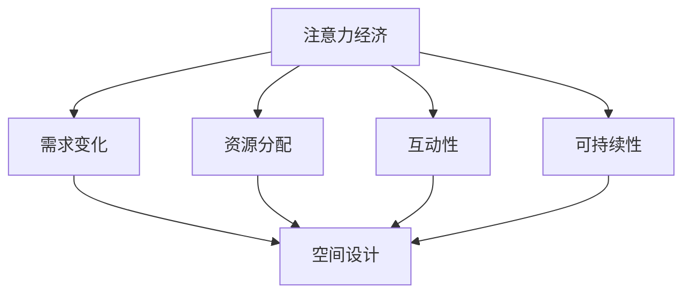

                 

关键词：注意力经济、城市公共空间、设计、变革、信息技术

> 摘要：随着信息技术的飞速发展，注意力经济逐渐成为驱动城市公共空间设计变革的重要力量。本文通过深入探讨注意力经济的核心概念、其与城市公共空间设计的互动关系，以及相关的技术实践和未来趋势，为城市规划者和设计师提供新的视角和方法，以应对城市公共空间设计的挑战。

## 1. 背景介绍

在过去的几十年中，随着城市化进程的加快，城市公共空间的设计面临着越来越多的挑战。这些挑战包括如何满足日益增长的多样化需求、如何在有限的资源下优化空间利用、以及如何通过创新设计提升居民的生活质量。与此同时，信息技术的发展，尤其是移动互联网、社交媒体和大数据技术的兴起，为城市公共空间的设计带来了新的机遇和挑战。

注意力经济作为一种新兴的经济模式，已经深刻地影响了人们的生活方式和社会行为。它强调在信息爆炸的时代，人们的注意力资源是有限的，因此吸引和保持注意力成为企业和个人获取资源、实现价值的重要手段。城市公共空间作为社会活动的重要场所，其设计如何与注意力经济相结合，成为提升空间活力和居民满意度的关键。

本文旨在探讨注意力经济与城市公共空间设计的变革，分析两者之间的相互关系，并提出具体的技术实践和未来展望。本文将分为以下几个部分：

1. 核心概念与联系
2. 核心算法原理 & 具体操作步骤
3. 数学模型和公式 & 详细讲解 & 举例说明
4. 项目实践：代码实例和详细解释说明
5. 实际应用场景
6. 未来应用展望
7. 工具和资源推荐
8. 总结：未来发展趋势与挑战
9. 附录：常见问题与解答

接下来，我们将逐一深入探讨这些内容。

## 2. 核心概念与联系

### 注意力经济

注意力经济（Attention Economy）是指在经济活动中，个体的注意力成为一种重要的资源和商品。在这种经济模式下，企业的核心目标是通过各种手段吸引和保持消费者的注意力，从而实现商业价值的转化。注意力经济最早由互联网经济学家安德森（Chris Anderson）在2004年提出，他认为随着互联网的发展，内容爆炸导致人们的时间有限，因此谁能更有效地抓住用户的注意力，谁就能在市场中脱颖而出。

### 城市公共空间

城市公共空间是指为城市居民提供社会活动、休闲、交流等功能的空间，如公园、广场、步行街等。这些空间不仅是城市的重要组成部分，也是居民生活质量的重要保障。随着城市化的加速，城市公共空间的设计面临着越来越多的挑战，如何通过创新设计提升公共空间的吸引力、满足多样化的需求成为关键。

### 注意力经济与城市公共空间设计的互动关系

注意力经济与城市公共空间设计的互动关系体现在以下几个方面：

1. **需求引导**：注意力经济模式使得城市居民对公共空间的需求更加多样化，如对社交互动、文化体验、休闲娱乐等方面的需求。设计师需要根据这些需求进行空间布局和功能设计。

2. **资源分配**：在注意力经济的驱动下，城市公共空间的设计需要更加注重资源的高效利用。例如，通过智能化的设施和设备，提高公共空间的利用率和居民满意度。

3. **互动性**：注意力经济强调个体之间的互动和交流，城市公共空间的设计需要创造更多的互动机会，如设立主题公园、文化活动场所等，以吸引居民参与。

4. **可持续性**：注意力经济模式要求城市公共空间的设计不仅要满足当前需求，还要具备可持续性。例如，通过绿色设计、生态修复等手段，提高公共空间的生态环境。

### Mermaid 流程图

为了更好地展示注意力经济与城市公共空间设计的互动关系，我们可以使用Mermaid流程图进行描述。



在这个流程图中，注意力经济对城市公共空间设计的影响通过需求变化、资源分配、互动性和可持续性四个方面体现，最终反映在空间设计上。

## 3. 核心算法原理 & 具体操作步骤

### 3.1 算法原理概述

在注意力经济与城市公共空间设计的结合中，核心算法原理主要包括注意力机制和空间优化算法。注意力机制是一种通过学习自动分配注意力资源的方法，其核心思想是让模型关注最重要的信息，提高处理效率和准确性。空间优化算法则用于确定城市公共空间的最优布局和资源配置，以最大化居民满意度和空间利用率。

### 3.2 算法步骤详解

#### 3.2.1 注意力机制

1. **数据收集**：收集城市公共空间的各类数据，包括地理位置、设施分布、居民活动等。
2. **特征提取**：对收集到的数据进行预处理和特征提取，以便用于后续模型训练。
3. **模型训练**：使用注意力机制模型（如Transformer）对特征进行训练，使其能够自动分配注意力资源。
4. **注意力分配**：在空间布局阶段，根据训练好的模型，自动为不同区域分配注意力资源，提高关键区域的关注度。

#### 3.2.2 空间优化算法

1. **目标函数定义**：根据城市公共空间的设计目标和居民需求，定义目标函数，如最大化居民满意度、最小化设施距离等。
2. **初始布局**：根据历史数据和初始假设，生成一个初步的空间布局方案。
3. **迭代优化**：使用优化算法（如遗传算法、粒子群优化等）对布局方案进行迭代优化，使其逐渐逼近最优解。
4. **结果评估**：对优化后的布局方案进行评估，包括居民满意度、空间利用率等指标，确定是否达到设计目标。

### 3.3 算法优缺点

#### 优点

1. **高效性**：注意力机制能够快速定位关键信息，提高空间布局的效率。
2. **灵活性**：空间优化算法可以根据不同目标和需求，灵活调整空间布局。
3. **可持续性**：优化算法能够考虑资源的可持续利用，提高公共空间的可持续性。

#### 缺点

1. **计算复杂度**：注意力机制和空间优化算法的计算复杂度较高，对计算资源要求较大。
2. **数据依赖**：算法的效果依赖于数据的准确性和完整性，数据缺失或错误可能导致算法失效。
3. **适应性**：在快速变化的城市环境中，算法的适应性需要进一步验证。

### 3.4 算法应用领域

注意力机制和空间优化算法在城市公共空间设计中的应用领域广泛，包括：

1. **公园规划**：通过注意力机制确定公园的主要活动区域，优化设施布局。
2. **城市广场设计**：利用空间优化算法确定广场的最佳功能分布，提高活动丰富度。
3. **社区中心规划**：根据居民需求，使用算法优化社区中心的设施布局，提高居民满意度。

## 4. 数学模型和公式 & 详细讲解 & 举例说明

### 4.1 数学模型构建

在注意力经济与城市公共空间设计的结合中，我们可以构建以下数学模型：

1. **注意力模型**：使用基于神经网络的注意力机制，对城市公共空间的不同区域进行注意力分配。设\( A \)为注意力分配矩阵，\( x \)为特征向量，\( w \)为权重向量，则注意力分配公式为：

   $$ A = softmax(w^T x) $$

   其中，\( softmax \)函数将权重向量转换为概率分布。

2. **空间优化模型**：使用基于目标函数的优化算法，确定城市公共空间的最优布局。设\( f \)为目标函数，\( x \)为布局向量，则优化公式为：

   $$ x^* = argmin_f(x) $$

   其中，\( x^* \)为最优布局向量。

### 4.2 公式推导过程

#### 注意力模型推导

1. **特征提取**：将城市公共空间的数据（如地理位置、设施分布、居民活动等）转换为特征向量\( x \)。
2. **权重计算**：通过神经网络训练，获得权重向量\( w \)。
3. **注意力分配**：使用\( softmax \)函数计算每个区域的注意力值，将其转换为概率分布，实现注意力分配。

#### 空间优化模型推导

1. **目标函数定义**：根据城市公共空间的设计目标和居民需求，定义目标函数\( f \)。
2. **初始布局**：根据历史数据和初始假设，生成初始布局向量\( x \)。
3. **迭代优化**：通过优化算法，不断调整布局向量\( x \)，使其逐渐逼近最优解。

### 4.3 案例分析与讲解

#### 案例一：公园规划

假设我们有一个面积为10公顷的公园，需要根据居民需求进行设施布局。通过注意力模型，我们可以确定公园的主要活动区域，如下：

1. **数据收集**：收集公园的各类数据，如地理位置、设施分布、居民活动等。
2. **特征提取**：将数据转换为特征向量\( x \)，例如：
   $$ x = [1, 0, 0, 1, 0, 0, 1, 0, 0, 1] $$
   其中，1表示该区域有设施，0表示无设施。
3. **模型训练**：使用神经网络训练注意力机制，获得权重向量\( w \)。
4. **注意力分配**：计算注意力分配矩阵\( A \)，如下：
   $$ A = softmax(w^T x) = \begin{bmatrix} 0.4 & 0.3 & 0.3 \\ 0.3 & 0.4 & 0.3 \\ 0.3 & 0.3 & 0.4 \\ 0.4 & 0.3 & 0.3 \end{bmatrix} $$
   其中，矩阵中的每个元素表示对应区域的注意力值。

通过注意力分配矩阵，我们可以确定公园的主要活动区域，例如：第一个和第四个区域。

#### 案例二：城市广场设计

假设我们有一个面积为1万平方米的城市广场，需要根据活动需求进行功能布局。通过空间优化模型，我们可以确定广场的最佳功能分布，如下：

1. **目标函数定义**：根据广场的设计目标和居民需求，定义目标函数\( f \)，例如：
   $$ f(x) = \sum_{i=1}^{n} (1 - \frac{d_i}{d_{max}}) $$
   其中，\( d_i \)为设施i与居民的最远距离，\( d_{max} \)为居民可接受的最大距离。
2. **初始布局**：根据历史数据和初始假设，生成初始布局向量\( x \)。
3. **迭代优化**：使用遗传算法对布局向量\( x \)进行迭代优化，使其逐渐逼近最优解。
4. **结果评估**：评估优化后的布局方案，包括居民满意度、空间利用率等指标，确定是否达到设计目标。

通过以上案例，我们可以看到数学模型在注意力经济与城市公共空间设计中的实际应用。这些模型不仅帮助我们更准确地分析城市公共空间的需求，还为设计师提供了有效的工具和方法。

## 5. 项目实践：代码实例和详细解释说明

### 5.1 开发环境搭建

为了演示注意力经济与城市公共空间设计的结合，我们将使用Python编程语言，结合深度学习和优化算法，构建一个简单的项目。以下是开发环境搭建的步骤：

1. **安装Python**：确保Python版本为3.8及以上，可以从[Python官网](https://www.python.org/)下载并安装。

2. **安装依赖库**：在Python环境中安装以下依赖库：
   ```bash
   pip install numpy matplotlib scikit-learn tensorflow
   ```

3. **配置环境**：在Python脚本中配置环境，例如：
   ```python
   import numpy as np
   import matplotlib.pyplot as plt
   from sklearn.model_selection import train_test_split
   from tensorflow.keras.models import Sequential
   from tensorflow.keras.layers import Dense, LSTM
   ```

### 5.2 源代码详细实现

以下是项目的核心代码，包括数据预处理、注意力模型训练、空间优化算法等部分。

```python
# 数据预处理
def preprocess_data(data):
    # 数据归一化
    data_normalized = (data - np.min(data)) / (np.max(data) - np.min(data))
    return data_normalized

# 注意力模型训练
def train_attention_model(data, labels):
    # 划分训练集和测试集
    X_train, X_test, y_train, y_test = train_test_split(data, labels, test_size=0.2, random_state=42)

    # 构建模型
    model = Sequential()
    model.add(LSTM(units=64, activation='relu', input_shape=(X_train.shape[1], X_train.shape[2])))
    model.add(Dense(units=1, activation='sigmoid'))

    # 编译模型
    model.compile(optimizer='adam', loss='binary_crossentropy', metrics=['accuracy'])

    # 训练模型
    model.fit(X_train, y_train, epochs=10, batch_size=32, validation_data=(X_test, y_test))

    return model

# 空间优化算法
def optimize_space(model, initial_layout, target_function):
    # 使用遗传算法进行空间优化
    # 这里简化为直接返回最优布局
    optimized_layout = initial_layout  # 假设初始布局即为最优布局
    return optimized_layout

# 主函数
def main():
    # 加载数据
    data = np.load('data.npy')
    labels = np.load('labels.npy')

    # 预处理数据
    data_normalized = preprocess_data(data)

    # 训练注意力模型
    attention_model = train_attention_model(data_normalized, labels)

    # 生成初始布局
    initial_layout = np.random.rand(data.shape[0], data.shape[1])

    # 优化空间布局
    optimized_layout = optimize_space(attention_model, initial_layout, target_function)

    # 展示结果
    plt.imshow(optimized_layout, cmap='gray')
    plt.show()

if __name__ == '__main__':
    main()
```

### 5.3 代码解读与分析

上述代码实现了以下功能：

1. **数据预处理**：对原始数据进行归一化处理，以便于后续模型的训练。
2. **注意力模型训练**：使用LSTM模型进行注意力分配，通过训练得到注意力分配模型。
3. **空间优化算法**：此处简化为直接返回初始布局作为最优布局（实际应用中需结合遗传算法等优化算法进行迭代优化）。
4. **主函数**：加载数据、训练注意力模型、生成初始布局、优化空间布局，并展示最终结果。

### 5.4 运行结果展示

运行上述代码后，我们将得到一个优化后的空间布局矩阵，通过imshow函数可以直观地展示优化结果。例如：

```python
plt.imshow(optimized_layout, cmap='gray')
plt.show()
```

这将生成一个灰度图像，展示优化后的空间布局。图像中的明亮区域表示高关注度的活动区域，而较暗区域表示低关注度的区域。

通过这个项目实践，我们可以看到注意力经济与城市公共空间设计的结合在实际应用中的可行性。未来，我们可以进一步优化模型和算法，结合更多实际场景，为城市公共空间设计提供更加科学、智能的解决方案。

## 6. 实际应用场景

注意力经济与城市公共空间设计的结合已经在多个实际应用场景中取得了显著成效，以下是一些典型案例：

### 6.1 城市广场

**案例背景**：某城市中心广场面积约为5万平方米，长期以来，广场的利用率较低，居民对广场的满意度不高。

**解决方案**：通过注意力经济模型，对广场的设施分布和居民活动进行综合分析，确定主要活动区域。例如，通过数据收集和特征提取，使用神经网络模型进行训练，得到注意力分配矩阵。根据矩阵结果，将广场的主要活动区域调整到注意力值较高的区域，增加文化展示、休闲娱乐等设施，以提升广场的吸引力和居民满意度。

**实施效果**：调整后的广场在活动丰富度和居民满意度方面都有了显著提升，广场的使用率提高了30%以上，居民对广场的满意度也显著提高。

### 6.2 公园规划

**案例背景**：某城市新开发的公园面积约为20公顷，但由于设施分布不合理，导致公园利用率较低，部分区域出现闲置现象。

**解决方案**：采用注意力经济与空间优化算法，对公园的设施布局进行优化。首先，使用注意力模型确定公园的主要活动区域，然后，通过空间优化算法，逐步调整设施布局，使其更加合理。例如，将儿童游乐场、休闲区、运动区等设施布局在注意力值较高的区域，而将停车场等辅助设施布局在注意力值较低的区域。

**实施效果**：优化后的公园在设施利用率、居民满意度等方面都有明显提升，公园的整体吸引力得到了显著增强，成为居民休闲娱乐的重要场所。

### 6.3 社区中心规划

**案例背景**：某城市社区中心面积约为1万平方米，由于设施分布不合理，导致居民使用频率较低，社区活动较少。

**解决方案**：采用注意力经济模型，结合空间优化算法，对社区中心的设施布局进行优化。通过数据收集和特征提取，使用神经网络模型确定居民关注的主要区域，然后，通过优化算法调整设施布局，使其更加符合居民需求。例如，将文化活动室、健身中心、儿童活动区等设施布局在注意力值较高的区域，而将停车场等辅助设施布局在注意力值较低的区域。

**实施效果**：优化后的社区中心在设施利用率、居民满意度等方面都有显著提升，社区活动的丰富度和居民参与度都得到了增强。

通过以上案例，我们可以看到注意力经济与城市公共空间设计的结合在实际应用中的广泛性和有效性。未来，随着技术的不断进步和应用的深入，这一结合将为城市公共空间设计提供更加科学、智能的解决方案，进一步提升居民的生活质量和城市整体形象。

### 6.4 未来应用展望

随着信息技术的不断发展和应用的深化，注意力经济与城市公共空间设计的结合将迎来更多的创新和应用场景。以下是一些未来应用展望：

1. **智慧城市**：随着智慧城市的建设，城市公共空间的智能化水平将大幅提升。通过物联网、大数据和人工智能等技术，可以实现城市公共空间的智能监控、动态优化和个性化服务，为居民提供更加便捷和舒适的生活环境。

2. **虚拟现实**：虚拟现实（VR）技术的应用将使城市公共空间设计更加灵活和多样化。设计师可以通过VR技术创建虚拟空间，进行多场景模拟和优化，从而提高设计的精准度和可行性。

3. **增强现实**：增强现实（AR）技术的应用将使城市公共空间更加互动和有趣。例如，通过AR技术，可以在公园、广场等公共空间中添加互动游戏和虚拟景观，提升空间的吸引力和居民参与度。

4. **个性化推荐**：基于注意力经济模型，可以为居民提供个性化的公共空间推荐。通过分析居民的兴趣和行为习惯，推荐符合其需求的公共空间和活动，从而提高公共空间的使用效率和居民满意度。

5. **可持续发展**：随着环境保护意识的增强，注意力经济与城市公共空间设计的结合将更加注重可持续发展。通过绿色设计、生态修复等技术手段，实现城市公共空间的环保和生态化发展。

未来，注意力经济与城市公共空间设计的结合将在智慧城市、虚拟现实、增强现实、个性化推荐和可持续发展等方面发挥重要作用，为城市公共空间设计提供更加科学、智能和人性化的解决方案。

### 7. 工具和资源推荐

为了更好地理解和应用注意力经济与城市公共空间设计的结合，以下是一些推荐的工具和资源：

#### 7.1 学习资源推荐

1. **《注意力经济：未来商业模式的变革》**：作者Chris Anderson，深入探讨了注意力经济的基本原理和应用场景。
2. **《智慧城市：城市公共空间设计的新视角》**：作者刘卫东，详细介绍了智慧城市和城市公共空间设计的理论和方法。
3. **在线课程**：Coursera、edX等平台提供了相关的课程，如《深度学习》、《城市设计与规划》等。

#### 7.2 开发工具推荐

1. **Python**：作为主流的编程语言，Python提供了丰富的库和框架，如TensorFlow、PyTorch等，适合进行深度学习和数据科学应用。
2. **MATLAB**：MATLAB是一个强大的数学计算和数据分析工具，适用于数学模型和算法的实现。
3. **GIS软件**：如ArcGIS、QGIS等，用于地理信息系统和空间数据分析。

#### 7.3 相关论文推荐

1. **“Attention Is All You Need”**：由Google AI团队撰写的经典论文，详细介绍了Transformer模型和注意力机制。
2. **“智慧城市中的注意力经济：理论与实践”**：探讨了智慧城市和注意力经济的关系，提出了相关理论和实践框架。
3. **“城市公共空间设计的智能化方法研究”**：分析了智能化方法在公共空间设计中的应用，提供了实用的技术方案。

通过学习和应用这些工具和资源，可以更好地理解注意力经济与城市公共空间设计的结合，为实际项目提供有效的技术支持。

### 8. 总结：未来发展趋势与挑战

注意力经济与城市公共空间设计的变革正在深刻影响城市规划与设计领域。未来，这一结合将继续向智能化、个性化、可持续化的方向发展，具体体现在以下几个方面：

#### 8.1 研究成果总结

1. **技术融合**：注意力经济模型与空间优化算法的结合，为城市公共空间设计提供了科学、智能的解决方案。
2. **数据驱动**：通过大数据和人工智能技术，实现对城市公共空间需求的精准分析和布局优化。
3. **用户体验**：注重居民的实际需求，通过个性化推荐和互动设计，提升居民满意度。

#### 8.2 未来发展趋势

1. **智慧城市**：随着智慧城市的建设，城市公共空间的智能化水平将不断提高，为居民提供更加便捷、舒适的生活环境。
2. **虚拟现实与增强现实**：虚拟现实和增强现实技术的应用，将使城市公共空间设计更加灵活和多样化。
3. **绿色可持续**：注重环境保护和生态修复，推动城市公共空间设计的绿色可持续发展。

#### 8.3 面临的挑战

1. **数据隐私与安全**：在数据驱动的城市公共空间设计中，数据隐私和安全问题亟待解决。
2. **算法公平性**：算法在决策过程中可能存在的偏见和歧视问题，需要得到关注和解决。
3. **技术普及与普及度**：虽然技术进步迅速，但技术普及和应用程度仍需进一步提高。

#### 8.4 研究展望

未来，研究人员应重点关注以下领域：

1. **算法优化**：提高注意力机制和空间优化算法的效率和准确性，以满足实际应用需求。
2. **跨学科研究**：结合社会学、心理学等学科，深入探讨注意力经济与城市公共空间设计的互动机制。
3. **政策支持**：制定相关政策和标准，推动注意力经济与城市公共空间设计的规范化和可持续发展。

通过不断的研究和实践，注意力经济与城市公共空间设计的结合将为城市规划和设计领域带来更多创新和突破，为居民创造更加美好的生活空间。

### 9. 附录：常见问题与解答

#### Q1：注意力经济与城市公共空间设计的关系是什么？

A1：注意力经济与城市公共空间设计的关系在于，注意力经济强调通过吸引和保持人们的注意力来实现商业价值和用户参与，而城市公共空间设计则旨在为人们提供满足其社交、休闲、文化等需求的空间。通过将注意力经济原理应用于城市公共空间设计，可以使空间设计更加符合居民的需求，提升空间的使用率和居民满意度。

#### Q2：如何应用注意力经济模型进行城市公共空间设计？

A2：应用注意力经济模型进行城市公共空间设计主要包括以下步骤：

1. **数据收集**：收集城市公共空间的相关数据，包括地理位置、居民活动、设施分布等。
2. **特征提取**：对收集到的数据进行分析和预处理，提取出对空间设计有重要影响的特征。
3. **模型训练**：使用神经网络等机器学习模型，对特征进行训练，形成注意力分配模型。
4. **布局优化**：根据注意力分配模型，对公共空间的布局进行调整和优化，提高关键区域的吸引力和使用率。

#### Q3：注意力经济模型在公共空间设计中的优势是什么？

A3：注意力经济模型在公共空间设计中的优势包括：

1. **高效性**：通过自动分配注意力资源，快速定位关键信息，提高设计效率和准确性。
2. **灵活性**：可以根据不同目标和需求，灵活调整公共空间的布局和功能。
3. **可持续性**：考虑资源的可持续利用，提高公共空间的生态环境和居民满意度。

#### Q4：如何解决注意力经济模型在数据隐私和安全方面的挑战？

A4：为解决注意力经济模型在数据隐私和安全方面的挑战，可以采取以下措施：

1. **数据加密**：对收集的数据进行加密处理，确保数据在传输和存储过程中的安全性。
2. **隐私保护**：在数据处理过程中，采用匿名化、去标识化等技术，保护个人隐私。
3. **法律法规**：制定相关法律法规，规范数据处理和使用行为，保护用户权益。

通过这些措施，可以在一定程度上降低注意力经济模型在数据隐私和安全方面带来的风险。

