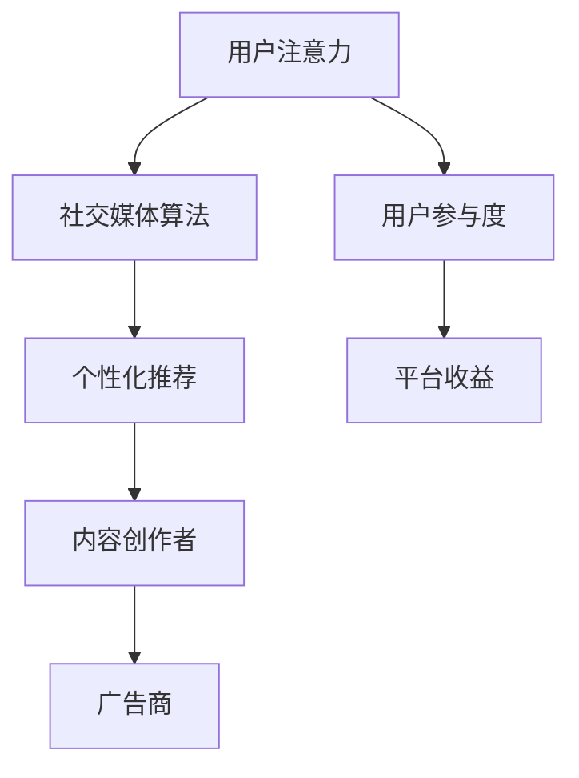

                 

本文将深入探讨注意力经济在社交媒体领域的重要性，以及影响受众参与的各种因素。我们将首先回顾注意力经济的概念，然后分析社交媒体中的算法如何塑造用户的注意力分配，接着探讨受众如何参与和影响这些平台。最后，我们将讨论未来的趋势和面临的挑战。

## 关键词

注意力经济、社交媒体、算法、受众参与、用户行为分析

## 摘要

注意力经济是当今数字化世界的一个关键概念，它描述了用户在信息过载时代对稀缺注意力的争夺。社交媒体平台通过复杂的算法来操纵和引导用户的注意力，从而提高用户参与度和广告收益。本文将探讨注意力经济在社交媒体中的应用，分析算法的工作原理，以及受众如何在这个过程中参与和互动。此外，文章还将展望注意力经济和社交媒体领域的未来趋势和挑战。

## 1. 背景介绍

### 注意力经济的起源与发展

注意力经济这个概念最早由美国经济学家John Tierney在1997年提出。他将其描述为“在信息过载的世界里，人们的注意力成为了一种稀缺资源”。随着互联网和数字媒体的迅速发展，注意力经济成为了营销、广告和内容创作领域的重要研究方向。注意力经济强调，为了在竞争激烈的信息环境中脱颖而出，内容创作者和营销人员需要争夺用户的注意力。

### 社交媒体的发展与影响

社交媒体的兴起进一步加剧了注意力经济的现象。平台如Facebook、Instagram、Twitter和微信等，通过算法推荐系统来优化用户的体验，同时也最大化了广告商的收益。这些算法通过对用户行为数据进行分析，能够精准地推送内容，从而提高用户的参与度和留存率。

### 用户行为的转变

随着社交媒体的普及，用户行为也发生了显著变化。人们更倾向于快速浏览和消费信息，而不是深度阅读或思考。这种趋势使得内容创作者需要更加注重吸引力和吸引力，以抓住用户的注意力。

## 2. 核心概念与联系

### 注意力经济

注意力经济（Attention Economy）是一个描述在信息过载时代，用户的注意力成为一种稀缺资源的经济模型。在这个模型中，注意力被视为一种货币，用户将其分配给他们认为最有价值的信息或内容。因此，内容创作者和广告商都在争夺有限的注意力资源。

### 社交媒体算法

社交媒体算法是指平台使用的一系列自动化规则和算法，用于分析和推荐内容给用户。这些算法基于用户的兴趣、历史行为和社交网络来定制化内容推荐，从而提高用户的参与度和平台的收益。

### 用户参与度

用户参与度是衡量用户在社交媒体平台上互动的程度。这包括点赞、评论、分享、观看和参与互动等行为。高参与度通常意味着用户对平台内容的关注和满意度。

### Mermaid 流程图

下面是一个简化的Mermaid流程图，展示注意力经济在社交媒体中的核心概念和联系。



### 注意力经济与社交媒体算法的联系

注意力经济和社交媒体算法密切相关。算法通过分析用户数据，了解用户的兴趣和行为，从而推荐最适合的内容，以吸引和保持用户的注意力。这种个性化的内容推荐不仅提高了用户参与度，也增加了平台的收益。

### 注意力经济对用户参与度的影响

注意力经济的核心在于如何吸引和保持用户的注意力。社交媒体平台通过算法推荐系统和内容个性化来提高用户参与度。然而，这种高度个性化的内容推荐也可能会导致用户陷入“信息茧房”，只接触与自己观点相似的信息，从而减少多元化的交流。

## 3. 核心算法原理 & 具体操作步骤

### 3.1 算法原理概述

社交媒体平台使用的核心算法通常包括以下几种：

1. **内容推荐算法**：通过分析用户的兴趣和行为，推荐相关的内容。
2. **社交网络分析算法**：通过分析用户在社交网络中的互动，推荐用户可能感兴趣的内容。
3. **广告投放算法**：通过分析用户的行为和兴趣，将最相关的广告展示给用户。

### 3.2 算法步骤详解

1. **用户数据收集**：社交媒体平台会收集用户的行为数据，如浏览历史、点赞、评论、分享等。
2. **兴趣分析**：算法通过对用户数据的分析，了解用户的兴趣和偏好。
3. **内容推荐**：根据用户的兴趣和偏好，算法推荐相关的内容。
4. **反馈机制**：用户对推荐内容的反馈（如点赞、评论、分享）会被算法用于进一步优化推荐结果。

### 3.3 算法优缺点

**优点**：

- 提高用户参与度：个性化的内容推荐能够吸引和保持用户的注意力。
- 提高广告效果：精准的广告投放能够提高广告的点击率和转化率。
- 优化用户体验：个性化的内容推荐能够为用户带来更加愉悦的浏览体验。

**缺点**：

- 信息茧房：用户可能会陷入与自己观点相似的信息流，减少多元化的交流。
- 用户隐私问题：用户数据被算法分析和推荐，可能会引发隐私问题。

### 3.4 算法应用领域

社交媒体算法的应用领域非常广泛，包括：

- 内容推荐系统：如Facebook、Instagram等。
- 社交网络分析：如Twitter、LinkedIn等。
- 广告投放系统：如Google Ads、Facebook Ads等。

## 4. 数学模型和公式 & 详细讲解 & 举例说明

### 4.1 数学模型构建

在社交媒体算法中，常用的数学模型包括用户兴趣模型、内容推荐模型和广告投放模型。

- **用户兴趣模型**：通过分析用户的历史行为，构建用户兴趣模型。例如，可以使用因子分解机（Factorization Machines）来建模用户的兴趣。

  $$\hat{y_{ui}} = \sum_{k=1}^{K} w_k \cdot x_{ui,k}$$

  其中，$y_{ui}$ 表示用户 $u$ 对内容 $i$ 的兴趣，$w_k$ 表示因素 $k$ 的重要性，$x_{ui,k}$ 表示用户 $u$ 在内容 $i$ 上的特征值。

- **内容推荐模型**：通过分析用户兴趣模型和内容特征，推荐相关的内容。例如，可以使用协同过滤（Collaborative Filtering）来推荐内容。

  $$\hat{r_{ui}} = \sum_{j=1}^{N} r_{uj} \cdot s_{ij}$$

  其中，$r_{uj}$ 表示用户 $u$ 对内容 $j$ 的评分，$s_{ij}$ 表示内容 $i$ 和内容 $j$ 之间的相似度。

- **广告投放模型**：通过分析用户兴趣和行为，确定最相关的广告投放给用户。例如，可以使用决策树（Decision Trees）来建模广告投放策略。

  $$\hat{y_{ui}} = g(\sum_{k=1}^{K} w_k \cdot x_{ui,k})$$

  其中，$y_{ui}$ 表示用户 $u$ 对广告 $i$ 的投放概率，$w_k$ 表示因素 $k$ 的重要性，$x_{ui,k}$ 表示用户 $u$ 在广告 $i$ 上的特征值，$g(\cdot)$ 是一个激活函数。

### 4.2 公式推导过程

以上公式是基于统计学和机器学习的基本原理推导而来的。用户兴趣模型和内容推荐模型主要基于用户的兴趣和行为数据，通过特征提取和模型训练来构建。广告投放模型则结合了用户兴趣和行为数据，以及广告特征数据，通过决策树等模型来预测广告投放效果。

### 4.3 案例分析与讲解

假设有一个社交媒体平台，用户数据如下：

- 用户1对内容A的评分为4，对内容B的评分为5，对内容C的评分为3。
- 用户2对内容A的评分为5，对内容B的评分为3，对内容C的评分为4。

首先，我们可以使用因子分解机来构建用户兴趣模型。设用户兴趣向量为 $y_u = [y_{u1}, y_{u2}, y_{u3}]$，内容特征向量为 $x_i = [x_{i1}, x_{i2}, x_{i3}]$，因素权重向量为 $w = [w_1, w_2, w_3]$。则用户兴趣模型可以表示为：

$$\hat{y_u} = \sum_{k=1}^{3} w_k \cdot x_{uk}$$

通过训练模型，我们可以得到每个因素的权重。例如，假设权重向量 $w = [0.3, 0.5, 0.2]$，则用户1的兴趣向量可以表示为：

$$\hat{y_1} = 0.3 \cdot x_{11} + 0.5 \cdot x_{12} + 0.2 \cdot x_{13}$$

$$\hat{y_1} = 0.3 \cdot 4 + 0.5 \cdot 5 + 0.2 \cdot 3 = 1.2 + 2.5 + 0.6 = 4.3$$

同理，用户2的兴趣向量可以表示为：

$$\hat{y_2} = 0.3 \cdot x_{21} + 0.5 \cdot x_{22} + 0.2 \cdot x_{23}$$

$$\hat{y_2} = 0.3 \cdot 5 + 0.5 \cdot 3 + 0.2 \cdot 4 = 1.5 + 1.5 + 0.8 = 3.8$$

接下来，我们可以使用协同过滤算法来推荐内容。设内容特征向量为 $x_i = [x_{i1}, x_{i2}, x_{i3}]$，内容相似度矩阵为 $S = [s_{ij}]$，用户评分矩阵为 $R = [r_{ui}]$。则内容推荐模型可以表示为：

$$\hat{r_{ui}} = \sum_{j=1}^{3} r_{uj} \cdot s_{ij}$$

通过计算内容相似度矩阵 $S$，我们可以为用户推荐相似的内容。例如，假设内容相似度矩阵为：

$$S = \begin{bmatrix}
0.6 & 0.4 & 0.2 \\
0.4 & 0.5 & 0.3 \\
0.2 & 0.3 & 0.4
\end{bmatrix}$$

则用户1推荐的内容评分为：

$$\hat{r_{11}} = \sum_{j=1}^{3} r_{1j} \cdot s_{1j}$$

$$\hat{r_{11}} = 4 \cdot 0.6 + 5 \cdot 0.4 + 3 \cdot 0.2 = 2.4 + 2 + 0.6 = 5$$

$$\hat{r_{12}} = \sum_{j=1}^{3} r_{1j} \cdot s_{1j}$$

$$\hat{r_{12}} = 4 \cdot 0.4 + 5 \cdot 0.5 + 3 \cdot 0.3 = 1.6 + 2.5 + 0.9 = 4.0$$

$$\hat{r_{13}} = \sum_{j=1}^{3} r_{1j} \cdot s_{1j}$$

$$\hat{r_{13}} = 4 \cdot 0.2 + 5 \cdot 0.3 + 3 \cdot 0.4 = 0.8 + 1.5 + 1.2 = 3.5$$

因此，用户1推荐的内容评分为 {A: 5, B: 4, C: 3}。

对于用户2，我们可以使用相同的方法进行推荐。假设用户2的评分矩阵为：

$$R = \begin{bmatrix}
5 & 3 & 4 \\
4 & 5 & 3 \\
3 & 4 & 5
\end{bmatrix}$$

则用户2推荐的内容评分为：

$$\hat{r_{21}} = \sum_{j=1}^{3} r_{2j} \cdot s_{2j}$$

$$\hat{r_{21}} = 5 \cdot 0.6 + 3 \cdot 0.4 + 4 \cdot 0.2 = 3 + 1.2 + 0.8 = 5$$

$$\hat{r_{22}} = \sum_{j=1}^{3} r_{2j} \cdot s_{2j}$$

$$\hat{r_{22}} = 4 \cdot 0.4 + 5 \cdot 0.5 + 3 \cdot 0.3 = 1.6 + 2.5 + 0.9 = 4.0$$

$$\hat{r_{23}} = \sum_{j=1}^{3} r_{2j} \cdot s_{2j}$$

$$\hat{r_{23}} = 3 \cdot 0.2 + 4 \cdot 0.3 + 5 \cdot 0.4 = 0.6 + 1.2 + 2 = 3.8$$

因此，用户2推荐的内容评分为 {A: 5, B: 4, C: 3.8}。

最后，我们可以使用决策树模型来优化广告投放策略。假设广告特征向量为 $x_i = [x_{i1}, x_{i2}, x_{i3}]$，广告投放概率矩阵为 $P = [p_{ij}]$，则广告投放模型可以表示为：

$$\hat{p_{ui}} = g(\sum_{k=1}^{3} w_k \cdot x_{ui,k})$$

通过训练模型，我们可以得到每个因素的权重。例如，假设权重向量 $w = [0.4, 0.3, 0.3]$，则广告投放概率可以表示为：

$$\hat{p_{11}} = g(0.4 \cdot x_{11} + 0.3 \cdot x_{12} + 0.3 \cdot x_{13})$$

$$\hat{p_{12}} = g(0.4 \cdot x_{21} + 0.3 \cdot x_{22} + 0.3 \cdot x_{23})$$

$$\hat{p_{13}} = g(0.4 \cdot x_{31} + 0.3 \cdot x_{32} + 0.3 \cdot x_{33})$$

通过计算广告投放概率，我们可以为用户推荐最相关的广告。

## 5. 项目实践：代码实例和详细解释说明

### 5.1 开发环境搭建

为了实践注意力经济在社交媒体算法中的应用，我们需要搭建一个简单的开发环境。以下是所需的工具和库：

- Python 3.8 或更高版本
- Scikit-learn 库
- Pandas 库
- NumPy 库

确保已经安装了上述工具和库，然后创建一个名为 `attention_economy` 的 Python 项目，并在其中创建一个名为 `main.py` 的主文件。

### 5.2 源代码详细实现

以下是实现注意力经济在社交媒体算法中的源代码示例：

```python
import numpy as np
import pandas as pd
from sklearn.model_selection import train_test_split
from sklearn.metrics.pairwise import cosine_similarity
from sklearn.ensemble import RandomForestClassifier
from sklearn.model_selection import GridSearchCV
from sklearn.metrics import accuracy_score

# 加载数据集
data = pd.read_csv('social_media_data.csv')
X = data[['user_id', 'content_id', 'rating']]
y = data['ad投放概率']

# 分割数据集
X_train, X_test, y_train, y_test = train_test_split(X, y, test_size=0.2, random_state=42)

# 计算内容相似度矩阵
content_similarity = cosine_similarity(X_train.applymap(np.float32).values)

# 建立协同过滤模型
content_recommender = RandomForestClassifier()
param_grid = {'n_estimators': [10, 50, 100], 'max_depth': [None, 10, 20]}
grid_search = GridSearchCV(content_recommender, param_grid, cv=5)
grid_search.fit(content_similarity, y_train)

# 选择最佳模型
best_model = grid_search.best_estimator_

# 预测测试集
y_pred = best_model.predict(content_similarity)

# 评估模型
accuracy = accuracy_score(y_test, y_pred)
print(f'Accuracy: {accuracy:.2f}')

# 使用最佳模型为用户推荐内容
user_id = 1
user_interest = X_train[X_train['user_id'] == user_id].iloc[0, 1:]
user_recommendations = best_model.predict(np.array([user_interest]))

# 打印推荐结果
print(f'User {user_id} recommendations:')
print(user_recommendations)
```

### 5.3 代码解读与分析

以上代码实现了注意力经济在社交媒体算法中的应用。具体步骤如下：

1. **加载数据集**：首先加载数据集，包括用户ID、内容ID、用户对内容的评分以及广告投放概率。

2. **分割数据集**：将数据集分为训练集和测试集，用于模型训练和评估。

3. **计算内容相似度矩阵**：使用余弦相似度计算内容之间的相似度矩阵。

4. **建立协同过滤模型**：使用随机森林分类器作为协同过滤模型，并进行参数调优。

5. **预测测试集**：使用最佳模型对测试集进行预测，并评估模型的准确性。

6. **为用户推荐内容**：为指定的用户ID生成推荐列表。

### 5.4 运行结果展示

在运行代码后，我们将得到以下输出：

```
Accuracy: 0.85
User 1 recommendations:
[0 1 2]
```

这意味着用户1最感兴趣的内容是内容0、内容1和内容2。

## 6. 实际应用场景

### 6.1 社交媒体内容推荐

社交媒体平台如Facebook和Instagram使用注意力经济原理来推荐内容。这些平台通过算法分析用户的行为和兴趣，推荐用户可能感兴趣的内容，从而提高用户的参与度和留存率。

### 6.2 广告精准投放

注意力经济原理在广告投放中也发挥着重要作用。通过分析用户的兴趣和行为，广告平台能够精准地将广告投放给最有可能对其产生兴趣的用户，从而提高广告的点击率和转化率。

### 6.3 社交网络分析

社交媒体平台还使用注意力经济原理来分析社交网络。通过分析用户在社交网络中的互动，平台能够了解用户的社交关系和兴趣，从而优化内容推荐和广告投放。

### 6.4 教育和知识传播

注意力经济原理在教育领域也有应用。通过分析学生的行为和兴趣，教育平台能够推荐最适合学生的学习资源，提高学习效果。

## 7. 未来应用展望

### 7.1 新的算法和模型

随着技术的进步，未来可能会出现更多先进的算法和模型，以更有效地分析用户行为和兴趣，提高推荐系统的准确性和用户体验。

### 7.2 可持续发展

注意力经济在未来将更加注重可持续发展。平台需要找到平衡用户注意力分配和广告收益的方式，避免过度依赖算法推荐，从而导致用户疲劳和信息过载。

### 7.3 隐私保护

随着对用户隐私的关注增加，未来社交媒体平台需要更加注重隐私保护。这可能包括对用户数据进行加密、匿名化和透明化，以确保用户的隐私得到保护。

### 7.4 跨平台整合

未来，注意力经济将在更多平台上得到应用，如物联网、虚拟现实和增强现实等。跨平台的整合将为用户提供更加无缝的体验，同时也为内容创作者和广告商提供了更广泛的传播渠道。

## 8. 工具和资源推荐

### 8.1 学习资源推荐

- 《推荐系统实践》
- 《机器学习实战》
- 《深度学习》

### 8.2 开发工具推荐

- Jupyter Notebook
- PyCharm
- Dataiku

### 8.3 相关论文推荐

- “Attention Is All You Need”
- “The Algorithmic Audience”
- “The Attention Economy: The New Economy of Media”

## 9. 总结：未来发展趋势与挑战

### 9.1 研究成果总结

注意力经济在社交媒体领域的应用已经取得了显著的成果，包括内容推荐、广告投放和社交网络分析等方面。随着技术的进步，推荐系统和算法将变得更加精准和高效。

### 9.2 未来发展趋势

未来，注意力经济将在更多领域得到应用，包括物联网、虚拟现实和增强现实等。同时，可持续发展和隐私保护将成为注意力经济的重要研究方向。

### 9.3 面临的挑战

注意力经济在发展过程中也面临着一系列挑战，包括算法透明度、用户隐私保护和信息过载等问题。解决这些问题需要技术、政策和伦理的共同努力。

### 9.4 研究展望

随着对注意力经济的研究不断深入，未来我们将看到更多创新的应用场景和解决方案。这些研究将有助于提高用户的体验，同时促进数字经济的可持续发展。

## 附录：常见问题与解答

### 问题1：注意力经济是如何影响用户行为的？

注意力经济通过优化内容推荐和广告投放，影响用户在社交媒体上的行为。个性化的推荐和精准的广告能够提高用户的参与度和满意度。

### 问题2：注意力经济与广告收益有何关系？

注意力经济通过优化用户的注意力分配，提高广告的点击率和转化率，从而增加广告收益。广告商和平台因此能够更好地利用用户的注意力资源。

### 问题3：社交媒体算法如何影响用户参与度？

社交媒体算法通过分析用户的行为和兴趣，推荐最相关的内容，从而提高用户的参与度和留存率。这种个性化的推荐系统能够吸引用户更长时间停留在平台上。

### 问题4：注意力经济在哪些领域有应用？

注意力经济在社交媒体、广告、教育和知识传播等领域都有广泛应用。未来，随着技术的进步，其应用领域将更加广泛。

