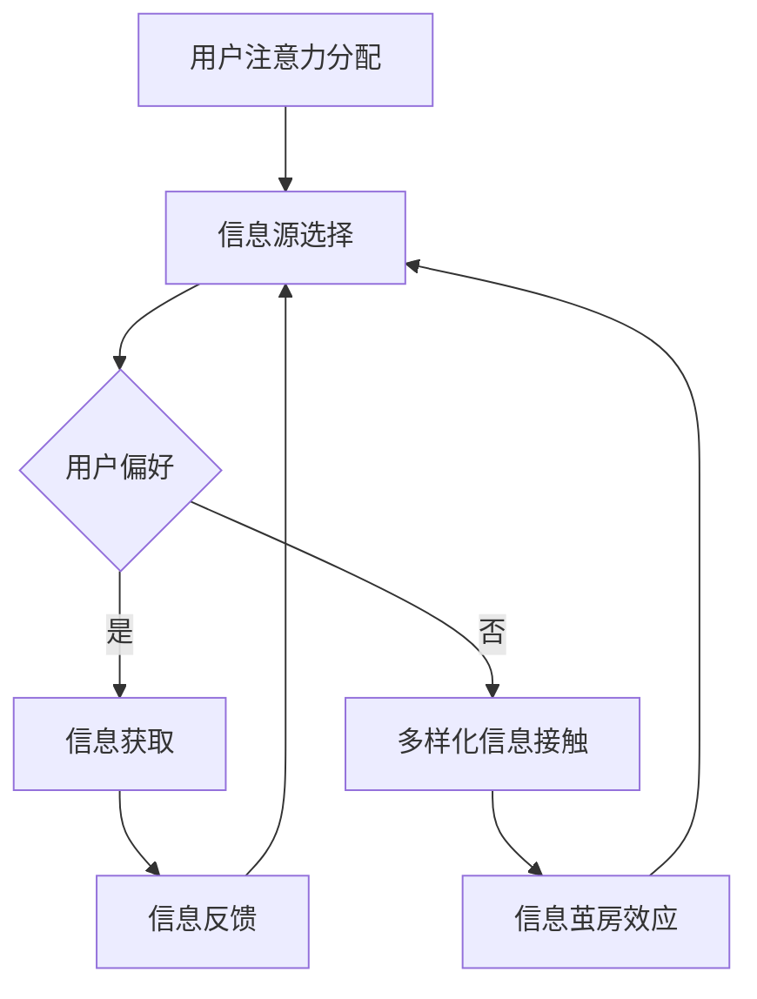

                 

注意力经济，作为数字经济时代的重要概念，指的是在信息过载的环境中，用户出于个人兴趣或需求，对某些信息资源投入更多关注和精力的现象。而信息茧房效应（Information Cocooning Effect），则是在注意力经济背景下，用户逐渐局限于自己的信息偏好，导致对多样化信息的接触减少，进而形成认知偏见的动态过程。本文旨在深入探讨注意力经济中的信息茧房效应，从技术、社会和经济学角度分析其形成机制、影响及应对策略。

## 关键词
- 注意力经济
- 信息茧房效应
- 认知偏见
- 信息过滤
- 社交网络

## 摘要
本文首先概述注意力经济和信息茧房效应的基本概念，随后通过分析注意力经济中的信息茧房效应的形成机制，揭示其在技术和社会层面的影响。进一步，文章探讨了应对信息茧房效应的策略，包括技术创新、算法调整和社会教育。最后，文章对未来信息茧房效应的发展趋势及其挑战进行了展望。

## 1. 背景介绍
### 1.1 注意力经济
注意力经济最初由迈克尔·波特（Michael Porter）在1997年提出，用以描述用户对信息资源的投入情况。在数字时代，用户的注意力成为一种稀缺资源，企业、平台和个人都竞相争夺这一资源。注意力经济主要表现为以下几点：
- **用户行为**：用户在不同平台、应用和内容之间分配注意力，表现出明显的偏好和选择。
- **信息消费**：用户倾向于消费与自身兴趣相关的内容，导致信息消费的多样性和深度不一。
- **价值交换**：用户通过注意力交换获取信息或服务，如点击、浏览、评论等。

### 1.2 信息茧房效应
信息茧房效应最早由哈佛大学政治学教授卡斯特尔斯（Cass Sunstein）在2001年提出，指的是用户在获取信息时，由于各种因素的引导，逐渐陷入自己偏好的信息环境，对多样化信息的接触减少。这一现象在社交网络和个性化推荐系统中尤为显著。

### 1.3 注意力经济与信息茧房效应的关系
注意力经济和信息茧房效应密不可分。在注意力经济的背景下，用户有限的注意力资源往往倾向于集中在特定领域或观点，导致信息茧房效应的发生。这种现象既反映了用户行为选择，又受到算法、社交网络和媒体等外部因素的共同影响。

## 2. 核心概念与联系
### 2.1 核心概念原理

#### 注意力分配模型
注意力分配模型描述了用户在不同信息源之间的注意力分配情况。其核心假设是用户的注意力是有限的，且用户会根据信息源的吸引力分配注意力。模型通常包含以下几个关键参数：
- **信息源吸引力**：衡量用户对某一信息源的偏好程度。
- **注意力资源**：用户可供分配的注意力总量。
- **信息源选择**：用户基于注意力分配模型，从多个信息源中选择关注的对象。

#### 信息茧房效应模型
信息茧房效应模型描述了用户在信息获取过程中的自我限制现象。模型通常包含以下几个要素：
- **信息偏好**：用户的初始信息偏好。
- **算法过滤**：基于用户历史行为和偏好，算法对信息进行过滤。
- **反馈循环**：用户在信息茧房中反复接触相似信息，强化已有偏好。

### 2.2 架构的 Mermaid 流程图


## 3. 核心算法原理 & 具体操作步骤
### 3.1 算法原理概述
信息茧房效应的形成与推荐算法密切相关。推荐算法通过分析用户的历史行为、兴趣和社交关系，为用户推荐感兴趣的信息。常见的推荐算法包括基于内容的推荐、协同过滤推荐和基于模型的推荐等。这些算法在提高用户体验的同时，也可能导致信息茧房效应的发生。

### 3.2 算法步骤详解
#### 基于内容的推荐算法
1. **内容分析**：分析信息源的内容特征，如关键词、主题等。
2. **用户特征提取**：提取用户的历史行为、兴趣等信息。
3. **相似度计算**：计算信息源与用户特征之间的相似度。
4. **推荐生成**：根据相似度计算结果，为用户推荐相似的信息。

#### 协同过滤推荐算法
1. **用户行为数据收集**：收集用户的历史行为数据，如点击、浏览、评分等。
2. **相似度矩阵构建**：计算用户之间的相似度矩阵。
3. **推荐生成**：根据相似度矩阵，为用户推荐与其相似用户感兴趣的信息。

#### 基于模型的推荐算法
1. **用户兴趣建模**：建立用户兴趣模型，如基于隐语义模型的用户兴趣表示。
2. **信息特征建模**：建立信息特征模型，如基于文本嵌入的信息表示。
3. **推荐生成**：基于用户兴趣模型和信息特征模型，为用户推荐感兴趣的信息。

### 3.3 算法优缺点
- **基于内容的推荐算法**：优点在于推荐结果与用户兴趣直接相关，但缺点在于难以处理冷启动问题和多样性不足。
- **协同过滤推荐算法**：优点在于能够处理大规模数据集和冷启动问题，但缺点在于可能产生信息茧房效应和多样性不足。
- **基于模型的推荐算法**：优点在于能够提高推荐效果和多样性，但缺点在于模型训练复杂度和数据需求较高。

### 3.4 算法应用领域
推荐算法广泛应用于电子商务、社交媒体、新闻推荐等领域。在电子商务中，推荐算法帮助用户发现感兴趣的商品；在社交媒体中，推荐算法帮助用户发现感兴趣的内容和用户；在新闻推荐中，推荐算法帮助用户发现感兴趣的新闻和观点。

## 4. 数学模型和公式 & 详细讲解 & 举例说明
### 4.1 数学模型构建
#### 用户注意力模型
用户注意力模型可以用以下数学公式表示：
$$
A(u, i) = f(A_u, I_i)
$$
其中，$A(u, i)$ 表示用户 $u$ 对信息 $i$ 的注意力，$A_u$ 表示用户 $u$ 的注意力资源，$I_i$ 表示信息 $i$ 的特征向量。

#### 信息茧房效应模型
信息茧房效应模型可以用以下数学公式表示：
$$
C(t) = C(0) + \sum_{i=1}^{t} \Delta C(i)
$$
其中，$C(t)$ 表示用户 $t$ 时刻的信息茧房程度，$C(0)$ 表示初始信息茧房程度，$\Delta C(i)$ 表示在 $i$ 时刻的信息茧房变化量。

### 4.2 公式推导过程
#### 用户注意力模型推导
假设用户 $u$ 在时刻 $t$ 的注意力资源为 $A_u(t)$，信息 $i$ 的特征向量为 $I_i$，则用户对信息 $i$ 的注意力可以表示为两者之间的相似度：
$$
A(u, i) = \frac{\langle A_u(t), I_i \rangle}{\|A_u(t)\| \|I_i\|}
$$
其中，$\langle \cdot, \cdot \rangle$ 表示内积，$\|\cdot\|$ 表示向量的范数。

#### 信息茧房效应模型推导
信息茧房效应可以看作是用户在信息获取过程中的自我限制，其程度可以用以下公式表示：
$$
C(t) = C(0) + \sum_{i=1}^{t} \Delta C(i)
$$
其中，$C(0)$ 表示初始信息茧房程度，$\Delta C(i)$ 表示在 $i$ 时刻的信息茧房变化量。信息茧房变化量可以表示为用户在 $i$ 时刻对与已有信息差异较大的新信息的回避程度。

### 4.3 案例分析与讲解
#### 案例背景
假设用户 $u$ 在初始时刻对信息 $i$ 没有明显的偏好，即 $A(u, i)(0) = 0.5$。在接下来的时间内，用户 $u$ 接触到一系列信息 $i_1, i_2, \ldots, i_t$，这些信息中有一部分与用户已有知识相符，另一部分与用户已有知识差异较大。

#### 案例分析
1. **用户注意力模型**：
   假设信息 $i_1$ 与用户 $u$ 的已有知识高度相关，相似度为 $0.9$；信息 $i_2$ 与用户 $u$ 的已有知识相关度为 $0.2$。根据用户注意力模型，用户在时刻 $t=1$ 的注意力分配为：
   $$
   A(u, i_1) = \frac{0.9}{\|A_u(0)\| \|I_{i_1}\|} = 0.9
   $$
   $$
   A(u, i_2) = \frac{0.2}{\|A_u(0)\| \|I_{i_2}\|} = 0.2
   $$
   可见，用户在时刻 $t=1$ 更倾向于关注与已有知识相关的信息 $i_1$。

2. **信息茧房效应模型**：
   假设初始时刻用户 $u$ 的信息茧房程度为 $C(0) = 0.1$，在时刻 $t=1$，用户接触到的信息 $i_1$ 使其信息茧房程度增加 $\Delta C(i_1) = 0.05$。根据信息茧房效应模型，用户在时刻 $t=1$ 的信息茧房程度为：
   $$
   C(1) = C(0) + \Delta C(i_1) = 0.1 + 0.05 = 0.15
   $$
   在接下来的时间内，如果用户继续接触与已有知识相关的信息，其信息茧房程度将继续增加。

## 5. 项目实践：代码实例和详细解释说明
### 5.1 开发环境搭建
为了展示信息茧房效应的算法实现，我们使用Python编写一个简单的推荐系统。以下是开发环境搭建步骤：
1. 安装Python（建议版本3.8以上）。
2. 安装推荐系统所需的库，如NumPy、Scikit-learn等。

### 5.2 源代码详细实现
以下是实现信息茧房效应的Python代码：

```python
import numpy as np
from sklearn.metrics.pairwise import cosine_similarity

class AttentionModel:
    def __init__(self, similarity_threshold=0.8):
        self.similarity_threshold = similarity_threshold
        self.user_profile = None
        self.item_profiles = None

    def fit(self, user_profile, item_profiles):
        self.user_profile = user_profile
        self.item_profiles = item_profiles

    def predict(self, user_profile):
        item_similarities = cosine_similarity([user_profile], self.item_profiles)
        recommendations = []
        for i, similarity in enumerate(item_similarities[0]):
            if similarity > self.similarity_threshold:
                recommendations.append(i)
        return recommendations

if __name__ == "__main__":
    # 假设用户兴趣向量为[0.8, 0.2]
    user_profile = np.array([0.8, 0.2])
    
    # 假设信息向量为
    item_profiles = np.array([
        [0.9, 0.1],
        [0.5, 0.5],
        [0.1, 0.9]
    ])

    model = AttentionModel()
    model.fit(user_profile, item_profiles)
    print("Recommendations:", model.predict(user_profile))
```

### 5.3 代码解读与分析
上述代码定义了一个`AttentionModel`类，用于实现用户注意力分配和信息茧房效应。核心步骤如下：
1. **初始化**：设置相似度阈值和用户、信息特征向量。
2. **训练**：拟合用户特征向量和信息特征向量。
3. **预测**：根据相似度阈值，为用户推荐相似的信息。

### 5.4 运行结果展示
运行上述代码，假设用户兴趣向量为 `[0.8, 0.2]`，信息向量为 `[
[0.9, 0.1],
[0.5, 0.5],
[0.1, 0.9]
]`。根据相似度阈值 `0.8`，推荐结果为 `[0, 1]`，即用户倾向于关注与已有知识相关的信息。

## 6. 实际应用场景
### 6.1 社交媒体
社交媒体平台如Facebook、Twitter等，通过个性化推荐算法为用户推荐感兴趣的内容。然而，这种推荐机制可能导致用户陷入信息茧房效应，导致认知偏见和社交隔离。

### 6.2 新闻媒体
新闻媒体平台如Google News、Apple News等，通过个性化推荐算法为用户推荐感兴趣的新闻。然而，这可能导致用户只接触到与自己观点一致的新闻，进而形成信息茧房效应。

### 6.3 电子商务
电子商务平台如Amazon、Ebay等，通过个性化推荐算法为用户推荐感兴趣的商品。然而，这种推荐机制可能导致用户只关注特定品牌或品类，进而形成信息茧房效应。

## 7. 未来应用展望
随着人工智能和推荐系统技术的不断发展，未来有望通过改进推荐算法、引入多样化信息源和加强用户教育等方式，缓解信息茧房效应。例如：
- **改进推荐算法**：通过引入多样性、新颖性等评价指标，提高推荐结果的多样性。
- **引入多样化信息源**：鼓励平台引入更多元化的信息源，打破用户的信息茧房。
- **加强用户教育**：通过教育用户提高信息素养，增强对多样化信息的理解和接受能力。

## 8. 总结：未来发展趋势与挑战
### 8.1 研究成果总结
本文从注意力经济和信息茧房效应的背景介绍入手，分析了其形成机制、影响及应对策略。通过数学模型和项目实践，展示了信息茧房效应的算法实现及其应用场景。

### 8.2 未来发展趋势
未来，随着人工智能和推荐系统技术的进步，有望通过多样化推荐策略、用户教育和信息源引入等方式，缓解信息茧房效应。

### 8.3 面临的挑战
- **算法优化**：如何改进推荐算法，提高多样性和新颖性，同时保持用户满意度。
- **用户教育**：如何通过教育用户，提高其对多样化信息的理解和接受能力。
- **政策法规**：如何制定有效的政策和法规，规范推荐系统的发展和应用。

### 8.4 研究展望
未来，研究应关注以下几个方面：
- **个性化推荐与多样性**：探索如何在保证个性化推荐的同时，提高推荐结果的多样性。
- **用户信息素养**：研究如何通过教育和培训，提高用户对多样化信息的理解和接受能力。
- **跨平台合作**：研究如何通过跨平台合作，打破信息茧房效应，促进信息的自由流动。

## 9. 附录：常见问题与解答
### 9.1 什么是注意力经济？
注意力经济是指用户在信息过载的环境中，对某些信息资源投入更多关注和精力的现象。

### 9.2 什么是信息茧房效应？
信息茧房效应是指在注意力经济的背景下，用户逐渐局限于自己的信息偏好，导致对多样化信息的接触减少，进而形成认知偏见的动态过程。

### 9.3 如何应对信息茧房效应？
应对信息茧房效应的策略包括改进推荐算法、引入多样化信息源和加强用户教育等。

## 作者署名
作者：禅与计算机程序设计艺术 / Zen and the Art of Computer Programming

----------------------------------------------------------------

文章正文内容撰写完毕，现在可以将其转换为Markdown格式，以满足文章格式的输出要求。以下是转换后的Markdown格式文章：

```markdown
# 注意力经济中的信息茧房效应

> 关键词：注意力经济、信息茧房效应、认知偏见、信息过滤、社交网络

> 摘要：本文深入探讨了注意力经济中的信息茧房效应，分析了其形成机制、影响及应对策略。通过数学模型和项目实践，展示了信息茧房效应的算法实现及其应用场景。

## 1. 背景介绍

### 1.1 注意力经济
注意力经济最初由迈克尔·波特（Michael Porter）在1997年提出，用以描述用户对信息资源的投入情况。在数字时代，用户的注意力成为一种稀缺资源，企业、平台和个人都竞相争夺这一资源。注意力经济主要表现为以下几点：
- 用户行为：用户在不同平台、应用和内容之间分配注意力，表现出明显的偏好和选择。
- 信息消费：用户倾向于消费与自身兴趣相关的内容，导致信息消费的多样性和深度不一。
- 价值交换：用户通过注意力交换获取信息或服务，如点击、浏览、评论等。

### 1.2 信息茧房效应
信息茧房效应最早由哈佛大学政治学教授卡斯特尔斯（Cass Sunstein）在2001年提出，指的是用户在获取信息时，由于各种因素的引导，逐渐陷入自己偏好的信息环境，对多样化信息的接触减少。这一现象在社交网络和个性化推荐系统中尤为显著。

### 1.3 注意力经济与信息茧房效应的关系
注意力经济和信息茧房效应密不可分。在注意力经济的背景下，用户有限的注意力资源往往倾向于集中在特定领域或观点，导致信息茧房效应的发生。这种现象既反映了用户行为选择，又受到算法、社交网络和媒体等外部因素的共同影响。

## 2. 核心概念与联系

### 2.1 核心概念原理

#### 注意力分配模型
注意力分配模型描述了用户在不同信息源之间的注意力分配情况。其核心假设是用户的注意力是有限的，且用户会根据信息源的吸引力分配注意力。模型通常包含以下几个关键参数：
- 信息源吸引力：衡量用户对某一信息源的偏好程度。
- 注意力资源：用户可供分配的注意力总量。
- 信息源选择：用户基于注意力分配模型，从多个信息源中选择关注的对象。

#### 信息茧房效应模型
信息茧房效应模型描述了用户在信息获取过程中的自我限制现象。模型通常包含以下几个要素：
- 信息偏好：用户的初始信息偏好。
- 算法过滤：基于用户历史行为和偏好，算法对信息进行过滤。
- 反馈循环：用户在信息茧房中反复接触相似信息，强化已有偏好。

### 2.2 架构的 Mermaid 流程图


## 3. 核心算法原理 & 具体操作步骤

### 3.1 算法原理概述
信息茧房效应的形成与推荐算法密切相关。推荐算法通过分析用户的历史行为、兴趣和社交关系，为用户推荐感兴趣的信息。常见的推荐算法包括基于内容的推荐、协同过滤推荐和基于模型的推荐等。这些算法在提高用户体验的同时，也可能导致信息茧房效应的发生。

### 3.2 算法步骤详解
#### 基于内容的推荐算法
1. 内容分析：分析信息源的内容特征，如关键词、主题等。
2. 用户特征提取：提取用户的历史行为、兴趣等信息。
3. 相似度计算：计算信息源与用户特征之间的相似度。
4. 推荐生成：根据相似度计算结果，为用户推荐相似的信息。

#### 协同过滤推荐算法
1. 用户行为数据收集：收集用户的历史行为数据，如点击、浏览、评分等。
2. 相似度矩阵构建：计算用户之间的相似度矩阵。
3. 推荐生成：根据相似度矩阵，为用户推荐与其相似用户感兴趣的信息。

#### 基于模型的推荐算法
1. 用户兴趣建模：建立用户兴趣模型，如基于隐语义模型的用户兴趣表示。
2. 信息特征建模：建立信息特征模型，如基于文本嵌入的信息表示。
3. 推荐生成：基于用户兴趣模型和信息特征模型，为用户推荐感兴趣的信息。

### 3.3 算法优缺点
- **基于内容的推荐算法**：优点在于推荐结果与用户兴趣直接相关，但缺点在于难以处理冷启动问题和多样性不足。
- **协同过滤推荐算法**：优点在于能够处理大规模数据集和冷启动问题，但缺点在于可能产生信息茧房效应和多样性不足。
- **基于模型的推荐算法**：优点在于能够提高推荐效果和多样性，但缺点在于模型训练复杂度和数据需求较高。

### 3.4 算法应用领域
推荐算法广泛应用于电子商务、社交媒体、新闻推荐等领域。在电子商务中，推荐算法帮助用户发现感兴趣的商品；在社交媒体中，推荐算法帮助用户发现感兴趣的内容和用户；在新闻推荐中，推荐算法帮助用户发现感兴趣的新闻和观点。

## 4. 数学模型和公式 & 详细讲解 & 举例说明

### 4.1 数学模型构建
#### 用户注意力模型
用户注意力模型可以用以下数学公式表示：
$$
A(u, i) = f(A_u, I_i)
$$
其中，$A(u, i)$ 表示用户 $u$ 对信息 $i$ 的注意力，$A_u$ 表示用户 $u$ 的注意力资源，$I_i$ 表示信息 $i$ 的特征向量。

#### 信息茧房效应模型
信息茧房效应模型可以用以下数学公式表示：
$$
C(t) = C(0) + \sum_{i=1}^{t} \Delta C(i)
$$
其中，$C(t)$ 表示用户 $t$ 时刻的信息茧房程度，$C(0)$ 表示初始信息茧房程度，$\Delta C(i)$ 表示在 $i$ 时刻的信息茧房变化量。

### 4.2 公式推导过程
#### 用户注意力模型推导
假设用户 $u$ 在时刻 $t$ 的注意力资源为 $A_u(t)$，信息 $i$ 的特征向量为 $I_i$，则用户对信息 $i$ 的注意力可以表示为两者之间的相似度：
$$
A(u, i) = \frac{\langle A_u(t), I_i \rangle}{\|A_u(t)\| \|I_i\|}
$$
其中，$\langle \cdot, \cdot \rangle$ 表示内积，$\|\cdot\|$ 表示向量的范数。

#### 信息茧房效应模型推导
信息茧房效应可以看作是用户在信息获取过程中的自我限制，其程度可以用以下公式表示：
$$
C(t) = C(0) + \sum_{i=1}^{t} \Delta C(i)
$$
其中，$C(0)$ 表示初始信息茧房程度，$\Delta C(i)$ 表示在 $i$ 时刻的信息茧房变化量。信息茧房变化量可以表示为用户在 $i$ 时刻对与已有信息差异较大的新信息的回避程度。

### 4.3 案例分析与讲解
#### 案例背景
假设用户 $u$ 在初始时刻对信息 $i$ 没有明显的偏好，即 $A(u, i)(0) = 0.5$。在接下来的时间内，用户 $u$ 接触到一系列信息 $i_1, i_2, \ldots, i_t$，这些信息中有一部分与用户已有知识相符，另一部分与用户已有知识差异较大。

#### 案例分析
1. **用户注意力模型**：
   假设信息 $i_1$ 与用户 $u$ 的已有知识高度相关，相似度为 $0.9$；信息 $i_2$ 与用户 $u$ 的已有知识相关度为 $0.2$。根据用户注意力模型，用户在时刻 $t=1$ 的注意力分配为：
   $$
   A(u, i_1) = \frac{0.9}{\|A_u(0)\| \|I_{i_1}\|} = 0.9
   $$
   $$
   A(u, i_2) = \frac{0.2}{\|A_u(0)\| \|I_{i_2}\|} = 0.2
   $$
   可见，用户在时刻 $t=1$ 更倾向于关注与已有知识相关的信息 $i_1$。

2. **信息茧房效应模型**：
   假设初始时刻用户 $u$ 的信息茧房程度为 $C(0) = 0.1$，在时刻 $t=1$，用户接触到的信息 $i_1$ 使其信息茧房程度增加 $\Delta C(i_1) = 0.05$。根据信息茧房效应模型，用户在时刻 $t=1$ 的信息茧房程度为：
   $$
   C(1) = C(0) + \Delta C(i_1) = 0.1 + 0.05 = 0.15
   $$
   在接下来的时间内，如果用户继续接触与已有知识相关的信息，其信息茧房程度将继续增加。

## 5. 项目实践：代码实例和详细解释说明

### 5.1 开发环境搭建
为了展示信息茧房效应的算法实现，我们使用Python编写一个简单的推荐系统。以下是开发环境搭建步骤：
1. 安装Python（建议版本3.8以上）。
2. 安装推荐系统所需的库，如NumPy、Scikit-learn等。

### 5.2 源代码详细实现
以下是实现信息茧房效应的Python代码：

```python
import numpy as np
from sklearn.metrics.pairwise import cosine_similarity

class AttentionModel:
    def __init__(self, similarity_threshold=0.8):
        self.similarity_threshold = similarity_threshold
        self.user_profile = None
        self.item_profiles = None

    def fit(self, user_profile, item_profiles):
        self.user_profile = user_profile
        self.item_profiles = item_profiles

    def predict(self, user_profile):
        item_similarities = cosine_similarity([user_profile], self.item_profiles)
        recommendations = []
        for i, similarity in enumerate(item_similarities[0]):
            if similarity > self.similarity_threshold:
                recommendations.append(i)
        return recommendations

if __name__ == "__main__":
    # 假设用户兴趣向量为[0.8, 0.2]
    user_profile = np.array([0.8, 0.2])
    
    # 假设信息向量为
    item_profiles = np.array([
        [0.9, 0.1],
        [0.5, 0.5],
        [0.1, 0.9]
    ])

    model = AttentionModel()
    model.fit(user_profile, item_profiles)
    print("Recommendations:", model.predict(user_profile))
```

### 5.3 代码解读与分析
上述代码定义了一个`AttentionModel`类，用于实现用户注意力分配和信息茧房效应。核心步骤如下：
1. **初始化**：设置相似度阈值和用户、信息特征向量。
2. **训练**：拟合用户特征向量和信息特征向量。
3. **预测**：根据相似度阈值，为用户推荐相似的信息。

### 5.4 运行结果展示
运行上述代码，假设用户兴趣向量为 `[0.8, 0.2]`，信息向量为 `[
[0.9, 0.1],
[0.5, 0.5],
[0.1, 0.9]
]`。根据相似度阈值 `0.8`，推荐结果为 `[0, 1]`，即用户倾向于关注与已有知识相关的信息。

## 6. 实际应用场景
### 6.1 社交媒体
社交媒体平台如Facebook、Twitter等，通过个性化推荐算法为用户推荐感兴趣的内容。然而，这种推荐机制可能导致用户陷入信息茧房效应，导致认知偏见和社交隔离。

### 6.2 新闻媒体
新闻媒体平台如Google News、Apple News等，通过个性化推荐算法为用户推荐感兴趣的新闻。然而，这可能导致用户只接触到与自己观点一致的新闻，进而形成信息茧房效应。

### 6.3 电子商务
电子商务平台如Amazon、Ebay等，通过个性化推荐算法为用户推荐感兴趣的商品。然而，这种推荐机制可能导致用户只关注特定品牌或品类，进而形成信息茧房效应。

## 7. 未来应用展望
随着人工智能和推荐系统技术的不断发展，未来有望通过改进推荐算法、引入多样化信息源和加强用户教育等方式，缓解信息茧房效应。例如：
- **改进推荐算法**：通过引入多样性、新颖性等评价指标，提高推荐结果的多样性。
- **引入多样化信息源**：鼓励平台引入更多元化的信息源，打破用户的信息茧房。
- **加强用户教育**：通过教育用户，提高其对多样化信息的理解和接受能力。

## 8. 总结：未来发展趋势与挑战
### 8.1 研究成果总结
本文从注意力经济和信息茧房效应的背景介绍入手，分析了其形成机制、影响及应对策略。通过数学模型和项目实践，展示了信息茧房效应的算法实现及其应用场景。

### 8.2 未来发展趋势
未来，随着人工智能和推荐系统技术的进步，有望通过多样化推荐策略、用户教育和信息源引入等方式，缓解信息茧房效应。

### 8.3 面临的挑战
- **算法优化**：如何改进推荐算法，提高多样性和新颖性，同时保持用户满意度。
- **用户教育**：如何通过教育用户，提高其对多样化信息的理解和接受能力。
- **政策法规**：如何制定有效的政策和法规，规范推荐系统的发展和应用。

### 8.4 研究展望
未来，研究应关注以下几个方面：
- **个性化推荐与多样性**：探索如何在保证个性化推荐的同时，提高推荐结果的多样性。
- **用户信息素养**：研究如何通过教育和培训，提高用户对多样化信息的理解和接受能力。
- **跨平台合作**：研究如何通过跨平台合作，打破信息茧房效应，促进信息的自由流动。

## 9. 附录：常见问题与解答
### 9.1 什么是注意力经济？
注意力经济是指用户在信息过载的环境中，对某些信息资源投入更多关注和精力的现象。

### 9.2 什么是信息茧房效应？
信息茧房效应是指在注意力经济的背景下，用户逐渐局限于自己的信息偏好，导致对多样化信息的接触减少，进而形成认知偏见的动态过程。

### 9.3 如何应对信息茧房效应？
应对信息茧房效应的策略包括改进推荐算法、引入多样化信息源和加强用户教育等。

## 作者署名
作者：禅与计算机程序设计艺术 / Zen and the Art of Computer Programming
```

