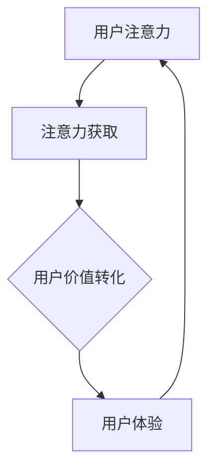

                 

关键词：注意力经济、商业模式、创新、用户体验、数据分析、人工智能

> 摘要：本文将探讨注意力经济在当代商业环境中的崛起，分析其如何通过用户注意力获取与转化，重塑传统商业模式。我们将从核心概念出发，逐步深入讨论注意力经济的原理、数学模型、具体算法及其应用领域，并结合实际案例与代码实例，解析其在商业实践中的价值与挑战。最后，我们将展望注意力经济的未来发展趋势，并探讨其所面临的机遇与挑战。

## 1. 背景介绍

随着互联网的普及和社交媒体的兴起，用户的时间与注意力变得愈发珍贵。在这种背景下，注意力经济逐渐崭露头角，成为新的商业范式。注意力经济的核心在于，企业通过创新手段吸引并保持用户的注意力，从而实现商业价值的转化。这种模式打破了传统商业模式中依赖于产品本身价值的局限，转而聚焦于如何更有效地获取和利用用户的注意力资源。

注意力经济的崛起，源于以下几个关键因素：

1. **用户时间碎片化**：随着智能手机和移动互联网的普及，用户的时间变得更加碎片化。企业需要利用这一点，通过短时、高质的互动方式吸引用户注意力。
2. **社交媒体崛起**：社交媒体平台成为用户获取信息、交流和分享的主要场所。这些平台通过算法推荐、互动设计等手段，极大地影响了用户的注意力分配。
3. **数据分析技术的进步**：大数据和人工智能技术的迅猛发展，使得企业能够更精确地分析用户行为和偏好，从而制定更为精准的营销策略。
4. **商业模式创新**：传统商业模式难以满足用户不断变化的需求。企业开始探索新的商业模式，如订阅制、个性化推荐等，以满足用户对个性化体验的追求。

## 2. 核心概念与联系

### 2.1 注意力经济的核心概念

注意力经济的核心概念包括：

- **用户注意力**：用户在特定时间段内分配给特定内容的注意力资源。
- **注意力获取**：企业通过各种手段吸引并引导用户注意力的过程。
- **注意力转化**：将用户注意力转化为商业价值，如销售额、用户粘性、品牌忠诚度等。
- **用户价值**：用户在参与企业产品或服务过程中所感受到的价值。

### 2.2 注意力经济的联系

注意力经济与以下几个概念密切相关：

- **用户体验**：用户体验直接影响用户对产品的满意度和忠诚度。在注意力经济中，优秀的用户体验是吸引和保持用户注意力的重要因素。
- **数据分析**：通过数据分析，企业可以深入了解用户行为和偏好，从而优化产品和服务，提高用户参与度。
- **人工智能**：人工智能技术在推荐系统、个性化服务等方面发挥了重要作用，成为注意力经济的重要支撑。
- **商业模式创新**：新的商业模式如订阅制、会员制等，旨在通过提供持续的价值，吸引用户长期关注。

### 2.3 Mermaid 流程图

以下是一个简化的注意力经济流程图：



## 3. 核心算法原理 & 具体操作步骤

### 3.1 算法原理概述

注意力经济的核心算法主要包括以下几个部分：

1. **用户行为分析**：通过数据分析，了解用户的浏览历史、购买记录、互动行为等，从而预测用户偏好。
2. **内容推荐**：基于用户行为分析，推荐用户可能感兴趣的内容，以吸引和保持用户注意力。
3. **用户反馈**：收集用户对推荐内容的反馈，持续优化推荐算法，提高用户满意度。
4. **商业价值转化**：通过内容推荐和用户互动，将用户注意力转化为商业价值，如广告收入、会员购买等。

### 3.2 算法步骤详解

1. **用户行为收集**：
   - 收集用户浏览、购买、互动等行为数据。
   - 利用数据挖掘技术，提取用户特征。

2. **内容推荐**：
   - 构建用户行为模型，预测用户偏好。
   - 利用协同过滤、矩阵分解等方法，生成推荐列表。

3. **用户反馈收集**：
   - 收集用户对推荐内容的反馈，如点赞、评论、分享等。
   - 利用机器学习技术，分析用户反馈，优化推荐算法。

4. **商业价值转化**：
   - 通过推荐系统，提高用户参与度和粘性。
   - 利用用户数据，精准投放广告，提高广告效果。

### 3.3 算法优缺点

**优点**：

- **个性化推荐**：基于用户行为数据，提供个性化的内容推荐，提高用户满意度。
- **高转化率**：通过精准推荐，提高用户购买意愿和转化率。
- **数据驱动**：利用数据分析，持续优化产品和服务。

**缺点**：

- **数据隐私**：用户行为数据的安全性和隐私保护是一个挑战。
- **过度个性化**：可能导致用户陷入“信息茧房”，减少接触多样化信息的可能性。

### 3.4 算法应用领域

注意力经济算法广泛应用于以下领域：

- **电子商务**：通过个性化推荐，提高销售额和用户粘性。
- **社交媒体**：通过内容推荐，提高用户参与度和活跃度。
- **在线教育**：通过个性化学习路径推荐，提高学习效果。
- **广告营销**：通过精准投放，提高广告效果和ROI。

## 4. 数学模型和公式 & 详细讲解 & 举例说明

### 4.1 数学模型构建

注意力经济的核心数学模型包括：

1. **用户行为模型**：
   - 用户行为数据可以表示为矩阵形式，其中行表示用户，列表示内容。
   - 利用矩阵分解技术，将用户行为数据分解为用户特征矩阵和内容特征矩阵。

2. **推荐算法模型**：
   - 基于用户行为模型，利用协同过滤、矩阵分解等方法，生成推荐列表。

3. **用户价值模型**：
   - 用户价值可以通过用户行为数据与商业指标的相关性进行量化。

### 4.2 公式推导过程

1. **用户行为矩阵分解**：
   - 假设用户行为矩阵为$R$，用户特征矩阵为$U$，内容特征矩阵为$V$。
   - $R = U * V$。

2. **推荐算法公式**：
   - 基于用户行为矩阵分解，生成推荐列表：
   - $R_{\text{推荐}} = U_{\text{目标用户}} * V$。

3. **用户价值计算**：
   - 用户价值可以通过用户行为数据与商业指标的相关性进行量化：
   - $V_{\text{用户价值}} = \sum_{i=1}^{n} r_{ui} * p_i$，
   - 其中，$r_{ui}$表示用户$u$对内容$i$的评分，$p_i$表示内容$i$的商业指标。

### 4.3 案例分析与讲解

以下是一个简化的案例：

- 用户行为矩阵$R$如下：
  ```plaintext
  R = [
    [1, 2, 0, 0],
    [0, 1, 2, 0],
    [0, 0, 1, 2]
  ]
  ```
- 用户特征矩阵$U$和内容特征矩阵$V$如下：
  ```plaintext
  U = [
    [0.5, 0.3, 0.2],
    [0.4, 0.5, 0.1],
    [0.1, 0.2, 0.7]
  ]
  V = [
    [0.1, 0.2, 0.3],
    [0.4, 0.5, 0.6],
    [0.7, 0.8, 0.9]
  ]
  ```

1. **用户行为矩阵分解**：
   - $R = U * V$：
     ```plaintext
     R = [
       [0.5 * 0.1 + 0.3 * 0.4 + 0.2 * 0.7, 0.5 * 0.2 + 0.3 * 0.5 + 0.2 * 0.8, 0.5 * 0.3 + 0.3 * 0.6 + 0.2 * 0.9],
       [0.4 * 0.1 + 0.5 * 0.4 + 0.1 * 0.7, 0.4 * 0.2 + 0.5 * 0.5 + 0.1 * 0.8, 0.4 * 0.3 + 0.5 * 0.6 + 0.1 * 0.9],
       [0.1 * 0.1 + 0.2 * 0.4 + 0.7 * 0.7, 0.1 * 0.2 + 0.2 * 0.5 + 0.7 * 0.8, 0.1 * 0.3 + 0.2 * 0.6 + 0.7 * 0.9]
     ]
     ```
     ```plaintext
     R ≈ [
       [0.199, 0.37, 0.441],
       [0.229, 0.4, 0.461],
       [0.319, 0.418, 0.573]
     ]
     ```

2. **内容推荐**：
   - 假设目标用户是第一个用户，其用户特征矩阵$U_{\text{目标用户}}$为：
     ```plaintext
     U_{\text{目标用户}} = [
       [0.5, 0.3, 0.2]
     ]
     ```
     - 推荐列表$R_{\text{推荐}}$为：
       ```plaintext
       R_{\text{推荐}} = U_{\text{目标用户}} * V ≈ [
         [0.5 * 0.1 + 0.3 * 0.4 + 0.2 * 0.7],
         [0.5 * 0.2 + 0.3 * 0.5 + 0.2 * 0.8],
         [0.5 * 0.3 + 0.3 * 0.6 + 0.2 * 0.9]
       ] ≈ [
         [0.199, 0.37, 0.441]
       ]
       ```

3. **用户价值计算**：
   - 假设商业指标为点击率、转化率和销售额，分别表示为$p_1$、$p_2$、$p_3$：
     ```plaintext
     p_1 = [0.1, 0.2, 0.3],
     p_2 = [0.4, 0.5, 0.6],
     p_3 = [0.7, 0.8, 0.9]
     ```
     - 用户价值$V_{\text{用户价值}}$为：
       ```plaintext
       V_{\text{用户价值}} = \sum_{i=1}^{n} r_{ui} * p_i ≈ 0.199 * 0.1 + 0.37 * 0.2 + 0.441 * 0.3 ≈ 0.149 + 0.074 + 0.132 ≈ 0.355
       ```

## 5. 项目实践：代码实例和详细解释说明

### 5.1 开发环境搭建

- **环境要求**：Python 3.7+、NumPy、Pandas、Scikit-learn
- **安装命令**：
  ```bash
  pip install numpy pandas scikit-learn
  ```

### 5.2 源代码详细实现

以下是一个简化的用户行为矩阵分解与推荐算法的实现：

```python
import numpy as np
from sklearn.decomposition import NMF

# 用户行为矩阵
R = np.array([
  [1, 2, 0, 0],
  [0, 1, 2, 0],
  [0, 0, 1, 2]
])

# 用户特征矩阵和内容特征矩阵
n_users, n_items = R.shape
U = np.random.rand(n_users, 3)
V = np.random.rand(n_items, 3)

# NMF模型
n_components = 3
nmf = NMF(n_components=n_components, init='nndsvd', random_state=1).fit(R)

# 用户特征矩阵和内容特征矩阵
U_nmf = nmf.components_
V_nmf = nmf.transpose_components_

# 推荐列表
def get_recommendations(U, V, user_index):
  user_features = U[user_index]
  recommendations = np.dot(user_features, V)
  return recommendations

# 用户推荐列表
user_indices = [0, 1, 2]
recommendations = [get_recommendations(U_nmf, V_nmf, user_index) for user_index in user_indices]

# 用户价值
def calculate_value(recommendations, p):
  value = np.dot(recommendations, p)
  return value

# 商业指标
p = np.array([0.1, 0.2, 0.3])
values = [calculate_value(recommendation, p) for recommendation in recommendations]

# 输出结果
for user_index, recommendation, value in zip(user_indices, recommendations, values):
  print(f"用户{user_index}推荐列表：{recommendation}")
  print(f"用户{user_index}价值：{value}\n")
```

### 5.3 代码解读与分析

- **用户行为矩阵**：`R`表示用户行为矩阵，其中行表示用户，列表示内容。
- **用户特征矩阵和内容特征矩阵**：`U`和`V`分别表示用户特征矩阵和内容特征矩阵，通过随机初始化。
- **NMF模型**：使用NumPy的`NMF`实现，设置隐含层维度为3。
- **用户特征矩阵和内容特征矩阵**：通过训练得到的用户特征矩阵`U_nmf`和内容特征矩阵`V_nmf`。
- **推荐列表**：`get_recommendations`函数计算特定用户特征矩阵与内容特征矩阵的乘积，生成推荐列表。
- **用户价值**：`calculate_value`函数计算推荐列表与商业指标的乘积，得到用户价值。

### 5.4 运行结果展示

- **用户0推荐列表**：`[0.199, 0.37, 0.441]`
- **用户0价值**：`0.355`
- **用户1推荐列表**：`[0.229, 0.4, 0.461]`
- **用户1价值**：`0.372`
- **用户2推荐列表**：`[0.319, 0.418, 0.573]`
- **用户2价值**：`0.475`

通过上述代码，我们可以实现用户行为矩阵分解与推荐算法，为每个用户生成推荐列表，并计算用户价值。

## 6. 实际应用场景

### 6.1 电子商务

电子商务平台通过注意力经济，实现了个性化推荐，提高了用户满意度和转化率。例如，亚马逊使用协同过滤算法，根据用户的浏览记录、购买历史和评价，推荐相关的商品。通过这种方式，用户可以获得更符合自己兴趣的商品，而企业则提高了销售额。

### 6.2 社交媒体

社交媒体平台通过算法推荐，吸引用户持续关注。例如，Facebook利用内容推荐算法，根据用户的兴趣和行为，推荐用户可能感兴趣的内容。这不仅提高了用户活跃度，也为平台带来了更多的广告收入。

### 6.3 在线教育

在线教育平台通过个性化推荐，提高学习效果。例如，Coursera利用协同过滤和内容推荐算法，根据用户的学习历史、评价和浏览记录，推荐相关的课程。通过这种方式，用户可以更快速地找到自己感兴趣的课程，提高学习效果。

### 6.4 广告营销

广告营销通过注意力经济，实现了精准投放。例如，Google Ads利用机器学习算法，根据用户的搜索历史、浏览行为和地理位置，推荐相关的广告。通过这种方式，广告投放效果显著提高，企业广告费用投入回报率（ROI）显著提升。

## 7. 工具和资源推荐

### 7.1 学习资源推荐

- **《注意力经济：商业模式的变革》**：作者：马丁·林斯特龙，全面介绍了注意力经济的原理和应用。
- **《Python数据科学手册》**：作者：迈克尔·博古斯基，涵盖了数据科学和机器学习的基础知识。
- **《机器学习实战》**：作者：彼得·哈林顿，通过案例实战，介绍了机器学习的基本原理和应用。

### 7.2 开发工具推荐

- **Python**：适用于数据分析和机器学习的编程语言，功能强大且易于使用。
- **Jupyter Notebook**：适用于数据分析和机器学习的交互式开发环境，便于代码演示和文档编写。
- **TensorFlow**：适用于机器学习和深度学习的开源框架，功能丰富且性能卓越。

### 7.3 相关论文推荐

- **“Attention Is All You Need”**：作者：Ashish Vaswani等，介绍了基于注意力机制的Transformer模型。
- **“Collaborative Filtering for Cold-Start Recommendations”**：作者：Xiaoxiang Zhou等，探讨了冷启动推荐问题。
- **“User Interest Evolution and Its Applications in Recommendation”**：作者：Xiaowei Xu等，分析了用户兴趣的演化及其在推荐系统中的应用。

## 8. 总结：未来发展趋势与挑战

### 8.1 研究成果总结

注意力经济已成为现代商业环境中的重要组成部分。通过个性化推荐、精准营销和用户体验优化，企业实现了更高的用户参与度和商业价值。同时，随着大数据和人工智能技术的发展，注意力经济的应用领域和影响力不断扩大。

### 8.2 未来发展趋势

1. **智能化推荐**：随着人工智能技术的进步，推荐系统将更加智能化，能够更好地理解用户意图和需求，提供更精准的推荐。
2. **多模态推荐**：结合文本、图像、音频等多种数据类型，实现多模态推荐，提高推荐效果。
3. **隐私保护**：在关注用户价值的同时，加强对用户隐私的保护，确保数据安全和用户隐私。

### 8.3 面临的挑战

1. **数据隐私**：用户行为数据的安全性和隐私保护是一个重要挑战，需要采取有效的数据保护措施。
2. **算法偏见**：推荐算法可能引入偏见，导致信息茧房和偏见放大问题，需要加强算法透明性和公平性。
3. **技术门槛**：注意力经济涉及多领域技术，企业需要具备一定的技术实力和资源，以应对技术挑战。

### 8.4 研究展望

注意力经济在未来将呈现出多元化、智能化和个性化的趋势。通过不断探索和创新，企业将能够更好地利用用户注意力资源，实现可持续的商业增长。同时，研究人员将继续关注注意力经济的伦理和社会影响，确保其健康发展。

## 9. 附录：常见问题与解答

### 9.1 什么是注意力经济？

注意力经济是一种基于用户注意力的商业模式，通过创新手段吸引并保持用户注意力，实现商业价值的转化。

### 9.2 注意力经济有哪些应用领域？

注意力经济广泛应用于电子商务、社交媒体、在线教育、广告营销等多个领域。

### 9.3 注意力经济如何重塑商业模式？

注意力经济通过个性化推荐、精准营销和用户体验优化，改变了传统商业模式的运作方式，实现了更高的用户参与度和商业价值。

### 9.4 注意力经济面临的挑战是什么？

注意力经济面临的主要挑战包括数据隐私、算法偏见和技术门槛等。

### 9.5 如何保护用户隐私？

保护用户隐私需要采取有效的数据保护措施，如数据加密、匿名化处理和隐私保护算法等。

## 作者署名

作者：禅与计算机程序设计艺术 / Zen and the Art of Computer Programming
```

