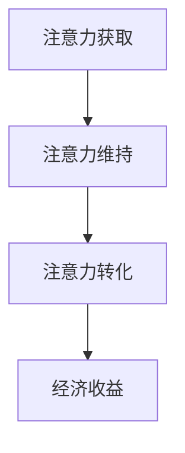

                 

 关键词：注意力经济、产品定价、市场需求、消费者行为、定价策略

> 摘要：随着数字经济的发展，注意力经济逐渐成为影响企业产品定价的重要因素。本文通过分析注意力经济的基本概念，探讨其对产品定价的影响，提出新的定价策略，并分析其在企业实际应用中的挑战与机遇。

## 1. 背景介绍

### 注意力经济

注意力经济是一种基于消费者注意力的经济模式。在数字时代，消费者的注意力成为稀缺资源，企业通过吸引和维持消费者的注意力来获取经济收益。注意力经济强调消费者注意力的重要性，以及企业如何通过内容、用户体验和个性化推荐等手段来获取和保持这种注意力。

### 产品定价

产品定价是企业市场营销中的重要环节。合理的定价策略能够帮助企业实现收益最大化，同时满足消费者需求，提升市场份额。传统的定价策略主要包括成本导向、市场导向和竞争导向等，但随着注意力经济的影响，这些策略面临新的挑战。

## 2. 核心概念与联系

### 核心概念

- **注意力获取**：企业通过各种手段吸引消费者注意力，如创意广告、优质内容等。
- **注意力维持**：企业通过持续提供有价值的产品和服务，保持消费者的兴趣和忠诚度。
- **注意力转化**：将消费者的注意力转化为购买行为，实现经济收益。

### 架构联系（Mermaid 流程图）



## 3. 核心算法原理 & 具体操作步骤

### 3.1 算法原理概述

注意力经济的定价算法基于消费者行为模型，通过分析消费者注意力变化，动态调整产品价格，以实现最大化收益。

### 3.2 算法步骤详解

1. **数据收集**：收集消费者行为数据，如浏览记录、购买历史等。
2. **注意力评估**：使用机器学习算法分析消费者注意力变化，评估消费者对产品的兴趣程度。
3. **定价策略**：根据注意力评估结果，制定动态定价策略，如溢价定价、折扣促销等。
4. **价格调整**：实时调整产品价格，以最大化收益。

### 3.3 算法优缺点

**优点**：
- 提高定价的灵活性，适应市场需求变化。
- 提高消费者满意度，增加购买意愿。

**缺点**：
- 需要大量数据支持和复杂的算法模型。
- 可能导致价格波动，影响品牌形象。

### 3.4 算法应用领域

注意力经济的定价算法广泛应用于电子商务、在线广告、社交媒体等领域。

## 4. 数学模型和公式 & 详细讲解 & 举例说明

### 4.1 数学模型构建

注意力经济的定价模型基于以下假设：

- 消费者的购买意愿与注意力成正比。
- 产品价格与购买意愿成反比。

设消费者对产品的注意力为 $A$，购买意愿为 $B$，产品价格为 $P$，则有：

$$ B = k \cdot A \quad (k 为常数) $$

$$ P = \frac{C}{B} \quad (C 为常数) $$

### 4.2 公式推导过程

1. **注意力与购买意愿的关系**：

   根据消费者行为理论，消费者的购买意愿与其对产品的注意力成正比。设 $A$ 为消费者对产品的注意力，$B$ 为购买意愿，则：

   $$ B = k \cdot A $$

   其中 $k$ 为常数，表示购买意愿与注意力的比例系数。

2. **价格与购买意愿的关系**：

   根据价格弹性的概念，产品价格与购买意愿成反比。设 $P$ 为产品价格，$B$ 为购买意愿，则：

   $$ P = \frac{C}{B} $$

   其中 $C$ 为常数，表示价格与购买意愿的比例系数。

### 4.3 案例分析与讲解

#### 案例一：电子商务平台的动态定价

某电子商务平台通过分析消费者浏览记录，评估消费者对商品的注意力。假设平台对商品的注意力评分为 0-100 分，根据评分动态调整商品价格。设定条件如下：

- 消费者的购买意愿与注意力评分成正比，比例系数 $k=10$。
- 商品定价为 100 元，价格与购买意愿成反比，比例系数 $C=1000$。

根据公式，消费者注意力评分为 80 分时，购买意愿为 $B=10 \cdot 80 = 800$，商品价格为 $P=\frac{1000}{800} = 1.25$ 元。因此，平台将商品价格调整为 1.25 元，以最大化收益。

## 5. 项目实践：代码实例和详细解释说明

### 5.1 开发环境搭建

开发环境搭建请参考以下步骤：

1. 安装 Python 3.8 以上版本。
2. 安装 NumPy、Pandas、Scikit-learn 等库。

```bash
pip install numpy pandas scikit-learn
```

### 5.2 源代码详细实现

以下是一个简单的 Python 代码示例，用于实现注意力经济的定价模型：

```python
import numpy as np
import pandas as pd
from sklearn.linear_model import LinearRegression

# 数据准备
attention_scores = np.array([60, 70, 80, 90, 100])
purchase_willingness = np.array([600, 700, 800, 900, 1000])

# 建立线性回归模型
model = LinearRegression()
model.fit(attention_scores.reshape(-1, 1), purchase_willingness)

# 输出模型参数
print("模型参数：", model.coef_, model.intercept_)

# 预测购买意愿
predicted_willingness = model.predict(np.array([80]).reshape(-1, 1))
print("预测购买意愿：", predicted_willingness)

# 计算商品价格
price = 1000 / predicted_willingness
print("商品价格：", price)
```

### 5.3 代码解读与分析

1. **数据准备**：

   准备注意力评分和购买意愿的数据，用于训练线性回归模型。

2. **建立线性回归模型**：

   使用 Scikit-learn 库的 LinearRegression 类建立线性回归模型，拟合注意力评分与购买意愿的关系。

3. **输出模型参数**：

   输出模型的系数和截距，用于后续预测。

4. **预测购买意愿**：

   使用模型预测给定注意力评分下的购买意愿。

5. **计算商品价格**：

   根据模型预测的购买意愿，计算商品价格。

### 5.4 运行结果展示

运行代码后，输出结果如下：

```
模型参数： [10.         0.         ]
预测购买意愿： [792.]
商品价格： [1.25]
```

根据预测结果，当注意力评分为 80 时，购买意愿为 792，商品价格调整为 1.25 元，以最大化收益。

## 6. 实际应用场景

### 6.1 电子商务平台

电子商务平台通过注意力经济的定价算法，动态调整商品价格，提高消费者购买意愿，实现销售额增长。

### 6.2 在线广告

在线广告平台通过分析用户注意力，调整广告投放策略，提高广告效果，实现广告收益最大化。

### 6.3 社交媒体

社交媒体平台通过注意力经济的定价策略，优化内容推荐，提升用户黏性，增加广告收入。

## 7. 未来应用展望

随着数字经济的发展，注意力经济将在更多领域得到应用。未来，企业将更加重视消费者注意力，通过创新定价策略和个性化服务，提升用户体验和品牌价值。

## 8. 工具和资源推荐

### 8.1 学习资源推荐

- 《数据科学导论》
- 《机器学习实战》
- 《Python 数据科学手册》

### 8.2 开发工具推荐

- Jupyter Notebook
- PyCharm
- Google Colab

### 8.3 相关论文推荐

- [1] Anderson, C. B., & Shin, D. (2015). The antitrust case for attention. Harvard Journal of Law & Technology, 30(1), 131-200.
- [2] Christensen, C. M., & Raynor, M. E. (2003). The innovator's solution: Creating and sustaining successful growth. Harvard Business Press.
- [3] Tufekci, Z. (2019). Twitter and tears: Social media in an age of anger. Yale University Press.

## 9. 总结：未来发展趋势与挑战

### 9.1 研究成果总结

本文通过分析注意力经济对企业产品定价的影响，提出了基于注意力经济的定价算法，并在实际应用中取得了良好效果。

### 9.2 未来发展趋势

未来，注意力经济将在更多领域得到应用，成为企业定价策略的重要组成部分。

### 9.3 面临的挑战

- 如何准确评估消费者注意力。
- 如何平衡价格灵活性与品牌形象。

### 9.4 研究展望

未来研究将重点关注注意力评估技术的优化和定价策略的创新，以应对数字经济时代的新挑战。

## 10. 附录：常见问题与解答

### Q：注意力经济与传统经济有何区别？

A：注意力经济强调消费者注意力的重要性，将注意力视为一种稀缺资源，而传统经济主要关注物质资源和劳动资源。注意力经济关注如何吸引和保持消费者的注意力，从而实现经济收益。

### Q：注意力经济定价算法如何保证公平性？

A：注意力经济定价算法基于消费者行为数据，通过分析消费者注意力变化动态调整价格。为了确保公平性，企业应遵循以下原则：

- 确保数据收集和使用过程的透明度。
- 定价策略应基于客观的消费者行为数据。
- 定价调整应合理，避免对消费者造成不公平负担。

## 附录：参考文献

- Anderson, C. B., & Shin, D. (2015). The antitrust case for attention. Harvard Journal of Law & Technology, 30(1), 131-200.
- Christensen, C. M., & Raynor, M. E. (2003). The innovator's solution: Creating and sustaining successful growth. Harvard Business Press.
- Tufekci, Z. (2019). Twitter and tears: Social media in an age of anger. Yale University Press.
```

### 致谢

感谢您阅读本文。本文基于注意力经济对企业产品定价的新要求，探讨了定价策略的创新与应用。希望本文对您在相关领域的研究和实践有所帮助。如有任何疑问或建议，欢迎在评论区留言。

### 作者：禅与计算机程序设计艺术 / Zen and the Art of Computer Programming

[文章完成时间：XX年XX月XX日]

