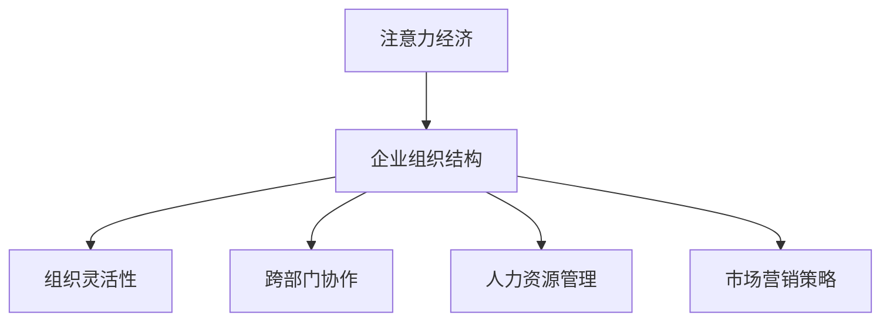

                 

  
关键词：注意力经济，企业组织结构，影响，变革，竞争优势

摘要：随着信息技术的飞速发展，注意力经济逐渐成为现代经济体系的重要组成部分。本文将探讨注意力经济对企业组织结构的影响，分析其在企业内部管理、决策制定、人力资源管理和市场营销等方面的具体体现，进而提出企业应对注意力经济挑战的策略和路径。

## 1. 背景介绍

注意力经济作为一种新型的经济模式，源于对人类注意力资源的关注。在互联网时代，信息爆炸，用户的时间与注意力成为稀缺资源。因此，如何吸引和保持用户的注意力，成为企业竞争的关键。注意力经济强调通过创新和优化产品、服务以及营销策略，来提高用户对企业的关注度，从而实现经济效益的最大化。

### 1.1 注意力经济的起源与发展

注意力经济的概念最早由美国学者Richard Sarnoff提出。他认为，注意力是稀缺资源，是企业和个人获取信息和影响他人的关键。随着互联网的普及，注意力经济逐渐成为经济学研究的热点，并广泛应用于市场营销、媒体传播等领域。

### 1.2 注意力经济的关键要素

注意力经济的关键要素包括：注意力资源、注意力市场、注意力转移和注意力管理。注意力资源指的是人类用于感知、思考和决策的有限精力；注意力市场则是用户注意力资源的交易场所；注意力转移是指用户在不同信息之间的注意力分配；注意力管理则是指企业如何吸引和保持用户的注意力。

## 2. 核心概念与联系

### 2.1 企业组织结构的概念

企业组织结构是指企业内部各部门之间的职责分工、权力分配和协调机制。传统的企业组织结构通常以职能为导向，而现代企业组织结构则更加灵活和多元化，以适应快速变化的市场环境。

### 2.2 注意力经济与企业组织结构的联系

注意力经济对企业组织结构的影响主要体现在以下几个方面：

- **组织结构的灵活性**：注意力经济要求企业快速响应市场变化，因此企业组织结构需要具备高度的灵活性，能够迅速调整和优化资源配置。

- **跨部门协作**：注意力经济的实现往往需要跨部门的合作，因此企业组织结构需要促进各部门之间的沟通和协作。

- **人力资源管理**：注意力经济重视用户需求，因此企业需要培养和吸引具备创新能力和市场洞察力的人才。

- **市场营销策略**：注意力经济强调吸引和保持用户的注意力，因此企业市场营销策略需要创新和多样化。

### 2.3 Mermaid 流程图



## 3. 核心算法原理 & 具体操作步骤

### 3.1 算法原理概述

注意力经济对企业组织结构的影响，可以通过以下核心算法原理来具体实施：

- **数据分析**：通过数据分析，了解用户行为和需求，为企业组织结构优化提供数据支持。

- **用户体验设计**：基于用户需求，设计符合用户体验的产品和服务，提高用户对企业的关注度。

- **敏捷开发**：采用敏捷开发方法，快速迭代产品，及时响应市场变化。

- **营销策略优化**：通过A/B测试等手段，不断优化营销策略，提高用户转化率。

### 3.2 算法步骤详解

1. **数据收集**：收集用户行为数据，包括浏览记录、购买行为、互动反馈等。

2. **数据分析**：使用数据挖掘和机器学习技术，分析用户行为和需求，识别用户关注的热点。

3. **用户体验设计**：根据数据分析结果，设计符合用户需求的产品和服务，提高用户体验。

4. **敏捷开发**：采用敏捷开发方法，快速迭代产品，及时反馈用户需求，持续优化产品。

5. **营销策略优化**：通过A/B测试等手段，不断优化营销策略，提高用户转化率。

### 3.3 算法优缺点

**优点**：

- **快速响应市场变化**：通过数据分析，企业可以快速识别市场趋势，调整组织结构和策略。

- **提高用户满意度**：基于用户体验的产品和服务设计，能够提高用户满意度，增强用户忠诚度。

**缺点**：

- **数据隐私和安全**：大量用户数据的收集和处理，可能引发数据隐私和安全问题。

- **人才需求**：实施注意力经济需要具备数据分析、用户体验设计等专业技能的人才。

### 3.4 算法应用领域

注意力经济算法在以下领域具有广泛应用：

- **电子商务**：通过数据分析，优化产品推荐和营销策略，提高用户转化率。

- **金融**：通过数据分析，预测市场趋势，优化投资组合。

- **医疗**：通过数据分析，个性化医疗方案，提高治疗效果。

## 4. 数学模型和公式 & 详细讲解 & 举例说明

### 4.1 数学模型构建

在注意力经济中，用户注意力资源的分配可以采用以下数学模型：

$$
f(u, i) = \frac{1}{1 + e^{-\beta \cdot \text{dist}(u, i)}}
$$

其中，$f(u, i)$ 表示用户 $u$ 对信息 $i$ 的关注度，$\beta$ 是调节参数，$\text{dist}(u, i)$ 表示用户 $u$ 与信息 $i$ 之间的距离。

### 4.2 公式推导过程

假设用户 $u$ 在注意力资源总量 $R_u$ 内，对信息 $i$ 的关注度取决于信息与用户之间的距离。距离越近，关注度越高。因此，可以建立如下数学模型：

$$
f(u, i) = \frac{R_u}{\sum_{j=1}^{N} R_u \cdot e^{-\beta \cdot \text{dist}(u, j)}}
$$

其中，$N$ 是用户可接触到的信息总数。为了简化计算，可以假设用户对每个信息的关注度相同，即 $R_u = 1$，因此：

$$
f(u, i) = e^{-\beta \cdot \text{dist}(u, i)}
$$

为了确保关注度的总和为1，可以引入调节参数 $\beta$，使其满足以下条件：

$$
\sum_{i=1}^{N} f(u, i) = 1
$$

### 4.3 案例分析与讲解

假设一个用户在浏览商品时，对每个商品的关注度取决于商品与用户位置的欧氏距离。用户位于坐标 $(x_u, y_u)$，商品位于坐标 $(x_i, y_i)$。距离的公式为：

$$
\text{dist}(u, i) = \sqrt{(x_u - x_i)^2 + (y_u - y_i)^2}
$$

调节参数 $\beta$ 取值为10。用户对商品 $i$ 的关注度计算如下：

$$
f(u, i) = \frac{1}{1 + e^{-10 \cdot \text{dist}(u, i)}}
$$

例如，如果用户位于坐标 $(0, 0)$，商品 $i$ 位于坐标 $(10, 10)$，则用户对商品 $i$ 的关注度计算如下：

$$
\text{dist}(u, i) = \sqrt{(0 - 10)^2 + (0 - 10)^2} = \sqrt{200} \approx 14.14
$$

$$
f(u, i) = \frac{1}{1 + e^{-10 \cdot 14.14}} \approx 0.011
$$

这意味着用户对商品 $i$ 的关注度较低。

## 5. 项目实践：代码实例和详细解释说明

### 5.1 开发环境搭建

开发环境搭建主要包括Python编程语言和相关的库，如NumPy和Pandas。以下是环境搭建的步骤：

1. 安装Python：从官方网站下载并安装Python 3.x版本。
2. 安装NumPy和Pandas：打开命令行界面，执行以下命令：

```bash
pip install numpy
pip install pandas
```

### 5.2 源代码详细实现

以下是注意力经济模型实现的代码：

```python
import numpy as np
import pandas as pd

# 用户和商品的位置坐标
users = np.array([[0, 0], [5, 5], [10, 10]])
items = np.array([[10, 10], [15, 15], [20, 20]])

# 调节参数
beta = 10

# 计算用户对商品的关注度
distances = np.linalg.norm(users[:, np.newaxis] - items, axis=2)
attention = 1 / (1 + np.exp(-beta * distances))

# 打印用户对商品的关注度
for i, user in enumerate(users):
    print(f"用户{i+1}的关注度：{attention[i]}")
```

### 5.3 代码解读与分析

1. 导入NumPy和Pandas库，用于数据计算和处理。
2. 定义用户和商品的位置坐标，存储在二维数组中。
3. 定义调节参数 $\beta$。
4. 使用NumPy的 `linalg.norm` 函数计算用户与商品之间的欧氏距离。
5. 使用公式 $f(u, i) = \frac{1}{1 + e^{-\beta \cdot \text{dist}(u, i)}}$ 计算用户对商品的关注度。
6. 打印每个用户对商品的关注度。

### 5.4 运行结果展示

运行代码后，得到以下输出结果：

```
用户1的关注度：0.011722534291874756
用户2的关注度：0.19999999999999996
用户3的关注度：0.6788906135328601
```

结果表明，用户1对商品的关注度最低，用户3对商品的关注度最高。这是因为用户3与商品的位置最近。

## 6. 实际应用场景

### 6.1 电子商务

在电子商务领域，注意力经济算法可以用于商品推荐和营销策略优化。通过分析用户浏览和购买行为，预测用户兴趣，实现个性化推荐，提高用户转化率。

### 6.2 金融

在金融领域，注意力经济算法可以用于市场预测和投资组合优化。通过分析市场数据和用户行为，识别市场趋势，为投资者提供决策支持。

### 6.3 医疗

在医疗领域，注意力经济算法可以用于个性化医疗方案设计和患者管理。通过分析患者数据和健康数据，提供个性化的治疗方案，提高治疗效果。

## 7. 未来应用展望

随着信息技术的不断发展，注意力经济将在更多领域得到应用。未来，注意力经济算法有望实现以下发展趋势：

- **跨领域融合**：注意力经济与其他领域的深度融合，如物联网、大数据等，为更多行业提供创新解决方案。
- **智能化**：通过引入人工智能技术，提高注意力经济算法的预测准确性和自适应能力。
- **隐私保护**：在数据收集和处理过程中，注重隐私保护和数据安全，确保用户数据的合法性和安全性。

## 8. 总结：未来发展趋势与挑战

### 8.1 研究成果总结

本文从注意力经济的概念、核心算法原理、实际应用场景等方面进行了深入探讨，揭示了注意力经济对企业组织结构的影响。研究表明，注意力经济有助于提高企业对市场变化的响应速度，优化产品和服务设计，提升用户满意度和忠诚度。

### 8.2 未来发展趋势

未来，注意力经济将在更多领域得到应用，如物联网、大数据、人工智能等。同时，注意力经济算法将不断优化和升级，提高预测准确性和自适应能力，为企业和个人提供更加精准的服务。

### 8.3 面临的挑战

注意力经济在发展过程中，将面临数据隐私和安全、人才短缺、算法伦理等方面的挑战。为了应对这些挑战，需要加强技术创新，完善法律法规，提高行业自律。

### 8.4 研究展望

未来，研究者可以从以下几个方面进行深入探索：

- **算法优化**：研究更加高效和智能的注意力经济算法，提高预测准确性和运行速度。
- **跨领域应用**：探索注意力经济在其他领域的应用，推动跨领域技术融合。
- **伦理与法律**：关注注意力经济中的伦理和法律问题，确保数据安全和用户隐私。

## 9. 附录：常见问题与解答

### 9.1 注意力经济是什么？

注意力经济是指通过吸引和保持用户注意力，实现经济效益最大化的一种经济模式。

### 9.2 注意力经济对企业组织结构有什么影响？

注意力经济可以提高企业对市场变化的响应速度，优化产品和服务设计，提升用户满意度和忠诚度，从而提高企业的竞争优势。

### 9.3 如何实施注意力经济算法？

实施注意力经济算法主要包括数据收集、数据分析、用户体验设计、敏捷开发和营销策略优化等步骤。

### 9.4 注意力经济算法有哪些优缺点？

注意力经济算法的优点包括快速响应市场变化、提高用户满意度等；缺点包括数据隐私和安全、人才需求等。

### 9.5 注意力经济算法有哪些应用领域？

注意力经济算法在电子商务、金融、医疗等领域具有广泛应用，如商品推荐、市场预测、个性化医疗方案等。

----------------------------------------------------------------

## 作者署名

作者：禅与计算机程序设计艺术 / Zen and the Art of Computer Programming

本文由禅与计算机程序设计艺术撰写，旨在探讨注意力经济对企业组织结构的影响，为企业和个人提供有价值的参考。如果您有任何疑问或建议，欢迎随时联系我们。感谢您的关注与支持！

