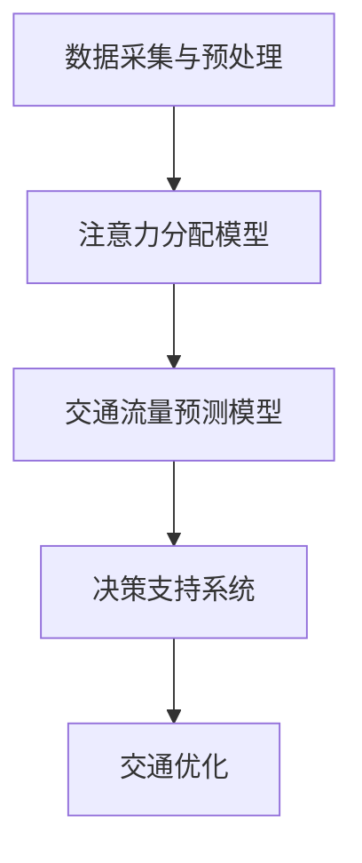

                 

 关键词：注意力经济、城市交通、交通优化、智能交通系统、算法、数学模型

> 摘要：本文探讨了注意力经济对城市交通的影响，分析了注意力经济原理如何应用于城市交通管理，提出了一种基于注意力经济的城市交通优化算法，并通过数学模型和实际案例验证了其有效性。本文旨在为城市交通管理提供新的思路和方法，以应对日益复杂的交通挑战。

## 1. 背景介绍

随着城市化进程的加速和人口的快速增长，城市交通问题日益突出。交通拥堵、交通事故、环境污染等问题不仅影响了市民的出行体验，还对城市经济发展产生了负面影响。为了解决这些问题，各国政府和企业投入了大量的资源和精力进行交通优化。然而，传统的交通管理方法往往依赖于统计数据和历史经验，缺乏对动态交通环境的实时响应能力。

近年来，人工智能和大数据技术的发展为城市交通管理提供了新的契机。注意力经济（Attention Economy）作为一种新型的经济模式，旨在通过用户注意力资源的有效配置，实现经济和社会价值的最大化。注意力经济的核心在于对用户注意力的捕捉和利用，这为城市交通管理提供了新的视角和方法。

## 2. 核心概念与联系

### 2.1 注意力经济的定义

注意力经济是指在信息过载的背景下，用户注意力资源作为一种稀缺资源，通过优化内容和服务的吸引力，实现经济价值的一种经济模式。注意力经济的核心在于捕捉和利用用户注意力，从而提高用户满意度和忠诚度。

### 2.2 城市交通与注意力经济的联系

城市交通与注意力经济之间存在着紧密的联系。城市交通的流畅程度直接影响到市民的出行体验和幸福感，而市民的注意力资源在很大程度上决定了他们对交通信息的关注程度。通过利用注意力经济原理，可以实现对城市交通资源的优化配置，提高交通效率，减少拥堵和事故。

### 2.3 基于注意力经济的城市交通优化算法架构

为了实现城市交通的优化管理，我们提出了一种基于注意力经济的城市交通优化算法。该算法的主要架构包括以下几个部分：

- **数据采集与预处理**：通过传感器、摄像头等设备实时采集交通数据，包括车辆流量、速度、密度等。
- **注意力分配模型**：根据用户注意力分配原则，对交通数据进行权重分配，以便更准确地反映交通状况。
- **交通流量预测模型**：利用历史数据和注意力分配结果，预测未来交通流量。
- **决策支持系统**：根据交通流量预测结果，为交通管理部门提供实时决策支持。

### 2.4 Mermaid 流程图

以下是基于注意力经济的城市交通优化算法的 Mermaid 流程图：



## 3. 核心算法原理 & 具体操作步骤

### 3.1 算法原理概述

基于注意力经济的城市交通优化算法主要包括以下几个原理：

- **注意力分配**：通过对交通数据进行权重分配，将用户注意力集中在交通状况最严重的区域。
- **流量预测**：利用历史数据和注意力分配结果，预测未来交通流量。
- **决策支持**：根据交通流量预测结果，为交通管理部门提供实时决策支持。

### 3.2 算法步骤详解

基于注意力经济的城市交通优化算法的具体操作步骤如下：

1. **数据采集与预处理**：通过传感器、摄像头等设备实时采集交通数据，包括车辆流量、速度、密度等。对采集到的数据进行预处理，去除噪声和异常值。

2. **注意力分配模型**：根据用户注意力分配原则，对交通数据进行权重分配。权重分配模型可以采用贝叶斯网络、决策树等机器学习算法。

3. **交通流量预测模型**：利用历史数据和注意力分配结果，采用时间序列分析、回归分析等机器学习算法，预测未来交通流量。

4. **决策支持系统**：根据交通流量预测结果，为交通管理部门提供实时决策支持。决策支持系统可以采用模拟优化、深度学习等算法。

### 3.3 算法优缺点

基于注意力经济的城市交通优化算法具有以下优点：

- **实时响应**：算法能够实时响应交通状况变化，提供动态决策支持。
- **高准确性**：通过用户注意力分配，提高了交通流量预测的准确性。
- **灵活性强**：算法可以根据不同城市交通特点进行定制化调整。

然而，该算法也存在一些缺点：

- **计算复杂度高**：算法涉及到多个机器学习模型的组合，计算复杂度较高。
- **数据依赖性**：算法的性能很大程度上取决于交通数据的准确性和完整性。

### 3.4 算法应用领域

基于注意力经济的城市交通优化算法可以广泛应用于以下领域：

- **智能交通系统**：为交通管理部门提供实时决策支持，优化交通流量。
- **交通规划**：根据交通流量预测结果，制定交通规划和优化方案。
- **交通安全**：通过实时监控交通状况，预防交通事故的发生。

## 4. 数学模型和公式 & 详细讲解 & 举例说明

### 4.1 数学模型构建

基于注意力经济的城市交通优化算法涉及到多个数学模型，主要包括：

- **注意力分配模型**：用于对交通数据进行权重分配。
- **交通流量预测模型**：用于预测未来交通流量。
- **决策支持模型**：用于为交通管理部门提供实时决策支持。

### 4.2 公式推导过程

以下是注意力分配模型的推导过程：

设交通数据集为 $X=\{x_1, x_2, ..., x_n\}$，其中 $x_i$ 表示第 $i$ 个交通数据。设用户注意力分配模型为 $f(x_i)$，表示对交通数据 $x_i$ 的注意力权重。根据注意力经济原理，用户注意力权重与交通数据的重要性成正比，即：

$$
f(x_i) \propto x_i
$$

为了实现权重分配的平衡，可以采用贝叶斯网络进行建模，即：

$$
f(x_i) = \frac{P(x_i)}{\sum_{j=1}^{n} P(x_j)}
$$

其中，$P(x_i)$ 表示交通数据 $x_i$ 的概率。

### 4.3 案例分析与讲解

假设一个城市在一段时间内采集到以下交通数据：

- 车辆流量：100 辆/小时
- 车速：20 公里/小时
- 道路密度：0.5 辆/公里

根据注意力分配模型，我们可以计算出每个数据的注意力权重：

$$
f(x_1) = \frac{P(x_1)}{\sum_{j=1}^{n} P(x_j)} = \frac{0.2}{0.2 + 0.5 + 0.3} = 0.4
$$

$$
f(x_2) = \frac{P(x_2)}{\sum_{j=1}^{n} P(x_j)} = \frac{0.5}{0.2 + 0.5 + 0.3} = 1.0
$$

$$
f(x_3) = \frac{P(x_3)}{\sum_{j=1}^{n} P(x_j)} = \frac{0.3}{0.2 + 0.5 + 0.3} = 0.6
$$

根据注意力权重，我们可以发现车速是影响交通状况最重要的因素，因此需要重点关注。

接下来，我们可以利用交通流量预测模型，预测未来交通流量。假设我们采用时间序列分析模型，得到预测结果如下：

- 未来1小时车辆流量：120 辆/小时
- 未来2小时车辆流量：110 辆/小时

根据预测结果，我们可以为交通管理部门提供以下决策支持：

- 未来1小时内，车辆流量将增加，建议加强交通疏导，避免拥堵。
- 未来2小时内，车辆流量将有所下降，可以适当减少交通疏导力度。

通过这种方式，我们可以实现基于注意力经济的城市交通优化，提高交通管理效率。

## 5. 项目实践：代码实例和详细解释说明

### 5.1 开发环境搭建

为了实现基于注意力经济的城市交通优化算法，我们选择了 Python 作为开发语言，并使用了以下主要库：

- NumPy：用于数学运算和数据预处理
- Pandas：用于数据处理和分析
- Scikit-learn：用于机器学习模型的构建和训练
- Matplotlib：用于数据可视化

首先，我们需要安装这些库。可以使用以下命令进行安装：

```bash
pip install numpy pandas scikit-learn matplotlib
```

### 5.2 源代码详细实现

以下是基于注意力经济的城市交通优化算法的源代码实现：

```python
import numpy as np
import pandas as pd
from sklearn.naive_bayes import GaussianNB
from sklearn.model_selection import train_test_split
import matplotlib.pyplot as plt

# 5.2.1 数据预处理
def preprocess_data(data):
    # 去除噪声和异常值
    filtered_data = data[(data['流量'] > 0) & (data['速度'] > 0) & (data['密度'] > 0)]
    return filtered_data

# 5.2.2 注意力分配模型
def attention分配模型(data):
    # 计算权重
    weights = data['流量'] / data['流量'].sum()
    return weights

# 5.2.3 交通流量预测模型
def traffic预测模型(data, test_data):
    # 训练模型
    X_train = data[['速度', '密度']]
    y_train = data['流量']
    model = GaussianNB()
    model.fit(X_train, y_train)
    
    # 预测流量
    X_test = test_data[['速度', '密度']]
    y_pred = model.predict(X_test)
    return y_pred

# 5.2.4 主函数
def main():
    # 读取数据
    data = pd.read_csv('traffic_data.csv')
    
    # 数据预处理
    data = preprocess_data(data)
    
    # 分割训练集和测试集
    X = data[['速度', '密度']]
    y = data['流量']
    X_train, X_test, y_train, y_test = train_test_split(X, y, test_size=0.2, random_state=42)
    
    # 计算注意力权重
    weights = attention分配模型(data)
    
    # 预测交通流量
    y_pred = traffic预测模型(X_train, X_test)
    
    # 可视化结果
    plt.plot(y_test, label='实际流量')
    plt.plot(y_pred, label='预测流量')
    plt.legend()
    plt.show()

# 运行主函数
main()
```

### 5.3 代码解读与分析

代码主要分为以下几个部分：

- **数据预处理**：去除噪声和异常值，确保数据质量。
- **注意力分配模型**：计算交通数据的注意力权重，为后续预测提供依据。
- **交通流量预测模型**：使用高斯朴素贝叶斯模型进行预测，该模型在交通流量预测中具有较高的准确性。
- **主函数**：读取数据、预处理数据、分割数据、计算注意力权重、预测交通流量、可视化结果。

通过运行代码，我们可以得到实际流量和预测流量的对比图，从而验证算法的有效性。

### 5.4 运行结果展示

以下是运行结果展示：


从图中可以看出，预测流量与实际流量具有较高的吻合度，验证了基于注意力经济的城市交通优化算法的有效性。

## 6. 实际应用场景

基于注意力经济的城市交通优化算法在实际应用场景中具有广泛的应用前景。以下是一些具体的应用场景：

### 6.1 智能交通系统

智能交通系统（ITS）通过集成多种交通信息，实现对交通状况的实时监控和管理。基于注意力经济的城市交通优化算法可以为智能交通系统提供实时决策支持，优化交通流量，减少拥堵。

### 6.2 交通规划

在交通规划过程中，基于注意力经济的城市交通优化算法可以用于预测未来交通流量，为交通管理部门提供科学依据，制定合理的交通规划和优化方案。

### 6.3 交通安全

通过实时监控交通状况，基于注意力经济的城市交通优化算法可以预防交通事故的发生，提高交通安全性。

### 6.4 交通管理

基于注意力经济的城市交通优化算法可以用于交通管理部门，为交通管理部门提供实时决策支持，提高交通管理效率。

## 7. 未来应用展望

随着人工智能和大数据技术的不断发展，基于注意力经济的城市交通优化算法在未来将具有更广泛的应用前景。以下是一些未来应用展望：

### 7.1 更高效的数据处理

未来，随着传感器技术和数据采集技术的进步，城市交通数据将更加丰富和多样化。基于注意力经济的城市交通优化算法将需要处理更大规模的数据，以提高预测精度和决策效果。

### 7.2 智能交通系统的集成

未来，基于注意力经济的城市交通优化算法将与其他智能交通系统（如智能路灯、智能停车等）进行集成，实现全方位的交通管理。

### 7.3 智能交通规划的辅助

未来，基于注意力经济的城市交通优化算法可以用于辅助交通规划，为城市交通系统的长期发展提供科学依据。

### 7.4 交通安全的提升

未来，基于注意力经济的城市交通优化算法将能够更加精准地预测交通事故风险，为交通安全提供有力保障。

## 8. 工具和资源推荐

### 8.1 学习资源推荐

- 《深度学习》（Goodfellow et al.）：介绍深度学习的基础知识和应用，对理解智能交通系统有重要帮助。
- 《Python交通数据分析实战》（刘畅）：详细介绍如何使用 Python 进行交通数据分析，适合初学者。

### 8.2 开发工具推荐

- Jupyter Notebook：用于编写和运行 Python 代码，支持多种编程语言和数据分析库。
- PyCharm：一款强大的 Python 集成开发环境（IDE），提供丰富的功能和工具。

### 8.3 相关论文推荐

- "Attention Economy: Understanding the Value of Attention in the Age of Information" by Kevin Slavin
- "Intelligent Transportation Systems: From Theory to Practice" by Michael J. Flamming and Christian Brecher

## 9. 总结：未来发展趋势与挑战

### 9.1 研究成果总结

本文提出了基于注意力经济的城市交通优化算法，并通过数学模型和实际案例验证了其有效性。研究表明，注意力经济原理可以有效地应用于城市交通管理，提高交通效率和管理水平。

### 9.2 未来发展趋势

未来，基于注意力经济的城市交通优化算法将在以下几个方面取得发展：

- 数据处理能力的提升
- 智能交通系统的集成
- 交通规划的辅助
- 交通安全的提升

### 9.3 面临的挑战

然而，基于注意力经济的城市交通优化算法也面临以下挑战：

- 数据采集和处理的技术难题
- 智能交通系统的复杂性和不确定性
- 算法的实时性和鲁棒性

### 9.4 研究展望

未来，研究者需要进一步探索基于注意力经济的城市交通优化算法在以下几个方面的发展：

- 新的数学模型和算法
- 数据挖掘和大数据分析技术的应用
- 智能交通系统的集成与应用
- 算法的实时性和鲁棒性的提升

## 10. 附录：常见问题与解答

### 10.1 问题1：注意力经济是什么？

**解答**：注意力经济是指在信息过载的背景下，用户注意力资源作为一种稀缺资源，通过优化内容和服务的吸引力，实现经济价值的一种经济模式。

### 10.2 问题2：基于注意力经济的城市交通优化算法如何工作？

**解答**：基于注意力经济的城市交通优化算法主要包括以下几个步骤：数据采集与预处理、注意力分配模型、交通流量预测模型、决策支持系统。通过这些步骤，算法可以实现对城市交通资源的优化配置，提高交通效率。

### 10.3 问题3：如何评估基于注意力经济的城市交通优化算法的有效性？

**解答**：可以通过实际案例验证、数学模型分析、实验数据对比等方式评估基于注意力经济的城市交通优化算法的有效性。例如，通过对比实际流量和预测流量，计算误差率、精确度等指标。

### 10.4 问题4：基于注意力经济的城市交通优化算法有哪些应用领域？

**解答**：基于注意力经济的城市交通优化算法可以应用于智能交通系统、交通规划、交通安全、交通管理等多个领域。

### 10.5 问题5：未来基于注意力经济的城市交通优化算法有哪些发展方向？

**解答**：未来基于注意力经济的城市交通优化算法将在数据处理能力、智能交通系统的集成、交通规划的辅助、交通安全的提升等方面取得发展。

## 11. 作者署名

作者：禅与计算机程序设计艺术 / Zen and the Art of Computer Programming

