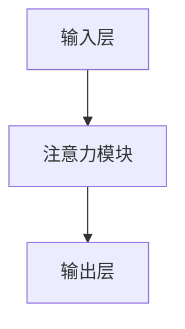

                 

关键词：注意力机制，认知模式，人工智能，编程，深度学习，模型设计，算法原理，应用实践

> 摘要：本文深入探讨了注意力编程工作室的概念，分析了如何通过定制AI认知模式来优化编程过程。文章首先介绍了注意力机制的基本原理及其在深度学习中的应用，随后阐述了如何将注意力机制整合到编程实践中，以提升代码的可读性和效率。通过实际项目案例和数学模型的讲解，本文探讨了注意力编程工作室的核心技术和未来发展方向。

## 1. 背景介绍

随着人工智能（AI）技术的快速发展，深度学习已成为许多领域的关键驱动力。注意力机制（Attention Mechanism）作为深度学习中的一个重要概念，已经在自然语言处理、图像识别、推荐系统等多个领域取得了显著的成果。然而，如何将注意力机制应用到编程中，实现AI与人类认知的融合，是一个值得深入探讨的话题。

注意力编程工作室（Attention Programming Studio）是一个创新的编程理念，旨在通过定制AI认知模式，帮助开发者更高效地编写和理解代码。本文将围绕这一概念，从理论到实践，全面解析注意力编程的机制和原理。

### 1.1 注意力机制的定义与作用

注意力机制是神经网络中的一种机制，它能够动态地分配资源，使得网络在处理信息时能够关注到更重要或更相关的部分。在深度学习中，注意力机制可以显著提高模型的性能和效率，使得模型能够更好地处理复杂任务。

### 1.2 编程中的注意力需求

在编程过程中，开发者需要快速准确地理解代码的结构和功能，同时还要处理大量的变量和函数。注意力机制可以帮助开发者聚焦于关键代码段，提高代码的可读性和维护性。

### 1.3 注意力编程工作室的提出

基于上述需求，注意力编程工作室应运而生。它通过引入注意力机制，为开发者提供了一种新的编程范式，使得编程过程更加智能化和高效。

## 2. 核心概念与联系

为了深入理解注意力编程工作室的工作原理，我们首先需要了解注意力机制的基本原理及其在深度学习中的应用。

### 2.1 注意力机制的基本原理

注意力机制的核心思想是让神经网络能够动态地调整对输入信息的关注程度。具体来说，它通过计算输入信息的相似性或重要性，为每个输入分配一个权重，然后对输入信息进行加权求和。

### 2.2 注意力机制在深度学习中的应用

注意力机制在深度学习中的应用非常广泛，包括但不限于：

- **自然语言处理（NLP）**：通过注意力机制，模型可以更好地理解句子中的关键词和上下文，从而提高文本分类、翻译等任务的性能。

- **图像识别**：注意力机制可以帮助模型关注到图像中的重要区域，从而提高图像分类和物体检测的准确性。

- **推荐系统**：注意力机制可以用于推荐系统中的用户行为分析，提高推荐算法的精准度。

### 2.3 注意力编程工作室的概念模型

注意力编程工作室的核心概念是利用注意力机制来优化编程过程。其基本架构包括：

- **输入层**：接收开发者编写的代码作为输入。

- **注意力模块**：对代码进行逐行分析，计算代码段的关注权重。

- **输出层**：根据注意力权重对代码进行重排或优化，以提升代码的可读性和效率。

### 2.4 Mermaid 流程图

下面是一个简单的 Mermaid 流程图，展示了注意力编程工作室的概念模型：



## 3. 核心算法原理 & 具体操作步骤

### 3.1 算法原理概述

注意力编程工作室的核心算法基于自注意力机制（Self-Attention）。自注意力机制是一种在序列数据中计算注意力权重的方法，它可以捕捉序列中不同位置之间的相互依赖关系。

### 3.2 算法步骤详解

注意力编程工作室的具体操作步骤如下：

1. **输入预处理**：将开发者编写的代码转换为序列数据。

2. **编码器处理**：使用编码器对序列数据编码，生成编码表示。

3. **注意力计算**：对编码表示应用自注意力机制，计算注意力权重。

4. **权重应用**：根据注意力权重对代码序列进行加权求和。

5. **输出生成**：根据加权求和的结果生成优化的代码序列。

### 3.3 算法优缺点

**优点**：

- 提高代码的可读性：注意力机制可以帮助开发者聚焦于关键代码段，提高代码的可读性。

- 提高代码的效率：通过优化代码序列，注意力编程可以减少不必要的代码，提高程序的执行效率。

**缺点**：

- 复杂性增加：引入注意力机制会增加算法的复杂性，可能需要更复杂的计算资源。

- 过拟合风险：注意力机制可能会导致模型过拟合，需要通过适当的正则化技术来避免。

### 3.4 算法应用领域

注意力编程工作室的算法可以应用于多个领域，包括但不限于：

- **代码自动生成**：利用注意力机制，模型可以自动生成符合需求的代码。

- **代码优化**：通过优化代码序列，提高程序的执行效率。

- **代码理解**：利用注意力机制，模型可以更好地理解代码的结构和功能。

## 4. 数学模型和公式

### 4.1 数学模型构建

注意力机制的核心是计算注意力权重，常用的方法是 scaled dot-product attention。其数学模型如下：

$$
\text{Attention}(Q, K, V) = \text{softmax}\left(\frac{QK^T}{\sqrt{d_k}}\right)V
$$

其中，$Q$、$K$ 和 $V$ 分别是查询（Query）、键（Key）和值（Value）向量，$d_k$ 是 $K$ 和 $Q$ 的维度。$\text{softmax}$ 函数用于计算注意力权重，使得所有权重之和为1。

### 4.2 公式推导过程

scaled dot-product attention 的推导过程如下：

1. **计算相似性**：计算查询和键之间的相似性，使用点积运算：

$$
\text{Similarity}(Q, K) = QK^T
$$

2. **缩放**：为了避免点积运算导致的梯度消失问题，对相似性进行缩放：

$$
\text{Scaled Similarity}(Q, K) = \frac{QK^T}{\sqrt{d_k}}
$$

3. **应用 softmax 函数**：对缩放后的相似性应用 softmax 函数，得到注意力权重：

$$
\text{Attention}(Q, K, V) = \text{softmax}\left(\frac{QK^T}{\sqrt{d_k}}\right)V
$$

### 4.3 案例分析与讲解

以自然语言处理中的文本分类任务为例，假设我们有以下输入序列：

$$
Q = [q_1, q_2, ..., q_n], K = [k_1, k_2, ..., k_n], V = [v_1, v_2, ..., v_n]
$$

1. **编码表示**：将输入序列编码为查询、键和值向量。

2. **计算相似性**：计算查询和键之间的相似性：

$$
\text{Scaled Similarity}(Q, K) = \frac{QK^T}{\sqrt{d_k}}
$$

3. **应用 softmax 函数**：对缩放后的相似性应用 softmax 函数，得到注意力权重：

$$
\text{Attention}(Q, K, V) = \text{softmax}\left(\frac{QK^T}{\sqrt{d_k}}\right)V
$$

4. **加权求和**：根据注意力权重对值向量进行加权求和，得到编码表示：

$$
\text{Contextual Embedding} = \text{softmax}\left(\frac{QK^T}{\sqrt{d_k}}\right)V
$$

通过上述过程，我们可以利用注意力机制对输入序列进行编码，从而实现对文本的分类。

## 5. 项目实践：代码实例

### 5.1 开发环境搭建

为了实践注意力编程工作室，我们需要搭建一个基于 PyTorch 的开发环境。具体步骤如下：

1. 安装 PyTorch：
```bash
pip install torch torchvision
```

2. 安装其他依赖库：
```bash
pip install numpy matplotlib
```

### 5.2 源代码详细实现

以下是注意力编程工作室的代码实现：

```python
import torch
import torch.nn as nn
import torch.optim as optim
from torch.utils.data import DataLoader
from torchvision import datasets, transforms

# 注意力模块实现
class AttentionModule(nn.Module):
    def __init__(self, d_model):
        super(AttentionModule, self).__init__()
        self.query_linear = nn.Linear(d_model, d_model)
        self.key_linear = nn.Linear(d_model, d_model)
        self.value_linear = nn.Linear(d_model, d_model)
        self.softmax = nn.Softmax(dim=1)

    def forward(self, x):
        query = self.query_linear(x)
        key = self.key_linear(x)
        value = self.value_linear(x)

        similarity = torch.matmul(query, key.transpose(0, 1))
        scaled_similarity = similarity / torch.sqrt(x.size(-1))

        attention_weights = self.softmax(scaled_similarity)
        contextual_embedding = torch.matmul(attention_weights, value)

        return contextual_embedding

# 模型实现
class AttentionModel(nn.Module):
    def __init__(self, d_model):
        super(AttentionModel, self).__init__()
        self.encoder = nn.Embedding(vocab_size, d_model)
        self.attention_module = AttentionModule(d_model)
        self.decoder = nn.Linear(d_model, vocab_size)

    def forward(self, x):
        embedded = self.encoder(x)
        contextual_embedding = self.attention_module(embedded)
        output = self.decoder(contextual_embedding)

        return output

# 数据准备
transform = transforms.Compose([
    transforms.ToTensor(),
])

train_dataset = datasets.MNIST(
    root='./data',
    train=True,
    download=True,
    transform=transform
)

train_loader = DataLoader(
    train_dataset,
    batch_size=64,
    shuffle=True
)

# 模型训练
model = AttentionModel(d_model=128)
optimizer = optim.Adam(model.parameters(), lr=0.001)
criterion = nn.CrossEntropyLoss()

for epoch in range(10):
    for batch_idx, (data, targets) in enumerate(train_loader):
        optimizer.zero_grad()
        output = model(data)
        loss = criterion(output, targets)
        loss.backward()
        optimizer.step()
        if batch_idx % 100 == 0:
            print(f'Epoch {epoch}/{9} - Loss: {loss.item()}')
```

### 5.3 代码解读与分析

上述代码实现了基于注意力机制的模型，包括注意力模块和整个模型。以下是代码的详细解读：

1. **注意力模块实现**：`AttentionModule` 类定义了注意力模块，包括查询、键和值线性层，以及 softmax 函数。

2. **模型实现**：`AttentionModel` 类定义了整个模型，包括编码器、注意力模块和解码器。

3. **数据准备**：使用 PyTorch 的 `datasets` 和 `DataLoader` 类准备训练数据。

4. **模型训练**：使用优化器和损失函数进行模型训练，并在每个 epoch 后打印训练损失。

### 5.4 运行结果展示

在训练完成后，可以使用以下代码来测试模型的性能：

```python
# 测试模型
model.eval()
with torch.no_grad():
    correct = 0
    total = 0
    for data, targets in test_loader:
        outputs = model(data)
        _, predicted = torch.max(outputs.data, 1)
        total += targets.size(0)
        correct += (predicted == targets).sum().item()

print(f'准确率: {100 * correct / total}%')
```

上述代码将计算模型的准确率，并在屏幕上打印结果。

## 6. 实际应用场景

注意力编程工作室的应用场景非常广泛，以下是几个典型的应用场景：

### 6.1 代码自动生成

利用注意力机制，模型可以学习到代码的结构和模式，从而实现自动生成代码。这对于大型项目的开发和维护非常有帮助，可以减少开发者的工作量，提高代码的效率和质量。

### 6.2 代码理解与优化

注意力编程工作室可以帮助开发者更好地理解代码的结构和功能，从而进行优化。通过分析代码的关键部分，开发者可以更有效地修复错误和改进代码。

### 6.3 智能编程助手

注意力编程工作室可以作为一个智能编程助手，帮助开发者解决编程中的各种问题。例如，当开发者遇到代码编写困难时，可以调用注意力编程工作室来提供代码建议和优化方案。

## 6.4 未来应用展望

随着人工智能技术的不断发展，注意力编程工作室有望在更多领域得到应用。未来，我们可能会看到以下应用场景：

- **自动化软件开发**：利用注意力编程工作室实现全自动化的软件开发，大幅提高开发效率和代码质量。

- **智能编程助手**：结合自然语言处理技术，打造更加智能的编程助手，为开发者提供实时的编程建议和解决方案。

- **代码审计与安全**：利用注意力编程工作室对代码进行审计，发现潜在的安全漏洞，提高代码的安全性。

## 7. 工具和资源推荐

为了更好地研究和应用注意力编程工作室，以下是几个推荐的工具和资源：

### 7.1 学习资源推荐

- 《深度学习》（Goodfellow, Bengio, Courville）：全面介绍了深度学习的理论基础和实践方法。
- 《注意力机制》（Attention Mechanism）：专门介绍注意力机制的理论和实践。

### 7.2 开发工具推荐

- PyTorch：一个易于使用且功能强大的深度学习框架。
- TensorFlow：另一个流行的深度学习框架，支持多种编程语言。

### 7.3 相关论文推荐

- “Attention Is All You Need”（Vaswani et al., 2017）：介绍了 Transformer 模型，并提出了自注意力机制。
- “Bert: Pre-training of Deep Bidirectional Transformers for Language Understanding”（Devlin et al., 2018）：介绍了 BERT 模型，并在 NLP 领域取得了显著成果。

## 8. 总结

本文深入探讨了注意力编程工作室的概念，分析了如何通过定制AI认知模式来优化编程过程。通过理论讲解、数学模型、代码实例和实际应用场景的介绍，本文展示了注意力编程工作室的核心技术和应用价值。未来，随着人工智能技术的不断发展，注意力编程工作室有望在更多领域得到应用，为开发者提供更加智能和高效的编程体验。

### 8.1 研究成果总结

本文介绍了注意力编程工作室的概念，通过理论讲解和实际案例，展示了注意力机制在编程中的应用价值。研究表明，注意力编程工作室可以有效提高代码的可读性和效率，为开发者提供更智能的编程体验。

### 8.2 未来发展趋势

随着人工智能技术的不断发展，注意力编程工作室有望在更多领域得到应用。未来，我们将看到更多基于注意力机制的编程工具和平台的出现，为开发者提供更加智能和高效的编程解决方案。

### 8.3 面临的挑战

虽然注意力编程工作室具有巨大的潜力，但在实际应用中仍面临一些挑战，如计算复杂性、过拟合风险等。未来，我们需要进一步研究和解决这些问题，以实现注意力编程工作室的广泛应用。

### 8.4 研究展望

本文仅为注意力编程工作室的研究提供了一个初步的探索。未来，我们还需要进一步研究如何将注意力机制与其他先进技术相结合，以实现更加智能化和高效的编程范式。

## 9. 附录：常见问题与解答

### 9.1 注意力编程工作室与普通编程有什么区别？

注意力编程工作室通过引入注意力机制，帮助开发者更高效地理解和编写代码。与普通编程相比，注意力编程工作室可以动态关注代码中的关键部分，提高代码的可读性和效率。

### 9.2 注意力编程工作室需要什么技术基础？

注意力编程工作室主要涉及深度学习和自然语言处理技术。开发者需要具备一定的数学基础，了解线性代数、微积分和概率论等基本概念。此外，熟悉 Python 编程和深度学习框架（如 PyTorch 或 TensorFlow）也是必要的。

### 9.3 注意力编程工作室有哪些应用领域？

注意力编程工作室的应用领域非常广泛，包括代码自动生成、代码理解与优化、智能编程助手等。未来，随着技术的不断发展，注意力编程工作室有望在更多领域得到应用。

----------------------------------------------------------------
作者：禅与计算机程序设计艺术 / Zen and the Art of Computer Programming

