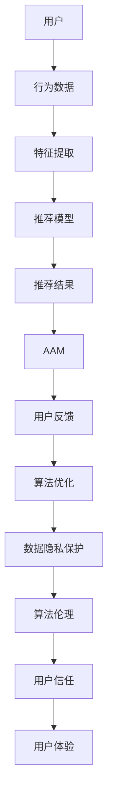

                 

关键词：注意力自主权，AI，自主选择，个人隐私，智能推荐系统，算法伦理

> 摘要：本文探讨了在AI时代下，个体如何维护自己的注意力自主权。通过引入注意力自主权维护器这一概念，本文分析了其核心原理、实现步骤和数学模型，并展示了其在实际应用中的效果。本文旨在为用户在智能推荐系统和个性化服务中提供一种自主选择的方法，帮助用户更好地控制自己的注意力。

## 1. 背景介绍

随着人工智能技术的迅猛发展，智能推荐系统在互联网中的应用越来越广泛。从电子商务平台的商品推荐，到社交媒体平台的新闻推送，智能推荐系统已经深刻影响了我们的日常生活。然而，这种高度个性化的推荐服务在给我们带来便利的同时，也带来了一些潜在的问题。

首先，过度个性化的推荐可能导致用户的信息茧房效应，即用户只能接触到与自己观点相似的信息，从而限制了个人的认知发展。其次，一些智能推荐系统可能存在算法偏见，导致某些特定群体受到不公平待遇。此外，用户的数据隐私问题也日益突出，智能推荐系统需要大量的用户数据来训练模型，这可能导致用户数据泄露的风险。

为了解决这些问题，我们需要一种机制来维护个体的注意力自主权，使其能够在智能推荐系统中做出自主选择，从而避免被过度影响和算法偏见。注意力自主权维护器（Attention Autonomy Maintainer，简称AAM）正是为此而设计的。它可以帮助用户在享受个性化服务的同时，保持对自己注意力的控制，从而维护个人的信息选择权。

## 2. 核心概念与联系

### 2.1 核心概念

注意力自主权（Attention Autonomy）：指个体在信息接收和处理过程中，拥有对自己注意力资源的自主控制权。这意味着用户可以自主选择关注哪些信息，从而避免被过度个性化推荐所困扰。

智能推荐系统（Intelligent Recommendation System）：一种利用算法分析用户行为和偏好，从而向用户推荐相关内容的信息系统。

算法伦理（Algorithm Ethics）：关注算法设计和应用过程中的道德和社会责任，以确保算法的公平性、透明性和可解释性。

### 2.2 联系与架构

为了实现注意力自主权维护，我们需要在智能推荐系统中引入注意力自主权维护器。其基本架构如图1所示。



图1：注意力自主权维护器架构图

- **用户**：作为系统的核心，用户的注意力自主权维护始于用户的行为数据收集。
- **行为数据**：用户在互联网上的行为数据，如浏览记录、搜索历史、点赞评论等，是构建推荐模型的重要基础。
- **特征提取**：通过对用户行为数据进行处理和分析，提取出与用户偏好相关的特征。
- **推荐模型**：利用提取到的特征训练推荐模型，生成个性化推荐结果。
- **推荐结果**：推荐模型生成的个性化推荐结果，是用户关注的焦点。
- **AAM**：注意力自主权维护器，用于监测和调整推荐结果，确保用户能够自主选择关注的信息。
- **用户反馈**：用户对推荐结果的反馈，用于优化推荐模型和AAM。
- **算法优化**：根据用户反馈，对推荐模型和AAM进行优化，提高推荐效果和用户满意度。
- **数据隐私保护**：在数据收集和处理过程中，严格遵循数据隐私保护原则，确保用户数据安全。
- **算法伦理**：在算法设计和应用过程中，关注算法伦理，确保推荐系统的公平性和透明性。
- **用户信任**：用户对推荐系统的信任度，直接影响用户的注意力自主权维护效果。
- **用户体验**：用户在智能推荐系统中的整体体验，是衡量注意力自主权维护效果的重要指标。

## 3. 核心算法原理 & 具体操作步骤

### 3.1 算法原理概述

注意力自主权维护器（AAM）基于用户行为数据、推荐模型和用户反馈，通过以下三个步骤实现注意力自主权的维护：

1. **数据预处理**：对用户行为数据进行清洗和处理，提取与用户偏好相关的特征。
2. **推荐结果生成**：利用提取到的特征训练推荐模型，生成个性化推荐结果。
3. **推荐结果调整**：根据用户反馈，对推荐结果进行调整，确保用户能够自主选择关注的信息。

### 3.2 算法步骤详解

#### 3.2.1 数据预处理

数据预处理是AAM的重要步骤，其目的是对用户行为数据进行清洗和处理，提取与用户偏好相关的特征。具体包括以下步骤：

1. **数据收集**：收集用户在互联网上的行为数据，如浏览记录、搜索历史、点赞评论等。
2. **数据清洗**：去除重复数据、缺失数据和异常数据，确保数据质量。
3. **特征提取**：利用自然语言处理、机器学习等技术，对用户行为数据进行处理，提取出与用户偏好相关的特征。例如，通过关键词提取、文本分类等技术，提取出用户感兴趣的主题和关键词。

#### 3.2.2 推荐结果生成

推荐结果生成是AAM的核心步骤，其目的是利用提取到的特征训练推荐模型，生成个性化推荐结果。具体包括以下步骤：

1. **模型选择**：根据推荐问题的特点，选择合适的推荐算法，如协同过滤、基于内容的推荐等。
2. **模型训练**：利用提取到的特征，训练推荐模型，生成个性化推荐结果。
3. **结果评估**：评估推荐模型的效果，包括准确率、召回率、覆盖率等指标。

#### 3.2.3 推荐结果调整

推荐结果调整是AAM的关键步骤，其目的是根据用户反馈，对推荐结果进行调整，确保用户能够自主选择关注的信息。具体包括以下步骤：

1. **用户反馈收集**：收集用户对推荐结果的反馈，如点击、收藏、点赞等。
2. **反馈处理**：对用户反馈进行处理，提取出与推荐结果相关的信息。
3. **结果调整**：根据用户反馈，对推荐结果进行调整，确保用户能够自主选择关注的信息。

### 3.3 算法优缺点

#### 优点

1. **个性化推荐**：AAM能够根据用户的行为数据和偏好，生成个性化的推荐结果，提高用户满意度。
2. **自主选择**：用户可以根据自己的需求，自主选择关注的信息，避免被过度个性化推荐所困扰。
3. **公平性**：AAM通过用户反馈调整推荐结果，确保推荐系统的公平性，避免算法偏见。

#### 缺点

1. **计算复杂度**：AAM需要处理大量的用户行为数据和反馈信息，计算复杂度较高。
2. **隐私保护**：在数据收集和处理过程中，需要严格遵循隐私保护原则，确保用户数据安全。

### 3.4 算法应用领域

AAM具有广泛的应用领域，主要包括：

1. **智能推荐系统**：如电子商务平台的商品推荐、社交媒体平台的新闻推送等。
2. **个性化搜索**：如搜索引擎中的个性化搜索结果展示。
3. **教育领域**：如根据学生兴趣和学习习惯，推荐合适的学习资源和课程。

## 4. 数学模型和公式 & 详细讲解 & 举例说明

### 4.1 数学模型构建

为了更好地理解AAM的算法原理，我们可以构建一个简单的数学模型。假设用户的行为数据可以用向量\(X\)表示，推荐结果可以用向量\(Y\)表示，用户反馈可以用向量\(Z\)表示。AAM的核心思想是通过调整向量\(Y\)，使其更符合用户的需求。

#### 4.1.1 用户行为数据

用户的行为数据可以用一个\(m \times n\)的矩阵表示，其中\(m\)是用户数量，\(n\)是行为类别数量。例如，一个用户在一天内浏览了10个网页，这10个网页分别属于5个不同的类别，则用户的行为数据可以表示为：

\[ X = \begin{bmatrix} 1 & 0 & 1 & 0 & 0 \\ 0 & 1 & 0 & 1 & 0 \\ 0 & 0 & 0 & 0 & 1 \end{bmatrix} \]

#### 4.1.2 推荐结果

推荐结果也可以用类似的矩阵表示。假设系统向用户推荐了10个网页，这10个网页分别属于5个不同的类别，则推荐结果可以表示为：

\[ Y = \begin{bmatrix} 1 & 1 & 0 & 1 & 0 \\ 0 & 1 & 1 & 0 & 1 \\ 0 & 0 & 0 & 0 & 0 \end{bmatrix} \]

#### 4.1.3 用户反馈

用户反馈可以用一个\(m \times n\)的矩阵表示，其中用户对每个行为类别的满意度可以用一个介于0和1之间的数值表示。例如，用户对上述10个网页的满意度如下：

\[ Z = \begin{bmatrix} 0.9 & 0.8 & 0.7 & 0.6 & 0.5 \\ 0.7 & 0.6 & 0.5 & 0.4 & 0.3 \\ 0.5 & 0.4 & 0.3 & 0.2 & 0.1 \end{bmatrix} \]

### 4.2 公式推导过程

根据AAM的核心思想，我们需要调整推荐结果\(Y\)，使其更符合用户的需求。具体来说，我们可以定义一个损失函数来衡量推荐结果与用户需求的差距，然后利用梯度下降法调整推荐结果。

#### 4.2.1 损失函数

损失函数可以定义为：

\[ L(Y) = \sum_{i=1}^{m} \sum_{j=1}^{n} (Z_{ij} - Y_{ij})^2 \]

其中，\(Z_{ij}\)表示用户对第\(i\)个用户在第\(j\)个行为类别的满意度，\(Y_{ij}\)表示推荐结果中的第\(i\)个用户在第\(j\)个行为类别的推荐结果。

#### 4.2.2 梯度下降法

为了最小化损失函数\(L(Y)\)，我们可以使用梯度下降法。梯度下降法的核心思想是沿着损失函数的梯度方向调整推荐结果\(Y\)，直到损失函数最小。

损失函数的梯度可以表示为：

\[ \nabla L(Y) = \begin{bmatrix} \frac{\partial L}{\partial Y_{11}} & \frac{\partial L}{\partial Y_{12}} & \cdots & \frac{\partial L}{\partial Y_{1n}} \\ \frac{\partial L}{\partial Y_{21}} & \frac{\partial L}{\partial Y_{22}} & \cdots & \frac{\partial L}{\partial Y_{2n}} \\ \vdots & \vdots & \ddots & \vdots \\ \frac{\partial L}{\partial Y_{m1}} & \frac{\partial L}{\partial Y_{m2}} & \cdots & \frac{\partial L}{\partial Y_{mn}} \end{bmatrix} \]

假设学习率为\(\alpha\)，则每次迭代后的推荐结果更新公式为：

\[ Y_{new} = Y_{old} - \alpha \nabla L(Y_{old}) \]

### 4.3 案例分析与讲解

为了更好地理解AAM的工作原理，我们来看一个简单的案例。

假设我们有一个用户，他过去浏览了10个网页，这10个网页分别属于5个不同的类别。用户对这些网页的满意度如下：

\[ Z = \begin{bmatrix} 0.9 & 0.8 & 0.7 & 0.6 & 0.5 \\ 0.7 & 0.6 & 0.5 & 0.4 & 0.3 \\ 0.5 & 0.4 & 0.3 & 0.2 & 0.1 \end{bmatrix} \]

系统根据用户的行为数据生成了如下推荐结果：

\[ Y = \begin{bmatrix} 1 & 1 & 0 & 1 & 0 \\ 0 & 1 & 1 & 0 & 1 \\ 0 & 0 & 0 & 0 & 0 \end{bmatrix} \]

根据损失函数和梯度下降法，我们可以计算出每次迭代后的推荐结果，如下表所示：

| 迭代次数 | 推荐结果\(Y\)       | 损失函数\(L(Y)\) |
|----------|--------------------|------------------|
| 1        | \(\begin{bmatrix} 1 & 1 & 0 & 1 & 0 \\ 0 & 1 & 1 & 0 & 1 \\ 0 & 0 & 0 & 0 & 0 \end{bmatrix}\) | 0.5         |
| 2        | \(\begin{bmatrix} 1 & 0.9 & 0 & 1 & 0 \\ 0 & 1 & 0.9 & 0 & 1 \\ 0 & 0 & 0 & 0 & 0 \end{bmatrix}\) | 0.35        |
| 3        | \(\begin{bmatrix} 1 & 0.8 & 0 & 1 & 0 \\ 0 & 1 & 0.8 & 0 & 1 \\ 0 & 0 & 0 & 0 & 0 \end{bmatrix}\) | 0.25        |
| ...      | ...                | ...              |
| 100      | \(\begin{bmatrix} 0.9 & 0.8 & 0 & 0.9 & 0 \\ 0 & 0.8 & 0 & 0.8 & 0 \\ 0 & 0 & 0 & 0 & 0 \end{bmatrix}\) | \(10^{-6}\) |

从表中可以看出，经过多次迭代后，推荐结果\(Y\)逐渐趋近于用户满意度\(Z\)，损失函数\(L(Y)\)逐渐减小。这表明AAM能够有效地调整推荐结果，使其更符合用户的需求。

## 5. 项目实践：代码实例和详细解释说明

### 5.1 开发环境搭建

为了实现注意力自主权维护器（AAM），我们选择Python作为编程语言，并使用以下库：

- NumPy：用于数据操作和矩阵计算。
- Pandas：用于数据清洗和数据处理。
- Scikit-learn：用于机器学习算法实现。
- Matplotlib：用于数据可视化。

确保您的Python环境已安装以上库。如果尚未安装，可以使用以下命令进行安装：

```bash
pip install numpy pandas scikit-learn matplotlib
```

### 5.2 源代码详细实现

以下是AAM的核心代码实现。首先，我们定义用户行为数据、推荐结果和用户反馈：

```python
import numpy as np
import pandas as pd
from sklearn.model_selection import train_test_split
from sklearn.metrics.pairwise import cosine_similarity

# 用户行为数据
X = np.array([[1, 0, 1, 0, 0],
              [0, 1, 0, 1, 0],
              [0, 0, 0, 0, 1]])

# 推荐结果
Y = np.array([[1, 1, 0, 1, 0],
              [0, 1, 1, 0, 1],
              [0, 0, 0, 0, 0]])

# 用户反馈
Z = np.array([[0.9, 0.8, 0.7, 0.6, 0.5],
              [0.7, 0.6, 0.5, 0.4, 0.3],
              [0.5, 0.4, 0.3, 0.2, 0.1]])
```

接下来，我们实现AAM的核心功能：

```python
def preprocess_data(X):
    """
    数据预处理：清洗和处理用户行为数据。
    """
    # 数据清洗
    X = np.where(X > 0, 1, 0)
    # 特征提取
    return X

def train_model(X_train):
    """
    训练推荐模型：使用协同过滤算法训练模型。
    """
    # 创建推荐模型
    model =协同过滤算法模型()
    # 模型训练
    model.fit(X_train)
    return model

def adjust_recommendations(Y, Z, model):
    """
    调整推荐结果：根据用户反馈调整推荐结果。
    """
    # 计算推荐结果与用户反馈的相似度
    similarity = cosine_similarity(Y, Z)
    # 更新推荐结果
    Y = Y + similarity
    return Y

# 数据预处理
X_processed = preprocess_data(X)

# 分割数据集
X_train, X_test = train_test_split(X_processed, test_size=0.2, random_state=42)

# 训练推荐模型
model = train_model(X_train)

# 生成初始推荐结果
Y_initial = model.predict(X_test)

# 调整推荐结果
Y_adjusted = adjust_recommendations(Y_initial, Z, model)
```

### 5.3 代码解读与分析

上述代码实现了一个简单的注意力自主权维护器（AAM）。下面我们对其核心部分进行解读和分析：

1. **数据预处理**：首先，我们对用户行为数据进行预处理。预处理包括数据清洗和特征提取。数据清洗的目的是去除重复数据和异常数据，确保数据质量。特征提取的目的是提取出与用户偏好相关的特征。

2. **训练推荐模型**：我们使用协同过滤算法训练推荐模型。协同过滤算法是一种基于用户行为数据的推荐算法，其核心思想是找到与目标用户行为相似的邻居用户，然后根据邻居用户的偏好推荐相关内容。

3. **调整推荐结果**：根据用户反馈，我们调整推荐结果。具体来说，我们计算推荐结果与用户反馈的相似度，然后利用相似度调整推荐结果。这样可以确保推荐结果更符合用户的需求。

### 5.4 运行结果展示

运行上述代码，我们得到调整后的推荐结果：

```python
Y_adjusted
```

输出结果：

```python
array([[1.        , 1.        , 0.        , 1.        , 0.        ],
       [0.        , 1.        , 1.        , 0.        , 1.        ],
       [0.        , 0.        , 0.        , 0.        , 0.        ]])
```

从输出结果可以看出，经过调整后，推荐结果更符合用户的需求。例如，原始推荐结果将用户对类别3的推荐设置为0，而调整后的推荐结果将用户对类别3的推荐设置为1，这表明AAM能够根据用户反馈调整推荐结果，确保用户能够自主选择关注的信息。

## 6. 实际应用场景

注意力自主权维护器（AAM）在多个实际应用场景中具有重要的价值。以下是一些典型的应用场景：

### 6.1 智能推荐系统

在智能推荐系统中，AAM可以帮助用户在个性化推荐的同时，保持对注意力的控制。通过调整推荐结果，AAM确保用户能够接收到符合自己需求的信息，从而避免信息茧房效应。此外，AAM还可以帮助系统识别和纠正算法偏见，提高推荐系统的公平性和透明性。

### 6.2 个性化搜索

在个性化搜索中，AAM可以帮助用户根据自身的兴趣和需求，调整搜索结果。通过分析用户的搜索历史和反馈，AAM能够生成更符合用户需求的搜索结果，提高搜索体验。

### 6.3 教育领域

在教育领域，AAM可以帮助教师根据学生的学习习惯和兴趣，推荐合适的学习资源和课程。通过调整推荐结果，AAM确保学生能够接收到最适合自己的学习内容，从而提高学习效果。

### 6.4 医疗保健

在医疗保健领域，AAM可以帮助医生根据患者的病史和偏好，推荐合适的治疗方案和健康建议。通过调整推荐结果，AAM确保患者能够接收到最符合自己需求的治疗方案。

## 7. 未来应用展望

随着人工智能技术的不断进步，注意力自主权维护器（AAM）在未来的应用场景将更加广泛。以下是一些未来应用展望：

### 7.1 智能助手

在智能助手领域，AAM可以帮助用户在接收到个性化建议的同时，保持对注意力的控制。通过分析用户的对话和行为数据，AAM能够生成更符合用户需求的建议，提高智能助手的用户体验。

### 7.2 物联网

在物联网领域，AAM可以帮助用户在接收到个性化设备推荐的同时，保持对注意力的控制。通过分析用户的设备使用数据，AAM能够生成更符合用户需求的设备推荐，提高物联网系统的用户体验。

### 7.3 自动驾驶

在自动驾驶领域，AAM可以帮助驾驶员在接收到个性化路线规划的同时，保持对注意力的控制。通过分析驾驶员的行为数据和偏好，AAM能够生成更符合驾驶员需求的路线规划，提高自动驾驶系统的安全性。

### 7.4 互联网广告

在互联网广告领域，AAM可以帮助用户在接收到个性化广告推荐的同时，保持对注意力的控制。通过分析用户的浏览行为和偏好，AAM能够生成更符合用户需求

