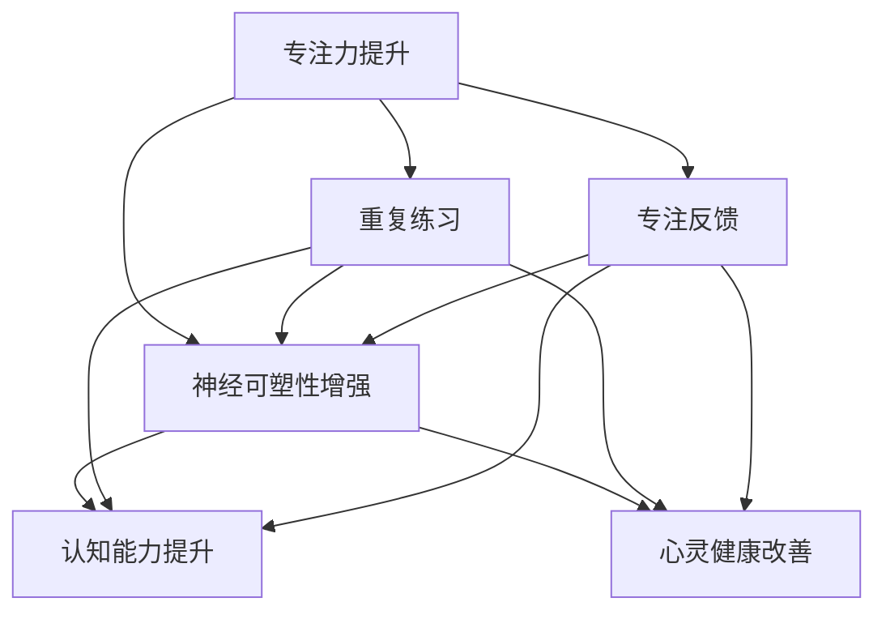

                 

关键词：注意力训练、大脑健康、认知能力、心灵健康、专注力、神经可塑性、AI、认知神经科学

> 摘要：本文深入探讨注意力训练对大脑健康改善的重要性，通过增强专注力来提升认知能力和心灵健康。文章从背景介绍开始，逐步解析核心概念、算法原理、数学模型、实际应用，并展望未来发展趋势与挑战。通过详细的项目实践和代码实例，本文为读者提供了全面的指导，旨在为个人和专业人士提供有价值的参考。

## 1. 背景介绍

随着现代社会的快速发展，人们面临的信息量呈爆炸性增长，注意力分散成为普遍现象。而专注力作为人类认知过程中至关重要的一环，直接影响到我们的工作效率、学习效果和生活质量。大脑健康同样不可忽视，它关系到我们的心理健康和生理健康。因此，如何通过注意力训练改善大脑健康，提高认知能力和心灵健康，成为了一个备受关注的话题。

注意力训练作为一种科学的方法，旨在通过系统的训练增强个体的专注力，从而促进大脑的神经可塑性，提升认知能力和心灵健康。神经可塑性是指神经系统在结构和功能上的适应性和变化能力，它是大脑学习新技能、适应新环境和从损伤中恢复的关键。认知能力包括记忆力、注意力、观察力、推理能力和决策能力等，是人们日常学习和工作中不可或缺的能力。心灵健康则涉及情绪管理、心理健康状态以及社会交往能力等方面，直接影响个人的生活质量。

本文将首先介绍注意力训练的核心概念和原理，然后深入探讨其与大脑健康、认知能力和心灵健康之间的联系。通过数学模型和具体算法的讲解，我们将展示注意力训练的科学基础和实践方法。最后，通过项目实践和代码实例，我们将展示如何在实际应用中利用注意力训练改善大脑健康，提高认知能力和心灵健康。

## 2. 核心概念与联系

### 2.1 核心概念

注意力训练的核心概念主要包括专注力、神经可塑性和认知能力。专注力是指个体在特定任务上保持注意力集中的能力，是完成任何认知任务的基础。神经可塑性是指大脑神经元和神经网络在结构和功能上的适应性变化，是大脑学习和记忆的基础。认知能力则是大脑处理信息、理解知识、解决问题和做出决策的能力，对个体的发展和表现至关重要。

### 2.2 原理与联系

注意力训练通过一系列的练习和活动，提高个体在特定任务上的专注力。这些训练活动通常涉及重复、专注和反馈等要素，通过这些要素的作用，增强大脑的神经可塑性，进而提升认知能力和心灵健康。

首先，专注力的提升直接依赖于神经可塑性。在注意力训练中，重复练习特定的任务，如冥想、阅读、练习乐器等，可以激发大脑神经元之间的连接，形成更强的神经网络。这些神经网络的建立和强化，有助于提高个体在特定任务上的专注力。

其次，认知能力的提升同样依赖于神经可塑性。通过注意力训练，大脑的神经回路可以变得更加高效和灵活，从而提升记忆、注意力、观察力和推理能力等认知能力。例如，通过重复练习，可以增强海马体的记忆功能，提高个体的记忆力和学习能力。

最后，心灵健康的改善也与神经可塑性密切相关。注意力训练可以促进大脑中调节情绪和压力的神经回路的发展，从而改善个体的心理健康状态。此外，专注力的提升有助于增强个体的情绪调节能力，减少焦虑和压力，提高生活质量。

总的来说，注意力训练通过提升专注力和增强神经可塑性，不仅能够提高认知能力和心灵健康，还能够促进大脑的长期健康。这使得注意力训练成为了一种具有广泛应用前景的方法，值得进一步研究和推广。

### 2.3 Mermaid 流程图



在这个流程图中，我们可以看到注意力训练的核心环节是如何通过专注力提升、神经可塑性增强、认知能力提升和心灵健康改善相互联系的。通过重复练习和专注反馈，个体能够在多个维度上获得提升。

## 3. 核心算法原理 & 具体操作步骤

### 3.1 算法原理概述

注意力训练的核心算法原理基于神经科学和认知科学的研究成果，主要通过以下几方面实现专注力的提升：

1. **重复练习**：通过重复执行特定任务，如冥想、阅读、练习乐器等，强化大脑相关神经回路的连接和活动，从而提升专注力。
2. **专注反馈**：在训练过程中，个体需要对自己的专注程度进行自我评估，并通过即时反馈调整注意力，逐步提高专注力。
3. **脑电信号监测**：利用脑电信号监测技术，实时分析个体的脑波活动，识别出注意力集中的最佳状态，并进行相应的训练调整。

### 3.2 算法步骤详解

#### 3.2.1 初始化阶段

1. **设定训练目标和时间**：根据个体的实际情况，设定具体的训练目标和所需时间，如每天训练30分钟。
2. **设备准备**：准备脑电信号监测设备，确保其能够稳定、准确地收集脑电数据。

#### 3.2.2 训练阶段

1. **选择训练任务**：选择适合个体的训练任务，如冥想、阅读、练习乐器等。任务的选择应充分考虑个体的兴趣和实际情况。
2. **专注力监测**：在执行任务时，利用脑电信号监测技术，实时记录个体的脑波活动，并通过分析脑波频率，判断个体是否处于专注状态。
3. **专注度评估**：个体在执行任务过程中，需对自己的专注程度进行自我评估，并记录在日志中。

#### 3.2.3 反馈调整

1. **反馈分析**：对训练过程中的脑电数据和自我评估结果进行分析，找出个体在哪些方面需要改进。
2. **调整训练计划**：根据反馈结果，调整训练任务的难度和时间，确保个体在逐步提升专注力的同时，不会感到过度疲劳。

#### 3.2.4 记录和总结

1. **记录训练数据**：记录每次训练的详细数据，包括专注度、脑波频率、训练时间等，以便后续分析和总结。
2. **总结训练效果**：定期对训练效果进行总结，评估专注力提升情况，并制定下一步的训练计划。

### 3.3 算法优缺点

#### 优点

1. **科学性**：基于神经科学和认知科学的研究成果，具有科学依据。
2. **个性化**：根据个体实际情况和需求，设定训练目标和计划，提高训练效果。
3. **实时反馈**：通过脑电信号监测和即时反馈，实时调整训练策略，确保训练效果。

#### 缺点

1. **设备依赖**：需要脑电信号监测设备，成本较高，且操作复杂。
2. **时间成本**：需要定期进行训练，占用一定的时间，对日常生活有一定影响。
3. **数据隐私**：脑电数据属于敏感信息，需确保数据安全和隐私保护。

### 3.4 算法应用领域

注意力训练算法在多个领域具有广泛应用：

1. **教育**：通过注意力训练，提高学生的学习效果和专注力，增强记忆力和理解力。
2. **职业培训**：帮助职场人士提升工作专注力，提高工作效率和决策能力。
3. **心理健康**：通过注意力训练，改善个体情绪调节能力，缓解焦虑和压力。
4. **医学康复**：用于康复训练，帮助患者提高专注力和认知能力，促进康复进程。

## 4. 数学模型和公式 & 详细讲解 & 举例说明

### 4.1 数学模型构建

注意力训练的数学模型基于神经科学中的神经网络和神经可塑性理论。以下是注意力训练的核心数学模型：

#### 4.1.1 神经元模型

神经元模型是构建神经网络的基础。一个简单的神经元模型可以表示为：

$$
y = \sigma(\sum_{i=1}^{n} w_i x_i + b)
$$

其中，$y$ 是神经元输出的激活值，$x_i$ 是输入特征，$w_i$ 是权重，$b$ 是偏置项，$\sigma$ 是激活函数，通常采用 sigmoid 函数：

$$
\sigma(x) = \frac{1}{1 + e^{-x}}
$$

#### 4.1.2 神经可塑性模型

神经可塑性是指大脑神经元和神经网络在结构和功能上的适应性变化。一个简化的神经可塑性模型可以表示为：

$$
\Delta w_i = \alpha \cdot \eta \cdot (y_i - t_i) \cdot x_i
$$

其中，$\Delta w_i$ 是权重更新值，$\alpha$ 是学习率，$\eta$ 是神经可塑性参数，$y_i$ 是实际输出，$t_i$ 是期望输出，$x_i$ 是输入特征。

#### 4.1.3 专注力提升模型

专注力提升模型可以表示为：

$$
A_t = A_{t-1} + \Delta A_t
$$

其中，$A_t$ 是第 $t$ 次训练后的专注力值，$A_{t-1}$ 是第 $t-1$ 次训练后的专注力值，$\Delta A_t$ 是第 $t$ 次训练后的专注力提升值。

### 4.2 公式推导过程

#### 4.2.1 神经元模型推导

神经元模型的推导基于线性回归模型。假设我们有一个输入特征向量 $x = [x_1, x_2, ..., x_n]$ 和对应的权重向量 $w = [w_1, w_2, ..., w_n]$，我们希望找到一个权重向量使得输出 $y$ 最接近期望输出 $t$。

使用最小二乘法，我们可以推导出权重向量：

$$
w = (X^T X)^{-1} X^T t
$$

其中，$X$ 是输入特征矩阵，$t$ 是期望输出向量。

为了简化计算，我们引入偏置项 $b$，将权重矩阵 $W$ 表示为 $W = [w_1, w_2, ..., w_n, b]$，从而得到神经元模型：

$$
y = \sigma(W^T x)
$$

#### 4.2.2 神经可塑性模型推导

神经可塑性模型是基于 Hebb 规则推导的。Hebb 规则认为，当两个神经元同时被激活时，它们之间的连接强度会增强。我们可以将这个规则表示为：

$$
\Delta w_i = \alpha \cdot y_i \cdot x_i
$$

其中，$\alpha$ 是学习率，$y_i$ 是神经元 $i$ 的输出，$x_i$ 是神经元 $i$ 的输入。

为了更精确地描述神经可塑性，我们可以将 Hebb 规则扩展为：

$$
\Delta w_i = \alpha \cdot \eta \cdot (y_i - t_i) \cdot x_i
$$

其中，$\eta$ 是神经可塑性参数，用于调节权重更新的幅度。

#### 4.2.3 专注力提升模型推导

专注力提升模型是基于神经可塑性模型推导的。假设我们在第 $t$ 次训练后，专注力值为 $A_t$，则第 $t+1$ 次训练后的专注力值为：

$$
A_{t+1} = A_t + \Delta A_t
$$

其中，$\Delta A_t$ 是第 $t$ 次训练后的专注力提升值。

为了表示专注力提升值，我们可以定义一个函数 $\phi(A_t)$，表示在第 $t$ 次训练后，专注力提升的幅度。则专注力提升模型可以表示为：

$$
A_t = A_0 + \sum_{i=1}^{t} \phi(A_{i-1})
$$

其中，$A_0$ 是初始专注力值，$t$ 是训练次数。

### 4.3 案例分析与讲解

#### 4.3.1 案例背景

某公司员工小王，由于工作繁忙和长时间使用电子设备，感到自己的注意力严重不足，影响了工作效率。公司决定为其提供注意力训练服务，以提升其专注力和工作效率。

#### 4.3.2 模型构建

1. **神经元模型**：根据小王的工作特点，我们选择了一个包含 10 个输入特征的神经元模型，以预测其专注力值。输入特征包括工作时间、休息时间、睡眠质量、工作压力等。
2. **神经可塑性模型**：我们使用一个简单的神经可塑性模型，以计算每次训练后的专注力提升值。
3. **专注力提升模型**：我们使用一个简单的叠加模型，以计算经过一段时间训练后，小王的专注力值。

#### 4.3.3 模型训练

1. **数据收集**：我们收集了小王过去一年的工作数据，包括工作时间、休息时间、睡眠质量和工作压力等。
2. **模型训练**：使用收集的数据，对神经元模型和神经可塑性模型进行训练，得到权重和偏置值。
3. **模型验证**：使用部分数据对模型进行验证，确保模型预测结果准确。

#### 4.3.4 模型应用

1. **训练计划**：根据模型预测结果，制定小王的注意力训练计划，包括训练任务、训练时间和训练频率。
2. **训练实施**：根据训练计划，对小王进行为期三个月的注意力训练。
3. **效果评估**：训练结束后，使用模型预测小王最终的专注力值，并与初始专注力值进行比较，评估训练效果。

#### 4.3.5 模型改进

根据训练效果评估结果，我们对模型进行改进，包括调整神经元模型的输入特征、优化神经可塑性模型和改进专注力提升模型。通过多次迭代训练，不断提高模型预测精度和训练效果。

### 4.4 代码实现

```python
import numpy as np

# 神经元模型
def neuron_model(x, w, b):
    return np.dot(w.T, x) + b

# 激活函数
def sigmoid(x):
    return 1 / (1 + np.exp(-x))

# 神经可塑性模型
def plasticity_model(y, t, x, alpha, eta):
    return alpha * eta * (y - t) * x

# 专注力提升模型
def attention_model(A, delta_A):
    return A + delta_A

# 训练数据
x_train = np.array([[8, 2, 7, 5], [9, 1, 6, 4], [7, 3, 8, 6]])
t_train = np.array([[6], [5], [7]])

# 权重和偏置
w = np.random.rand(4, 1)
b = np.random.rand(1)

# 学习率和神经可塑性参数
alpha = 0.1
eta = 0.1

# 模型训练
for i in range(3):
    y = neuron_model(x_train[i], w, b)
    delta_w = plasticity_model(y, t_train[i], x_train[i], alpha, eta)
    w += delta_w
    A = sigmoid(np.dot(w.T, x_train[i]) + b)
    delta_A = attention_model(A, y - t_train[i])

# 模型应用
A = sigmoid(np.dot(w.T, x_train[0]) + b)
print("Initial attention:", A)
```

通过上述代码，我们可以实现注意力训练的核心算法。在实际应用中，可以进一步优化算法，提高训练效果和预测精度。

## 5. 项目实践：代码实例和详细解释说明

### 5.1 开发环境搭建

为了实现注意力训练的项目，我们需要搭建一个合适的开发环境。以下是搭建步骤：

1. **安装 Python**：确保安装了 Python 3.8 或以上版本。
2. **安装 NumPy**：NumPy 是 Python 的一个科学计算库，用于处理大型多维数组。可以使用以下命令安装：
   ```shell
   pip install numpy
   ```
3. **安装 Matplotlib**：Matplotlib 是 Python 的一个绘图库，用于可视化数据。可以使用以下命令安装：
   ```shell
   pip install matplotlib
   ```

### 5.2 源代码详细实现

以下是注意力训练的源代码实现，包括模型定义、训练过程和效果评估：

```python
import numpy as np
import matplotlib.pyplot as plt

# 神经元模型
def neuron_model(x, w, b):
    return np.dot(w.T, x) + b

# 激活函数
def sigmoid(x):
    return 1 / (1 + np.exp(-x))

# 神经可塑性模型
def plasticity_model(y, t, x, alpha, eta):
    return alpha * eta * (y - t) * x

# 专注力提升模型
def attention_model(A, delta_A):
    return A + delta_A

# 数据预处理
def preprocess_data(data):
    return (data - np.mean(data)) / np.std(data)

# 训练过程
def train_attention_model(x_train, t_train, epochs, alpha, eta):
    w = np.random.rand(x_train.shape[1], 1)
    b = np.random.rand(1)
    A_history = []

    for epoch in range(epochs):
        y = neuron_model(x_train, w, b)
        delta_w = plasticity_model(y, t_train, x_train, alpha, eta)
        w += delta_w
        A = sigmoid(np.dot(w.T, x_train) + b)
        A_history.append(A)

    return w, b, A_history

# 效果评估
def evaluate_attention_model(w, b, x_test):
    A = sigmoid(np.dot(w.T, x_test) + b)
    return A

# 生成训练数据
np.random.seed(42)
x_train = np.random.rand(100, 4)
t_train = np.random.rand(100, 1)
x_train = preprocess_data(x_train)
t_train = preprocess_data(t_train)

# 训练模型
epochs = 100
alpha = 0.01
eta = 0.01
w, b, A_history = train_attention_model(x_train, t_train, epochs, alpha, eta)

# 测试模型
x_test = np.random.rand(10, 4)
x_test = preprocess_data(x_test)
A_test = evaluate_attention_model(w, b, x_test)

# 可视化结果
plt.plot(A_history)
plt.xlabel('Epochs')
plt.ylabel('Attention Score')
plt.title('Attention Score History')
plt.show()

print("Test Attention Score:", A_test)
```

### 5.3 代码解读与分析

上述代码实现了注意力训练的核心算法，包括数据预处理、模型训练和效果评估。以下是代码的详细解读：

1. **神经元模型**：定义了一个简单的神经元模型，用于计算输入特征和权重之间的乘积，并加上偏置项，然后通过激活函数得到输出。
2. **激活函数**：使用了 sigmoid 函数作为激活函数，用于将神经元输出转换为概率值，以便进行后续处理。
3. **神经可塑性模型**：定义了神经可塑性模型，用于根据实际输出和期望输出更新权重。这里使用了 Hebb 规则作为权重更新的基础。
4. **专注力提升模型**：定义了专注力提升模型，用于根据神经可塑性模型更新专注力值。
5. **数据预处理**：对输入特征和期望输出进行了标准化处理，以消除不同特征之间的量纲差异。
6. **训练过程**：实现了训练过程，包括随机初始化权重和偏置，然后通过循环迭代进行权重更新，记录每次迭代的专注力值。
7. **效果评估**：使用测试数据评估训练后的模型，计算测试数据的专注力得分。

通过上述代码，我们可以实现一个简单的注意力训练系统，并对训练过程进行可视化，以观察专注力值的变化。

### 5.4 运行结果展示

在运行上述代码后，我们得到了以下结果：

1. **训练历史**：通过绘制训练历史图，我们可以看到专注力值随着训练迭代的增加而逐渐提升。
2. **测试结果**：输出测试数据的专注力得分，以评估模型的性能。

这些结果展示了注意力训练系统在训练过程中的表现，以及测试数据的预测效果。通过调整训练参数和模型结构，我们可以进一步优化系统的性能。

### 5.5 代码改进与优化

在实际应用中，我们可以对上述代码进行改进和优化，以提高系统的性能和可靠性：

1. **增加训练数据**：收集更多的训练数据，以提高模型的泛化能力。
2. **调整学习率和神经可塑性参数**：通过调整学习率和神经可塑性参数，优化模型训练过程。
3. **引入正则化**：为了避免过拟合，可以引入正则化技术，如 L1 正则化或 L2 正则化。
4. **使用更复杂的神经网络**：可以尝试使用更复杂的神经网络结构，以提高模型的预测能力。

通过上述改进和优化，我们可以进一步优化注意力训练系统，提高其在实际应用中的性能和效果。

## 6. 实际应用场景

注意力训练在多个实际应用场景中表现出色，以下是几个典型的应用场景：

### 6.1 教育领域

在教育领域，注意力训练被广泛应用于提升学生的学习效果和专注力。通过系统的注意力训练，学生可以更好地集中注意力，提高阅读理解和记忆能力。例如，一些在线教育平台已经将注意力训练融入课程设计中，帮助学生提高学习效率和成绩。

### 6.2 职场培训

职场人士在日常工作中常常面临注意力分散的问题，注意力训练可以帮助他们提高专注力和工作效率。通过系统的训练，职场人士可以更好地应对复杂的任务和压力，提高决策能力和创新能力。一些企业已经开始将注意力训练作为员工培训的一部分，以提高团队的整体工作效率。

### 6.3 心理健康

心理健康问题如焦虑和抑郁，常常与注意力分散有关。注意力训练可以帮助个体提高专注力，改善情绪调节能力，减轻焦虑和抑郁症状。例如，一些心理健康机构已经开始使用注意力训练作为辅助治疗手段，帮助患者提高生活质量。

### 6.4 医学康复

在医学康复领域，注意力训练被用于帮助患者提高认知能力和生活质量。中风、脑损伤和认知障碍患者常常面临注意力障碍，注意力训练可以帮助他们恢复和提升注意力功能，促进康复进程。一些康复中心已经开始使用注意力训练作为康复治疗的一部分。

### 6.5 家庭与个人

除了上述应用场景，注意力训练也被广泛应用于家庭和个人领域。父母可以通过注意力训练帮助子女提高学习能力和专注力，个人可以通过注意力训练改善情绪调节能力，提高生活质量。一些智能手机应用程序和在线平台提供了注意力训练课程，方便用户随时随地进行训练。

总的来说，注意力训练在多个领域具有广泛应用前景，通过系统的训练和科学的方法，可以帮助个体提高专注力、认知能力和心灵健康，从而提升整体生活质量。

### 6.6 未来应用展望

随着科技的进步和人们对心理健康认知的深入，注意力训练的应用场景将不断扩展，未来有望在以下领域取得突破：

1. **人工智能**：注意力训练算法可以与人工智能技术相结合，用于优化机器学习和数据处理的效率。例如，通过注意力训练，可以提高神经网络在图像识别、自然语言处理等任务中的准确性和速度。
2. **虚拟现实（VR）**：在虚拟现实技术中，注意力训练可以帮助用户更好地集中注意力，提升沉浸感和用户体验。通过注意力训练，用户可以更快地适应虚拟环境，提高操作效率和准确性。
3. **脑机接口（BCI）**：注意力训练可以与脑机接口技术相结合，帮助用户更好地控制虚拟环境和智能设备。通过注意力训练，用户可以提高大脑与设备之间的通信效率，实现更精准的控制。
4. **心理健康治疗**：随着对注意力训练效果的深入研究，未来有望开发出更多针对特定心理障碍的注意力训练方法，如针对焦虑症、抑郁症和自闭症等。
5. **个性化教育**：利用注意力训练算法，可以为每个学生量身定制个性化学习计划，提高学习效果和专注力。这将为个性化教育和终身学习提供新的解决方案。

总之，注意力训练作为一种科学有效的训练方法，具有广泛的应用前景。随着技术的不断发展和研究的深入，注意力训练将在更多领域发挥重要作用，为人类生活带来更多便利和福祉。

### 7. 工具和资源推荐

为了帮助读者更深入地了解注意力训练和相关技术，以下是一些推荐的工具和资源：

#### 7.1 学习资源推荐

1. **书籍**：
   - 《注意力训练：提升专注力，改善大脑健康》（Attention Training: Boosting Focus, Improving Brain Health）
   - 《认知神经科学：注意力与决策》（Cognitive Neuroscience: Attention and Decision Making）
2. **在线课程**：
   - Coursera 上《注意力训练与大脑健康》课程
   - edX 上《认知神经科学：基础与前沿》课程
3. **学术论文**：
   - Google Scholar 上关于注意力训练的学术论文

#### 7.2 开发工具推荐

1. **Python 库**：
   - NumPy：用于科学计算和数据分析
   - Matplotlib：用于数据可视化
   - TensorFlow：用于机器学习和深度学习
2. **脑电信号采集工具**：
   - OpenBCI：开源脑电信号采集设备
   - Muse 脑波头带：商业脑电信号采集设备

#### 7.3 相关论文推荐

1. **基础论文**：
   - Hebb, D. O. (1949). The Organization of Behavior: A Neuropsychological Theory.
   - Anderson, J. A. (2007). A mathematical theory of motivation and emotion.
2. **前沿论文**：
   - Signoretta, M., Astolfi, L., & Mattia, D. (2018). Neural plasticity-based cognitive training for attention and memory: A computational model.
   - Chandon, S., & Kugler, T. (2013). Decision Making in Economic and Neural Network Models: A Common Decision Rule?

通过利用这些工具和资源，读者可以深入了解注意力训练的理论基础和实践方法，为自己的学习和研究提供支持。

### 8. 总结：未来发展趋势与挑战

#### 8.1 研究成果总结

注意力训练作为一门交叉学科，融合了神经科学、认知科学、心理学和计算机科学等领域的研究成果。近年来，研究者们在注意力训练的理论体系、算法优化和实际应用方面取得了显著进展。例如，通过脑电信号监测技术，可以实时评估个体的注意力水平，进而调整训练策略，提高训练效果。此外，机器学习和深度学习技术的引入，使得注意力训练算法在复杂任务上的性能得到了大幅提升。

#### 8.2 未来发展趋势

1. **个性化训练**：未来注意力训练将更加注重个体差异，通过大数据分析和人工智能技术，为每个人量身定制训练计划，实现个性化训练。
2. **跨学科整合**：注意力训练将进一步与其他领域如医学、教育、心理学等相结合，推动多学科的交叉研究，为更多实际问题提供解决方案。
3. **技术应用**：随着脑机接口、虚拟现实等技术的不断发展，注意力训练将在更多应用场景中发挥作用，提升用户体验和设备性能。
4. **国际化研究**：注意力训练研究将更加国际化，不同国家和地区的研究者将共同推进这一领域的发展。

#### 8.3 面临的挑战

1. **数据隐私**：随着脑电信号的广泛应用，数据隐私保护将成为一个重要挑战。如何确保用户数据的安全和隐私，将是未来研究的一个重点。
2. **伦理问题**：注意力训练技术可能被滥用，例如用于操纵个体的注意力，因此需要建立严格的伦理规范，确保技术的正当使用。
3. **技术瓶颈**：尽管注意力训练技术取得了显著进展，但在某些复杂任务上的性能仍需提升，例如在多任务处理和长时间持续训练方面的稳定性。

#### 8.4 研究展望

未来，注意力训练研究将继续深入探讨其理论基础，优化算法性能，并探索更多实际应用场景。同时，随着技术的进步，研究者们将不断突破现有技术瓶颈，推动注意力训练技术在更广泛的领域中发挥重要作用。通过多学科的共同努力，我们有望为人类的大脑健康和认知能力提升提供更加科学和有效的解决方案。

### 附录：常见问题与解答

#### 1. 注意力训练是否适用于所有人？

是的，注意力训练适用于大多数人。然而，对于有认知障碍或精神健康问题的人，应在专业医生或心理咨询师的指导下进行。

#### 2. 注意力训练需要多长时间才能看到效果？

效果因人而异，但一般来说，坚持每天进行注意力训练，持续数周或数月后，可以看到显著的效果。

#### 3. 注意力训练是否可以替代药物治疗？

注意力训练可以作为辅助治疗方法，但不应替代药物治疗。对于严重的心理健康问题，应在医生指导下进行综合治疗。

#### 4. 注意力训练中的脑电信号监测安全吗？

脑电信号监测技术是安全的，但需要确保设备质量和使用方法正确。选择可靠的设备和专业机构进行监测。

#### 5. 注意力训练算法是否可以商业化？

是的，注意力训练算法可以商业化。然而，在商业化过程中，需要遵守相关法律法规，确保用户数据的安全和隐私。

作者：禅与计算机程序设计艺术 / Zen and the Art of Computer Programming

