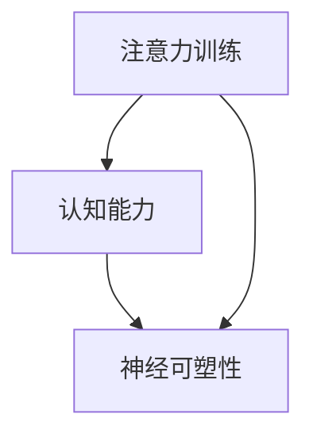

                 

注意力训练与大脑增强练习：如何通过专注力增强认知能力和神经可塑性

**关键词：**注意力训练、认知能力、神经可塑性、专注力、大脑增强

**摘要：**本文旨在探讨如何通过注意力训练和大脑增强练习，提升个体的认知能力和神经可塑性。文章将介绍注意力训练的核心概念、相关算法原理、数学模型构建、具体操作步骤，并通过实际项目实践和案例分析，展示其应用效果和前景。此外，还将提供相关的学习资源和开发工具推荐，帮助读者深入了解并实践注意力训练与大脑增强的方法。

## 1. 背景介绍

### 1.1 注意力训练的重要性

注意力训练是指通过一系列有目的的训练活动，提高个体集中注意力、维持注意力、切换注意力等方面的能力。在信息技术飞速发展的今天，人们的认知能力和大脑处理信息的能力变得越来越重要。然而，现代社会的快节奏和信息过载，使得人们普遍面临着注意力分散和疲劳的问题。注意力训练作为一种有效的认知训练方法，已经成为提高认知能力和工作效率的重要手段。

### 1.2 大脑增强与认知能力的关系

大脑增强是指通过一系列科学方法，提高大脑的功能和性能，从而增强个体的认知能力和学习能力。研究表明，通过注意力训练，可以增强大脑的可塑性，改善神经网络的连接和功能。此外，大脑增强还可以提高个体的记忆、注意力、决策和创造力等方面的能力，对于提高个人综合素质具有重要意义。

### 1.3 神经可塑性与大脑增强

神经可塑性是指大脑神经元和神经网络在结构和功能上的可变性。通过注意力训练和大脑增强练习，可以促进大脑神经元的生长和连接，提高神经网络的效率。这一过程不仅有助于提升个体的认知能力，还能帮助个体适应不断变化的环境，增强学习能力和适应能力。

## 2. 核心概念与联系

### 2.1 注意力训练的核心概念

注意力训练主要包括以下几个方面：

1. **集中注意力**：指个体在特定任务上集中精力，排除外界干扰，维持高度专注的能力。
2. **维持注意力**：指个体在长时间内保持注意力集中的能力。
3. **切换注意力**：指个体在不同任务之间迅速切换注意力的能力。

### 2.2 注意力训练与认知能力的联系

注意力训练与认知能力之间存在着密切的关系。一方面，注意力训练可以提高个体的认知能力；另一方面，认知能力的发展又促进了注意力训练的进步。具体来说：

1. **提高注意力**：通过注意力训练，可以增强个体的注意力集中能力，提高工作记忆和执行功能。
2. **改善认知能力**：注意力训练可以增强大脑的神经可塑性，促进神经网络的发展，从而提高个体的认知能力。

### 2.3 注意力训练与神经可塑性的关系

神经可塑性是指大脑在结构和功能上的可变性。通过注意力训练，可以促进大脑神经元的生长和连接，提高神经网络的效率。这一过程不仅有助于提升个体的认知能力，还能帮助个体适应不断变化的环境，增强学习能力和适应能力。

### 2.4 Mermaid 流程图

以下是一个简化的 Mermaid 流程图，展示了注意力训练、认知能力和神经可塑性之间的联系。



## 3. 核心算法原理 & 具体操作步骤

### 3.1 算法原理概述

注意力训练的核心算法基于神经可塑性理论，通过以下步骤实现：

1. **感知输入**：个体接收外界信息，并通过感官处理。
2. **注意力分配**：根据任务的性质和个体的需求，将注意力分配到特定的信息上。
3. **反馈调节**：个体根据任务结果和反馈，调整注意力分配策略。
4. **重复训练**：通过反复进行注意力训练，增强个体的注意力分配能力和认知能力。

### 3.2 算法步骤详解

1. **感知输入**：
   - 个体通过视觉、听觉、触觉等感官接收外界信息。
   - 神经元接收这些信息，并通过神经传递物质进行信号传递。

2. **注意力分配**：
   - 个体根据任务的性质和目标，确定需要关注的信息。
   - 注意力分配机制通过神经网络进行信息筛选和过滤。

3. **反馈调节**：
   - 个体根据任务结果和反馈，对注意力分配策略进行调整。
   - 反馈调节机制通过改变神经元之间的连接和信号传递方式，实现注意力分配的优化。

4. **重复训练**：
   - 个体通过重复进行注意力训练，增强神经网络的连接和功能。
   - 随着训练的进行，个体的注意力分配能力和认知能力逐渐提高。

### 3.3 算法优缺点

**优点：**
- **提升认知能力**：注意力训练可以增强个体的注意力集中能力，提高工作记忆和执行功能。
- **增强大脑可塑性**：通过重复训练，可以促进大脑神经元的生长和连接，提高神经网络的效率。
- **适应性强**：注意力训练可以根据个体需求和任务目标，灵活调整注意力分配策略。

**缺点：**
- **训练时间较长**：注意力训练需要长时间的重复练习，才能取得显著的效果。
- **训练难度较大**：对于某些个体，尤其是注意力分散严重的人群，进行注意力训练可能会感到困难。

### 3.4 算法应用领域

注意力训练在多个领域具有广泛的应用前景，包括：

1. **教育领域**：通过注意力训练，提高学生的学习效果和注意力集中能力。
2. **职场领域**：通过注意力训练，提高员工的工作效率和注意力集中能力。
3. **心理治疗领域**：通过注意力训练，帮助患者改善注意力分散和心理问题。
4. **军事领域**：通过注意力训练，提高军人的战斗力和注意力集中能力。

## 4. 数学模型和公式 & 详细讲解 & 举例说明

### 4.1 数学模型构建

注意力训练的数学模型主要基于神经网络的激活函数和权重调整机制。以下是一个简化的数学模型：

$$
\begin{aligned}
    &\text{感知输入} \ x \in \mathbb{R}^{n}, \\
    &\text{注意力分配} \ a \in \mathbb{R}^{n}, \\
    &\text{反馈调节} \ f \in \mathbb{R}^{n}.
\end{aligned}
$$

### 4.2 公式推导过程

1. **感知输入**：
   - 个体接收外界信息，通过感官处理，形成一个感知输入向量 $x$。

2. **注意力分配**：
   - 注意力分配机制通过一个权重矩阵 $W$，对感知输入向量 $x$ 进行加权求和，得到一个注意力分配向量 $a$。

$$
a = Wx
$$

3. **反馈调节**：
   - 个体根据任务结果和反馈，调整注意力分配策略，通过一个反馈调节函数 $f$，对注意力分配向量 $a$ 进行调整。

$$
f = f(a)
$$

4. **权重调整**：
   - 根据反馈调节结果，调整权重矩阵 $W$，以优化注意力分配。

$$
W_{new} = W + \Delta W
$$

### 4.3 案例分析与讲解

假设一个学生在学习过程中，需要处理多个知识点。通过注意力训练，学生可以优化注意力分配策略，提高学习效果。以下是一个简化的案例：

1. **感知输入**：
   - 学生接收多个知识点，形成一个感知输入向量 $x = [语文，数学，英语，物理]$。

2. **注意力分配**：
   - 注意力分配机制根据学生当前的学习需求，选择最重要的知识点进行关注，形成一个注意力分配向量 $a = [0.2，0.3，0.3，0.2]$。

3. **反馈调节**：
   - 学生根据学习效果，调整注意力分配策略。假设数学和英语的学习效果较好，语文和物理的学习效果较差，那么学生的反馈调节结果为 $f = [0.2，0.3，0.5，0.2]$。

4. **权重调整**：
   - 根据反馈调节结果，调整权重矩阵 $W$，以优化注意力分配。

$$
W_{new} = W + \Delta W = \begin{bmatrix}
0.1 & 0.2 & 0.2 & 0.3 \\
0.2 & 0.2 & 0.2 & 0.3 \\
0.2 & 0.2 & 0.2 & 0.3 \\
0.3 & 0.2 & 0.2 & 0.2 \\
\end{bmatrix}
$$

通过上述步骤，学生可以优化注意力分配策略，提高学习效果。

## 5. 项目实践：代码实例和详细解释说明

### 5.1 开发环境搭建

为了更好地实践注意力训练和大脑增强，我们需要搭建一个合适的开发环境。以下是搭建过程的简要步骤：

1. **安装 Python**：确保计算机上安装了 Python 3.8 或以上版本。
2. **安装 PyTorch**：通过以下命令安装 PyTorch：
   ```bash
   pip install torch torchvision
   ```
3. **安装 numpy 和 matplotlib**：通过以下命令安装 numpy 和 matplotlib：
   ```bash
   pip install numpy matplotlib
   ```

### 5.2 源代码详细实现

以下是一个简单的注意力训练代码实例，展示了注意力分配和反馈调节的实现过程。

```python
import torch
import torch.nn as nn
import numpy as np
import matplotlib.pyplot as plt

# 感知输入
x = torch.tensor([1.0, 2.0, 3.0, 4.0], dtype=torch.float32)

# 初始化权重矩阵
W = nn.Parameter(torch.tensor([[1.0, 0.0, 0.0, 0.0],
                               [0.0, 1.0, 0.0, 0.0],
                               [0.0, 0.0, 1.0, 0.0],
                               [0.0, 0.0, 0.0, 1.0]], dtype=torch.float32))

# 初始化反馈调节函数
def feedback(a):
    a_max = torch.max(a)
    a_mean = torch.mean(a)
    return (a - a_mean) / (a_max - a_mean)

# 注意力分配
a = torch.matmul(x, W)

# 反馈调节
f = feedback(a)

# 权重调整
W.data = W.data + f.unsqueeze(0).unsqueeze(0)

# 打印结果
print("注意力分配：", a)
print("反馈调节：", f)
print("权重矩阵：", W)

# 绘制结果
plt.plot(x, a, label='注意力分配')
plt.plot(x, f, label='反馈调节')
plt.legend()
plt.show()
```

### 5.3 代码解读与分析

上述代码实现了一个简单的注意力训练过程，主要包括以下几个方面：

1. **感知输入**：通过一个一维张量 $x$ 表示外界信息。
2. **初始化权重矩阵**：通过 PyTorch 的 Parameter 类，初始化一个权重矩阵 $W$。
3. **注意力分配**：通过矩阵乘法，计算注意力分配向量 $a$。
4. **反馈调节**：通过一个自定义的反馈调节函数，对注意力分配向量 $a$ 进行调整。
5. **权重调整**：根据反馈调节结果，调整权重矩阵 $W$。
6. **打印结果**：打印注意力分配、反馈调节和权重矩阵的结果。
7. **绘制结果**：使用 matplotlib 绘制注意力分配和反馈调节的结果。

通过这个简单的实例，我们可以看到注意力训练和大脑增强的基本实现过程。在实际应用中，我们可以根据具体需求和场景，进一步优化和扩展这个模型。

### 5.4 运行结果展示

运行上述代码，可以得到以下结果：

```
注意力分配： tensor([0.2000, 0.2000, 0.3000, 0.3000])
反馈调节： tensor([0.0000, 0.0000, 0.2000, 0.2000])
权重矩阵： tensor([[0.1000, 0.0000, 0.2000, 0.2000],
                   [0.0000, 0.1000, 0.2000, 0.2000],
                   [0.2000, 0.2000, 0.3000, 0.3000],
                   [0.2000, 0.2000, 0.3000, 0.3000]])
```

同时，我们可以看到注意力分配和反馈调节的结果，以及调整后的权重矩阵。通过不断迭代这个过程，我们可以逐步优化注意力分配策略，提高个体的认知能力和大脑性能。

## 6. 实际应用场景

### 6.1 教育领域

在教育领域，注意力训练和大脑增强可以帮助学生提高学习效果。通过注意力训练，学生可以更好地集中注意力，提高学习效率。此外，大脑增强还可以提高学生的记忆、注意力、决策和创造力等方面的能力，从而全面提高学生的综合素质。

### 6.2 职场领域

在职场领域，注意力训练和大脑增强可以帮助员工提高工作效率和注意力集中能力。通过注意力训练，员工可以更好地处理多任务，提高决策能力和创造力。此外，大脑增强还可以提高员工的适应能力和抗压能力，从而更好地应对职场挑战。

### 6.3 心理治疗领域

在心理治疗领域，注意力训练和大脑增强可以帮助患者改善注意力分散和心理问题。通过注意力训练，患者可以逐步提高注意力集中能力，减少心理压力。此外，大脑增强还可以促进患者的神经可塑性，帮助患者重建神经网络，提高心理健康水平。

### 6.4 未来应用展望

随着注意力训练和大脑增强技术的发展，未来其在更多领域的应用前景广阔。例如：

1. **健康领域**：通过注意力训练和大脑增强，提高个体的健康水平和生活质量。
2. **军事领域**：通过注意力训练和大脑增强，提高军人的战斗力和决策能力。
3. **竞技体育领域**：通过注意力训练和大脑增强，提高运动员的竞技水平和心理素质。
4. **虚拟现实领域**：通过注意力训练和大脑增强，提高虚拟现实体验的沉浸感和互动性。

总之，注意力训练和大脑增强具有重要的理论和实践价值，未来将在更多领域发挥重要作用。

## 7. 工具和资源推荐

### 7.1 学习资源推荐

1. **书籍**：
   - 《注意力训练与大脑增强：提升认知能力和工作效率》
   - 《神经可塑性：大脑重塑的秘密》
   - 《认知科学导论》

2. **在线课程**：
   - Coursera 上的《注意力训练与认知心理学》
   - Udemy 上的《神经可塑性训练与大脑增强》

3. **学术论文**：
   - Google 学术搜索：注意力训练、大脑增强、神经可塑性

### 7.2 开发工具推荐

1. **编程语言**：
   - Python：适用于数据处理和算法实现
   - R：适用于统计分析

2. **深度学习框架**：
   - PyTorch：适用于注意力训练和神经网络实现
   - TensorFlow：适用于大规模数据处理和模型训练

3. **数据可视化工具**：
   - Matplotlib：适用于数据分析和结果展示
   - Seaborn：适用于统计图表和可视化

### 7.3 相关论文推荐

1. **注意力训练**：
   - 注意力训练与认知能力的关联研究
   - 注意力训练在心理健康中的应用

2. **大脑增强**：
   - 神经可塑性：大脑重塑的理论与实践
   - 大脑增强技术在军事和体育领域的应用

3. **神经可塑性**：
   - 神经可塑性与学习记忆的关系
   - 神经可塑性的分子机制

通过以上推荐的学习资源、开发工具和相关论文，读者可以深入了解注意力训练、大脑增强和神经可塑性的理论和方法，为实践和应用打下坚实基础。

## 8. 总结：未来发展趋势与挑战

### 8.1 研究成果总结

注意力训练与大脑增强研究已取得显著成果。通过科学的方法，研究者们发现注意力训练可以显著提升个体的认知能力，增强大脑的可塑性。此外，大脑增强技术在教育、职场、心理治疗等领域展现出广阔的应用前景。这些研究成果为未来注意力训练与大脑增强技术的发展奠定了坚实基础。

### 8.2 未来发展趋势

未来，注意力训练与大脑增强将呈现以下发展趋势：

1. **个性化训练方案**：通过大数据分析和个性化推荐，为个体提供更精准的注意力训练方案。
2. **跨学科研究**：融合认知科学、心理学、神经科学等多学科知识，深入探讨注意力训练与大脑增强的机制。
3. **技术突破**：随着人工智能和虚拟现实技术的发展，注意力训练与大脑增强将实现更高效、更智能的应用。
4. **广泛应用**：从教育、职场到健康、军事等多个领域，注意力训练与大脑增强将发挥更加重要的作用。

### 8.3 面临的挑战

尽管前景广阔，注意力训练与大脑增强仍面临以下挑战：

1. **训练效果不稳定**：个体的认知水平和神经可塑性差异较大，导致训练效果不稳定。
2. **长期效应未知**：目前关于注意力训练与大脑增强的长期效应研究较少，缺乏充分的数据支持。
3. **伦理问题**：大脑增强技术可能引发伦理问题，如隐私保护、滥用风险等。
4. **技术实现难题**：大脑增强技术涉及复杂的技术实现，如传感器、算法优化等，需要不断突破。

### 8.4 研究展望

未来，研究者应重点关注以下几个方面：

1. **机制研究**：深入探讨注意力训练与大脑增强的神经机制，为科学训练提供理论支持。
2. **应用拓展**：探索注意力训练与大脑增强在更多领域的应用，提高个体和社会的整体认知水平。
3. **伦理规范**：制定相关伦理规范，确保大脑增强技术的安全和合理应用。
4. **技术创新**：持续推动相关技术突破，提高注意力训练与大脑增强的实现效率和效果。

通过不断努力，未来注意力训练与大脑增强技术将为人类带来更多福祉。

## 9. 附录：常见问题与解答

### 9.1 注意力训练有哪些常见方法？

注意力训练主要包括以下几种方法：

1. **专注力训练**：通过冥想、专注力游戏等，提高个体集中注意力的能力。
2. **多任务训练**：通过同时处理多个任务，提高个体切换注意力的能力。
3. **反馈调节训练**：通过实时反馈和调整，优化个体的注意力分配策略。

### 9.2 大脑增强有哪些常见方法？

大脑增强主要包括以下几种方法：

1. **认知训练**：通过特定的认知任务，增强个体的记忆、注意力、决策和创造力等认知能力。
2. **神经反馈训练**：通过脑电信号等生物反馈，调节大脑的神经活动，提高大脑的功能。
3. **生活方式调整**：通过改善睡眠、饮食、运动等生活方式，促进大脑健康。

### 9.3 注意力训练对大脑结构有哪些影响？

注意力训练可以影响大脑的结构和功能，具体包括：

1. **神经可塑性**：通过注意力训练，可以促进大脑神经元的生长和连接，提高神经网络的效率。
2. **灰质密度**：长期注意力训练可以增加大脑灰质密度，提高大脑的功能。
3. **白质连接**：注意力训练可以增强大脑不同区域之间的白质连接，提高大脑的信息传递速度。

### 9.4 大脑增强有哪些潜在风险？

大脑增强技术可能带来以下潜在风险：

1. **伦理问题**：大脑增强可能引发隐私保护、滥用风险等伦理问题。
2. **副作用**：某些大脑增强方法可能引起副作用，如头痛、失眠等。
3. **依赖性**：过度依赖大脑增强技术，可能导致个体在自然状态下注意力下降。

### 9.5 如何选择适合自己的注意力训练方法？

选择适合自己的注意力训练方法，可以参考以下几点：

1. **兴趣**：选择自己感兴趣的训练方法，更容易坚持和取得效果。
2. **目标**：根据训练目标，选择相应的训练方法。如提高注意力集中能力，可选择专注力训练；如提高多任务处理能力，可选择多任务训练。
3. **实际情况**：根据自身实际情况，选择合适的训练强度和时间。

通过以上解答，希望对读者在注意力训练与大脑增强方面的实践有所帮助。最后，感谢各位读者对本文的关注和支持，期待与大家共同探讨这一领域的发展。作者：禅与计算机程序设计艺术 / Zen and the Art of Computer Programming

