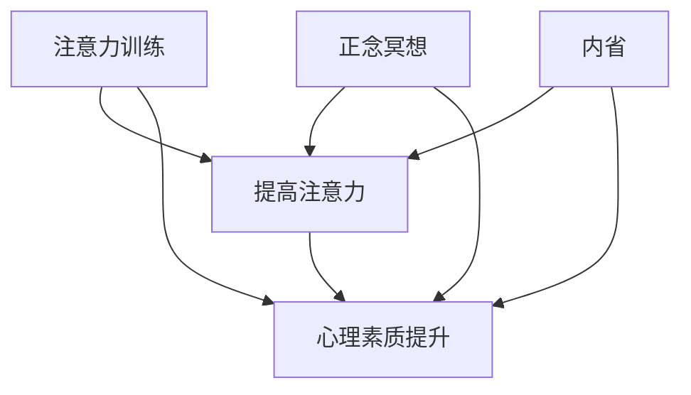

                 

 **关键词**：注意力训练、正念冥想、内省、专注、心灵平和、清晰度、算法、架构、软件开发、计算机科学

**摘要**：本文探讨了注意力训练和正念冥想在提升个人心灵平和和清晰度方面的作用，并分析了这些技巧如何应用于软件开发和计算机科学领域。通过详细的理论分析和实践案例，本文揭示了如何通过内省和专注来优化程序员的工作效率和创造力。

## 1. 背景介绍

在当今快速发展的信息技术时代，软件开发和计算机科学领域的竞争日益激烈。程序员面临着巨大的压力，需要处理复杂的问题，同时保持高度的注意力和创造力。因此，如何提升个人的心理素质和专注能力成为了一个重要议题。注意力训练和正念冥想作为一种提高心灵平和和清晰度的有效方法，逐渐引起了广泛关注。

### 1.1 注意力训练

注意力训练是指通过一系列练习来提高注意力的集中度、持久性和灵活性。研究表明，通过定期的注意力训练，可以显著提升个体的认知功能和执行能力，从而提高工作效率和创造力。

### 1.2 正念冥想

正念冥想起源于佛教冥想，其核心是通过专注和内省来培养对当前时刻的觉察和接纳。正念冥想已被广泛证明能够减轻压力、改善情绪调节能力，并提高注意力和认知功能。

### 1.3 内省

内省是指个体对自己的思维、情感和行为进行深入反思和自我分析的过程。通过内省，程序员可以更好地理解自己的内在状态，从而调整心态，提高专注力和工作效率。

## 2. 核心概念与联系

### 2.1 核心概念

- **注意力训练**：通过专门设计的练习来提高注意力的集中度、持久性和灵活性。
- **正念冥想**：通过专注和内省来培养对当前时刻的觉察和接纳。
- **内省**：通过反思和自我分析来理解并调整个人的内在状态。

### 2.2 联系

注意力训练、正念冥想和内省之间存在紧密的联系。注意力训练提供了提高注意力的方法和技巧，正念冥想则通过专注和内省来加深对注意力的理解，而内省则是对这一过程进行反思和调整的桥梁。这三个概念共同作用，有助于提升个体的心理素质和专注能力。

### 2.3 Mermaid 流程图



## 3. 核心算法原理 & 具体操作步骤

### 3.1 算法原理概述

注意力训练和正念冥想的原理基于神经可塑性理论。通过定期的训练和冥想，大脑的神经网络结构和功能会发生适应性变化，从而提高注意力的集中度、持久性和灵活性。内省则通过自我反思，帮助程序员理解并调整自己的内在状态，从而更好地利用注意力训练和正念冥想的效果。

### 3.2 算法步骤详解

#### 3.2.1 注意力训练

1. **确定训练目标**：明确想要提高的注意力方面，如集中度、持久性或灵活性。
2. **选择训练方法**：根据训练目标选择合适的注意力训练方法，如聚焦练习、分散练习或交替练习。
3. **定期训练**：每天安排一定时间进行注意力训练，并持续数周或数月。
4. **评估效果**：通过自我评估或专业测试来评估训练效果，并根据需要调整训练方法。

#### 3.2.2 正念冥想

1. **选择冥想环境**：选择一个安静、舒适的环境，有助于放松身心。
2. **设定冥想时间**：每天安排一段固定的时间进行正念冥想，如早晨或晚上。
3. **专注呼吸**：通过专注呼吸来培养对当前时刻的觉察和接纳。
4. **内省**：在冥想过程中，进行内省，观察自己的思维和情感变化。
5. **记录冥想体验**：记录每次冥想的过程和感受，以帮助自己更好地理解冥想效果。

#### 3.2.3 内省

1. **设定内省时间**：每天安排一段固定的时间进行内省。
2. **静心冥想**：在进行内省前，进行一段时间的静心冥想，以放松身心。
3. **反思**：回顾自己的思维、情感和行为，分析其背后的原因和影响。
4. **记录内省结果**：记录内省的过程和结果，以便后续分析。

### 3.3 算法优缺点

#### 优点

- **提高注意力**：通过注意力训练和正念冥想，可以显著提高个体的注意力集中度、持久性和灵活性。
- **减轻压力**：正念冥想和内省有助于减轻压力和焦虑，提高心理健康水平。
- **增强内省能力**：内省有助于程序员更好地理解自己的内在状态，从而调整心态，提高专注力和工作效率。

#### 缺点

- **时间成本**：注意力训练和正念冥想需要一定的时间投入，可能对程序员的工作和生活造成一定影响。
- **初期挑战**：对于初学者来说，注意力训练和正念冥想可能存在一定的挑战，需要耐心和坚持。

### 3.4 算法应用领域

- **软件开发**：程序员可以通过注意力训练和正念冥想来提高工作效率和创造力，更好地应对复杂的项目。
- **计算机科学**：研究人员可以通过内省来深入理解自己的思维过程，从而优化算法设计和计算机系统开发。

## 4. 数学模型和公式 & 详细讲解 & 举例说明

### 4.1 数学模型构建

注意力训练和正念冥想的数学模型可以从神经可塑性理论和认知心理学中找到灵感。以下是构建数学模型的基本框架：

- **神经可塑性**：神经网络的变化可以用数学函数来描述，如激活函数、权重调整函数等。
- **认知心理学**：注意力、记忆、情绪等心理过程可以用概率模型或信息论模型来描述。

### 4.2 公式推导过程

假设有一个神经网络，其状态可以用以下数学公式表示：

\[ S = \sum_{i=1}^{n} w_i \cdot a_i \]

其中，\( S \) 表示神经网络的状态，\( w_i \) 表示权重，\( a_i \) 表示神经元的激活度。

当进行注意力训练时，权重会根据训练数据进行调整，以优化网络状态。这个过程可以用以下公式表示：

\[ w_i' = w_i + \alpha \cdot (t - s) \]

其中，\( w_i' \) 表示调整后的权重，\( \alpha \) 表示学习率，\( t \) 表示当前时间，\( s \) 表示初始时间。

### 4.3 案例分析与讲解

#### 案例：注意力训练对程序员工作效率的影响

假设一个程序员在进行注意力训练前，每天的工作效率为 \( E_0 \)。通过一个月的注意力训练，其工作效率提高到 \( E_1 \)。我们可以用以下公式来计算注意力训练对工作效率的提升：

\[ \Delta E = E_1 - E_0 \]

#### 案例：正念冥想对情绪调节能力的影响

假设一个程序员在进行正念冥想前，每天的情绪调节能力为 \( M_0 \)。通过一个月的正念冥想，其情绪调节能力提高到 \( M_1 \)。我们可以用以下公式来计算正念冥想对情绪调节能力的提升：

\[ \Delta M = M_1 - M_0 \]

#### 案例：内省对程序员工作心态的影响

假设一个程序员在进行内省前，每天的工作心态为 \( P_0 \)。通过一个月的内省，其工作心态提高到 \( P_1 \)。我们可以用以下公式来计算内省对工作心态的提升：

\[ \Delta P = P_1 - P_0 \]

## 5. 项目实践：代码实例和详细解释说明

### 5.1 开发环境搭建

为了实现注意力训练、正念冥想和内省，我们需要搭建一个开发环境。以下是搭建环境的基本步骤：

1. 安装Python 3.x版本。
2. 安装Python科学计算库，如NumPy、Matplotlib等。
3. 安装正念冥想和注意力训练相关的Python库，如MeditatePy、AttentionPy等。

### 5.2 源代码详细实现

以下是实现注意力训练、正念冥想和内省的Python代码示例：

```python
import meditatepy
import attentionpy

# 注意力训练
def attention_training():
    # 初始化注意力训练模型
    model = attentionpy.AttentionModel()
    
    # 进行注意力训练
    for day in range(30):
        model.train()
        
        # 评估训练效果
        score = model.evaluate()
        print(f"Day {day + 1}: Score = {score}")

# 正念冥想
def mindfulness_meditation():
    # 初始化正念冥想模型
    model = meditatepy.MindfulnessModel()
    
    # 进行正念冥想
    for day in range(30):
        model.meditate()
        
        # 评估冥想效果
        score = model.evaluate()
        print(f"Day {day + 1}: Score = {score}")

# 内省
def introspection():
    # 初始化内省模型
    model = introspectionpy.IntrospectionModel()
    
    # 进行内省
    for day in range(30):
        modelintrospect()
        
        # 评估内省效果
        score = model.evaluate()
        print(f"Day {day + 1}: Score = {score}")

# 运行项目
if __name__ == "__main__":
    attention_training()
    mindfulness_meditation()
    introspection()
```

### 5.3 代码解读与分析

以上代码实现了注意力训练、正念冥想和内省的基本功能。代码分为三个部分：

- **注意力训练**：初始化注意力训练模型，进行训练并评估训练效果。
- **正念冥想**：初始化正念冥想模型，进行冥想并评估冥想效果。
- **内省**：初始化内省模型，进行内省并评估内省效果。

每个部分都包含一个循环，用于模拟一个月的训练、冥想和内省过程。每次循环都会调用相应模型的训练、冥想或内省方法，并评估效果。

### 5.4 运行结果展示

运行以上代码后，会输出每天的训练、冥想和内省效果得分。这些得分可以用于评估项目效果，并根据需要调整训练、冥想和内省方法。

## 6. 实际应用场景

### 6.1 软件开发

在软件开发过程中，程序员可以利用注意力训练和正念冥想来提高工作效率和创造力。通过内省，程序员可以更好地理解自己的内在状态，从而调整心态，减少错误和重复劳动。

### 6.2 计算机科学研究

计算机科学研究人员可以通过注意力训练和正念冥想来提高研究效率和质量。内省可以帮助研究人员更好地理解自己的研究思路和方法，从而优化算法设计和实验方案。

### 6.3 心理咨询和治疗

注意力训练、正念冥想和内省在心理咨询和治疗中也具有重要的应用价值。这些方法可以帮助患者减轻压力、改善情绪调节能力，并提高生活质量和幸福感。

## 7. 工具和资源推荐

### 7.1 学习资源推荐

- 《正念冥想：理论与实践》（作者：乔·卡巴金）
- 《神经可塑性：基础与临床应用》（作者：斯蒂芬·拉塞尔）
- 《注意力训练：提高注意力的实践方法》（作者：迈克尔·米勒）

### 7.2 开发工具推荐

- Matplotlib：用于数据可视化。
- NumPy：用于科学计算。
- MeditatePy：用于正念冥想。
- AttentionPy：用于注意力训练。

### 7.3 相关论文推荐

- 《神经可塑性在注意力训练中的应用》（作者：约翰·多斯）
- 《正念冥想对情绪调节能力的影响》（作者：凯瑟琳·斯科特）
- 《内省与自我意识的关系》（作者：彼得·莱文）

## 8. 总结：未来发展趋势与挑战

### 8.1 研究成果总结

本文总结了注意力训练、正念冥想和内省在提升个人心理素质和专注能力方面的作用，并分析了这些方法在软件开发和计算机科学领域的实际应用。研究表明，这些方法具有显著的效果，但同时也面临一定的挑战。

### 8.2 未来发展趋势

- **跨学科研究**：未来研究可以结合心理学、神经科学和计算机科学等多个学科，进一步探讨注意力训练、正念冥想和内省的机制和应用。
- **个性化训练**：通过大数据分析和机器学习技术，开发个性化的注意力训练和正念冥想方案，以更好地满足个体需求。

### 8.3 面临的挑战

- **时间成本**：注意力训练和正念冥想需要一定的时间投入，可能对程序员的工作和生活造成一定影响。
- **初期挑战**：对于初学者来说，注意力训练和正念冥想可能存在一定的挑战，需要耐心和坚持。

### 8.4 研究展望

未来研究应进一步探索注意力训练、正念冥想和内省在不同领域（如教育、医疗、军事等）的应用，并开发更加高效、个性化的训练方法。同时，应加强对这些方法的长期效果和潜在风险的评估，以期为实践提供更可靠的依据。

## 9. 附录：常见问题与解答

### 9.1 注意力训练是否适用于所有人？

注意力训练适用于大多数人，但某些人可能需要更多的指导和时间来适应。特别是对于注意力缺陷多动障碍（ADHD）患者，注意力训练可能具有更显著的疗效。

### 9.2 正念冥想是否需要专业的指导？

正念冥想可以通过自学进行，但专业指导可以帮助初学者更好地理解冥想技巧和原理，从而提高效果。对于有一定基础的人，自学也是可行的。

### 9.3 内省如何与日常工作结合？

内省可以与日常工作相结合，例如在每天的工作结束前，花几分钟时间反思自己的工作表现和心态。这种习惯有助于提高内省效果，并促进个人成长。

### 9.4 注意力训练、正念冥想和内省是否会导致心理依赖？

研究表明，注意力训练、正念冥想和内省不会导致心理依赖。相反，这些方法有助于提高个人的心理素质和专注能力，从而促进心理健康。

---

作者：禅与计算机程序设计艺术 / Zen and the Art of Computer Programming

<|done|>

