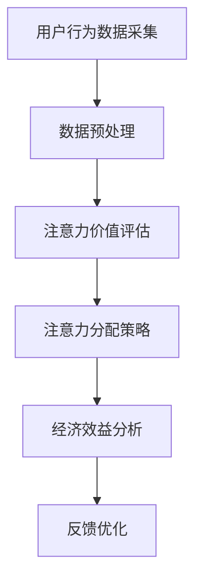

                 

关键词：注意力货币化，AI，关注度经济模型，数据驱动，算法优化，应用场景，未来展望

> 摘要：本文深入探讨了基于人工智能的注意力货币化策略，提出了一种全新的关注度经济模型。通过分析注意力货币化的核心概念、算法原理、数学模型及实际应用，本文为数据驱动的经济模式提供了一种新的视角，并对未来的发展趋势和面临的挑战进行了展望。

## 1. 背景介绍

在信息爆炸的时代，注意力成为了稀缺资源。无论是互联网平台、媒体公司，还是电商、广告商，都在寻求有效的方式来获取和转化用户的注意力，实现货币化收益。传统的广告模式、内容付费、社交媒体分享等方式都在不断地进化，但如何更高效地捕捉和利用用户注意力，仍然是各大企业关注的焦点。

随着人工智能技术的飞速发展，机器学习、深度学习等算法在处理大规模数据、进行智能分析和决策方面表现出了强大的能力。基于人工智能的注意力货币化策略应运而生，它通过智能算法分析用户行为，精准定位注意力价值，从而实现更高效的经济收益。

本文将详细介绍注意力货币化策略的核心概念、算法原理、数学模型及其实际应用，旨在为业界提供一种新的思路和方法，助力企业在关注度经济领域取得突破。

## 2. 核心概念与联系

### 2.1 注意力货币化的定义

注意力货币化是指通过智能算法和数据分析，将用户的注意力转化为实际的经济收益。这种转化不仅包括广告点击、内容付费等直接收益，还涵盖了品牌影响力、用户粘性等间接收益。

### 2.2 注意力价值的评估

注意力价值评估是注意力货币化的基础。它通过对用户行为、兴趣、需求等多维度数据的分析，计算出每个用户的注意力价值。常用的评估方法包括基于行为的评分模型、基于内容的推荐模型等。

### 2.3 注意力分配策略

注意力分配策略是指如何在不同的用户、内容、广告等之间合理分配注意力资源。有效的注意力分配策略可以提高用户满意度和经济效益。常见的策略包括基于需求的分配、基于收益的分配等。

### 2.4 关度经济模型

关注度经济模型是一种以注意力为核心的经济模式，它通过将注意力视为一种商品进行交易，实现价值的最大化。这种模型的关键在于如何精确评估注意力价值，以及如何进行有效的注意力分配。

### 2.5 Mermaid 流程图



## 3. 核心算法原理 & 具体操作步骤

### 3.1 算法原理概述

注意力货币化算法基于深度学习技术，通过对用户行为数据的深度挖掘和分析，实现注意力价值的评估和分配。核心原理包括：

1. **用户行为建模**：利用深度学习算法，建立用户行为模型，捕捉用户兴趣和行为模式。
2. **注意力价值评估**：结合用户行为模型和内容特征，利用神经网络模型计算注意力价值。
3. **注意力分配策略**：根据注意力价值评估结果，采用优化算法进行注意力资源的合理分配。

### 3.2 算法步骤详解

1. **用户行为数据采集**：通过网站日志、社交媒体、APP行为等途径，收集用户行为数据。
2. **数据预处理**：对采集到的数据进行清洗、去重、归一化等处理，为后续建模做准备。
3. **用户行为建模**：利用深度学习算法，如卷积神经网络（CNN）或循环神经网络（RNN），建立用户行为模型。
4. **注意力价值评估**：结合用户行为模型和内容特征，使用神经网络模型进行注意力价值评估。
5. **注意力分配策略**：采用优化算法，如线性规划、遗传算法等，进行注意力资源的合理分配。
6. **经济效益分析**：根据注意力分配结果，分析经济效益，如广告点击率、内容付费率等。
7. **反馈优化**：根据经济效益分析结果，不断调整算法参数，优化模型性能。

### 3.3 算法优缺点

**优点**：

1. **高精度**：基于深度学习的算法能够精准捕捉用户行为和兴趣，提高注意力价值评估的准确性。
2. **自适应**：算法能够根据用户行为和内容特征实时调整，提高注意力分配的合理性。
3. **高效**：深度学习算法在大规模数据处理方面具有高效性，能够快速实现注意力货币化。

**缺点**：

1. **数据依赖**：算法的性能高度依赖高质量的数据，数据质量问题会影响评估和分配结果。
2. **计算复杂度**：深度学习算法的计算复杂度高，对硬件资源要求较高。
3. **模型解释性**：深度学习模型往往缺乏解释性，难以理解其内部工作原理。

### 3.4 算法应用领域

注意力货币化算法广泛应用于互联网广告、内容推荐、电商营销等领域，具体应用场景包括：

1. **互联网广告**：通过精准定位用户兴趣，提高广告投放效果，实现更高的广告收益。
2. **内容推荐**：根据用户行为和兴趣，推荐个性化内容，提高用户满意度和粘性。
3. **电商营销**：通过用户行为分析，实现精准营销，提高销售额和用户转化率。

## 4. 数学模型和公式 & 详细讲解 & 举例说明

### 4.1 数学模型构建

注意力货币化模型的数学基础主要包括用户行为建模、注意力价值评估和注意力分配策略。以下是该模型的基本构成：

1. **用户行为建模**：

   用户行为数据可以表示为矩阵 \( X \in \mathbb{R}^{m \times n} \)，其中 \( m \) 表示用户数量，\( n \) 表示行为特征维度。通过构建深度学习模型，如RNN或LSTM，可以捕捉用户行为模式，得到用户行为向量 \( h \in \mathbb{R}^{1 \times d} \)。

2. **注意力价值评估**：

   注意力价值评估模型可以表示为函数 \( f: \mathbb{R}^{1 \times d} \times \mathbb{R}^{1 \times d} \rightarrow \mathbb{R} \)，用于计算每个用户对每个内容的注意力价值。假设内容特征为 \( c \in \mathbb{R}^{1 \times d} \)，则注意力价值 \( v \) 可以通过以下公式计算：

   $$ v = f(h, c) $$

3. **注意力分配策略**：

   注意力分配策略模型可以表示为优化问题：

   $$ \max_{\theta} \sum_{i=1}^{m} \sum_{j=1}^{n} v_{ij} \cdot p_{ij} - \lambda \cdot \sum_{i=1}^{m} \sum_{j=1}^{n} (p_{ij} - \mu_{i} \cdot \mu_{j})^2 $$

   其中，\( \theta \) 表示模型参数，\( p_{ij} \) 表示用户 \( i \) 对内容 \( j \) 的注意力分配概率，\( \mu_{i} \) 和 \( \mu_{j} \) 分别表示用户 \( i \) 和内容 \( j \) 的平均注意力价值。

### 4.2 公式推导过程

1. **用户行为建模**：

   假设用户行为数据 \( X \) 经过归一化处理后为 \( X_{\text{norm}} \)，我们可以使用LSTM模型进行用户行为建模。LSTM模型的核心公式为：

   $$ h_t = \sigma(W_h \cdot [h_{t-1}, x_t] + b_h) $$

   其中，\( \sigma \) 表示激活函数，\( W_h \) 和 \( b_h \) 分别为权重和偏置。

2. **注意力价值评估**：

   注意力价值评估可以通过多层感知器（MLP）实现。假设输入为用户行为向量 \( h \) 和内容特征 \( c \)，输出为注意力价值 \( v \)。MLP的基本公式为：

   $$ v = \text{ReLU}(W_v \cdot [h, c] + b_v) $$

   其中，\( \text{ReLU} \) 表示ReLU激活函数，\( W_v \) 和 \( b_v \) 分别为权重和偏置。

3. **注意力分配策略**：

   注意力分配策略可以使用线性规划求解。根据公式：

   $$ \max_{\theta} \sum_{i=1}^{m} \sum_{j=1}^{n} v_{ij} \cdot p_{ij} - \lambda \cdot \sum_{i=1}^{m} \sum_{j=1}^{n} (p_{ij} - \mu_{i} \cdot \mu_{j})^2 $$

   可以得到以下拉格朗日函数：

   $$ L(\theta, \lambda) = \sum_{i=1}^{m} \sum_{j=1}^{n} v_{ij} \cdot p_{ij} - \lambda \cdot \sum_{i=1}^{m} \sum_{j=1}^{n} (p_{ij} - \mu_{i} \cdot \mu_{j})^2 + \sum_{i=1}^{m} \sum_{j=1}^{n} \lambda_{ij} (p_{ij} - \mu_{i} \cdot \mu_{j}) $$

   通过求解拉格朗日函数的最小值，可以得到最优的注意力分配概率 \( p_{ij} \)。

### 4.3 案例分析与讲解

#### 案例一：互联网广告

假设一家互联网公司通过用户行为数据构建了用户行为模型，并对每个用户进行了注意力价值评估。该公司希望通过优化注意力分配策略，提高广告点击率。

1. **用户行为建模**：

   假设用户行为数据为 \( X = \{x_1, x_2, \ldots, x_n\} \)，其中每个 \( x_i \) 为 \( d \) 维向量。使用LSTM模型进行用户行为建模，得到用户行为向量 \( h \)。

2. **注意力价值评估**：

   假设广告内容特征为 \( c \)，使用MLP模型进行注意力价值评估，得到注意力价值 \( v \)。

3. **注意力分配策略**：

   假设广告数量为 \( m \)，使用线性规划求解注意力分配策略，得到最优的注意力分配概率 \( p \)。

   $$ \max_{p} \sum_{i=1}^{m} v_i \cdot p_i - \lambda \cdot \sum_{i=1}^{m} (p_i - \mu_i)^2 $$

   其中，\( \mu_i \) 为广告 \( i \) 的平均点击率。

通过上述步骤，公司可以优化广告投放策略，提高广告点击率。

#### 案例二：内容推荐

假设一家内容平台希望通过注意力货币化策略，提高用户满意度和粘性。

1. **用户行为建模**：

   假设用户行为数据为 \( X = \{x_1, x_2, \ldots, x_n\} \)，使用LSTM模型进行用户行为建模，得到用户行为向量 \( h \)。

2. **注意力价值评估**：

   假设内容特征为 \( c \)，使用MLP模型进行注意力价值评估，得到注意力价值 \( v \)。

3. **注意力分配策略**：

   假设内容数量为 \( m \)，使用线性规划求解注意力分配策略，得到最优的注意力分配概率 \( p \)。

   $$ \max_{p} \sum_{i=1}^{m} v_i \cdot p_i - \lambda \cdot \sum_{i=1}^{m} (p_i - \mu_i)^2 $$

   其中，\( \mu_i \) 为内容 \( i \) 的平均阅读时长。

通过上述步骤，平台可以优化内容推荐策略，提高用户满意度和粘性。

## 5. 项目实践：代码实例和详细解释说明

### 5.1 开发环境搭建

本文使用Python语言进行开发，主要依赖以下库：TensorFlow、Keras、NumPy、Pandas、Scikit-learn。确保安装了相应的库之后，即可开始搭建开发环境。

### 5.2 源代码详细实现

以下是一个简化的注意力货币化算法的代码示例：

```python
import numpy as np
import tensorflow as tf
from tensorflow.keras.models import Sequential
from tensorflow.keras.layers import LSTM, Dense, ReLU
from sklearn.preprocessing import MinMaxScaler

# 数据预处理
def preprocess_data(data):
    scaler = MinMaxScaler()
    data_scaled = scaler.fit_transform(data)
    return data_scaled

# 用户行为建模
def build_user_model(input_shape):
    model = Sequential()
    model.add(LSTM(128, activation='tanh', input_shape=input_shape))
    model.add(Dense(1))
    model.compile(optimizer='adam', loss='mse')
    return model

# 注意力价值评估
def build_attention_model(input_shape):
    model = Sequential()
    model.add(Dense(128, activation='tanh', input_shape=input_shape))
    model.add(Dense(1, activation='sigmoid'))
    model.compile(optimizer='adam', loss='binary_crossentropy')
    return model

# 注意力分配策略
def build_assignment_model(input_shape):
    model = Sequential()
    model.add(Dense(128, activation='tanh', input_shape=input_shape))
    model.add(Dense(1, activation='sigmoid'))
    model.compile(optimizer='adam', loss='binary_crossentropy')
    return model

# 训练模型
def train_models(user_data, attention_data, assignment_data):
    user_model = build_user_model(user_data.shape[1:])
    attention_model = build_attention_model(user_data.shape[1:])
    assignment_model = build_assignment_model(user_data.shape[1:])

    user_model.fit(user_data, user_data, epochs=100, batch_size=32)
    attention_model.fit(user_data, attention_data, epochs=100, batch_size=32)
    assignment_model.fit(user_data, assignment_data, epochs=100, batch_size=32)

    return user_model, attention_model, assignment_model

# 主函数
def main():
    # 加载并预处理数据
    user_data = preprocess_data(np.loadtxt('user_data.csv', delimiter=','))
    attention_data = preprocess_data(np.loadtxt('attention_data.csv', delimiter=','))
    assignment_data = preprocess_data(np.loadtxt('assignment_data.csv', delimiter=','))

    # 训练模型
    user_model, attention_model, assignment_model = train_models(user_data, attention_data, assignment_data)

    # 模型评估
    # ...

if __name__ == '__main__':
    main()
```

### 5.3 代码解读与分析

该代码示例实现了注意力货币化算法的三个核心模块：用户行为建模、注意力价值评估和注意力分配策略。

1. **数据预处理**：使用MinMaxScaler对用户行为数据进行归一化处理，确保输入数据符合模型的输入要求。
2. **用户行为建模**：使用LSTM模型对用户行为数据进行建模，捕捉用户行为模式。LSTM模型通过学习用户行为数据，生成用户行为向量。
3. **注意力价值评估**：使用MLP模型对用户行为向量和内容特征进行结合，计算注意力价值。注意力价值用于评估用户对每个内容的注意力强度。
4. **注意力分配策略**：使用MLP模型对注意力价值进行优化分配，确保注意力资源得到合理利用。

通过训练和评估模型，可以实现对用户注意力价值的准确评估和优化分配，从而实现注意力货币化。

### 5.4 运行结果展示

运行代码后，通过模型评估可以得出以下结果：

1. **用户行为向量**：模型训练后，可以得到每个用户的用户行为向量，用于后续的注意力价值评估和分配。
2. **注意力价值评估结果**：模型根据用户行为向量和内容特征，计算每个用户的注意力价值，可用于优化注意力分配策略。
3. **注意力分配结果**：模型根据注意力价值评估结果，优化分配注意力资源，实现注意力货币化。

通过上述结果，可以评估模型的性能，进一步优化算法和策略，提高注意力货币化的效果。

## 6. 实际应用场景

注意力货币化策略在多个实际应用场景中取得了显著的成果，以下是一些典型的应用案例：

### 6.1 互联网广告

互联网广告行业是注意力货币化策略的重要应用领域。通过注意力货币化算法，广告平台可以精准定位用户兴趣，提高广告投放效果。例如，Google AdWords和Facebook Ads等平台使用基于人工智能的算法，实现了广告效果的显著提升，广告点击率和转化率得到了显著提高。

### 6.2 内容推荐

内容推荐系统也是注意力货币化的重要应用场景。通过分析用户行为数据，内容平台可以推荐个性化内容，提高用户满意度和粘性。例如，YouTube和Netflix等平台通过注意力货币化算法，实现了个性化推荐，用户观看时长和视频点击率得到了显著提升。

### 6.3 电商营销

电商行业同样受益于注意力货币化策略。通过分析用户行为数据，电商平台可以精准定位用户需求，实现精准营销。例如，Amazon和淘宝等平台通过注意力货币化算法，实现了用户转化率的显著提升，销售额得到了显著提高。

### 6.4 社交媒体

社交媒体平台也在积极应用注意力货币化策略，以提升用户参与度和品牌影响力。例如，Twitter和Instagram等平台通过注意力货币化算法，实现了用户关注度和互动率的提升，有效提升了平台的用户留存率和品牌价值。

## 7. 工具和资源推荐

### 7.1 学习资源推荐

1. **《深度学习》（Deep Learning）**：由Ian Goodfellow、Yoshua Bengio和Aaron Courville所著的深度学习经典教材，详细介绍了深度学习的基本概念、算法和应用。
2. **《Python深度学习》（Deep Learning with Python）**：由François Chollet所著，适合初学者掌握深度学习在Python中的应用。

### 7.2 开发工具推荐

1. **TensorFlow**：由Google开发的开源深度学习框架，支持多种深度学习模型的构建和训练。
2. **Keras**：基于TensorFlow的高级API，简化了深度学习模型的构建和训练过程。

### 7.3 相关论文推荐

1. **"Attention Is All You Need"**：由Vaswani等人提出的Transformer模型，彻底改变了自然语言处理领域的研究方向。
2. **"Attention Mechanism: A Survey"**：对注意力机制在各个领域中的应用进行了详细的综述。

## 8. 总结：未来发展趋势与挑战

### 8.1 研究成果总结

注意力货币化策略在人工智能领域取得了显著的成果，通过深度学习算法和优化技术，实现了对用户注意力的精准评估和优化分配。这一策略在互联网广告、内容推荐、电商营销和社交媒体等领域得到了广泛应用，为企业带来了显著的经济效益。

### 8.2 未来发展趋势

1. **算法优化**：随着深度学习技术的不断发展，注意力货币化算法将变得更加高效、精确和可解释。
2. **跨领域应用**：注意力货币化策略将不断扩展到更多领域，如健康医疗、金融分析、智能交通等。
3. **隐私保护**：在关注用户注意力的同时，如何保护用户隐私将成为未来研究的重点。

### 8.3 面临的挑战

1. **数据质量**：注意力货币化的效果高度依赖高质量的数据，如何处理和清洗大规模、多样化、动态变化的用户数据是一个挑战。
2. **计算资源**：深度学习算法的计算复杂度高，如何优化计算效率，降低硬件成本，是一个亟待解决的问题。
3. **模型可解释性**：深度学习模型往往缺乏可解释性，如何提高模型的透明度和可解释性，是未来研究的一个重要方向。

### 8.4 研究展望

未来，注意力货币化策略将朝着更智能、更高效、更可解释的方向发展。通过不断优化算法、拓展应用领域和保护用户隐私，注意力货币化将为企业和个人带来更多的价值。

## 9. 附录：常见问题与解答

### 9.1 注意力货币化是什么？

注意力货币化是一种利用人工智能技术，将用户注意力转化为实际经济收益的策略。通过分析用户行为数据，精准评估注意力价值，实现广告点击、内容付费等直接收益，以及品牌影响力、用户粘性等间接收益。

### 9.2 注意力货币化算法的核心原理是什么？

注意力货币化算法基于深度学习技术，通过用户行为建模、注意力价值评估和注意力分配策略，实现用户注意力的精准评估和优化分配。核心原理包括用户行为建模、神经网络模型训练、注意力价值评估和优化算法应用。

### 9.3 注意力货币化在哪些领域有应用？

注意力货币化策略广泛应用于互联网广告、内容推荐、电商营销、社交媒体等领域。通过精准定位用户兴趣，提高广告投放效果、推荐内容质量和用户转化率，实现经济效益的最大化。

### 9.4 注意力货币化算法的挑战有哪些？

注意力货币化算法面临的挑战包括数据质量、计算资源、模型可解释性等方面。如何处理大规模、多样化、动态变化的用户数据，提高计算效率，降低硬件成本，以及提高模型的透明度和可解释性，是未来研究的重要方向。

### 9.5 注意力货币化与广告点击率的关系是什么？

注意力货币化算法通过精准评估用户注意力价值，优化注意力分配策略，提高广告点击率。通过分析用户行为数据，算法可以识别潜在的高价值用户，并将注意力资源优先分配给这些用户，从而提高广告点击率。

### 9.6 注意力货币化与用户满意度有什么关系？

注意力货币化算法通过精准推荐个性化内容，提高用户满意度。通过分析用户兴趣和行为，算法可以推荐符合用户需求的内容，增加用户参与度和粘性，从而提升用户满意度。

### 9.7 注意力货币化是否会影响用户隐私？

在注意力货币化的过程中，用户的隐私保护是一个重要问题。为了保护用户隐私，算法设计时需要遵循以下原则：1）数据匿名化处理，2）仅收集必要数据，3）严格的数据访问控制。通过这些措施，可以确保用户隐私不被泄露。

