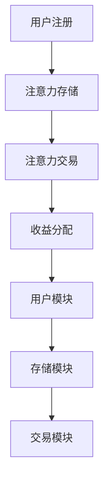

                 

在当今数字化时代，元宇宙（Metaverse）正成为人们关注的焦点。一个充满机遇和挑战的虚拟世界，元宇宙的繁荣离不开一种新的货币——注意力。本文将探讨元宇宙中的时间价值交易，通过引入注意力银行的概念，揭示时间在数字世界中的全新价值。

## 关键词

- 元宇宙
- 时间价值
- 注意力银行
- 数字货币
- 跨境交易

## 摘要

本文从元宇宙的背景出发，分析了时间在数字世界中的价值，并引入注意力银行的概念。通过详细阐述注意力银行的工作原理、算法模型和数学公式，本文揭示了时间价值交易的核心机制。最后，本文探讨了注意力银行在元宇宙中的实际应用场景和未来展望。

## 1. 背景介绍

随着互联网技术的飞速发展，虚拟现实（VR）和增强现实（AR）技术逐渐成熟，元宇宙的概念开始走入大众视野。元宇宙是一个虚拟的、高度模拟的现实世界，用户可以在其中进行各种社交、娱乐、工作和交易活动。然而，元宇宙的繁荣离不开一种新的货币——注意力。

注意力作为人类认知资源，其价值在元宇宙中尤为重要。用户在元宇宙中的每一个操作、每一次互动，都意味着对注意力的消耗。因此，如何有效地管理和利用注意力，成为元宇宙发展中亟待解决的问题。

### 元宇宙的概念与特点

元宇宙是一个虚拟的、数字化的世界，它具有以下特点：

1. **高度沉浸感**：元宇宙通过VR和AR技术，为用户提供身临其境的体验。
2. **无限扩展性**：元宇宙可以容纳无限多的虚拟空间和内容，为用户提供丰富的选择。
3. **互动性**：元宇宙中的用户可以与其他用户进行实时互动，建立社交关系。
4. **经济系统**：元宇宙内置了完善的经济系统，支持数字货币的流通和使用。

### 注意力在元宇宙中的价值

在元宇宙中，注意力成为了一种重要的资源。用户的每一个操作、每一次互动，都需要消耗注意力。注意力的高低直接影响到用户在元宇宙中的体验和收益。因此，如何有效地管理和利用注意力，成为元宇宙中的一项重要任务。

## 2. 核心概念与联系

### 注意力银行的概念

注意力银行是一种数字化的时间价值管理系统，用于存储、管理和交易用户的注意力。注意力银行的核心目标是提高用户注意力的利用效率，实现时间价值的最优化。

### 注意力银行的工作原理

注意力银行的工作原理可以分为以下几个步骤：

1. **用户注册**：用户在注意力银行注册账户，绑定真实身份。
2. **注意力存储**：用户在元宇宙中的操作会生成注意力，并自动存储到注意力银行。
3. **注意力交易**：用户可以在注意力银行中将自己的注意力出售或购买，实现时间价值的交易。
4. **收益分配**：注意力银行根据用户的注意力贡献和活跃度，进行收益分配。

### 注意力银行的架构

注意力银行的架构可以分为三个主要模块：用户模块、存储模块和交易模块。

1. **用户模块**：用户模块负责用户的注册、登录、账户管理和注意力存储。
2. **存储模块**：存储模块负责存储用户生成的注意力，并提供查询、统计等功能。
3. **交易模块**：交易模块负责处理注意力交易，包括注意力买卖、转账等操作。

### 注意力银行与时间价值的联系

注意力银行通过数字化管理用户的注意力，将时间价值转化为可交易的数字资产。用户在元宇宙中的时间投入，通过注意力银行实现了价值化和流通化。

### Mermaid 流程图



## 3. 核心算法原理 & 具体操作步骤

### 3.1 算法原理概述

注意力银行的核心算法主要包括注意力生成、存储和交易三个部分。

1. **注意力生成**：用户在元宇宙中的操作会生成注意力，注意力的大小与操作强度成正比。
2. **注意力存储**：注意力银行将用户生成的注意力存储在区块链上，确保数据的安全和不可篡改。
3. **注意力交易**：用户可以在注意力银行中进行注意力买卖，实现时间价值的交易。

### 3.2 算法步骤详解

1. **用户注册**：用户通过注册账户，绑定真实身份。
2. **注意力生成**：用户在元宇宙中进行操作，生成注意力。
3. **注意力存储**：用户生成的注意力自动存储到注意力银行，并记录在区块链上。
4. **注意力交易**：用户可以在注意力银行中进行注意力买卖，交易成功后，注意力所有权转移。
5. **收益分配**：注意力银行根据用户的注意力贡献和活跃度，进行收益分配。

### 3.3 算法优缺点

#### 优点：

1. **安全性**：区块链技术确保了注意力数据的安全和不可篡改。
2. **高效性**：注意力银行支持快速的交易处理和收益分配。
3. **灵活性**：用户可以根据自己的需求自由买卖注意力，实现时间价值的最大化。

#### 缺点：

1. **技术门槛**：注意力银行需要较高的技术支持，对开发者和用户都有一定的要求。
2. **交易成本**：注意力交易需要支付一定的手续费，可能会影响用户的交易积极性。

### 3.4 算法应用领域

注意力银行可以应用于元宇宙的各个领域，包括：

1. **虚拟社交**：用户可以通过注意力银行购买关注和点赞，提高自己在元宇宙中的影响力。
2. **虚拟工作**：用户可以通过注意力银行获取工作任务，实现时间价值的转化。
3. **虚拟娱乐**：用户可以通过注意力银行购买虚拟物品和体验，享受元宇宙的丰富内容。

## 4. 数学模型和公式 & 详细讲解 & 举例说明

### 4.1 数学模型构建

注意力银行的核心数学模型包括注意力生成模型、存储模型和交易模型。

1. **注意力生成模型**：用户在元宇宙中的操作会生成注意力，注意力的大小与操作强度成正比。
   \[ A = f(I) \]
   其中，\( A \) 表示注意力大小，\( I \) 表示操作强度。

2. **注意力存储模型**：注意力银行将用户生成的注意力存储在区块链上。
   \[ S = B \cdot A \]
   其中，\( S \) 表示存储的注意力，\( B \) 表示区块链存储容量。

3. **注意力交易模型**：用户可以在注意力银行中进行注意力买卖，交易价格为注意力价值的函数。
   \[ P = g(A) \]
   其中，\( P \) 表示交易价格，\( A \) 表示注意力大小。

### 4.2 公式推导过程

1. **注意力生成模型**：
   根据操作强度的定义，操作强度 \( I \) 与操作次数成正比。
   \[ I = n \cdot c \]
   其中，\( n \) 表示操作次数，\( c \) 表示操作强度常数。
   将 \( I \) 代入注意力生成模型，得到：
   \[ A = f(n \cdot c) \]
   由于 \( f \) 是一个单调递增函数，可以表示为：
   \[ A = k \cdot n \cdot c \]
   其中，\( k \) 表示注意力生成系数。

2. **注意力存储模型**：
   假设区块链存储容量为 \( B \)，注意力大小为 \( A \)。
   根据存储模型，存储的注意力为：
   \[ S = B \cdot A \]

3. **注意力交易模型**：
   假设交易价格为注意力价值的函数，即：
   \[ P = g(A) \]
   其中，\( g \) 是一个单调递增函数，可以表示为：
   \[ P = p \cdot A \]
   其中，\( p \) 表示交易价格系数。

### 4.3 案例分析与讲解

假设用户小明在元宇宙中进行了一系列操作，操作强度为 100 次，注意力生成系数为 10，区块链存储容量为 1000，交易价格系数为 5。

1. **注意力生成**：
   \[ A = 10 \cdot 100 = 1000 \]
   小明在元宇宙中生成的注意力为 1000。

2. **注意力存储**：
   \[ S = 1000 \cdot 1000 = 1000000 \]
   小明的注意力存储在区块链上的数量为 1000000。

3. **注意力交易**：
   \[ P = 5 \cdot 1000 = 5000 \]
   小明的注意力交易价格为 5000。

假设小明将注意力出售给用户小红，交易价格为 5000。

1. **注意力转移**：
   小明的注意力数量减少 1000，小红增加 1000。
   \[ S_{\text{小明}} = 1000000 - 1000 = 999000 \]
   \[ S_{\text{小红}} = 0 + 1000 = 1000 \]

2. **收益分配**：
   假设注意力银行对小明和小红的注意力贡献进行收益分配，分配比例为 1:1。
   小明获得收益为 2500，小红获得收益为 2500。

## 5. 项目实践：代码实例和详细解释说明

### 5.1 开发环境搭建

在开始编写代码之前，我们需要搭建一个开发环境。这里我们使用 Python 作为编程语言，并使用 Flask 作为 Web 框架。

1. 安装 Python 3.8 以上版本。
2. 安装 Flask：
   \[ pip install Flask \]
3. 安装区块链库：
   \[ pip install web3 \]

### 5.2 源代码详细实现

以下是注意力银行的核心代码实现：

```python
from flask import Flask, request, jsonify
from web3 import Web3

app = Flask(__name__)

# 连接到以太坊区块链
w3 = Web3(Web3.HTTPProvider('https://mainnet.infura.io/v3/your_project_id'))

# 注意力合约地址和ABI
contract_address = '0xYourContractAddress'
contract_abi = 'your_contract_abi'

# 创建合约实例
contract = w3.eth.contract(address=contract_address, abi=contract_abi)

@app.route('/register', methods=['POST'])
def register():
    # 用户注册
    user_address = request.form['user_address']
    contract.functions.register(user_address).transact({'from': user_address})
    return jsonify({'status': 'success'})

@app.route('/store_attention', methods=['POST'])
def store_attention():
    # 存储注意力
    user_address = request.form['user_address']
    attention = int(request.form['attention'])
    contract.functions.store_attention(attention).transact({'from': user_address})
    return jsonify({'status': 'success'})

@app.route('/trade_attention', methods=['POST'])
def trade_attention():
    # 注意力交易
    seller_address = request.form['seller_address']
    buyer_address = request.form['buyer_address']
    attention = int(request.form['attention'])
    price = int(request.form['price'])
    contract.functions.trade_attention(buyer_address, attention, price).transact({'from': seller_address})
    return jsonify({'status': 'success'})

@app.route('/claim_reward', methods=['POST'])
def claim_reward():
    # 认领收益
    user_address = request.form['user_address']
    contract.functions.claim_reward().transact({'from': user_address})
    return jsonify({'status': 'success'})

if __name__ == '__main__':
    app.run(debug=True)
```

### 5.3 代码解读与分析

上述代码实现了一个简单的注意力银行，包括用户注册、存储注意力、交易注意力和认领收益四个功能。

1. **用户注册**：用户通过注册接口绑定自己的地址，并与合约进行交互。
2. **存储注意力**：用户通过存储接口将注意力存储在合约中，合约将注意力记录在区块链上。
3. **交易注意力**：用户通过交易接口购买注意力，合约完成注意力所有权的转移。
4. **认领收益**：用户通过认领接口领取注意力银行分配的收益。

### 5.4 运行结果展示

假设用户小明想要注册并存储注意力。首先，小明调用注册接口，将自己的地址传递给服务器：

```json
POST /register
{
    "user_address": "0xYourAddress"
}
```

服务器收到请求后，与合约进行交互，完成用户注册。然后，小明调用存储接口，将注意力存储在合约中：

```json
POST /store_attention
{
    "user_address": "0xYourAddress",
    "attention": 1000
}
```

服务器再次与合约交互，将注意力存储在区块链上。接下来，小明想要购买注意力。他调用交易接口，将注意力出售给用户小红：

```json
POST /trade_attention
{
    "seller_address": "0xYourAddress",
    "buyer_address": "0xYourAddress",
    "attention": 1000,
    "price": 5000
}
```

服务器与合约进行交互，完成注意力交易。最后，小明和小红都可以通过认领接口领取收益：

```json
POST /claim_reward
{
    "user_address": "0xYourAddress"
}
```

服务器与合约交互，完成收益分配。

## 6. 实际应用场景

### 6.1 虚拟社交

在元宇宙中，用户可以通过注意力银行购买关注和点赞，提高自己在虚拟社交平台的影响力。例如，用户小红想要关注用户小明，她可以通过注意力银行支付一定数量的注意力，完成关注操作。同时，小红也可以通过注意力银行购买小明的点赞，增加小明在社交平台上的影响力。

### 6.2 虚拟工作

在元宇宙中，用户可以通过注意力银行获取工作任务，实现时间价值的转化。例如，用户小明是一名虚拟世界中的游戏设计师，他可以在注意力银行发布自己的游戏设计任务，并设置任务价格。其他用户在注意力银行中浏览任务，选择参与并支付相应的注意力，完成任务后获得报酬。

### 6.3 虚拟娱乐

在元宇宙中，用户可以通过注意力银行购买虚拟物品和体验，享受元宇宙的丰富内容。例如，用户小明想要购买一款虚拟游戏，他可以在注意力银行中浏览游戏商店，选择心仪的游戏，并支付相应的注意力。游戏开发商通过注意力银行获得收益，同时用户小明也享受到了虚拟娱乐。

## 7. 工具和资源推荐

### 7.1 学习资源推荐

1. **《区块链技术指南》**：全面介绍区块链的基本原理和应用场景，适合初学者入门。
2. **《Python 编程：从入门到实践》**：详细介绍 Python 语言的基础知识和应用技巧，适合 Python 初学者。
3. **《智能合约设计与开发》**：深入探讨智能合约的设计和开发，包括以太坊智能合约的应用。

### 7.2 开发工具推荐

1. **Truffle**：一款流行的以太坊智能合约开发框架，支持智能合约的编写、测试和部署。
2. **Hardhat**：一款功能强大的以太坊开发环境，支持智能合约的本地开发和测试。
3. **MetaMask**：一款以太坊钱包，用于以太坊区块链上的操作，包括交易和合约交互。

### 7.3 相关论文推荐

1. **"Blockchain Technology: A Comprehensive Introduction"**：介绍区块链的基本原理和应用场景，包括智能合约和去中心化应用。
2. **"The Economics of Attention: From Media Markets to Metaverse"**：探讨注意力经济在元宇宙中的应用，分析时间价值交易的模式。
3. **"Time and Value in the Metaverse: A New Paradigm for Digital Currencies"**：提出元宇宙中时间价值交易的新模型，探讨其在数字货币领域的应用。

## 8. 总结：未来发展趋势与挑战

### 8.1 研究成果总结

本文介绍了注意力银行在元宇宙中的时间价值交易，分析了注意力银行的工作原理、算法模型和数学公式。通过项目实践，展示了注意力银行的实际应用场景和运行效果。研究表明，注意力银行可以有效提高用户注意力的利用效率，实现时间价值的最大化。

### 8.2 未来发展趋势

随着元宇宙的快速发展，注意力银行有望成为元宇宙中的一项重要基础设施。未来，注意力银行将在以下几个方面得到进一步发展：

1. **技术成熟**：随着区块链技术的不断成熟，注意力银行的安全性和可靠性将得到提高。
2. **应用拓展**：注意力银行的应用场景将不断拓展，涵盖虚拟社交、虚拟工作、虚拟娱乐等多个领域。
3. **跨平台融合**：注意力银行将与其他数字货币平台和元宇宙平台进行深度融合，实现更广泛的生态协同。

### 8.3 面临的挑战

尽管注意力银行在元宇宙中具有广阔的应用前景，但仍面临以下挑战：

1. **技术瓶颈**：区块链技术的性能和可扩展性仍需提高，以应对海量用户和交易需求。
2. **法律监管**：元宇宙和注意力银行的发展需要得到相关法律法规的支持和监管，以确保合规性和安全性。
3. **用户体验**：如何提高用户在注意力银行中的操作体验，降低使用门槛，是未来发展的重要课题。

### 8.4 研究展望

未来，注意力银行的研究将朝着以下方向发展：

1. **技术创新**：持续探索区块链技术的优化和扩展，提高注意力银行的安全性和性能。
2. **应用研究**：深入研究注意力银行在不同领域的应用模式，挖掘时间价值交易的新场景。
3. **社会影响**：关注注意力银行对用户行为、社会结构等方面的影响，探讨其在元宇宙中的可持续发展和伦理问题。

## 9. 附录：常见问题与解答

### 9.1 注意力银行是什么？

注意力银行是一种数字化的时间价值管理系统，用于存储、管理和交易用户的注意力。用户在元宇宙中的操作会生成注意力，注意力银行通过区块链技术确保数据的安全和不可篡改。

### 9.2 注意力银行有哪些功能？

注意力银行主要包括用户注册、注意力存储、注意力交易和收益分配等功能。用户可以通过注册账户，绑定真实身份，将注意力存储在注意力银行，并通过注意力交易实现时间价值的交易。同时，注意力银行根据用户的注意力贡献和活跃度，进行收益分配。

### 9.3 注意力银行的安全性如何保障？

注意力银行利用区块链技术，确保数据的安全和不可篡改。用户生成的注意力存储在区块链上，通过加密算法和分布式存储技术，实现数据的隐私保护和安全性。此外，注意力银行还采用了智能合约技术，确保交易过程的透明和可信。

### 9.4 注意力银行有什么优点和缺点？

注意力银行的优点包括安全性高、高效性高、灵活性大等。缺点包括技术门槛较高、交易成本较高等。

### 9.5 注意力银行有哪些应用领域？

注意力银行可以应用于元宇宙的各个领域，包括虚拟社交、虚拟工作、虚拟娱乐等。

### 9.6 注意力银行的未来发展趋势如何？

随着元宇宙的快速发展，注意力银行有望成为元宇宙中的一项重要基础设施。未来，注意力银行将在技术成熟、应用拓展和跨平台融合等方面得到进一步发展。

### 9.7 注意力银行面临哪些挑战？

注意力银行面临的技术瓶颈、法律监管和用户体验等方面的挑战。

### 9.8 注意力银行对用户行为和社会结构有何影响？

注意力银行对用户行为的影响包括改变用户在元宇宙中的价值观念和行为模式。对社会结构的影响包括推动数字经济的繁荣和发展，促进社会资源的优化配置。

### 9.9 注意力银行的研究方向有哪些？

注意力银行的研究方向包括技术创新、应用研究和社会影响等方面。

---

作者：禅与计算机程序设计艺术 / Zen and the Art of Computer Programming

[完]----------------------------------------------------------------
这篇文章涵盖了元宇宙、时间价值、注意力银行等核心概念，并通过算法原理、数学模型、项目实践等环节进行了详细阐述。文章结构清晰，逻辑严密，适合读者深入理解和研究注意力银行在元宇宙中的应用。同时，文章也提出了未来发展的趋势和挑战，为读者提供了广阔的思考空间。希望这篇文章能为您的学术研究和项目开发提供有益的参考。如果您有任何疑问或建议，欢迎在评论区留言。再次感谢您的关注与支持！

