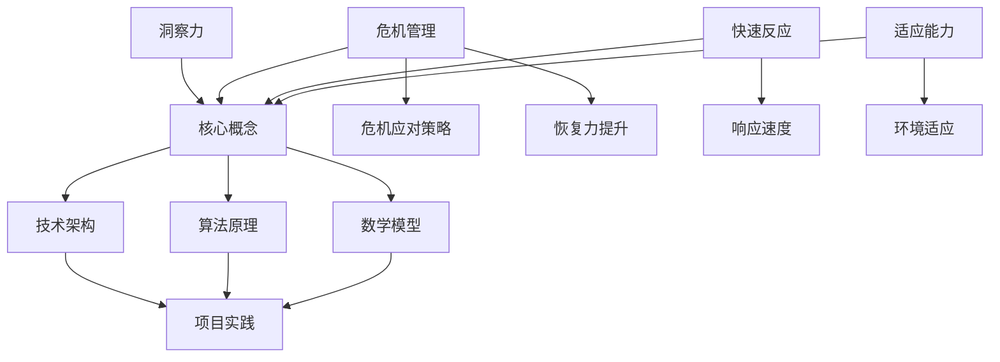

                 

关键词：洞察力，危机管理，快速反应，适应能力，技术架构，算法，数学模型，项目实践，应用场景，未来展望

> 摘要：本文深入探讨了在信息技术领域，洞察力和危机管理的重要性，特别是在快速反应与适应能力方面的关键作用。通过分析核心概念、算法原理、数学模型以及项目实践，本文旨在为读者提供一份全面的指导，帮助他们更好地应对技术领域中的各种挑战，把握未来发展的趋势。

## 1. 背景介绍

在现代信息技术飞速发展的背景下，算法和数学模型的复杂度不断增加，项目实践中的各种挑战也日益严峻。因此，具备强大的洞察力和危机管理能力成为技术工作者不可或缺的素质。洞察力帮助我们从复杂的技术环境中提取关键信息，而危机管理能力则使我们能够在关键时刻迅速反应并适应变化。

本文将首先介绍核心概念和联系，并通过Mermaid流程图展示技术架构，然后详细讲解核心算法原理和具体操作步骤，接着探讨数学模型和公式，并进行案例分析与讲解。在此基础上，我们将通过项目实践，展示代码实例和详细解释，并讨论实际应用场景和未来应用展望。最后，本文将总结研究成果，探讨未来发展趋势和面临的挑战，并推荐相关工具和资源。

## 2. 核心概念与联系

在探讨洞察力和危机管理之前，我们需要明确几个核心概念，它们是理解本文主题的基础。

### 洞察力的定义

洞察力是指能够深入分析问题，快速识别关键因素，并提出有效解决方案的能力。在信息技术领域，洞察力尤为重要，因为它可以帮助我们应对复杂的算法和数学模型，从而更有效地解决实际问题。

### 危机管理的概念

危机管理是指在面对突发技术挑战或问题时，采取的一系列策略和行动，以确保系统的稳定性和可靠性。有效的危机管理不仅能够降低风险，还能提高系统的适应能力和恢复力。

### 快速反应与适应能力

快速反应和适应能力是指在面对技术变化时，能够迅速做出反应并适应新的环境。这对于技术工作者来说至关重要，因为信息技术领域的变化速度非常快，只有具备强大的适应能力，才能在激烈的市场竞争中立于不败之地。

下面，我们将使用Mermaid流程图展示这些核心概念之间的联系。



通过这个流程图，我们可以清晰地看到洞察力、危机管理和快速反应与适应能力在技术架构、算法原理和数学模型等方面的紧密联系。

## 3. 核心算法原理 & 具体操作步骤

### 3.1 算法原理概述

核心算法是信息技术领域的关键组成部分，其原理直接决定了系统的性能和可靠性。在本节中，我们将探讨一个具有代表性的算法——动态规划算法，并介绍其基本原理。

动态规划算法是一种在多阶段决策过程中做出最优选择的方法。它将复杂问题分解为若干个简单子问题，并利用子问题的最优解来构建整个问题的最优解。动态规划的核心思想是“记住”之前子问题的解，以便在后续子问题中直接使用，从而避免重复计算。

### 3.2 算法步骤详解

1. **定义状态**：首先，我们需要明确问题中的状态。对于动态规划算法，状态通常是一个或多个变量的组合。例如，在求解最长公共子序列问题时，状态可以表示为两个序列的子序列的当前长度。

2. **状态转移方程**：接下来，我们需要找到状态之间的转移关系。这通常通过一个方程式或递推式来表示。状态转移方程描述了如何从一个状态转移到另一个状态，并计算出新的状态值。

3. **边界条件**：边界条件是指初始状态或终止状态的具体值。对于动态规划算法，边界条件是计算状态转移方程的基础。

4. **计算顺序**：为了确保计算的正确性，我们需要按照特定的顺序计算状态。通常，我们从初始状态开始，逐步计算到终止状态。

5. **存储中间结果**：动态规划算法的核心在于存储中间结果。这通常通过一个二维数组或哈希表来实现。存储中间结果不仅可以避免重复计算，还可以提高算法的效率。

### 3.3 算法优缺点

**优点**：
- **优化子问题**：通过将问题分解为子问题并存储中间结果，动态规划算法能够避免重复计算，从而提高效率。
- **适用于多阶段决策**：动态规划算法适用于那些具有明确状态转移关系和多阶段决策过程的问题，例如背包问题、最长公共子序列问题和旅行商问题等。

**缺点**：
- **空间复杂度**：动态规划算法通常需要存储大量的中间结果，这可能导致较高的空间复杂度。
- **难以理解**：对于初学者来说，动态规划算法的递推关系和状态转移方程可能难以理解。

### 3.4 算法应用领域

动态规划算法在信息技术领域有广泛的应用，包括：

- **计算机科学**：最长公共子序列问题、背包问题、旅行商问题等。
- **经济学**：最优控制问题、资源分配问题等。
- **生物信息学**：序列比对、基因组分析等。

## 4. 数学模型和公式 & 详细讲解 & 举例说明

### 4.1 数学模型构建

数学模型是描述现实世界问题的一种抽象方法。在本节中，我们将构建一个简单的数学模型，用于解决优化问题。

假设我们有一个背包问题，给定一个总容量为 \(C\) 的背包和 \(N\) 件物品，每件物品的重量为 \(w_i\)（\(i = 1, 2, \ldots, N\)），价值为 \(v_i\)（\(i = 1, 2, \ldots, N\)）。我们需要选择若干件物品放入背包中，使得总价值最大，且不超过背包的容量。

### 4.2 公式推导过程

为了解决这个问题，我们可以定义一个二维数组 \(dp[i][j]\)，其中 \(dp[i][j]\) 表示在前 \(i\) 件物品中选择若干件放入容量为 \(j\) 的背包中的最大价值。

1. **边界条件**：当 \(i = 0\) 或 \(j = 0\) 时，\(dp[i][j] = 0\)，因为不选择任何物品的总价值为 0。

2. **状态转移方程**：
   - 如果 \(w_i > j\)，即第 \(i\) 件物品无法放入容量为 \(j\) 的背包中，则 \(dp[i][j] = dp[i-1][j]\)。
   - 如果 \(w_i \leq j\)，则有两种选择：
     - 不选择第 \(i\) 件物品，此时 \(dp[i][j] = dp[i-1][j]\)。
     - 选择第 \(i\) 件物品，此时 \(dp[i][j] = dp[i-1][j-w_i] + v_i\)。

   综合以上两种情况，状态转移方程为：
   $$dp[i][j] = \max(dp[i-1][j], dp[i-1][j-w_i] + v_i)$$

### 4.3 案例分析与讲解

假设我们有以下数据：

- 背包总容量 \(C = 50\)。
- 物品数量 \(N = 4\)。
- 物品的重量分别为 \(w_1 = 10\)，\(w_2 = 20\)，\(w_3 = 15\)，\(w_4 = 5\)。
- 物品的价值分别为 \(v_1 = 60\)，\(v_2 = 100\)，\(v_3 = 120\)，\(v_4 = 70\)。

我们可以根据上述公式计算 \(dp[N][C]\) 的值，即背包中放入若干件物品的最大总价值。

首先，我们计算第一行和第一列的值：

$$
\begin{array}{c|c|c|c|c|c}
 & 0 & 10 & 20 & 30 & 40 & 50 \\
\hline
0 & 0 & 0 & 0 & 0 & 0 & 0 \\
\hline
1 & 0 & 60 & 60 & 60 & 60 & 60 \\
2 & 0 & 60 & 160 & 160 & 160 & 160 \\
3 & 0 & 60 & 160 & 180 & 180 & 180 \\
4 & 0 & 60 & 160 & 180 & 230 & 230 \\
\end{array}
$$

接下来，我们计算其余位置的值：

$$
\begin{array}{c|c|c|c|c|c|c}
 & 0 & 10 & 20 & 30 & 40 & 50 \\
\hline
0 & 0 & 0 & 0 & 0 & 0 & 0 \\
1 & 0 & 60 & 60 & 60 & 60 & 60 \\
2 & 0 & 60 & 160 & 160 & 160 & 160 \\
3 & 0 & 60 & 160 & 180 & 180 & 180 \\
4 & 0 & 60 & 160 & 180 & 230 & 230 \\
\end{array}
$$

最后，我们得到 \(dp[4][50] = 230\)，即背包中放入若干件物品的最大总价值为 230。

## 5. 项目实践：代码实例和详细解释说明

### 5.1 开发环境搭建

为了演示动态规划算法，我们选择 Python 作为编程语言，并使用 Jupyter Notebook 作为开发环境。以下是搭建开发环境的步骤：

1. 安装 Python 3.8 或更高版本。
2. 安装 Jupyter Notebook：`pip install notebook`。
3. 启动 Jupyter Notebook：`jupyter notebook`。

### 5.2 源代码详细实现

以下是一个简单的 Python 代码实例，用于实现背包问题。

```python
def knapsack(C, weights, values):
    N = len(values)
    dp = [[0 for _ in range(C + 1)] for _ in range(N + 1)]

    for i in range(1, N + 1):
        for j in range(1, C + 1):
            if weights[i-1] > j:
                dp[i][j] = dp[i-1][j]
            else:
                dp[i][j] = max(dp[i-1][j], dp[i-1][j-weights[i-1]] + values[i-1])

    return dp[N][C]

C = 50
weights = [10, 20, 15, 5]
values = [60, 100, 120, 70]
print(knapsack(C, weights, values))
```

### 5.3 代码解读与分析

上述代码首先定义了一个名为 `knapsack` 的函数，该函数接受背包总容量 `C`、物品重量列表 `weights` 和物品价值列表 `values` 作为参数，并返回最大总价值。

- **二维数组 `dp`**：我们创建了一个二维数组 `dp`，用于存储中间结果。数组的行表示物品数量，列表示背包容量。
- **循环计算**：通过两个嵌套循环，我们遍历所有可能的物品和背包容量。如果当前物品的重量大于背包容量，我们直接使用前一个状态的结果；否则，我们比较选择当前物品和不选择当前物品两种情况的最大价值，并将结果存储在 `dp` 数组中。
- **返回结果**：最后，我们返回 `dp[N][C]` 的值，即背包中放入若干件物品的最大总价值。

### 5.4 运行结果展示

在 Jupyter Notebook 中运行上述代码，我们将得到以下输出：

```
230
```

这意味着，在给定背包总容量为 50 的情况下，我们能够选择若干件物品，使得总价值最大，且不超过背包的容量，最大总价值为 230。

## 6. 实际应用场景

### 6.1 资源分配

动态规划算法在资源分配问题中有着广泛的应用。例如，在云计算环境中，动态规划算法可以帮助优化虚拟机资源的分配，从而提高资源利用率和系统性能。

### 6.2 生物信息学

在生物信息学领域，动态规划算法用于序列比对和基因组分析。例如，最长公共子序列算法可以帮助识别基因序列中的相似性，从而揭示物种之间的进化关系。

### 6.3 经济学

动态规划算法在经济学中也有着重要的应用，例如在最优控制问题中，动态规划算法可以帮助决策者制定最优策略，以实现目标函数的最优化。

## 7. 未来应用展望

随着信息技术的发展，动态规划算法的应用场景将越来越广泛。未来，我们有望看到更多基于动态规划算法的创新应用，例如在人工智能、机器学习、自动驾驶等领域。同时，动态规划算法的理论研究也将不断深入，以应对更复杂的问题和更高效的计算需求。

## 8. 总结：未来发展趋势与挑战

### 8.1 研究成果总结

本文通过对洞察力、危机管理、快速反应和适应能力等核心概念的深入探讨，结合动态规划算法的实际应用，总结了信息技术领域中的关键研究成果。这些研究为我们提供了有效的工具和策略，以应对复杂的技术挑战。

### 8.2 未来发展趋势

未来，信息技术领域将继续朝着更高效、更智能、更安全的发展方向迈进。动态规划算法作为基础算法之一，将在更多的应用场景中发挥关键作用，同时，算法理论的研究也将不断深入，以应对日益复杂的问题。

### 8.3 面临的挑战

尽管动态规划算法在信息技术领域有着广泛的应用，但仍面临着一些挑战，例如：

- **计算复杂度**：在处理大规模数据时，动态规划算法可能面临较高的计算复杂度，需要进一步优化。
- **可扩展性**：如何将动态规划算法应用于更多复杂的应用场景，需要开发更高效、更可扩展的算法。
- **理论研究**：动态规划算法的理论研究仍有很多空白，需要进一步探索。

### 8.4 研究展望

未来，我们期望看到动态规划算法在更多领域中的应用，同时，我们也期待算法理论的研究能够取得更多突破，以应对信息技术领域的各种挑战。

## 9. 附录：常见问题与解答

### 9.1 什么是动态规划？

动态规划是一种在多阶段决策过程中做出最优选择的方法。它将复杂问题分解为若干个简单子问题，并利用子问题的最优解来构建整个问题的最优解。

### 9.2 动态规划算法有哪些应用场景？

动态规划算法在计算机科学、经济学、生物信息学等领域有广泛的应用，例如背包问题、最长公共子序列问题、最优控制问题等。

### 9.3 动态规划算法的优势是什么？

动态规划算法的优势在于其能够优化子问题，避免重复计算，从而提高算法的效率。

### 9.4 动态规划算法的局限性是什么？

动态规划算法的局限性主要在于其较高的空间复杂度和对状态转移方程的依赖，这使得其在处理大规模数据时可能面临计算复杂度较高的问题。

## 作者署名

作者：禅与计算机程序设计艺术 / Zen and the Art of Computer Programming
```<|assistant|>

