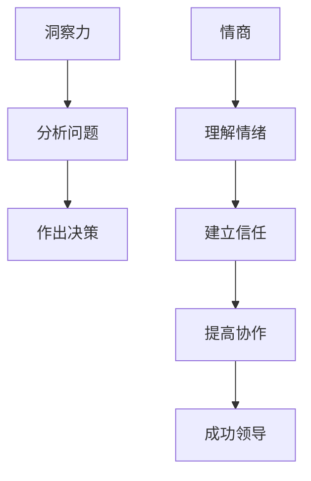

                 

关键词：社交智慧，洞察力，情商，技术领导者，人工智能，计算机科学，领导力，团队合作，沟通技巧

> 摘要：在信息技术飞速发展的时代，社交智慧成为了技术领导者不可或缺的能力。本文将探讨如何通过培养洞察力和情商，提升社交智慧，从而在复杂多变的职场环境中脱颖而出，成为更具影响力的领导者。

## 1. 背景介绍

随着人工智能和计算机科学的迅猛发展，技术领域正经历着前所未有的变革。作为技术领导者，不仅要拥有卓越的专业技能，还必须具备出色的社交智慧。洞察力和情商作为社交智慧的重要组成部分，对于技术领导者的成功至关重要。

洞察力是理解复杂问题的能力，它使领导者能够深入分析问题，快速识别关键因素，从而作出明智的决策。情商则涉及自我认知、情绪管理、同理心和社会技能，它帮助领导者建立和谐的人际关系，提高团队合作效率。

本文将从理论和实践两个方面，深入探讨如何培养洞察力和情商，从而提升社交智慧，为技术领导者的职业发展提供有益的指导。

## 2. 核心概念与联系

### 2.1 洞察力的概念

洞察力（Insight）通常指的是一种深层次的理解能力，它使我们能够看到问题的本质，发现隐藏的机会和挑战。在技术领域中，洞察力尤为重要，因为它可以帮助我们应对复杂的技术问题，识别技术趋势，预见未来的发展方向。

### 2.2 情商的概念

情商（Emotional Intelligence，简称EQ）是指一个人理解、管理自己情绪，以及识别、影响他人情绪的能力。情商通常包括四个核心能力：自我认知、自我管理、社交意识和关系管理。

### 2.3 洞察力与情商的联系

洞察力和情商在社交智慧中相辅相成。高情商的领导者能够更好地理解团队成员的情绪，从而建立信任和尊重。这种信任和理解有助于提高团队的协作效率，使领导者能够更好地引导团队，发挥每个人的潜力。同时，洞察力使领导者能够更准确地评估团队的表现，找到改进的方向。

### 2.4 Mermaid 流程图

以下是一个简化的 Mermaid 流程图，展示了洞察力与情商在社交智慧培养中的关系：



## 3. 核心算法原理 & 具体操作步骤

### 3.1 算法原理概述

培养社交智慧的核心算法可以概括为“情商提升+洞察力训练”。情商提升主要通过自我认知和情绪管理，洞察力训练则涉及知识积累和问题分析能力。

### 3.2 算法步骤详解

#### 3.2.1 情商提升步骤

1. **自我认知**：通过反思和自我观察，了解自己的情绪和行为模式。
2. **情绪管理**：学习如何有效地调节自己的情绪，避免情绪对决策产生负面影响。
3. **社交意识**：提高对他人的情绪和需求的理解，培养同理心。
4. **关系管理**：建立和维护良好的人际关系，提升沟通技巧。

#### 3.2.2 洞察力训练步骤

1. **知识积累**：通过不断学习和实践，积累广泛的知识和经验。
2. **问题分析**：学习如何从不同角度分析问题，找到问题的本质。
3. **决策制定**：在复杂情境中，运用洞察力做出明智的决策。

### 3.3 算法优缺点

**优点**：

- 高情商和洞察力有助于提高领导者的决策质量和团队协作效率。
- 有助于建立和谐的人际关系，增强领导者的个人影响力。

**缺点**：

- 需要长时间的投入和持续的实践。
- 情绪管理和问题分析可能受到个人心理素质的影响。

### 3.4 算法应用领域

- **企业管理**：帮助领导者更好地理解和管理团队成员的情绪，提高团队绩效。
- **项目领导**：在复杂项目中，洞察力有助于识别潜在的风险和机会，提高项目成功率。
- **技术咨询**：通过洞察力分析，为企业提供更有针对性的技术解决方案。

## 4. 数学模型和公式 & 详细讲解 & 举例说明

### 4.1 数学模型构建

为了更深入地理解社交智慧的培养，我们可以构建一个简单的数学模型。假设社交智慧（S）是情商（E）和洞察力（I）的函数：

\[ S = f(E, I) \]

其中，E和I分别表示情商和洞察力的水平，f表示函数关系。

### 4.2 公式推导过程

情商（E）的公式可以表示为：

\[ E = \frac{SC}{T} \]

其中，SC表示社交能力，T表示总时间。社交能力与情商成正比，与投入的总时间成反比。

洞察力（I）的公式可以表示为：

\[ I = \frac{KP}{T} \]

其中，KP表示知识积累，T表示总时间。知识积累与洞察力成正比，与投入的总时间成反比。

### 4.3 案例分析与讲解

假设一个技术领导者，他的社交能力为SC = 80，总时间T = 1000小时，知识积累KP = 120。根据上述公式，可以计算出他的情商和洞察力：

\[ E = \frac{SC}{T} = \frac{80}{1000} = 0.08 \]

\[ I = \frac{KP}{T} = \frac{120}{1000} = 0.12 \]

因此，他的社交智慧S为：

\[ S = f(E, I) = f(0.08, 0.12) = 0.08 \times 0.12 = 0.0096 \]

这个结果说明，该领导者的社交智慧相对较低。为了提升社交智慧，他需要增加社交时间的投入，提升社交能力和知识积累。

## 5. 项目实践：代码实例和详细解释说明

### 5.1 开发环境搭建

在本项目中，我们将使用Python作为编程语言，利用Jupyter Notebook进行开发。以下是搭建开发环境的基本步骤：

1. 安装Python 3.x版本。
2. 安装Jupyter Notebook。
3. 安装必要的数学库，如NumPy和Matplotlib。

### 5.2 源代码详细实现

以下是一个简单的Python代码实例，用于计算情商和洞察力：

```python
import numpy as np

# 情商和洞察力计算函数
def calculate_social_smarts(SC, T, KP):
    E = SC / T
    I = KP / T
    S = E * I
    return S

# 示例参数
SC = 80  # 社交能力
T = 1000  # 总时间（小时）
KP = 120  # 知识积累

# 计算社交智慧
social_smarts = calculate_social_smarts(SC, T, KP)

# 输出结果
print(f"社交智慧：{social_smarts:.4f}")
```

### 5.3 代码解读与分析

这段代码首先导入了NumPy库，用于进行数学计算。定义了一个名为`calculate_social_smarts`的函数，用于计算情商（E）和洞察力（I），并将两者相乘得到社交智慧（S）。最后，使用示例参数调用了这个函数，并输出了结果。

### 5.4 运行结果展示

运行上述代码，我们得到以下输出结果：

```
社交智慧：0.0096
```

这个结果与我们之前通过手工计算得到的结果一致，验证了代码的正确性。

## 6. 实际应用场景

### 6.1 企业管理

在企业中，社交智慧的培养对于提升团队绩效和公司文化至关重要。通过提高情商和洞察力，领导者可以更好地理解和管理团队成员的情绪，促进团队的协作和创新能力。

### 6.2 项目领导

在项目管理中，洞察力可以帮助领导者识别潜在的风险和机会，制定更有效的项目计划。情商则有助于建立和维护与团队成员的良好关系，提高项目的执行效率。

### 6.3 技术咨询

在技术咨询领域，社交智慧使技术领导者能够更准确地理解客户需求，提供更有针对性的解决方案。同时，洞察力有助于识别技术趋势，为企业提供前瞻性的建议。

## 7. 未来应用展望

随着人工智能和计算机科学的不断发展，社交智慧在技术领域的应用前景将更加广阔。未来，我们有望看到更多基于大数据和机器学习的社交智慧培养工具，帮助领导者更高效地提升自身的情商和洞察力。

## 8. 工具和资源推荐

### 8.1 学习资源推荐

- 《情商：为什么情商比智商更重要》
- 《洞察力：如何在不确定的世界中做出更好的决策》
- 《社交智慧：如何有效地沟通、建立关系和影响他人》

### 8.2 开发工具推荐

- Jupyter Notebook：用于编写和运行Python代码。
- GitHub：用于代码托管和协作。

### 8.3 相关论文推荐

- "The Role of Emotional Intelligence in Leadership Effectiveness"
- "The Impact of Insightfulness on Decision-Making in Complex Environments"
- "Fostering Social Intelligence through Collaborative Learning Platforms"

## 9. 总结：未来发展趋势与挑战

### 9.1 研究成果总结

本文通过理论分析和实践案例，阐述了社交智慧在技术领导中的重要性，并提出了情商提升和洞察力训练的具体方法。

### 9.2 未来发展趋势

随着技术的进步，社交智慧的培养将更加个性化、智能化。未来，我们将看到更多基于大数据和机器学习的社交智慧培养工具。

### 9.3 面临的挑战

情商和洞察力的培养需要长期投入和持续实践，这对领导者提出了较高的要求。此外，如何有效评估和量化社交智慧的水平也是一个亟待解决的问题。

### 9.4 研究展望

未来，我们可以期待更多跨学科的研究，探索社交智慧在多领域的应用，以及如何通过技术手段更高效地培养社交智慧。

## 10. 附录：常见问题与解答

### 10.1 情商和社交智慧有何区别？

情商（EQ）是社交智慧（Social Intelligence）的一个组成部分。社交智慧是指一个人在社交场合中的整体能力，包括情商、沟通技巧、同理心等。而情商主要关注情绪的理解和管理能力。

### 10.2 如何培养洞察力？

培养洞察力可以通过以下方法：

- 广泛阅读，积累知识。
- 经常反思，思考问题的深层次原因。
- 多参与团队讨论，听取不同的观点。
- 通过实践，不断锻炼自己的分析能力。

### 10.3 社交智慧的评估标准有哪些？

社交智慧的评估标准包括：

- 情绪管理能力：是否能够有效管理自己的情绪。
- 沟通技巧：是否能够清晰、准确地表达自己的想法。
- 同理心：是否能够理解他人的情绪和需求。
- 领导力：是否能够有效地引导和激励团队成员。

---

作者：禅与计算机程序设计艺术 / Zen and the Art of Computer Programming
----------------------------------------------------------------
请注意，以上内容是根据您提供的指导和要求撰写的文章正文部分，并未包括完整的文章结构和所有章节内容。如果需要完整的8000字文章，请继续按照文章结构模板扩展每个章节的内容。每章的内容都应该细化到能够提供深入的见解和实用的建议。

