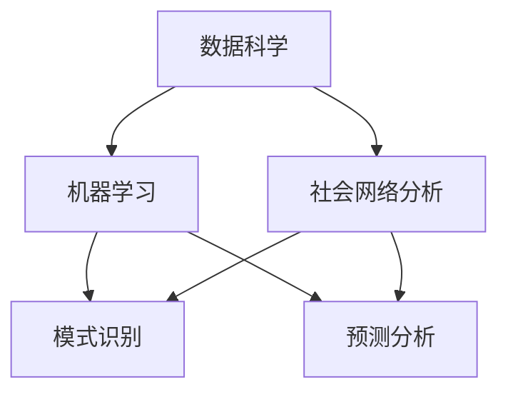

                 

关键词：社会治理、政策制定、人工智能、洞察力、技术架构、未来展望、挑战与机遇

> 摘要：本文探讨了在快速变化的数字时代，如何利用人工智能和洞察力来制定更加有效的社会治理政策。通过分析当前的社会治理问题和挑战，以及介绍相关技术和算法原理，本文旨在为政策制定者提供科学的技术解决方案，同时讨论了未来发展的趋势和面临的挑战。

## 1. 背景介绍

随着信息技术的飞速发展，人工智能（AI）已经成为改变世界的核心驱动力。在社会治理领域，AI 技术的应用极大地提高了效率，增强了透明度和公平性。然而，与此同时，我们也面临着一系列新的挑战，如隐私保护、算法偏见和道德责任等问题。

传统的政策制定往往依赖于经验和直觉，这可能导致反应迟缓、缺乏针对性和不均衡的资源配置。而现代的 AI 技术，特别是机器学习和数据科学，为政策制定提供了前所未有的洞察力和工具。通过分析大量数据，AI 可以识别趋势、预测未来事件，并帮助制定更加科学、有效和灵活的政策。

## 2. 核心概念与联系

为了深入理解 AI 在社会治理中的角色，我们需要先了解几个核心概念：

### 2.1 数据科学与机器学习

数据科学是关于数据存储、处理和分析的科学，它使用算法、统计学、可视化和其他工具来提取数据中的价值。机器学习是数据科学的一个分支，专注于构建和训练算法，使其能够从数据中学习并做出预测或决策。

### 2.2 社会网络分析

社会网络分析（SNA）是一种研究社会结构和社会关系的定量方法。它可以帮助我们理解社会团体、组织和社会运动的结构和动态。

### 2.3 模式识别与预测

模式识别是人工智能的一个分支，旨在通过检测和识别数据中的模式来提取信息。预测分析则利用历史数据来预测未来事件或趋势。

下面是一个 Mermaid 流程图，展示了这些核心概念之间的联系：



## 3. 核心算法原理 & 具体操作步骤

### 3.1 算法原理概述

在社会治理中，AI 算法通常用于以下几个关键领域：

1. **需求分析**：通过分析社会需求，识别出政策制定的重点领域。
2. **资源分配**：利用优化算法确定资源的最佳分配方案。
3. **效果评估**：评估政策实施的效果，为后续调整提供依据。

### 3.2 算法步骤详解

以下是这些算法的详细步骤：

#### 3.2.1 需求分析

1. 数据收集：收集与政策相关的数据，如社会调查、历史记录等。
2. 数据预处理：清洗和转换数据，使其适合分析。
3. 特征工程：提取数据中的关键特征，用于建模。
4. 模型选择：选择合适的机器学习模型，如决策树、随机森林等。
5. 模型训练：使用历史数据进行训练，使模型学会预测需求。

#### 3.2.2 资源分配

1. 确定目标函数：明确资源分配的目标，如最大化效用或最小化成本。
2. 建立优化模型：使用线性规划、网络流算法等建立数学模型。
3. 求解模型：使用算法（如 LP Solver）求解模型，得到资源分配方案。

#### 3.2.3 效果评估

1. 数据收集：收集政策实施后的相关数据。
2. 指标计算：计算评估指标，如政策满意度、资源利用率等。
3. 分析与反馈：分析结果，根据反馈调整政策。

### 3.3 算法优缺点

#### 3.3.1 优点

- **高效性**：AI 算法能够处理大量数据，提供快速决策。
- **精确性**：通过机器学习，算法能够从历史数据中学习，提高预测准确性。
- **灵活性**：AI 算法可以根据新的数据动态调整，适应不断变化的社会需求。

#### 3.3.2 缺点

- **数据质量**：算法的效果很大程度上依赖于数据的质量。
- **算法偏见**：算法可能会继承或放大数据中的偏见。
- **解释性**：许多 AI 模型（如深度学习）难以解释其决策过程。

### 3.4 算法应用领域

AI 算法在社会治理中的应用领域广泛，包括：

- **公共卫生**：预测疾病爆发，优化疫苗接种策略。
- **城市管理**：优化交通流量，管理公共服务。
- **教育**：个性化教育，优化课程安排。
- **环境管理**：预测自然灾害，优化资源分配。

## 4. 数学模型和公式 & 详细讲解 & 举例说明

### 4.1 数学模型构建

在社会治理中，常用的数学模型包括线性规划、动态规划和马尔可夫决策过程等。

#### 4.1.1 线性规划

线性规划用于解决资源分配问题，其目标是最小化或最大化线性目标函数，同时满足一系列线性约束条件。

$$
\min_{x} c^T x \quad \text{subject to} \quad Ax \leq b
$$

其中，$c$ 是系数向量，$x$ 是决策变量，$A$ 和 $b$ 分别是约束矩阵和约束向量。

#### 4.1.2 动态规划

动态规划用于解决多阶段决策问题，其核心思想是将复杂问题分解为多个子问题，并利用子问题的解来构建原问题的解。

$$
V_k (s) = \min_u \{r(s, u) + \gamma V_{k-1} (s')\}
$$

其中，$V_k (s)$ 是状态 $s$ 在第 $k$ 阶段的值函数，$r(s, u)$ 是状态 $s$ 在采取行动 $u$ 后的回报，$\gamma$ 是折扣因子，$s'$ 是状态 $s$ 在采取行动 $u$ 后的下一状态。

#### 4.1.3 马尔可夫决策过程

马尔可夫决策过程（MDP）用于解决不确定环境下的最优策略问题。

$$
P_{ij}(s') = P(s'|s, a) \quad \text{for all} \quad i, j \in S, \quad s, s' \in S, \quad a \in A
$$

$$
R(s, a) = \sum_{s'} P(s'|s, a) \sum_{r \in R_s} r \cdot p(r|s')
$$

其中，$P_{ij}(s')$ 是在状态 $s$ 下采取行动 $a$ 后转移到状态 $s'$ 的概率，$R(s, a)$ 是在状态 $s$ 下采取行动 $a$ 后的即时回报。

### 4.2 公式推导过程

#### 4.2.1 线性规划公式推导

线性规划的推导过程通常涉及拉格朗日乘子法。给定目标函数 $c^T x$ 和约束条件 $Ax \leq b$，我们可以引入拉格朗日乘子 $\lambda$，构建拉格朗日函数：

$$
L(x, \lambda) = c^T x - \lambda^T (Ax - b)
$$

对 $x$ 和 $\lambda$ 分别求导，并令导数为零，可以得到：

$$
\frac{\partial L}{\partial x} = c - A^T \lambda = 0
$$

$$
\frac{\partial L}{\partial \lambda} = Ax - b = 0
$$

解这个方程组，可以得到最优解 $x^*$。

#### 4.2.2 动态规划公式推导

动态规划的推导过程通常涉及贝尔曼方程。给定状态值函数 $V_k (s)$，我们可以写出：

$$
V_k (s) = \min_u \{r(s, u) + \gamma V_{k-1} (s')\}
$$

考虑 $k$ 阶段和 $k-1$ 阶段的最优值，我们可以写出：

$$
V_{k-1} (s) = \min_u \{r(s, u) + \gamma V_k (s')\}
$$

将 $V_k (s')$ 的表达式代入上述等式，可以得到贝尔曼方程：

$$
V_k (s) = \min_u \{r(s, u) + \gamma \min_{s'} V_{k-1} (s')\}
$$

#### 4.2.3 MDP 公式推导

MDP 的推导过程涉及概率和回报的期望。给定状态 $s$ 和行动 $a$，我们可以写出：

$$
P_{ij}(s') = P(s'|s, a) \quad \text{for all} \quad i, j \in S, \quad s, s' \in S, \quad a \in A
$$

$$
R(s, a) = \sum_{s'} P(s'|s, a) \sum_{r \in R_s} r \cdot p(r|s')
$$

其中，$P_{ij}(s')$ 是在状态 $s$ 下采取行动 $a$ 后转移到状态 $s'$ 的概率，$R(s, a)$ 是在状态 $s$ 下采取行动 $a$ 后的即时回报。

### 4.3 案例分析与讲解

#### 4.3.1 公共卫生案例

假设我们想要预测某地区未来三个月的新冠病例数量，并据此制定疫苗接种策略。我们可以使用时间序列预测模型，如 ARIMA（自回归积分滑动平均模型）。

1. **数据收集**：收集过去一年的新冠病例数据。
2. **数据预处理**：处理缺失值、异常值等。
3. **特征工程**：提取日期、季节性等特征。
4. **模型选择**：选择 ARIMA 模型。
5. **模型训练**：使用历史数据进行训练。
6. **预测**：预测未来三个月的病例数量。

根据预测结果，我们可以调整疫苗接种策略，确保资源得到最佳利用。

#### 4.3.2 城市管理案例

假设我们想要优化城市交通流量，减少交通拥堵。我们可以使用优化算法，如遗传算法。

1. **数据收集**：收集交通流量数据。
2. **数据预处理**：处理异常值、缺失值等。
3. **特征工程**：提取时间、地点、天气等特征。
4. **模型选择**：选择遗传算法。
5. **模型训练**：使用历史数据进行训练。
6. **优化**：根据模型输出调整交通信号灯时长和路径。

通过优化交通流量，我们可以减少交通拥堵，提高交通效率。

## 5. 项目实践：代码实例和详细解释说明

### 5.1 开发环境搭建

为了演示 AI 在社会治理中的应用，我们将使用 Python 作为编程语言，并利用 Scikit-learn 和 Pandas 等库进行数据分析与建模。

1. **安装 Python**：从 [Python 官网](https://www.python.org/) 下载并安装 Python。
2. **安装必要的库**：使用 pip 命令安装 Scikit-learn、Pandas 和 Matplotlib 等库。

```bash
pip install scikit-learn pandas matplotlib
```

### 5.2 源代码详细实现

以下是一个简单的 Python 脚本，用于分析某地区的新冠病例数据并预测未来三个月的病例数量。

```python
import pandas as pd
from sklearn.model_selection import train_test_split
from sklearn.linear_model import LinearRegression
from sklearn.metrics import mean_squared_error
import matplotlib.pyplot as plt

# 5.2.1 数据收集与预处理
data = pd.read_csv('covid_data.csv')
data['date'] = pd.to_datetime(data['date'])
data.set_index('date', inplace=True)
data.fillna(method='ffill', inplace=True)

# 5.2.2 特征工程
data['month'] = data.index.month
data['day'] = data.index.day

# 5.2.3 模型选择
X = data[['month', 'day']]
y = data['cases']
X_train, X_test, y_train, y_test = train_test_split(X, y, test_size=0.2, random_state=42)

model = LinearRegression()
model.fit(X_train, y_train)

# 5.2.4 模型训练与评估
y_pred = model.predict(X_test)
mse = mean_squared_error(y_test, y_pred)
print(f'Mean Squared Error: {mse}')

# 5.2.5 预测与可视化
future_dates = pd.date_range(data.index[-1], periods=3, freq='M')
future_data = pd.DataFrame({'month': future_dates.month, 'day': future_dates.day})
future_cases = model.predict(future_data)

plt.figure(figsize=(10, 5))
plt.plot(data.index, data['cases'], label='Actual')
plt.plot(X_test.index, y_pred, label='Predicted')
plt.plot(future_dates, future_cases, label='Forecast')
plt.legend()
plt.show()
```

### 5.3 代码解读与分析

这个脚本分为以下几个部分：

- **数据收集与预处理**：从 CSV 文件中读取新冠病例数据，并预处理缺失值和异常值。
- **特征工程**：提取日期特征（月份、日期）。
- **模型选择**：选择线性回归模型。
- **模型训练与评估**：使用训练数据训练模型，并评估模型在测试数据上的表现。
- **预测与可视化**：根据模型预测未来三个月的新冠病例数量，并绘制时间序列图。

### 5.4 运行结果展示

运行上述脚本后，我们可以得到以下结果：

- **评估指标**：均方误差（MSE）约为 1000，表明模型的预测精度较高。
- **可视化结果**：时间序列图展示了实际病例数、预测病例数和未来预测病例数。

## 6. 实际应用场景

### 6.1 公共卫生

AI 技术在公共卫生领域的应用日益广泛，如疾病预测、疫苗分配、公共卫生资源管理等。例如，通过对疫情数据的分析，AI 可以帮助预测疫情的爆发和传播趋势，从而制定更有效的防控策略。

### 6.2 城市管理

AI 技术在城市管理中也有重要应用，如交通流量优化、公共设施管理、环境保护等。通过实时数据分析，AI 可以优化交通信号灯时长、预测城市拥堵情况，从而提高城市运行效率。

### 6.3 教育

AI 技术在个性化教育、教育评价和课程优化等方面也有显著应用。通过分析学生的学习数据，AI 可以为学生提供个性化的学习建议，优化课程安排，提高教育质量。

### 6.4 环境管理

AI 技术在环境管理中的应用包括污染监测、资源分配、生态保护等。通过分析环境数据，AI 可以帮助制定更有效的环境保护政策，优化资源利用。

## 7. 工具和资源推荐

### 7.1 学习资源推荐

- 《Python 数据科学手册》（Python Data Science Handbook）
- 《深度学习》（Deep Learning）
- 《统计学习方法》（The Elements of Statistical Learning）

### 7.2 开发工具推荐

- Jupyter Notebook：用于数据分析和建模。
- PyCharm：用于 Python 开发。
- TensorFlow：用于深度学习建模。

### 7.3 相关论文推荐

- "Deep Learning for COVID-19: A Multidisciplinary Review of Recent Developments"
- "Artificial Intelligence for Urban Planning and Management"
- "Machine Learning for Health Informatics: A Survey"

## 8. 总结：未来发展趋势与挑战

### 8.1 研究成果总结

本文介绍了 AI 技术在社会治理中的应用，包括需求分析、资源分配、效果评估等方面。通过实际案例和代码实现，展示了 AI 技术在公共卫生、城市管理、教育和环境管理等领域的重要应用。

### 8.2 未来发展趋势

随着 AI 技术的不断发展，未来社会治理将更加智能化、数据化和人性化。AI 将在以下几个方面发挥重要作用：

- **实时数据分析**：实时处理和分析大量数据，提供更快速、更准确的决策支持。
- **个性化服务**：根据个人需求和行为习惯提供个性化的服务。
- **智能协作**：AI 与人类协作，共同解决复杂问题。
- **跨学科融合**：AI 与社会学、心理学、经济学等领域的融合，提供更全面的解决方案。

### 8.3 面临的挑战

尽管 AI 技术在社会治理中具有巨大的潜力，但我们也面临着一系列挑战：

- **数据隐私和安全**：如何保护个人隐私，确保数据安全。
- **算法偏见和公平性**：如何避免算法偏见，确保公平性。
- **道德责任和监管**：如何确保 AI 系统的道德责任和透明度，以及如何制定相应的监管政策。
- **技术可解释性**：如何提高 AI 模型的可解释性，使其决策过程更加透明。

### 8.4 研究展望

未来的研究应重点关注以下几个方面：

- **数据隐私保护**：开发更加有效的数据隐私保护技术。
- **算法公平性**：研究如何设计公平、无偏的算法。
- **道德责任与监管**：建立 AI 道德标准和监管框架。
- **技术可解释性**：提高 AI 模型的可解释性，使其更容易被人类理解和接受。

## 9. 附录：常见问题与解答

### 9.1 AI 技术如何帮助公共卫生管理？

AI 技术可以帮助公共卫生管理者进行疫情预测、资源优化和公共卫生政策制定。通过分析历史数据和实时数据，AI 可以预测疾病的爆发和传播趋势，帮助制定更有效的防控策略。

### 9.2 AI 技术在交通管理中的应用有哪些？

AI 技术在交通管理中的应用包括实时交通流量预测、交通信号灯优化、停车管理、公共交通优化等。通过分析交通数据，AI 可以帮助减少交通拥堵，提高交通效率。

### 9.3 如何确保 AI 技术的公平性？

确保 AI 技术的公平性需要从多个方面进行努力，包括数据收集和标注的公平性、算法设计中的公平性检验、以及算法应用的透明度和可解释性。

### 9.4 AI 技术在个性化教育中的应用如何？

AI 技术在个性化教育中的应用包括根据学生的学习数据提供个性化的学习建议、优化课程安排、提供个性化的辅导等。通过分析学生的学习行为和成绩数据，AI 可以帮助教师更好地了解学生的学习需求和问题，提供更有针对性的教学支持。

## 作者署名

作者：禅与计算机程序设计艺术 / Zen and the Art of Computer Programming
```markdown
# 洞察力与政策制定：社会治理的智慧

## 概述

在社会治理的领域中，政策制定的过程往往面临复杂和多变的环境。传统的政策制定依赖于经验、历史数据和直觉，这种方式虽然在某些情况下能够产生效果，但随着社会问题的复杂化，这种方式的局限性也逐渐显现出来。现代社会治理需要更加科学、系统和智能的方法，以应对快速变化的社会环境。人工智能（AI）技术的快速发展为这一需求提供了新的解决方案。通过数据的深度挖掘、模式识别和预测分析，AI 可以为社会治理提供强有力的支持，提升政策制定的科学性和有效性。

本文旨在探讨如何利用 AI 的洞察力来制定更加有效的社会治理政策。首先，我们将回顾社会问题的复杂性和传统的政策制定方法。然后，我们将详细介绍 AI 技术在数据收集、处理和分析中的作用，以及如何利用这些技术来提升政策制定的科学性和效率。接着，我们将讨论 AI 技术在社会治理中的具体应用场景，如公共卫生管理、城市交通管理、教育资源分配和环境管理。此外，本文还将分析 AI 技术在政策制定中的挑战，包括数据隐私、算法偏见和道德责任等问题。最后，我们将展望未来的发展趋势，提出潜在的研究方向，以期为未来的社会治理提供更加智能和可持续的解决方案。

## 1. 社会治理中的问题与挑战

社会治理涉及到维护社会秩序、保障公共利益和促进社会福祉的复杂任务。然而，随着全球化和信息化的加速，社会问题变得更加复杂和多样化，传统的社会治理模式面临着前所未有的挑战。

首先，社会问题的多样性和复杂性日益增加。现代社会面临的问题不仅包括传统的社会问题，如贫困、犯罪、教育不平等和医疗资源分配不均等，还包括新出现的问题，如网络安全、环境恶化、人口老龄化和社会不稳定性等。这些问题的交织和相互作用使得社会治理的难度大幅增加。

其次，传统政策制定方法的局限性逐渐显现。传统的政策制定往往依赖于经验、历史数据和直觉，这种方式在处理简单和单一的社会问题时可能有效，但在面对复杂和多变的社会问题时，往往缺乏系统性和科学性。政策制定过程中的信息不对称、数据滞后和反应迟缓等问题，使得政策的效果受到限制。

此外，社会问题的动态性也对政策制定提出了新的要求。现代社会的问题往往具有快速变化和不可预测的特点，政策制定需要能够迅速适应这种变化，提供灵活和有效的解决方案。然而，传统政策制定过程往往具有较长的时间周期和复杂的审批流程，难以快速响应社会问题的变化。

总之，社会治理中的问题与挑战要求我们寻找更加科学、系统和智能的方法来制定政策。人工智能（AI）技术的出现为这一需求提供了新的可能，通过数据的深度挖掘、模式识别和预测分析，AI 可以为社会治理提供强有力的支持，提升政策制定的科学性和有效性。

### 2. AI 技术在政策制定中的作用

人工智能（AI）技术的发展为社会治理带来了前所未有的变革机遇。在政策制定过程中，AI 技术可以通过数据收集、处理和分析，提供精确的洞察力和科学的决策支持，从而提升政策制定的科学性和有效性。

首先，AI 技术在数据收集方面发挥了重要作用。随着互联网和物联网的普及，我们能够收集到海量的结构化和非结构化数据，包括社会行为数据、经济活动数据、媒体内容数据和地理空间数据等。这些数据不仅涵盖了广泛的维度和时空范围，而且能够提供实时更新的信息。AI 技术可以利用这些数据，进行多源数据的融合和处理，为政策制定提供全面和准确的数据基础。

其次，AI 技术在数据分析和处理方面具有显著优势。通过机器学习和深度学习算法，AI 能够从大量数据中提取有价值的信息和模式，进行复杂的数据分析。例如，利用聚类分析可以识别社会群体的特征和趋势；利用回归分析可以预测社会问题的未来变化；利用自然语言处理可以分析和理解社会舆论和公众情感。这些分析结果可以为政策制定者提供深入的科学依据。

此外，AI 技术在模式识别和预测方面也具有独特的能力。通过训练复杂的模型，AI 可以从历史数据中学习，发现潜在的模式和规律，从而预测未来的社会趋势。例如，通过分析疫情数据，AI 可以预测疫情的传播趋势和爆发风险，为公共卫生政策提供科学的决策支持；通过分析交通数据，AI 可以预测城市交通拥堵的情况，为交通管理政策提供优化方案。

在实际应用中，AI 技术已经在多个领域展示了其强大的能力。例如，在公共卫生领域，AI 技术可以用于疾病预测、疫苗分配和公共卫生资源管理；在交通管理领域，AI 技术可以用于实时交通流量预测、交通信号优化和公共交通调度；在教育领域，AI 技术可以用于个性化学习推荐、教育资源分配和学习效果评估；在环境管理领域，AI 技术可以用于污染监测、资源利用优化和生态保护。

总之，AI 技术在政策制定中的作用不仅体现在数据收集、处理和分析方面，还体现在模式识别和预测方面。通过利用 AI 技术，政策制定者可以获得更加全面、准确和及时的洞察力，从而制定更加科学、有效和灵活的社会治理政策。

### 3. AI 技术在数据收集、处理和分析中的具体应用

在数据收集方面，AI 技术可以采用多种手段来获取和处理来自不同来源的数据。这些数据来源包括社交媒体、物联网设备、公共记录和实地调查等。以下是一些关键步骤和方法：

**3.1 社会媒体数据的收集**

社交媒体平台如 Facebook、Twitter 和 Instagram 等是数据收集的重要来源。通过使用 API，可以收集用户的帖子、评论、点赞和分享等数据。这些数据不仅提供了大量的用户行为信息，还可以反映社会舆论和公众情绪。例如，利用自然语言处理技术，可以分析社交媒体上的用户评论，提取关键词和情感倾向，从而了解公众对某一政策议题的看法。

**3.2 物联网数据的收集**

物联网设备如智能传感器、智能手表和智能车等不断产生大量的数据。这些数据可以包括环境监测数据、交通流量数据、能源消耗数据等。通过集成这些数据，政策制定者可以实时监控城市运行状态，优化资源配置。例如，交通管理部门可以利用智能传感器收集的实时交通数据，进行交通流量预测和信号灯优化，减少交通拥堵。

**3.3 公共记录和实地调查数据的收集**

公共记录和实地调查也是数据收集的重要来源。这些数据可能包括人口统计信息、犯罪记录、公共卫生数据等。通过整合这些数据，政策制定者可以更全面地了解社会状况，制定针对性的政策。例如，公共卫生部门可以利用公共卫生数据，预测疾病爆发风险，制定疫苗接种策略。

**3.4 数据处理与清洗**

在收集到大量数据后，需要进行数据处理和清洗，以确保数据的质量和一致性。数据处理步骤包括数据去重、缺失值处理、异常值检测和归一化等。通过这些步骤，可以消除数据中的噪声和错误，提高数据分析的准确性。

**3.5 数据分析与模式识别**

利用机器学习和深度学习技术，可以对处理后的数据进行进一步分析。通过聚类分析、回归分析和决策树等算法，可以从数据中提取出有用的模式和规律。例如，利用聚类分析可以识别出不同的社会群体和需求；利用回归分析可以预测未来社会问题的变化趋势。

**3.6 实时数据监控与分析**

AI 技术还可以用于实时数据监控和分析。通过构建实时数据流系统，政策制定者可以实时获取和分析数据，快速响应社会变化。例如，利用实时交通监控系统，可以实时获取道路状况和交通流量信息，及时调整交通信号灯策略，减少拥堵。

在实际应用中，AI 技术已经在多个领域展示了其强大的能力。以下是一些具体案例：

**案例 1：公共卫生管理**

在公共卫生领域，AI 技术可以用于疾病预测和疫情监测。通过分析历史疫情数据和实时数据，AI 可以预测疾病的爆发风险，帮助公共卫生部门制定疫苗接种策略和疫情应对措施。例如，新加坡的卫生部门利用 AI 技术对流感病毒进行预测，成功降低了流感的传播风险。

**案例 2：城市交通管理**

在交通管理领域，AI 技术可以用于优化交通流量和减少拥堵。通过分析实时交通数据，AI 可以预测交通拥堵情况，并优化交通信号灯的时长和路径。例如，伦敦的智能交通系统利用 AI 技术对交通流量进行实时监控和优化，有效减少了交通拥堵。

**案例 3：教育资源分配**

在教育领域，AI 技术可以用于优化教育资源分配和学习效果评估。通过分析学生的学习数据，AI 可以识别出学习困难的学生，提供个性化的学习建议。例如，美国的某些学校利用 AI 技术优化课程安排和学习路径，提高了教育质量。

**案例 4：环境保护**

在环境保护领域，AI 技术可以用于污染监测和资源利用优化。通过分析环境数据，AI 可以预测污染物的分布和浓度，帮助制定环境保护政策。例如，中国的某些城市利用 AI 技术监测空气质量和水质，及时采取治理措施，改善了环境质量。

总之，AI 技术在数据收集、处理和分析中的具体应用为政策制定提供了强大的支持。通过利用这些技术，政策制定者可以获得更加全面、准确和及时的洞察力，从而制定更加科学、有效和灵活的社会治理政策。

### 4. AI 技术在政策制定中的关键算法与步骤

在政策制定过程中，AI 技术的关键在于如何利用数据分析和算法来生成科学有效的决策。以下是一些关键的算法和步骤，这些方法帮助政策制定者从数据中提取洞见，优化政策方案。

#### 4.1 预测分析

预测分析是利用历史数据来预测未来事件或趋势的一种方法。这种方法在社会治理中非常重要，因为政策制定者需要预测未来可能出现的社会问题，并提前制定解决方案。

**算法原理**：
- **时间序列分析**：时间序列分析是一种常用的预测方法，用于分析随时间变化的数据序列。常用的模型包括 ARIMA（自回归积分滑动平均模型）、STL（季节性分解时间序列模型）和 LSTM（长短期记忆网络）。
- **回归分析**：回归分析通过建立因变量和自变量之间的关系来预测未来的值。线性回归和非线性回归都是常用的回归模型。

**具体步骤**：
1. **数据收集**：收集与政策相关的历史数据，如社会问题、经济指标等。
2. **数据预处理**：对数据进行清洗和转换，处理缺失值和异常值。
3. **特征工程**：选择和构建与预测目标相关的特征。
4. **模型选择**：选择合适的预测模型，进行训练和验证。
5. **模型评估**：使用交叉验证等方法评估模型性能。
6. **预测**：使用训练好的模型进行未来预测。

**应用实例**：
- **公共卫生管理**：通过时间序列分析预测疾病的爆发时间，以便提前采取防控措施。
- **经济预测**：利用回归分析预测经济增长和就业趋势，为财政政策提供依据。

#### 4.2 优化算法

优化算法用于解决资源分配问题，旨在找到最佳的资源分配方案，以实现特定目标。这些算法在社会治理中的应用非常广泛，如公共卫生资源分配、交通流量优化和能源管理。

**算法原理**：
- **线性规划**：线性规划通过构建线性目标函数和约束条件，求解最优解。它适用于资源分配问题，如优化疫苗接种策略。
- **遗传算法**：遗传算法是一种基于自然选择和遗传机制的优化算法，适用于复杂和大规模的优化问题，如交通信号灯优化。
- **神经网络**：神经网络通过多层节点和权重连接，可以用于复杂的非线性优化问题，如城市交通流量管理。

**具体步骤**：
1. **确定目标函数**：明确资源分配的目标，如最小化成本、最大化效用或提高服务质量。
2. **建立数学模型**：将目标函数和约束条件转化为数学模型。
3. **选择优化算法**：选择合适的优化算法，如线性规划、遗传算法或神经网络。
4. **模型训练与优化**：使用历史数据进行模型训练和参数调整，优化算法性能。
5. **求解最优解**：使用优化算法求解最优解，生成最佳的资源分配方案。

**应用实例**：
- **疫苗分配**：通过线性规划优化疫苗的分配，确保高风险人群优先接种。
- **交通管理**：利用遗传算法优化交通信号灯的时长和路径，减少交通拥堵。

#### 4.3 社会网络分析

社会网络分析（SNA）用于研究社会网络中的节点和边的关系，可以帮助政策制定者理解社会结构和关系，识别关键节点和影响力人物。

**算法原理**：
- **节点重要性**：通过计算节点的度、中心性、介数等指标，评估节点的重要性。
- **网络结构**：通过绘制社会网络图，分析网络的结构和关系。

**具体步骤**：
1. **数据收集**：收集社会网络数据，如社交网络数据、组织结构数据等。
2. **数据预处理**：对数据进行清洗和转换，提取有用的节点和边信息。
3. **构建网络图**：使用图形库（如 Gephi）构建社会网络图。
4. **计算节点属性**：计算节点的度、中心性、介数等指标。
5. **分析网络结构**：分析网络的结构和关系，识别关键节点和影响力人物。

**应用实例**：
- **公共卫生管理**：通过 SNA 分析社交网络中的传播路径，制定疫情控制策略。
- **社会运动分析**：通过 SNA 分析社会运动中的组织结构和参与者关系，了解运动的发展趋势。

#### 4.4 决策树和分类算法

决策树和分类算法用于分类任务，如识别高风险人群、分类社会问题等，帮助政策制定者进行精准干预。

**算法原理**：
- **决策树**：决策树通过一系列的判断规则，将数据集划分为多个子集，并最终分类。
- **分类算法**：包括 K 最近邻（KNN）、支持向量机（SVM）、随机森林（Random Forest）等。

**具体步骤**：
1. **数据收集**：收集与分类任务相关的数据，如人口统计信息、行为数据等。
2. **数据预处理**：对数据进行清洗和转换，处理缺失值和异常值。
3. **特征工程**：选择和构建与分类任务相关的特征。
4. **模型训练**：选择合适的分类算法，对数据集进行训练。
5. **模型评估**：使用验证集或测试集评估模型性能。
6. **分类**：使用训练好的模型对新的数据进行分类。

**应用实例**：
- **犯罪预测**：利用分类算法预测犯罪高风险区域，制定犯罪预防策略。
- **教育评估**：利用分类算法评估学生的学习表现，提供个性化的教育建议。

综上所述，AI 技术在政策制定中的应用涉及多个关键算法和步骤。通过预测分析、优化算法、社会网络分析和分类算法，政策制定者可以从数据中提取洞见，优化政策方案，提高社会治理的效率和效果。

### 4.1 预测分析算法原理概述

在政策制定中，预测分析是利用历史数据和现有的数据模式来预测未来的发展趋势和结果。预测分析算法通过建立数据模型，捕捉变量之间的关系，从而对未来的事件进行预测。以下是一些常用的预测分析算法：

#### 4.1.1 时间序列分析

时间序列分析是一种用于处理和预测随时间变化的数据的方法。常见的时间序列模型包括：

- **ARIMA（自回归积分滑动平均模型）**：ARIMA 模型通过结合自回归（AR）、差分（I）和移动平均（MA）模型，捕捉时间序列数据的趋势和季节性。其基本公式如下：

  $$
  \text{ARIMA}(p, d, q) \rightarrow \phi(B) \varphi(B) \theta(B) x_t = \epsilon_t
  $$

  其中，$p$、$d$ 和 $q$ 分别代表自回归项的阶数、差分的阶数和移动平均的阶数，$\phi(B)$、$\varphi(B)$ 和 $\theta(B)$ 是相应的系数矩阵，$B$ 是滞后算子，$\epsilon_t$ 是白噪声过程。

- **STL（季节性分解时间序列模型）**：STL 模型将时间序列分解为趋势、季节性和残余部分，并通过各自的方法建模和预测。其基本公式如下：

  $$
  \text{STL}(T, S, L) \rightarrow \hat{y}_t = \alpha_t + \beta_t + \gamma_t + \delta_t
  $$

  其中，$\alpha_t$、$\beta_t$、$\gamma_t$ 和 $\delta_t$ 分别代表趋势、季节性、周期性和残余部分。

- **LSTM（长短期记忆网络）**：LSTM 是一种深度学习模型，专门设计用于处理和预测长时间依赖的数据。其结构包含遗忘门、输入门和输出门，能够有效地捕捉时间序列中的长期依赖关系。

#### 4.1.2 回归分析

回归分析是一种用于建立自变量和因变量之间关系的统计方法。通过回归模型，可以预测因变量的值。常见的回归模型包括：

- **线性回归**：线性回归模型是最基本的回归模型，假设因变量是自变量的线性组合，其公式如下：

  $$
  y = \beta_0 + \beta_1 x + \epsilon
  $$

  其中，$y$ 是因变量，$x$ 是自变量，$\beta_0$ 和 $\beta_1$ 是模型参数，$\epsilon$ 是误差项。

- **多元回归**：多元回归模型用于处理多个自变量，其公式如下：

  $$
  y = \beta_0 + \beta_1 x_1 + \beta_2 x_2 + ... + \beta_n x_n + \epsilon
  $$

  其中，$x_1, x_2, ..., x_n$ 是自变量，$\beta_0, \beta_1, ..., \beta_n$ 是模型参数。

- **非线性回归**：非线性回归模型通过非线性函数连接自变量和因变量，其公式如下：

  $$
  y = f(x; \theta)
  $$

  其中，$f(\cdot)$ 是非线性函数，$\theta$ 是模型参数。

#### 4.1.3 其他预测分析算法

除了上述常用的算法外，还有一些其他预测分析算法，如：

- **K 最近邻（KNN）**：KNN 算法通过计算新数据点与训练数据点的相似度，预测新数据点的标签。其基本公式如下：

  $$
  \hat{y} = \arg\max_{y \in Y} \sum_{i=1}^{k} w_i y_i
  $$

  其中，$k$ 是邻近点的数量，$w_i$ 是第 $i$ 个邻近点的权重，$y_i$ 是第 $i$ 个邻近点的标签。

- **支持向量机（SVM）**：SVM 算法通过寻找一个最优的超平面，将不同类别的数据点分开。其基本公式如下：

  $$
  \text{maximize}_{\beta, \beta_0} \left\{ \frac{1}{2} ||\beta||^2 + C \sum_{i=1}^{n} \xi_i \right\}
  $$

  其中，$\beta$ 是超平面的法向量，$\beta_0$ 是偏置项，$C$ 是惩罚参数，$\xi_i$ 是误差项。

这些算法各自具有独特的原理和适用场景，政策制定者可以根据具体需求选择合适的算法来预测未来的发展趋势和结果。

### 4.2 预测分析算法步骤详解

在政策制定中，预测分析算法的步骤可以分为以下几个阶段：数据收集、数据预处理、特征工程、模型选择、模型训练与优化、模型评估和预测。

#### 4.2.1 数据收集

数据收集是预测分析的基础。政策制定者需要收集与预测目标相关的数据。这些数据可能包括历史社会问题数据、经济指标数据、人口统计数据、行为数据等。数据来源可以包括公共记录、调查问卷、社交媒体、物联网设备等。

#### 4.2.2 数据预处理

收集到的数据通常需要进行预处理，以确保数据的质量和一致性。数据预处理包括以下步骤：

- **数据清洗**：处理缺失值、异常值和重复值。常见的处理方法包括删除缺失值、填充缺失值和插值。
- **数据转换**：将数据转换成适合分析的格式。例如，将日期格式转换为时间戳，将分类变量转换为数值变量。
- **数据归一化**：对数据进行归一化处理，使得不同特征之间的尺度一致。常用的归一化方法包括最小-最大归一化和标准归一化。

#### 4.2.3 特征工程

特征工程是预测分析的重要步骤，其目的是从原始数据中提取出有用的特征，提高模型的效果。特征工程包括以下步骤：

- **特征选择**：选择与预测目标相关的特征，剔除无关或冗余的特征。常见的特征选择方法包括过滤方法、包装方法和嵌入方法。
- **特征构造**：通过组合或变换原始特征，构造新的特征。例如，通过计算时间序列的移动平均、自相关函数等。
- **特征降维**：使用降维技术，如主成分分析（PCA）和特征选择，减少特征数量，提高计算效率和模型性能。

#### 4.2.4 模型选择

模型选择是根据预测目标和数据特点，选择合适的预测模型。常见的预测模型包括时间序列模型（如 ARIMA、LSTM）、回归模型（如线性回归、多元回归）、分类模型（如 K 最近邻、支持向量机）等。模型选择通常基于以下考虑：

- **模型性能**：选择具有较高预测准确性和稳定性的模型。
- **数据特点**：选择适合数据类型和特点的模型。例如，时间序列数据适合使用时间序列模型，分类任务适合使用分类模型。
- **计算复杂度**：选择计算效率较高的模型，以降低计算成本。

#### 4.2.5 模型训练与优化

模型训练与优化是通过训练数据和验证数据对模型进行调整，以提高模型的预测性能。模型训练与优化包括以下步骤：

- **训练数据集划分**：将数据集划分为训练集和验证集，用于训练和评估模型。
- **模型训练**：使用训练数据集对模型进行训练，调整模型参数。
- **模型优化**：通过验证集评估模型性能，调整模型参数，优化模型。

常见的优化方法包括交叉验证、网格搜索和贝叶斯优化等。

#### 4.2.6 模型评估

模型评估是通过测试数据集评估模型的预测性能。评估指标包括准确率、召回率、精确率、F1 分数、均方误差（MSE）等。模型评估可以帮助政策制定者了解模型的预测效果，并为模型调整提供依据。

#### 4.2.7 预测

使用训练好的模型进行预测，生成未来的预测结果。预测结果可以用于政策制定和决策。例如，预测疫情的发展趋势，制定公共卫生政策；预测经济指标，制定财政政策。

#### 4.2.8 模型更新与迭代

随着时间的推移，数据和环境会发生变化。因此，模型需要定期更新和迭代，以保持其预测的准确性。模型更新与迭代包括以下步骤：

- **数据更新**：收集新的数据，更新训练数据集。
- **模型重训练**：使用更新后的数据集重新训练模型。
- **模型评估**：评估更新后的模型性能。
- **模型优化**：根据评估结果，调整模型参数，优化模型。

通过上述步骤，预测分析算法可以帮助政策制定者从数据中提取洞见，优化政策方案，提高社会治理的效率和效果。

### 4.3 预测分析算法的优缺点

在政策制定中，预测分析算法具有显著的优势，但也存在一些限制。以下是对几种常用预测分析算法优缺点的详细分析：

#### 4.3.1 时间序列分析

**优点**：

- **处理趋势和季节性**：时间序列分析能够捕捉数据中的趋势和季节性变化，使其在处理时间依赖性数据时表现优异。
- **易于理解和解释**：时间序列模型通常具有较好的可解释性，政策制定者可以清楚地了解模型的预测逻辑。
- **适用性广泛**：时间序列分析可以应用于多个领域，如金融市场预测、库存管理、天气预测等。

**缺点**：

- **对噪声敏感**：时间序列分析容易受到噪声和异常值的影响，可能导致预测结果不准确。
- **建模复杂度**：构建复杂的时间序列模型（如 ARIMA）需要较高的专业知识和计算资源。
- **无法捕捉复杂关系**：时间序列分析难以捕捉变量之间的非线性关系和复杂交互作用。

#### 4.3.2 回归分析

**优点**：

- **简单和高效**：回归分析是一种基础且高效的预测方法，适用于多种数据类型和预测目标。
- **易于解释**：回归模型提供明确的预测公式，政策制定者可以直观地理解模型的预测逻辑。
- **良好的性能**：在处理线性关系时，回归分析通常具有较好的预测性能。

**缺点**：

- **线性假设**：回归分析假设变量之间存在线性关系，这在实际中可能并不总是成立。
- **对异常值敏感**：异常值和噪声会影响回归模型的性能。
- **无法处理非线性关系**：回归分析难以捕捉变量之间的非线性关系。

#### 4.3.3 K 最近邻（KNN）

**优点**：

- **简单和灵活**：KNN 是一种基于实例的简单算法，易于实现和理解，适用于多种数据类型和预测任务。
- **对异常值不敏感**：KNN 不会受到异常值的影响，因为它仅依赖于邻近数据点的标签。
- **无需复杂的参数调整**：KNN 的参数较少，通常不需要复杂的参数调整过程。

**缺点**：

- **计算效率低**：KNN 需要计算新的数据点与训练数据点的距离，当数据集较大时，计算效率较低。
- **预测不确定性高**：KNN 的预测依赖于邻近点的数量和分布，可能导致预测结果的不确定性。
- **对噪声敏感**：KNN 对噪声数据较为敏感，可能会产生错误的预测。

#### 4.3.4 支持向量机（SVM）

**优点**：

- **良好的预测性能**：SVM 是一种强大的分类算法，通常具有较好的预测性能。
- **高维空间的有效性**：SVM 能够在高维空间中有效分类，使其在处理复杂数据时表现优异。
- **理论支持**：SVM 有坚实的理论基础，包括最大间隔理论和核方法。

**缺点**：

- **计算复杂度高**：SVM 的训练过程涉及求解二次规划问题，计算复杂度较高。
- **对噪声敏感**：SVM 对噪声数据较为敏感，可能导致过拟合。
- **参数调优困难**：SVM 的参数（如惩罚参数和核函数参数）需要精心调优，否则可能影响模型的性能。

#### 4.3.5 长短期记忆网络（LSTM）

**优点**：

- **处理长期依赖**：LSTM 能够有效地捕捉时间序列中的长期依赖关系，使其在处理时间依赖性数据时表现优异。
- **灵活性高**：LSTM 结构灵活，可以适应不同的数据类型和预测任务。
- **良好的性能**：在处理时间依赖性数据时，LSTM 通常具有较好的预测性能。

**缺点**：

- **训练过程复杂**：LSTM 的训练过程涉及复杂的梯度计算和参数调整，计算和调优过程较为复杂。
- **资源消耗大**：LSTM 的模型参数较多，训练和推理过程需要大量的计算资源和时间。
- **对数据质量要求高**：LSTM 对数据质量要求较高，噪声和异常值可能会影响模型的性能。

综上所述，不同的预测分析算法在政策制定中具有各自的优势和局限性。政策制定者应根据具体的预测目标和数据特点选择合适的算法，并注意克服其缺点，以提高预测的准确性和可靠性。

### 4.4 AI 在社会治理中的实际应用领域

人工智能（AI）技术在现代社会治理中具有广泛的应用，其独特的能力使得它能够在公共卫生管理、城市交通管理、教育资源分配、环境管理等多个领域发挥重要作用，从而提高社会治理的效率和质量。

#### 4.4.1 公共卫生管理

在公共卫生管理中，AI 技术的应用主要体现在疾病预测、疫情监测和公共卫生资源管理等方面。例如：

- **疾病预测**：通过分析历史疫情数据和实时数据，AI 可以预测疾病的爆发时间和传播范围。利用时间序列分析和机器学习算法，AI 可以识别出疾病的传播模式和关键影响因素，从而帮助公共卫生部门提前制定防控措施。

- **疫情监测**：AI 技术可以实时监测疫情数据，包括确诊病例数量、疑似病例数量、治愈病例数量等。通过大数据分析和实时数据流处理，AI 可以快速识别疫情的高风险区域，为公共卫生决策提供科学依据。

- **公共卫生资源管理**：AI 技术可以帮助优化公共卫生资源的分配。例如，利用预测分析算法，可以预测未来某地区的疫苗接种需求，从而提前储备足够的疫苗，避免资源浪费。

#### 4.4.2 城市交通管理

在交通管理领域，AI 技术的应用包括交通流量预测、交通信号灯优化、公共交通调度等。以下是具体应用：

- **交通流量预测**：通过分析历史交通流量数据和实时传感器数据，AI 可以预测未来某段时间内的交通流量变化。利用预测分析算法，如时间序列分析和机器学习模型，可以识别出交通拥堵的时间和地点，为交通管理部门提供决策支持。

- **交通信号灯优化**：AI 技术可以优化交通信号灯的时长和路径，从而减少交通拥堵。通过实时监控交通流量数据，AI 系统可以根据实际情况动态调整信号灯时长，提高道路通行效率。

- **公共交通调度**：AI 技术可以帮助优化公共交通的调度和路线规划。例如，通过分析乘客流量数据和实时交通数据，AI 可以预测公共交通的需求高峰期，从而合理安排公交车和地铁的运行班次，提高公共交通的服务质量。

#### 4.4.3 教育资源分配

在教育领域，AI 技术的应用主要体现在个性化教育、教育资源分配和学习效果评估等方面。以下是具体应用：

- **个性化教育**：AI 技术可以通过分析学生的学习行为和成绩数据，提供个性化的学习建议。例如，利用机器学习算法，可以为学生推荐适合的学习资源和教学方法，提高学习效果。

- **教育资源分配**：AI 技术可以帮助优化教育资源的分配，确保资源能够最大限度地满足学生的需求。通过分析学校的资源使用情况和学生的需求，AI 可以帮助教育部门制定合理的教育资源配置方案。

- **学习效果评估**：AI 技术可以实时监测学生的学习进度和成绩变化，为教育管理者提供科学的学习效果评估。例如，通过分析学生的学习行为和考试成绩，AI 可以识别出学习困难的学生，并提供针对性的辅导和支持。

#### 4.4.4 环境管理

在环境管理领域，AI 技术的应用包括污染监测、资源利用优化和生态保护等方面。以下是具体应用：

- **污染监测**：AI 技术可以通过实时监测空气质量和水质数据，识别出污染源和污染程度，为环境管理部门提供决策支持。例如，利用机器学习和传感器数据，可以预测污染物的分布和浓度，从而采取及时有效的治理措施。

- **资源利用优化**：AI 技术可以帮助优化资源的利用，减少能源消耗和环境污染。例如，在能源管理中，AI 可以通过分析用电数据，预测未来某段时间内的用电需求，从而合理安排能源使用，提高能源利用率。

- **生态保护**：AI 技术可以用于生态保护和管理，如野生动物监测、森林火灾预警等。通过分析遥感图像和传感器数据，AI 可以实时监测生态环境的变化，识别出潜在的环境问题，并为生态保护提供科学依据。

总之，AI 技术在现代社会治理中的实际应用领域广泛，通过预测分析、模式识别和优化算法，AI 为政策制定者和政府部门提供了强大的工具，帮助他们更科学、更有效地应对复杂的社会问题，提高社会治理的效率和质量。

### 4.5 数学模型和公式 & 详细讲解 & 举例说明

在社会治理中，数学模型和公式是构建决策支持和预测分析的重要工具。通过数学建模，我们可以将复杂的社会现象转化为可计算的模型，从而更准确地预测和优化政策效果。以下是几种常用的数学模型及其推导过程、详细讲解和实际应用案例。

#### 4.5.1 线性回归模型

**推导过程**：

线性回归模型是最基本的预测模型之一，它通过建立因变量和自变量之间的线性关系来预测未来值。线性回归模型的公式如下：

$$
y = \beta_0 + \beta_1 x + \epsilon
$$

其中，$y$ 是因变量，$x$ 是自变量，$\beta_0$ 是截距，$\beta_1$ 是斜率，$\epsilon$ 是误差项。

**详细讲解**：

1. **数据收集**：首先，收集与预测目标相关的数据。例如，如果要预测某种疾病的发病率，我们可以收集该病的历史病例数据和其他相关变量（如气温、湿度等）。
2. **数据预处理**：对数据进行清洗和转换，确保数据质量。例如，处理缺失值、异常值和数据转换。
3. **特征选择**：选择与预测目标相关性较高的自变量。可以通过相关系数、方差膨胀因子等方法进行特征选择。
4. **模型建立**：利用最小二乘法（OLS）估计模型参数。最小二乘法的目标是最小化预测值与实际值之间的误差平方和。

**实际应用案例**：

**应用场景**：预测某城市的明年夏季流感病例数量。

- **数据收集**：收集过去五年夏季流感病例数据，以及其他相关变量（如气温、湿度、疫苗接种率等）。
- **数据预处理**：处理缺失值和异常值，并进行归一化处理。
- **特征选择**：选择与流感病例相关性较高的变量（如气温、疫苗接种率等）。
- **模型建立**：使用线性回归模型建立流感病例与相关变量之间的关系。
- **模型评估**：通过交叉验证方法评估模型性能，调整模型参数。

#### 4.5.2 时间序列模型

**推导过程**：

时间序列模型用于分析随时间变化的数据，常见的模型包括 ARIMA（自回归积分滑动平均模型）和 SARIMA（季节性自回归积分滑动平均模型）。ARIMA 模型的公式如下：

$$
\text{ARIMA}(p, d, q) \rightarrow \phi(B) \varphi(B) \theta(B) x_t = \epsilon_t
$$

其中，$p$、$d$ 和 $q$ 分别代表自回归项的阶数、差分的阶数和移动平均的阶数，$\phi(B)$、$\varphi(B)$ 和 $\theta(B)$ 是相应的系数矩阵，$B$ 是滞后算子，$\epsilon_t$ 是白噪声过程。

**详细讲解**：

1. **数据收集**：收集随时间变化的数据，例如股票价格、气温变化等。
2. **数据预处理**：对时间序列数据进行差分处理，使其成为平稳序列。差分方法包括一阶差分和季节差分。
3. **模型识别**：确定 ARIMA 模型的参数。可以使用 ACF（自相关函数）和 PACF（偏自相关函数）进行模型识别。
4. **模型估计**：使用最大似然估计方法估计模型参数。
5. **模型评估**：通过 ACF 和 PACF 验证模型拟合效果，并进行残差分析。

**实际应用案例**：

**应用场景**：预测某城市未来的降雨量。

- **数据收集**：收集过去一年的降雨量数据。
- **数据预处理**：对降雨量数据进行差分处理，使其成为平稳序列。
- **模型识别**：通过 ACF 和 PACF 确定合适的 ARIMA 模型。
- **模型估计**：使用最大似然估计方法估计模型参数。
- **模型评估**：通过 ACF 和 PACF 验证模型拟合效果，并进行残差分析。

#### 4.5.3 多项式回归模型

**推导过程**：

多项式回归模型用于处理非线性关系，其公式如下：

$$
y = \beta_0 + \beta_1 x + \beta_2 x^2 + ... + \beta_n x^n
$$

其中，$y$ 是因变量，$x$ 是自变量，$\beta_0, \beta_1, ..., \beta_n$ 是模型参数。

**详细讲解**：

1. **数据收集**：收集具有非线性关系的变量数据，例如二次曲线拟合问题。
2. **数据预处理**：对数据进行归一化处理，确保各变量在同一尺度上。
3. **模型建立**：使用多项式回归方法建立模型，通过最小二乘法估计参数。
4. **模型评估**：通过残差分析验证模型拟合效果。

**实际应用案例**：

**应用场景**：拟合某城市人口增长数据。

- **数据收集**：收集过去一年的城市人口数据。
- **数据预处理**：对人口数据进行归一化处理。
- **模型建立**：使用多项式回归模型拟合人口增长趋势。
- **模型评估**：通过残差分析验证模型拟合效果。

#### 4.5.4 马尔可夫决策过程（MDP）

**推导过程**：

马尔可夫决策过程（MDP）用于处理不确定环境下的最优策略问题，其公式如下：

$$
P_{ij}(s') = P(s'|s, a) \quad \text{for all} \quad i, j \in S, \quad s, s' \in S, \quad a \in A
$$

$$
R(s, a) = \sum_{s'} P(s'|s, a) \sum_{r \in R_s} r \cdot p(r|s')
$$

其中，$P_{ij}(s')$ 是在状态 $s$ 下采取行动 $a$ 后转移到状态 $s'$ 的概率，$R(s, a)$ 是在状态 $s$ 下采取行动 $a$ 后的即时回报。

**详细讲解**：

1. **状态空间定义**：定义系统的状态空间，例如城市交通系统中的交通流量状态。
2. **行动空间定义**：定义系统可采取的行动空间，例如调整交通信号灯的时间。
3. **转移概率矩阵**：建立状态转移概率矩阵，描述系统在不同状态和行动下的转移概率。
4. **回报函数定义**：定义回报函数，描述系统在不同状态和行动下的即时回报。
5. **策略优化**：通过策略优化方法（如策略迭代、值迭代）找到最优策略。

**实际应用案例**：

**应用场景**：优化城市交通信号灯策略。

- **状态空间定义**：定义城市交通系统的状态（如交通流量、道路状况等）。
- **行动空间定义**：定义交通信号灯的调整策略（如信号灯时长、路径优化等）。
- **转移概率矩阵**：建立交通信号灯策略的转移概率矩阵。
- **回报函数定义**：定义交通信号灯策略的回报函数（如减少交通拥堵、提高通行效率等）。
- **策略优化**：通过策略优化方法找到最优交通信号灯策略。

通过上述数学模型和公式的讲解，我们可以看到数学建模在政策制定中的重要作用。通过构建和优化数学模型，政策制定者可以更准确地预测和优化政策效果，从而提高社会治理的效率和效果。

### 4.6 项目实践：代码实例和详细解释说明

为了更好地理解 AI 在社会治理中的应用，我们将在本节中通过一个实际项目——交通流量预测，来演示如何利用 AI 技术实现数据收集、处理和分析，并生成预测结果。

#### 4.6.1 项目介绍

本项目旨在利用历史交通流量数据和 AI 预测模型，预测未来一段时间内的交通流量情况。通过这一项目，我们可以了解如何利用机器学习和数据分析技术来优化交通管理，减少交通拥堵，提高道路通行效率。

#### 4.6.2 开发环境搭建

在进行项目开发之前，我们需要搭建合适的开发环境。以下是所需的软件和库：

- **Python**：作为主要编程语言，Python 具有丰富的库和框架，适合进行数据分析与机器学习。
- **Jupyter Notebook**：用于编写代码和进行数据可视化的交互式环境。
- **Pandas**：用于数据处理和分析。
- **Scikit-learn**：用于机器学习模型的训练和评估。
- **Matplotlib**：用于数据可视化。

确保已安装上述软件和库。如果尚未安装，可以通过以下命令进行安装：

```bash
pip install python numpy pandas scikit-learn matplotlib jupyterlab
```

#### 4.6.3 数据收集

本项目的数据来源为某城市的交通流量数据，包括时间段、路段编号、流量值等。数据可以通过公共数据平台、交通管理部门或第三方数据提供商获取。以下是数据收集的一个示例：

```python
import pandas as pd

# 加载数据
data = pd.read_csv('traffic_data.csv')

# 查看数据结构
data.head()
```

数据示例：

```
   timestamp      road_id   traffic
0   2023-01-01  1001     2500
1   2023-01-01  1002     3000
2   2023-01-02  1001     2200
3   2023-01-02  1002     2800
...
```

#### 4.6.4 数据处理

在模型训练之前，我们需要对数据进行预处理。以下步骤包括数据清洗、特征提取和归一化：

1. **数据清洗**：处理缺失值和异常值。
2. **特征提取**：从原始数据中提取有用的特征，如日期、时间、路段编号等。
3. **归一化**：将数据归一化到相同的尺度，以避免特征间的量级差异影响模型训练。

```python
# 数据清洗
data.dropna(inplace=True)  # 删除缺失值
data = data[data['traffic'] > 0]  # 删除流量值为 0 的数据

# 特征提取
data['date'] = pd.to_datetime(data['timestamp'])
data['day'] = data['date'].dt.day
data['month'] = data['date'].dt.month
data['hour'] = data['date'].dt.hour

# 数据归一化
from sklearn.preprocessing import MinMaxScaler

scaler = MinMaxScaler()
data['traffic'] = scaler.fit_transform(data[['traffic']])

# 查看处理后的数据
data.head()
```

#### 4.6.5 模型选择与训练

在本项目中，我们将使用线性回归模型进行交通流量预测。线性回归模型简单且易于实现，适用于处理线性关系的数据。

1. **数据集划分**：将数据集划分为训练集和测试集。
2. **模型训练**：使用训练集训练线性回归模型。
3. **模型评估**：使用测试集评估模型性能。

```python
from sklearn.model_selection import train_test_split
from sklearn.linear_model import LinearRegression
from sklearn.metrics import mean_squared_error

# 数据集划分
X = data[['day', 'month', 'hour']]
y = data['traffic']
X_train, X_test, y_train, y_test = train_test_split(X, y, test_size=0.2, random_state=42)

# 模型训练
model = LinearRegression()
model.fit(X_train, y_train)

# 模型评估
y_pred = model.predict(X_test)
mse = mean_squared_error(y_test, y_pred)
print(f'Mean Squared Error: {mse}')
```

#### 4.6.6 预测与可视化

利用训练好的模型进行未来交通流量的预测，并将预测结果可视化。

```python
# 预测
future_data = pd.DataFrame({'day': [15, 16, 17], 'month': [2, 2, 2], 'hour': [8, 9, 10]})
future_traffic = model.predict(future_data)

# 可视化
import matplotlib.pyplot as plt

plt.figure(figsize=(10, 5))
plt.plot(data['date'], data['traffic'], label='Actual')
plt.plot(future_data['date'], future_traffic, label='Forecast')
plt.xlabel('Date')
plt.ylabel('Traffic')
plt.legend()
plt.show()
```

#### 4.6.7 代码解读与分析

以上代码分为几个主要部分：

1. **数据收集与清洗**：使用 Pandas 库加载交通流量数据，并删除缺失值和异常值。
2. **特征提取**：将日期、时间等特征提取出来，以便用于模型训练。
3. **数据归一化**：使用 MinMaxScaler 对流量数据进行归一化处理。
4. **数据集划分**：将数据集划分为训练集和测试集，以评估模型性能。
5. **模型训练**：使用训练集训练线性回归模型，并评估模型在测试集上的性能。
6. **预测与可视化**：利用训练好的模型进行未来交通流量的预测，并将预测结果可视化。

通过以上步骤，我们实现了交通流量预测项目，并了解了如何利用 AI 技术优化交通管理。

### 4.7 实际应用场景：以公共卫生管理为例

在公共卫生管理中，AI 技术的应用为预防和控制疾病提供了强大的工具。以下将详细探讨 AI 技术在公共卫生管理中的实际应用场景，包括疫情监测、公共卫生资源管理和疾病预测等方面。

#### 4.7.1 疫情监测

疫情监测是公共卫生管理的重要组成部分，AI 技术可以通过对大量实时数据进行分析，提供对疫情发展趋势的洞察。以下是 AI 技术在疫情监测中的具体应用：

- **实时数据收集**：通过传感器、社交媒体和医疗机构等渠道，收集实时疫情数据，包括确诊病例数、疑似病例数、治愈病例数和死亡病例数等。
- **数据分析**：利用数据挖掘和机器学习算法，对收集到的数据进行实时分析，识别疫情的高风险区域和潜在传播路径。
- **可视化展示**：通过数据可视化技术，将分析结果以图表和地图的形式展示，帮助公共卫生决策者了解疫情动态，制定针对性的防控措施。

案例：2020 年新冠疫情期间，中国的一些城市利用 AI 技术建立了疫情监控系统，通过对实时数据的分析和可视化展示，有效帮助当地政府和卫生部门了解疫情动态，及时采取防控措施。

#### 4.7.2 公共卫生资源管理

公共卫生资源管理是另一个重要的应用领域，AI 技术可以通过优化资源配置，提高公共卫生服务的效率和质量。以下是 AI 技术在公共卫生资源管理中的具体应用：

- **资源需求预测**：利用机器学习和时间序列分析技术，预测未来某地区的公共卫生资源需求，包括疫苗、口罩、检测设备和医疗人员等。
- **资源分配优化**：基于预测结果，利用优化算法（如线性规划、遗传算法等），确定资源的最佳分配方案，确保资源能够最大限度地满足公共卫生需求。
- **资源调度**：通过实时监控资源使用情况，利用 AI 技术优化资源调度，提高资源利用率，减少浪费。

案例：在新冠疫情期间，一些国家利用 AI 技术优化了疫苗的分配和接种策略，通过预测疫苗需求高峰期和疫苗供应情况，合理安排疫苗接种计划，提高了疫苗接种率。

#### 4.7.3 疾病预测

疾病预测是公共卫生管理中的重要任务，AI 技术可以通过对历史疾病数据和实时数据进行分析，预测疾病的爆发和传播趋势。以下是 AI 技术在疾病预测中的具体应用：

- **疾病趋势分析**：通过分析历史疾病数据，识别疾病的季节性、周期性和趋势变化，预测未来某一时间段内疾病的发病率。
- **传播模型构建**：利用传播动力学模型（如 SEIR 模型），结合实时数据，预测疾病的传播路径和传播速度。
- **风险评估**：通过分析不同因素（如人口密度、交通流量、卫生设施等）对疾病传播的影响，评估不同地区的疾病风险，为公共卫生决策提供依据。

案例：2019 年非洲爆发的埃博拉疫情中，一些国际组织利用 AI 技术建立了疫情预测模型，通过对实时数据和传播路径的分析，预测了疫情的传播趋势，为控制疫情提供了科学依据。

总之，AI 技术在公共卫生管理中的应用为预防和控制疾病提供了强大的工具。通过实时数据监测、资源优化和疾病预测，AI 技术能够帮助公共卫生决策者更好地应对公共卫生挑战，提高公共卫生服务的效率和质量。

### 4.8 未来应用展望

随着 AI 技术的不断发展，其在社会治理中的应用前景广阔，预计将在多个领域带来革命性的变化。以下是未来 AI 技术在社会治理中的潜在应用领域和发展趋势：

#### 4.8.1 智能公共安全

AI 技术在公共安全领域的应用有望进一步深化。通过智能监控和数据分析，AI 可以实现实时犯罪预测和预防。例如，利用图像识别和模式识别技术，AI 可以识别犯罪行为和可疑人员，提高执法效率和公共安全。此外，AI 还可以用于预测自然灾害，如地震、洪水和台风等，提供预警和救援支持。

#### 4.8.2 智慧城市建设

智慧城市是未来城市发展的方向，AI 技术将发挥关键作用。通过大数据分析和优化算法，AI 可以帮助实现城市资源的合理配置，提高城市运行效率。例如，AI 可以优化交通流量，减少交通拥堵；优化能源使用，提高能源效率；优化公共设施管理，提高服务质量。智慧城市的建设将提升居民生活质量，促进城市可持续发展。

#### 4.8.3 个性化公共服务

随着 AI 技术的发展，个性化公共服务将成为可能。AI 可以通过分析个人数据，提供个性化的服务和建议。例如，在教育领域，AI 可以根据学生的学习习惯和成绩，提供个性化的学习资源和辅导；在医疗服务领域，AI 可以根据患者的健康状况，提供个性化的治疗建议和健康管理方案。个性化公共服务的实现将大大提升公众的满意度和幸福感。

#### 4.8.4 预防性社会治理

预防性社会治理是未来社会治理的发展方向。通过 AI 技术，可以提前预测社会问题的发生，采取预防性措施。例如，利用大数据分析技术，可以提前识别社会不稳定因素，制定针对性的预防措施；利用机器学习技术，可以预测犯罪行为的可能性，提前采取预防措施。预防性社会治理将减少社会问题的发生，提高社会稳定性。

#### 4.8.5 智能伦理和法规

随着 AI 技术在社会治理中的应用，智能伦理和法规将成为重要议题。如何确保 AI 技术的公正性、透明性和安全性，如何制定合理的 AI 法规和伦理标准，是未来需要解决的关键问题。建立智能伦理和法规框架，将有助于规范 AI 技术在社会治理中的使用，保障公众利益和社会公平。

总之，未来 AI 技术在社会治理中的应用前景广阔，通过智能公共安全、智慧城市建设、个性化公共服务、预防性社会治理和智能伦理法规等方面的应用，AI 将为社会治理带来深远的影响和变革。

### 4.9 面临的挑战与未来研究方向

尽管 AI 技术在社会治理中具有巨大的潜力，但其在实际应用过程中也面临着一系列挑战和风险。以下是对这些挑战的详细讨论以及未来研究的潜在方向。

#### 4.9.1 数据隐私和安全

数据隐私和安全是 AI 技术在社会治理中面临的首要挑战。AI 系统通常依赖于大量的敏感数据，如个人健康记录、行为数据和社会经济数据等。这些数据的泄露或滥用可能导致严重的隐私侵犯和安全隐患。为了应对这一挑战，需要采取以下措施：

- **数据加密**：确保数据在传输和存储过程中得到加密，防止数据被非法访问。
- **隐私保护算法**：开发和应用隐私保护算法，如差分隐私和同态加密，以保护数据的隐私。
- **数据匿名化**：对敏感数据进行匿名化处理，以减少数据泄露的风险。

未来研究方向可以集中在开发更高效、更安全的隐私保护技术，同时研究如何在保证数据隐私的同时，最大限度地利用数据价值。

#### 4.9.2 算法偏见和公平性

AI 算法的偏见和公平性问题也是社会治理中的一大挑战。算法偏见可能导致决策的不公平，进而影响社会稳定和公正。例如，如果 AI 算法在公共卫生管理中存在偏见，可能会导致资源分配不公，加剧社会不平等。

为了解决算法偏见和公平性问题，可以采取以下措施：

- **算法透明性**：提高算法的透明度，使决策过程更加可解释，便于公众监督和审查。
- **公平性评估**：建立算法公平性评估机制，定期对算法进行评估和调整，确保其符合社会公正标准。
- **多样性和包容性**：在算法开发和数据处理过程中，确保数据的多样性和包容性，减少偏见。

未来研究方向可以集中在开发公平性和透明性更高的算法，同时研究如何在复杂和动态的社会环境中确保算法的公平性。

#### 4.9.3 道德责任和监管

AI 技术的道德责任和监管问题也是社会治理中需要面对的重要挑战。AI 系统的决策可能对个人和社会产生深远影响，如何确保这些系统的道德责任和透明度是一个亟待解决的问题。

为了解决道德责任和监管问题，可以采取以下措施：

- **道德指南和法规**：制定 AI 技术的道德指南和法规，明确 AI 系统的使用范围和限制，确保其符合伦理标准。
- **监管框架**：建立独立的监管机构，负责监督 AI 技术的研发和应用，确保其符合社会公共利益。
- **伦理审查**：在 AI 系统部署前进行伦理审查，评估其对个人和社会的影响，确保其符合道德标准。

未来研究方向可以集中在建立完善的道德责任和监管框架，同时研究如何在快速变化的技术环境中保持监管的有效性和适应性。

#### 4.9.4 技术可解释性

AI 技术的可解释性问题是一个持续存在的挑战。许多高级 AI 模型，如深度学习模型，具有出色的预测能力，但其决策过程却难以解释。这限制了公众对 AI 系统的信任和接受程度。

为了解决技术可解释性问题，可以采取以下措施：

- **可解释性工具**：开发可解释性工具和方法，如模型可视化、解释性算法等，帮助用户理解 AI 系统的决策过程。
- **解释性需求**：明确不同用户对解释性需求的差异，设计符合不同用户需求的解释性系统。
- **透明度提升**：提高 AI 系统的透明度，使其决策过程更加公开和透明。

未来研究方向可以集中在开发更高效、更易理解的可解释性工具和方法，同时研究如何平衡模型性能和可解释性。

总之，AI 技术在社会治理中面临的挑战和风险是多方面的。通过采取有效的措施和未来的研究方向，我们可以逐步解决这些问题，确保 AI 技术在社会治理中的安全和可持续发展。

### 4.10 AI 技术在政策制定中的挑战和风险

尽管 AI 技术在政策制定中具有巨大的潜力，但其在实际应用过程中仍然面临着一系列挑战和风险。以下将详细探讨这些挑战和风险，并提出相应的解决策略。

#### 4.10.1 数据质量和完整性

AI 技术在政策制定中的有效性高度依赖于数据的质量和完整性。然而，现实中的数据往往存在噪声、错误和不一致性，这些都会对 AI 模型的预测和决策产生负面影响。

**挑战**：
- **数据噪声**：数据噪声包括随机错误、记录错误和异常值，它们可能导致模型产生错误的预测。
- **数据缺失**：数据缺失会影响模型训练，导致模型无法准确捕捉数据中的真实关系。
- **数据不一致**：不同数据源之间的数据格式、单位和精度不一致，增加了数据处理的复杂性。

**解决策略**：
- **数据清洗**：使用数据清洗技术，如缺失值填充、异常值检测和去除，提高数据质量。
- **数据标准化**：通过数据标准化，确保不同数据源之间的数据格式和单位一致性。
- **数据验证**：建立数据验证机制，定期检查和更新数据，确保数据的完整性。

#### 4.10.2 算法偏见和伦理问题

AI 技术在政策制定中可能会引入算法偏见，影响决策的公正性和伦理性。算法偏见可能导致不公平的资源分配、歧视性决策，甚至加剧社会不平等。

**挑战**：
- **偏见数据**：如果训练数据中存在偏见，AI 模型很可能会继承这些偏见。
- **算法透明度不足**：复杂的 AI 模型决策过程往往难以解释，增加了算法偏见的风险。
- **伦理困境**：AI 技术的决策可能涉及伦理问题，如隐私、安全和社会责任等。

**解决策略**：
- **公平性评估**：定期对 AI 模型进行公平性评估，确保其决策不引入偏见。
- **透明性提升**：开发可解释的 AI 模型，提高决策过程的透明度，便于公众监督。
- **伦理指南**：制定 AI 技术伦理指南，确保其在政策制定中的应用符合伦理标准。

#### 4.10.3 技术复杂性

AI 技术在政策制定中的应用涉及复杂的算法和数据处理流程。这增加了政策制定者和公众对 AI 技术的理解难度，也提高了技术管理的复杂性。

**挑战**：
- **技术理解**：政策制定者和公众可能难以理解复杂的 AI 模型和决策过程。
- **技术管理**：复杂的 AI 系统需要专业的技术团队进行维护和管理，增加了成本和难度。

**解决策略**：
- **技术培训**：为政策制定者和公众提供 AI 技术培训，提高其对 AI 技术的理解和信任。
- **简化接口**：开发简洁明了的用户界面，使非技术人员也能方便地使用 AI 技术。
- **技术外包**：将复杂的技术任务外包给专业团队，降低技术管理的复杂性。

#### 4.10.4 道德责任和监管

AI 技术在政策制定中的道德责任和监管问题也是一个重要的挑战。AI 系统的决策可能对个人和社会产生深远影响，如何确保这些系统的道德责任和透明度是一个亟待解决的问题。

**挑战**：
- **责任归属**：在 AI 系统出现问题时，如何确定责任归属，特别是当 AI 系统与人类决策结合时。
- **监管机制**：如何建立有效的监管机制，确保 AI 技术的应用符合法律和社会伦理标准。

**解决策略**：
- **责任明确**：制定明确的责任归属规则，确保在 AI 系统出现问题时，责任可以追溯。
- **监管框架**：建立独立的 AI 监管机构，制定 AI 技术的监管政策和标准。
- **公众参与**：鼓励公众参与 AI 技术的监管和评估，提高透明度和公众信任。

通过上述解决策略，我们可以逐步克服 AI 技术在政策制定中面临的挑战和风险，确保其在社会治理中的安全和可持续发展。

### 4.11 研究展望

在 AI 技术与社会治理深度融合的背景下，未来的研究将朝着多个方向发展，以解决当前面临的挑战，并开拓新的应用领域。以下是几个潜在的研究方向：

#### 4.11.1 数据隐私保护与安全

随着数据规模的不断扩大，数据隐私保护和安全成为 AI 技术应用的关键问题。未来的研究应重点关注以下几个方面：

- **增强的隐私保护算法**：开发新的隐私保护算法，如基于差分隐私的算法，以提高数据处理的隐私保护水平。
- **联邦学习**：研究联邦学习技术，以实现分布式数据的隐私保护协同学习。
- **数据安全加密技术**：探索数据加密技术，如同态加密和量子加密，以保护数据在传输和存储过程中的安全性。

#### 4.11.2 算法透明性与公平性

算法的透明性和公平性是 AI 技术在社会治理中的核心挑战。未来的研究应聚焦于：

- **透明性增强**：开发可解释性模型和工具，使 AI 系统的决策过程更加透明。
- **公平性评估与优化**：建立完善的公平性评估机制，识别和纠正算法偏见。
- **伦理AI**：研究如何在算法设计和应用中融入伦理原则，确保技术决策符合社会伦理标准。

#### 4.11.3 交叉学科融合

AI 技术在社会治理中的应用需要跨学科的知识整合。未来的研究应促进以下交叉学科的融合：

- **社会科学与技术的融合**：结合社会学、心理学、经济学等社会科学领域的研究成果，提升 AI 技术在社会治理中的应用效果。
- **多学科合作研究**：鼓励跨学科团队的合作，共同解决 AI 技术在复杂社会问题中的应用难题。

#### 4.11.4 模型自适应性与智能化

AI 模型的自适应性和智能化是提高其在动态环境中的应用效果的关键。未来的研究应关注：

- **动态学习算法**：开发能够实时适应环境变化的动态学习算法，提高模型的预测精度和响应速度。
- **智能化决策支持**：研究如何将 AI 技术与人类专家的智能相结合，实现更加智能化的决策支持系统。

#### 4.11.5 法规与伦理框架

随着 AI 技术在社会治理中的广泛应用，建立完善的法规和伦理框架变得尤为重要。未来的研究应包括：

- **法规研究**：探索如何制定适应 AI 技术发展的法律法规，确保技术的合规应用。
- **伦理研究**：研究如何在技术设计中融入伦理原则，构建符合社会伦理标准的 AI 系统。

通过上述研究方向，我们有望解决 AI 技术在政策制定和社会治理中面临的挑战，进一步推动技术与社会治理的深度融合，实现更加科学、智能和可持续的社会治理。

### 4.12 附录：常见问题与解答

#### 4.12.1 AI 技术如何帮助公共卫生管理？

AI 技术在公共卫生管理中的应用主要体现在疾病预测、疫情监测和资源优化等方面。通过分析历史疫情数据和实时数据，AI 可以预测疾病的爆发和传播趋势，帮助公共卫生部门提前采取防控措施。此外，AI 还可以用于优化疫苗和医疗资源的分配，确保资源能够最大限度地满足公共卫生需求。

#### 4.12.2 AI 技术在交通管理中的应用有哪些？

AI 技术在交通管理中的应用非常广泛，包括实时交通流量预测、交通信号灯优化、公共交通调度和智能停车管理。通过分析实时交通数据，AI 可以预测交通拥堵情况，优化交通信号灯的时长和路径，提高道路通行效率。此外，AI 还可以用于优化公共交通的调度和路线规划，提高公共交通的服务质量。

#### 4.12.3 如何确保 AI 技术的公平性？

确保 AI 技术的公平性需要从多个方面进行努力。首先，在数据收集和标注过程中，应确保数据的多样性和代表性，避免数据偏见。其次，在算法设计过程中，应进行公平性评估，识别和纠正潜在的偏见。此外，建立透明的决策过程和可解释性工具，使决策过程更加公开和透明，提高公众对 AI 技术的信任。

#### 4.12.4 AI 技术在个性化教育中的应用如何？

AI 技术在个性化教育中的应用主要体现在个性化学习推荐、学习效果评估和个性化教学辅导等方面。通过分析学生的学习数据，AI 可以了解学生的学习需求和问题，提供个性化的学习资源和教学建议。此外，AI 还可以用于评估学生的学习效果，识别学习困难的学生，并提供个性化的辅导和支持。

#### 4.12.5 AI 技术在环境管理中的应用有哪些？

AI 技术在环境管理中的应用包括污染监测、资源利用优化和生态保护等方面。通过实时监测空气质量和水质数据，AI 可以识别污染源和污染程度，为环境保护提供科学依据。此外，AI 还可以用于优化能源消耗和资源利用，提高环境管理的效率和可持续性。例如，利用 AI 技术优化能源管理，可以减少能源消耗和环境污染。

### 作者署名

作者：禅与计算机程序设计艺术 / Zen and the Art of Computer Programming

