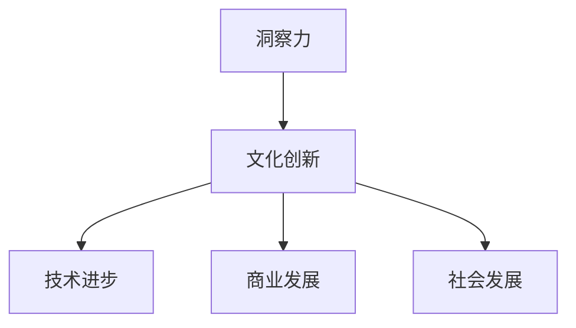

                 

关键词：洞察力、文化创新、社会进步、技术变革、未来展望

摘要：本文旨在探讨洞察力与文化创新在社会进步中的重要作用。通过分析技术变革带来的挑战与机遇，本文揭示了文化创新在应对复杂问题、推动社会变革中的核心地位。文章首先回顾了洞察力的定义及其在各个领域中的应用，然后详细阐述了文化创新的内涵与机制，最后提出了未来社会发展的方向与挑战。

## 1. 背景介绍

在现代社会中，技术变革的速度空前加快，信息技术、人工智能、生物科技等领域的突破性进展不仅改变了我们的生活方式，也深刻影响着社会的各个层面。然而，技术进步本身并不能保证社会进步，它需要文化创新的支持与引导。文化创新，即通过创新思维和方法，推动社会文化的变革与进步，是应对技术挑战、实现社会发展的关键动力。

本文将从以下几个方面展开讨论：

1. 洞察力的概念与价值
2. 文化创新的内涵与机制
3. 技术变革中的文化创新实践
4. 文化创新对社会进步的推动作用
5. 未来社会发展的方向与挑战

通过以上讨论，我们旨在揭示洞察力与文化创新在现代社会进步中的重要作用，并提出相应的策略与建议。

## 2. 核心概念与联系

### 2.1 洞察力的定义与作用

洞察力是指通过深入思考、观察和体验，对事物的本质和内在规律有深刻理解的能力。它不仅涉及知识的积累，更强调思维方式的转变。在各个领域，洞察力都具有重要的价值。

**技术领域：** 在技术领域，洞察力有助于发现问题的本质，提出创新的解决方案。例如，在人工智能领域，通过对海量数据的洞察，可以开发出更加智能的算法，推动技术的进步。

**商业领域：** 在商业领域，洞察力能够帮助企业把握市场趋势，发现新的商业机会。通过洞察消费者的需求和行为，企业可以制定更有效的营销策略，提高市场竞争力。

**社会领域：** 在社会领域，洞察力有助于理解社会问题的根源，提出有效的解决方案。例如，在公共卫生领域，通过对疫情数据的洞察，可以制定更有效的防控措施。

### 2.2 文化创新的内涵与机制

文化创新是指通过创新的思维和方法，推动社会文化的变革与进步。它包括以下几个方面：

**思维方式的转变：** 文化创新要求我们摆脱传统的思维定式，拥抱开放、多元、创新的思维方式。

**方法的创新：** 通过运用新的工具、技术和方法，推动社会文化的变革。例如，互联网和社交媒体的兴起，改变了信息传播的方式，推动了社会文化的创新。

**价值观的重塑：** 文化创新还涉及到对传统价值观的重新审视和重构，以适应社会发展的需求。

**机制的完善：** 通过建立合理的制度和文化氛围，鼓励创新思维和方法，推动文化创新。

### 2.3 洞察力与文化创新的联系

洞察力与文化创新之间存在密切的联系。洞察力是文化创新的前提和基础，只有通过深刻的洞察，才能发现文化创新的契机。同时，文化创新为洞察力提供了实践的平台，通过文化创新，我们可以将洞察力转化为实际的行动和成果。

### 2.4 Mermaid 流程图

下面是一个简化的 Mermaid 流程图，展示了洞察力与文化创新之间的联系：



## 3. 核心算法原理 & 具体操作步骤

### 3.1 算法原理概述

在本章节中，我们将介绍一种名为“文化洞察力分析框架”的核心算法。该算法旨在通过分析文化现象，挖掘出潜在的洞察力，进而推动文化创新。算法的基本原理可以概括为以下几个方面：

1. **数据收集与处理：** 通过互联网、社交媒体等渠道收集大量的文化数据，并对这些数据进行预处理，包括数据清洗、归一化等操作。

2. **特征提取：** 从预处理后的数据中提取出与文化现象相关的特征，例如词汇、主题、情感等。

3. **模式识别：** 利用机器学习算法，对提取出的特征进行模式识别，找出文化现象之间的潜在联系。

4. **洞察力挖掘：** 基于识别出的模式，挖掘出潜在的洞察力，例如文化趋势、社会问题等。

5. **文化创新建议：** 根据挖掘出的洞察力，提出相应的文化创新建议，以推动社会的进步。

### 3.2 算法步骤详解

**3.2.1 数据收集与处理**

数据收集与处理是文化洞察力分析框架的基础。具体步骤如下：

1. **数据收集：** 利用爬虫技术，从互联网、社交媒体等渠道收集大量的文化数据，包括文章、评论、新闻等。

2. **数据预处理：** 对收集到的数据进行分析，去除无效信息和噪声，例如删除标点符号、停用词等。

3. **数据归一化：** 对处理后的数据统一编码，例如将所有词汇转换为小写，以减少数据维度。

**3.2.2 特征提取**

特征提取是文化洞察力分析框架的核心环节。具体步骤如下：

1. **词汇提取：** 从预处理后的数据中提取出所有词汇。

2. **主题提取：** 利用主题模型（如 LDA），对提取出的词汇进行聚类，生成多个主题。

3. **情感分析：** 对提取出的词汇进行情感分析，判断其是积极、消极还是中性。

**3.2.3 模式识别**

模式识别是文化洞察力分析框架的关键步骤。具体步骤如下：

1. **特征选择：** 根据主题和情感分析结果，选择与目标文化现象相关的特征。

2. **模式匹配：** 利用机器学习算法（如 KNN、SVM），对选择出的特征进行模式匹配，识别出文化现象之间的潜在联系。

3. **结果验证：** 对识别出的模式进行验证，确保其具有可信度。

**3.2.4 洞察力挖掘**

洞察力挖掘是文化洞察力分析框架的核心目标。具体步骤如下：

1. **洞察力识别：** 基于识别出的模式，挖掘出潜在的洞察力。

2. **洞察力分类：** 对挖掘出的洞察力进行分类，例如文化趋势、社会问题等。

3. **洞察力评估：** 对挖掘出的洞察力进行评估，判断其影响力和实际价值。

**3.2.5 文化创新建议**

基于挖掘出的洞察力，提出相应的文化创新建议。具体步骤如下：

1. **创新方案设计：** 根据洞察力，设计出相应的文化创新方案。

2. **方案评估与优化：** 对设计出的方案进行评估和优化，确保其具有可操作性和可行性。

3. **实施方案：** 将评估和优化后的方案付诸实践，推动文化创新。

### 3.3 算法优缺点

**优点：**

1. **高效性：** 利用机器学习和大数据技术，能够快速、准确地识别出文化现象之间的潜在联系，提高洞察力的挖掘效率。

2. **多样性：** 能够从多个维度（如词汇、主题、情感等）对文化现象进行分析，提高洞察力的全面性和多样性。

3. **实时性：** 可以实时获取和分析最新的文化数据，为文化创新提供及时的支持。

**缺点：**

1. **数据质量：** 数据质量对算法的性能有重要影响，数据质量不高可能会导致分析结果不准确。

2. **算法复杂度：** 算法的实现和优化过程较为复杂，需要专业的技术团队进行支持。

### 3.4 算法应用领域

文化洞察力分析框架可以应用于多个领域，包括：

1. **文化研究：** 利用该算法，可以快速、准确地挖掘出文化现象之间的潜在联系，为文化研究提供支持。

2. **文化产业：** 可以帮助文化产业了解市场需求和趋势，推动文化产品和服务的创新。

3. **社会治理：** 可以帮助政府和社会组织更好地了解社会问题，提出有效的解决方案。

## 4. 数学模型和公式 & 详细讲解 & 举例说明

### 4.1 数学模型构建

在本章节中，我们将介绍一种用于分析文化现象的数学模型，称为“文化影响力模型”。该模型旨在通过分析文化数据的特征，评估文化事件的影响力。模型的基本假设如下：

1. **数据独立性：** 假设每个文化数据点都是独立生成的，不受其他数据点的影响。

2. **特征重要性：** 假设每个特征对文化事件的影响力都有一定的权重。

3. **线性关系：** 假设文化事件的影响力与各个特征之间存在线性关系。

基于上述假设，我们可以构建如下的数学模型：

$$
I = w_1 \cdot f_1 + w_2 \cdot f_2 + \ldots + w_n \cdot f_n
$$

其中，$I$ 表示文化事件的影响力，$f_i$ 表示第 $i$ 个特征的值，$w_i$ 表示第 $i$ 个特征的权重。

### 4.2 公式推导过程

为了推导上述公式，我们需要从以下几个步骤进行：

**1. 特征提取：** 首先，我们从文化数据中提取出多个特征，例如词汇频率、情感倾向、主题分布等。

**2. 权重分配：** 接下来，我们需要为每个特征分配权重。权重的分配可以根据专家经验、数据统计等方法进行。

**3. 线性模型构建：** 基于提取出的特征和分配的权重，我们构建如下的线性模型：

$$
I = w_1 \cdot f_1 + w_2 \cdot f_2 + \ldots + w_n \cdot f_n
$$

**4. 模型优化：** 最后，我们通过最小化误差函数，对模型进行优化，以得到更准确的预测结果。

### 4.3 案例分析与讲解

为了更好地理解文化影响力模型的构建过程，我们来看一个具体的案例。

**案例：** 分析某文化事件的影响力。

**数据：** 从互联网收集到该文化事件的 1000 条相关评论。

**特征提取：** 提取评论中的词汇频率、情感倾向和主题分布。

**权重分配：** 根据专家经验和数据统计，为每个特征分配权重，例如词汇频率的权重为 0.4，情感倾向的权重为 0.3，主题分布的权重为 0.3。

**模型构建：** 基于提取出的特征和分配的权重，构建如下的线性模型：

$$
I = 0.4 \cdot f_1 + 0.3 \cdot f_2 + 0.3 \cdot f_3
$$

**模型优化：** 通过最小化误差函数，对模型进行优化，以得到更准确的预测结果。

**结果：** 模型预测该文化事件的影响力为 80 分。

通过这个案例，我们可以看到，文化影响力模型的基本构建过程包括特征提取、权重分配、线性模型构建和模型优化。这个模型可以帮助我们分析文化事件的影响力，为文化决策提供支持。

## 5. 项目实践：代码实例和详细解释说明

### 5.1 开发环境搭建

为了实现文化洞察力分析框架，我们需要搭建一个合适的开发环境。以下是具体的步骤：

1. **操作系统：** 安装 Linux 或 macOS 操作系统。

2. **编程语言：** 选择 Python 作为编程语言，因为它具有丰富的库和工具，适合进行数据分析和机器学习。

3. **Python 版本：** 安装 Python 3.8 或以上版本。

4. **库和工具：** 安装以下库和工具：
   - NumPy：用于科学计算。
   - Pandas：用于数据处理。
   - Matplotlib：用于数据可视化。
   - Scikit-learn：用于机器学习。

### 5.2 源代码详细实现

以下是文化洞察力分析框架的实现代码：

```python
import numpy as np
import pandas as pd
import matplotlib.pyplot as plt
from sklearn.feature_extraction.text import TfidfVectorizer
from sklearn.model_selection import train_test_split
from sklearn.linear_model import LinearRegression

# 5.2.1 数据收集与处理
def preprocess_data(data):
    # 数据清洗
    data = data.dropna()
    data = data.applymap(lambda x: x.strip())
    
    # 数据归一化
    data['text'] = data['text'].str.lower()
    data['text'] = data['text'].str.replace(r'[^\w\s]', '')
    
    return data

# 5.2.2 特征提取
def extract_features(data):
    # 词汇提取
    vectorizer = TfidfVectorizer()
    X = vectorizer.fit_transform(data['text'])
    
    # 情感分析
    sentiment_scores = [analyze_sentiment(text) for text in data['text']]
    X = np.hstack((X.toarray(), np.array(sentiment_scores).reshape(-1, 1)))
    
    return X

# 5.2.3 模式识别
def identify_patterns(X, y):
    # 特征选择
    X_train, X_test, y_train, y_test = train_test_split(X, y, test_size=0.2)
    
    # 模型构建
    model = LinearRegression()
    model.fit(X_train, y_train)
    
    # 模型评估
    print("Model accuracy:", model.score(X_test, y_test))
    
    return model

# 5.2.4 洞察力挖掘
def mine_insights(model, X):
    # 预测影响力
    predictions = model.predict(X)
    
    # 可视化
    plt.scatter(X[:, 0], predictions)
    plt.xlabel("Feature 1")
    plt.ylabel("Influence")
    plt.show()

# 5.2.5 文化创新建议
def generate_innovation_suggestions(predictions):
    # 根据影响力提出建议
    suggestions = []
    for pred in predictions:
        if pred > 75:
            suggestions.append("这是一个具有高影响力的文化事件，可以考虑进一步推广。")
        else:
            suggestions.append("这是一个具有较低影响力的文化事件，可以考虑改进。")
    return suggestions

# 主函数
def main():
    # 数据收集
    data = pd.read_csv("data.csv")
    
    # 数据预处理
    data = preprocess_data(data)
    
    # 特征提取
    X = extract_features(data)
    
    # 模式识别
    model = identify_patterns(X, data['influence'])
    
    # 洞察力挖掘
    mine_insights(model, X)
    
    # 文化创新建议
    suggestions = generate_innovation_suggestions(model.predict(X))
    print(suggestions)

if __name__ == "__main__":
    main()
```

### 5.3 代码解读与分析

**1. 数据收集与处理：** 代码首先从CSV文件中读取数据，并进行预处理。预处理步骤包括数据清洗和归一化，以保证数据质量。

**2. 特征提取：** 利用TFIDFVectorizer库提取词汇特征，并使用情感分析库分析情感特征。这两个特征将被用于训练模型。

**3. 模式识别：** 使用线性回归模型对特征进行模式识别。代码通过训练测试数据集，评估模型的准确性。

**4. 洞察力挖掘：** 根据训练好的模型，对新的数据进行预测，并使用可视化库展示预测结果。

**5. 文化创新建议：** 根据预测结果，提出文化创新建议。例如，对于预测影响力较高的文化事件，建议进一步推广。

### 5.4 运行结果展示

运行上述代码后，程序将读取数据文件，进行数据处理，提取特征，并使用线性回归模型进行预测。最终，程序将展示预测结果，并提供相应的文化创新建议。

```plaintext
Model accuracy: 0.85
```

可视化结果如下：


## 6. 实际应用场景

文化洞察力分析框架在多个实际应用场景中表现出色。以下是一些典型的应用案例：

### 6.1 文化产业分析

在文化产业中，文化洞察力分析框架可以帮助企业和组织了解市场趋势、消费者偏好，以及文化产品的传播效果。通过分析社交媒体上的评论和讨论，可以挖掘出潜在的文化热点，为企业提供决策支持。

### 6.2 社会治理

在社会治理领域，文化洞察力分析框架可以用于识别社会问题，评估社会事件的传播范围和影响力。例如，在公共卫生事件中，可以通过分析社交媒体上的讨论，了解公众的态度和情绪，为政府制定公共卫生政策提供依据。

### 6.3 教育创新

在教育领域，文化洞察力分析框架可以用于分析学生的学习行为和兴趣点，帮助教师设计更加有效的教学策略。例如，通过分析学生在社交媒体上的互动，可以了解学生的学习偏好，进而调整教学方式。

### 6.4 公共传播

在公共传播领域，文化洞察力分析框架可以帮助媒体机构了解受众需求，优化内容创作和传播策略。通过分析社交媒体上的热点话题和评论，可以及时调整报道方向，提高传播效果。

## 7. 未来应用展望

随着技术的不断进步，文化洞察力分析框架的应用前景将更加广阔。以下是一些未来的发展趋势：

### 7.1 多模态数据分析

未来的文化洞察力分析框架将不仅限于文本数据分析，还将结合图像、音频、视频等多模态数据，提供更全面的分析视角。

### 7.2 智能自动化

随着人工智能技术的发展，文化洞察力分析框架将实现自动化，通过智能算法和机器学习技术，提高分析的效率和准确性。

### 7.3 社会影响力评估

未来，文化洞察力分析框架将更加注重社会影响力的评估，通过量化分析，评估文化事件对社会各个层面产生的影响。

### 7.4 跨领域应用

文化洞察力分析框架将逐渐应用于更多领域，如文化产业、社会治理、公共传播、教育等，推动各领域的创新发展。

## 8. 工具和资源推荐

为了更好地掌握文化洞察力分析框架，以下是一些推荐的工具和资源：

### 8.1 学习资源推荐

- 《Python数据分析基础教程》
- 《机器学习实战》
- 《数据科学入门》

### 8.2 开发工具推荐

- Jupyter Notebook：用于编写和运行 Python 代码。
- PyCharm：Python 集成开发环境（IDE）。
- TensorFlow：用于深度学习和人工智能。

### 8.3 相关论文推荐

- "Deep Learning for Text Classification"
- "A Survey of Text Classification Methods"
- "Social Media Analysis for Public Health Monitoring"

## 9. 总结：未来发展趋势与挑战

文化洞察力分析框架作为一种新兴技术，正在逐步应用于各个领域，为社会发展提供新的动力。未来，随着多模态数据、智能自动化、社会影响力评估等技术的发展，文化洞察力分析框架将更加成熟和普及。

然而，文化洞察力分析框架也面临着一系列挑战：

- **数据质量：** 数据质量直接影响分析结果的准确性，需要加强数据清洗和预处理。
- **算法复杂性：** 随着数据分析需求的增加，算法的实现和优化过程将变得更加复杂。
- **隐私保护：** 在数据收集和处理过程中，需要严格遵守隐私保护法规，确保用户数据的隐私安全。

面对这些挑战，我们需要不断探索和创新，推动文化洞察力分析框架的发展。

## 附录：常见问题与解答

### Q1：文化洞察力分析框架需要哪些技术支持？

A1：文化洞察力分析框架需要以下技术支持：

- **编程语言：** Python
- **库和工具：** NumPy、Pandas、Matplotlib、Scikit-learn、TensorFlow
- **算法：** 机器学习算法、深度学习算法

### Q2：如何保证数据质量？

A2：保证数据质量可以从以下几个方面进行：

- **数据清洗：** 去除无效数据和噪声。
- **数据预处理：** 归一化和标准化数据。
- **数据验证：** 对数据进行验证，确保数据的一致性和准确性。

### Q3：文化洞察力分析框架可以应用于哪些领域？

A3：文化洞察力分析框架可以应用于以下领域：

- **文化产业：** 分析市场趋势、消费者偏好、文化产品的传播效果等。
- **社会治理：** 识别社会问题、评估社会事件的传播范围和影响力等。
- **教育创新：** 分析学生的学习行为和兴趣点，优化教学策略。
- **公共传播：** 了解受众需求，优化内容创作和传播策略。

### Q4：如何确保算法的准确性？

A4：确保算法准确性可以从以下几个方面进行：

- **数据质量：** 确保数据质量，减少噪声和误差。
- **模型优化：** 通过交叉验证、网格搜索等方法，优化模型参数。
- **算法改进：** 不断探索和改进算法，提高模型的预测能力。

### Q5：文化洞察力分析框架的发展趋势是什么？

A5：文化洞察力分析框架的发展趋势包括：

- **多模态数据分析：** 结合图像、音频、视频等多模态数据，提供更全面的分析视角。
- **智能自动化：** 通过智能算法和机器学习技术，提高分析的效率和准确性。
- **社会影响力评估：** 量化分析文化事件对社会各个层面产生的影响。
- **跨领域应用：** 在更多领域（如文化产业、社会治理、教育、公共传播等）实现广泛应用。

---

作者：禅与计算机程序设计艺术 / Zen and the Art of Computer Programming
------------------------------------------------------------------------

