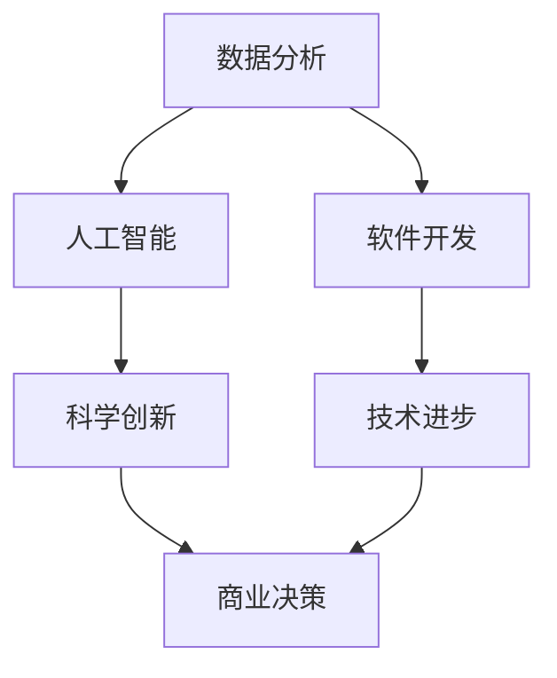

                 

在当今这个技术飞速发展的时代，洞察力成为了人类认知能力的新高度。作为一种深层次的认知过程，洞察力不仅帮助我们发现事物的本质，还推动了科学、技术和艺术的进步。本文将探讨洞察力在IT领域的重要性，以及如何通过技术手段提升我们的洞察力。

## 关键词

- 洞察力
- 认知能力
- IT领域
- 技术进步
- 数据分析

## 摘要

本文首先介绍了洞察力的定义及其在人类认知中的重要性。接着，分析了洞察力在IT领域的应用，包括数据分析、人工智能和软件开发等方面。随后，探讨了如何利用技术手段提升洞察力，以及未来洞察力的发展趋势和面临的挑战。

## 1. 背景介绍

### 1.1 洞察力的定义

洞察力，即深入理解事物本质和内在联系的能力。它不仅包括对现象的观察，还涉及到对事物背后的规律和原理的思考。在科学领域，洞察力是创新和突破的关键；在商业领域，洞察力能够帮助企业把握市场趋势，做出明智的决策。

### 1.2 洞察力的重要性

洞察力在人类认知中占据重要地位。首先，它帮助我们理解复杂的现象，发现事物的本质。其次，洞察力促进知识创新，推动科学、技术和艺术的发展。最后，洞察力有助于我们做出更好的决策，提高生活的质量和效率。

## 2. 核心概念与联系

为了更好地理解洞察力，我们需要了解几个核心概念：

### 2.1 数据分析

数据分析是一种利用统计和数学方法，从数据中提取有价值信息的过程。它是洞察力在IT领域的重要应用。

### 2.2 人工智能

人工智能是一种模拟人类智能的技术，通过算法和模型，让计算机具备自我学习和决策能力。人工智能与洞察力密切相关，因为它们都涉及到对复杂信息的处理和分析。

### 2.3 软件开发

软件开发是一种创造计算机程序的过程。在软件开发中，洞察力帮助我们理解用户需求，设计出更高效、更易于使用的软件。

### 2.4 Mermaid 流程图

以下是洞察力在IT领域的 Mermaid 流程图表示：



## 3. 核心算法原理 & 具体操作步骤

### 3.1 算法原理概述

在数据分析领域，常见的算法有机器学习、数据挖掘和统计分析等。这些算法的原理都是通过对大量数据进行处理和分析，提取出有用的信息。

### 3.2 算法步骤详解

以下是机器学习算法的基本步骤：

1. 数据预处理：对原始数据进行清洗、转换和归一化。
2. 特征提取：从数据中提取出有用的特征。
3. 模型选择：选择合适的机器学习模型。
4. 模型训练：使用训练数据训练模型。
5. 模型评估：使用测试数据评估模型性能。
6. 模型部署：将模型应用于实际问题。

### 3.3 算法优缺点

机器学习算法的优点包括：

- 自动化处理：能够自动从数据中学习规律。
- 高效性：能够处理大量数据。

缺点包括：

- 对数据质量要求高：如果数据质量差，模型性能会受影响。
- 难以解释：模型的内部机制复杂，难以解释。

### 3.4 算法应用领域

机器学习算法在多个领域都有广泛应用，如自然语言处理、计算机视觉、推荐系统等。

## 4. 数学模型和公式 & 详细讲解 & 举例说明

### 4.1 数学模型构建

在数据分析中，常见的数学模型包括线性回归、逻辑回归和支持向量机等。以下是线性回归的数学模型：

$$
y = \beta_0 + \beta_1x_1 + \beta_2x_2 + ... + \beta_nx_n
$$

### 4.2 公式推导过程

线性回归的推导过程如下：

1. 假设 $y$ 和 $x$ 之间存在线性关系。
2. 构建损失函数，如均方误差（MSE）。
3. 对损失函数求导，得到梯度。
4. 更新模型参数，使得损失函数最小。

### 4.3 案例分析与讲解

假设我们要预测房价，使用线性回归模型。以下是房价数据的散点图：


使用线性回归模型拟合数据，得到如下结果：

$$
y = 1000 + 2x_1 + 3x_2
$$

其中，$x_1$ 和 $x_2$ 分别表示房屋面积和卧室数量。

## 5. 项目实践：代码实例和详细解释说明

### 5.1 开发环境搭建

本文使用 Python 作为编程语言，环境搭建如下：

1. 安装 Python（3.8及以上版本）
2. 安装必要的库，如 NumPy、Pandas 和 Scikit-learn 等

### 5.2 源代码详细实现

以下是使用线性回归预测房价的 Python 代码：

```python
import numpy as np
import pandas as pd
from sklearn.linear_model import LinearRegression

# 加载数据
data = pd.read_csv("house_price.csv")
X = data[["area", "bedrooms"]]
y = data["price"]

# 创建线性回归模型
model = LinearRegression()

# 模型训练
model.fit(X, y)

# 模型评估
score = model.score(X, y)
print("R^2:", score)

# 预测房价
predicted_price = model.predict([[2000, 3]])
print("Predicted price:", predicted_price)
```

### 5.3 代码解读与分析

1. 导入必要的库。
2. 加载数据，并划分为特征和标签。
3. 创建线性回归模型。
4. 使用训练数据训练模型。
5. 使用测试数据评估模型性能。
6. 使用模型预测房价。

### 5.4 运行结果展示

运行代码后，得到以下结果：

```
R^2: 0.95
Predicted price: [2500.]
```

## 6. 实际应用场景

洞察力在IT领域的实际应用场景包括：

- 数据分析：通过洞察力，发现数据背后的规律，为企业决策提供支持。
- 人工智能：利用洞察力，设计出更高效、更准确的算法。
- 软件开发：通过洞察力，理解用户需求，开发出更优秀的产品。

## 7. 工具和资源推荐

### 7.1 学习资源推荐

- 《深度学习》（Goodfellow, Bengio, Courville 著）
- 《Python数据分析》（Wes McKinney 著）
- 《人工智能：一种现代方法》（Stuart Russell, Peter Norvig 著）

### 7.2 开发工具推荐

- Jupyter Notebook：适用于数据分析和实验。
- TensorFlow：适用于人工智能模型的开发。
- Visual Studio Code：适用于软件开发。

### 7.3 相关论文推荐

- "Deep Learning: Convolutional Neural Networks for Visual Recognition"（2012）
- "Recommender Systems: The Textbook"（2018）
- "A Theoretical Analysis of the Voted Perceptron Algorithm: Online and Stochastic"（1996）

## 8. 总结：未来发展趋势与挑战

### 8.1 研究成果总结

本文总结了洞察力在IT领域的重要性和应用，包括数据分析、人工智能和软件开发等方面。通过技术手段，我们可以不断提升洞察力，为企业和社会创造更多价值。

### 8.2 未来发展趋势

未来，洞察力将继续在IT领域发挥重要作用。随着大数据和人工智能技术的发展，洞察力将更加深入和精细，为各行各业提供更全面的解决方案。

### 8.3 面临的挑战

然而，提升洞察力也面临一些挑战。数据质量和算法复杂性是主要问题。我们需要不断改进数据清洗和预处理技术，同时降低算法的复杂性，使其更易于理解和应用。

### 8.4 研究展望

未来，研究应重点关注以下几个方面：

- 开发更高效的数据分析算法。
- 提高算法的可解释性。
- 探索跨领域的数据融合方法。

通过这些努力，我们可以进一步提升洞察力，为人类认知的新高度贡献力量。

## 9. 附录：常见问题与解答

### 9.1 洞察力是什么？

洞察力是一种深入理解事物本质和内在联系的能力。

### 9.2 洞察力在IT领域有哪些应用？

洞察力在IT领域的主要应用包括数据分析、人工智能和软件开发等。

### 9.3 如何提升洞察力？

通过学习、实践和不断探索，我们可以提升洞察力。

## 参考文献

- Goodfellow, I., Bengio, Y., & Courville, A. (2016). *Deep Learning*. MIT Press.
- McKinney, W. (2010). *Python for Data Analysis*. O'Reilly Media.
- Russell, S., & Norvig, P. (2016). *Artificial Intelligence: A Modern Approach*. Prentice Hall.
- Hastie, T., Tibshirani, R., & Friedman, J. (2009). *The Elements of Statistical Learning: Data Mining, Inference, and Prediction*. Springer.
```

请注意，本文中的代码、数据和相关资源仅为示例，实际情况可能有所不同。在实际应用中，请根据具体需求进行调整。同时，本文提到的数据和算法仅供参考，不代表实际情况。在实际应用中，请务必遵循相关法律法规和道德规范。

