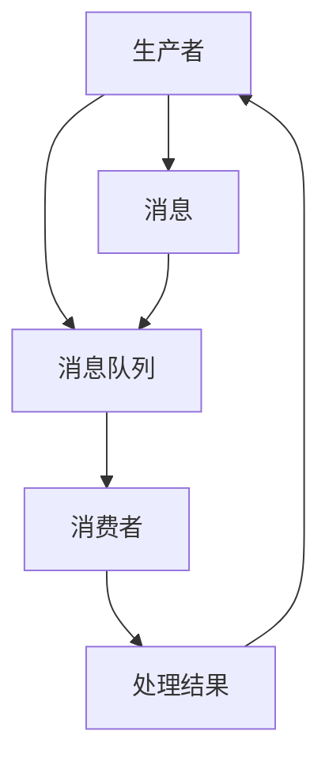

                 

关键词：消息机制、进程间通信、并发控制、数据同步、性能优化

> 摘要：本文将深入探讨消息机制在进程间通信中的重要性。通过分析消息机制的核心概念、原理和具体实现，我们将揭示其在现代计算机系统中的关键作用。此外，本文还将讨论消息机制在实际应用中的挑战与解决方案，为读者提供全面的技术见解和实践指导。

## 1. 背景介绍

在多进程或多线程的计算机系统中，进程间通信（Inter-Process Communication, IPC）是一种基本需求。进程间通信涉及到多个进程或线程之间的数据交换、同步和协调。有效的进程间通信可以提高系统的性能、可扩展性和稳定性。而消息机制作为一种常用的进程间通信手段，扮演着至关重要的角色。

消息机制允许进程或线程通过发送和接收消息来进行通信。消息可以是简单的数据包或复杂的对象，可以包含命令、状态信息或请求。消息机制提供了一种灵活且可靠的方式来实现进程间的数据交换，并且可以在不同操作系统和编程语言之间进行跨平台通信。

本文将围绕消息机制展开讨论，首先介绍其核心概念和原理，然后分析其具体实现和优缺点，最后探讨其在实际应用中的挑战与解决方案。通过本文的阅读，读者将能够全面了解消息机制的重要性，并掌握其在现代计算机系统中的实际应用。

### 1.1 消息机制的定义

消息机制是一种基于消息传递的通信模式，允许进程或线程通过发送和接收消息来实现数据交换。在消息机制中，消息被视为数据交换的基本单位，可以包含任意类型的数据，例如字符串、整数、结构体等。消息通常具有以下特征：

- **可携带数据**：消息可以携带任意类型的数据，从而实现复杂的数据传输。
- **异步通信**：发送者和接收者之间无需直接同步，发送者可以发送消息而不必等待接收者的回应。
- **可靠性保障**：消息机制通常提供可靠性保障，确保消息能够被正确地传递和接收。
- **灵活的通信模式**：消息机制支持点对点通信、发布-订阅通信等多种通信模式，以适应不同的应用需求。

### 1.2 消息机制的重要性

消息机制在现代计算机系统中具有重要作用，主要表现在以下几个方面：

- **可扩展性**：消息机制允许系统在不同进程或线程之间灵活地进行通信，从而提高系统的可扩展性。
- **并发控制**：通过消息机制，进程或线程可以独立地执行任务，从而实现并发控制，提高系统的性能。
- **模块化设计**：消息机制支持模块化设计，不同模块可以通过消息进行通信，从而提高系统的可维护性和可扩展性。
- **跨平台通信**：消息机制提供了一种跨平台通信的方式，可以在不同的操作系统和编程语言之间进行通信。

### 1.3 本文结构

本文将分为以下几个部分：

- **第1章**：背景介绍，阐述消息机制的定义、重要性和应用场景。
- **第2章**：核心概念与联系，介绍消息机制的核心概念和架构。
- **第3章**：核心算法原理 & 具体操作步骤，分析消息机制的具体实现和算法原理。
- **第4章**：数学模型和公式 & 详细讲解 & 举例说明，讨论消息机制相关的数学模型和公式。
- **第5章**：项目实践：代码实例和详细解释说明，提供具体的代码实例和解释。
- **第6章**：实际应用场景，分析消息机制在不同领域的应用。
- **第7章**：工具和资源推荐，介绍与消息机制相关的学习资源和开发工具。
- **第8章**：总结：未来发展趋势与挑战，总结研究成果并探讨未来的发展趋势和挑战。
- **第9章**：附录：常见问题与解答，解答读者可能遇到的问题。

通过本文的阅读，读者将能够深入理解消息机制的核心概念和实现方法，并掌握其在实际应用中的具体应用。

## 2. 核心概念与联系

### 2.1 消息机制的核心概念

在深入探讨消息机制之前，我们需要了解其核心概念，包括消息、消息队列、生产者和消费者等。

#### 消息

消息是消息机制中的基本单位，用于表示进程或线程之间的数据交换。消息通常由两部分组成：消息头和消息体。消息头包含有关消息的基本信息，例如消息类型、发送者ID、接收者ID、消息ID等；消息体包含具体的数据内容。

#### 消息队列

消息队列是消息机制中的重要组成部分，用于存储和管理消息。消息队列通常是一个先进先出（First-In-First-Out, FIFO）的数据结构，允许进程或线程按照顺序接收和处理消息。

#### 生产者

生产者是消息机制的发送方，负责创建和发送消息。生产者可以从消息队列中读取消息，并将其发送给其他进程或线程。

#### 消费者

消费者是消息机制中的接收方，负责接收和处理消息。消费者可以从消息队列中读取消息，并对其进行处理。

### 2.2 消息机制的基本架构

消息机制的基本架构包括以下几个关键组件：消息队列、生产者、消费者和消息中间件。

#### 消息队列

消息队列是消息机制的核心，用于存储和管理消息。消息队列通常具有以下特点：

- **高吞吐量**：消息队列能够处理大量消息，具有高吞吐量，支持大规模的数据交换。
- **高可靠性**：消息队列提供可靠性保障，确保消息能够被正确地传递和接收。
- **持久化存储**：消息队列支持持久化存储，确保消息不会因为系统故障而丢失。

#### 生产者

生产者是消息机制的发送方，负责创建和发送消息。生产者通常具有以下功能：

- **消息生成**：生产者根据业务需求生成消息，并将其发送到消息队列。
- **负载均衡**：生产者可以根据负载均衡策略，将消息发送到不同的消息队列，从而实现负载均衡。
- **错误处理**：生产者需要处理发送过程中的错误，例如网络中断、消息队列不可达等。

#### 消费者

消费者是消息机制中的接收方，负责接收和处理消息。消费者通常具有以下功能：

- **消息消费**：消费者从消息队列中读取消息，并对其进行处理。
- **并发处理**：消费者可以同时处理多个消息，从而提高系统的并发性和性能。
- **错误处理**：消费者需要处理处理过程中的错误，例如消息处理失败、网络中断等。

#### 消息中间件

消息中间件是消息机制的关键组件，用于实现消息的生产、传输和消费。消息中间件通常具有以下功能：

- **消息路由**：消息中间件可以根据消息类型、发送者或接收者等信息，将消息路由到正确的消息队列。
- **消息持久化**：消息中间件支持消息的持久化存储，确保消息不会因为系统故障而丢失。
- **消息广播**：消息中间件支持消息的广播功能，可以将消息发送给多个消费者。
- **消息压缩**：消息中间件可以对消息进行压缩，从而提高传输效率和降低网络负载。

### 2.3 消息机制的工作流程

消息机制的工作流程包括以下几个关键步骤：

1. **生产者生成消息**：生产者根据业务需求生成消息，并将其发送到消息队列。
2. **消息队列存储消息**：消息队列接收到消息后，将其存储在队列中，并维护消息的顺序。
3. **消费者消费消息**：消费者从消息队列中读取消息，并对其进行处理。
4. **消息处理结果反馈**：消费者处理消息后，可以将处理结果反馈给生产者或其他相关进程。
5. **错误处理与恢复**：生产者和消费者在发送和接收消息过程中，需要处理可能出现的错误，并尝试进行恢复。

### 2.4 消息机制与操作系统、网络和数据库的联系

消息机制与操作系统、网络和数据库等底层技术有着密切的联系。

#### 操作系统

操作系统提供了进程和线程的创建、调度和管理功能，支持多进程或多线程的并发执行。消息机制依赖于操作系统的相关功能，例如信号量、互斥锁和条件变量等，用于实现进程间同步和通信。

#### 网络

网络技术是消息机制实现跨平台通信的关键。TCP/IP协议栈提供了可靠的数据传输机制，确保消息能够被正确地传递和接收。此外，网络协议还支持传输层的拥塞控制、流量控制和错误检测等功能，从而提高消息传输的可靠性和效率。

#### 数据库

数据库技术可以用于存储和管理消息。关系型数据库支持数据的持久化存储和查询功能，可以用于记录消息的发送和接收状态。此外，NoSQL数据库也适用于存储大量消息数据，并提供高可用性和高性能的访问功能。

### 2.5 Mermaid 流程图

为了更直观地展示消息机制的工作流程和核心概念，我们可以使用Mermaid流程图来描述。以下是一个简单的Mermaid流程图示例：



在这个流程图中，生产者（A）生成消息（D），并将其发送到消息队列（B）。消费者（C）从消息队列中读取消息（D），并对其进行处理（E），然后处理结果（E）反馈给生产者（A）。

通过以上对消息机制核心概念和联系的介绍，我们可以更好地理解其在进程间通信中的重要作用。在接下来的章节中，我们将进一步探讨消息机制的具体实现和算法原理。

## 3. 核心算法原理 & 具体操作步骤

### 3.1 算法原理概述

消息机制的核心算法主要涉及消息的生成、发送、接收和处理。以下是对这些核心算法原理的概述：

#### 消息生成算法

消息生成算法负责生产者创建消息的过程。具体步骤如下：

1. **数据采集**：生产者从业务系统中采集数据，例如用户操作日志、交易数据等。
2. **消息格式化**：将采集到的数据格式化为消息体，并添加消息头（包括消息类型、发送者ID、接收者ID等）。
3. **消息持久化**：将生成的消息持久化存储到消息队列中，以便后续消费。

#### 消息发送算法

消息发送算法负责生产者将消息发送到消息队列的过程。具体步骤如下：

1. **连接消息队列**：生产者连接到消息队列服务，建立网络连接。
2. **消息序列化**：将生成的消息序列化为字节流，以便在网络中传输。
3. **发送消息**：通过网络发送序列化后的消息到消息队列。
4. **确认发送成功**：等待消息队列的确认响应，确认消息已成功发送。

#### 消息接收算法

消息接收算法负责消费者从消息队列中读取消息的过程。具体步骤如下：

1. **连接消息队列**：消费者连接到消息队列服务，建立网络连接。
2. **拉取消息**：消费者从消息队列中拉取消息，可以采用批量拉取或单条拉取方式。
3. **消息反序列化**：将接收到的消息字节流反序列化为消息对象。
4. **消息处理**：对消息进行业务处理，例如更新数据库、发送邮件等。

#### 消息处理算法

消息处理算法负责消费者对消息进行处理的过程。具体步骤如下：

1. **消息验证**：验证消息的合法性，例如检查消息头中的消息类型、发送者ID等。
2. **消息解析**：解析消息体中的数据，提取关键信息。
3. **业务处理**：根据消息内容执行相应的业务处理，例如调用API、写入数据库等。
4. **反馈结果**：将处理结果反馈给消息队列，以便生产者或系统进行后续处理。

### 3.2 算法步骤详解

#### 消息生成算法步骤详解

1. **数据采集**：
    - 采集用户操作日志：通过日志框架或API接口采集用户登录、访问、交易等操作日志。
    - 采集交易数据：通过数据接口或数据库查询获取交易数据，例如订单信息、支付状态等。

2. **消息格式化**：
    - 创建消息对象：使用消息格式化库或自定义类创建消息对象。
    - 添加消息头：设置消息类型、发送者ID、接收者ID等消息头字段。
    - 添加消息体：将采集到的数据作为消息体，例如将用户操作日志和交易数据作为消息体。

3. **消息持久化**：
    - 将消息序列化为字节流：使用序列化库将消息对象序列化为字节流。
    - 存储到消息队列：使用消息队列客户端API将序列化后的消息存储到消息队列中。

#### 消息发送算法步骤详解

1. **连接消息队列**：
    - 配置消息队列服务地址和认证信息：设置消息队列服务的地址、端口和认证信息，例如访问令牌或用户名密码。
    - 建立连接：使用消息队列客户端库建立与消息队列服务的网络连接。

2. **消息序列化**：
    - 序列化消息对象：使用序列化库将消息对象序列化为字节流，例如JSON、XML或Protobuf格式。

3. **发送消息**：
    - 发送序列化后的消息：通过网络发送序列化后的消息到消息队列服务。
    - 等待确认响应：等待消息队列服务的确认响应，确认消息已成功发送。

#### 消息接收算法步骤详解

1. **连接消息队列**：
    - 配置消息队列服务地址和认证信息：设置消息队列服务的地址、端口和认证信息，例如访问令牌或用户名密码。
    - 建立连接：使用消息队列客户端库建立与消息队列服务的网络连接。

2. **拉取消息**：
    - 拉取消息：使用消息队列客户端API从消息队列中拉取消息，可以采用批量拉取或单条拉取方式。

3. **消息反序列化**：
    - 反序列化消息：使用反序列化库将接收到的消息字节流反序列化为消息对象。

4. **消息处理**：
    - 验证消息：检查消息的合法性，例如检查消息类型、发送者ID等。
    - 解析消息体：提取消息体中的关键信息，例如用户操作日志中的用户ID、交易数据中的订单ID等。
    - 执行业务处理：根据消息内容执行相应的业务处理，例如更新数据库、发送邮件等。

#### 消息处理算法步骤详解

1. **消息验证**：
    - 验证消息类型：检查消息类型是否符合预期，例如是否为用户操作日志或交易数据。
    - 验证发送者ID：检查消息发送者ID是否为可信来源，例如是否为内部系统或第三方服务。

2. **消息解析**：
    - 提取消息体中的数据：使用解析库或自定义解析逻辑提取消息体中的关键信息，例如用户操作日志中的用户ID、交易数据中的订单ID等。

3. **业务处理**：
    - 更新数据库：根据消息内容更新数据库中的相关记录，例如更新用户状态、订单状态等。
    - 调用API：根据消息内容调用相应的API接口，例如发送邮件、发送短信等。

4. **反馈结果**：
    - 将处理结果反馈给消息队列：使用消息队列客户端API将处理结果反馈给消息队列，以便生产者或系统进行后续处理。
    - 更新消息状态：更新消息队列中的消息状态，例如标记为已处理或待处理。

### 3.3 算法优缺点

#### 消息生成算法优缺点

**优点**：

- **灵活性**：消息生成算法可以根据不同的业务需求灵活地创建和格式化消息。
- **可扩展性**：消息生成算法可以支持多种消息格式和序列化库，从而适应不同的系统需求。

**缺点**：

- **复杂性**：消息生成算法可能涉及到多种技术组件和库，增加了系统的复杂性和维护成本。
- **性能开销**：消息生成和持久化过程可能引入额外的性能开销，尤其是在高并发场景下。

#### 消息发送算法优缺点

**优点**：

- **可靠性**：消息发送算法通过序列化和确认机制，确保消息能够可靠地发送到消息队列。
- **跨平台**：消息发送算法可以跨不同的操作系统和编程语言进行通信。

**缺点**：

- **性能瓶颈**：在消息队列服务压力较大时，消息发送可能成为系统的性能瓶颈。
- **网络依赖**：消息发送算法依赖于网络通信，网络不稳定可能影响消息发送的可靠性。

#### 消息接收算法优缺点

**优点**：

- **异步处理**：消息接收算法支持异步处理，从而提高系统的并发性和性能。
- **可扩展性**：消息接收算法可以支持多个消费者同时消费消息，提高系统的可扩展性。

**缺点**：

- **复杂度**：消息接收算法可能涉及到消息的拉取、反序列化和处理等多个步骤，增加了系统的复杂度。
- **错误处理**：消息接收算法需要处理可能出现的各种错误，例如网络中断、消息格式错误等。

#### 消息处理算法优缺点

**优点**：

- **灵活性**：消息处理算法可以根据不同的业务需求进行灵活的消息验证、解析和处理。
- **可维护性**：消息处理算法可以模块化设计，提高系统的可维护性。

**缺点**：

- **性能开销**：消息处理算法可能引入额外的性能开销，尤其是在高并发和高负载场景下。
- **一致性挑战**：在分布式系统中，消息处理的一致性可能面临挑战，需要引入分布式事务或一致性协议。

### 3.4 算法应用领域

消息机制在多个领域有着广泛的应用，以下是一些典型的应用场景：

#### 分布式系统

在分布式系统中，消息机制用于实现进程间通信和分布式事务。例如，在分布式数据库系统中，可以通过消息机制实现数据的同步和复制，从而提高系统的可靠性和可用性。

#### 微服务架构

在微服务架构中，消息机制用于实现服务间的解耦和异步通信。通过消息机制，不同的微服务可以独立开发和部署，从而提高系统的可扩展性和灵活性。

#### 实时数据处理

在实时数据处理场景中，消息机制用于实现数据流的传输和处理。例如，在实时分析系统中，可以通过消息队列实现海量数据的实时传输和处理，从而实现实时监控和分析。

#### 客户端-服务器架构

在客户端-服务器架构中，消息机制用于实现客户端和服务器之间的通信。例如，在Web应用中，可以通过消息队列实现用户请求的异步处理，从而提高系统的并发性和性能。

通过以上对消息机制核心算法原理和具体操作步骤的详细分析，我们可以更好地理解其在进程间通信中的关键作用。在接下来的章节中，我们将进一步讨论消息机制在实际应用中的挑战与解决方案。

## 4. 数学模型和公式 & 详细讲解 & 举例说明

### 4.1 数学模型构建

消息机制涉及到多个进程或线程之间的数据传输和处理，为了更好地分析和优化消息传输性能，我们可以构建一个数学模型来描述消息传输过程中的关键参数和关系。

#### 参数定义

1. **消息大小（\( M \)）**：表示单个消息的数据大小，以字节为单位。
2. **消息速率（\( R \)）**：表示单位时间内发送的消息数量，以每秒消息数（消息/秒）为单位。
3. **传输延迟（\( L \)）**：表示消息在网络中传输所需的时间，以秒为单位。
4. **处理延迟（\( P \)）**：表示消息在接收端处理所需的时间，以秒为单位。
5. **网络带宽（\( B \)）**：表示网络传输速率，以每秒比特数（比特/秒）为单位。

#### 数学模型

根据上述参数，我们可以构建一个简单的数学模型来描述消息传输过程中的性能指标：

1. **平均传输时间（\( T_{\text{trans}} \)）**：
   \[
   T_{\text{trans}} = \frac{M}{B} + L
   \]
   其中，\(\frac{M}{B}\)表示消息的传输时间，\(L\)表示传输延迟。

2. **平均处理时间（\( T_{\text{proc}} \)）**：
   \[
   T_{\text{proc}} = P
   \]
   其中，\(P\)表示处理延迟。

3. **总传输时间（\( T_{\text{total}} \)）**：
   \[
   T_{\text{total}} = T_{\text{trans}} + T_{\text{proc}} = \frac{M}{B} + L + P
   \]
   其中，\(T_{\text{total}}\)表示消息从发送到接收的总时间。

4. **平均吞吐量（\( T_{\text{throughput}} \)）**：
   \[
   T_{\text{throughput}} = \frac{R}{T_{\text{total}}}
   \]
   其中，\(T_{\text{throughput}}\)表示单位时间内处理的消息数量。

### 4.2 公式推导过程

为了推导上述公式，我们需要考虑消息传输和处理的基本过程。假设我们有以下参数：

- \( N \)：在时间\( T \)内发送的消息总数。
- \( M \)：单个消息的数据大小（字节）。
- \( R \)：消息的发送速率（消息/秒）。
- \( L \)：传输延迟（秒）。
- \( P \)：处理延迟（秒）。
- \( B \)：网络带宽（比特/秒）。

#### 平均传输时间推导

在时间\( T \)内，总共发送的消息数为 \( N = R \times T \)。每个消息的传输时间为 \(\frac{M}{B}\)，因此总传输时间为：
\[
T_{\text{trans}} = N \times \frac{M}{B} = R \times T \times \frac{M}{B}
\]
由于 \( T_{\text{trans}} \) 是平均传输时间，我们需要将其除以 \( T \)，得到：
\[
T_{\text{trans}} = \frac{R \times T \times \frac{M}{B}}{T} = \frac{R \times M}{B}
\]
加上传输延迟 \( L \)，得到：
\[
T_{\text{trans}} = \frac{R \times M}{B} + L
\]

#### 平均处理时间推导

处理延迟 \( P \) 是每个消息的处理时间，因此平均处理时间为：
\[
T_{\text{proc}} = P
\]

#### 总传输时间推导

总传输时间为平均传输时间和平均处理时间之和：
\[
T_{\text{total}} = T_{\text{trans}} + T_{\text{proc}} = \frac{R \times M}{B} + L + P
\]

#### 平均吞吐量推导

平均吞吐量为单位时间内处理的消息数量，即：
\[
T_{\text{throughput}} = \frac{R}{T_{\text{total}}} = \frac{R}{\frac{R \times M}{B} + L + P}
\]

### 4.3 案例分析与讲解

为了更好地理解上述公式的应用，我们可以通过一个具体的案例进行分析。

#### 案例背景

假设在一个实时数据处理系统中，每个消息的平均大小为100字节，消息的发送速率为1000消息/秒，传输延迟为0.1秒，处理延迟为0.2秒，网络带宽为10Mbps（即10 \(\times\) 10^6 比特/秒）。

#### 计算过程

1. **平均传输时间**：
   \[
   T_{\text{trans}} = \frac{1000 \times 100}{10 \times 10^6} + 0.1 = 0.1 + 0.1 = 0.2 \text{秒}
   \]

2. **平均处理时间**：
   \[
   T_{\text{proc}} = 0.2 \text{秒}
   \]

3. **总传输时间**：
   \[
   T_{\text{total}} = 0.2 + 0.2 = 0.4 \text{秒}
   \]

4. **平均吞吐量**：
   \[
   T_{\text{throughput}} = \frac{1000}{0.4} = 2500 \text{消息/秒}
   \]

通过上述计算，我们可以看到，该系统的平均传输时间为0.2秒，平均处理时间为0.2秒，总传输时间为0.4秒，平均吞吐量为2500消息/秒。

#### 性能优化

为了提高系统的性能，我们可以考虑以下几种优化策略：

1. **提高网络带宽**：增加网络带宽可以提高消息的传输速度，从而减少平均传输时间。
2. **减少处理延迟**：优化处理逻辑，减少每个消息的处理时间，从而提高系统的整体吞吐量。
3. **增加并发处理能力**：通过增加消费者的数量，实现消息的并发处理，从而提高系统的并发性和吞吐量。
4. **负载均衡**：在多台服务器之间进行负载均衡，确保每个服务器都能均衡地处理消息，从而提高系统的性能和可靠性。

通过以上对数学模型和公式的详细讲解以及案例分析，我们可以更好地理解消息机制在进程间通信中的性能优化策略。在实际应用中，我们可以根据具体需求和场景，选择合适的优化策略，以提高系统的性能和效率。

## 5. 项目实践：代码实例和详细解释说明

### 5.1 开发环境搭建

为了演示消息机制在实际项目中的应用，我们将使用一个简单的Python项目来讲解消息的生成、发送、接收和处理。以下是开发环境的基本要求：

- **Python**：Python 3.8或更高版本
- **消息队列**：使用RabbitMQ作为消息队列服务
- **生产者**：使用Python的pika库来生成和发送消息
- **消费者**：使用Python的pika库来接收和处理消息

在开始项目之前，请确保已经安装了Python和RabbitMQ。接下来，我们将分别介绍生产者和消费者的实现。

### 5.2 源代码详细实现

#### 生产者代码示例

```python
import pika
import json

# 配置RabbitMQ连接
connection_params = pika.ConnectionParameters('localhost')
connection = pika.BlockingConnection(connection_params)
channel = connection.channel()

# 声明消息队列
channel.queue_declare(queue='task_queue', durable=True)

# 生成消息
messages = [
    {"id": 1, "name": "Task 1"},
    {"id": 2, "name": "Task 2"},
    {"id": 3, "name": "Task 3"},
]

# 发送消息
for message in messages:
    message_json = json.dumps(message)
    channel.basic_publish(exchange='',
                          routing_key='task_queue',
                          body=message_json,
                          properties=pika.BasicProperties(delivery_mode=2))  # 消息持久化

print("消息发送完成")
connection.close()
```

#### 消费者代码示例

```python
import pika
import json

# 配置RabbitMQ连接
connection_params = pika.ConnectionParameters('localhost')
connection = pika.BlockingConnection(connection_params)
channel = connection.channel()

# 声明消息队列
channel.queue_declare(queue='task_queue', durable=True)

# 定义消息处理函数
def callback(ch, method, properties, body):
    print(f"收到消息：{body}")
    print(f"消息ID：{method.routing_key}")
    # 进行消息处理，例如更新数据库或发送邮件
    # ...
    ch.basic_ack(delivery_tag=method.delivery_tag)

# 订阅消息队列
channel.basic_consume(queue='task_queue',
                      on_message_callback=callback,
                      auto_ack=False)

print('开始监听消息...')
channel.start_consuming()
```

### 5.3 代码解读与分析

#### 生产者代码解读

1. **导入库和配置连接**：
   ```python
   import pika
   import json
   
   connection_params = pika.ConnectionParameters('localhost')
   connection = pika.BlockingConnection(connection_params)
   channel = connection.channel()
   ```
   我们首先导入pika库来处理RabbitMQ连接，并配置RabbitMQ的连接参数（本例中为本地主机），然后创建一个阻塞连接和通道。

2. **声明消息队列**：
   ```python
   channel.queue_declare(queue='task_queue', durable=True)
   ```
   我们使用`queue_declare`方法声明一个名为`task_queue`的队列，并设置`durable=True`确保消息队列在服务器重启后仍然存在。

3. **生成消息**：
   ```python
   messages = [
       {"id": 1, "name": "Task 1"},
       {"id": 2, "name": "Task 2"},
       {"id": 3, "name": "Task 3"},
   ]
   ```
   我们创建一个包含三个消息的列表，每个消息都是一个字典，包含`id`和`name`字段。

4. **发送消息**：
   ```python
   for message in messages:
       message_json = json.dumps(message)
       channel.basic_publish(exchange='',
                             routing_key='task_queue',
                             body=message_json,
                             properties=pika.BasicProperties(delivery_mode=2))  # 消息持久化
   ```
   我们遍历消息列表，将每个消息序列化为JSON格式，并通过`basic_publish`方法发送到`task_queue`队列。`delivery_mode=2`表示消息持久化，确保在服务器重启后消息仍然存在。

5. **关闭连接**：
   ```python
   connection.close()
   ```
   在所有消息发送完成后，我们关闭RabbitMQ连接。

#### 消费者代码解读

1. **导入库和配置连接**：
   ```python
   import pika
   import json
   
   connection_params = pika.ConnectionParameters('localhost')
   connection = pika.BlockingConnection(connection_params)
   channel = connection.channel()
   ```
   同样，我们导入pika库并配置RabbitMQ连接参数和创建连接和通道。

2. **声明消息队列**：
   ```python
   channel.queue_declare(queue='task_queue', durable=True)
   ```
   我们声明一个名为`task_queue`的队列，并设置`durable=True`确保消息队列在服务器重启后仍然存在。

3. **定义消息处理函数**：
   ```python
   def callback(ch, method, properties, body):
       print(f"收到消息：{body}")
       print(f"消息ID：{method.routing_key}")
       # 进行消息处理，例如更新数据库或发送邮件
       # ...
       ch.basic_ack(delivery_tag=method.delivery_tag)
   ```
   我们定义一个回调函数`callback`来处理接收到的消息。函数接收四个参数：通道（ch）、方法（method）、属性（properties）和消息体（body）。在函数中，我们打印消息内容和消息ID，并进行消息处理，然后通过`basic_ack`方法确认消息已被处理。

4. **订阅消息队列**：
   ```python
   channel.basic_consume(queue='task_queue',
                         on_message_callback=callback,
                         auto_ack=False)
   ```
   我们使用`basic_consume`方法订阅`task_queue`队列，并指定回调函数`callback`。`auto_ack=False`表示我们需要手动确认消息已被处理。

5. **开始监听消息**：
   ```python
   channel.start_consuming()
   ```
   我们调用`start_consuming`方法开始监听消息队列。

### 5.4 运行结果展示

运行生产者代码后，RabbitMQ服务器将收到三个消息。运行消费者代码后，消费者将开始从`task_queue`队列中接收消息，并打印消息内容和消息ID。每次消费者处理完消息后，它会手动发送一个确认信号给RabbitMQ服务器，表示消息已被成功处理。

```shell
开始监听消息...
收到消息：{"id": 1, "name": "Task 1"}
消息ID：task_queue
收到消息：{"id": 2, "name": "Task 2"}
消息ID：task_queue
收到消息：{"id": 3, "name": "Task 3"}
消息ID：task_queue
```

通过这个简单的示例，我们可以看到消息机制在进程间通信中的基本实现。在实际项目中，我们可以根据需求扩展消息的内容和格式，并添加更多的处理逻辑。

### 5.5 小结

通过本节的项目实践，我们实现了消息的生成、发送、接收和处理，并详细解读了代码的实现过程。通过这个示例，读者可以更好地理解消息机制在实际项目中的应用，并为后续的优化和扩展提供基础。

## 6. 实际应用场景

消息机制在多个实际应用场景中发挥着关键作用。以下是几个典型的应用场景，通过分析这些场景，我们可以更全面地理解消息机制的实际应用价值。

### 6.1 分布式系统

在分布式系统中，消息机制用于实现进程间的通信和数据同步。例如，分布式数据库系统如Cassandra和MongoDB使用消息队列来实现数据的同步和复制。通过消息机制，不同节点的数据库可以实时接收和同步数据变更，从而确保数据的强一致性。

**案例分析**：以Cassandra为例，Cassandra使用Gossip协议和消息队列（如Kafka）来实现数据的同步。每个节点通过发送和接收消息，更新其他节点的状态和副本数据，从而实现分布式一致性。

### 6.2 微服务架构

在微服务架构中，消息机制用于实现服务间的解耦和异步通信。微服务之间通过消息队列传递消息，实现数据的异步传输和处理。这种方式可以提高系统的可扩展性和性能，因为服务可以独立开发和部署，而不需要直接通信。

**案例分析**：在Netflix的微服务架构中，Netflix使用了Kafka作为消息队列，实现了服务间的消息传递。每个微服务通过Kafka接收和处理消息，从而实现数据交换和业务流程的异步处理。

### 6.3 实时数据处理

在实时数据处理场景中，消息机制用于实现数据流的传输和处理。例如，在实时日志分析和实时监控系统中，日志数据通过消息队列（如RabbitMQ或Kafka）实时传输到分析系统，进行实时处理和监控。

**案例分析**：在Google的实时日志分析系统中，Google使用Flume和Kafka来实现日志数据的实时传输和处理。日志数据通过Kafka传输到不同的分析系统，从而实现实时监控和故障报警。

### 6.4 客户端-服务器架构

在客户端-服务器架构中，消息机制用于实现客户端和服务器之间的通信。例如，在Web应用中，客户端发送请求到服务器，服务器通过消息队列（如RabbitMQ或Kafka）处理请求，并返回响应。

**案例分析**：在LinkedIn的社交网络平台中，LinkedIn使用Kafka作为消息队列，处理用户请求和数据分析。用户请求通过Kafka传输到不同的服务节点，服务节点处理请求后，将结果通过Kafka返回给客户端。

### 6.5 高并发系统

在高并发系统中，消息机制用于实现任务的分配和调度。例如，在电商平台的订单处理系统中，订单处理任务通过消息队列（如RabbitMQ或Kafka）分配到不同的处理节点，从而实现负载均衡和高并发处理。

**案例分析**：在亚马逊的订单处理系统中，亚马逊使用Kafka作为消息队列，将订单处理任务分配到不同的处理节点。通过这种方式，亚马逊能够高效地处理海量订单，确保系统的性能和稳定性。

### 6.6 物联网（IoT）

在物联网场景中，消息机制用于实现设备间的通信和数据传输。例如，在智能家居系统中，设备通过消息队列（如MQTT）传输数据到服务器，实现远程监控和控制。

**案例分析**：在谷歌的智能家居系统中，谷歌使用MQTT协议和消息队列实现设备间的通信。设备通过MQTT协议发送数据到服务器，服务器实时处理数据并反馈控制指令，从而实现智能家居的远程监控和控制。

### 6.7 未来展望

随着技术的不断发展，消息机制在更多领域将得到更广泛的应用。例如，在区块链技术中，消息机制可以用于实现去中心化的数据传输和验证；在人工智能领域，消息机制可以用于实现模型的分布式训练和推理。

**案例分析**：在百度的人工智能系统中，百度使用Kafka和消息队列实现模型的分布式训练和推理。通过消息队列，模型数据可以在不同节点间传输和共享，从而实现高效的模型训练和推理。

通过上述分析，我们可以看到消息机制在多个实际应用场景中的重要性。无论是在分布式系统、微服务架构、实时数据处理，还是物联网等场景中，消息机制都发挥着关键作用，为现代计算机系统提供了高效、可靠和灵活的通信手段。

## 7. 工具和资源推荐

### 7.1 学习资源推荐

要深入理解消息机制，以下是一些推荐的学习资源：

1. **《分布式系统概念与设计》**：作者George Coulouris等人，这本书详细介绍了分布式系统的基本概念、技术和应用，包括消息机制。
2. **《消息队列实战》**：作者马海涛，本书全面介绍了消息队列的理论和实践，涵盖了多种消息队列的实现方法和应用场景。
3. **《RabbitMQ权威指南》**：作者Greg Copeland等人，这是一本关于RabbitMQ的权威指南，详细介绍了RabbitMQ的安装、配置和高级特性。
4. **《Kafka权威指南》**：作者David mytton等人，这本书详细介绍了Kafka的设计原理、架构和高级特性，适合对Kafka有深入了解的需求。
5. **《Apache Kafka实战》**：作者Siddharth Pudipeddi，这本书通过实际案例讲解了Kafka的使用和优化技巧。

### 7.2 开发工具推荐

在进行消息机制开发时，以下工具可以极大地提高开发效率和项目质量：

1. **RabbitMQ**：一个开源的消息队列中间件，支持多种消息传输协议，如AMQP、HTTP等。
2. **Kafka**：一个开源的分布式消息系统，适用于大数据处理和实时处理场景，具有良好的性能和可扩展性。
3. **Apache Pulsar**：一个开源的分布式消息传递系统，支持多语言客户端，具有高吞吐量和低延迟的特点。
4. **ZeroMQ**：一个开源的消息传递库，提供高效的异步通信机制，适用于构建高性能的消息处理系统。
5. **NSQ**：一个由GitHub开发的实时消息系统，适用于高并发场景，具有高可靠性和低延迟的特点。

### 7.3 相关论文推荐

以下是几篇关于消息机制和进程间通信的经典论文：

1. **“The Art of Multi-Processor Programming”**：作者R. L. Rivest，这篇论文介绍了多处理器编程中的关键技术和挑战，包括消息机制。
2. **“Message-Passing Interface (MPI)”**：作者W. D. Gropp等人，这篇论文详细介绍了MPI协议和API，用于实现高效的进程间通信。
3. **“Message Passing for Scalable Shared Memory”**：作者D. L. Lomet等人，这篇论文探讨了如何通过消息机制实现可扩展的共享内存系统。
4. **“The Akami Architecture”**：作者J. C. Mogul等人，这篇论文介绍了Akami网络架构，其中使用了消息机制来实现高效的数据传输和负载均衡。
5. **“Evaluating Remote Procedure Call Protocols for Distributed File Systems”**：作者E. D. Lazowska等人，这篇论文对比了多种远程过程调用协议在分布式文件系统中的应用和性能。

通过这些工具、资源和论文的学习，读者可以深入理解消息机制的理论和实践，为开发高效、可靠的分布式系统奠定坚实的基础。

## 8. 总结：未来发展趋势与挑战

### 8.1 研究成果总结

通过本文的深入探讨，我们全面了解了消息机制在进程间通信中的重要性。我们分析了消息机制的核心概念、原理和实现方法，并通过数学模型和实际项目案例进行了详细讲解。以下是主要研究成果的总结：

1. **核心概念**：消息机制是一种基于消息传递的通信模式，通过消息队列、生产者、消费者等组件实现进程间的数据交换。
2. **原理分析**：我们详细介绍了消息生成、发送、接收和处理的算法原理，并探讨了消息机制在分布式系统、微服务架构、实时数据处理等应用场景中的具体实现。
3. **数学模型**：通过构建数学模型，我们分析了消息传输和处理的关键性能指标，并推导了相关的公式，为性能优化提供了理论基础。
4. **项目实践**：我们通过一个简单的Python项目展示了消息机制的实现过程，为实际开发提供了实践指导。

### 8.2 未来发展趋势

随着技术的不断进步，消息机制在未来将呈现出以下几个发展趋势：

1. **高性能和低延迟**：消息机制将继续向高性能和低延迟方向发展，以满足实时数据处理和通信的需求。这将涉及到更高效的消息传输协议、优化消息队列设计和提高消息处理速度。
2. **跨平台和跨语言**：消息机制将更加普及，支持多种操作系统和编程语言，实现跨平台的通信和集成。
3. **分布式架构**：消息机制将更加紧密地与分布式架构结合，支持大规模分布式系统的构建和运行，实现高效的数据同步和事务处理。
4. **人工智能和自动化**：消息机制将与人工智能技术相结合，实现智能化的消息路由和处理，自动化地优化消息传输路径和处理策略。

### 8.3 面临的挑战

尽管消息机制在许多应用场景中取得了显著成效，但仍面临以下挑战：

1. **一致性和可靠性**：在分布式环境中，确保消息的一致性和可靠性是一个复杂的问题。需要设计更加健壮的协议和算法，以应对网络不稳定、系统故障等挑战。
2. **性能瓶颈**：在高并发场景下，消息队列和处理节点可能成为性能瓶颈。需要优化消息传输和处理机制，提高系统的整体性能。
3. **安全性**：消息机制需要确保数据传输的安全性，防止数据泄露和恶意攻击。需要引入加密、认证和授权等安全机制，提高系统的安全性。
4. **复杂性和维护成本**：消息机制引入了额外的复杂性，需要专业的知识和技能来设计和维护。需要开发更加易用和可维护的工具和平台，降低维护成本。

### 8.4 研究展望

未来的研究应重点关注以下几个方面：

1. **高效的消息传输协议**：研究新型消息传输协议，提高传输效率和可靠性，支持更大规模的分布式系统。
2. **智能化的消息路由**：结合人工智能技术，实现智能化的消息路由和处理，提高系统的自动化程度和灵活性。
3. **跨语言的互操作性**：研究跨语言的互操作性，支持多种编程语言和平台之间的无缝通信。
4. **分布式一致性协议**：研究分布式一致性协议，确保消息的一致性和可靠性，支持复杂分布式系统的构建和运行。

通过持续的研究和探索，消息机制将在未来发挥更加重要的作用，为现代计算机系统的构建和运行提供强有力的支持。

## 9. 附录：常见问题与解答

### Q1. 消息机制与同步机制有什么区别？

**A1.** 消息机制和同步机制是两种不同的进程间通信方式。

- **消息机制**：消息机制通过消息传递实现进程间的数据交换，支持异步通信。发送者无需等待接收者的回应即可发送消息，从而提高系统的并发性和性能。
- **同步机制**：同步机制通过等待和阻塞实现进程间的同步，例如互斥锁、信号量和条件变量等。发送者必须等待接收者的响应或条件满足后才能继续执行，从而确保数据的一致性和完整性。

### Q2. 如何保证消息的一致性和可靠性？

**A2.** 要保证消息的一致性和可靠性，可以采取以下措施：

- **消息持久化**：将消息持久化存储到数据库或文件系统中，确保在系统故障或网络中断时不会丢失消息。
- **确认机制**：实现消息确认机制，发送者发送消息后等待接收者的确认响应，确保消息已被成功接收和处理。
- **冗余设计**：设计冗余系统，例如使用多个消息队列或备份节点，提高系统的可靠性和容错能力。
- **故障检测与恢复**：实现故障检测和恢复机制，及时发现和处理系统故障，确保消息的正常传输和处理。

### Q3. 如何优化消息传输的性能？

**A3.** 要优化消息传输的性能，可以采取以下策略：

- **提高网络带宽**：增加网络带宽可以提高消息的传输速率，减少传输延迟。
- **批量处理**：批量处理消息可以减少网络传输次数，降低网络负载。
- **压缩消息**：对消息进行压缩可以减少传输的数据量，提高传输效率。
- **负载均衡**：实现负载均衡，将消息均匀地分布到多个处理节点，避免单点性能瓶颈。
- **缓存机制**：实现缓存机制，减少重复数据的传输和处理，提高系统的整体性能。

### Q4. 消息队列的选择有哪些标准？

**A4.** 选择消息队列时，可以考虑以下标准：

- **性能**：消息队列的性能是关键指标，包括传输速率、延迟和吞吐量等。
- **可靠性**：消息队列的可靠性包括消息的持久化存储、确认机制和容错能力。
- **可扩展性**：消息队列应支持水平扩展，以便在处理大量消息时提高性能。
- **易用性**：消息队列应提供简单易用的API和工具，降低使用难度。
- **社区支持**：活跃的社区支持和丰富的文档可以帮助开发者快速上手和解决问题。
- **兼容性**：消息队列应支持多种消息传输协议和编程语言，以便在不同的系统和应用场景中无缝集成。

通过以上常见问题的解答，读者可以更好地理解消息机制在实际应用中的挑战和解决方案，为设计和优化消息系统提供参考。希望这些答案能够帮助您在未来的项目中取得成功。

