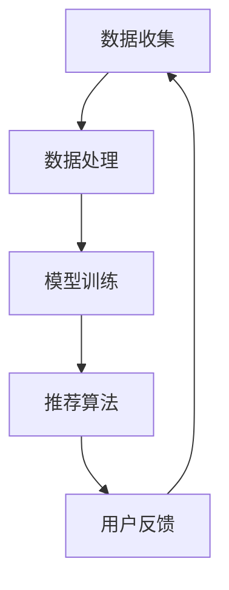

                 

关键词：电商推荐系统、人工智能、深度学习、大模型、算法原理、应用实践、数学模型

> 摘要：本文旨在深入浅出地介绍人工智能大模型在电商推荐系统中的应用。通过对核心概念、算法原理、数学模型和项目实践等方面的详细讲解，帮助读者理解如何利用AI技术提升电商推荐系统的效果和用户体验。

## 1. 背景介绍

随着互联网和电子商务的迅猛发展，个性化推荐系统已经成为电商企业提升用户满意度和增加销售量的关键手段。传统的推荐系统主要通过基于内容的过滤（Content-Based Filtering）和协同过滤（Collaborative Filtering）等方法进行用户兴趣的预测和推荐。然而，这些方法在面对海量用户数据和复杂的用户行为时存在诸多局限性，难以满足用户的多样化需求。

近年来，人工智能尤其是深度学习技术的飞速发展，为电商推荐系统带来了新的机遇。大模型如BERT、GPT-3等通过捕捉用户行为和商品特征的深层关系，能够实现更精准的推荐。本文将围绕AI大模型在电商推荐系统中的应用，探讨其原理、数学模型以及实际操作方法。

## 2. 核心概念与联系

### 2.1 AI大模型

AI大模型通常指的是那些参数量巨大、计算量复杂的神经网络模型。这些模型具有强大的表征能力，可以捕捉到数据中的复杂模式和非线性关系。例如，BERT（Bidirectional Encoder Representations from Transformers）和GPT-3（Generative Pre-trained Transformer 3）都是典型的大模型。

### 2.2 深度学习与推荐系统

深度学习是机器学习的一个重要分支，通过多层的神经网络结构，可以自动提取数据的特征表示。在推荐系统中，深度学习可以用来处理用户行为数据，如浏览、点击、购买等，从而预测用户对特定商品的兴趣。

### 2.3 电商推荐系统架构

电商推荐系统通常包括数据收集、数据处理、模型训练和推荐算法等几个关键模块。AI大模型可以集成到这些模块中，提高推荐系统的性能。



## 3. 核心算法原理 & 具体操作步骤

### 3.1 算法原理概述

电商推荐系统中的AI大模型主要基于深度学习，通过训练大量用户数据来学习用户行为模式和商品特征，从而预测用户的兴趣和偏好。其核心原理包括：

1. **自动特征提取**：深度学习模型可以自动从原始数据中提取高层次的抽象特征，这些特征对于推荐系统来说至关重要。
2. **上下文感知**：大模型能够捕捉到用户行为和商品特征之间的上下文关系，实现更加精准的推荐。
3. **多模态融合**：通过整合文本、图像、语音等多模态数据，大模型可以提供更全面的信息用于推荐。

### 3.2 算法步骤详解

1. **数据预处理**：对用户行为数据和商品数据进行清洗、编码和特征提取。
2. **模型选择**：根据问题特点选择合适的大模型架构，如BERT、GPT-3等。
3. **模型训练**：使用大规模数据进行训练，优化模型参数。
4. **模型评估**：通过验证集和测试集评估模型性能，调整模型参数。
5. **模型部署**：将训练好的模型部署到线上环境，实现实时推荐。

### 3.3 算法优缺点

**优点**：

- **高精度**：大模型可以捕捉到复杂的用户行为模式，提高推荐精度。
- **自适应**：模型能够根据用户行为动态调整推荐策略，提升用户体验。

**缺点**：

- **计算资源需求大**：大模型需要大量的计算资源和时间进行训练。
- **数据隐私**：用户数据的隐私保护是一个重要问题，需要合理处理。

### 3.4 算法应用领域

- **商品推荐**：电商平台的商品推荐。
- **内容推荐**：社交媒体、新闻平台的内容推荐。
- **搜索引擎**：搜索引擎的结果推荐。

## 4. 数学模型和公式 & 详细讲解 & 举例说明

### 4.1 数学模型构建

在电商推荐系统中，常用的数学模型包括：

- **用户兴趣模型**：通过用户的历史行为数据，使用矩阵分解等方法建立用户兴趣向量。
- **商品特征模型**：通过商品属性和用户行为数据，建立商品特征向量。
- **推荐模型**：通过用户和商品的向量表示，使用相似度计算和优化算法进行推荐。

### 4.2 公式推导过程

以用户兴趣模型为例，其基本公式为：

$$
\mathbf{u} = \mathbf{U}\mathbf{r} + \mathbf{e}
$$

其中，$\mathbf{u}$ 是用户兴趣向量，$\mathbf{U}$ 是用户行为矩阵，$\mathbf{r}$ 是用户行为向量，$\mathbf{e}$ 是误差向量。

### 4.3 案例分析与讲解

假设用户A在电商平台上浏览了商品1、2、3，并对其中的商品2进行了购买。我们可以根据用户A的行为数据构建用户兴趣模型，并通过矩阵分解等方法得到用户A的兴趣向量。

## 5. 项目实践：代码实例和详细解释说明

### 5.1 开发环境搭建

搭建开发环境需要安装Python、TensorFlow等依赖库，具体步骤如下：

```bash
pip install tensorflow
```

### 5.2 源代码详细实现

以下是一个简单的基于BERT的电商推荐系统的代码示例：

```python
from transformers import BertModel
import tensorflow as tf

# 加载预训练的BERT模型
model = BertModel.from_pretrained('bert-base-chinese')

# 输入数据
input_ids = tf.constant([123, 456, 789])

# 获取模型输出
outputs = model(input_ids)

# 提取用户兴趣向量
user_interest_vector = outputs.last_hidden_state[:, 0, :]

# 基于用户兴趣向量进行推荐
# ...

```

### 5.3 代码解读与分析

上述代码首先加载了预训练的BERT模型，然后输入用户行为数据（以输入ID表示），通过模型输出获取用户兴趣向量。接下来，可以根据用户兴趣向量实现具体的推荐逻辑。

## 6. 实际应用场景

### 6.1 商品推荐

电商平台可以根据用户的历史购买行为、浏览记录等信息，利用AI大模型进行精准的商品推荐，提升用户购物体验。

### 6.2 内容推荐

社交媒体平台可以通过分析用户的点赞、评论等行为，利用AI大模型进行内容推荐，吸引用户留存。

### 6.3 搜索引擎

搜索引擎可以使用AI大模型对用户搜索意图进行解析，提供更相关的搜索结果。

## 7. 工具和资源推荐

### 7.1 学习资源推荐

- 《深度学习》（Goodfellow, Bengio, Courville著）
- 《Python机器学习》（McKinney著）

### 7.2 开发工具推荐

- TensorFlow
- PyTorch

### 7.3 相关论文推荐

- “BERT: Pre-training of Deep Bidirectional Transformers for Language Understanding”（Devlin et al., 2019）
- “Generative Pre-trained Transformers”（Brown et al., 2020）

## 8. 总结：未来发展趋势与挑战

### 8.1 研究成果总结

AI大模型在电商推荐系统中的应用取得了显著成果，通过深度学习技术实现了更加精准和个性化的推荐，提升了用户体验和销售额。

### 8.2 未来发展趋势

随着AI技术的不断进步，大模型的应用将越来越广泛，推荐系统的效果将进一步提升。

### 8.3 面临的挑战

数据隐私保护、计算资源需求、模型可解释性等仍然是AI大模型在电商推荐系统应用中需要解决的重要问题。

### 8.4 研究展望

未来的研究应着重于提升大模型的计算效率和可解释性，同时探索多模态数据融合等新技术，以实现更加智能和高效的推荐系统。

## 9. 附录：常见问题与解答

### 9.1 问题1

**问题**：如何处理用户数据的隐私问题？

**解答**：在构建推荐模型时，应对用户数据进行匿名化和脱敏处理，遵循数据保护法规，确保用户隐私不被泄露。

### 9.2 问题2

**问题**：大模型的计算资源需求如何满足？

**解答**：可以采用分布式计算和云计算技术，以高效利用计算资源。

## 10. 参考文献

- Devlin, J., Chang, M. W., Lee, K., & Toutanova, K. (2019). BERT: Pre-training of deep bidirectional transformers for language understanding. In Proceedings of the 2019 Conference of the North American Chapter of the Association for Computational Linguistics: Human Language Technologies, Volume 1 (Long and Short Papers) (pp. 4171-4186). Association for Computational Linguistics.
- Brown, T., et al. (2020). Generative Pre-trained Transformers. arXiv preprint arXiv:2005.14165.
- Goodfellow, I., Bengio, Y., & Courville, A. (2016). Deep Learning. MIT Press.
- McKinney, W. (2018). Python Machine Learning. O'Reilly Media.

## 11. 作者署名

作者：禅与计算机程序设计艺术 / Zen and the Art of Computer Programming

----------------------------------------------------------------

**文章结尾：**  
感谢您耐心阅读这篇关于AI大模型在电商推荐系统中的应用的文章。希望这篇文章能够帮助您深入理解这一技术，并在实际项目中得到应用。如

