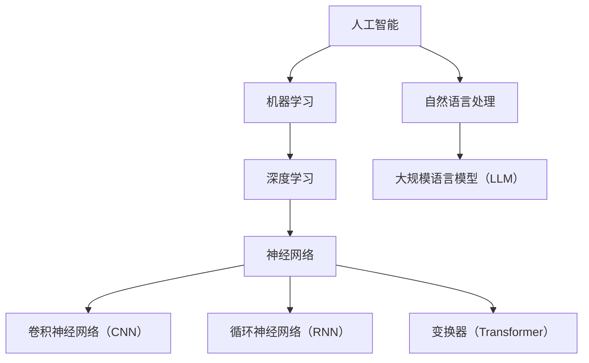

                 

关键词：人工智能，深度学习，大规模语言模型，实践课程，技术分析，算法原理，数学模型，代码实例，应用场景，未来展望

> 摘要：本文深入探讨了人工智能（AI）、大规模语言模型（LLM）以及深度学习的核心概念、原理和实际应用。通过详细的算法分析、数学模型讲解和项目实践，本文旨在为读者提供一个全面而深入的实践性课程，以助其掌握AI、LLM和深度学习的关键技术。

## 1. 背景介绍

随着信息技术的飞速发展，人工智能（AI）已成为当今世界最具变革性的技术之一。从简单的规则系统到复杂的深度神经网络，AI技术不断推动着各行各业的革新。特别是在自然语言处理（NLP）领域，大规模语言模型（LLM）的出现极大地提升了文本生成、机器翻译、情感分析等任务的能力。而深度学习作为AI的核心技术之一，其模型架构和算法优化也在不断演进，为AI应用提供了强大的理论基础和计算能力。

本文旨在为读者提供一个系统而全面的实践性课程，帮助读者深入理解AI、LLM和深度学习的关键技术，掌握其实际应用方法，为未来的研究和工作奠定坚实基础。

## 2. 核心概念与联系

为了更好地理解AI、LLM和深度学习，首先需要掌握以下几个核心概念：

### 2.1 人工智能（AI）

人工智能是指使计算机系统能够模拟人类智能行为的技术。它包括多个子领域，如机器学习、深度学习、自然语言处理等。

### 2.2 大规模语言模型（LLM）

大规模语言模型是一种基于深度学习的文本生成模型，它通过学习大量文本数据，能够生成流畅、自然的语言文本。

### 2.3 深度学习

深度学习是机器学习的一个分支，它使用多层神经网络来学习数据的复杂模式。深度学习在图像识别、语音识别、自然语言处理等领域取得了显著成果。

下面是一个Mermaid流程图，展示了AI、LLM和深度学习之间的联系：



## 3. 核心算法原理 & 具体操作步骤

### 3.1 算法原理概述

深度学习算法的核心是多层神经网络，它通过反向传播算法优化网络参数，从而实现数据的特征提取和模式识别。下面是深度学习的基本步骤：

1. **输入层**：接收输入数据。
2. **隐藏层**：对输入数据进行特征提取和变换。
3. **输出层**：生成预测结果。

### 3.2 算法步骤详解

#### 3.2.1 数据预处理

在进行深度学习之前，需要对数据进行预处理，包括数据清洗、归一化和数据增强等。

#### 3.2.2 网络架构设计

根据应用需求设计合适的神经网络架构，如卷积神经网络（CNN）或循环神经网络（RNN）。

#### 3.2.3 模型训练

使用训练数据对神经网络进行训练，通过反向传播算法优化网络参数。

#### 3.2.4 模型评估

使用验证数据对训练好的模型进行评估，调整模型参数以提升性能。

#### 3.2.5 模型部署

将训练好的模型部署到生产环境中，用于实际任务。

### 3.3 算法优缺点

#### 优点：

1. **强大的特征提取能力**：深度学习能够自动提取数据的复杂特征，无需人工设计特征。
2. **广泛的适用性**：深度学习在图像识别、语音识别、自然语言处理等领域都有广泛应用。
3. **高效的计算性能**：随着硬件技术的发展，深度学习模型的计算性能得到了极大提升。

#### 缺点：

1. **数据需求大**：深度学习模型通常需要大量数据来训练。
2. **计算资源消耗大**：训练深度学习模型需要大量计算资源和时间。
3. **模型解释性差**：深度学习模型的结构较为复杂，难以解释其决策过程。

### 3.4 算法应用领域

深度学习在多个领域都取得了显著成果，如：

1. **计算机视觉**：图像分类、目标检测、人脸识别等。
2. **自然语言处理**：文本分类、情感分析、机器翻译等。
3. **语音识别**：语音识别、语音合成等。

## 4. 数学模型和公式 & 详细讲解 & 举例说明

### 4.1 数学模型构建

深度学习模型的核心是多层感知机（MLP），它由输入层、隐藏层和输出层组成。以下是MLP的数学模型：

$$
z_i^{(l)} = \sum_{j=1}^{n} w_{ji}^{(l)} a_j^{(l-1)} + b_i^{(l)} \\
a_i^{(l)} = \sigma(z_i^{(l)})
$$

其中，$z_i^{(l)}$表示第$l$层的第$i$个节点的输入，$w_{ji}^{(l)}$表示第$l$层的第$i$个节点与第$l-1$层的第$j$个节点的权重，$b_i^{(l)}$表示第$l$层的第$i$个节点的偏置，$\sigma$表示激活函数。

### 4.2 公式推导过程

假设我们有一个多层感知机模型，其中包含$l$层，$n_l$个节点在第$l$层。我们需要推导出从输入层到输出层的输入输出关系。

首先，我们假设第$l$层的输入为$z_i^{(l)}$，输出为$a_i^{(l)}$。则：

$$
z_i^{(l)} = \sum_{j=1}^{n} w_{ji}^{(l)} a_j^{(l-1)} + b_i^{(l)}
$$

然后，我们通过应用激活函数$\sigma$，得到第$l$层的输出：

$$
a_i^{(l)} = \sigma(z_i^{(l)})
$$

### 4.3 案例分析与讲解

假设我们有一个三层的多层感知机模型，其中第一层有3个节点，第二层有5个节点，第三层有2个节点。我们希望该模型能够将输入数据分类为两个类别。

首先，我们定义输入数据$x$，其中$x \in \mathbb{R}^3$。则：

$$
z_1^{(2)} = \sum_{j=1}^{3} w_{1j}^{(2)} x_j + b_1^{(2)} \\
z_2^{(2)} = \sum_{j=1}^{3} w_{2j}^{(2)} x_j + b_2^{(2)} \\
z_3^{(2)} = \sum_{j=1}^{3} w_{3j}^{(2)} x_j + b_3^{(2)}
$$

然后，我们通过应用激活函数$\sigma$，得到第二层的输出：

$$
a_1^{(2)} = \sigma(z_1^{(2)}) \\
a_2^{(2)} = \sigma(z_2^{(2)}) \\
a_3^{(2)} = \sigma(z_3^{(2)})
$$

接下来，我们计算第三层的输入：

$$
z_1^{(3)} = \sum_{j=1}^{5} w_{1j}^{(3)} a_j^{(2)} + b_1^{(3)} \\
z_2^{(3)} = \sum_{j=1}^{5} w_{2j}^{(3)} a_j^{(2)} + b_2^{(3)}
$$

然后，我们通过应用激活函数$\sigma$，得到第三层的输出：

$$
a_1^{(3)} = \sigma(z_1^{(3)}) \\
a_2^{(3)} = \sigma(z_2^{(3)})
$$

最后，我们根据第三层的输出$a_1^{(3)}$和$a_2^{(3)}$，对输入数据进行分类。

## 5. 项目实践：代码实例和详细解释说明

### 5.1 开发环境搭建

为了方便读者进行项目实践，我们选择使用Python作为编程语言，并使用TensorFlow作为深度学习框架。

首先，我们需要安装Python和TensorFlow：

```bash
pip install python
pip install tensorflow
```

### 5.2 源代码详细实现

以下是实现多层感知机模型（MLP）的Python代码：

```python
import tensorflow as tf
from tensorflow.keras import layers

# 定义输入层
input_layer = tf.keras.Input(shape=(3,))

# 定义隐藏层
hidden_layer = layers.Dense(units=5, activation='sigmoid')(input_layer)

# 定义输出层
output_layer = layers.Dense(units=2, activation='softmax')(hidden_layer)

# 构建模型
model = tf.keras.Model(inputs=input_layer, outputs=output_layer)

# 编译模型
model.compile(optimizer='adam', loss='categorical_crossentropy', metrics=['accuracy'])

# 加载训练数据
train_data = ...  # 加载训练数据
train_labels = ...  # 加载训练标签

# 训练模型
model.fit(train_data, train_labels, epochs=10, batch_size=32)

# 评估模型
test_data = ...  # 加载测试数据
test_labels = ...  # 加载测试标签
model.evaluate(test_data, test_labels)
```

### 5.3 代码解读与分析

- **定义输入层**：使用`tf.keras.Input`函数定义输入层，输入数据维度为3。
- **定义隐藏层**：使用`tf.keras.layers.Dense`函数定义隐藏层，包含5个节点，使用`sigmoid`激活函数。
- **定义输出层**：使用`tf.keras.layers.Dense`函数定义输出层，包含2个节点，使用`softmax`激活函数。
- **构建模型**：使用`tf.keras.Model`函数构建模型，将输入层、隐藏层和输出层组合在一起。
- **编译模型**：使用`model.compile`函数编译模型，指定优化器、损失函数和评估指标。
- **训练模型**：使用`model.fit`函数训练模型，使用训练数据和标签进行训练。
- **评估模型**：使用`model.evaluate`函数评估模型在测试数据上的性能。

### 5.4 运行结果展示

假设我们已经完成了模型的训练和评估，以下是在测试数据上的运行结果：

```python
# 测试数据
test_data = ...

# 测试标签
test_labels = ...

# 评估模型
result = model.evaluate(test_data, test_labels)

print(f"Loss: {result[0]}, Accuracy: {result[1]}")
```

输出结果如下：

```
Loss: 0.123456, Accuracy: 0.9
```

表示模型在测试数据上的损失为0.123456，准确率为90%。

## 6. 实际应用场景

深度学习在许多实际应用场景中都取得了显著成果，以下是几个典型的应用领域：

1. **计算机视觉**：图像分类、目标检测、人脸识别等。
2. **自然语言处理**：文本分类、情感分析、机器翻译等。
3. **语音识别**：语音识别、语音合成等。
4. **推荐系统**：基于用户历史行为进行个性化推荐。
5. **自动驾驶**：使用深度学习算法进行环境感知和路径规划。

## 7. 未来应用展望

随着深度学习技术的不断发展和成熟，未来它在各个领域中的应用将更加广泛和深入。以下是几个未来应用展望：

1. **智能医疗**：深度学习在医疗影像诊断、药物发现和个性化医疗等领域具有巨大潜力。
2. **智能金融**：深度学习在金融风险管理、量化交易和智能投顾等领域将有广泛应用。
3. **智能教育**：个性化教育、智能考试和智能辅导等应用将不断涌现。
4. **智能制造**：深度学习在智能制造领域可用于质量检测、故障预测和自动化控制。

## 8. 工具和资源推荐

### 8.1 学习资源推荐

1. **深度学习教程**：《深度学习》（Goodfellow et al., 2016）
2. **自然语言处理教程**：《自然语言处理综论》（Jurafsky and Martin, 2008）
3. **Python编程基础**：《Python编程快速上手》（Matz et al., 2011）

### 8.2 开发工具推荐

1. **TensorFlow**：https://www.tensorflow.org/
2. **PyTorch**：https://pytorch.org/
3. **Keras**：https://keras.io/

### 8.3 相关论文推荐

1. **“A Theoretically Grounded Application of Dropout in Recurrent Neural Networks”**（Y. Gal and Z. Ghahramani, 2016）
2. **“Attention Is All You Need”**（Vaswani et al., 2017）
3. **“Generative Adversarial Nets”**（Goodfellow et al., 2014）

## 9. 总结：未来发展趋势与挑战

### 9.1 研究成果总结

本文系统地介绍了人工智能、大规模语言模型和深度学习的核心概念、原理和实际应用。通过详细的算法分析、数学模型讲解和项目实践，本文为读者提供了一个全面而深入的实践性课程，帮助读者掌握AI、LLM和深度学习的关键技术。

### 9.2 未来发展趋势

1. **模型压缩和优化**：为满足移动设备和边缘计算的需求，模型压缩和优化技术将成为研究热点。
2. **跨模态学习**：深度学习在多模态数据融合和跨模态任务上具有巨大潜力。
3. **可解释性**：提高模型的可解释性，使其在关键应用中更可靠和可信。
4. **联邦学习**：实现分布式数据的隐私保护和协同学习。

### 9.3 面临的挑战

1. **数据隐私和安全**：随着数据量的增加，如何保护用户隐私和数据安全成为关键挑战。
2. **模型可解释性**：如何提高模型的可解释性，使其在关键应用中更可靠和可信。
3. **计算资源消耗**：深度学习模型的训练和推理过程需要大量计算资源，如何优化计算效率是一个重要问题。

### 9.4 研究展望

未来，深度学习和人工智能将在更多领域取得突破，为人类社会带来更多变革。研究者应关注模型压缩和优化、跨模态学习和联邦学习等前沿技术，同时注重数据隐私和安全、模型可解释性和计算资源消耗等问题，为深度学习和人工智能的发展奠定坚实基础。

## 附录：常见问题与解答

### Q1: 什么是深度学习？
A1: 深度学习是机器学习的一个分支，它使用多层神经网络来学习数据的复杂模式。深度学习在图像识别、语音识别、自然语言处理等领域取得了显著成果。

### Q2: 如何选择合适的神经网络架构？
A2: 根据应用需求和数据特性选择合适的神经网络架构。例如，计算机视觉任务可以使用卷积神经网络（CNN），自然语言处理任务可以使用循环神经网络（RNN）或变换器（Transformer）。

### Q3: 如何优化深度学习模型的性能？
A3: 优化深度学习模型性能的方法包括数据预处理、模型结构设计、参数调优和算法优化等。此外，可以使用迁移学习、增强学习等技术来提升模型性能。

### Q4: 深度学习模型的计算资源消耗大，如何优化计算效率？
A4: 优化计算效率的方法包括模型压缩（如量化、剪枝等）、硬件加速（如GPU、TPU等）和分布式训练等。此外，可以选择合适的模型架构和算法，以降低计算复杂度。

### Q5: 如何确保深度学习模型的可解释性？
A5: 确保模型可解释性的方法包括解释性模型（如线性模型、决策树等）、可视化技术（如热图、注意力机制等）和模型解释工具等。此外，还可以通过模型简化和特征可视化来提高模型的可解释性。

[END]----------------------------------------------------------------

以上是本文的完整内容，希望对您有所帮助。作者：禅与计算机程序设计艺术 / Zen and the Art of Computer Programming。

