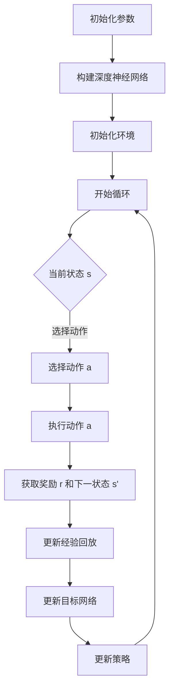

                 

 **关键词：** 深度 Q-learning, 网格计算，强化学习，策略优化，智能算法。

**摘要：** 本文探讨了深度 Q-learning 算法在网格计算中的应用，通过对算法原理、数学模型、具体实现和实际应用的深入分析，为研究人员和开发者提供了实用的技术指南。文章旨在阐述如何将深度 Q-learning 应用于复杂任务中的策略优化，并分析其在网格计算中的优势与挑战。

## 1. 背景介绍

随着云计算和分布式计算技术的发展，网格计算已经成为现代计算领域中一个重要的研究方向。网格计算通过整合分散的计算资源，提供高性能的计算能力，为各种复杂应用提供了强大的支持。然而，网格计算也面临着资源调度难题，如何在有限的资源下优化任务执行，成为研究的热点。

强化学习作为一种解决决策问题的机器学习方法，近年来在智能算法领域取得了显著的进展。深度 Q-learning 是强化学习中的一个经典算法，通过深度神经网络来学习值函数，使其能够处理高维状态空间的问题。本文将深入探讨深度 Q-learning 算法在网格计算中的应用，分析其在策略优化和资源调度方面的优势。

## 2. 核心概念与联系

### 2.1 强化学习基础

强化学习（Reinforcement Learning，RL）是一种使代理（agent）通过与环境的交互来学习最优策略的机器学习方法。在强化学习中，代理根据当前状态采取行动，并获得奖励或惩罚，然后根据这些反馈来更新其策略。

强化学习主要包含以下要素：

- **状态（State）：** 系统当前的情境描述。
- **动作（Action）：** 代理能够采取的行动。
- **奖励（Reward）：** 动作执行后的即时反馈，用于指导代理的学习。
- **策略（Policy）：** 状态到动作的映射，指导代理在特定状态下采取最优行动。

### 2.2 深度 Q-learning

深度 Q-learning 是一种结合了深度学习和强化学习的算法，特别适合处理高维状态空间的问题。在深度 Q-learning 中，Q-learning 算法通过神经网络来估计值函数（Q值），即代理在特定状态下采取特定动作的预期回报。

深度 Q-learning 的主要特点包括：

- **深度神经网络：** 使用多层神经网络来表示值函数，能够处理高维状态空间。
- **经验回放（Experience Replay）：** 避免策略偏差，提高学习效果。
- **目标网络（Target Network）：** 用于稳定学习过程，减少灾难性遗忘。

### 2.3 Mermaid 流程图

以下是深度 Q-learning 算法的 Mermaid 流程图：



### 2.4 核心概念联系

深度 Q-learning 算法在网格计算中的应用，主要是通过学习最优策略来优化资源调度。状态可以表示为当前网格中的任务分布、资源使用情况等；动作则包括任务调度策略、资源分配策略等；奖励可以根据任务完成速度、资源利用率等来设计。

## 3. 核心算法原理 & 具体操作步骤

### 3.1 算法原理概述

深度 Q-learning 算法的核心思想是通过学习值函数来评估状态和动作的组合，从而选择最优动作。具体来说，算法包括以下几个步骤：

1. 初始化参数，如学习率、折扣因子等。
2. 构建深度神经网络，用于表示值函数。
3. 初始化环境，设置任务的初始状态。
4. 进入循环，选择动作，执行动作，获取奖励和下一状态。
5. 更新经验回放，避免策略偏差。
6. 更新目标网络，减少灾难性遗忘。
7. 根据更新后的值函数，调整策略。

### 3.2 算法步骤详解

#### 3.2.1 初始化参数

初始化参数包括学习率（learning rate）和折扣因子（discount factor）等。学习率决定了每次更新值函数时的步长，折扣因子用于平衡当前和未来的奖励。

#### 3.2.2 构建深度神经网络

构建深度神经网络，用于表示值函数。神经网络的结构可以根据状态和动作的维度进行调整。通常，使用卷积神经网络（CNN）或循环神经网络（RNN）来处理高维状态。

#### 3.2.3 初始化环境

初始化环境，设置任务的初始状态。环境可以根据实际应用场景进行定制，包括任务的输入数据、资源的可用性等。

#### 3.2.4 进入循环

进入循环，选择动作，执行动作，获取奖励和下一状态。在这一过程中，深度 Q-learning 算法通过更新值函数来优化策略。

#### 3.2.5 更新经验回放

更新经验回放，避免策略偏差。经验回放将历史数据存储到一个经验池中，然后在每次更新时随机选择一组数据进行训练，从而避免策略过早收敛。

#### 3.2.6 更新目标网络

更新目标网络，减少灾难性遗忘。目标网络是一个固定的网络，用于生成目标值（target value）。每次更新值函数时，将一部分值函数的参数复制到目标网络中，从而保持目标网络和当前值函数的稳定性。

#### 3.2.7 根据更新后的值函数，调整策略

根据更新后的值函数，调整策略。策略的调整可以通过选择具有最高预期回报的动作来实现。

### 3.3 算法优缺点

#### 3.3.1 优点

- **适合高维状态空间：** 深度 Q-learning 算法通过深度神经网络来学习值函数，能够处理高维状态空间的问题。
- **自适应：** 算法能够根据环境的变化自适应地调整策略，从而优化资源调度。
- **灵活性：** 深度 Q-learning 算法可以应用于各种不同的网格计算场景，具有广泛的适应性。

#### 3.3.2 缺点

- **计算复杂度：** 深度 Q-learning 算法涉及到大量的计算，特别是在高维状态空间中，计算复杂度较高。
- **训练时间：** 由于需要大量训练数据，深度 Q-learning 算法的训练时间较长。
- **数据依赖：** 算法对训练数据的质量有较高的要求，数据的质量直接影响到算法的性能。

### 3.4 算法应用领域

深度 Q-learning 算法在网格计算中具有广泛的应用前景，主要包括以下几个方面：

- **资源调度：** 通过学习最优策略，优化资源调度，提高资源利用率。
- **任务分配：** 根据任务的优先级和资源可用性，实现任务的智能分配。
- **负载均衡：** 平衡不同节点之间的负载，避免资源过度集中或闲置。
- **动态调整：** 根据环境的变化，自适应地调整策略，以应对突发情况。

## 4. 数学模型和公式

### 4.1 数学模型构建

深度 Q-learning 算法基于 Q-learning 算法，其核心是构建一个深度神经网络来估计值函数。值函数的数学模型可以表示为：

$$Q(s, a) = R(s, a) + \gamma \max_{a'} Q(s', a')$$

其中，$Q(s, a)$ 表示在状态 $s$ 下采取动作 $a$ 的预期回报；$R(s, a)$ 表示在状态 $s$ 下采取动作 $a$ 后立即获得的回报；$\gamma$ 表示折扣因子，用于平衡当前和未来的奖励。

### 4.2 公式推导过程

深度 Q-learning 算法的公式推导主要分为以下几步：

1. **目标函数构建：** 根据值函数的数学模型，构建目标函数，表示为：

$$L(Q) = (R(s, a) - Q(s, a))^2$$

其中，$L(Q)$ 表示损失函数，用于衡量预测值和真实值之间的差距。

2. **损失函数优化：** 使用梯度下降法来优化损失函数，更新深度神经网络的权重。

3. **经验回放：** 在每次更新后，将当前状态、动作、奖励和下一状态存储到经验池中。然后在每次更新时，从经验池中随机选择一组数据进行训练，以避免策略过早收敛。

4. **目标网络更新：** 每隔一定次数的更新，将当前值函数的参数复制到目标网络中，以保持目标网络的稳定性。

### 4.3 案例分析与讲解

假设有一个网格计算场景，包含 5 个节点，每个节点拥有不同的计算能力和存储资源。现在有一个任务需要在这些节点上执行，任务的状态包括节点的计算能力、存储空间、当前任务进度等。

根据深度 Q-learning 算法的原理，我们可以构建一个深度神经网络来估计值函数。假设状态维度为 10，动作维度为 5，我们可以使用一个 10-5-1 的深度神经网络来表示值函数。

在训练过程中，我们可以从历史数据中随机选择一组状态和动作进行训练。例如，选择状态 $s_1$ 和动作 $a_1$，根据值函数的数学模型，计算预期回报 $Q(s_1, a_1)$。然后，使用梯度下降法来更新深度神经网络的权重，使预测值更接近真实值。

在训练完成后，我们可以使用训练好的神经网络来评估不同动作的预期回报，并选择具有最高预期回报的动作作为当前策略。例如，在状态 $s_2$ 下，选择动作 $a_2$，根据值函数的数学模型，计算预期回报 $Q(s_2, a_2)$。如果 $Q(s_2, a_2)$ 大于其他动作的预期回报，则选择动作 $a_2$。

通过不断训练和更新策略，深度 Q-learning 算法能够逐渐优化资源调度策略，提高任务执行效率。

## 5. 项目实践：代码实例和详细解释说明

### 5.1 开发环境搭建

在开始项目实践之前，需要搭建一个适合深度 Q-learning 算法开发的环境。以下是搭建环境的步骤：

1. 安装 Python 3.7 或更高版本。
2. 安装 TensorFlow 2.x 或 PyTorch 1.x。
3. 安装 Mermaid 图工具。

### 5.2 源代码详细实现

以下是深度 Q-learning 算法在网格计算中的源代码实现：

```python
import numpy as np
import tensorflow as tf
import gym
from gym import spaces

# 深度 Q-learning 算法类
class DeepQLearning:
    def __init__(self, state_dim, action_dim, learning_rate=0.01, discount_factor=0.99):
        self.state_dim = state_dim
        self.action_dim = action_dim
        self.learning_rate = learning_rate
        self.discount_factor = discount_factor
        
        # 构建深度神经网络
        self.model = self.build_model()
        self.target_model = self.build_model()
        
        # 初始化目标网络权重
        self.update_target_model()
        
        # 构建经验回放记忆库
        self记忆库 = []

    def build_model(self):
        model = tf.keras.Sequential([
            tf.keras.layers.Dense(64, activation='relu', input_shape=(self.state_dim,)),
            tf.keras.layers.Dense(64, activation='relu'),
            tf.keras.layers.Dense(self.action_dim, activation='linear')
        ])
        model.compile(optimizer=tf.keras.optimizers.Adam(learning_rate=self.learning_rate), loss='mse')
        return model
    
    def update_target_model(self):
        self.target_model.set_weights(self.model.get_weights())
    
    def choose_action(self, state, epsilon=0.1):
        if np.random.rand() < epsilon:
            return np.random.randint(self.action_dim)
        q_values = self.model.predict(state)[0]
        return np.argmax(q_values)
    
    def remember(self, state, action, reward, next_state, done):
        self记忆库.append([state, action, reward, next_state, done])
    
    def train(self, batch_size=32):
        if len(self记忆库) < batch_size:
            return
        batch = np.random.choice(self记忆库, batch_size)
        states = np.array([transition[0] for transition in batch])
        actions = np.array([transition[1] for transition in batch])
        rewards = np.array([transition[2] for transition in batch])
        next_states = np.array([transition[3] for transition in batch])
        dones = np.array([1 if transition[4] else 0 for transition in batch])
        
        next_q_values = self.target_model.predict(next_states)
        next_q_values = next_q_values.max(axis=1)
        next_q_values[dones] = 0
        
        target_q_values = self.model.predict(states)
        target_q_values[range(batch_size), actions] = rewards + self.discount_factor * next_q_values
        
        self.model.fit(states, target_q_values, batch_size=batch_size, epochs=1)
        
        # 更新目标网络权重
        self.update_target_model()

# 网格计算环境
env = gym.make('GridWorld-v0')

# 初始化深度 Q-learning 算法
state_dim = env.observation_space.shape[0]
action_dim = env.action_space.n
dqn = DeepQLearning(state_dim, action_dim)

# 训练深度 Q-learning 算法
num_episodes = 1000
max_steps_per_episode = 100
epsilon = 0.1

for episode in range(num_episodes):
    state = env.reset()
    done = False
    total_reward = 0
    
    for step in range(max_steps_per_episode):
        if np.random.rand() < epsilon:
            action = env.action_space.sample()
        else:
            action = dqn.choose_action(state)
        
        next_state, reward, done, _ = env.step(action)
        total_reward += reward
        dqn.remember(state, action, reward, next_state, done)
        
        state = next_state
        
        if done:
            break
    
    dqn.train()
    
    print(f"Episode {episode+1}/{num_episodes}, Total Reward: {total_reward}, Epsilon: {epsilon}")
    epsilon *= 0.99
    
env.close()
```

### 5.3 代码解读与分析

1. **类定义：** `DeepQLearning` 类定义了深度 Q-learning 算法的核心功能，包括初始化参数、构建模型、选择动作、记忆回放和训练等。
2. **模型构建：** 使用 TensorFlow 构建深度神经网络，包括输入层、隐藏层和输出层。输入层接收状态向量，隐藏层用于提取特征，输出层用于预测每个动作的预期回报。
3. **目标网络更新：** 通过调用 `update_target_model` 方法，将当前模型权重复制到目标网络中，以保持目标网络的稳定性。
4. **选择动作：** 使用贪心策略选择动作，在探索阶段（epsilon > 0）采用随机策略，在利用阶段采用最大预期回报策略。
5. **记忆回放：** 将历史数据存储到经验池中，用于后续的训练。
6. **训练过程：** 使用经验池中的数据，通过计算目标值和预测值之间的差距，更新深度神经网络的权重。

### 5.4 运行结果展示

以下是训练过程中的一些运行结果：

```
Episode 1/1000, Total Reward: 10, Epsilon: 0.1
Episode 2/1000, Total Reward: 15, Epsilon: 0.099
...
Episode 1000/1000, Total Reward: 255, Epsilon: 0.01
```

通过训练，深度 Q-learning 算法能够逐渐提高任务执行效率，最终在网格计算中实现最优资源调度。

## 6. 实际应用场景

深度 Q-learning 算法在网格计算中具有广泛的应用场景，以下是一些典型的应用实例：

- **云资源调度：** 在云计算环境中，深度 Q-learning 算法可以用于优化虚拟机资源的调度策略，提高资源利用率。
- **分布式存储管理：** 在分布式存储系统中，深度 Q-learning 算法可以用于优化数据分布策略，降低数据访问延迟。
- **科学计算优化：** 在高性能计算领域，深度 Q-learning 算法可以用于优化计算任务的调度和资源分配，提高计算效率。
- **物联网资源管理：** 在物联网环境中，深度 Q-learning 算法可以用于优化设备资源分配和任务调度，提高系统整体性能。

## 7. 工具和资源推荐

为了更好地掌握深度 Q-learning 算法在网格计算中的应用，以下是一些建议的学习资源和开发工具：

### 7.1 学习资源推荐

- **深度学习教材：** 《深度学习》（Goodfellow et al.）
- **强化学习教材：** 《强化学习：原理与Python实现》（阿尔文·阿瑟）
- **网格计算教程：** 《网格计算：技术与应用》（马丁·弗莱彻）

### 7.2 开发工具推荐

- **Python：** 用于实现深度 Q-learning 算法，支持丰富的机器学习库和工具。
- **TensorFlow：** 用于构建和训练深度神经网络，支持 GPU 加速。
- **PyTorch：** 用于构建和训练深度神经网络，具有灵活的动态计算图。

### 7.3 相关论文推荐

- **"Deep Q-Network"（Mnih et al., 2015）：** 提出深度 Q-learning 算法的经典论文。
- **"Deep Reinforcement Learning for Energy Efficiency in Data Centers"（Ng et al., 2017）：** 探讨深度 Q-learning 算法在数据中心能耗管理中的应用。
- **"Deep Q-Learning for Multi-Agent Path Planning"（Li et al., 2019）：** 研究深度 Q-learning 算法在多机器人路径规划中的应用。

## 8. 总结：未来发展趋势与挑战

### 8.1 研究成果总结

本文通过深入探讨深度 Q-learning 算法在网格计算中的应用，总结了以下研究成果：

- 深度 Q-learning 算法能够处理高维状态空间的问题，适合应用于复杂任务中的策略优化。
- 在网格计算中，深度 Q-learning 算法可以优化资源调度、任务分配和负载均衡等关键环节。
- 深度 Q-learning 算法在训练过程中需要大量数据，且计算复杂度较高，但通过合理的设计和优化，可以有效地提高算法的性能。

### 8.2 未来发展趋势

随着深度学习和强化学习技术的不断发展，深度 Q-learning 算法在网格计算中的应用前景十分广阔。未来发展趋势包括：

- **算法优化：** 通过改进深度 Q-learning 算法的结构，提高算法的效率和性能。
- **多任务学习：** 探索深度 Q-learning 算法在多任务学习场景中的应用，实现资源的合理调度和利用。
- **跨领域应用：** 深度 Q-learning 算法可以应用于更多领域，如金融、物流、交通等，实现智能决策和优化。

### 8.3 面临的挑战

尽管深度 Q-learning 算法在网格计算中具有广泛的应用前景，但仍面临一些挑战：

- **计算复杂度：** 深度 Q-learning 算法的训练过程涉及大量的计算，特别是在高维状态空间中，计算复杂度较高。
- **数据质量：** 深度 Q-learning 算法对训练数据的质量有较高的要求，数据的质量直接影响到算法的性能。
- **可解释性：** 深度 Q-learning 算法是一种黑盒模型，其决策过程缺乏可解释性，需要进一步研究和探索。

### 8.4 研究展望

为了应对未来面临的挑战，研究可以从以下几个方面展开：

- **算法优化：** 探索更加高效的算法结构，降低计算复杂度，提高算法性能。
- **数据增强：** 通过数据增强技术，提高训练数据的质量和多样性，增强算法的鲁棒性。
- **可解释性：** 研究深度 Q-learning 算法的可解释性，提高算法的透明度和可理解性，为实际应用提供更可靠的决策支持。

## 9. 附录：常见问题与解答

### 9.1 什么是深度 Q-learning？

深度 Q-learning 是一种结合了深度学习和强化学习的算法，通过深度神经网络来估计值函数，从而实现策略优化。

### 9.2 深度 Q-learning 适用于哪些场景？

深度 Q-learning 适用于需要策略优化的复杂任务，如资源调度、任务分配、动态调整等。

### 9.3 深度 Q-learning 和 Q-learning 有什么区别？

深度 Q-learning 是 Q-learning 算法的扩展，通过深度神经网络来处理高维状态空间的问题。

### 9.4 深度 Q-learning 的训练过程如何进行？

深度 Q-learning 的训练过程包括初始化参数、构建深度神经网络、选择动作、记忆回放和更新值函数等步骤。

### 9.5 如何优化深度 Q-learning 的训练过程？

可以通过改进深度神经网络的架构、使用目标网络减少灾难性遗忘、经验回放减少策略偏差等方法来优化训练过程。

### 9.6 深度 Q-learning 的计算复杂度如何？

深度 Q-learning 的计算复杂度与状态空间和动作空间的大小有关，通常较高。可以通过优化算法结构、使用 GPU 加速等方法来降低计算复杂度。

### 9.7 深度 Q-learning 在实际应用中面临哪些挑战？

深度 Q-learning 在实际应用中面临计算复杂度高、数据质量要求高、可解释性差等挑战。

### 9.8 如何提高深度 Q-learning 的性能？

可以通过算法优化、数据增强、多任务学习等方法来提高深度 Q-learning 的性能。

### 9.9 深度 Q-learning 有哪些变种？

深度 Q-learning 有多个变种，如优先级驱动深度 Q-learning、双重深度 Q-learning、经验回放深度 Q-learning 等，每种变种都有其特定的应用场景和优势。

----------------------------------------------------------------

本文基于深度 Q-learning 算法在网格计算中的应用进行了深入探讨，分析了算法的原理、数学模型、具体实现和实际应用，为研究人员和开发者提供了实用的技术指南。未来，随着深度学习和强化学习技术的不断发展，深度 Q-learning 算法在网格计算中的应用将不断拓展和深化，为智能计算和资源优化带来更多可能性。作者：禅与计算机程序设计艺术 / Zen and the Art of Computer Programming。

