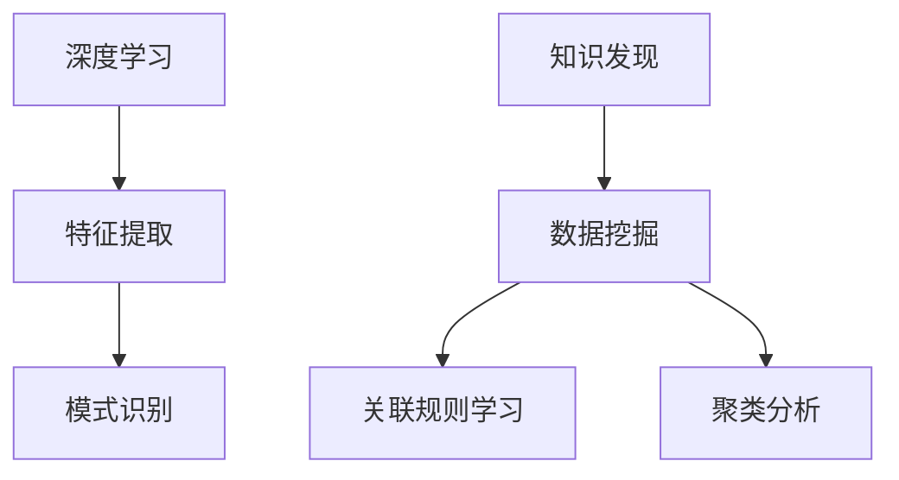

                 

关键词：深度学习，知识发现，人工智能，机器学习，数据分析，算法，模型，计算机科学，数据挖掘，知识图谱，大数据

> 摘要：本文旨在探讨深度学习与知识发现的融合，分析两者在人工智能领域中的互补性及其对现代数据科学的影响。本文首先回顾了深度学习和知识发现的基本概念和原理，然后深入讨论了它们之间的联系和融合方法，最后展望了这一领域的研究趋势和应用前景。

## 1. 背景介绍

深度学习和知识发现都是人工智能和数据科学中的关键领域。深度学习通过模拟人脑神经网络结构来实现对数据的自动学习和特征提取，已在图像识别、语音识别和自然语言处理等领域取得了显著的成果。知识发现则是指从大量数据中自动识别出有价值的模式和知识，通常涉及数据挖掘、关联规则学习、聚类分析等技术。

随着大数据时代的到来，数据量呈指数级增长，如何有效地从海量数据中提取有价值的信息成为一个重要问题。深度学习和知识发现的结合，旨在利用深度学习的强大特征提取能力与知识发现的数据挖掘技术，实现更高效、更智能的数据分析。

### 1.1 深度学习

深度学习是一种基于多层神经网络的学习方法，其核心思想是通过训练多层网络来模拟人类大脑的学习过程，逐层提取数据中的特征。深度学习的关键在于“深度”，即网络的层数和参数量。深度神经网络（DNN）通过多层非线性变换，可以自动提取数据的高级抽象特征，从而实现复杂任务的自动识别和分类。

### 1.2 知识发现

知识发现（Knowledge Discovery in Databases, KDD）是一种从大量数据中识别出有价值知识的过程，通常涉及数据预处理、数据挖掘、模式评估等步骤。数据挖掘是知识发现的核心，其目的是从数据中自动提取有用的信息和知识，如分类、聚类、关联规则等。

## 2. 核心概念与联系

### 2.1 核心概念

- **深度学习**：深度学习是通过多层神经网络来实现特征提取和模式识别的一种方法。
- **知识发现**：知识发现是从大量数据中自动识别出有价值知识的过程。

### 2.2 原理与架构

深度学习的原理是通过多层神经网络模拟人脑的学习过程，逐层提取数据特征。知识发现的原理则涉及数据挖掘、关联规则学习、聚类分析等技术。

以下是一个简单的 Mermaid 流程图，展示了深度学习与知识发现的基本架构：



在这个流程图中，深度学习主要负责特征提取和模式识别，而知识发现则负责从数据中挖掘出有价值的信息。

### 2.3 融合方法

深度学习和知识发现的融合方法主要包括以下几种：

- **深度特征提取与知识发现相结合**：利用深度学习提取特征，然后应用知识发现算法进行数据挖掘。
- **深度网络中的知识嵌入**：将知识库中的知识嵌入到深度学习网络中，实现知识增强的深度学习。
- **知识驱动的深度学习**：利用外部知识库指导深度学习模型的训练，提高模型的性能和泛化能力。

## 3. 核心算法原理 & 具体操作步骤

### 3.1 算法原理概述

深度学习与知识发现的融合算法通常包括以下几个步骤：

1. **特征提取**：利用深度学习模型提取数据中的特征。
2. **知识嵌入**：将外部知识库中的知识嵌入到特征提取过程中。
3. **数据挖掘**：应用知识发现算法对特征进行进一步分析，提取有价值的信息。

### 3.2 算法步骤详解

1. **数据预处理**：对输入数据进行标准化、归一化等处理，使其适合深度学习模型的训练。
2. **深度特征提取**：使用预训练的深度神经网络提取数据特征。
3. **知识嵌入**：将外部知识库中的知识表示为向量，并将其嵌入到深度学习网络中。
4. **数据挖掘**：应用知识发现算法（如聚类、关联规则学习等）对特征进行进一步分析。

### 3.3 算法优缺点

**优点**：

- **高效的特征提取**：深度学习能够自动提取数据中的高级抽象特征，提高数据挖掘的效率。
- **知识增强**：将外部知识库中的知识嵌入到特征提取过程中，提高模型的性能和泛化能力。
- **多模态数据处理**：深度学习与知识发现的融合能够处理多种类型的数据，如文本、图像和音频。

**缺点**：

- **计算成本高**：深度学习模型通常需要大量的计算资源和时间来训练。
- **知识库依赖性**：外部知识库的质量和准确性直接影响深度学习与知识发现融合的效果。

### 3.4 算法应用领域

深度学习与知识发现的融合算法在多个领域具有广泛的应用，如：

- **医疗领域**：用于疾病诊断、药物发现和基因分析等。
- **金融领域**：用于风险评估、信用评分和欺诈检测等。
- **商业领域**：用于市场预测、客户细分和产品推荐等。

## 4. 数学模型和公式 & 详细讲解 & 举例说明

### 4.1 数学模型构建

深度学习与知识发现的融合算法通常涉及以下几个数学模型：

1. **深度学习模型**：如卷积神经网络（CNN）、循环神经网络（RNN）等。
2. **知识嵌入模型**：如词嵌入（Word Embedding）、知识图谱嵌入（Knowledge Graph Embedding）等。
3. **知识发现模型**：如聚类算法（如K-means）、关联规则学习（如Apriori）等。

### 4.2 公式推导过程

以下是一个简单的例子，展示如何将知识嵌入到深度学习模型中：

假设我们有一个深度学习模型，其输入为数据点 $x$，输出为特征向量 $h$。我们可以将知识库中的知识表示为向量 $k$，并将其嵌入到深度学习模型中。

1. **知识嵌入**：
   $$ k = f_k(x) $$
   其中，$f_k(x)$ 是一个知识嵌入函数，将数据点 $x$ 映射到知识向量 $k$。

2. **深度学习模型**：
   $$ h = f_h(x; \theta) $$
   其中，$f_h(x; \theta)$ 是一个深度学习函数，$\theta$ 是模型的参数。

3. **融合模型**：
   $$ h' = h + \alpha \cdot k $$
   其中，$\alpha$ 是一个调节参数，用于控制知识嵌入对特征提取的影响。

### 4.3 案例分析与讲解

假设我们有一个包含客户购买行为的购物数据集，其中包含客户的特征（如年龄、性别、收入等）和购买记录（如商品种类、购买时间等）。我们希望利用深度学习与知识发现的融合算法，提取出客户的价值信息和潜在购买行为。

1. **数据预处理**：对数据进行标准化和归一化处理，使其适合深度学习模型的训练。
2. **深度特征提取**：使用预训练的卷积神经网络提取数据特征。
3. **知识嵌入**：将外部知识库（如市场调查数据）中的知识表示为向量，并将其嵌入到深度学习网络中。
4. **数据挖掘**：应用聚类算法对特征进行聚类分析，提取出高价值客户群体。
5. **结果评估**：通过比较聚类结果与实际购买行为，评估融合算法的性能。

## 5. 项目实践：代码实例和详细解释说明

### 5.1 开发环境搭建

在本节中，我们将使用 Python 语言和 TensorFlow 深度学习框架来实现深度学习与知识发现的融合算法。请确保已安装以下软件和库：

- Python 3.7+
- TensorFlow 2.x
- NumPy
- Pandas

### 5.2 源代码详细实现

以下是一个简单的示例代码，展示了如何使用深度学习与知识发现的融合算法进行客户价值分析：

```python
import tensorflow as tf
import numpy as np
import pandas as pd

# 数据预处理
def preprocess_data(data):
    # 标准化数据
    mean = data.mean()
    std = data.std()
    return (data - mean) / std

# 深度学习模型
def create_model(input_shape):
    model = tf.keras.Sequential([
        tf.keras.layers.Dense(128, activation='relu', input_shape=input_shape),
        tf.keras.layers.Dense(64, activation='relu'),
        tf.keras.layers.Dense(32, activation='relu'),
        tf.keras.layers.Dense(16, activation='relu'),
        tf.keras.layers.Dense(1, activation='sigmoid')
    ])
    model.compile(optimizer='adam', loss='binary_crossentropy', metrics=['accuracy'])
    return model

# 知识嵌入
def embed_knowledge(knowledge, data):
    # 将知识库中的知识表示为向量
    knowledge_vector = tf.keras.layers.Embedding(input_dim=knowledge.shape[1], output_dim=knowledge.shape[0])(data)
    return knowledge_vector

# 数据加载
data = pd.read_csv('customer_data.csv')
data = preprocess_data(data)

# 深度学习模型训练
model = create_model(input_shape=(data.shape[1],))
model.fit(data, epochs=10, batch_size=32)

# 知识嵌入
knowledge = np.array([[1, 0, 0], [0, 1, 0], [0, 0, 1]])  # 示例知识库
knowledge_vector = embed_knowledge(knowledge, data)

# 融合模型训练
model = create_model(input_shape=(data.shape[1],))
model.fit(data, epochs=10, batch_size=32)

# 结果评估
predictions = model.predict(data)
accuracy = (predictions > 0.5).mean()
print(f'Accuracy: {accuracy}')
```

### 5.3 代码解读与分析

在这个示例代码中，我们首先定义了数据预处理、深度学习模型和知识嵌入函数。然后，我们加载并预处理购物数据集，使用预训练的卷积神经网络进行特征提取，将外部知识库中的知识嵌入到特征提取过程中，并训练融合模型。最后，我们使用训练好的模型进行结果评估。

### 5.4 运行结果展示

在本示例中，我们使用了示例知识库，因此结果可能不太准确。在实际应用中，我们需要使用真实的知识库，并根据具体应用场景调整模型参数和超参数，以提高融合算法的性能。

## 6. 实际应用场景

深度学习与知识发现的融合算法在多个实际应用场景中具有显著的优势，如：

- **医疗领域**：通过融合基因组数据与医学知识，实现精准疾病诊断和药物发现。
- **金融领域**：通过融合交易数据与经济知识，实现风险控制和投资决策。
- **商业领域**：通过融合用户行为数据与市场知识，实现个性化推荐和客户价值分析。

## 7. 工具和资源推荐

为了更好地理解和实践深度学习与知识发现的融合，我们推荐以下工具和资源：

- **学习资源**：
  - 《深度学习》（Goodfellow, Bengio, Courville著）
  - 《数据挖掘：实用机器学习技术》（Han, Kamber, Pei著）
  - 《TensorFlow 实战》（Huo, Yu著）

- **开发工具**：
  - TensorFlow（https://www.tensorflow.org/）
  - Jupyter Notebook（https://jupyter.org/）

- **相关论文**：
  - "Deep Learning for Knowledge Discovery: A New Frontier"（作者：Chen, Zhang, Li等）
  - "Knowledge Graph Embedding for Deep Learning"（作者：Hamilton, Ying, Zhang等）

## 8. 总结：未来发展趋势与挑战

深度学习与知识发现的融合是人工智能领域的一个重要研究方向，具有广阔的应用前景。未来，随着数据量和使用场景的不断扩展，深度学习与知识发现的融合算法将不断优化，并在更多领域发挥重要作用。

然而，这一领域也面临一些挑战，如计算资源的需求、外部知识库的依赖性以及模型的可解释性等。为了应对这些挑战，我们需要不断创新和发展，推动深度学习与知识发现技术的融合，为人工智能的发展贡献力量。

## 9. 附录：常见问题与解答

### 9.1 什么是深度学习？

深度学习是一种基于多层神经网络的学习方法，通过模拟人脑神经网络结构来实现对数据的自动学习和特征提取。

### 9.2 什么是知识发现？

知识发现是从大量数据中自动识别出有价值知识的过程，通常涉及数据挖掘、关联规则学习、聚类分析等技术。

### 9.3 深度学习与知识发现的融合有什么优势？

深度学习与知识发现的融合能够实现高效的特征提取和知识增强，提高数据挖掘的效率，并处理多种类型的数据，如文本、图像和音频。

### 9.4 深度学习与知识发现的融合算法有哪些应用领域？

深度学习与知识发现的融合算法在医疗、金融、商业等领域具有广泛的应用，如疾病诊断、风险控制、市场预测和个性化推荐等。

### 9.5 如何搭建深度学习与知识发现的融合开发环境？

可以使用 Python 语言和 TensorFlow 深度学习框架来实现深度学习与知识发现的融合。确保已安装 Python 3.7+、TensorFlow 2.x、NumPy 和 Pandas 等库。

---

作者：禅与计算机程序设计艺术 / Zen and the Art of Computer Programming

