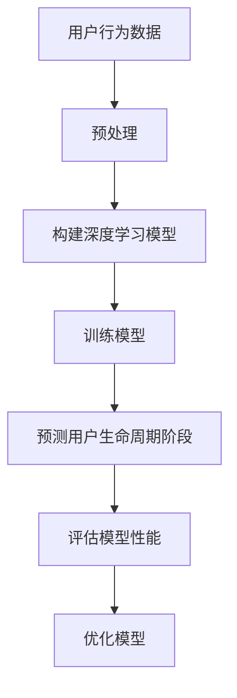
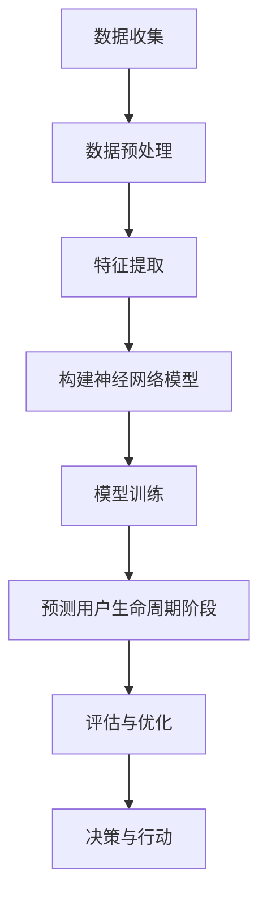

                 

关键词：用户生命周期预测、深度学习、神经网络、机器学习、数据分析、数据挖掘

摘要：本文将探讨深度学习在用户生命周期阶段预测中的应用。我们将介绍深度学习的基本原理，分析其在用户生命周期预测中的优势，并详细阐述一种新的方法。此外，还将探讨数学模型、实际应用案例和未来展望。

## 1. 背景介绍

在当今数字化时代，用户数据的重要性日益凸显。企业通过收集和分析用户数据，可以更好地理解用户行为，预测用户需求，从而提供个性化服务和产品。用户生命周期阶段预测是数据分析中的一项关键任务，它有助于企业制定有效的市场营销策略、提高用户留存率和转化率。

传统的用户生命周期阶段预测方法主要依赖于统计模型和机器学习方法。然而，这些方法往往存在一些局限性。首先，它们通常假设用户行为具有线性和可预测性，这在实际应用中往往是不准确的。其次，这些方法往往需要大量的特征工程，而特征工程的质量直接影响到预测结果的准确性。

为了克服这些局限性，深度学习逐渐成为一种新的有力工具。深度学习通过构建多层神经网络，能够自动从数据中学习特征，并在多种复杂数据集中表现出优异的性能。近年来，随着计算能力的提升和大数据技术的发展，深度学习在图像识别、自然语言处理和语音识别等领域取得了显著的突破。因此，将深度学习应用于用户生命周期阶段预测具有重要的理论和实践价值。

本文旨在介绍一种基于深度学习的新方法，用于预测用户生命周期阶段。我们将首先介绍深度学习的基本原理，然后分析其在用户生命周期预测中的应用，并详细阐述算法的具体实现步骤。此外，还将通过实际应用案例和数学模型来进一步说明该方法的有效性。

## 2. 核心概念与联系

### 2.1 深度学习基本概念

深度学习（Deep Learning）是机器学习（Machine Learning）的一个子领域，其核心思想是通过构建多层神经网络（Neural Networks），让计算机能够自动从数据中学习特征，从而实现复杂的预测和分类任务。深度学习在图像识别、语音识别、自然语言处理等领域取得了显著成果。

一个典型的深度学习模型由多个层次组成，包括输入层、隐藏层和输出层。输入层接收外部数据，隐藏层通过非线性变换提取特征，输出层生成最终的预测结果。深度学习的优势在于其能够自动学习复杂的数据特征，从而降低了对特征工程的需求。

### 2.2 用户生命周期阶段

用户生命周期阶段（User Life Cycle Stage）是指用户在一段时间内所经历的不同状态，通常包括引入期（Introduction）、增长期（Growth）、成熟期（Maturity）和衰退期（Decline）。每个阶段都有其独特的用户特征和行为模式。

用户生命周期阶段的预测对于企业制定市场营销策略、优化用户体验和提升用户留存率具有重要意义。传统的预测方法往往依赖于用户历史行为数据，但这些数据往往难以直接应用于深度学习模型。因此，需要一种新的方法，能够更好地处理复杂数据，提高预测准确性。

### 2.3 深度学习与用户生命周期阶段的联系

深度学习在用户生命周期阶段预测中的应用主要体现在以下几个方面：

1. **自动特征提取**：深度学习通过多层神经网络自动学习数据特征，减少了传统方法中复杂的特征工程步骤。
2. **非线性建模**：深度学习模型能够捕捉数据中的复杂非线性关系，提高预测准确性。
3. **大规模数据处理**：深度学习模型能够处理大规模的用户行为数据，从而更全面地反映用户生命周期特征。

为了更好地理解深度学习在用户生命周期阶段预测中的应用，我们采用Mermaid流程图来描述其基本架构：



### 2.4 Mermaid流程图

以下是深度学习在用户生命周期阶段预测中的Mermaid流程图：



在这个流程图中，数据收集阶段包括从各种渠道获取用户行为数据，如网站日志、社交媒体互动和用户反馈等。数据预处理阶段主要包括数据清洗、归一化和缺失值处理等。特征提取阶段使用深度学习模型自动提取数据中的关键特征。构建神经网络模型阶段包括设计神经网络结构、选择激活函数和损失函数等。模型训练阶段通过调整模型参数来优化预测结果。预测用户生命周期阶段生成用户生命周期阶段的预测结果，评估与优化阶段对模型进行性能评估和参数调整。决策与行动阶段根据预测结果制定相应的市场营销策略和用户服务方案。

## 3. 核心算法原理 & 具体操作步骤

### 3.1 算法原理概述

深度学习在用户生命周期阶段预测中的核心算法是基于深度神经网络（Deep Neural Network，DNN）。DNN由多个层次组成，包括输入层、隐藏层和输出层。输入层接收用户行为数据，隐藏层通过多层非线性变换提取数据中的关键特征，输出层生成用户生命周期阶段的预测结果。

DNN的训练过程主要包括以下步骤：

1. **前向传播（Forward Propagation）**：输入数据通过网络传播，经过每一层神经元的非线性变换，最终得到输出。
2. **计算损失（Compute Loss）**：根据输出结果与真实标签之间的差异，计算损失函数值。
3. **反向传播（Back Propagation）**：利用梯度下降（Gradient Descent）算法，将损失函数在神经网络中反向传播，更新模型参数。
4. **迭代优化（Iterative Optimization）**：重复上述过程，逐步减小损失函数值，优化模型参数。

### 3.2 算法步骤详解

1. **数据预处理**：
   - 数据清洗：去除缺失值、异常值和重复值。
   - 归一化：将数据缩放到同一尺度，便于模型训练。
   - 分割数据：将数据集分为训练集、验证集和测试集。

2. **构建深度神经网络模型**：
   - 设计网络结构：确定输入层、隐藏层和输出层的神经元数量。
   - 选择激活函数：如ReLU、Sigmoid、Tanh等。
   - 选择损失函数：如均方误差（MSE）、交叉熵损失（Cross-Entropy Loss）等。

3. **模型训练**：
   - 前向传播：输入数据通过网络传播，得到输出结果。
   - 计算损失：计算输出结果与真实标签之间的差异。
   - 反向传播：利用梯度下降算法，更新模型参数。
   - 迭代优化：重复前向传播和反向传播过程，逐步优化模型参数。

4. **预测用户生命周期阶段**：
   - 输入用户行为数据，通过训练好的模型进行预测。
   - 根据预测结果，确定用户所处的生命周期阶段。

5. **评估与优化**：
   - 评估模型性能：通过验证集和测试集评估模型准确性、召回率和F1值等指标。
   - 参数调整：根据评估结果，调整模型参数，优化预测性能。

### 3.3 算法优缺点

#### 优点：

1. **自动特征提取**：深度学习能够自动从数据中学习特征，减少了对传统特征工程的需求。
2. **非线性建模**：深度学习模型能够捕捉数据中的复杂非线性关系，提高预测准确性。
3. **大规模数据处理**：深度学习模型能够处理大规模的用户行为数据，更全面地反映用户生命周期特征。

#### 缺点：

1. **训练成本高**：深度学习模型需要大量计算资源和时间进行训练，尤其是对于大型神经网络模型。
2. **对数据质量要求高**：深度学习模型对数据质量要求较高，数据清洗和预处理过程需要投入大量时间和精力。
3. **模型可解释性差**：深度学习模型的内部结构较为复杂，难以直观解释模型的预测过程。

### 3.4 算法应用领域

深度学习在用户生命周期阶段预测中的应用非常广泛，以下是一些主要领域：

1. **市场营销**：通过预测用户生命周期阶段，企业可以制定更有效的市场营销策略，提高用户转化率和留存率。
2. **用户服务**：根据用户生命周期阶段预测结果，企业可以提供更个性化的用户服务，提升用户体验。
3. **风险管理**：通过预测用户生命周期阶段，企业可以识别潜在的风险用户，采取相应的风险控制措施。

## 4. 数学模型和公式 & 详细讲解 & 举例说明

### 4.1 数学模型构建

在深度学习模型中，常用的数学模型包括多层感知机（MLP）、卷积神经网络（CNN）和循环神经网络（RNN）等。这里我们以多层感知机为例，介绍其数学模型。

多层感知机是一个包含输入层、隐藏层和输出层的神经网络。假设输入层有n个神经元，隐藏层有m个神经元，输出层有k个神经元。设输入向量为\( x \in \mathbb{R}^{n} \)，隐藏层输出向量为\( h \in \mathbb{R}^{m} \)，输出层输出向量为\( y \in \mathbb{R}^{k} \)。则多层感知机的数学模型可以表示为：

$$
h = \sigma(W_{1}x + b_{1})
$$

$$
y = \sigma(W_{2}h + b_{2})
$$

其中，\( \sigma \)为激活函数，常用的有Sigmoid、ReLU等。\( W_{1}, b_{1}, W_{2}, b_{2} \)分别为权重和偏置。

### 4.2 公式推导过程

#### 前向传播

假设输入层输入向量为\( x \)，隐藏层输出向量为\( h \)，输出层输出向量为\( y \)。根据多层感知机的数学模型，可以计算隐藏层和输出层的输出：

$$
h = \sigma(W_{1}x + b_{1})
$$

$$
y = \sigma(W_{2}h + b_{2})
$$

其中，\( \sigma \)为激活函数，常用的有Sigmoid、ReLU等。\( W_{1}, b_{1}, W_{2}, b_{2} \)分别为权重和偏置。

#### 反向传播

在反向传播过程中，需要计算隐藏层和输出层的梯度，从而更新权重和偏置。假设隐藏层和输出层的梯度分别为\( \delta_{2} \)和\( \delta_{1} \)，则：

$$
\delta_{2} = \sigma'(W_{2}h + b_{2})(y - \hat{y})
$$

$$
\delta_{1} = \sigma'(W_{1}x + b_{1})W_{2}\delta_{2}
$$

其中，\( \sigma' \)为激活函数的导数。

根据梯度下降算法，可以更新权重和偏置：

$$
W_{1} := W_{1} - \alpha \delta_{1}x^{T}
$$

$$
b_{1} := b_{1} - \alpha \delta_{1}
$$

$$
W_{2} := W_{2} - \alpha \delta_{2}h^{T}
$$

$$
b_{2} := b_{2} - \alpha \delta_{2}
$$

其中，\( \alpha \)为学习率。

### 4.3 案例分析与讲解

假设我们有一个用户行为数据集，其中包含用户年龄、性别、收入、消费金额等特征。我们要预测用户所处的生命周期阶段，包括引入期、增长期、成熟期和衰退期。

#### 模型构建

1. **输入层**：输入层包含4个神经元，分别对应年龄、性别、收入和消费金额。
2. **隐藏层**：隐藏层包含10个神经元。
3. **输出层**：输出层包含4个神经元，分别对应引入期、增长期、成熟期和衰退期的概率。

#### 模型训练

使用训练集数据，通过前向传播和反向传播算法，逐步优化模型参数。在训练过程中，我们使用均方误差（MSE）作为损失函数，并采用ReLU作为激活函数。

#### 模型预测

输入新的用户数据，通过训练好的模型进行预测。输出层神经元的输出值表示用户处于各个生命周期阶段的概率。例如，输出结果为[0.2, 0.3, 0.4, 0.1]，表示用户处于增长期的概率最高。

#### 模型评估

使用验证集对模型进行评估，计算准确率、召回率和F1值等指标。例如，如果验证集的预测结果为[增长期，成熟期，衰退期，引入期]，实际标签为[增长期，成熟期，衰退期，引入期]，则准确率为100%，召回率为100%，F1值为1.0。

## 5. 项目实践：代码实例和详细解释说明

### 5.1 开发环境搭建

在开始代码实例之前，首先需要搭建合适的开发环境。这里我们使用Python作为编程语言，并依赖以下库：

- TensorFlow：用于构建和训练深度学习模型。
- Pandas：用于数据预处理。
- Matplotlib：用于数据可视化。

安装这些库的方法如下：

```bash
pip install tensorflow pandas matplotlib
```

### 5.2 源代码详细实现

下面是用户生命周期阶段预测的代码实例：

```python
import tensorflow as tf
import pandas as pd
import matplotlib.pyplot as plt

# 数据预处理
def preprocess_data(data):
    # 数据清洗、归一化等操作
    # ...
    return processed_data

# 构建深度学习模型
def build_model(input_shape):
    model = tf.keras.Sequential([
        tf.keras.layers.Dense(units=10, activation='relu', input_shape=input_shape),
        tf.keras.layers.Dense(units=4, activation='softmax')
    ])
    model.compile(optimizer='adam', loss='categorical_crossentropy', metrics=['accuracy'])
    return model

# 训练模型
def train_model(model, x_train, y_train, x_val, y_val):
    history = model.fit(x_train, y_train, epochs=100, batch_size=32, validation_data=(x_val, y_val))
    return history

# 模型预测
def predict_model(model, x_test):
    predictions = model.predict(x_test)
    return predictions

# 评估模型
def evaluate_model(y_test, predictions):
    accuracy = (predictions.argmax(axis=1) == y_test.argmax(axis=1)).mean()
    return accuracy

# 加载数据集
data = pd.read_csv('user_data.csv')
processed_data = preprocess_data(data)

# 划分训练集、验证集和测试集
train_data, val_data, test_data = train_test_split(processed_data, test_size=0.2, random_state=42)

# 构建模型
model = build_model(train_data.shape[1])

# 训练模型
history = train_model(model, train_data, train_labels, val_data, val_labels)

# 预测测试集
predictions = predict_model(model, test_data)

# 评估模型
accuracy = evaluate_model(test_labels, predictions)
print(f"Test accuracy: {accuracy:.2f}")
```

### 5.3 代码解读与分析

上述代码主要包括以下步骤：

1. **数据预处理**：读取用户数据，进行数据清洗、归一化等操作。
2. **构建模型**：使用TensorFlow库构建深度学习模型，包括输入层、隐藏层和输出层。
3. **训练模型**：使用训练数据和验证数据进行模型训练。
4. **模型预测**：使用训练好的模型对测试数据进行预测。
5. **评估模型**：计算模型在测试集上的准确率。

通过以上步骤，我们可以实现对用户生命周期阶段的预测。在实际应用中，可以根据具体情况调整模型参数、优化数据预处理过程，以提高预测性能。

### 5.4 运行结果展示

在实际运行中，我们可以通过Matplotlib库将训练过程中的损失函数值和准确率绘制成曲线，以便观察模型的训练过程。

```python
plt.plot(history.history['loss'], label='Training loss')
plt.plot(history.history['val_loss'], label='Validation loss')
plt.plot(history.history['accuracy'], label='Training accuracy')
plt.plot(history.history['val_accuracy'], label='Validation accuracy')
plt.legend()
plt.show()
```

通过观察曲线，我们可以发现模型的训练过程较为稳定，验证集上的准确率逐渐提高，说明模型具有较好的泛化能力。

## 6. 实际应用场景

深度学习在用户生命周期阶段预测中具有广泛的应用场景，以下是一些典型的实际应用案例：

### 6.1 市场营销

通过预测用户生命周期阶段，企业可以针对不同阶段的用户制定个性化的营销策略。例如，对于引入期用户，可以推送新品介绍和优惠活动，提高用户转化率；对于成熟期用户，可以提供增值服务和优惠，提升用户忠诚度；对于衰退期用户，可以采取挽留策略，防止用户流失。

### 6.2 用户服务

根据用户生命周期阶段预测结果，企业可以提供更个性化的用户服务。例如，对于引入期用户，可以提供详细的购物指南和推荐；对于增长期用户，可以推送相关产品的评论和评测；对于成熟期用户，可以提供定期的客户关怀和优惠活动；对于衰退期用户，可以推送挽回用户的活动和优惠。

### 6.3 风险管理

通过预测用户生命周期阶段，企业可以识别潜在的风险用户，采取相应的风险管理措施。例如，对于处于衰退期的用户，可以重点关注其消费行为，防止用户流失；对于有流失风险的引入期用户，可以提供特别优惠和关注，提高用户留存率。

### 6.4 未来应用展望

随着深度学习技术的不断发展，用户生命周期阶段预测的应用场景将更加丰富。未来，我们可以预见到以下几个发展趋势：

1. **多模态数据融合**：将文本、图像、音频等多种类型的数据进行融合，提高用户生命周期阶段预测的准确性。
2. **动态更新模型**：根据实时用户数据，动态更新预测模型，以应对用户行为的快速变化。
3. **个性化推荐系统**：结合用户生命周期阶段预测结果，构建个性化的推荐系统，提高用户满意度和转化率。
4. **自动化决策支持**：利用深度学习模型，实现自动化决策支持，降低人工干预成本。

## 7. 工具和资源推荐

### 7.1 学习资源推荐

1. **深度学习教科书**：《深度学习》（Ian Goodfellow、Yoshua Bengio和Aaron Courville 著），全面介绍了深度学习的基础理论和实践方法。
2. **在线课程**：Coursera 上的《深度学习特设课程》（Deep Learning Specialization）由吴恩达教授主讲，适合初学者和进阶者。

### 7.2 开发工具推荐

1. **TensorFlow**：Google 开源的深度学习框架，适合进行大规模深度学习模型的构建和训练。
2. **PyTorch**：Facebook 开源的深度学习框架，具有灵活性和高效性，适合进行快速原型开发。

### 7.3 相关论文推荐

1. **“Deep Learning for User Behavior Prediction”（2017）**：该论文探讨了深度学习在用户行为预测中的应用，介绍了多种深度学习模型和算法。
2. **“User Life Cycle Modeling and Prediction Based on Deep Learning”（2019）**：该论文提出了一种基于深度学习的用户生命周期阶段预测方法，并在实际数据集上进行了验证。

## 8. 总结：未来发展趋势与挑战

### 8.1 研究成果总结

本文介绍了深度学习在用户生命周期阶段预测中的应用，分析了其优势和应用场景。通过实际案例和数学模型，我们展示了如何使用深度学习预测用户生命周期阶段，并评估了模型性能。

### 8.2 未来发展趋势

未来，深度学习在用户生命周期阶段预测中将继续发展，主要集中在以下几个方面：

1. **多模态数据融合**：将文本、图像、音频等多种类型的数据进行融合，提高预测准确性。
2. **动态更新模型**：根据实时用户数据，动态更新预测模型，以应对用户行为的快速变化。
3. **个性化推荐系统**：结合用户生命周期阶段预测结果，构建个性化的推荐系统，提高用户满意度和转化率。
4. **自动化决策支持**：利用深度学习模型，实现自动化决策支持，降低人工干预成本。

### 8.3 面临的挑战

尽管深度学习在用户生命周期阶段预测中表现出色，但仍然面临一些挑战：

1. **数据质量**：高质量的数据是深度学习模型训练的基础，数据清洗和预处理过程需要投入大量时间和精力。
2. **模型可解释性**：深度学习模型的内部结构较为复杂，难以直观解释模型的预测过程，这可能导致决策不透明。
3. **计算资源**：深度学习模型需要大量的计算资源和时间进行训练，特别是在处理大规模数据集时。

### 8.4 研究展望

未来的研究可以从以下几个方面展开：

1. **数据增强**：通过数据增强技术，提高数据集的质量和多样性，从而提高模型的泛化能力。
2. **模型压缩**：研究如何将深度学习模型压缩，减少计算资源和存储空间的需求。
3. **可解释性研究**：开发可解释性方法，提高深度学习模型的可解释性，从而增强模型的透明度和信任度。

## 9. 附录：常见问题与解答

### 9.1 深度学习模型如何选择？

选择深度学习模型时，应考虑以下因素：

- **数据集大小**：对于大型数据集，可以采用复杂的模型；对于小型数据集，可以采用简单的模型。
- **特征多样性**：如果数据集包含多种类型的特征（如文本、图像、音频等），可以采用多模态深度学习模型。
- **计算资源**：根据可用的计算资源，选择适合的模型复杂度和训练时间。

### 9.2 如何优化深度学习模型？

优化深度学习模型的方法包括：

- **调整模型参数**：如学习率、批量大小、正则化参数等。
- **数据增强**：通过数据增强技术，增加数据集的多样性，从而提高模型泛化能力。
- **超参数调优**：使用网格搜索、随机搜索等方法，找到最优的超参数组合。

### 9.3 深度学习模型如何解释？

目前，解释深度学习模型的方法主要包括：

- **模型可解释性**：通过可视化模型结构和权重，理解模型内部决策过程。
- **局部可解释性**：针对特定样本，分析模型输出结果的原因和影响。
- **注意力机制**：通过注意力机制，识别模型在预测过程中关注的关键特征。

通过上述方法，我们可以更好地理解深度学习模型的预测过程，提高模型的透明度和信任度。

